# Advanced Topics

*Chaos testing, frontend patterns, module generation, and advanced system concepts for building production-ready applications.*

## 🌪️ Chaos Engineering

### Why Chaos Testing?

**The fundamental gap**: We test for known problems, but production creates unknown problems.

**What we think we know**:
- Code handles errors properly
- Dependencies are reliable  
- Infrastructure is stable
- Users behave predictably

**What actually happens**:
- Networks partition at critical moments
- Databases become temporarily unavailable
- Memory leaks cause gradual degradation
- Load patterns expose race conditions

### Chaos Testing Framework

**10 chaos scenarios included**:

```bash
# Docker-based chaos testing
./scripts/test-chaos.sh

# Individual scenarios
./scripts/test-chaos.sh 1    # Database connection failure
./scripts/test-chaos.sh 2    # High memory pressure
./scripts/test-chaos.sh 3    # Network partitioning
./scripts/test-chaos.sh 4    # Disk space exhaustion
./scripts/test-chaos.sh 5    # CPU saturation
```

### Antifragile System Design

```mermaid
graph TD
    subgraph "📈 System Response to Stress"
        FRAGILE[💔 Fragile<br/>Breaks under stress]
        ROBUST[🛡️ Robust<br/>Withstands stress]  
        ANTIFRAGILE[💪 Antifragile<br/>Gets stronger from stress]
    end
    
    subgraph "🎯 Our Implementation"
        CIRCUIT[🔄 Circuit Breakers<br/>Prevent cascading failures]
        RETRY[🔁 Retry Logic<br/>Handle transient errors]
        MONITOR[📊 Monitoring<br/>Learn from failures]
        GRACEFUL[⚡ Graceful Degradation<br/>Maintain core functionality]
    end
    
    FRAGILE -.->|Avoid| CIRCUIT
    ROBUST -.->|Build| RETRY
    ANTIFRAGILE -.->|Achieve| MONITOR
    ANTIFRAGILE -.->|Achieve| GRACEFUL
    
    classDef fragile fill:#ffebee,stroke:#c62828,stroke-width:2px
    classDef robust fill:#fff3e0,stroke:#e65100,stroke-width:2px
    classDef antifragile fill:#e8f5e8,stroke:#1b5e20,stroke-width:2px
    
    class FRAGILE fragile
    class ROBUST robust
    class ANTIFRAGILE,CIRCUIT,RETRY,MONITOR,GRACEFUL antifragile
```



### Chaos Testing Implementation

```rust
// Circuit breaker prevents cascading failures
pub struct CircuitBreaker {
    state: CircuitState,
    failure_count: u32,
    success_count: u32,
    last_failure: Option<Instant>,
    failure_threshold: u32,
    success_threshold: u32,
    timeout: Duration,
}

impl CircuitBreaker {
    pub async fn execute<F, Fut, T, E>(&mut self, operation: F) -> Result<T, CircuitBreakerError<E>>
    where
        F: FnOnce() -> Fut,
        Fut: std::future::Future<Output = Result<T, E>>,
    {
        if !self.should_allow_operation() {
            return Err(CircuitBreakerError::Open);
        }

        match operation().await {
            Ok(result) => {
                self.record_success();
                Ok(result)
            }
            Err(error) => {
                self.record_failure();
                Err(CircuitBreakerError::Operation(error))
            }
        }
    }
}
```

### Failure Scenarios

**Database Failures**:
```bash
# Test database connection loss
docker exec chaos-postgres pg_ctl stop -m immediate

# Verify application behavior:
# - Circuit breaker opens after 5 failures
# - Health checks report degraded status
# - Tasks queue up for later processing
# - Users get friendly error messages
```

**Memory Pressure**:
```bash
# Simulate memory exhaustion
stress --vm 1 --vm-bytes 1G --timeout 60s

# Expected behavior:
# - Graceful degradation in task processing
# - Connection pool reduces size
# - Background tasks are queued vs processed
# - Monitoring alerts trigger
```

## 🌐 Frontend Integration Patterns

### Type-Safe API Integration

**Complete type safety from database to UI**:


### Centralized API Patterns

**Prevent cache collisions with unified query hooks**:

```typescript
// ❌ Bad: Manual queries can cause cache collisions
const healthQuery = useQuery({
  queryKey: ['health', 'basic'],
  queryFn: () => apiClient.getHealth()
});

// ✅ Good: Centralized hooks prevent collisions
import { useHealthBasic, useTaskStats } from '@/hooks/useApiQueries';

export function Dashboard() {
  const { data: health, isLoading: healthLoading } = useHealthBasic(15000);  // Auto-refresh
  const { data: stats, isLoading: statsLoading } = useTaskStats(10000);
  
  const queryClient = useQueryClient();
  const createTask = useMutation({
    mutationFn: (taskData: CreateTaskRequest) => apiClient.createTask(taskData),
    onSuccess: () => {
      // Type-safe cache invalidation
      queryClient.invalidateQueries({ queryKey: QUERY_KEYS.tasks.list() });
      queryClient.invalidateQueries({ queryKey: QUERY_KEYS.tasks.stats });
    }
  });
  
  if (healthLoading || statsLoading) return <LoadingSkeleton />;
  
  return (
    <div>
      <SystemStatus status={health?.status} />
      <TaskMetrics stats={stats} />
      <CreateTaskButton onSubmit={createTask.mutate} />
    </div>
  );
}
```

### React Query Patterns

**Optimistic updates with rollback**:

```typescript
const updateTaskMutation = useMutation({
  mutationFn: ({ id, updates }: { id: string; updates: UpdateTaskRequest }) =>
    apiClient.updateTask(id, updates),
    
  // Optimistic update
  onMutate: async ({ id, updates }) => {
    await queryClient.cancelQueries({ queryKey: QUERY_KEYS.tasks.detail(id) });
    
    const previousTask = queryClient.getQueryData(QUERY_KEYS.tasks.detail(id));
    
    queryClient.setQueryData(QUERY_KEYS.tasks.detail(id), (old: Task) => ({
      ...old,
      ...updates,
      updated_at: new Date().toISOString()
    }));
    
    return { previousTask };
  },
  
  // Rollback on error
  onError: (err, { id }, context) => {
    if (context?.previousTask) {
      queryClient.setQueryData(QUERY_KEYS.tasks.detail(id), context.previousTask);
    }
    toast.error('Failed to update task');
  },
  
  // Refetch on success
  onSuccess: (data, { id }) => {
    queryClient.setQueryData(QUERY_KEYS.tasks.detail(id), data);
    queryClient.invalidateQueries({ queryKey: QUERY_KEYS.tasks.list() });
    toast.success('Task updated successfully');
  },
});
```

## 🏗️ Module Generator System

### Template-Driven Code Generation

**Convention over configuration**:

```bash
# Generate a basic CRUD module
cargo run -- generate module books --template basic

# Generate with advanced features
cargo run -- generate module products --template production

# Preview without creating files
cargo run -- generate module orders --dry-run
```

**Generated structure**:
```
src/books/
├── mod.rs          # Module exports
├── models.rs       # Data structures  
├── api.rs          # HTTP handlers
├── services.rs     # Business logic
└── handlers.rs     # Task handlers (production template)

migrations/
└── XXXX_create_books.sql

tests/books/
└── integration_tests.rs
```

### Safety-First Design

**Manual integration prevents accidents**:

```rust
// 1. Add to starter/src/lib.rs
pub mod books;

// 2. Add to starter/src/core/server.rs  
use crate::books::api::books_routes;
router = router.nest("/api/v1/books", books_routes(state.clone()));

// 3. Add to starter/src/core/openapi.rs
use crate::books::models::*;
```

**Revert with safety checks**:
```bash
# Preview what will be deleted
cargo run -- revert module books --dry-run

# Require explicit confirmation
cargo run -- revert module books --yes
```

### Template System

**Placeholder replacement with validation**:

```rust
// Template: src/__MODULE_NAME__/models.rs
use chrono::{DateTime, Utc};
use serde::{Deserialize, Serialize};
use sqlx::FromRow;
use uuid::Uuid;
use utoipa::ToSchema;

#[derive(Debug, Clone, Serialize, Deserialize, FromRow, ToSchema)]
pub struct __MODULE_STRUCT__ {
    pub id: Uuid,
    pub name: String,
    pub description: Option<String>,
    pub created_by: Uuid,
    pub created_at: DateTime<Utc>,
    pub updated_at: DateTime<Utc>,
}

#[derive(Debug, Deserialize, ToSchema)]
pub struct Create__MODULE_STRUCT__Request {
    pub name: String,
    pub description: Option<String>,
}

#[derive(Debug, Deserialize, ToSchema)]
pub struct Update__MODULE_STRUCT__Request {
    pub name: Option<String>,
    pub description: Option<String>,
}
```

**Compile-time validation**:
```rust
// Generated service uses sqlx! for type safety
pub async fn create_book_service(
    conn: &mut PgConnection,
    request: CreateBookRequest,
    created_by: Uuid,
) -> Result<Book, ServiceError> {
    let book = sqlx::query_as!(
        Book,
        r#"
        INSERT INTO books (name, description, created_by)
        VALUES ($1, $2, $3)
        RETURNING id, name, description, created_at, updated_at, created_by
        "#,
        request.name,
        request.description,
        created_by
    )
    .fetch_one(conn)
    .await?;
    
    Ok(book)
}
```

## 🧪 End-to-End Testing with Playwright

### Multi-Browser Testing Strategy

```bash
# Frontend E2E tests
cd web && pnpm test:e2e

# Additional E2E options
pnpm test:e2e:smoke     # Smoke tests only
pnpm test:e2e:ui        # Interactive UI mode
pnpm test:e2e:debug     # Debug mode
pnpm test:e2e:headed    # Run with browser UI
pnpm test:e2e:report    # Show test report
```

### Test Architecture

```typescript
// tests/e2e/auth.spec.ts
import { test, expect } from '@playwright/test';

test.describe('Authentication Flow', () => {
  test('complete registration and login flow', async ({ page }) => {
    // Navigate to registration
    await page.goto('/auth/register');
    
    // Fill registration form
    const timestamp = Date.now();
    await page.fill('[data-testid="username"]', `testuser${timestamp}`);
    await page.fill('[data-testid="email"]', `test${timestamp}@example.com`);
    await page.fill('[data-testid="password"]', 'SecurePass123!');
    
    // Submit and verify redirect
    await page.click('[data-testid="register-button"]');
    await expect(page).toHaveURL('/dashboard');
    
    // Verify user is logged in
    await expect(page.locator('[data-testid="user-menu"]')).toBeVisible();
  });
  
  test('handles login form validation', async ({ page }) => {
    await page.goto('/auth/login');
    
    // Submit empty form
    await page.click('[data-testid="login-button"]');
    
    // Check validation messages
    await expect(page.locator('[data-testid="email-error"]')).toBeVisible();
    await expect(page.locator('[data-testid="password-error"]')).toBeVisible();
  });
});
```

### Visual Regression Testing

```typescript
// Screenshot comparisons for UI consistency
test('dashboard visual regression', async ({ page }) => {
  await page.goto('/dashboard');
  await page.waitForSelector('[data-testid="dashboard-stats"]');
  
  // Compare full page screenshot
  await expect(page).toHaveScreenshot('dashboard-full.png');
  
  // Compare specific component
  await expect(page.locator('[data-testid="task-list"]'))
    .toHaveScreenshot('task-list.png');
});
```

## 🚀 Performance Optimization

### Database Optimization

**Connection pooling configuration**:
```rust
let pool = PgPoolOptions::new()
    .max_connections(10)
    .min_connections(2)
    .acquire_timeout(Duration::from_secs(30))
    .idle_timeout(Duration::from_secs(600))
    .max_lifetime(Duration::from_secs(1800))
    .connect(&database_url)
    .await?;
```

**Query optimization patterns**:
```rust
// ❌ N+1 query problem
for task in tasks {
    let user = get_user_by_id(&pool, task.created_by).await?;
    // Process task with user info
}

// ✅ Single query with join
let tasks_with_users = sqlx::query_as!(
    TaskWithUser,
    r#"
    SELECT 
        t.id, t.name, t.status, t.created_at,
        u.id as user_id, u.username, u.email
    FROM tasks t
    JOIN users u ON t.created_by = u.id
    WHERE t.status = 'pending'
    ORDER BY t.created_at DESC
    "#
)
.fetch_all(&pool)
.await?;
```

### Frontend Performance

**Code splitting and lazy loading**:
```typescript
// Route-based code splitting examples
const AdminIndex = lazy(() => import('~/components/AdminDashboard'));
const TaskDetail = lazy(() => import('~/components/TaskDetail'));

// Component lazy loading example
const AdminPanel = lazy(() => 
  import('~/components/AdminPanel').then(module => ({
    default: module.AdminPanel
  }))
);
```

**React Query optimization**:
```typescript
// Stale-while-revalidate pattern
const { data: tasks } = useQuery({
  queryKey: ['tasks', filters],
  queryFn: () => apiClient.getTasks(filters),
  staleTime: 30000,        // Consider fresh for 30s
  cacheTime: 300000,       // Keep in cache for 5min
  refetchOnWindowFocus: false,
  refetchOnMount: false,
});

// Background refetching
const queryClient = useQueryClient();
useEffect(() => {
  const interval = setInterval(() => {
    queryClient.invalidateQueries(['tasks']);
  }, 60000); // Refetch every minute
  
  return () => clearInterval(interval);
}, [queryClient]);
```

## 🔧 Advanced Configuration

### Environment-Based Configuration

```rust
#[derive(Debug, Clone, Deserialize)]
pub struct Config {
    pub server: ServerConfig,
    pub database: DatabaseConfig,
    pub auth: AuthConfig,
    pub tasks: TaskConfig,
}

impl Config {
    pub fn from_env() -> Result<Self, ConfigError> {
        let config = config::Config::builder()
            .add_source(config::Environment::with_prefix("STARTER").separator("__"))
            .build()?;
            
        config.try_deserialize()
    }
}

// Usage:
// STARTER__SERVER__HOST=0.0.0.0
// STARTER__SERVER__PORT=8080
// STARTER__DATABASE__MAX_CONNECTIONS=20
```

### Feature Flags

```rust
#[derive(Debug, Clone)]
pub struct FeatureFlags {
    pub monitoring_enabled: bool,
    pub task_retry_enabled: bool,
    pub advanced_rbac: bool,
}

impl FeatureFlags {
    pub fn from_env() -> Self {
        Self {
            monitoring_enabled: env::var("FEATURE_MONITORING").is_ok(),
            task_retry_enabled: env::var("FEATURE_TASK_RETRY").is_ok(),
            advanced_rbac: env::var("FEATURE_ADVANCED_RBAC").is_ok(),
        }
    }
}

// Conditional compilation
#[cfg(feature = "monitoring")]
pub mod monitoring;
```

---

*These advanced topics build upon the foundational concepts to create robust, scalable, and maintainable applications. Each pattern is designed to handle real-world complexity while maintaining code clarity and educational value.*