# AI-First Development Ideas: Future Possibilities for This Starter

**Vision**: This document explores potential ideas for how this excellent Rust fullstack starter could evolve to support AI-first development patterns. These are suggestions and explorations of what's possible—**not a commitment to implement these features in the starter itself**.

> **⚠️ Important Note**: This is a **conceptual exploration** of AI-first architecture patterns and ideas that could inspire future development. The current starter kit remains focused on its core mission as a robust, educational Rust fullstack foundation. These AI ideas are provided as inspiration for developers who might want to build AI-powered applications using this starter as their foundation.


---

## First Principles: Why AI-First Architecture Matters

### The Fundamental Problem

Traditional web applications follow the CRUD (Create, Read, Update, Delete) pattern designed for deterministic data operations. AI applications require a fundamentally different architecture based on:


**Key Insight**: AI applications aren't just web applications with AI features bolted on. They require rethinking fundamental assumptions about data flow, state management, and user experience.

### First Principles of AI-First Design

#### 1. **Cost is a First-Class Citizen**
Unlike traditional apps where compute cost is predictable, AI operations have variable costs based on:
- Token usage (input/output)
- Model selection
- Provider pricing changes
- Request complexity

**Implication**: Every AI operation must track and optimize cost in real-time.

#### 2. **Asynchronous by Design**
AI operations range from milliseconds to hours:
- Chat responses: 1-10 seconds
- Document processing: minutes
- Fine-tuning: hours
- Batch operations: days

**Implication**: The architecture must handle long-running operations gracefully.

#### 3. **Context is Everything**
AI systems require maintaining context across:
- Conversation history
- Knowledge bases
- User preferences
- Model capabilities

**Implication**: Context management becomes as critical as data management.

#### 4. **Reliability Through Diversity**
Single points of failure are catastrophic for AI systems:
- Provider outages
- Model deprecation
- Rate limiting
- Cost fluctuations

**Implication**: Multi-provider architecture with intelligent routing is essential.

---

## Executive Summary

### The Foundation

The current Rust fullstack starter provides an exceptional foundation that makes it ideal for AI-powered applications:
- **Robust Backend**: Rust/Axum/PostgreSQL with 11,000+ lines of battle-tested code
- **Comprehensive Features**: User management, RBAC, background tasks, monitoring
- **Developer Experience**: Module generator, testing infrastructure, documentation
- **Production Ready**: Health checks, error handling, deployment configurations

### Conceptual AI Extensions

This document explores how developers *could* build upon this foundation to create AI-first applications:
- **AI Integration Patterns**: Ideas for chat, embeddings, and content generation
- **Multi-Provider Concepts**: Strategies for OpenAI, Anthropic, Ollama, Hugging Face integration
- **Vector Intelligence Ideas**: Approaches to semantic search, knowledge bases, and RAG
- **Real-time AI Patterns**: Concepts for streaming responses and live conversations
- **Cost Intelligence Models**: Frameworks for usage tracking and budget management
- **Production Considerations**: Patterns for rate limiting, error handling, and monitoring AI operations

### Conceptual Goals

If someone were to implement these ideas, the goals might include:
- **⚡ Rapid AI development**: Leveraging the starter's foundation for quick AI feature development
- **🔄 Provider flexibility**: Architecture patterns supporting multiple AI providers
- **💰 Cost awareness**: Concepts for tracking and optimizing AI usage expenses
- **🚀 Developer productivity**: Building on the starter's excellent developer experience
- **📊 Production readiness**: Extending the starter's reliability patterns to AI workloads

---

## System Architecture: AI-First Data Flow

### The Complete AI Application Flow

```mermaid
graph TB
    subgraph "🌐 Frontend Layer"
        UI[React Components]
        WS[WebSocket/SSE]
        CACHE[Response Cache]
    end
    
    subgraph "🔒 Authentication & Authorization"
        AUTH[Session Management]
        RBAC[Role-Based Access]
        QUOTA[Usage Quotas]
    end
    
    subgraph "🚀 API Gateway"
        ROUTER[AI Router]
        LIMITER[Rate Limiter]
        MONITOR[Request Monitor]
    end
    
    subgraph "🧠 AI Processing Layer"
        PROVIDER[Multi-Provider Client]
        STREAM[Streaming Handler]
        CONTEXT[Context Manager]
    end
    
    subgraph "📊 Vector Intelligence"
        EMBED[Embedding Service]
        VECTOR[Vector Database]
        SEARCH[Semantic Search]
    end
    
    subgraph "⚙️ Background Processing"
        QUEUE[Task Queue]
        WORKER[AI Workers]
        WORKFLOW[Workflow Engine]
    end
    
    subgraph "💾 Data Layer"
        CONV[Conversations]
        DOCS[Documents]
        USAGE[Usage Logs]
        KB[Knowledge Bases]
    end
    
    subgraph "📈 Observability"
        METRICS[AI Metrics]
        ALERTS[Cost Alerts]
        ANALYTICS[Usage Analytics]
    end
    
    UI --> AUTH
    AUTH --> RBAC
    RBAC --> QUOTA
    QUOTA --> ROUTER
    ROUTER --> LIMITER
    LIMITER --> MONITOR
    
    MONITOR --> PROVIDER
    PROVIDER --> STREAM
    STREAM --> CONTEXT
    CONTEXT --> WS
    
    MONITOR --> EMBED
    EMBED --> VECTOR
    VECTOR --> SEARCH
    
    PROVIDER --> QUEUE
    QUEUE --> WORKER
    WORKER --> WORKFLOW
    
    CONTEXT --> CONV
    EMBED --> DOCS
    PROVIDER --> USAGE
    VECTOR --> KB
    
    PROVIDER --> METRICS
    USAGE --> ALERTS
    METRICS --> ANALYTICS
    
    WS --> CACHE
    CACHE --> UI
    
    style UI fill:#e1f5fe
    style PROVIDER fill:#f3e5f5
    style VECTOR fill:#e8f5e8
    style METRICS fill:#fff3e0
```



### Why This Architecture?

**Traditional Problem**: Most AI integrations are afterthoughts—AI features are bolted onto existing CRUD applications, leading to:
- Cost surprises and budget overruns
- Poor user experience with blocking operations
- Fragile single-provider dependencies
- No visibility into AI operations

**Our Solution**: AI-first architecture where every layer is designed for AI workloads:
- **Cost transparency** at every API call
- **Asynchronous processing** as the default
- **Provider diversity** for reliability
- **Real-time observability** for AI operations

---

## Core AI Infrastructure Architecture

### 1. Multi-Provider AI Client Abstraction: The Intelligence Router

```mermaid
graph LR
    subgraph "🎯 Request Analysis"
        REQ[AI Request]
        ANALYZE[Cost/Performance Analyzer]
        ROUTE[Routing Decision]
    end
    
    subgraph "🔄 Provider Selection"
        COST[Cost Optimizer]
        HEALTH[Health Checker]
        FALLBACK[Fallback Logic]
    end
    
    subgraph "🌍 AI Providers"
        OPENAI[OpenAI GPT-4/3.5]
        ANTHROPIC[Claude 3.5/3]
        OLLAMA[Local Models]
        HF[Hugging Face]
        AZURE[Azure OpenAI]
        VERTEX[Google Vertex AI]
    end
    
    subgraph "📊 Response Processing"
        STREAM[Streaming Handler]
        TOKENS[Token Counter]
        COST_TRACK[Cost Tracking]
        CACHE[Response Cache]
    end
    
    REQ --> ANALYZE
    ANALYZE --> ROUTE
    ROUTE --> COST
    COST --> HEALTH
    HEALTH --> FALLBACK
    
    FALLBACK --> OPENAI
    FALLBACK --> ANTHROPIC
    FALLBACK --> OLLAMA
    FALLBACK --> HF
    FALLBACK --> AZURE
    FALLBACK --> VERTEX
    
    OPENAI --> STREAM
    ANTHROPIC --> STREAM
    OLLAMA --> STREAM
    
    STREAM --> TOKENS
    TOKENS --> COST_TRACK
    COST_TRACK --> CACHE
    
    style REQ fill:#e3f2fd
    style COST fill:#f3e5f5
    style OPENAI fill:#90ee90
    style STREAM fill:#fff3e0
```



**First Principles Reasoning:**

**Why Multi-Provider?** Single-provider architectures fail in production because:
1. **Provider outages** affect 100% of users instantly
2. **Cost changes** can break business models overnight  
3. **Rate limits** create unpredictable performance
4. **Model deprecation** requires emergency migrations

**Why Smart Routing?** Not all AI requests are equal:
- **Simple questions** → Cheaper, faster models (GPT-3.5)
- **Complex reasoning** → Premium models (GPT-4, Claude)
- **Code generation** → Specialized models (Codex)
- **Local/sensitive data** → On-premise models (Ollama)

```rust
// Core abstraction that works with any provider
pub trait AIProvider: Send + Sync {
    async fn chat(&self, request: ChatRequest) -> Result<ChatResponse>;
    async fn stream_chat(&self, request: ChatRequest) -> Result<impl Stream<Item = Result<ChatChunk, Error>>, Error>;
    async fn embed(&self, text: Vec<String>) -> Result<Vec<Embedding>>;
    async fn moderate(&self, content: String) -> Result<ModerationResult>;
}

// Providers
pub struct OpenAIProvider { /* config */ }
pub struct AnthropicProvider { /* config */ }
pub struct OllamaProvider { /* config */ }
pub struct HuggingFaceProvider { /* config */ }

// Smart routing with fallbacks
pub struct AIRouter {
    primary: Box<dyn AIProvider>,
    fallbacks: Vec<Box<dyn AIProvider>>,
    cost_optimizer: CostOptimizer,
}
```

**Implementation Features:**
- **Provider switching** without code changes via configuration
- **Automatic failover** when providers are unavailable
- **Cost optimization** by routing to cheapest suitable provider
- **Usage tracking** with detailed metrics per provider
- **Rate limiting** with provider-specific limits

### 2. Vector Intelligence: The Knowledge Brain


**First Principles: Why Vector Databases?**

Traditional keyword search fails for AI because:
1. **Semantic gaps**: "car" ≠ "automobile" in keyword search
2. **Context loss**: "apple" (fruit) vs "Apple" (company)
3. **Language barriers**: Multi-language content needs semantic understanding
4. **Relevance**: Vector similarity reflects conceptual closeness

**Our Multi-Vector Approach:**
- **Dense vectors** for semantic similarity (OpenAI embeddings)
- **Sparse vectors** for keyword matching (BM25)
- **Hybrid search** combining both approaches
- **Metadata filtering** for precise results

```rust
pub trait VectorStore: Send + Sync {
    async fn upsert(&self, vectors: Vec<VectorDocument>) -> Result<()>;
    async fn search(&self, query: Vector, limit: usize) -> Result<Vec<SearchResult>>;
    async fn hybrid_search(&self, query: HybridQuery) -> Result<Vec<SearchResult>>;
    async fn delete(&self, ids: Vec<String>) -> Result<()>;
}

// Smart chunking strategies based on document type
pub enum ChunkingStrategy {
    FixedSize { size: usize, overlap: usize },
    Sentence { max_sentences: usize },
    Paragraph { max_paragraphs: usize },
    Markdown { respect_headers: bool },
    Code { language: String, max_functions: usize },
}

// Multi-modal embeddings
pub struct EmbeddingService {
    text_model: String,        // text-embedding-ada-002
    image_model: String,       // CLIP
    code_model: String,        // code-search-ada-001
}
```

**Why This Matters**: Vector databases transform static documents into queryable knowledge that AI can reason about contextually.

### 3. Cost Intelligence: The Financial Brain

```mermaid
graph TB
    subgraph "💰 Real-Time Cost Tracking"
        REQUEST[AI Request]
        ESTIMATE[Cost Estimation]
        BUDGET[Budget Check]
        APPROVE[Request Approval]
        EXECUTE[Execute Request]
        TRACK[Actual Cost Tracking]
    end
    
    subgraph "📊 Cost Optimization Engine"
        ANALYZE[Usage Analysis]
        PATTERN[Pattern Detection]
        RECOMMEND[Recommendations]
        AUTO_OPTIMIZE[Auto-Optimization]
    end
    
    subgraph "🚨 Budget Management"
        ALERT[Cost Alerts]
        QUOTA[Quota Enforcement]
        THROTTLE[Smart Throttling]
        REPORT[Cost Reports]
    end
    
    subgraph "🎯 Provider Economics"
        PRICING[Dynamic Pricing]
        BENCHMARK[Performance Benchmarks]
        ROUTE[Cost-Optimal Routing]
        NEGOTIATE[Volume Discounts]
    end
    
    REQUEST --> ESTIMATE
    ESTIMATE --> BUDGET
    BUDGET --> APPROVE
    APPROVE --> EXECUTE
    EXECUTE --> TRACK
    
    TRACK --> ANALYZE
    ANALYZE --> PATTERN
    PATTERN --> RECOMMEND
    RECOMMEND --> AUTO_OPTIMIZE
    
    TRACK --> ALERT
    ALERT --> QUOTA
    QUOTA --> THROTTLE
    THROTTLE --> REPORT
    
    ANALYZE --> PRICING
    PRICING --> BENCHMARK
    BENCHMARK --> ROUTE
    ROUTE --> NEGOTIATE
    
    AUTO_OPTIMIZE --> REQUEST
    ROUTE --> ESTIMATE
    
    style REQUEST fill:#e3f2fd
    style TRACK fill:#f3e5f5
    style ALERT fill:#ffebee
    style PRICING fill:#e8f5e8
```



**First Principles: Why Cost is Critical**

AI costs are fundamentally different from traditional computing:

1. **Variable Costs**: Unlike fixed server costs, AI costs vary with:
   - Input/output token count
   - Model complexity (GPT-3.5 vs GPT-4)
   - Provider pricing changes
   - Usage patterns

2. **Unpredictable Scaling**: A viral feature can generate unexpected costs:
   - 10x user growth → 100x cost increase (longer conversations)
   - Model upgrades can change pricing overnight
   - Different use cases have vastly different cost profiles

3. **Cost Transparency Gap**: Users don't see costs in real-time:
   - Hidden costs in embeddings and fine-tuning
   - Provider rate changes without notification
   - Complex pricing tiers and volume discounts

**Our Cost-First Architecture:**

```rust
// Comprehensive cost tracking with predictive analytics
pub struct CostIntelligence {
    pub async fn estimate_request_cost(&self, request: &AIRequest) -> CostEstimate;
    pub async fn track_actual_cost(&self, request_id: Uuid, actual_usage: TokenUsage);
    pub async fn predict_monthly_cost(&self, user_id: Uuid) -> CostPrediction;
    pub async fn optimize_for_budget(&self, budget: Budget) -> OptimizationPlan;
    pub async fn detect_cost_anomalies(&self, user_id: Uuid) -> Vec<CostAnomaly>;
}

// Smart budget enforcement
pub struct BudgetGuardian {
    pub async fn check_request_allowance(&self, user_id: Uuid, estimated_cost: Decimal) -> Allowance;
    pub async fn apply_cost_controls(&self, user_id: Uuid, settings: CostControls);
    pub async fn suggest_optimizations(&self, user_id: Uuid) -> Vec<CostOptimization>;
}

// Provider cost comparison in real-time
pub struct ProviderCostAnalyzer {
    pub async fn compare_providers(&self, request: &AIRequest) -> ProviderComparison;
    pub async fn get_volume_discounts(&self, usage_projection: UsageProjection) -> DiscountInfo;
    pub async fn track_provider_pricing_changes(&self) -> Vec<PricingChange>;
}
```

**Key Innovation**: Real-time cost visibility transforms AI from a "black box expense" into a transparent, optimizable resource.

---

## AI-Powered Features: Building Intelligence Into Every Interaction

### The AI Feature Ecosystem


### 1. Conversational AI: Beyond Simple Chat

**The Context Problem**: Traditional chatbots lose context and provide inconsistent responses. AI conversations require:


**Our Conversation Architecture:**

```rust
// Multi-turn conversation management
pub struct Conversation {
    pub id: Uuid,
    pub user_id: Uuid,
    pub title: String,
    pub system_prompt: Option<String>,
    pub metadata: JsonValue,
    pub created_at: DateTime<Utc>,
    pub updated_at: DateTime<Utc>,
}

pub struct Message {
    pub id: Uuid,
    pub conversation_id: Uuid,
    pub role: MessageRole, // System, User, Assistant, Function
    pub content: String,
    pub metadata: JsonValue, // tokens, cost, model, etc.
    pub parent_id: Option<Uuid>, // for conversation branching
    pub created_at: DateTime<Utc>,
}

// Real-time streaming
pub async fn stream_chat_response(
    conversation_id: Uuid,
    message: String,
    user: AuthUser,
) -> impl Stream<Item = Result<ChatChunk, Error>> {
    // Implementation with WebSocket/SSE support
}
```

**Features:**
- **Multi-turn context** with automatic context window management
- **Conversation branching** for exploring different response paths
- **Real-time streaming** with typing indicators and partial responses
- **Session persistence** with conversation history and search
- **Multi-modal support** for text, images, documents, and audio

### 2. Content Intelligence Suite

```rust
pub struct DocumentAnalyzer {
    pub async fn analyze_document(&self, doc: Document) -> DocumentAnalysis;
    pub async fn answer_question(&self, doc_id: Uuid, question: String) -> QAResponse;
    pub async fn summarize(&self, content: String, length: SummaryLength) -> Summary;
}

pub struct ContentGenerator {
    pub async fn generate_content(&self, template: ContentTemplate, vars: Variables) -> Content;
    pub async fn improve_content(&self, content: String, instructions: String) -> Content;
    pub async fn translate(&self, content: String, target_lang: Language) -> Translation;
}

// RAG (Retrieval-Augmented Generation) pipeline
pub struct RAGPipeline {
    pub async fn query_knowledge_base(
        &self, 
        query: String, 
        kb_id: Uuid
    ) -> Vec<RelevantChunk>;
    
    pub async fn generate_answer(
        &self, 
        query: String, 
        context: Vec<RelevantChunk>
    ) -> AnswerWithSources;
}
```

### 3. Prompt Engineering Platform

```rust
pub struct PromptTemplate {
    pub id: Uuid,
    pub name: String,
    pub template: String, // Handlebars-style templating
    pub variables: Vec<VariableDefinition>,
    pub version: i32,
    pub success_rate: f32,
    pub avg_response_time: Duration,
    pub cost_per_use: Decimal,
}

pub struct PromptTester {
    pub async fn run_ab_test(&self, templates: Vec<PromptTemplate>, test_data: Vec<TestCase>);
    pub async fn measure_performance(&self, template_id: Uuid) -> PerformanceMetrics;
    pub async fn suggest_improvements(&self, template_id: Uuid) -> Vec<Suggestion>;
}
```

---

## Enhanced Backend Systems

### 1. AI-Powered Background Tasks

```rust
// New task types for AI operations
pub enum AITaskType {
    DocumentProcessing { document_id: Uuid, operations: Vec<DocumentOperation> },
    BulkEmbedding { texts: Vec<String>, kb_id: Uuid },
    ContentGeneration { template_id: Uuid, batch_size: usize },
    ModelFineTuning { dataset_id: Uuid, model_config: ModelConfig },
    SemanticSearch { query: String, kb_ids: Vec<Uuid> },
}

// Long-running AI inference with progress tracking
pub struct AITaskProcessor {
    pub async fn process_document(&self, context: TaskContext) -> Result<TaskResult>;
    pub async fn generate_embeddings(&self, context: TaskContext) -> Result<TaskResult>;
    pub async fn fine_tune_model(&self, context: TaskContext) -> Result<TaskResult>;
}

// AI workflow orchestration
pub struct AIWorkflow {
    pub id: Uuid,
    pub name: String,
    pub steps: Vec<WorkflowStep>,
    pub dependencies: Vec<StepDependency>,
    pub status: WorkflowStatus,
}
```

### 2. Enhanced Monitoring for AI Operations

```rust
// Extend existing monitoring system with AI-specific metrics
pub struct AIMetrics {
    pub async fn track_model_performance(&self, model: String, latency: Duration, success: bool);
    pub async fn track_cost_by_user(&self, user_id: Uuid, cost: Decimal);
    pub async fn track_token_usage(&self, provider: String, input: u32, output: u32);
}

// AI-specific alerts
pub enum AIAlert {
    HighCostUsage { user_id: Uuid, amount: Decimal },
    ModelPerformanceDegraded { model: String, success_rate: f32 },
    QuotaExceeded { user_id: Uuid, quota_type: String },
    ProviderOutage { provider: String, duration: Duration },
}
```

---

## AI-First Frontend Components

### 1. Streaming Chat Interface

```typescript
// Real-time chat with AI streaming
export function AIChat({ conversationId }: { conversationId?: string }) {
  const { messages, sendMessage, isStreaming } = useAIChat(conversationId);
  const { streamingResponse } = useStreamingResponse();
  
  return (
    <div className="ai-chat-container">
      <MessageList messages={messages} streamingResponse={streamingResponse} />
      <ChatInput onSend={sendMessage} disabled={isStreaming} />
      <TypingIndicator visible={isStreaming} />
    </div>
  );
}

// AI-powered search with semantic results
export function AISearch({ knowledgeBaseId }: { knowledgeBaseId: string }) {
  const { search, results, isSearching } = useSemanticSearch(knowledgeBaseId);
  
  return (
    <div className="ai-search">
      <SearchInput onSearch={search} />
      <SearchResults results={results} loading={isSearching} />
      <SourceAttribution sources={results.flatMap(r => r.sources)} />
    </div>
  );
}
```

### 2. AI Development Dashboard

```typescript
// Model performance monitoring
export function ModelPerformanceDashboard() {
  const { metrics } = useAIMetrics();
  
  return (
    <div className="dashboard-grid">
      <MetricsCard title="Response Time" value={metrics.avgResponseTime} />
      <MetricsCard title="Success Rate" value={metrics.successRate} />
      <MetricsCard title="Cost per Request" value={metrics.costPerRequest} />
      <TokenUsageChart data={metrics.tokenUsage} />
      <ModelComparisonTable models={metrics.modelPerformance} />
    </div>
  );
}

// Usage and cost tracking
export function UsageAnalytics() {
  const { usage, costs } = useUsageAnalytics();
  
  return (
    <div className="usage-analytics">
      <CostTrendChart data={costs} />
      <UsageByProviderChart data={usage.byProvider} />
      <BudgetAlerts alerts={usage.budgetAlerts} />
      <QuotaStatus quotas={usage.quotas} />
    </div>
  );
}
```

### 3. Content Generation Wizard

```typescript
// Multi-step content generation with AI
export function ContentGenerationWizard() {
  const [step, setStep] = useState(1);
  const { templates } = usePromptTemplates();
  const { generate, preview } = useContentGeneration();
  
  return (
    <Wizard currentStep={step}>
      <Step title="Select Template">
        <TemplateSelector templates={templates} />
      </Step>
      <Step title="Configure Parameters">
        <ParameterForm template={selectedTemplate} />
      </Step>
      <Step title="Preview & Generate">
        <ContentPreview preview={preview} />
        <GenerateButton onClick={() => generate(config)} />
      </Step>
    </Wizard>
  );
}
```

---

## Database Schema Extensions

```sql
-- Conversations and AI interactions
CREATE TABLE conversations (
    id UUID PRIMARY KEY DEFAULT gen_random_uuid(),
    user_id UUID NOT NULL REFERENCES users(id) ON DELETE CASCADE,
    title TEXT NOT NULL,
    system_prompt TEXT,
    model TEXT NOT NULL DEFAULT 'gpt-4',
    temperature DECIMAL(3,2) DEFAULT 0.7,
    max_tokens INTEGER DEFAULT 2000,
    metadata JSONB DEFAULT '{}',
    created_at TIMESTAMPTZ DEFAULT NOW(),
    updated_at TIMESTAMPTZ DEFAULT NOW()
);

CREATE TABLE messages (
    id UUID PRIMARY KEY DEFAULT gen_random_uuid(),
    conversation_id UUID NOT NULL REFERENCES conversations(id) ON DELETE CASCADE,
    role TEXT NOT NULL CHECK (role IN ('system', 'user', 'assistant', 'function')),
    content TEXT NOT NULL,
    metadata JSONB DEFAULT '{}', -- tokens, cost, model used, etc.
    parent_id UUID REFERENCES messages(id), -- for conversation branching
    created_at TIMESTAMPTZ DEFAULT NOW()
);

-- Knowledge bases and vector storage
CREATE TABLE knowledge_bases (
    id UUID PRIMARY KEY DEFAULT gen_random_uuid(),
    user_id UUID NOT NULL REFERENCES users(id) ON DELETE CASCADE,
    name TEXT NOT NULL,
    description TEXT,
    embedding_model TEXT NOT NULL DEFAULT 'text-embedding-ada-002',
    embedding_dimensions INTEGER NOT NULL DEFAULT 1536, -- Configurable per model
    chunk_size INTEGER DEFAULT 1000,
    chunk_overlap INTEGER DEFAULT 200,
    metadata JSONB DEFAULT '{}',
    created_at TIMESTAMPTZ DEFAULT NOW(),
    updated_at TIMESTAMPTZ DEFAULT NOW()
);

CREATE TABLE documents (
    id UUID PRIMARY KEY DEFAULT gen_random_uuid(),
    knowledge_base_id UUID NOT NULL REFERENCES knowledge_bases(id) ON DELETE CASCADE,
    filename TEXT NOT NULL,
    content_type TEXT NOT NULL,
    size_bytes BIGINT NOT NULL,
    content TEXT, -- extracted text content
    metadata JSONB DEFAULT '{}',
    processing_status TEXT NOT NULL DEFAULT 'pending' CHECK (
        processing_status IN ('pending', 'processing', 'completed', 'failed')
    ),
    created_at TIMESTAMPTZ DEFAULT NOW(),
    processed_at TIMESTAMPTZ
);

CREATE TABLE document_chunks (
    id UUID PRIMARY KEY DEFAULT gen_random_uuid(),
    document_id UUID NOT NULL REFERENCES documents(id) ON DELETE CASCADE,
    chunk_index INTEGER NOT NULL,
    content TEXT NOT NULL,
    embedding VECTOR, -- Dimension determined by knowledge base embedding model
    metadata JSONB DEFAULT '{}',
    created_at TIMESTAMPTZ DEFAULT NOW()
);

-- Prompt templates and A/B testing
CREATE TABLE prompt_templates (
    id UUID PRIMARY KEY DEFAULT gen_random_uuid(),
    user_id UUID NOT NULL REFERENCES users(id) ON DELETE CASCADE,
    name TEXT NOT NULL,
    description TEXT,
    template TEXT NOT NULL, -- Handlebars template
    variables JSONB NOT NULL DEFAULT '[]', -- Variable definitions
    version INTEGER NOT NULL DEFAULT 1,
    is_active BOOLEAN DEFAULT true,
    success_rate DECIMAL(5,4) DEFAULT 0.0,
    avg_response_time_ms INTEGER DEFAULT 0,
    total_uses INTEGER DEFAULT 0,
    cost_per_use_cents INTEGER DEFAULT 0,
    created_at TIMESTAMPTZ DEFAULT NOW(),
    updated_at TIMESTAMPTZ DEFAULT NOW()
);

-- AI usage tracking and billing
CREATE TABLE ai_usage_logs (
    id UUID PRIMARY KEY DEFAULT gen_random_uuid(),
    user_id UUID NOT NULL REFERENCES users(id) ON DELETE CASCADE,
    provider TEXT NOT NULL, -- 'openai', 'anthropic', 'ollama', etc.
    model TEXT NOT NULL,
    operation TEXT NOT NULL, -- 'chat', 'embedding', 'moderation', etc.
    input_tokens INTEGER NOT NULL DEFAULT 0,
    output_tokens INTEGER NOT NULL DEFAULT 0,
    total_tokens INTEGER NOT NULL DEFAULT 0,
    cost_dollars NUMERIC(15, 4) NOT NULL DEFAULT 0, -- Cost in USD, using NUMERIC for financial precision
    duration_ms INTEGER NOT NULL,
    success BOOLEAN NOT NULL DEFAULT true,
    error_message TEXT,
    conversation_id UUID REFERENCES conversations(id),
    metadata JSONB DEFAULT '{}',
    created_at TIMESTAMPTZ DEFAULT NOW()
);

-- AI workflows and automation
CREATE TABLE ai_workflows (
    id UUID PRIMARY KEY DEFAULT gen_random_uuid(),
    user_id UUID NOT NULL REFERENCES users(id) ON DELETE CASCADE,
    name TEXT NOT NULL,
    description TEXT,
    definition JSONB NOT NULL, -- Workflow steps and dependencies
    status TEXT NOT NULL DEFAULT 'draft' CHECK (
        status IN ('draft', 'active', 'paused', 'archived')
    ),
    last_run_at TIMESTAMPTZ,
    run_count INTEGER DEFAULT 0,
    success_count INTEGER DEFAULT 0,
    created_at TIMESTAMPTZ DEFAULT NOW(),
    updated_at TIMESTAMPTZ DEFAULT NOW()
);

-- Performance indexes
CREATE INDEX idx_conversations_user_id ON conversations(user_id);
CREATE INDEX idx_messages_conversation_id ON messages(conversation_id);
CREATE INDEX idx_messages_parent_id ON messages(parent_id);
CREATE INDEX idx_documents_kb_id ON documents(knowledge_base_id);
CREATE INDEX idx_document_chunks_doc_id ON document_chunks(document_id);
CREATE INDEX idx_ai_usage_user_id_created ON ai_usage_logs(user_id, created_at DESC);
CREATE INDEX idx_ai_usage_provider_model ON ai_usage_logs(provider, model);

-- Vector similarity search (if using pgvector) 
-- HNSW provides better speed-accuracy trade-off for production workloads
CREATE INDEX ON document_chunks USING hnsw (embedding vector_cosine_ops);
```

---

## Implementation Roadmap: The AI Transformation by Difficulty

### Strategic Implementation Philosophy

```mermaid
gantt
    title AI-First Transformation by Difficulty Level
    dateFormat  X
    axisFormat %s
    
    section Beginner
    AI Providers        :foundation1, 0, 2w
    Cost Tracking      :foundation2, 0, 2w
    Vector Database    :foundation3, 1w, 2w
    
    section Intermediate
    Chat System        :chat1, 2w, 2w
    Knowledge Base     :knowledge1, 3w, 2w
    Content Generation :content1, 4w, 2w
    
    section Advanced
    Optimization       :prod1, 6w, 2w
    Monitoring         :prod2, 7w, 1w
    Security          :prod3, 7w, 1w
    
    section Expert
    Documentation     :docs1, 8w, 2w
    Templates         :templates1, 9w, 1w
    Polish           :polish1, 9w, 1w
```

**Why This Difficulty Progression?** Each phase builds on previous capabilities:
1. **Beginner Level**: Core infrastructure and basic AI integration - establishes foundation
2. **Intermediate Level**: Feature development leveraging foundational systems - builds capability
3. **Advanced Level**: Production reliability, optimization, and scale - ensures robustness  
4. **Expert Level**: Developer experience, polish, and ecosystem - drives adoption

### Phase 1: Foundation (Difficulty: Beginner) - "The AI Backbone"

```mermaid
graph TB
    subgraph "🎯 Phase 1A Deliverables"
        W1_1[Multi-Provider Client]
        W1_2[Token Tracking System]
        W1_3[Basic Database Schema]
        W1_4[Cost Estimation Engine]
    end
    
    subgraph "🎯 Phase 1B Deliverables"
        W2_1[Streaming Infrastructure]
        W2_2[Vector Database Setup]
        W2_3[Basic Chat API]
        W2_4[Simple Frontend UI]
    end
    
    subgraph "✅ Success Criteria"
        S1[Send message → Get AI response]
        S2[Switch providers seamlessly]
        S3[Track costs in real-time]
        S4[Stream responses to browser]
    end
    
    W1_1 --> W2_1
    W1_2 --> W2_2
    W1_3 --> W2_3
    W1_4 --> W2_4
    
    W2_1 --> S1
    W2_2 --> S2
    W2_3 --> S3
    W2_4 --> S4
    
    style W1_1 fill:#e3f2fd
    style W2_1 fill:#e8f5e8
    style S1 fill:#f3e5f5
```



**Critical Decision Points:**

1. **Provider Priority**: Start with OpenAI + Anthropic (70% of use cases)
   - **Why**: Highest quality, best documentation, stable APIs
   - **Risk Mitigation**: Add Ollama for on-premise/cost-sensitive users

2. **Vector Database Choice**: Start with Qdrant
   - **Why**: Self-hosted, excellent Rust support, production-ready
   - **Future**: Add Pinecone for cloud-native deployments

3. **Frontend Framework**: Build on existing React foundation
   - **Why**: Leverages current expertise and components
   - **Enhancement**: Add AI-specific components and real-time features

### Phase 2: Knowledge & Search (Difficulty: Intermediate)
**Goal**: Vector database integration and semantic search

**Deliverables:**
- [ ] **Vector Store Integration**: Qdrant setup with embedding pipeline
- [ ] **Document Processing**: File upload, chunking, and embedding generation
- [ ] **Semantic Search API**: Query knowledge bases with relevance scoring
- [ ] **RAG Implementation**: Question-answering with source attribution
- [ ] **Knowledge Base UI**: Upload documents, search, and view results

**Success Criteria:**
- ✅ Upload PDF/text file and automatically generate embeddings
- ✅ Perform semantic search across uploaded documents
- ✅ Get AI answers with cited sources from knowledge base
- ✅ Search interface shows relevant chunks with similarity scores

### Phase 3: Advanced AI Features (Difficulty: Intermediate-Advanced)
**Goal**: Content generation, prompt engineering, and workflows

**Deliverables:**
- [ ] **Content Generation**: Template-based content creation with variables
- [ ] **Prompt Templates**: CRUD interface with A/B testing framework
- [ ] **AI Workflows**: Multi-step automation with dependencies
- [ ] **Bulk Operations**: Background processing for large AI tasks
- [ ] **Advanced UI**: Content wizard, template editor, workflow designer

**Success Criteria:**
- ✅ Create content templates and generate variations
- ✅ A/B test different prompts and track performance
- ✅ Set up automated workflows that process data with AI
- ✅ Handle bulk document processing in background

### Phase 4: Production Features (Difficulty: Advanced)
**Goal**: Cost optimization, monitoring, and reliability

**Deliverables:**
- [ ] **Cost Optimization**: Smart routing based on cost/performance
- [ ] **Rate Limiting**: Per-user quotas and throttling
- [ ] **Enhanced Monitoring**: AI-specific dashboards and alerts
- [ ] **Error Handling**: Retry logic, fallbacks, and graceful degradation
- [ ] **Performance Optimization**: Caching, connection pooling, query optimization

**Success Criteria:**
- ✅ Automatically route to cheapest suitable AI provider
- ✅ Enforce usage quotas and rate limits per user
- ✅ Monitor AI operations with detailed metrics and alerts
- ✅ Handle provider outages gracefully with fallbacks

### Phase 5: Developer Experience (Difficulty: Expert)
**Goal**: Polish, documentation, and ease of use

**Deliverables:**
- [ ] **Module Generator**: AI-specific module templates
- [ ] **Comprehensive Docs**: Setup guides, API reference, examples
- [ ] **Testing Infrastructure**: AI-specific test helpers and fixtures
- [ ] **Deployment Guide**: Production deployment with AI providers
- [ ] **Example Applications**: Showcasing different AI use cases

**Success Criteria:**
- ✅ New developers can set up AI chat in <5 minutes
- ✅ Generate new AI features using module templates
- ✅ Comprehensive documentation covers all AI capabilities
- ✅ Production deployment guide with security best practices

---

## Developer Experience

### Quick Start (5-Minute Setup)

```bash
# 1. Clone and setup
git clone https://github.com/username/ai-fullstack-starter.git
cd ai-fullstack-starter
./scripts/setup.sh

# 2. Configure AI providers (environment variables)
cp .env.example .env
# Edit .env with your API keys:
# OPENAI_API_KEY=sk-...
# ANTHROPIC_API_KEY=sk-ant-...

# 3. Start development environment
./scripts/dev.sh

# 4. Open browser to http://localhost:3000
# - Chat interface ready to use
# - Upload documents for RAG
# - Monitor AI usage and costs
```

### Code Generation for AI Features

```bash
# Generate new AI-powered module
cargo run -- generate module support-bot --template ai-chat
# Creates: API endpoints, chat logic, frontend components

# Generate knowledge base module  
cargo run -- generate module docs-qa --template ai-knowledge
# Creates: Document processing, search, RAG pipeline

# Generate content generation module
cargo run -- generate module blog-writer --template ai-content
# Creates: Template system, generation API, content editor
```

### Testing AI Components

```rust
// Test helpers for AI functionality
#[tokio::test]
async fn test_ai_chat_conversation() {
    let app = spawn_app().await;
    let (user, token) = app.create_authenticated_user().await;
    
    // Create conversation
    let conversation = app.create_conversation(&token, "Test Chat").await;
    
    // Send message (uses test AI provider)
    let response = app.send_chat_message(
        conversation.id,
        "Hello, AI!",
        &token
    ).await;
    
    assert_eq!(response.status(), 200);
    assert!(response.message.content.contains("Hello"));
    assert!(response.usage.total_tokens > 0);
}

#[tokio::test]  
async fn test_document_processing_pipeline() {
    let app = spawn_app().await;
    let (user, token) = app.create_authenticated_user().await;
    
    // Create knowledge base
    let kb = app.create_knowledge_base(&token, "Test KB").await;
    
    // Upload document
    let doc = app.upload_document(kb.id, "test.txt", "AI is awesome!", &token).await;
    
    // Wait for processing
    app.wait_for_document_processing(doc.id).await;
    
    // Test semantic search
    let results = app.search_knowledge_base(kb.id, "what is AI?", &token).await;
    assert!(!results.is_empty());
    assert!(results[0].score > 0.5);
}
```

---

## Production Considerations

### Security

```rust
// Content filtering and moderation
pub struct ContentModerator {
    pub async fn moderate_input(&self, content: &str) -> ModerationResult;
    pub async fn detect_pii(&self, content: &str) -> Vec<PIIDetection>;
    pub async fn sanitize_output(&self, content: &str) -> String;
}

// API key management
pub struct APIKeyManager {
    pub async fn rotate_keys(&self) -> Result<()>;
    pub async fn validate_key_permissions(&self, key: &str, operation: &str) -> bool;
    pub async fn audit_key_usage(&self, key_id: Uuid) -> Vec<UsageRecord>;
}
```

### Performance

```rust
// Response caching for expensive operations
pub struct AIResponseCache {
    pub async fn get_cached_response(&self, request_hash: String) -> Option<CachedResponse>;
    pub async fn cache_response(&self, request_hash: String, response: AIResponse, ttl: Duration);
}

// Connection pooling for AI providers
pub struct ProviderConnectionPool {
    pub async fn acquire_connection(&self, provider: ProviderId) -> Connection;
    pub async fn release_connection(&self, connection: Connection);
}
```

### Monitoring

```rust
// Enhanced AI metrics
pub struct AIObservability {
    pub async fn track_latency(&self, operation: &str, duration: Duration);
    pub async fn track_cost(&self, user_id: Uuid, cost: Decimal);
    pub async fn track_quality(&self, response_id: Uuid, rating: f32);
    pub async fn alert_on_anomaly(&self, metric: MetricType, value: f64);
}
```

---

## Business Model Considerations

### Pricing Tiers

```rust
pub enum SubscriptionTier {
    Free {
        monthly_tokens: u32,        // 10,000 tokens
        max_conversations: u32,     // 5 conversations
        knowledge_bases: u32,       // 1 knowledge base
    },
    Pro {
        monthly_tokens: u32,        // 100,000 tokens
        max_conversations: u32,     // Unlimited
        knowledge_bases: u32,       // 10 knowledge bases
        priority_support: bool,     // true
    },
    Enterprise {
        custom_limits: bool,        // true
        dedicated_support: bool,    // true
        on_premise_option: bool,    // true
        sla_guarantee: bool,        // true
    },
}
```

### Usage Analytics

```rust
pub struct BusinessAnalytics {
    pub async fn get_revenue_metrics(&self) -> RevenueMetrics;
    pub async fn get_user_engagement(&self) -> EngagementMetrics;
    pub async fn get_cost_analysis(&self) -> CostAnalysis;
    pub async fn predict_usage_trends(&self) -> UsagePrediction;
}
```

---

## Success Metrics & KPIs

### Developer Experience Metrics
- **Time to First AI Response**: <5 minutes from clone to working chat
- **Feature Addition Speed**: New AI feature in <30 minutes using generators
- **Developer Satisfaction**: >4.5/5 stars on satisfaction surveys
- **Documentation Completeness**: 100% API coverage with examples

### Performance Metrics  
- **Response Latency**: <2 seconds for chat responses, <5 seconds for search
- **Uptime**: 99.9% availability for AI operations
- **Cost Efficiency**: <$0.01 per chat message on average
- **Throughput**: Handle 1000+ concurrent AI operations

### Business Metrics
- **User Retention**: >80% monthly active user retention
- **Feature Adoption**: >60% of users use multiple AI features
- **Cost Predictability**: Usage costs within 10% of estimates
- **Scalability**: Linear scaling with user growth

---

## Strategic Analysis: Why This AI-First Approach Wins

### Market Positioning


### Competitive Advantages Matrix

```mermaid
graph TB
    subgraph "🆚 vs. LangChain"
        L1[✅ Production-Ready Architecture]
        L2[✅ Built-in User Management & Auth]
        L3[✅ Type-Safe Rust Performance] 
        L4[✅ Complete Fullstack Solution]
        L5[❌ Smaller Python Ecosystem]
    end
    
    subgraph "🆚 vs. Vercel AI SDK"
        V1[✅ Multi-Provider Cost Optimization]
        V2[✅ Built-in Vector Database]
        V3[✅ Enterprise Usage Tracking]
        V4[✅ Self-Hosted Option]
        V5[❌ Not JavaScript Native]
    end
    
    subgraph "🆚 vs. OpenAI Direct"
        O1[✅ Higher-Level Abstractions]
        O2[✅ Multi-Provider Reliability] 
        O3[✅ Cost Optimization Engine]
        O4[✅ Built-in Analytics Dashboard]
        O5[❌ Additional Complexity Layer]
    end
    
    subgraph "🆚 vs. Azure OpenAI"
        A1[✅ Multi-Cloud Strategy]
        A2[✅ Cost Transparency]
        A3[✅ Open Source Foundation] 
        A4[✅ No Vendor Lock-in]
        A5[❌ Enterprise Integration Complexity]
    end
    
    style L1 fill:#90ee90
    style V1 fill:#90ee90
    style O1 fill:#90ee90
    style A1 fill:#90ee90
    style L5 fill:#ffcccb
    style V5 fill:#ffcccb
```



### Strategic Differentiation

**Why We Win Long-Term:**

1. **First-Principles AI Architecture**: While others retrofit AI onto existing frameworks, we design from the ground up for AI workloads.

2. **Cost Intelligence**: Real-time cost optimization and transparency becomes increasingly critical as AI costs grow.

3. **Multi-Provider Resilience**: Single-provider solutions create catastrophic failure modes. Our diversity approach ensures reliability.

4. **Rust Performance Advantage**: As AI workloads scale, performance differences become economic advantages.

5. **Complete Solution**: While others provide libraries, we provide a complete development platform with user management, monitoring, and deployment.

---

## The Future of AI Development: Our Vision Realized

### The Transformation Impact


### Why This Matters: The AI Inflection Point

We're at a critical moment in software development where **AI capabilities will determine competitive advantage**. Companies that can:

- **Build AI features faster** will capture more market share
- **Optimize AI costs better** will have sustainable unit economics  
- **Deploy AI more reliably** will maintain customer trust
- **Scale AI operations smoothly** will handle growth successfully

### Our Unique Position

This transformation leverages the **intersection of three competitive advantages**:

```mermaid
graph TB
    A["🚀 Rust Performance<br/>& Type Safety"]
    B["🏗️ Production-Ready<br/>Infrastructure"]  
    C["🤖 AI-First<br/>Architecture"]
    
    A --> AB["High-Performance<br/>Backends"]
    B --> AB
    
    A --> AC["Reliable AI<br/>Operations"]
    C --> AC
    
    B --> BC["Scalable AI<br/>Platforms"]
    C --> BC
    
    AB --> ABC["🎯 Ultimate AI<br/>Development<br/>Platform"]
    AC --> ABC
    BC --> ABC
    
    style ABC fill:#e1f5fe,stroke:#0277bd,stroke-width:3px
    style A fill:#f3e5f5,stroke:#7b1fa2
    style B fill:#e8f5e8,stroke:#388e3c
    style C fill:#fff3e0,stroke:#f57c00
```



**The Sweet Spot**: We're the only platform combining Rust's performance with production-ready infrastructure AND AI-first architecture.

### The Path Forward

**Beginner-Intermediate**: Foundation → Immediate value with chat and knowledge features  
**Intermediate-Advanced**: Advanced Features → Competitive differentiation with workflows  
**Expert**: Developer Experience → Market leadership with ease of use

### Success Vision

**1 Year From Now:**
- ✅ **Thousands of developers** building AI applications with our platform
- ✅ **Hundreds of companies** running production AI workloads  
- ✅ **Millions in cost savings** from intelligent provider routing
- ✅ **Industry recognition** as the definitive AI development platform

### The Compound Effect

```mermaid
graph LR
    subgraph "🏗️ Infrastructure Advantages"
        I1[Multi-Provider Routing]
        I2[Cost Optimization]
        I3[Vector Intelligence]
        I4[Real-time Streaming]
    end
    
    subgraph "⚡ Developer Velocity" 
        D1[5-Minute Setup]
        D2[Module Generator] 
        D3[Type Safety]
        D4[Testing Framework]
    end
    
    subgraph "📈 Business Value"
        B1[Faster Time-to-Market]
        B2[Lower AI Costs]
        B3[Higher Reliability] 
        B4[Competitive Advantage]
    end
    
    I1 --> D1
    I2 --> D2
    I3 --> D3
    I4 --> D4
    
    D1 --> B1
    D2 --> B2
    D3 --> B3
    D4 --> B4
    
    style I1 fill:#e3f2fd
    style D1 fill:#e8f5e8
    style B1 fill:#f3e5f5
```



**The Network Effect**: As more developers use the platform, we get:
- **Better cost optimization** (more volume for negotiations)
- **Improved reliability** (more usage patterns to handle)
- **Enhanced features** (more feedback driving development)
- **Stronger ecosystem** (more modules and templates)

## Conclusion: The AI-First Future Starts Now

This transformation plan takes the already excellent Rust fullstack starter and elevates it to become the **definitive AI-first development platform**. 

**Our Foundation:**
- ✅ **Robust Architecture** - Proven patterns for scalability and reliability
- ✅ **Developer Experience** - Module generators and comprehensive tooling  
- ✅ **Production Ready** - Monitoring, error handling, and deployment workflows
- ✅ **Type Safety** - Rust's compile-time guarantees for reliability

**Our AI-First Vision:**
- 🚀 **Build AI applications in minutes, not months**  
- 🎯 **Focus on business logic, not AI infrastructure**  
- 💰 **Optimize costs across multiple AI providers**  
- 📊 **Monitor and scale AI operations confidently**  
- 🔒 **Deploy securely with enterprise-grade features**

**The Result**: A platform that democratizes AI development while maintaining the performance, reliability, and developer experience that makes great products possible.

**The Opportunity**: Be the platform that defines how the next generation builds AI applications.

---

**Next Steps**: Begin Phase 1 implementation with core AI infrastructure and basic chat functionality. The future of AI development starts with the first commit.

---

*This roadmap represents more than a feature list—it's a vision for transforming how developers approach AI development. By building on solid foundations and thinking AI-first, we create not just a platform, but a competitive advantage for everyone who uses it.*