# Architecture & Design Philosophy

*Understanding the system design and architectural decisions that make this starter educational, maintainable, and production-ready.*

## 🎯 Learning Philosophy: Why Before How

This documentation follows **first principles thinking** - understanding fundamental problems before jumping to solutions. Every architectural decision is explained from core requirements, not just "because that's how everyone does it."

### Mental Model Building
- **Technology changes, principles don't** - HTTP, state management, and security fundamentals outlive frameworks
- **Debug root causes, not symptoms** - Understanding why authentication works helps you fix it in any framework  
- **Build transferable knowledge** - Patterns learned here apply beyond this specific tech stack

## 🤔 Architecture Decision: Single Binary + Modes

### The Problem: Complexity vs Learning

Most web architectures suffer from:
- **Overwhelming complexity** - Too many moving parts for beginners
- **Hidden abstractions** - Magic that obscures actual functionality
- **Microservice madness** - Distributed complexity before mastering monoliths
- **Technology cargo-cult** - Using patterns without understanding tradeoffs

### Alternative Approaches

| Approach | Pros | Cons | When to Use |
|----------|------|------|-------------|
| **Microservices** | Independent scaling, tech diversity | Distributed complexity, debugging difficulty | Large teams, proven domain boundaries |
| **Serverless Functions** | No infrastructure, automatic scaling | Cold starts, vendor lock-in, debugging complexity | Event-driven workloads, sporadic traffic |
| **Traditional MVC** | Familiar pattern, clear separation | Tight coupling, hard to test, framework lock-in | Simple CRUD applications |
| **Single Binary + Modes** ⭐ | Shared code, simple deployment, easy debugging | Single point of failure (mitigated by containers) | Learning, small-medium teams, rapid development |

### Our Solution: Educational Clarity with Production Patterns

**Single binary with multiple modes** provides:
- **Shared code** - Authentication, database, error handling used everywhere
- **Simple deployment** - One artifact, easy to containerize and scale
- **Clear boundaries** - Server mode (HTTP) vs Worker mode (background tasks)
- **Visible connections** - See how all components interact
- **Production applicability** - Patterns used by successful companies

## 🧠 System Mental Model

### Data Flow Architecture

```mermaid
sequenceDiagram
    participant U as 👤 User
    participant W as 🌐 React Client
    participant S as 🦀 Server Mode
    participant D as 🗄️ PostgreSQL
    participant M as ⚙️ Worker Mode
    
    Note over U,M: Request Processing (Immediate Response)
    
    U->>W: 1. User Action (click, form submit)
    W->>S: 2. HTTP Request + Session Token
    S->>S: 3. Validate Session & RBAC
    S->>D: 4. Query/Update Data (SQLx)
    D-->>S: 5. Data Response
    S-->>W: 6. JSON Response (OpenAPI schema)
    W-->>U: 7. UI Update (React state)
    
    Note over S,M: Background Processing (Eventual Consistency)
    
    S->>D: 8. Create Task Record
    M->>D: 9. Poll for Pending Tasks
    D-->>M: 10. Task Batch
    M->>M: 11. Process with Retry Logic
    M->>D: 12. Update Task Status
```



**Key Insight**: This separates **immediate responses** (server mode) from **long-running operations** (worker mode), keeping the user experience responsive.

### Component Architecture


## 🔐 Authentication Architecture

### Why Session-Based Authentication?

| Approach | Security | Complexity | Mobile Support | Our Use Case Fit |
|----------|----------|------------|----------------|------------------|
| **JWT tokens** | Harder to revoke | Simple stateless | Excellent | ❌ Learning complexity |
| **Session + cookies** ⭐ | Easy to revoke | Simple to implement | Good enough | ✅ Educational clarity |
| **OAuth only** | Vendor dependent | High complexity | Excellent | ❌ Too much external dependency |

**Our choice**: Session-based authentication with database storage provides:
- **Immediate revocation** - Delete session row, user is logged out
- **Server-side control** - All auth logic in one place
- **Learning value** - Understand authentication fundamentals
- **RBAC integration** - Natural fit with user roles

### RBAC (Role-Based Access Control)

**3-tier hierarchy**: User → Moderator → Admin

```rust
// Ownership-based access (recommended pattern)
rbac_services::can_access_own_resource(&auth_user, resource.created_by)?;

// Role-based access (admin features)
rbac_services::require_moderator_or_higher(&auth_user)?;
```

**Why this pattern?**
- **Users own their data** - Can access their own tasks, profiles, etc.
- **Moderators manage system** - Can see all data, manage alerts
- **Admins configure system** - User creation, system statistics

## 📊 Database Design Principles

### Why PostgreSQL?
- **ACID transactions** - Reliable for financial data, user management
- **Rich type system** - JSON, arrays, custom types
- **Mature ecosystem** - Excellent Rust support with SQLx
- **Learning value** - Industry standard SQL database

### Schema Organization

```sql
-- Core identity and sessions
users (id, username, email, password_hash, role, created_at)
sessions (id, user_id, token_hash, expires_at, created_at)

-- Background task system
tasks (id, task_type, payload, status, created_by, created_at)
task_types (id, name, description, registered_at)

-- Monitoring and observability
monitoring_events (id, event_type, source, message, level, tags, payload)
monitoring_metrics (id, name, metric_type, value, labels, recorded_at)
monitoring_alerts (id, name, rule, threshold, status, created_by)
monitoring_incidents (id, title, description, severity, status, assigned_to)
```

**Design Principles**:
- **Audit trail** - `created_at`, `created_by` on most tables
- **Soft references** - Use UUIDs for external references
- **JSON flexibility** - `payload` and `tags` as JSONB for extensibility
- **Type safety** - Enums for status fields, validated at application level

## 🔄 Background Task Architecture

### Why Background Tasks?
- **User experience** - Don't block web requests on slow operations
- **Reliability** - Retry failed operations automatically
- **Scalability** - Process tasks on separate workers
- **Monitoring** - Track all async operations

### Task Processing Flow


**Key Features**:
- **Type registration** - Workers register which task types they handle
- **Retry strategies** - Exponential backoff with jitter
- **Circuit breakers** - Prevent cascading failures
- **Dead letter queue** - Manual retry for failed tasks
- **Task ownership** - Users see only their tasks (RBAC)

## 🌐 Frontend Integration

### Why React + TypeScript?
- **Type safety** - OpenAPI generates exact TypeScript types
- **Developer experience** - Excellent tooling, hot reload
- **Learning value** - Industry-standard frontend approach
- **Component architecture** - Reusable UI patterns

### Type-Safe API Integration


**Benefits**:
- **No API drift** - Types generated from actual API schema
- **Compile-time errors** - Catch API changes during build
- **Excellent DX** - Autocomplete for all API methods and types
- **Centralized queries** - Prevent cache collisions with unified hooks

## 🏗️ Deployment Architecture

### Single Binary Deployment


**Deployment Benefits**:
- **Single artifact** - One Docker image for all modes
- **Shared configuration** - Same environment variables everywhere
- **Simple scaling** - Run multiple workers, single server
- **Easy debugging** - All logs in same format, shared error types

## 🧪 Testing Philosophy

### Integration Over Unit Tests

**Why integration tests?**
- **Test real behavior** - HTTP requests, database operations, business logic together
- **Catch integration bugs** - Most failures happen at boundaries
- **Document behavior** - Tests show how the system actually works
- **Database isolation** - Each test gets own PostgreSQL database

### Test Architecture

```rust
// Integration test pattern
#[tokio::test]
async fn test_user_can_create_own_tasks() {
    let app = spawn_app().await;                    // Real server instance
    let (user, token) = app.create_user().await;    // Test data factory
    
    let task_data = json!({"task_type": "email", "payload": {"to": "test@example.com"}});
    let response = app.post_json_auth("/api/v1/tasks", &task_data, &token).await;
    
    assert_status(&response, StatusCode::OK);
    // Task should be in database with correct owner
    assert_task_created_by(&app, user.id).await;
}
```

**Test categories**:
- **Authentication** - Registration, login, session management (15 tests)
- **API standards** - CORS, security headers, error handling (10 tests) 
- **Business logic** - Task processing, RBAC, user management (145 tests)
- **System behavior** - Health checks, monitoring, edge cases (12 tests)

## 🎯 Why This Architecture Works

### For Learning
- **Clear boundaries** - Each component has obvious responsibilities
- **Visible connections** - Easy to trace requests through the system
- **Gradual complexity** - Start simple, understand fundamentals, then add features
- **Real-world patterns** - Architecture patterns used in production systems

### For Development
- **Fast feedback loops** - Changes don't require complex build orchestration
- **Easy debugging** - Single process, shared error handling, unified logging
- **Type safety** - End-to-end TypeScript from database to UI
- **Quality built-in** - 182 integration tests, linting, formatting

### For Production
- **Single deployment artifact** - Simplifies CI/CD, reduces configuration drift
- **Horizontal scaling** - Run multiple workers, single server per container
- **Monitoring ready** - Built-in health checks, metrics, observability
- **Security focused** - RBAC, input validation, secure session management

---

*This architecture prioritizes understanding over sophistication. Every decision is made to help you learn fundamental patterns that transfer to any technology stack, while providing a solid foundation for real applications.*