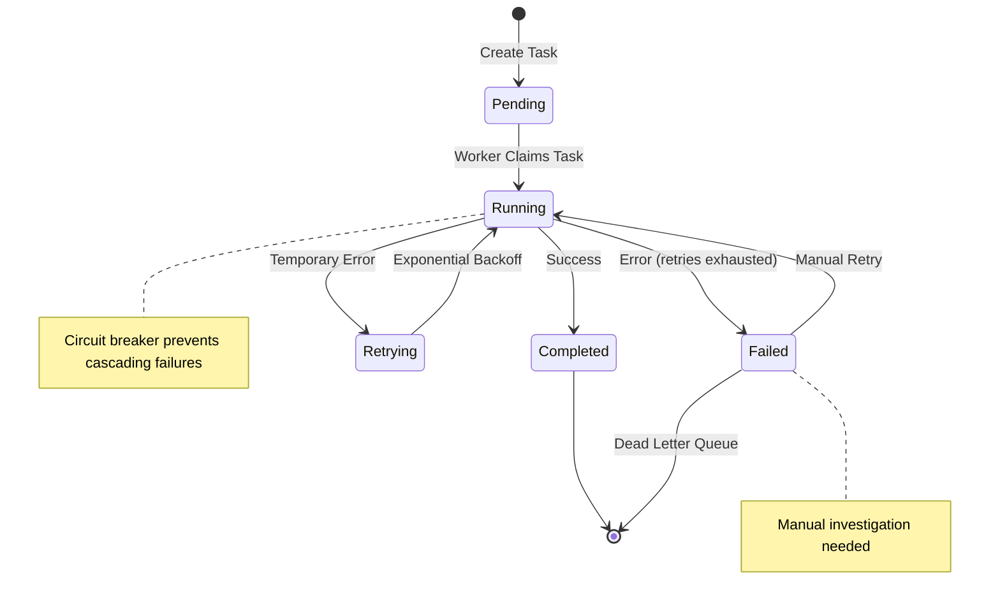

# Implementation Guide

*Deep dive into the core systems: background tasks, user management, testing strategies, and monitoring. This guide covers the implementation patterns that make the application robust and maintainable.*

## 🔄 Background Tasks System

### Why Background Tasks?

**The fundamental conflict**: Users want instant feedback (< 300ms), but real work takes time.

**Solution**: Separate immediate response from eventual completion:
- **HTTP response** - Acknowledge request immediately  
- **Background processing** - Complete work asynchronously with retry logic
- **Status tracking** - Allow users to monitor progress

### Database Queue Architecture

**Why database as queue?**
- **Simplicity** - No additional infrastructure (already have PostgreSQL)
- **Reliability** - ACID transactions, automatic persistence
- **Visibility** - Query tasks directly for debugging
- **Learning value** - Understand queue patterns without broker complexity

### Task Lifecycle



### Task Implementation Pattern

```rust
// 1. Define task handler
pub async fn handle_email_task(
    context: TaskContext,
    pool: &PgPool,
) -> Result<(), TaskError> {
    // Extract fields with helper macros
    let (to, subject, body) = extract_fields!(context.payload, "to", "subject", "body")?;
    let priority = optional_field!(context.payload, "priority").unwrap_or("normal");
    
    // Business logic
    send_email(&to, &subject, &body, priority).await?;
    
    // Log completion
    monitoring::create_event(pool, CreateEventRequest {
        event_type: "log".to_string(),
        source: "email-handler".to_string(),
        message: Some(format!("Email sent to {}", to)),
        level: Some("info".to_string()),
        tags: HashMap::from([("task_id".to_string(), json!(context.task_id))]),
        payload: HashMap::new(),
        recorded_at: None,
    }).await?;
    
    Ok(())
}

// 2. Register handler
async fn register_handlers(registry: &mut TaskRegistry) {
    registry.register("email", handle_email_task).await;
}

// 3. Create tasks via API
POST /api/v1/tasks
{
  "task_type": "email",
  "payload": {
    "to": "user@example.com",
    "subject": "Welcome!",
    "body": "Thanks for signing up"
  },
  "priority": "normal"
}
```

### Reliability Patterns

**Retry Strategy**:
```rust
pub struct RetryStrategy {
    max_attempts: u32,
    base_delay: Duration,
    max_delay: Duration,
    backoff_multiplier: f64,
}

// Exponential backoff with jitter
impl RetryStrategy {
    pub fn next_delay(&self, attempt: u32) -> Duration {
        let delay = self.base_delay.mul_f64(self.backoff_multiplier.powi(attempt as i32));
        let jittered = delay.mul_f64(0.5 + rand::random::<f64>() * 0.5);
        std::cmp::min(jittered, self.max_delay)
    }
}
```

**Circuit Breaker**:
```rust
pub struct CircuitBreaker {
    failure_threshold: u32,
    recovery_timeout: Duration,
    state: CircuitState,
    failure_count: u32,
    last_failure: Option<Instant>,
}

// Prevent cascading failures
match circuit_breaker.call(external_service_call).await {
    Ok(result) => result,
    Err(CircuitBreakerError::Open) => {
        // Service is down, use fallback or queue for later
        return Err(TaskError::ServiceUnavailable);
    }
}
```

## 👥 User Management System

### RBAC Implementation

**3-tier role hierarchy**: User → Moderator → Admin

```rust
// Ownership-based access (recommended pattern)
pub async fn update_task(
    auth_user: AuthUser,
    task_id: Uuid,
    pool: &PgPool,
) -> Result<Task, ApiError> {
    let task = get_task_by_id(pool, task_id).await?;
    
    // Users can access their own resources
    rbac_services::can_access_own_resource(&auth_user, task.created_by)?;
    
    // Update task...
    update_task_service(pool, task_id, updates).await
}

// Role-based access (admin features)
pub async fn get_all_user_tasks(
    auth_user: AuthUser,
    pool: &PgPool,
) -> Result<Vec<Task>, ApiError> {
    // Only moderators+ can see all users' data
    rbac_services::require_moderator_or_higher(&auth_user)?;
    
    get_all_tasks_service(pool).await
}
```

### User Lifecycle Management

**12 endpoints for complete user management**:

```rust
// Self-service endpoints
PUT /api/v1/users/me/profile     // Update own profile
PUT /api/v1/users/me/password    // Change password
GET /api/v1/users/me/profile     // Get own profile
DELETE /api/v1/users/me          // Delete own account

// Moderator+ endpoints
GET /api/v1/users                // List all users
POST /api/v1/users               // Create user (admin only)
PUT /api/v1/users/{id}/role      // Change user role (admin)
PUT /api/v1/users/{id}/status    // Enable/disable user

// Admin analytics
GET /api/v1/admin/users/stats    // User statistics and analytics
```

### Password Security

```rust
pub async fn validate_password_security(password: &str) -> Result<(), ValidationError> {
    // Length requirement
    if password.len() < 8 {
        return Err(ValidationError::TooShort);
    }
    
    // Complexity requirements
    let has_lowercase = password.chars().any(|c| c.is_lowercase());
    let has_uppercase = password.chars().any(|c| c.is_uppercase());
    let has_digit = password.chars().any(|c| c.is_numeric());
    let has_special = password.chars().any(|c| "!@#$%^&*()_+-=[]{}|;:,.<>?".contains(c));
    
    if !(has_lowercase && has_uppercase && has_digit && has_special) {
        return Err(ValidationError::InsufficientComplexity);
    }
    
    // Check against common passwords (timing-attack safe)
    check_common_passwords_constant_time(password).await?;
    
    Ok(())
}
```

## 🧪 Testing Strategy

### Why Integration Tests?

**Testing pyramid inverted for web applications**:
- **90% Integration tests** (182 tests) - HTTP + Database + Business Logic
- **15% Unit tests** (31 tests) - Pure functions, algorithms
- **5% E2E tests** (13 tests) - Critical user journeys

**Rationale**: Web applications fail at component boundaries, not within individual functions.

### Test Architecture

```rust
// Test app pattern - real server instances
#[tokio::test]
async fn test_user_can_create_own_tasks() {
    let app = spawn_app().await;                    // Real HTTP server
    let (user, token) = app.create_authenticated_user("testuser").await;
    
    let task_data = json!({
        "task_type": "email",
        "payload": {"to": "test@example.com", "subject": "Test"}
    });
    
    let response = app.post_json_auth("/api/v1/tasks", &task_data, &token.token).await;
    assert_status(&response, StatusCode::OK);
    
    // Verify task in database with correct ownership
    let created_task = app.get_user_tasks(&user.id).await;
    assert_eq!(created_task.len(), 1);
    assert_eq!(created_task[0].created_by, user.id);
}
```

### Database Isolation

**Each test gets its own PostgreSQL database**:

```rust
pub struct TestApp {
    pub server_url: String,
    pub db_pool: PgPool,
    pub db_name: String,    // Unique per test
}

impl TestApp {
    pub async fn spawn() -> Self {
        let db_name = format!("test_{}", Uuid::new_v4().simple());
        
        // Create isolated database
        let db_pool = create_test_database(&db_name).await;
        
        // Run migrations
        sqlx::migrate!("../migrations").run(&db_pool).await.unwrap();
        
        // Start server with test database
        let server = spawn_server_with_db(db_pool.clone()).await;
        
        Self {
            server_url: format!("http://127.0.0.1:{}", server.port),
            db_pool,
            db_name,
        }
    }
}
```

**Benefits**:
- **Complete isolation** - Tests don't interfere with each other
- **Real database behavior** - Test actual SQL queries, constraints
- **Fast setup** - Template database pattern for 10x speed improvement
- **Parallel execution** - Run tests concurrently without conflicts

### Test Categories

```rust
// Authentication tests - 15 tests
mod auth_tests {
    test_user_registration_success()
    test_login_with_valid_credentials()
    test_session_fixation_prevention()
    test_password_validation_security_edge_cases()
}

// Business logic tests - 145 tests
mod business_logic_tests {
    test_task_creation_and_processing()
    test_rbac_ownership_patterns()
    test_user_management_lifecycle()
    test_monitoring_event_creation()
}

// System behavior tests - 12 tests  
mod system_tests {
    test_health_checks_all_variants()
    test_api_error_handling_consistency()
    test_cors_and_security_headers()
}

// API standards tests - 10 tests
mod api_standards_tests {
    test_openapi_schema_generation()
    test_json_response_consistency()
    test_authentication_required_endpoints()
}
```

## 📊 Monitoring & Observability

### Comprehensive Monitoring System

**4-table schema for complete observability**:
```sql
monitoring_events    -- Logs, traces, alerts
monitoring_metrics   -- Time-series data  
monitoring_incidents -- Outage tracking
monitoring_alerts    -- Rule-based monitoring
```

### Event-Driven Monitoring

```rust
// Log application events
pub async fn create_monitoring_event(
    pool: &PgPool,
    event_type: &str,
    source: &str, 
    message: Option<&str>,
    level: Option<&str>,
    tags: HashMap<String, serde_json::Value>,
) -> Result<Event, MonitoringError> {
    
    // Validate inputs
    validate_event_type(event_type)?;
    validate_source_name(source)?;
    
    // Create event with metadata
    let event = sqlx::query_as!(
        Event,
        r#"
        INSERT INTO monitoring_events (event_type, source, message, level, tags, payload, recorded_at)
        VALUES ($1, $2, $3, $4, $5, $6, COALESCE($7, NOW()))
        RETURNING *
        "#,
        event_type,
        source,
        message,
        level,
        serde_json::to_value(tags)?,
        serde_json::Value::Object(serde_json::Map::new()),
        None::<OffsetDateTime>
    )
    .fetch_one(pool)
    .await?;
    
    Ok(event)
}
```

### Prometheus Integration

```rust
// Export metrics in Prometheus format
GET /api/v1/monitoring/metrics/prometheus

# HELP monitoring_total_events Total number of events in the system
# TYPE monitoring_total_events counter
monitoring_total_events 15420

# HELP task_processing_duration_ms Task processing time
# TYPE task_processing_duration_ms histogram  
task_processing_duration_ms{task_type="email",status="completed"} 245.5 1704454800000
```

### Security & RBAC Integration

**Access control matrix**:
- **Users** - Create events/metrics for owned sources, view own incidents
- **Moderators** - Manage alerts, view all incidents, system statistics
- **Admins** - Full system configuration access

```rust
// Source ownership validation
pub fn validate_source_ownership(user: &AuthUser, source: &str) -> Result<(), RbacError> {
    if user.role >= Role::Moderator {
        return Ok(()); // Moderators+ can use any source
    }
    
    // Users can only use generic sources or user-prefixed sources
    if source.starts_with("system-") || source.starts_with("health-") {
        return Err(RbacError::InsufficientPermission);
    }
    
    if source.starts_with(&format!("{}-", user.username)) {
        return Ok(());
    }
    
    // Allow generic sources
    if ["api", "web", "worker"].contains(&source) {
        return Ok(());
    }
    
    Err(RbacError::UnauthorizedSource)
}
```

### Timeline Reconstruction

**Automatic incident timeline building**:
```rust
pub async fn get_incident_timeline(
    pool: &PgPool,
    incident_id: Uuid,
    limit: Option<i64>,
) -> Result<Vec<Event>, MonitoringError> {
    
    let incident = get_incident_by_id(pool, incident_id).await?;
    
    // Get events from 1 hour before incident start until resolution
    let events = sqlx::query_as!(
        Event,
        r#"
        SELECT * FROM monitoring_events 
        WHERE recorded_at >= $1 
          AND recorded_at <= COALESCE($2, NOW())
        ORDER BY recorded_at ASC
        LIMIT $3
        "#,
        incident.created_at - Duration::hours(1),
        incident.resolved_at,
        limit.unwrap_or(100)
    )
    .fetch_all(pool)
    .await?;
    
    Ok(events)
}
```

## 🔍 Error Handling Patterns

### Custom Error Types

```rust
#[derive(Debug, thiserror::Error)]
pub enum ApiError {
    #[error("Database error: {0}")]
    Database(#[from] sqlx::Error),
    
    #[error("Validation failed: {0}")]
    Validation(String),
    
    #[error("Unauthorized: {message}")]
    Unauthorized { message: String },
    
    #[error("Not found: {resource} with id {id}")]
    NotFound { resource: String, id: String },
    
    #[error("Task processing failed: {0}")]
    TaskProcessing(#[from] TaskError),
}

// Convert to HTTP responses
impl IntoResponse for ApiError {
    fn into_response(self) -> Response {
        let (status, message) = match self {
            ApiError::Validation(msg) => (StatusCode::BAD_REQUEST, msg),
            ApiError::Unauthorized { message } => (StatusCode::UNAUTHORIZED, message),
            ApiError::NotFound { resource, id } => (
                StatusCode::NOT_FOUND, 
                format!("{} with id {} not found", resource, id)
            ),
            _ => (StatusCode::INTERNAL_SERVER_ERROR, "Internal server error".to_string()),
        };
        
        let body = Json(ApiResponse::<()>::error(&message));
        (status, body).into_response()
    }
}
```

### Consistent API Response Format

```rust
#[derive(Debug, Serialize, Deserialize)]
pub struct ApiResponse<T> {
    pub success: bool,
    pub data: Option<T>,
    pub error: Option<String>,
    pub request_id: Option<String>,
}

impl<T> ApiResponse<T> {
    pub fn success(data: T) -> Self {
        Self {
            success: true,
            data: Some(data),
            error: None,
            request_id: None,
        }
    }
    
    pub fn error(message: &str) -> ApiResponse<()> {
        ApiResponse {
            success: false,
            data: None,
            error: Some(message.to_string()),
            request_id: None,
        }
    }
}
```

## 🎯 Key Implementation Principles

### Service Layer Pattern
- **Pure functions** - Easy to test, reason about, and compose
- **Database transactions** - Use `&mut PgConnection` or `&mut PgTransaction`
- **Error propagation** - Use `?` operator with custom error types
- **Separation of concerns** - API handlers delegate to service functions

### Type Safety
- **Domain models** - Separate database entities from API responses
- **Validation at boundaries** - Validate input at API layer
- **Compile-time checks** - SQLx validates queries at compile time
- **OpenAPI integration** - Generate TypeScript types from Rust code

### Security by Default
- **RBAC everywhere** - Check permissions on every operation
- **Input validation** - Validate all user input
- **SQL injection prevention** - Use parameterized queries
- **Session security** - Secure session management with automatic cleanup

---

*This implementation guide provides the patterns and practices needed to build robust, maintainable features. Each system is designed to be understandable, testable, and secure by default.*