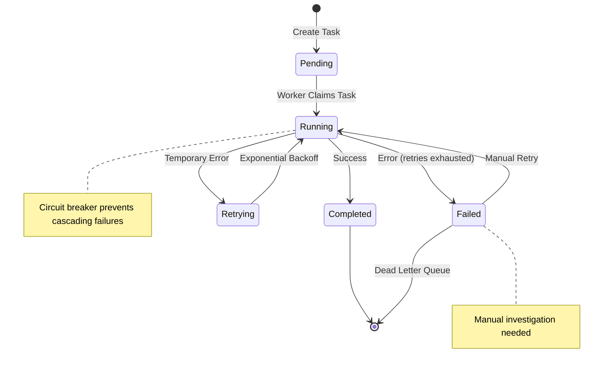

# Implementation Guide

*Deep dive into the core systems: background tasks, user management, testing strategies, and monitoring. This guide covers the implementation patterns that make the application robust and maintainable.*

## 🔄 Background Tasks System

### Why Background Tasks?

**The fundamental conflict**: Users want instant feedback (< 300ms), but real work takes time.

**Solution**: Separate immediate response from eventual completion:
- **HTTP response** - Acknowledge request immediately  
- **Background processing** - Complete work asynchronously with retry logic
- **Status tracking** - Allow users to monitor progress

### Database Queue Architecture

**Why database as queue?**
- **Simplicity** - No additional infrastructure (already have PostgreSQL)
- **Reliability** - ACID transactions, automatic persistence
- **Visibility** - Query tasks directly for debugging
- **Learning value** - Understand queue patterns without broker complexity

### Task Lifecycle



### Task Implementation Pattern

```rust
// 1. Define task handler
pub async fn handle_email_task(
    context: TaskContext,
    pool: &PgPool,
) -> Result<(), TaskError> {
    // Extract fields with helper macros
    let (to, subject, body) = extract_fields!(context.payload, "to", "subject", "body")?;
    let priority = optional_field!(context.payload, "priority").unwrap_or("normal");
    
    // Business logic
    send_email(&to, &subject, &body, priority).await?;
    
    // Log completion
    monitoring::create_event(pool, CreateEventRequest {
        event_type: "log".to_string(),
        source: "email-handler".to_string(),
        message: Some(format!("Email sent to {}", to)),
        level: Some("info".to_string()),
        tags: HashMap::from([("task_id".to_string(), json!(context.task_id))]),
        payload: HashMap::new(),
        recorded_at: None,
    }).await?;
    
    Ok(())
}

// 2. Register handler
async fn register_handlers(registry: &mut TaskRegistry) {
    registry.register("email", handle_email_task).await;
}

// 3. Create tasks via API
POST /api/v1/tasks
{
  "task_type": "email",
  "payload": {
    "to": "user@example.com",
    "subject": "Welcome!",
    "body": "Thanks for signing up"
  },
  "priority": "normal"
}
```

### Reliability Patterns

**Retry Strategy**:
```rust
pub enum RetryStrategy {
    /// Exponential backoff: delay = base_delay * multiplier^attempt
    Exponential {
        base_delay: Duration,
        multiplier: f64,
        max_delay: Duration,
        max_attempts: u32,
    },
    /// Linear backoff: delay = base_delay + (increment * attempt)  
    Linear {
        base_delay: Duration,
        increment: Duration,
        max_delay: Duration,
        max_attempts: u32,
    },
    /// Fixed interval: delay = interval for each retry
    Fixed {
        interval: Duration,
        max_attempts: u32,
    },
    /// No retry
    None,
}

// Calculate next delay based on strategy
impl RetryStrategy {
    pub fn calculate_delay(&self, attempt: u32) -> Option<Duration> {
        match self {
            Self::Exponential { base_delay, multiplier, max_delay, max_attempts } => {
                if attempt >= *max_attempts { return None; }
                let delay = Duration::from_millis(
                    (base_delay.as_millis() as f64 * multiplier.powi(attempt as i32)) as u64
                );
                Some(delay.min(*max_delay))
            }
            Self::Linear { base_delay, increment, max_delay, max_attempts } => {
                if attempt >= *max_attempts { return None; }
                Some((*base_delay + (*increment * attempt)).min(*max_delay))
            }
            Self::Fixed { interval, max_attempts } => {
                if attempt >= *max_attempts { return None; }
                Some(*interval)
            }
            Self::None => None,
        }
    }
}
```

**Circuit Breaker**:
```rust
pub struct CircuitBreaker {
    state: CircuitState,
    failure_count: u32,
    success_count: u32,
    last_failure: Option<Instant>,
    failure_threshold: u32,
    success_threshold: u32,
    timeout: Duration,
}

// Prevent cascading failures
match circuit_breaker.call(external_service_call).await {
    Ok(result) => result,
    Err(CircuitBreakerError::Open) => {
        // Service is down, use fallback or queue for later
        return Err(TaskError::ServiceUnavailable);
    }
}
```

## 👥 User Management System

### RBAC Implementation

**3-tier role hierarchy**: User → Moderator → Admin

```rust
// Ownership-based access (recommended pattern)
pub async fn update_task(
    auth_user: AuthUser,
    task_id: Uuid,
    pool: &PgPool,
) -> Result<Task, ApiError> {
    let task = get_task_by_id(pool, task_id).await?;
    
    // Users can access their own resources
    rbac_services::can_access_own_resource(&auth_user, task.created_by)?;
    
    // Update task...
    update_task_service(pool, task_id, updates).await
}

// Role-based access (admin features)
pub async fn get_all_user_tasks(
    auth_user: AuthUser,
    pool: &PgPool,
) -> Result<Vec<Task>, ApiError> {
    // Only moderators+ can see all users' data
    rbac_services::require_moderator_or_higher(&auth_user)?;
    
    get_all_tasks_service(pool).await
}
```

### User Lifecycle Management

**13 endpoints for complete user management**:

```rust
// Self-service endpoints
GET /api/v1/users/me/profile     // Get own profile
PUT /api/v1/users/me/profile     // Update own profile
PUT /api/v1/users/me/password    // Change password
DELETE /api/v1/users/me          // Delete own account

// Protected endpoints (ownership-based)
GET /api/v1/users/{id}           // Get user by ID (own or admin)

// Moderator endpoints
GET /api/v1/users                // List all users
PUT /api/v1/users/{id}/status    // Enable/disable user
POST /api/v1/users/{id}/reset-password  // Reset user password

// Admin endpoints
POST /api/v1/users               // Create user
PUT /api/v1/users/{id}/profile   // Update user profile
PUT /api/v1/users/{id}/role      // Change user role
DELETE /api/v1/users/{id}        // Delete user

// Admin analytics
GET /api/v1/admin/users/stats    // User statistics and analytics
```

### Password Security

```rust
pub fn validate_password(password: &str) -> Result<()> {
    // Length requirement (8-128 characters)
    if password.len() < 8 {
        return Err(Error::validation(
            "password",
            "Password must be at least 8 characters long",
        ));
    }
    if password.len() > 128 {
        return Err(Error::validation(
            "password", 
            "Password must be less than 128 characters",
        ));
    }

    // Check password strength requirements (3 out of 4 character types)
    let has_upper = password.chars().any(|c| c.is_uppercase());
    let has_lower = password.chars().any(|c| c.is_lowercase());
    let has_digit = password.chars().any(|c| c.is_numeric());
    let has_special = password.chars().any(|c| {
        matches!(c, '!' | '@' | '#' | '$' | '%' | '^' | '&' | '*' | '(' | ')' | '_' | '+' | '-' | '=' | '[' | ']' | '{' | '}' | '|' | ';' | ':' | ',' | '.' | '<' | '>' | '?')
    });

    let strength_count = [has_upper, has_lower, has_digit, has_special]
        .iter()
        .filter(|&&x| x)
        .count();

    if strength_count < 3 {
        return Err(Error::validation(
            "password",
            "Password must contain at least 3 of: uppercase letters, lowercase letters, numbers, special characters",
        ));
    }

    Ok(())
}
```

## 🧪 Testing Strategy

### Why Integration Tests?

**Testing pyramid inverted for web applications**:
- **90% Integration tests** (185 tests) - HTTP + Database + Business Logic
- **15% Unit tests** (31 tests) - Pure functions, algorithms
- **5% E2E tests** (13 tests) - Critical user journeys

**Rationale**: Web applications fail at component boundaries, not within individual functions.

### Test Architecture

```rust
// Test app pattern - real server instances
#[tokio::test]
async fn test_user_can_create_own_tasks() {
    let app = spawn_app().await;                    // Real HTTP server
    let (user, token) = app.create_authenticated_user("testuser").await;
    
    let task_data = json!({
        "task_type": "email",
        "payload": {"to": "test@example.com", "subject": "Test"}
    });
    
    let response = app.post_json_auth("/api/v1/tasks", &task_data, &token.token).await;
    assert_status(&response, StatusCode::OK);
    
    // Verify task in database with correct ownership
    let created_task = app.get_user_tasks(&user.id).await;
    assert_eq!(created_task.len(), 1);
    assert_eq!(created_task[0].created_by, user.id);
}
```

### Database Isolation

**Each test gets its own PostgreSQL database**:

```rust
pub struct TestApp {
    pub address: String,
    pub client: reqwest::Client,
    pub config: AppConfig,
    pub db_pool: PgPool,
}

pub async fn spawn_app() -> TestApp {
        // Initialize tracing for tests
        Lazy::force(&TRACING);

        // Create isolated test database  
        let database = Database::new_with_random_db("test_db").await;
        let config = AppConfig::new_with_database(database.connection_string());
        
        // Start server on random port
        let listener = TcpListener::bind("127.0.0.1:0").await.unwrap();
        let address = format!("http://{}", listener.local_addr().unwrap());
        
        let app = server::create_app(config.clone(), database.pool()).await;
        tokio::spawn(axum::serve(listener, app));

        Self {
            address,
            client: reqwest::Client::builder().redirect(Policy::none()).build().unwrap(),
            config,
            db_pool: database.pool(),
        }
    }
}
```

**Benefits**:
- **Complete isolation** - Tests don't interfere with each other
- **Real database behavior** - Test actual SQL queries, constraints
- **Fast setup** - Template database pattern for 10x speed improvement
- **Parallel execution** - Run tests concurrently without conflicts

### Test Categories

```rust
// Authentication tests - 22 tests
mod auth_tests {
    test_user_registration_success()
    test_login_with_valid_credentials()
    test_session_fixation_prevention()
    test_password_validation_security_edge_cases()
}

// Business logic tests - 106 tests
mod business_logic_tests {
    test_task_creation_and_processing()
    test_rbac_ownership_patterns()
    test_user_management_lifecycle()
    test_monitoring_event_creation()
}

// System behavior tests - 25 tests  
mod system_tests {
    test_health_checks_all_variants()
    test_cli_command_processing()
    test_middleware_functionality()
}

// API standards tests - 14 tests
mod api_standards_tests {
    test_openapi_schema_generation()
    test_json_response_consistency()
    test_authentication_required_endpoints()
}
```

## 📊 Monitoring & Observability

### Comprehensive Monitoring System

**4-table schema for complete observability**:
```sql
events     -- Logs, traces, alerts
metrics    -- Time-series data  
incidents  -- Outage tracking
alerts     -- Rule-based monitoring
```

### Event-Driven Monitoring

```rust
// Log application events
pub async fn create_event(
    conn: &mut DbConn, 
    request: CreateEventRequest
) -> Result<Event> {
    
    // Validate inputs
    validate_event_type(event_type)?;
    validate_source_name(source)?;
    
    // Create event with metadata
    let event = sqlx::query_as!(
        Event,
        r#"
        INSERT INTO events (event_type, source, message, level, tags, payload, recorded_at)
        VALUES ($1, $2, $3, $4, $5, $6, COALESCE($7, NOW()))
        RETURNING *
        "#,
        event_type,
        source,
        message,
        level,
        serde_json::to_value(tags)?,
        serde_json::Value::Object(serde_json::Map::new()),
        None::<OffsetDateTime>
    )
    .fetch_one(pool)
    .await?;
    
    Ok(event)
}
```

### Prometheus Integration

```rust
// Export metrics in Prometheus format
GET /api/v1/monitoring/metrics/prometheus

# HELP monitoring_total_events Total number of events in the system
# TYPE monitoring_total_events counter
monitoring_total_events 15420

# HELP task_processing_duration_ms Task processing time
# TYPE task_processing_duration_ms histogram  
task_processing_duration_ms{task_type="email",status="completed"} 245.5 1704454800000
```

### Security & RBAC Integration

**Access control matrix**:
- **Users** - Create events/metrics for owned sources, view own incidents
- **Moderators** - Manage alerts, view all incidents, system statistics
- **Admins** - Full system configuration access

```rust
// Source authorization validation
fn is_user_authorized_for_source(auth_user: &AuthUser, source: &str) -> Result<bool, Error> {
    // System sources require moderator+ permissions
    if source.starts_with("system-")
        || source.starts_with("health-")
        || source.starts_with("monitoring-")
    {
        return Ok(auth_user
            .role
            .has_role_or_higher(UserRole::Moderator));
    }
    
    // Other sources are allowed for all authenticated users
    Ok(true)
}
```

### Timeline Reconstruction

**Automatic incident timeline building**:
```rust
pub async fn get_incident_timeline(
    conn: &mut DbConn,
    incident_id: Uuid,
    limit: Option<i64>,
    offset: Option<i64>,
    lookback_hours: Option<i64>,
) -> Result<Vec<Event>> {
    
    let incident = get_incident_by_id(pool, incident_id).await?;
    
    // Get events from 1 hour before incident start until resolution
    let events = sqlx::query_as!(
        Event,
        r#"
        SELECT * FROM events 
        WHERE recorded_at >= $1 
          AND recorded_at <= COALESCE($2, NOW())
        ORDER BY recorded_at ASC
        LIMIT $3
        "#,
        incident.created_at - Duration::hours(1),
        incident.resolved_at,
        limit.unwrap_or(100)
    )
    .fetch_all(pool)
    .await?;
    
    Ok(events)
}
```

## 🔍 Error Handling Patterns

### Custom Error Types

```rust
#[derive(Error, Debug)]
pub enum Error {
    #[error("Database error: {0}")]
    Database(#[from] sqlx::Error),

    #[error("Unauthorized access")]
    Unauthorized,

    #[error("Forbidden: {0}")]
    Forbidden(String),

    #[error("Validation failed for {field}: {message}")]
    ValidationError { field: String, message: String },

    #[error("Not found: {0}")]
    NotFound(String),

    #[error("User not found")]
    UserNotFound,

    #[error("Conflict: {0}")]
    Conflict(String),

    #[error("Internal error: {0}")]
    Internal(String),

    #[error("Task execution failed: {0}")]
    TaskExecutionFailed(String),
}

// Convert to HTTP responses
impl IntoResponse for Error {
    fn into_response(self) -> Response {
        let (status, error_message, error_code) = match &self {
            Error::ValidationError { field, message } => (
                StatusCode::BAD_REQUEST,
                format!("Validation failed for {field}: {message}"),
                "VALIDATION_FAILED",
            ),
            Error::Unauthorized => (
                StatusCode::UNAUTHORIZED,
                "Unauthorized access".to_string(),
                "UNAUTHORIZED",
            ),
            Error::NotFound(msg) => (StatusCode::NOT_FOUND, msg.clone(), "NOT_FOUND"),
            _ => (StatusCode::INTERNAL_SERVER_ERROR, "Internal server error".to_string(), "INTERNAL_ERROR"),
        };

        let body = Json(json!({
            "error": {
                "code": error_code,
                "message": error_message,
            }
        }));

        (status, body).into_response()
    }
}
```

### Consistent API Response Format

```rust
#[derive(Debug, serde::Serialize, utoipa::ToSchema)]
pub struct ApiResponse<T> {
    pub success: bool,
    pub data: Option<T>,
    pub message: Option<String>,
}

impl<T> ApiResponse<T> {
    pub fn success(data: T) -> Self {
        Self {
            success: true,
            data: Some(data),
            message: None,
        }
    }

    pub fn success_with_message(data: T, message: String) -> Self {
        Self {
            success: true,
            data: Some(data),
            message: Some(message),
        }
    }
}

// Error responses use separate ErrorResponse struct
#[derive(Debug, serde::Serialize, utoipa::ToSchema)]
pub struct ErrorResponse {
    pub error: ErrorDetail,
}

#[derive(Debug, serde::Serialize, utoipa::ToSchema)]
pub struct ErrorDetail {
    pub code: String,
    pub message: String,
}
```

## 🎯 Key Implementation Principles

### Service Layer Pattern
- **Pure functions** - Easy to test, reason about, and compose
- **Database transactions** - Use `&mut PgConnection` or `&mut PgTransaction`
- **Error propagation** - Use `?` operator with custom error types
- **Separation of concerns** - API handlers delegate to service functions

### Type Safety
- **Domain models** - Separate database entities from API responses
- **Validation at boundaries** - Validate input at API layer
- **Compile-time checks** - SQLx validates queries at compile time
- **OpenAPI integration** - Generate TypeScript types from Rust code

### Security by Default
- **RBAC everywhere** - Check permissions on every operation
- **Input validation** - Validate all user input
- **SQL injection prevention** - Use parameterized queries
- **Session security** - Secure session management with automatic cleanup

---

*This implementation guide provides the patterns and practices needed to build robust, maintainable features. Each system is designed to be understandable, testable, and secure by default.*