# Production Deployment

*Complete guide for deploying to production with Docker, environment configuration, security hardening, and operational best practices.*

## 🚀 Quick Production Deployment

### 1-Minute Deploy
```bash
# Copy and configure production environment
cp .env.prod.example .env.prod
nano .env.prod  # ⚠️ CRITICAL: Change all passwords and secrets

# Deploy with automated script
./scripts/deploy-prod.sh

# Or manually
docker-compose -f docker-compose.prod.yaml --env-file .env.prod up -d
```

**Result**: Complete production system with database, web app, API, worker, and reverse proxy.

## 🏗️ Production Architecture

### Single Binary Deployment

```mermaid
graph TD
    subgraph "🌐 Internet"
        USERS[👥 Users]
        APIS[🔌 External APIs]
    end
    
    subgraph "🐳 Docker Compose Stack"
        NGINX[🌐 Nginx<br/>Reverse Proxy<br/>SSL Termination]
        
        subgraph "📱 Application Layer"
            SERVER[🦀 Server Mode<br/>HTTP + Static Files<br/>Port 3000]
            WORKER[⚙️ Worker Mode<br/>Background Tasks<br/>Same Binary]
        end
        
        subgraph "💾 Data Layer"
            POSTGRES[(🗄️ PostgreSQL<br/>Persistent Volume<br/>Automated Backups)]
            REDIS[(⚡ Redis<br/>Session Storage<br/>Task Queue)]
        end
    end
    
    USERS --> NGINX
    NGINX --> SERVER
    SERVER --> POSTGRES
    WORKER --> POSTGRES
    SERVER <--> REDIS
    WORKER <--> REDIS
    WORKER --> APIS
    
    classDef proxy fill:#e3f2fd,stroke:#0277bd,stroke-width:2px
    classDef app fill:#e8f5e8,stroke:#1b5e20,stroke-width:2px
    classDef data fill:#fce4ec,stroke:#c2185b,stroke-width:2px
    
    class NGINX proxy
    class SERVER,WORKER app
    class POSTGRES,REDIS data
```



### Multi-Stage Docker Build

**Optimized for security and size**:

```dockerfile
# Stage 1: Build environment
FROM rust:1.75 as builder
WORKDIR /app
COPY . .
RUN cargo build --release --locked

# Stage 2: Runtime (distroless)
FROM gcr.io/distroless/cc-debian12
COPY --from=builder /app/target/release/starter /usr/local/bin/starter
COPY --from=builder /app/web/dist /usr/local/share/web

# Security: Non-root user
USER 1001:1001
EXPOSE 3000

HEALTHCHECK --interval=30s --timeout=10s --start-period=5s --retries=3 \
  CMD ["/usr/local/bin/starter", "health-check"]

ENTRYPOINT ["/usr/local/bin/starter"]
```

**Benefits**:
- **Small size**: ~50MB runtime image (vs 1GB+ with full OS)
- **Security**: Minimal attack surface, no shell, no package manager
- **Performance**: Fast startup, low memory overhead
- **Standards**: Follows Docker best practices

## ⚙️ Environment Configuration

### Production Environment Variables

```bash
# .env.prod - Production configuration template
# ⚠️ CRITICAL: Change all passwords and secrets before deploying!

# Application Settings
STARTER__SERVER__HOST=0.0.0.0
STARTER__SERVER__PORT=3000
STARTER__SERVER__CORS_ORIGINS="https://yourdomain.com"

# Database (Use strong passwords!)
STARTER__DATABASE__HOST=postgres
STARTER__DATABASE__PORT=5432
STARTER__DATABASE__DATABASE=starter_prod
STARTER__DATABASE__USER=starter_prod_user
STARTER__DATABASE__PASSWORD=your_very_secure_database_password_here
STARTER__DATABASE__MAX_CONNECTIONS=20
STARTER__DATABASE__MIN_CONNECTIONS=5

# Initial Admin Account (Remove after first login!)
STARTER__INITIAL_ADMIN_PASSWORD=your_temporary_admin_password_here

# Security Settings
STARTER__AUTH__SESSION_TIMEOUT_HOURS=24
STARTER__AUTH__MAX_LOGIN_ATTEMPTS=5
STARTER__AUTH__LOCKOUT_DURATION_MINUTES=15

# Task Processing
STARTER__TASKS__MAX_RETRIES=3
STARTER__TASKS__DEFAULT_TIMEOUT_SECONDS=300
STARTER__TASKS__BATCH_SIZE=10

# Monitoring
STARTER__MONITORING__RETENTION_DAYS=30
STARTER__MONITORING__METRICS_ENABLED=true

# PostgreSQL Settings (for Docker Compose)
POSTGRES_DB=starter_prod
POSTGRES_USER=starter_prod_user
POSTGRES_PASSWORD=your_very_secure_database_password_here

# Nginx Settings
NGINX_SERVER_NAME=yourdomain.com
SSL_EMAIL=admin@yourdomain.com
```

### Security Configuration Checklist

**✅ Required Changes**:
- [ ] Change all database passwords
- [ ] Set strong initial admin password
- [ ] Update CORS origins to your domain
- [ ] Configure SSL email for Let's Encrypt
- [ ] Remove default secrets and tokens

**✅ Optional Hardening**:
- [ ] Enable rate limiting in Nginx
- [ ] Configure fail2ban
- [ ] Set up database backups
- [ ] Configure log rotation
- [ ] Enable security headers

## 🐳 Docker Compose Production

### Complete Stack Configuration

```yaml
# docker-compose.prod.yaml
version: '3.8'

services:
  postgres:
    image: postgres:15-alpine
    environment:
      POSTGRES_DB: ${POSTGRES_DB}
      POSTGRES_USER: ${POSTGRES_USER}
      POSTGRES_PASSWORD: ${POSTGRES_PASSWORD}
    volumes:
      - postgres_data:/var/lib/postgresql/data
      - ./backups:/backups
    networks:
      - app-network
    healthcheck:
      test: ["CMD-SHELL", "pg_isready -U ${POSTGRES_USER} -d ${POSTGRES_DB}"]
      interval: 30s
      timeout: 10s
      retries: 3

  app-server:
    build:
      context: .
      dockerfile: Dockerfile.prod
    environment:
      - STARTER__MODE=server
    env_file:
      - .env.prod
    depends_on:
      postgres:
        condition: service_healthy
    networks:
      - app-network
    healthcheck:
      test: ["CMD", "/usr/local/bin/starter", "health-check"]
      interval: 30s
      timeout: 10s
      retries: 3

  app-worker:
    build:
      context: .
      dockerfile: Dockerfile.prod
    environment:
      - STARTER__MODE=worker
    env_file:
      - .env.prod
    depends_on:
      postgres:
        condition: service_healthy
    networks:
      - app-network
    deploy:
      replicas: 2

  nginx:
    image: nginx:alpine
    ports:
      - "80:80"
      - "443:443"
    volumes:
      - ./nginx/prod.conf:/etc/nginx/nginx.conf:ro
      - ./ssl:/etc/ssl/certs:ro
    depends_on:
      app-server:
        condition: service_healthy
    networks:
      - app-network

volumes:
  postgres_data:

networks:
  app-network:
    driver: bridge
```

### Automated Deployment Script

```bash
#!/bin/bash
# scripts/deploy-prod.sh

set -euo pipefail

echo "🚀 Starting production deployment..."

# 1. Validate environment
if [[ ! -f .env.prod ]]; then
    echo "❌ Error: .env.prod not found. Copy from .env.prod.example"
    exit 1
fi

source .env.prod

if [[ "${POSTGRES_PASSWORD}" == "change_this_password" ]]; then
    echo "❌ Error: Default passwords detected. Update .env.prod!"
    exit 1
fi

# 2. Backup database (if exists)
if docker-compose -f docker-compose.prod.yaml ps postgres | grep -q "Up"; then
    echo "💾 Creating database backup..."
    docker-compose -f docker-compose.prod.yaml exec postgres \
        pg_dump -U ${POSTGRES_USER} ${POSTGRES_DB} > "backups/backup_$(date +%Y%m%d_%H%M%S).sql"
fi

# 3. Build and deploy
echo "🏗️ Building Docker images..."
docker-compose -f docker-compose.prod.yaml build

echo "🐳 Starting services..."
docker-compose -f docker-compose.prod.yaml up -d

# 4. Wait for services
echo "⏳ Waiting for services to be healthy..."
timeout 120 docker-compose -f docker-compose.prod.yaml exec app-server \
    /usr/local/bin/starter health-check

# 5. Verify deployment
echo "✅ Verifying deployment..."
curl -f http://localhost/api/v1/health || {
    echo "❌ Health check failed. Rolling back..."
    docker-compose -f docker-compose.prod.yaml down
    exit 1
}

echo "🎉 Production deployment complete!"
echo "🌐 Application: https://${NGINX_SERVER_NAME}"
echo "📊 API Docs: https://${NGINX_SERVER_NAME}/api-docs"
echo "💓 Health: https://${NGINX_SERVER_NAME}/api/v1/health"
```

## 🔒 Security Hardening

### SSL/TLS Configuration

**Nginx SSL configuration**:
```nginx
# nginx/prod.conf
server {
    listen 443 ssl http2;
    server_name yourdomain.com;

    # SSL Configuration
    ssl_certificate /etc/ssl/certs/fullchain.pem;
    ssl_certificate_key /etc/ssl/certs/privkey.pem;
    ssl_protocols TLSv1.2 TLSv1.3;
    ssl_ciphers HIGH:!aNULL:!MD5;
    ssl_prefer_server_ciphers on;

    # Security Headers
    add_header X-Frame-Options "SAMEORIGIN" always;
    add_header X-Content-Type-Options "nosniff" always;
    add_header X-XSS-Protection "1; mode=block" always;
    add_header Referrer-Policy "strict-origin-when-cross-origin" always;
    add_header Content-Security-Policy "default-src 'self'" always;

    # Rate Limiting
    limit_req_zone $binary_remote_addr zone=api:10m rate=10r/s;
    limit_req zone=api burst=20 nodelay;

    # Proxy Configuration
    location / {
        proxy_pass http://app-server:3000;
        proxy_set_header Host $host;
        proxy_set_header X-Real-IP $remote_addr;
        proxy_set_header X-Forwarded-For $proxy_add_x_forwarded_for;
        proxy_set_header X-Forwarded-Proto $scheme;
        
        # Timeouts
        proxy_connect_timeout 60s;
        proxy_send_timeout 60s;
        proxy_read_timeout 60s;
    }
}
```

### Database Security

**PostgreSQL hardening**:
```sql
-- Create limited application user
CREATE USER app_user WITH ENCRYPTED PASSWORD 'strong_password_here';

-- Grant minimal required permissions
GRANT CONNECT ON DATABASE starter_prod TO app_user;
GRANT USAGE ON SCHEMA public TO app_user;
GRANT SELECT, INSERT, UPDATE, DELETE ON ALL TABLES IN SCHEMA public TO app_user;
GRANT USAGE ON ALL SEQUENCES IN SCHEMA public TO app_user;

-- Revoke dangerous permissions
REVOKE ALL ON SCHEMA public FROM PUBLIC;
REVOKE CREATE ON SCHEMA public FROM app_user;
```

## 📊 Monitoring & Operations

### Health Checks

**Application health endpoints**:
```bash
# Basic health
curl https://yourdomain.com/api/v1/health

# Detailed system status
curl https://yourdomain.com/api/v1/health/detailed

# Kubernetes-style probes
curl https://yourdomain.com/api/v1/health/live    # Liveness
curl https://yourdomain.com/api/v1/health/ready   # Readiness
curl https://yourdomain.com/api/v1/health/startup # Startup
```

### Prometheus Monitoring

**Metrics collection**:
```yaml
# prometheus.yml
global:
  scrape_interval: 15s

scrape_configs:
  - job_name: 'rust-fullstack-starter'
    static_configs:
      - targets: ['app-server:3000']
    metrics_path: '/api/v1/monitoring/metrics/prometheus'
    scrape_interval: 30s
```

### Log Management

**Centralized logging with Docker**:
```yaml
# docker-compose.prod.yaml (logging section)
services:
  app-server:
    logging:
      driver: "json-file"
      options:
        max-size: "100m"
        max-file: "3"
        tag: "app-server"

  app-worker:
    logging:
      driver: "json-file"
      options:
        max-size: "100m"
        max-file: "3"
        tag: "app-worker"
```

### Backup Strategy

**Automated database backups**:
```bash
#!/bin/bash
# scripts/backup-db.sh

BACKUP_DIR="/backups"
TIMESTAMP=$(date +%Y%m%d_%H%M%S)
BACKUP_FILE="$BACKUP_DIR/backup_$TIMESTAMP.sql"

# Create backup
docker-compose exec postgres pg_dump -U $POSTGRES_USER $POSTGRES_DB > $BACKUP_FILE

# Compress
gzip $BACKUP_FILE

# Keep only last 7 days
find $BACKUP_DIR -name "backup_*.sql.gz" -mtime +7 -delete

echo "✅ Backup created: $BACKUP_FILE.gz"
```

## 🚀 Scaling & Performance

### Horizontal Scaling

**Scale workers independently**:
```bash
# Scale workers for high load
docker-compose -f docker-compose.prod.yaml up -d --scale app-worker=5

# Scale back during low load
docker-compose -f docker-compose.prod.yaml up -d --scale app-worker=2
```

### Database Optimization

**Production PostgreSQL settings**:
```conf
# postgresql.conf
shared_buffers = 256MB
effective_cache_size = 1GB
maintenance_work_mem = 64MB
wal_buffers = 16MB
max_connections = 100
work_mem = 4MB

# Enable logging for slow queries
log_min_duration_statement = 1000
log_line_prefix = '[%t] %u@%d '
```

### Resource Limits

**Container resource constraints**:
```yaml
services:
  app-server:
    deploy:
      resources:
        limits:
          memory: 512M
          cpus: '0.5'
        reservations:
          memory: 256M
          cpus: '0.25'

  app-worker:
    deploy:
      resources:
        limits:
          memory: 1G
          cpus: '1.0'
        reservations:
          memory: 512M
          cpus: '0.5'
```

## 🔧 Troubleshooting Production

### Common Issues

**Service won't start**:
```bash
# Check logs
docker-compose -f docker-compose.prod.yaml logs app-server

# Check environment
docker-compose -f docker-compose.prod.yaml exec app-server env

# Test configuration
docker-compose -f docker-compose.prod.yaml exec app-server \
    /usr/local/bin/starter --help
```

**Database connection issues**:
```bash
# Test database connectivity
docker-compose -f docker-compose.prod.yaml exec app-server \
    nc -zv postgres 5432

# Check database logs
docker-compose -f docker-compose.prod.yaml logs postgres
```

**SSL certificate issues**:
```bash
# Test SSL configuration
openssl s_client -connect yourdomain.com:443 -servername yourdomain.com

# Check certificate expiry
echo | openssl s_client -connect yourdomain.com:443 2>/dev/null | \
    openssl x509 -noout -dates
```

## 🎯 Production Checklist

### Pre-Deployment
- [ ] Environment variables configured
- [ ] Secrets and passwords changed
- [ ] SSL certificates obtained
- [ ] Database backups tested
- [ ] Monitoring configured
- [ ] Log rotation configured

### Post-Deployment  
- [ ] Health checks passing
- [ ] SSL certificate valid
- [ ] Database connectivity verified
- [ ] Worker processes running
- [ ] Monitoring metrics flowing
- [ ] Backup schedule verified
- [ ] Security headers configured
- [ ] Rate limiting active

---

*This production deployment provides a solid foundation for running the application at scale with proper security, monitoring, and operational practices.*