# Production Deployment

*Complete guide for deploying to production with Docker, environment configuration, security hardening, and operational best practices.*

## 🚀 Quick Production Deployment

### 1-Minute Deploy
```bash
# Copy and configure production environment
cp .env.example .env.prod
nano .env.prod  # ⚠️ CRITICAL: Change all passwords and secrets

# Create required directories
mkdir -p backups nginx/ssl

# Deploy with automated script
./scripts/deploy-prod.sh

# Or manually
docker-compose -f docker-compose.prod.yaml --env-file .env.prod up -d
```

**Result**: Complete production system with database, web app, API, worker, and reverse proxy.

## 🏗️ Production Architecture

### Single Binary Deployment

```mermaid
graph TD
    subgraph "🌐 Internet"
        USERS[👥 Users]
        APIS[🔌 External APIs]
    end
    
    subgraph "🐳 Docker Compose Stack"
        NGINX[🌐 Nginx<br/>Reverse Proxy<br/>SSL Termination]
        
        subgraph "📱 Application Layer"
            SERVER[🦀 Server Mode<br/>HTTP + Static Files<br/>Port 3000]
            WORKER[⚙️ Worker Mode<br/>Background Tasks<br/>Same Binary]
        end
        
        subgraph "💾 Data Layer"
            POSTGRES[(🗄️ PostgreSQL<br/>Persistent Volume<br/>Automated Backups)]
            REDIS[(⚡ Redis<br/>Session Storage<br/>Task Queue)]
        end
    end
    
    USERS --> NGINX
    NGINX --> SERVER
    SERVER --> POSTGRES
    WORKER --> POSTGRES
    SERVER <--> REDIS
    WORKER <--> REDIS
    WORKER --> APIS
    
    classDef proxy fill:#e3f2fd,stroke:#0277bd,stroke-width:2px
    classDef app fill:#e8f5e8,stroke:#1b5e20,stroke-width:2px
    classDef data fill:#fce4ec,stroke:#c2185b,stroke-width:2px
    
    class NGINX proxy
    class SERVER,WORKER app
    class POSTGRES,REDIS data
```



### Multi-Stage Docker Build

**Optimized for security and size**:

```dockerfile
# Stage 1: Build environment
FROM rust:1.75 as builder
WORKDIR /app
COPY . .
RUN cargo build --release --locked

# Stage 2: Runtime (distroless)
FROM gcr.io/distroless/cc-debian12
COPY --from=builder /app/target/release/starter /usr/local/bin/starter
COPY --from=builder /app/web/dist /usr/local/share/web

# Security: Non-root user
USER 1001:1001
EXPOSE 3000

HEALTHCHECK --interval=30s --timeout=10s --start-period=5s --retries=3 \
  CMD ["/usr/local/bin/starter", "health-check"]

ENTRYPOINT ["/usr/local/bin/starter"]
```

**Benefits**:
- **Small size**: ~50MB runtime image (vs 1GB+ with full OS)
- **Security**: Minimal attack surface, no shell, no package manager
- **Performance**: Fast startup, low memory overhead
- **Standards**: Follows Docker best practices

## ⚙️ Environment Configuration

### Production Environment Variables

```bash
# .env.prod - Production configuration template
# ⚠️ CRITICAL: Change all passwords and secrets before deploying!
# Copy from .env.prod.example and customize

# Application Configuration
APP_PORT=3000
RUST_LOG=info
RUST_BACKTRACE=0

# Database Configuration (Use strong passwords!)
POSTGRES_DB=starter_prod
POSTGRES_USER=starter_user
POSTGRES_PASSWORD=your_very_secure_database_password_here
POSTGRES_PORT=5432

# Session Security (REQUIRED - Generate strong secrets)
SESSION_SECRET=your_64_character_secret_for_session_signing_change_this_now
SESSION_DURATION=86400

# Worker Configuration  
WORKER_CONCURRENCY=4
WORKER_POLL_INTERVAL=5000

# Nginx Configuration (if using nginx profile)
NGINX_PORT=80
NGINX_SSL_PORT=443

# Optional: External Services
# SMTP_HOST=smtp.example.com
# SMTP_PORT=587
# SMTP_USERNAME=your_email@example.com
# SMTP_PASSWORD=your_app_password
# WEBHOOK_SECRET=your_webhook_secret
```

### Security Configuration Checklist

**✅ Required Changes**:
- [ ] Change all database passwords from defaults
- [ ] Generate strong SESSION_SECRET (64+ characters)
- [ ] Set initial admin password in app config (STARTER__INITIAL_ADMIN_PASSWORD)
- [ ] Configure appropriate CORS origins in application settings
- [ ] Update all default passwords in .env.prod

**✅ Optional Hardening**:
- [ ] Enable rate limiting in Nginx
- [ ] Configure fail2ban
- [ ] Set up database backups
- [ ] Configure log rotation
- [ ] Enable security headers

## 🐳 Docker Compose Production

### Complete Stack Configuration

```yaml
# docker-compose.prod.yaml (simplified excerpt)
# See full file in project root

services:
  app:
    build:
      context: .
      dockerfile: Dockerfile.prod
    ports:
      - "${APP_PORT:-3000}:3000"
    environment:
      # Database configuration
      - STARTER__DATABASE__HOST=postgres
      - STARTER__DATABASE__PASSWORD=${POSTGRES_PASSWORD}
      # Application configuration  
      - STARTER__SERVER__HOST=0.0.0.0
      - STARTER__SERVER__PORT=3000
    restart: unless-stopped
    depends_on:
      postgres:
        condition: service_healthy
    networks:
      - app-network
    healthcheck:
      test: ["CMD", "/usr/local/bin/starter", "health-check"]
      interval: 30s
      timeout: 10s
      retries: 3

  app-worker:
    build:
      context: .
      dockerfile: Dockerfile.prod
    environment:
      - STARTER__MODE=worker
    env_file:
      - .env.prod
    depends_on:
      postgres:
        condition: service_healthy
    networks:
      - app-network
      
  worker:
    # Same build as app but runs worker mode
    # Scale workers using: --scale worker=N
    
  postgres:
    image: postgres:17-alpine
    environment:
      POSTGRES_DB: ${POSTGRES_DB}
      POSTGRES_USER: ${POSTGRES_USER}
      POSTGRES_PASSWORD: ${POSTGRES_PASSWORD}
    volumes:
      - postgres_data:/var/lib/postgresql/data
    networks:
      - app-network

  nginx:
    image: nginx:alpine
    ports:
      - "${NGINX_PORT:-80}:80"
      - "${NGINX_SSL_PORT:-443}:443"
    volumes:
      - ./nginx/nginx.conf:/etc/nginx/nginx.conf:ro
      - ./nginx/ssl:/etc/nginx/ssl:ro
    depends_on:
      - app
    networks:
      - app-network

volumes:
  postgres_data:

networks:
  app-network:
    driver: bridge
```

### Automated Deployment Script

The repository includes `./scripts/deploy-prod.sh` with:

- **Environment validation**: Checks for required files and variables
- **Password security**: Prevents deployment with default passwords  
- **Database backup**: Creates backups before updates
- **Health monitoring**: Waits for services to be healthy
- **Rollback capability**: Automatically rolls back on failure

Key features from the real script:
```bash
# Basic usage
./scripts/deploy-prod.sh

# The script validates:
# - .env.prod exists and has required variables
# - Passwords are changed from defaults  
# - Services become healthy after deployment
# - Health endpoints respond correctly
```

**Important**: Always review and test the deployment script in a staging environment first.

## 🔒 Security Hardening

### SSL/TLS Configuration

**Nginx SSL configuration** (from `nginx/nginx.conf`):
```nginx
server {
    listen 443 ssl http2;
    server_name _;

    # SSL Configuration  
    ssl_certificate /etc/nginx/ssl/cert.pem;
    ssl_certificate_key /etc/nginx/ssl/key.pem;
    ssl_protocols TLSv1.2 TLSv1.3;
    ssl_ciphers ECDHE-ECDSA-AES128-GCM-SHA256:ECDHE-RSA-AES128-GCM-SHA256;
    ssl_prefer_server_ciphers off;

    # Security Headers
    add_header Strict-Transport-Security "max-age=63072000" always;
    add_header X-Content-Type-Options nosniff;
    add_header X-Frame-Options DENY;
    add_header X-XSS-Protection "1; mode=block";
    add_header X-Frame-Options "SAMEORIGIN" always;
    add_header X-Content-Type-Options "nosniff" always;
    add_header X-XSS-Protection "1; mode=block" always;
    add_header Referrer-Policy "strict-origin-when-cross-origin" always;
    add_header Content-Security-Policy "default-src 'self'" always;

    # Rate Limiting
    limit_req_zone $binary_remote_addr zone=api:10m rate=10r/s;
    limit_req zone=api burst=20 nodelay;

    # Proxy Configuration
    location / {
        proxy_pass http://app-server:3000;
        proxy_set_header Host $host;
        proxy_set_header X-Real-IP $remote_addr;
        proxy_set_header X-Forwarded-For $proxy_add_x_forwarded_for;
        proxy_set_header X-Forwarded-Proto $scheme;
        
        # Timeouts
        proxy_connect_timeout 60s;
        proxy_send_timeout 60s;
        proxy_read_timeout 60s;
    }
}
```

### Database Security

**PostgreSQL hardening**:
```sql
-- Create limited application user
CREATE USER app_user WITH ENCRYPTED PASSWORD 'strong_password_here';

-- Grant minimal required permissions
GRANT CONNECT ON DATABASE starter_prod TO app_user;
GRANT USAGE ON SCHEMA public TO app_user;
GRANT SELECT, INSERT, UPDATE, DELETE ON ALL TABLES IN SCHEMA public TO app_user;
GRANT USAGE ON ALL SEQUENCES IN SCHEMA public TO app_user;

-- Revoke dangerous permissions
REVOKE ALL ON SCHEMA public FROM PUBLIC;
REVOKE CREATE ON SCHEMA public FROM app_user;
```

## 📊 Monitoring & Operations

### Health Checks

**Application health endpoints**:
```bash
# Basic health
curl https://yourdomain.com/api/v1/health

# Detailed system status
curl https://yourdomain.com/api/v1/health/detailed

# Kubernetes-style probes
curl https://yourdomain.com/api/v1/health/live    # Liveness
curl https://yourdomain.com/api/v1/health/ready   # Readiness
curl https://yourdomain.com/api/v1/health/startup # Startup
```

### Prometheus Monitoring

**Metrics collection**:
```yaml
# prometheus.yml
global:
  scrape_interval: 15s

scrape_configs:
  - job_name: 'rust-fullstack-starter'
    static_configs:
      - targets: ['app:3000']
    metrics_path: '/api/v1/monitoring/metrics/prometheus'
    scrape_interval: 30s
```

### Log Management

**Centralized logging with Docker**:
```yaml
# docker-compose.prod.yaml (logging section)
services:
  app:
    logging:
      driver: "json-file"
      options:
        max-size: "100m"
        max-file: "3"
        tag: "app"

  worker:
    logging:
      driver: "json-file"
      options:
        max-size: "100m"
        max-file: "3"
        tag: "worker"
```

### Backup Strategy

**Automated database backups** (from `scripts/backup-db.sh`):

The repository includes a production-ready backup script that:
- Runs inside the postgres container
- Creates compressed backups with timestamps
- Automatically cleans up old backups
- Provides detailed logging and error handling

```bash
# Manual backup
docker compose -f docker-compose.prod.yaml exec postgres /usr/local/bin/backup-db.sh

# Automated backup (run via cron)
0 2 * * * docker compose -f docker-compose.prod.yaml exec postgres /usr/local/bin/backup-db.sh
```

## 🚀 Scaling & Performance

### Horizontal Scaling

**Scale workers independently**:
```bash
# Scale workers for high load
docker compose -f docker-compose.prod.yaml up -d --scale worker=5

# Scale back during low load
docker compose -f docker-compose.prod.yaml up -d --scale worker=2
```

### Database Optimization

**Production PostgreSQL settings**:
```conf
# postgresql.conf
shared_buffers = 256MB
effective_cache_size = 1GB
maintenance_work_mem = 64MB
wal_buffers = 16MB
max_connections = 100
work_mem = 4MB

# Enable logging for slow queries
log_min_duration_statement = 1000
log_line_prefix = '[%t] %u@%d '
```

### Resource Limits

**Container resource constraints**:
```yaml
services:
  app:
    deploy:
      resources:
        limits:
          memory: 512M
          cpus: '0.5'
        reservations:
          memory: 256M
          cpus: '0.25'

  worker:
    deploy:
      resources:
        limits:
          memory: 256M
          cpus: '0.5'
        reservations:
          memory: 128M
          cpus: '0.25'
```

## 🔧 Troubleshooting Production

### Common Issues

**Service won't start**:
```bash
# Check logs
docker compose -f docker-compose.prod.yaml logs app

# Check environment
docker compose -f docker-compose.prod.yaml exec app env

# Test configuration
docker compose -f docker-compose.prod.yaml exec app \
    ./starter --help
```

**Database connection issues**:
```bash
# Test database connectivity
docker compose -f docker-compose.prod.yaml exec app \
    nc -zv postgres 5432

# Check database logs
docker compose -f docker-compose.prod.yaml logs postgres
```

**SSL certificate issues**:
```bash
# Test SSL configuration
openssl s_client -connect yourdomain.com:443 -servername yourdomain.com

# Check certificate expiry
echo | openssl s_client -connect yourdomain.com:443 2>/dev/null | \
    openssl x509 -noout -dates
```

## 🎯 Production Checklist

### Pre-Deployment
- [ ] Environment variables configured
- [ ] Secrets and passwords changed
- [ ] SSL certificates obtained
- [ ] Database backups tested
- [ ] Monitoring configured
- [ ] Log rotation configured

### Post-Deployment  
- [ ] Health checks passing
- [ ] SSL certificate valid
- [ ] Database connectivity verified
- [ ] Worker processes running
- [ ] Monitoring metrics flowing
- [ ] Backup schedule verified
- [ ] Security headers configured
- [ ] Rate limiting active

---

*This production deployment provides a solid foundation for running the application at scale with proper security, monitoring, and operational practices.*