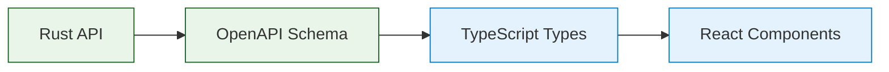

# Documentation

*Complete guides for the Rust Full-Stack Starter - from quick setup to production deployment.*

## 🚀 Quick Navigation

| Guide | What It Covers | Time Needed |
|-------|---------------|-------------|
| **[QUICK-START](QUICK-START.md)** | 2-minute setup, development commands, troubleshooting basics | 10 minutes |
| **[ARCHITECTURE-GUIDE](ARCHITECTURE-GUIDE.md)** | System design, database architecture, design philosophy | 30 minutes |
| **[IMPLEMENTATION-GUIDE](IMPLEMENTATION-GUIDE.md)** | Background tasks, user management, testing, monitoring | 45 minutes |
| **[ADVANCED-TOPICS](ADVANCED-TOPICS.md)** | Chaos testing, frontend patterns, module generation | 30 minutes |
| **[PRODUCTION-DEPLOYMENT](PRODUCTION-DEPLOYMENT.md)** | Docker deployment, security, scaling, operations | 20 minutes |
| **[API-REFERENCE](API-REFERENCE.md)** | All 37 endpoints with examples and authentication | 15 minutes |
| **[TROUBLESHOOTING](TROUBLESHOOTING.md)** | Systematic debugging, common issues, diagnostics | As needed |

## 📚 Learning Paths

### ⚡ **Get Started Immediately** *(10 minutes)*
1. **[QUICK-START](QUICK-START.md)** - Running application in 2 minutes
2. **[API-REFERENCE](API-REFERENCE.md)** - Essential endpoints and examples

Perfect for: Demos, POCs, urgent projects, getting something working now.

### 🏗️ **Understand the System** *(1 hour)*
1. **[ARCHITECTURE-GUIDE](ARCHITECTURE-GUIDE.md)** - Why decisions were made this way
2. **[IMPLEMENTATION-GUIDE](IMPLEMENTATION-GUIDE.md)** - How core systems work
3. **[TROUBLESHOOTING](TROUBLESHOOTING.md)** - When things go wrong

Perfect for: Learning, interview preparation, building on the foundation.

### 🚀 **Production Deployment** *(30 minutes)*
1. **[PRODUCTION-DEPLOYMENT](PRODUCTION-DEPLOYMENT.md)** - Complete deployment guide
2. **[ADVANCED-TOPICS](ADVANCED-TOPICS.md)** - Chaos testing and performance
3. **[TROUBLESHOOTING](TROUBLESHOOTING.md)** - Operational debugging

Perfect for: Deploying real applications, scaling, operations.

### 🎓 **Master Advanced Topics** *(Self-paced)*
1. **[ADVANCED-TOPICS](ADVANCED-TOPICS.md)** - Frontend integration, chaos engineering
2. **[IMPLEMENTATION-GUIDE](IMPLEMENTATION-GUIDE.md)** - Deep implementation patterns
3. **[ARCHITECTURE-GUIDE](ARCHITECTURE-GUIDE.md)** - Design principles

Perfect for: Building expertise, complex applications, teaching others.

## 🎯 What You Get

This starter provides a complete, production-ready foundation:

### **Complete Application Stack**
- ✅ **React 18 Frontend** - TypeScript, TanStack Router/Query, shadcn/ui
- ✅ **Rust API Backend** - Axum, SQLx, 37 endpoints with OpenAPI docs
- ✅ **PostgreSQL Database** - Migrations, connection pooling, ACID transactions
- ✅ **Background Tasks** - Async processing with retry logic and monitoring
- ✅ **Authentication System** - Session-based with 3-tier RBAC
- ✅ **Monitoring & Observability** - Events, metrics, incidents, alerts
- ✅ **Production Deployment** - Docker, multi-stage builds, security hardening

### **Developer Experience**
- ✅ **Type Safety** - End-to-end TypeScript from database to UI
- ✅ **Testing** - 183 integration tests with database isolation
- ✅ **Quality Tools** - Linting, formatting, automated checks
- ✅ **Hot Reloading** - Fast development iteration
- ✅ **Interactive Docs** - OpenAPI/Swagger UI with live testing

### **Learning & Education**
- ✅ **First Principles** - Understand why, not just how
- ✅ **Real-world Patterns** - Architecture used in production systems
- ✅ **Comprehensive Documentation** - From basics to advanced topics
- ✅ **Troubleshooting** - Systematic debugging approaches

## 🔧 Development Commands

### Essential Commands
```bash
# Complete setup (database + frontend + API)
./scripts/dev-server.sh

# Run all quality checks (before commits)
./scripts/check.sh

# Test all functionality
cargo nextest run                    # 183 integration tests
./scripts/test-with-curl.sh         # 37 API endpoints
```

### Admin Operations
```bash
# Direct database access (bypasses API auth)
cargo run -- admin task-stats       # System statistics  
cargo run -- admin list-tasks       # Recent tasks
cargo run -- admin clear-completed  # Maintenance cleanup
```

## 📖 Interactive API Documentation

**Live Documentation**: Start server and visit http://localhost:3000/api-docs

- **37 endpoints** across authentication, user management, tasks, and monitoring
- **Interactive testing** with bearer token authentication
- **Complete schemas** with request/response examples
- **OpenAPI 3.0 specification** for client generation

## 🏗️ Architecture Highlights

### Single Binary, Multiple Modes
```bash
cargo run -- server    # HTTP API + static file serving
cargo run -- worker    # Background task processing  
cargo run -- admin     # CLI management tools
```

### Type-Safe Integration


### Database-First Design
- **PostgreSQL** with SQLx for compile-time query validation
- **Migration system** with rollback support
- **Connection pooling** with health monitoring
- **ACID transactions** for data consistency

## 🎯 Perfect For

- **Learning full-stack development** - Modern patterns with educational focus
- **Rapid prototyping** - Everything works out-of-the-box
- **Production applications** - Secure, tested, and scalable foundation
- **Interview preparation** - Demonstrate comprehensive full-stack skills
- **Team projects** - Clear architecture and comprehensive documentation

## 🆘 Need Help?

1. **Quick fixes** → [TROUBLESHOOTING](TROUBLESHOOTING.md#-quick-fixes)
2. **System won't start** → [QUICK-START](QUICK-START.md#-troubleshooting)
3. **Understanding errors** → [TROUBLESHOOTING](TROUBLESHOOTING.md#-systematic-debugging)
4. **Production issues** → [PRODUCTION-DEPLOYMENT](PRODUCTION-DEPLOYMENT.md#-troubleshooting-production)

## 💡 Additional Resources

- **[AI-First Development Ideas](ideas/ai-first.md)** - Conceptual approaches and future enhancements

---

*This documentation is designed to get you productive immediately while providing the depth needed to build serious applications. Start with the quick start, then dive deeper into the areas most relevant to your goals.*