# Rust Full-Stack Starter Documentation

A modern Rust web application starter template with authentication, background tasks, chaos testing, and comprehensive API documentation. Built with Axum, SQLx, and PostgreSQL for learning and rapid prototyping.

## Features

- **Authentication System** - User registration, login, and session management
- **Background Tasks** - Async job processing with retry logic, dead letter queue, and circuit breakers
- **Task Type Registry** - API validation ensures only workers can handle registered task types
- **Database Integration** - PostgreSQL with migrations and connection pooling
- **API Documentation** - Interactive OpenAPI/Swagger documentation
- **Testing Framework** - Comprehensive integration tests with isolated databases
- **Chaos Testing** - Docker-based resilience testing with container isolation and failure simulation
- **Development Tools** - Docker Compose, health checks, and development scripts
- **Docker Support** - Development and production container configurations

## System Overview

```mermaid
graph TB
    subgraph "🚀 Rust Full-Stack Starter"
        subgraph "🌐 HTTP Layer"
            API[REST API Server<br/>📊 OpenAPI Docs<br/>🔒 Authentication]
        end
        
        subgraph "💼 Business Logic"
            AUTH[🔐 Auth Module<br/>Sessions & Users]
            USERS[👥 User Management<br/>Profiles & Permissions]
            TASKS[⚙️ Task System<br/>Background Jobs]
        end
        
        subgraph "💾 Data Layer"
            DB[(🗄️ PostgreSQL<br/>Users, Sessions, Tasks)]
            QUEUE[📋 Task Queue<br/>Async Processing]
        end
        
        subgraph "🧪 Quality Assurance"
            TESTS[✅ 53 Integration Tests<br/>🌐 41 API Tests<br/>🔥 Chaos Testing]
        end
    end
    
    subgraph "🛠️ Development Tools"
        DOCKER[🐳 Docker Compose<br/>Dev & Prod]
        SCRIPTS[📜 Automation Scripts<br/>Testing & Deployment]
        DOCS[📚 Comprehensive Docs<br/>Learning Guides]
    end
    
    API --> AUTH
    API --> USERS
    API --> TASKS
    AUTH --> DB
    USERS --> DB
    TASKS --> QUEUE
    QUEUE --> DB
    
    TESTS --> API
    DOCKER --> API
    SCRIPTS --> TESTS
```



## Project Structure

```
rust-fullstack-starter/
├── Cargo.toml                 # Workspace configuration
├── docker-compose.yaml        # Development infrastructure
├── docker-compose.prod.yaml   # Production deployment
├── scripts/                   # Development automation
├── docs/                      # Comprehensive documentation
└── starter/                   # Main application
    ├── src/
    │   ├── auth/               # Authentication module
    │   ├── users/              # User management
    │   ├── tasks/              # Background job system
    │   ├── openapi.rs          # API documentation
    │   └── ...
    ├── migrations/             # Database schema
    └── tests/                  # Integration tests
```

## Getting Started

For complete setup instructions, see **[Getting Started Guide](./getting-started.md)**.

### Quick Setup

```bash
# Clone and start
git clone https://github.com/quanhua92/rust-fullstack-starter.git
cd rust-fullstack-starter
./scripts/dev-server.sh 3000

# Verify
curl http://localhost:3000/health
open http://localhost:3000/api-docs
```

## Testing

### Running Tests

```bash
# Install test runner (recommended)
cargo install cargo-nextest

# Run integration tests (53 tests, ~12 seconds)
cargo nextest run

# Test API endpoints (41 endpoint tests)
./scripts/test-with-curl.sh

# Combined workflow
cargo nextest run && ./scripts/test-with-curl.sh

# Docker-based chaos testing for resilience validation
./scripts/test-chaos.sh
```

### API Development

The starter includes interactive API documentation:

- **Documentation**: http://localhost:3000/api-docs
- **OpenAPI Schema**: http://localhost:3000/api-docs/openapi.json
- **Health Check**: http://localhost:3000/health

Key endpoints:
- `POST /auth/register` - User registration
- `POST /auth/login` - User authentication
- `GET /users/{id}` - User profile
- `POST /tasks` - Create background task
- `GET /tasks` - List tasks with filtering
- `GET /tasks/dead-letter` - Dead letter queue (failed tasks)
- `POST /tasks/{id}/retry` - Retry failed task
- `DELETE /tasks/{id}` - Delete completed/failed task

### Background Tasks

Create and process async jobs with dead letter queue management:

```bash
# Start worker process
./scripts/worker.sh

# Create task via API
curl -X POST http://localhost:3000/tasks \
  -H "Content-Type: application/json" \
  -d '{"task_type": "email", "payload": {"to": "user@example.com"}}'

# Monitor failed tasks (dead letter queue)
curl http://localhost:3000/tasks/dead-letter

# Retry failed task
curl -X POST http://localhost:3000/tasks/{task_id}/retry

# Clean up completed/failed tasks
curl -X DELETE http://localhost:3000/tasks/{task_id}
```

## Configuration

### Environment Variables

Copy `.env.example` to `.env` and customize:

```bash
# Database
STARTER__DATABASE__USER=starter_user
STARTER__DATABASE__PASSWORD=starter_pass
STARTER__DATABASE__HOST=localhost
STARTER__DATABASE__DATABASE=starter_db

# Server
STARTER__SERVER__HOST=127.0.0.1
STARTER__SERVER__PORT=8080

# Initial admin user (remove after first startup)
STARTER__INITIAL_ADMIN_PASSWORD=SecurePassword123!
```

See `docs/configuration.md` for all options.

## Production Deployment

### Docker Deployment

```bash
# Copy production environment
cp .env.prod.example .env.prod

# Edit secrets and passwords
nano .env.prod

# Deploy with Docker Compose
docker-compose -f docker-compose.prod.yaml --env-file .env.prod up -d
```

### Manual Deployment

```bash
# Build optimized binary
cargo build --release

# Run migrations
sqlx migrate run

# Start services
./target/release/starter server --port 8080
./target/release/starter worker
```

## Architecture

### Core Components

- **Axum Web Framework** - HTTP server and routing
- **SQLx** - Database integration with compile-time checked queries
- **PostgreSQL** - Primary database with JSONB support
- **Tokio** - Async runtime for concurrent processing
- **utoipa** - OpenAPI documentation generation

### Design Patterns

- **Service Layer Pattern** - Function-based services for business logic and data access
- **Domain Models** - Clean separation between database entities and API responses
- **Background Jobs** - Async task processing with retry logic
- **Circuit Breaker** - Fault tolerance for external services
- **Health Checks** - Application and dependency monitoring

## Testing

The starter includes comprehensive testing patterns:

### Test Architecture

- **TestApp Pattern** - Spawns real server instances
- **Database Isolation** - Each test gets its own PostgreSQL database
- **Test Factories** - Consistent test data generation
- **Helper Utilities** - Common assertions and test setup

### Test Categories

- **Authentication Tests** - Registration, login, session management
- **API Standards Tests** - CORS, security headers, error handling
- **Task Processing Tests** - Background job lifecycle, task type validation, and dead letter queue management
- **Health Check Tests** - Application monitoring

## Documentation

### Getting Started & Operations
- **[Getting Started](getting-started.md)** - Setup and first steps
- **[Development Guide](development.md)** - Daily development workflow
- **[Configuration](configuration.md)** - Environment variables and settings
- **[Production Deployment](production-deployment.md)** - Docker and deployment strategies
- **[CI/CD Pipeline](cicd.md)** - GitHub Actions and automated testing

### API & Reference
- **[API Reference](api-reference.md)** - Complete endpoint documentation
- **[Security](security.md)** - Authentication and security patterns
- **[Reliability](reliability.md)** - Circuit breakers, retries, and resilience patterns
- **[Troubleshooting](troubleshooting.md)** - Common issues and solutions

### Architecture Guides
Comprehensive guides in **[`guides/`](guides/)**:

- **[01 - Architecture](guides/01-architecture.md)** - System design and component overview
- **[02 - Authentication](guides/02-authentication.md)** - User management and security
- **[03 - Design Patterns](guides/03-patterns.md)** - Service layer and architectural patterns
- **[04 - Background Tasks](guides/04-background-tasks.md)** - Async job processing system
- **[05 - Task Types](guides/05-task-types.md)** - Creating custom task handlers
- **[06 - Task Registry](guides/06-task-registry.md)** - Organizing and managing tasks
- **[07 - Testing](guides/07-testing.md)** - Comprehensive testing framework
- **[08 - Chaos Testing](guides/08-chaos-testing.md)** - Resilience testing and failure simulation

### Reference Documentation
- **[Task Handlers](reference/task-handlers.md)** - Built-in task type reference
- **[Project Customization](project-customization.md)** - Adapting the starter for your needs
- **[Docker Hub Setup](docker-hub-setup.md)** - Container registry configuration

## Learning Resources

This starter is designed for learning modern Rust web development:

### Key Learning Areas

- **Async Rust** - Tokio, async/await patterns
- **Web Development** - Axum framework, HTTP handling
- **Database Integration** - SQLx, migrations, connection pooling
- **Testing Strategies** - Integration testing, test isolation, Docker-based chaos testing
- **Error Handling** - Result types, custom error types
- **Security** - Authentication, session management
- **Reliability Patterns** - Circuit breakers, retries, resilience testing

### Code Examples

The codebase includes examples for:
- User authentication and authorization
- Background job processing with retries and dead letter queue
- Database transactions and error handling
- API documentation with OpenAPI
- Docker containerization
- Comprehensive testing patterns
- Docker-based chaos testing and failure simulation

## Contributing

This is a starter template for learning and development. When using this starter:

1. **Customize for your needs** - Remove unused features, add your own
2. **Update dependencies** - Keep dependencies current for your project
3. **Adapt patterns** - Modify architectural patterns to fit your use case
4. **Extend documentation** - Document your specific business logic

## License

MIT License - see LICENSE file for details.

## Support

- **Issues**: Report problems or ask questions via GitHub issues
- **Documentation**: Comprehensive guides in the `docs/` directory
- **Examples**: Study the test suite for usage patterns

---

*This starter template demonstrates modern Rust web development patterns and is intended for learning and rapid prototyping. Adapt and extend it based on your specific requirements.*