# Rust Full-Stack Starter Documentation

**A complete full-stack application template with React 18 + TypeScript frontend, Rust API backend, and PostgreSQL database. Get a working application in 2 minutes with unified static file serving, then dive deep into modern development patterns.**

## 🚀 Quick Start (2 minutes)

```bash
git clone https://github.com/quanhua92/rust-fullstack-starter.git
cd rust-fullstack-starter
./scripts/dev-server.sh 3000
open http://localhost:3000
```

**Perfect for**: POCs, learning, urgent projects, interview demos, full-stack development education

**[📖 Full Quick Start Guide →](getting-started/quick-start.md)**

---

## 📚 Choose Your Learning Path

### ⚡ **Just Show Me Code** *(5-15 minutes)*
- **[Quick Start Guide](getting-started/quick-start.md)** - Working app in 2 minutes
- **[API Examples](#api-examples)** - Copy-paste ready endpoints
- **[Common Recipes](#common-recipes)** - Add auth, tasks, deploy

### 🏗️ **Understand the Architecture** *(1-2 hours)*
- **[System Overview](#system-overview)** - How the pieces fit together
- **[Key Patterns](guides/03-patterns.md)** - Reliability and error handling
- **[Why This Approach?](architecture/learning-philosophy.md)** - Design decisions explained

### 🎓 **Master Full-Stack Development** *(Self-paced)*
- **[Complete Learning Paths](#learning-paths)** - Beginner → Intermediate → Advanced
- **[Production Deployment](#production-ready)** - Docker, Kubernetes, monitoring
- **[Advanced Topics](#advanced-topics)** - Chaos testing, performance, security

---

## What You Get

### **Full-Stack Application Ready to Use**
- ✅ **React 18 Frontend** - TypeScript, TanStack Router/Query, shadcn/ui, Tailwind CSS 4, centralized API patterns
- ✅ **Rust API Backend** - Axum, SQLx, PostgreSQL, background jobs, unified static serving
- ✅ **Type-Safe Integration** - OpenAPI-generated TypeScript types, no API/frontend drift
- ✅ **Authentication System** - Secure sessions, password hashing, 3-tier RBAC (User/Moderator/Admin)
- ✅ **User Management** - Complete user lifecycle with 12 endpoints (profile, admin, analytics)
- ✅ **Monitoring & Observability** - Complete monitoring system with 14 API endpoints, 4-table schema, enhanced error handling, comprehensive Prometheus integration with detailed database metrics
- ✅ **Interactive API Docs** - OpenAPI/Swagger UI with bearer token auth, client generation
- ✅ **Production Ready** - Single deployment artifact, Docker multi-stage builds, comprehensive testing

## API Examples

### User Registration & Login
```bash
# Register new user
curl -X POST http://localhost:3000/api/v1/auth/register \
  -H "Content-Type: application/json" \
  -d '{"username":"newuser","email":"user@example.com","password":"SecurePass123!"}'

# Login and get token
TOKEN=$(curl -s -X POST http://localhost:3000/api/v1/auth/login \
  -H "Content-Type: application/json" \
  -d '{"username":"newuser","password":"SecurePass123!"}' | jq -r '.data.session_token')

# Get current user info
curl -H "Authorization: Bearer $TOKEN" http://localhost:3000/api/v1/auth/me
```

### Background Tasks
```bash
# Create a background task
curl -X POST http://localhost:3000/api/v1/tasks \
  -H "Authorization: Bearer $TOKEN" \
  -H "Content-Type: application/json" \
  -d '{"task_type":"email","payload":{"to":"user@example.com","subject":"Hello"}}'

# Check task status
curl -H "Authorization: Bearer $TOKEN" http://localhost:3000/api/v1/tasks

# Get system statistics
curl -H "Authorization: Bearer $TOKEN" http://localhost:3000/api/v1/tasks/stats
```

### Health Monitoring
```bash
# Basic health check
curl http://localhost:3000/api/v1/health

# Detailed health with database status
curl http://localhost:3000/api/v1/health/detailed

# Kubernetes-style probes
curl http://localhost:3000/api/v1/health/ready
```

## Common Recipes

### Add Authentication to Your Endpoint
```rust
// In your Rust handler
use crate::auth::middleware::require_auth;

pub async fn my_protected_endpoint(
    Extension(user): Extension<User>, // User extracted by middleware
    State(state): State<AppState>,
) -> Result<Json<ApiResponse<MyData>>, Error> {
    // Your logic here - user is already authenticated
    Ok(Json(ApiResponse::success(my_data)))
}

// Add to router with auth middleware
Router::new()
    .route("/my-endpoint", get(my_protected_endpoint))
    .layer(middleware::from_fn_with_state(state.clone(), require_auth))
```

### Use the API in React
```typescript
// Auto-generated types from OpenAPI + centralized query hooks
import { useHealthBasic, useTaskStats, useCurrentUser } from '@/hooks/useApiQueries';
import { useMutation, useQueryClient } from '@tanstack/react-query';
import { apiClient } from '@/lib/api/client';

function Dashboard() {
  // Centralized hooks prevent cache collisions
  const { data: health } = useHealthBasic(15000);   // Auto-refresh every 15s
  const { data: taskStats } = useTaskStats(10000);  // Auto-refresh every 10s
  const { data: user } = useCurrentUser(30000);     // Auto-refresh every 30s
  
  const queryClient = useQueryClient();
  const createTask = useMutation({
    mutationFn: (taskData) => apiClient.createTask(taskData),
    onSuccess: () => {
      // Type-safe cache invalidation
      queryClient.invalidateQueries({ queryKey: QUERY_KEYS.tasks.list() });
      queryClient.invalidateQueries({ queryKey: QUERY_KEYS.tasks.stats });
    }
  });

  return (
    <div>
      <p>Welcome, {user?.username}! System: {health?.status}</p>
      <p>Active Tasks: {taskStats?.pending || 0}</p>
      <button onClick={() => createTask.mutate({
        task_type: 'email',
        payload: { to: 'user@example.com', subject: 'Hello' }
      })}>
        Create Task
      </button>
    </div>
  );
}
```

### Quick Production Deploy
```bash
# 1. Copy production config
cp .env.prod.example .env.prod

# 2. Edit secrets (REQUIRED - change default passwords!)
nano .env.prod

# 3. Deploy with Docker (includes frontend build)
docker-compose -f docker-compose.prod.yaml --env-file .env.prod up -d

# 4. Verify full-stack deployment
curl https://yourdomain.com/api/v1/health         # API backend
curl https://yourdomain.com/                      # React frontend
curl https://yourdomain.com/api-docs              # Interactive API docs
```

## System Overview

```mermaid
graph LR
    subgraph "🌐 Frontend (SPA)"
        REACT[React 18<br/>TypeScript + Tailwind CSS 4]
        ROUTER[TanStack Router<br/>File-based routing]
        STATE[TanStack Query<br/>Server state + caching]
        HOOKS[Centralized API Hooks<br/>useApiQueries.ts]
    end
    
    subgraph "🦀 Rust Backend (Unified Server)"
        API[REST API<br/>Axum + SQLx]
        STATIC[Static File Serving<br/>SPA fallback routing]
        AUTH[Authentication<br/>Sessions + 3-tier RBAC]
        TASKS[Background Jobs<br/>Async processing]
    end
    
    subgraph "💾 Database"
        POSTGRES[(PostgreSQL<br/>Users + Tasks + Sessions + Types)]
    end
    
    REACT --> HOOKS
    ROUTER --> HOOKS
    STATE --> HOOKS
    HOOKS -.->|OpenAPI types| API
    REACT -.->|Static files| STATIC
    
    API --> AUTH
    API --> TASKS
    STATIC --> AUTH
    AUTH --> POSTGRES
    TASKS --> POSTGRES
    
    classDef frontend fill:#e3f2fd,stroke:#0277bd,stroke-width:2px
    classDef backend fill:#e8f5e8,stroke:#1b5e20,stroke-width:2px
    classDef database fill:#fce4ec,stroke:#c2185b,stroke-width:2px
    
    class REACT,ROUTER,STATE,HOOKS frontend
    class API,STATIC,AUTH,TASKS backend
    class POSTGRES database
```



**Key Features**:
- **Type Safety** - OpenAPI schema generates TypeScript types automatically, no API/frontend drift
- **Centralized Patterns** - useApiQueries.ts prevents cache collisions, ensures consistency
- **Real-time Updates** - TanStack Query handles caching, synchronization, and smart refetching
- **Unified Deployment** - Single server handles both API and static files (SPA fallback)
- **Background Processing** - Tasks run independently with retry logic and dead letter queues
- **Production Ready** - Multi-stage Docker builds, health checks, comprehensive testing

## Project Structure

```
rust-fullstack-starter/
├── Cargo.toml                 # Workspace configuration
├── docker-compose.yaml        # Development infrastructure
├── docker-compose.prod.yaml   # Production deployment (multi-stage build)
├── scripts/                   # Development automation (13 scripts + helpers)
├── docs/                      # Comprehensive documentation (13 guides + references)
├── web/                       # React 18 + TypeScript frontend
│   ├── src/
│   │   ├── components/        # Reusable UI components (shadcn/ui)
│   │   ├── hooks/             # Custom hooks (useApiQueries.ts)
│   │   ├── lib/api/           # API client with generated types
│   │   ├── routes/            # File-based routing (TanStack Router)
│   │   └── types/api.ts       # Auto-generated from OpenAPI
│   ├── scripts/check-web.sh   # 10-step frontend quality validation
│   └── package.json           # Frontend dependencies (React 18, Tailwind CSS 4)
└── starter/                   # Main Rust application
    ├── src/
    │   ├── auth/               # Session-based authentication + RBAC
    │   ├── users/              # User management (12 endpoints)
    │   ├── rbac/               # Role-based access control (3-tier)
    │   ├── cli/                # Admin command-line interface
    │   ├── tasks/              # Background job system
    │   ├── openapi.rs          # API documentation generation
    │   ├── server.rs           # Unified server (API + static files)
    │   └── ...                 # Health, errors, database, types
    ├── migrations/             # Database schema evolution
    └── tests/                  # Integration tests (93 tests)
```

## Getting Started

For complete setup instructions, see **[Getting Started Guide](./getting-started/getting-started.md)**.

### Quick Setup

```bash
# Clone and start
git clone https://github.com/quanhua92/rust-fullstack-starter.git
cd rust-fullstack-starter

# Start database and HTTP server
./scripts/dev-server.sh

# Start background task worker with log following
./scripts/worker.sh -f

# Or multiple concurrent workers:
# ./scripts/worker.sh --id 1 -f
# ./scripts/worker.sh --id 2 -f

# Verify
curl http://localhost:3000/api/v1/health
open http://localhost:3000/api-docs

# Register a new user
curl -X POST http://localhost:3000/api/v1/auth/register \
  -H "Content-Type: application/json" \
  -d '{"username": "testuser", "email": "test@example.com", "password": "SecurePass123!"}'

# Login to get a session token
curl -X POST http://localhost:3000/api/v1/auth/login \
  -H "Content-Type: application/json" \
  -d '{"username": "testuser", "password": "SecurePass123!"}'
```

## Testing

### Backend Testing

```bash
# Install test runner (recommended)
cargo install cargo-nextest

# Run integration tests (137 tests, ~17 seconds)
cargo nextest run

# Test API endpoints (81 endpoint tests including monitoring)
./scripts/test-with-curl.sh

# Combined backend workflow
cargo nextest run && ./scripts/test-with-curl.sh

# Docker-based chaos testing for resilience validation
./scripts/test-chaos.sh
```

### Frontend Testing

```bash
# Run comprehensive web quality checks (10 steps)
cd web && ./scripts/check-web.sh

# Individual quality checks
cd web
pnpm run type-check      # TypeScript validation
pnpm run lint           # Biome linting
pnpm run test           # Unit/integration tests
pnpm run build          # Production build test
```

### Full-Stack Testing

```bash
# Complete quality validation (backend + frontend)
./scripts/check.sh                    # Backend (9 steps, includes web build)
cd web && ./scripts/check-web.sh      # Frontend (10 steps)

# End-to-end API + frontend testing
./scripts/dev-server.sh 3000          # Start unified server
./scripts/test-with-curl.sh           # Test API endpoints
# Manual: Test React frontend at http://localhost:3000
```

### API Development

The starter includes interactive API documentation:

- **Documentation**: http://localhost:3000/api-docs
- **OpenAPI Schema**: http://localhost:3000/api-docs/openapi.json
- **[Interactive Swagger UI](https://petstore.swagger.io/?url=https://raw.githubusercontent.com/quanhua92/rust-fullstack-starter/refs/heads/main/docs/openapi.json)**
- **Health Check**: http://localhost:3000/api/v1/health

Key endpoints:
- `POST /api/v1/auth/register` - User registration
- `POST /api/v1/auth/login` - User authentication
- `PUT /api/v1/users/me/profile` - Update own profile
- `PUT /api/v1/users/me/password` - Change password
- `GET /api/v1/users` - List users (Moderator+)
- `GET /api/v1/admin/users/stats` - User analytics (Admin)
- `POST /api/v1/tasks` - Create background task
- `GET /api/v1/tasks` - List tasks with filtering
- `GET /api/v1/tasks/dead-letter` - Dead letter queue (failed tasks)
- `POST /api/v1/tasks/{id}/retry` - Retry failed task
- `DELETE /api/v1/tasks/{id}` - Delete completed/failed task
- `GET /api/v1/tasks/types` - Task type registry

### Background Tasks

Create and process async jobs with dead letter queue management:

```bash
# Start worker process
./scripts/worker.sh

# Or multiple concurrent workers:
# ./scripts/worker.sh --id 1
# ./scripts/worker.sh --id 2

# Create task via API
curl -X POST http://localhost:3000/api/v1/tasks \
  -H "Content-Type: application/json" \
  -d '{"task_type": "email", "payload": {"to": "user@example.com"}}'

# Monitor failed tasks (dead letter queue)
curl http://localhost:3000/api/v1/tasks/dead-letter

# Retry failed task
curl -X POST http://localhost:3000/api/v1/tasks/{task_id}/retry

# Clean up completed/failed tasks
curl -X DELETE http://localhost:3000/api/v1/tasks/{task_id}
```

## Configuration

### Environment Variables

Copy `.env.example` to `.env` and customize:

```bash
# Database
STARTER__DATABASE__USER=starter_user
STARTER__DATABASE__PASSWORD=starter_pass
STARTER__DATABASE__HOST=localhost
STARTER__DATABASE__DATABASE=starter_db

# Server
STARTER__SERVER__HOST=127.0.0.1
STARTER__SERVER__PORT=8080

# Initial admin user (remove after first startup)
STARTER__INITIAL_ADMIN_PASSWORD=SecurePassword123!
```

See `docs/configuration.md` for all options.

## Production Deployment

### Docker Deployment

```bash
# Copy production environment
cp .env.prod.example .env.prod

# Edit secrets and passwords
nano .env.prod

# Deploy with Docker Compose
docker-compose -f docker-compose.prod.yaml --env-file .env.prod up -d
```

### Manual Deployment

```bash
# Build optimized binary
cargo build --release

# Run migrations
sqlx migrate run

# Start services
./target/release/starter server --port 8080
./target/release/starter worker
```

## Architecture

### Core Components

- **Axum Web Framework** - HTTP server and routing
- **SQLx** - Database integration with compile-time checked queries
- **PostgreSQL** - Primary database with JSONB support
- **Tokio** - Async runtime for concurrent processing
- **utoipa** - OpenAPI documentation generation

### Design Patterns

- **Service Layer Pattern** - Function-based services for business logic and data access
- **Domain Models** - Clean separation between database entities and API responses
- **Background Jobs** - Async task processing with retry logic
- **Circuit Breaker** - Fault tolerance for external services
- **Health Checks** - Application and dependency monitoring

## Testing

The starter includes comprehensive testing patterns:

### Test Architecture

- **TestApp Pattern** - Spawns real server instances
- **Database Isolation** - Each test gets its own PostgreSQL database
- **Test Factories** - Consistent test data generation
- **Helper Utilities** - Common assertions and test setup

### Test Categories

- **Authentication Tests** - Registration, login, session management
- **API Standards Tests** - CORS, security headers, error handling
- **Task Processing Tests** - Background job lifecycle, task type validation, and dead letter queue management
- **Health Check Tests** - Application monitoring

## Documentation

### Getting Started & Operations
- **[Getting Started](getting-started/getting-started.md)** - Setup and first steps
- **[Development Guide](development/development.md)** - Daily development workflow
- **[Configuration](reference/configuration.md)** - Environment variables and settings
- **[Production Deployment](deployment/production-deployment.md)** - Docker and deployment strategies
- **[CI/CD Pipeline](deployment/cicd.md)** - GitHub Actions and automated testing

### API & Reference
- **[API Reference](reference/api-reference.md)** - Complete endpoint documentation
- **[Security](quality/security.md)** - Authentication and security patterns
- **[Reliability](quality/reliability.md)** - Circuit breakers, retries, and resilience patterns
- **[Troubleshooting](development/troubleshooting.md)** - Common issues and solutions

### Architecture Guides
Comprehensive guides in **[`guides/`](guides/)**:

- **[01 - Architecture](guides/01-architecture.md)** - System design and component overview
- **[02 - Authentication](guides/02-authentication-and-authorization.md)** - User management and security
- **[03 - Design Patterns](guides/03-patterns.md)** - Service layer and architectural patterns
- **[04 - Background Tasks](guides/04-background-tasks.md)** - Async job processing system
- **[05 - Task Handlers Reference](guides/05-task-handlers-reference.md)** - Built-in task type examples
- **[06 - Custom Task Types](guides/06-task-types.md)** - Creating custom task handlers
- **[07 - Task Registry](guides/07-task-registry.md)** - Organizing and managing tasks
- **[08 - Testing](guides/08-testing.md)** - Comprehensive testing framework
- **[09 - Chaos Testing](guides/09-chaos-testing.md)** - Resilience testing and failure simulation
- **[10 - Web Frontend Integration](guides/10-web-frontend-integration.md)** - React ↔ Rust patterns, OpenAPI workflow
- **[11 - Debugging & Troubleshooting](guides/11-debugging-and-troubleshooting.md)** - Systematic problem solving
- **[12 - User Management](guides/12-user-management.md)** - Complete user lifecycle with 12 endpoints
- **[13 - React Frontend Patterns](guides/13-react-frontend-patterns.md)** - Modern React Query patterns, state management

### Reference Documentation
- **[Task Handlers](reference/task-handlers.md)** - Built-in task type reference
- **[Project Customization](customization/project-customization.md)** - Adapting the starter for your needs
- **[Docker Hub Setup](deployment/docker-hub-setup.md)** - Container registry configuration

## Learning Paths

### ⚡ **Just Getting Started?**
- **[🚀 Quick Start Guide](getting-started/quick-start.md)** - Working app in 2 minutes
- **[🔧 Common Recipes](#common-recipes)** - Add features, customize, deploy  
- **[📖 API Examples](#api-examples)** - Copy-paste ready code

### 🏗️ **Want to Understand How It Works?**
- **[System Overview](#system-overview)** - Architecture and component relationships
- **[Authentication Guide](guides/02-authentication-and-authorization.md)** - Secure user management patterns
- **[Background Tasks](guides/04-background-tasks.md)** - Async job processing system
- **[Web Integration](guides/10-web-frontend-integration.md)** - React ↔ Rust patterns, OpenAPI workflow

### 🚢 **Ready for Production?**
- **[Production Deployment](production-deployment.md)** - Docker, Kubernetes, security
- **[Testing Strategy](guides/08-testing.md)** - 137 integration tests + comprehensive API testing (81 endpoints) + chaos testing
- **[Debugging Guide](guides/11-debugging-and-troubleshooting.md)** - Systematic problem solving
- **[Performance & Monitoring](quality/reliability.md)** - Optimization and observability

### 🎓 **Master Full-Stack Development** *(Advanced)*

> **[📖 Learning Philosophy](architecture/learning-philosophy.md)** - First principles approach to understanding systems

This starter includes comprehensive educational content for deep learning:

**🎯 Beginner → Intermediate → Advanced progression** with:
- **Why before how** - Understand reasoning behind architectural choices
- **Mental models** - Visual diagrams for complex concepts  
- **Alternative approaches** - When to choose different patterns
- **Production patterns** - Real-world practices, not just tutorials

**[📚 Complete Learning Paths →](#comprehensive-learning-paths)** *(Scroll down for full curriculum)*

---

## Comprehensive Learning Paths

*This section provides structured, curriculum-style learning for those who want to master full-stack development from first principles.*

### 🎯 Beginner Path: Foundations
**Difficulty**: ⭐⭐☆☆☆ (Beginner)  
**Goal**: Build fundamental mental models for full-stack development

1. **[📖 Learning Philosophy](architecture/learning-philosophy.md)** *(⚡ Quick Read)*
   - First principles thinking for developers
   - Mental model building strategies
   - Why before how methodology

2. **[🏗️ Architecture Overview](guides/01-architecture.md)** *(🏗️ Foundation)*
   - **Why**: Single binary vs microservices tradeoffs
   - **Mental Model**: Layer-based system thinking
   - **Practice**: Trace a request through all layers

3. **[🔐 Authentication System](guides/02-authentication-and-authorization.md)** *(🔐 Core Concept)*
   - **Why**: Sessions vs JWT tradeoffs for this use case
   - **Mental Model**: Identity verification and state management
   - **Practice**: Implement user registration flow

4. **[🌐 Full-Stack Integration](guides/10-web-frontend-integration.md)** *(🌐 Connection)*
   - **Why**: OpenAPI-driven development approach
   - **Mental Model**: Type-safe contract between frontend and backend
   - **Practice**: Add a new API endpoint with frontend integration

**Prerequisites**: Basic programming knowledge, comfort with terminal  
**Success Criteria**: Can explain why each architectural choice was made

### 🚀 Intermediate Path: Implementation
**Difficulty**: ⭐⭐⭐☆☆ (Intermediate)  
**Goal**: Master implementation patterns and testing strategies

5. **[⚙️ Background Tasks](guides/04-background-tasks.md)** *(⚙️ Complex System)*
   - **Why**: Async processing necessity and patterns
   - **Mental Model**: Queue-based task processing
   - **Practice**: Create custom task handlers

6. **[📋 Task Registry](guides/07-task-registry.md)** *(📋 Organization)*
   - **Why**: Organization and scalability patterns
   - **Mental Model**: Domain-driven task organization
   - **Practice**: Implement domain-specific task registry

7. **[✅ Testing Strategy](guides/08-testing.md)** *(✅ Quality)*
   - **Why**: Integration tests over unit tests for this architecture
   - **Mental Model**: TestApp pattern and isolation strategies
   - **Practice**: Write tests for your custom features

8. **[🔧 Debugging & Troubleshooting](guides/11-debugging-and-troubleshooting.md)** *(🔧 Essential Skill)*
   - **Why**: Systematic debugging from first principles
   - **Mental Model**: Layer-based problem isolation
   - **Practice**: Debug real issues in the application

**Prerequisites**: Completed beginner path  
**Success Criteria**: Can implement and test new features independently

### 🔥 Advanced Path: Production
**Difficulty**: ⭐⭐⭐⭐☆ (Advanced)  
**Goal**: Production deployment and reliability engineering

9. **[🚢 Production Deployment](deployment/production-deployment.md)** *(🚢 Infrastructure)*
   - **Why**: Container orchestration and security considerations
   - **Mental Model**: Infrastructure as code and deployment pipelines
   - **Practice**: Deploy to staging environment

10. **[🌪️ Chaos Engineering](guides/09-chaos-testing.md)** *(🌪️ Resilience)*
    - **Why**: Building antifragile systems
    - **Mental Model**: Controlled failure experimentation
    - **Practice**: Design and run chaos experiments

11. **[⚡ Performance & Monitoring](quality/reliability.md)** *(⚡ Optimization)*
    - **Why**: Observability and optimization strategies
    - **Mental Model**: Performance bottleneck identification
    - **Practice**: Implement monitoring and alerting

12. **[🎓 Graduation: Beyond the Starter](customization/project-customization.md)** *(🎓 Mastery)*
    - **Why**: When and how to evolve beyond the starter patterns
    - **Mental Model**: Technology selection and scaling decisions
    - **Practice**: Plan your next architectural evolution

**Prerequisites**: Completed intermediate path  
**Success Criteria**: Ready to architect and deploy production systems

### 📊 Learning Progression Map

```mermaid
graph TD
    subgraph "🎯 Beginner: Mental Models"
        A1[📖 Learning Philosophy] --> A2[🏗️ Architecture]
        A2 --> A3[🔐 Authentication]
        A3 --> A4[🌐 Integration]
    end
    
    subgraph "🚀 Intermediate: Implementation"
        B1[⚙️ Background Tasks] --> B2[📋 Task Registry]
        B2 --> B3[✅ Testing]
        B3 --> B4[🔧 Debugging]
    end
    
    subgraph "🔥 Advanced: Production"
        C1[🚢 Deployment] --> C2[🌪️ Chaos Testing]
        C2 --> C3[⚡ Performance]
        C3 --> C4[🎓 Graduation]
    end
    
    A4 --> B1
    B4 --> C1
    
    classDef beginner fill:#e8f5e8,stroke:#1b5e20,stroke-width:2px
    classDef intermediate fill:#e3f2fd,stroke:#0277bd,stroke-width:2px
    classDef advanced fill:#ffebee,stroke:#c62828,stroke-width:2px
    
    class A1,A2,A3,A4 beginner
    class B1,B2,B3,B4 intermediate
    class C1,C2,C3,C4 advanced
```



### 🎯 Choose Your Starting Point

| Background                | Recommended Path                 | Skills to Build                           |
| ------------------------- | -------------------------------- | ----------------------------------------- |
| **New to Full-Stack**     | Start with Beginner Path         | Foundations → Implementation → Production |
| **Frontend Developer**    | Start with Architecture (Step 2) | Backend patterns → Full-stack integration |
| **Backend Developer**     | Start with Integration (Step 4)  | Frontend patterns → Type-safe APIs        |
| **Experienced Developer** | Jump to Intermediate Path        | Advanced patterns → Production deployment |

### Key Learning Areas Covered

- **🧠 First Principles Thinking** - Understanding why, not just how
- **⚛️ Modern React Patterns** - TanStack Router/Query, centralized API hooks, cache management
- **🦀 Production Rust** - Axum, SQLx, async patterns, unified static serving
- **🔒 Security Implementation** - Authentication, 3-tier RBAC, session management
- **🔄 Async Processing** - Background tasks with retry logic and dead letter queues
- **🔗 Type-Safe Integration** - OpenAPI-generated types, no API/frontend drift
- **✅ Testing Excellence** - Integration testing, chaos engineering, frontend quality checks
- **🚀 Production Deployment** - Multi-stage Docker builds, single deployment artifact
- **🌐 Full-Stack Patterns** - End-to-end type safety, unified development workflow

### Real-World Applications

This starter demonstrates patterns used in production applications:
- **Authentication flows** similar to GitHub, GitLab
- **Background task processing** like Stripe webhooks, email queues
- **API documentation** standards used by Stripe, Twilio
- **Testing strategies** from Netflix, Spotify engineering teams
- **Chaos engineering** principles from Netflix's Chaos Monkey
- **Health monitoring** patterns from AWS, Google Cloud

### Learning Outcomes

After completing all paths, you will:

✅ **Understand Systems Thinking** - See how components connect and influence each other  
✅ **Debug from First Principles** - Systematically isolate and fix problems at any layer  
✅ **Make Informed Architecture Decisions** - Choose technologies based on requirements, not hype  
✅ **Build Production-Ready Applications** - Handle scale, failures, and security appropriately  
✅ **Teach Others** - Explain complex concepts clearly because you understand the fundamentals

## Contributing

This is a starter template for learning and development. When using this starter:

1. **Customize for your needs** - Remove unused features, add your own
2. **Update dependencies** - Keep dependencies current for your project
3. **Adapt patterns** - Modify architectural patterns to fit your use case
4. **Extend documentation** - Document your specific business logic

## License

MIT License - see LICENSE file for details.

## Support

- **Issues**: Report problems or ask questions via GitHub issues
- **Documentation**: Comprehensive guides in the `docs/` directory
- **Examples**: Study the test suite for usage patterns

---

*This starter template demonstrates modern Rust web development patterns and is intended for learning and rapid prototyping. Adapt and extend it based on your specific requirements.*