# Comprehensive Testing Guide

*A complete guide to the multi-layered testing architecture in this Rust fullstack starter, designed for learning testing best practices while building reliable applications.*

## 🧪 Testing Philosophy: Confidence Through Coverage

### The Testing Strategy

This starter implements a **comprehensive 7-layer testing architecture** that provides confidence from backend foundations to complete user experiences:

```mermaid
flowchart TB
    subgraph "🏗️ Testing Architecture (415+ Tests)"
        subgraph "🔧 Complete Validation"
            CHECK_WEB["./scripts/check.sh --web<br/>Complete Pipeline<br/>~85s"]
            CHECK_BASIC["./scripts/check.sh<br/>Backend Focus<br/>~49s"]
        end
        
        subgraph "🦀 Backend Foundation"
            UNIT_BE["cargo test --lib<br/>31 Unit Tests<br/>~0.03s"]
            INT_BE["cargo nextest run<br/>183 Integration Tests<br/>~27s"]
            API_TEST["./scripts/test-with-curl.sh<br/>37 API Endpoints<br/>~15s"]
        end
        
        subgraph "⚛️ Frontend Layers"
            UNIT_FE["cd web && pnpm test:unit<br/>135 Unit Tests<br/>~1.4s"]
            INT_FE["cd web && pnpm test:integration<br/>61 Integration Tests<br/>~17s"]
            E2E["cd web && pnpm test:e2e:page-objects<br/>13 E2E Tests<br/>~3.4s"]
        end
        
        subgraph "🔥 System Resilience"
            CHAOS["./scripts/test-chaos.sh<br/>10 Chaos Scenarios<br/>Variable"]
        end
    end
    
    CHECK_WEB --> CHECK_BASIC
    CHECK_BASIC --> UNIT_BE
    UNIT_BE --> INT_BE
    INT_BE --> API_TEST
    API_TEST --> UNIT_FE
    UNIT_FE --> INT_FE
    INT_FE --> E2E
    E2E --> CHAOS
    
    classDef complete fill:#2ecc71,stroke:#27ae60,stroke-width:3px
    classDef backend fill:#3498db,stroke:#2980b9,stroke-width:2px
    classDef frontend fill:#9b59b6,stroke:#8e44ad,stroke-width:2px
    classDef chaos fill:#e74c3c,stroke:#c0392b,stroke-width:2px
    
    class CHECK_WEB,CHECK_BASIC complete
    class UNIT_BE,INT_BE,API_TEST backend
    class UNIT_FE,INT_FE,E2E frontend
    class CHAOS chaos
```



## 🚀 Complete Testing Workflow

### Step 0: Environment Setup (Prerequisites)

```bash
# 1. Start PostgreSQL database
docker compose up -d postgres

# 2. Wait for database to be healthy
docker compose up --wait

# 3. Start complete development environment (recommended)
./scripts/dev-server.sh                  # Full-stack environment with worker
./scripts/dev-server.sh --api-only       # API-only mode (faster startup)
```

**What dev-server.sh does:**
- Starts PostgreSQL with health checks
- Runs database migrations automatically
- Builds web frontend (unless --api-only)
- Starts API server on port 3000
- Starts background worker for task processing
- Provides all endpoints for testing

### Step 1: Complete Validation Scripts

```bash
# Complete frontend + backend validation (recommended for releases)
./scripts/check.sh --web                 # All layers in ~85s

# Backend-focused validation (daily development)
./scripts/check.sh                       # Backend checks in ~49s
```

**What these scripts do:**
- Code formatting, linting, compilation checks
- SQLx query cache validation
- Unit and integration test execution
- OpenAPI specification generation
- Frontend validation (with --web flag)

### Step 2: Backend Foundation Testing

#### 2.1 Backend Unit Tests (31 tests, ~0.03s)
```bash
cargo test --lib                        # Fast feedback, no dependencies
```

**Coverage:**
- CLI module tests (11 tests) - Command parsing, admin operations
- RBAC module tests (8 tests) - Role hierarchy, permissions, middleware
- Tasks module tests (9 tests) - Field extraction, retry logic, circuit breaker
- Core module tests (3 tests) - OpenAPI generation, Swagger UI

#### 2.2 Backend Integration Tests (183 tests, ~27s)
```bash
cargo nextest run                       # Real database + HTTP testing
```

**Test Architecture:**
- **TestApp Pattern**: Real HTTP server instances for each test
- **Template Database**: 10x faster with isolated PostgreSQL databases
- **Test Data Factories**: Consistent, authenticated test scenarios
- **Helper Utilities**: Common assertions and operations

**Coverage by Module:**
- `auth/` - Authentication, sessions, security (25 tests)
- `users/` - User CRUD, profiles, admin operations (18 tests)
- `tasks/` - Background job system, retry logic (28 tests)
- `monitoring/` - Events, metrics, alerts, incidents (32 tests)
- `health/` - Health check endpoints (8 tests)
- `api/` - CORS, security headers, error formats (11 tests)
- `middleware/` - Authorization, validation (4 tests)
- `cli/` - Admin CLI commands (8 tests)

#### 2.3 API Testing (37 endpoints, ~15s)
```bash
./scripts/test-with-curl.sh             # curl-based endpoint validation
```

**Coverage:**
- Authentication flows (register, login, logout, refresh)
- User management (profile updates, role changes)
- Task creation and management
- Monitoring and observability endpoints
- Error response validation
- RBAC permission enforcement

### Step 3: Frontend Layer Testing

#### 3.1 Frontend Unit Tests (135 tests, ~1.4s)
```bash
cd web && pnpm test:unit                # Component logic, mocked dependencies
```

**Coverage:**
- React component rendering and behavior (5 tests)
- Custom hooks (useApiQueries, auth hooks) (25 tests)
- API client with mocked responses (32 tests)
- Type guards and utilities (16 tests)
- RBAC logic and permissions (41 tests)
- Authentication guards (16 tests)

#### 3.2 Frontend Integration Tests (61 tests, ~17s)
```bash
cd web && pnpm test:integration         # React + Real API workflows
```

**Coverage:**
- User authentication workflows with real API server
- Task management operations through UI components
- RBAC integration with React hooks
- API client error handling and recovery
- Cross-feature integration testing
- Cache behavior and data mutations

#### 3.3 E2E Tests (13 tests, ~3.4s)
```bash
cd web && pnpm test:e2e:page-objects    # Real browser interactions
cd web && pnpm test:e2e:visual          # Visual regression testing
cd web && pnpm test:e2e:accessibility   # WCAG compliance testing
```

**Key Features:**
- **Real Browser Testing**: Actual form interactions, validation, keyboard navigation
- **Visual Regression**: Screenshot comparison for UI consistency
- **Accessibility Compliance**: WCAG testing, screen reader support
- **Page Object Pattern**: Maintainable, reusable test components

**Test Files:**
- `auth-enhanced.spec.ts` - Enhanced authentication flow (13 tests)
- `visual-regression.spec.ts` - Screenshot comparison testing
- `accessibility.spec.ts` - Screen reader and ARIA compliance
- `admin-dashboard.spec.ts` - Dashboard UI interactions

### Step 4: System Resilience Testing

#### 4.1 Chaos Testing (10 scenarios, variable time)
```bash
# Isolated chaos testing environment (separate from development)
./scripts/test-chaos.sh                 # Uses docker-compose-chaos.yaml
```

**Chaos Environment Features:**
- **Isolated Network**: Uses docker-compose-chaos.yaml with chaos-network (172.30.0.0/16)
- **Resource Constraints**: Memory limits (256M server, 128M worker), CPU limits (0.5 cores)
- **Separate Database**: chaos-starter-postgres with optimized settings
- **Container Isolation**: No port conflicts with development environment
- **Network Chaos**: Optional network-chaos container for latency/partition testing

**Test Scenarios:**
- Database connection failures
- High memory usage conditions
- Network partitioning
- Container resource limits
- Service recovery testing

## 📊 **Total Test Coverage: 415+ Tests**

| Layer | Count | Speed | Purpose | Tools |
|-------|-------|-------|---------|-------|
| **🔧 Complete Scripts** | All | ~49-85s | Full validation pipeline | Bash + All tools |
| **🦀 Backend Unit** | **31** | ~0.03s | Pure functions, algorithms | Rust |
| **🦀 Backend Integration** | **183** | ~27s | HTTP + DB + business logic | Rust + reqwest |
| **📡 API Testing** | **37** | ~15s | HTTP endpoints with curl | curl + bash |
| **⚛️ Frontend Unit** | **135** | ~1.4s | Component logic, hooks, utilities | Vitest |
| **⚛️ Frontend Integration** | **61** | ~17s | React + Real API workflows | Vitest + API |
| **🎭 E2E Tests** | **13** | ~3.4s | Browser UI, user flows, accessibility | Playwright |
| **🔥 Chaos Testing** | **10** | Variable | Resilience & failure scenarios | Docker |

## 🎯 Development Workflow Integration

### Fast Feedback Loop (Development)
```bash
# Quick validation (< 5s)
cargo test --lib                        # 31 tests, ~0.03s
cd web && pnpm test:unit                # 135 tests, ~1.4s

# Integration confidence (< 30s)
cargo nextest run                       # 183 tests, ~27s
cd web && pnpm test:integration         # 61 tests, ~17s
```

### Complete Confidence (Pre-commit)
```bash
# Backend validation
./scripts/check.sh                      # 49s

# Full-stack validation
./scripts/check.sh --web               # 85s
```

### CI/CD Pipeline
```bash
# Fast path: Unit tests for every commit
cargo test --lib && cd web && pnpm test:unit

# Full path: Complete test suite for releases
./scripts/check.sh --web
```

## 🔍 Test Categories & Coverage

### Authentication & Security
- **Backend**: Session management, RBAC, password security (25 tests)
- **Frontend**: Login flows, token handling, protected routes (16 tests)
- **E2E**: Complete user authentication journeys (4 tests)
- **API**: Auth endpoints, error handling, security headers (8 tests)

### Task Management System
- **Backend**: Job creation, processing, status tracking (28 tests)
- **Frontend**: Task UI, real-time updates (8 tests)
- **API**: Task endpoints, validation, filtering (6 tests)
- **Integration**: Full task lifecycle testing (12 tests)

### User Interface & Experience
- **E2E**: Form validation, keyboard navigation (13 tests)
- **Frontend**: Component rendering, user interactions (135 tests)
- **Visual**: Screenshot comparison, responsive design
- **Accessibility**: Screen reader support, WCAG compliance

### System Reliability
- **Chaos**: Failure scenario testing (10 scenarios)
- **Integration**: Error handling, recovery (183 tests)
- **Health**: Monitoring, alerting (8 tests)
- **Performance**: Load handling, resource usage

## 🛠️ Writing New Tests

### Backend Integration Test
```rust
use crate::helpers::*;
use reqwest::StatusCode;
use serde_json::json;

#[tokio::test]
async fn test_new_feature() {
    let app = spawn_app().await;
    let factory = TestDataFactory::new(app.clone());
    
    let (user, token) = factory.create_authenticated_user("testuser").await;
    
    let response = app.post_json_auth("/api/endpoint", &data, &token.token).await;
    
    assert_status(&response, StatusCode::OK);
    let json: Value = response.json().await.unwrap();
    assert_eq!(json["data"]["result"], "expected");
}
```

### Frontend Unit Test
```typescript
import { renderHook } from '@testing-library/react';
import { useApiQueries } from '../useApiQueries';

test('should fetch user data', async () => {
  const { result } = renderHook(() => useApiQueries().useCurrentUser());
  
  await waitFor(() => {
    expect(result.current.data).toEqual({ username: 'testuser' });
  });
});
```

### E2E Test
```typescript
import { test, expect } from '@playwright/test';
import { LoginPage } from './page-objects/AuthPage';

test('should login successfully', async ({ page }) => {
  const loginPage = new LoginPage(page);
  
  await loginPage.goto('/auth/login');
  await loginPage.login('user@example.com', 'password');
  await loginPage.expectLoginSuccess();
});
```

## 🎛️ Performance & Optimization

### Database Performance (Backend)
- **Template Pattern**: 10x faster than migrations per test
- **Template Creation**: ~2-3s (one-time setup)
- **Test Database Clone**: ~200-300ms per test
- **Parallel Safe**: Each test gets isolated database

### Frontend Performance
- **Unit Tests**: Mocked dependencies for speed (~1.4s)
- **Integration Tests**: Real API with optimized server startup (~17s)
- **E2E Tests**: 3-second timeout with fail-fast configuration (~3.4s)

### CI/CD Optimization
```bash
# Fast feedback loop (development)
cargo test --lib && cd web && pnpm test:unit    # ~2s total

# Complete validation (CI)
./scripts/check.sh --web                         # ~85s total
```

## 🎛️ Test Configuration

### Playwright E2E Configuration
- **Global Timeout**: 3 seconds per test (ultra-fast)
- **Fail-Fast**: maxFailures: 1 (stop immediately on errors)
- **Browser Support**: Chromium (primary), Firefox/WebKit (optional)
- **Screenshot on Failure**: Automatic debugging assistance

### Backend Integration Configuration
- **Database Isolation**: Each test gets its own PostgreSQL database
- **Random Ports**: No conflicts between parallel test runs
- **Test Data Factories**: Consistent, authenticated test scenarios
- **Helper Utilities**: Common assertions and operations

## 📋 Test Categories

### Authentication & Security
- Session management, login/logout flows
- Password validation and security
- RBAC permissions and ownership patterns
- Token handling and expiration

### User Interface
- Form validation and user feedback
- Loading states and error handling  
- Navigation and routing
- Responsive design and accessibility

### System Integration
- Database operations and transactions
- Background task processing
- API endpoint validation
- Cross-system workflows

### Reliability & Performance
- Failure scenario testing
- Resource exhaustion handling
- Network partition recovery
- Performance under load

## 🎯 Best Practices

### 1. Test Independence
- Each test works in isolation
- No shared state between tests
- Automatic cleanup (databases, contexts)

### 2. Realistic Testing
- Integration tests use real HTTP/database
- E2E tests use real browser interactions
- API tests use actual curl requests

### 3. Performance Optimization
- Template databases for speed
- Parallel test execution
- Fast feedback loops for development

### 4. Comprehensive Coverage
- Unit tests for pure logic
- Integration tests for system behavior
- E2E tests for user experience
- Chaos tests for reliability

## 📚 Documentation by Layer
- **[Backend Integration Tests](../starter/tests/README.md)** - TestApp pattern, database isolation
- **[Frontend E2E Tests](../web/e2e/README.md)** - Playwright architecture, page objects
- **[API Testing Scripts](../scripts/README.md)** - Curl-based endpoint validation

This comprehensive testing architecture ensures confidence at every level while maintaining fast development feedback loops. Each layer serves a specific purpose and together they provide complete coverage of your fullstack Rust application.

---

*The testing workflow flows from backend foundation (unit → integration) through API validation to frontend layers (unit → integration → E2E) and system resilience testing, providing a complete confidence pipeline for reliable application development.*