# AI-First Development Ideas: Building Agentic Systems for Real User Value

**Vision**: This document explores how this Rust fullstack starter could evolve into a platform for building **agentic AI systems** that provide genuine user value beyond simple chat interfaces. These aren't just AI wrappers—they're specialized, tool-enabled agents that solve real problems traditional chat apps can't handle.

> **⚠️ Important Note**: This is a **conceptual exploration** of AI-first architecture patterns focused on **agentic capabilities, tool usage, and sustainable competitive advantages**. The current starter kit remains focused on its core mission as a robust, educational Rust fullstack foundation. These AI ideas show how to build specialized AI applications that create lasting value for users.

## Why Agentic AI Systems Beat General Chat Apps

**The Fundamental Shift**: We're moving beyond simple request-response patterns to **AI agents that act, not just chat**. Modern AI applications need:

- **🛠️ Tool Integration**: AI agents that interact with APIs, databases, files, and external systems
- **🤖 Model Context Protocol (MCP)**: Standardized interfaces for AI tool usage and capability extension
- **📊 Persistent Context**: Memory and state management across sessions and workflows
- **⚙️ Automated Workflows**: Multi-step processes that execute without constant human input
- **🔐 Specialized Knowledge**: Domain-specific expertise that general chat apps lack

**User Benefit**: Instead of asking ChatGPT to "help me analyze data," users get a specialized analytics agent that automatically imports data, runs analysis, generates insights, and updates dashboards—all while learning from your specific business context.


---

## First Principles: Why AI-First Architecture Matters

### The Fundamental Problem

Traditional web applications follow the CRUD (Create, Read, Update, Delete) pattern designed for deterministic data operations. AI applications require a fundamentally different architecture based on:

```mermaid
graph TB
    subgraph "Traditional Chat Apps"
        T1[Simple Request-Response]
        T2[Generic Knowledge Only]
        T3[No Action Capabilities]
        T4[Session-Based Memory]
    end
    
    subgraph "Agentic AI Systems"
        A1[Multi-Step Workflows]
        A2[Tool Integration & MCP]
        A3[Specialized Domain Knowledge]
        A4[Persistent Memory & Context]
    end
    
    subgraph "User Value Differences"
        D1[🚀 Automated Task Execution]
        D2[🎯 Domain Expertise]
        D3[📊 Data Integration]
        D4[🔄 Continuous Learning]
    end
    
    T1 --> D1
    T2 --> D2
    T3 --> D3
    T4 --> D4
    
    A1 --> D1
    A2 --> D2
    A3 --> D3
    A4 --> D4
    
    style T1 fill:#ffcccb
    style A1 fill:#90ee90
    style D1 fill:#add8e6
    
    subgraph "Competitive Protection"
        P1[🔒 Private Knowledge Bases]
        P2[🛠️ Custom Tool Ecosystems]
        P3[🏢 Industry Specialization]
        P4[⚡ Performance Optimization]
    end
    
    A1 --> P1
    A2 --> P2
    A3 --> P3
    A4 --> P4
    
    style P1 fill:#f0e68c
```



**Key Insight**: Agentic AI systems aren't just chat interfaces with tools—they're specialized platforms that **take action, learn, and improve user workflows** in ways general AI apps can't replicate.

### First Principles of Agentic AI Design

#### 1. **User Value First, Technology Second**
Every AI feature must deliver **measurable user benefits**:
- **Time Savings**: Automate multi-step processes users do manually
- **Quality Improvement**: Leverage AI expertise beyond human capability  
- **Cost Reduction**: Replace expensive human tasks with intelligent automation
- **New Possibilities**: Enable workflows impossible without AI

**Example**: Instead of a "chat about your data" feature, build an **Analytics Agent** that automatically detects anomalies, generates reports, and suggests optimizations—saving analysts hours daily.

#### 2. **Tool-First, Chat-Optional Architecture**  
Modern AI applications are **action-oriented, not conversation-oriented**:
- **MCP Integration**: Standardized tool protocols for AI capability extension
- **API-Native**: AI agents that directly interact with business systems
- **Workflow Engines**: Multi-step processes that execute autonomously
- **Background Processing**: Long-running tasks that don't require user waiting

**User Benefit**: Users get **results, not conversations**. The AI does the work, not just advises on it.

#### 3. **Competitive Moats Through Specialization**
Build **defensible value** that big tech can't easily replicate:
- **Domain Expertise**: Deep industry knowledge vs. general capabilities
- **Private Data**: User-specific models and knowledge bases
- **Custom Integrations**: Tailored workflows for specific business needs
- **Performance Optimization**: Industry-specific speed and cost advantages

**Protection Strategy**: When OpenAI launches "ChatGPT for Finance," your **FinanceAgent** already has 2 years of user data, custom integrations, and specialized workflows they can't match overnight.

#### 4. **Context is Everything**
AI systems require maintaining context across:
- Conversation history
- Knowledge bases
- User preferences
- Model capabilities

**Implication**: Context management becomes as critical as data management.

#### 5. **Reliability Through Diversity**
Single points of failure are catastrophic for AI systems:
- Provider outages
- Model deprecation
- Rate limiting
- Cost fluctuations

**Implication**: Multi-provider architecture with intelligent routing is essential.

---

## Executive Summary

### The Foundation

The current Rust fullstack starter provides an exceptional foundation that makes it ideal for AI-powered applications:
- **Robust Backend**: Rust/Axum/PostgreSQL with 11,000+ lines of battle-tested code
- **Comprehensive Features**: User management, RBAC, background tasks, monitoring
- **Developer Experience**: Module generator, testing infrastructure, documentation
- **Production Ready**: Health checks, error handling, deployment configurations

### Conceptual AI Extensions

This document explores how developers *could* build upon this foundation to create AI-first applications:
- **AI Integration Patterns**: Ideas for chat, embeddings, and content generation
- **Multi-Provider Concepts**: Strategies for OpenAI, Anthropic, Ollama, Hugging Face integration
- **Vector Intelligence Ideas**: Approaches to semantic search, knowledge bases, and RAG
- **Real-time AI Patterns**: Concepts for streaming responses and live conversations
- **Cost Intelligence Models**: Frameworks for usage tracking and budget management
- **Production Considerations**: Patterns for rate limiting, error handling, and monitoring AI operations

### Conceptual Goals

If someone were to implement these ideas, the goals might include:
- **⚡ Rapid AI development**: Leveraging the starter's foundation for quick AI feature development
- **🔄 Provider flexibility**: Architecture patterns supporting multiple AI providers
- **💰 Cost awareness**: Concepts for tracking and optimizing AI usage expenses
- **🚀 Developer productivity**: Building on the starter's excellent developer experience
- **📊 Production readiness**: Extending the starter's reliability patterns to AI workloads

---

## System Architecture: AI-First Data Flow

### The Complete AI Application Flow

```mermaid
graph TB
    subgraph "🌐 Frontend Layer"
        UI[React Components]
        WS[WebSocket/SSE]
        CACHE[Response Cache]
    end
    
    subgraph "🔒 Authentication & Authorization"
        AUTH[Session Management]
        RBAC[Role-Based Access]
        QUOTA[Usage Quotas]
    end
    
    subgraph "🚀 API Gateway"
        ROUTER[AI Router]
        LIMITER[Rate Limiter]
        MONITOR[Request Monitor]
    end
    
    subgraph "🧠 AI Processing Layer"
        PROVIDER[Multi-Provider Client]
        STREAM[Streaming Handler]
        CONTEXT[Context Manager]
    end
    
    subgraph "📊 Vector Intelligence"
        EMBED[Embedding Service]
        VECTOR[Vector Database]
        SEARCH[Semantic Search]
    end
    
    subgraph "⚙️ Background Processing"
        QUEUE[Task Queue]
        WORKER[AI Workers]
        WORKFLOW[Workflow Engine]
    end
    
    subgraph "💾 Data Layer"
        CONV[Conversations]
        DOCS[Documents]
        USAGE[Usage Logs]
        KB[Knowledge Bases]
    end
    
    subgraph "📈 Observability"
        METRICS[AI Metrics]
        ALERTS[Cost Alerts]
        ANALYTICS[Usage Analytics]
    end
    
    UI --> AUTH
    AUTH --> RBAC
    RBAC --> QUOTA
    QUOTA --> ROUTER
    ROUTER --> LIMITER
    LIMITER --> MONITOR
    
    MONITOR --> PROVIDER
    PROVIDER --> STREAM
    STREAM --> CONTEXT
    CONTEXT --> WS
    
    MONITOR --> EMBED
    EMBED --> VECTOR
    VECTOR --> SEARCH
    
    PROVIDER --> QUEUE
    QUEUE --> WORKER
    WORKER --> WORKFLOW
    
    CONTEXT --> CONV
    EMBED --> DOCS
    PROVIDER --> USAGE
    VECTOR --> KB
    
    PROVIDER --> METRICS
    USAGE --> ALERTS
    METRICS --> ANALYTICS
    
    WS --> CACHE
    CACHE --> UI
    
    style UI fill:#e1f5fe
    style PROVIDER fill:#f3e5f5
    style VECTOR fill:#e8f5e8
    style METRICS fill:#fff3e0
```



### Why This Architecture?

**Traditional Problem**: Most AI integrations are afterthoughts—AI features are bolted onto existing CRUD applications, leading to:
- Cost surprises and budget overruns
- Poor user experience with blocking operations
- Fragile single-provider dependencies
- No visibility into AI operations

**Our Solution**: AI-first architecture where every layer is designed for AI workloads:
- **Cost transparency** at every API call
- **Asynchronous processing** as the default
- **Provider diversity** for reliability
- **Real-time observability** for AI operations

---

## Core AI Infrastructure Architecture

### 1. Multi-Provider AI Client Abstraction: The Intelligence Router

```mermaid
graph LR
    subgraph "🎯 Request Analysis"
        REQ[AI Request]
        ANALYZE[Cost/Performance Analyzer]
        ROUTE[Routing Decision]
    end
    
    subgraph "🔄 Provider Selection"
        COST[Cost Optimizer]
        HEALTH[Health Checker]
        FALLBACK[Fallback Logic]
    end
    
    subgraph "🌍 AI Providers"
        OPENAI[OpenAI Models]
        ANTHROPIC[Anthropic Claude]
        GOOGLE[Google Gemini]
        CHINESE[Chinese Models: DeepSeek, Qwen, Kimi]
        OLLAMA[Local Models]
        HF[Hugging Face]
        AZURE[Azure OpenAI]
        VERTEX[Google Vertex AI]
    end
    
    subgraph "📊 Response Processing"
        STREAM[Streaming Handler]
        TOKENS[Token Counter]
        COST_TRACK[Cost Tracking]
        CACHE[Response Cache]
    end
    
    REQ --> ANALYZE
    ANALYZE --> ROUTE
    ROUTE --> COST
    COST --> HEALTH
    HEALTH --> FALLBACK
    
    FALLBACK --> OPENAI
    FALLBACK --> ANTHROPIC
    FALLBACK --> OLLAMA
    FALLBACK --> HF
    FALLBACK --> AZURE
    FALLBACK --> VERTEX
    
    OPENAI --> STREAM
    ANTHROPIC --> STREAM
    OLLAMA --> STREAM
    
    STREAM --> TOKENS
    TOKENS --> COST_TRACK
    COST_TRACK --> CACHE
    
    style REQ fill:#e3f2fd
    style COST fill:#f3e5f5
    style OPENAI fill:#90ee90
    style STREAM fill:#fff3e0
```



**First Principles Reasoning:**

**Why Multi-Provider?** Single-provider architectures fail in production because:
1. **Provider outages** affect 100% of users instantly
2. **Cost changes** can break business models overnight  
3. **Rate limits** create unpredictable performance
4. **Model deprecation** requires emergency migrations

**Why Smart Routing?** Not all AI requests are equal:
- **Simple questions** → Cheaper, faster models (OpenAI base models, DeepSeek)
- **Complex reasoning** → Premium models (OpenAI flagship, Claude, Gemini)
- **Code generation** → Specialized models (GitHub Copilot, CodeLlama)
- **Local/sensitive data** → On-premise models (Ollama, local deployments)
- **Cost optimization** → Chinese models (DeepSeek, Qwen) for equivalent quality

```rust
// Core abstraction that works with any provider
pub trait AIProvider: Send + Sync {
    async fn chat(&self, request: ChatRequest) -> Result<ChatResponse>;
    async fn stream_chat(&self, request: ChatRequest) -> Result<impl Stream<Item = Result<ChatChunk, Error>>, Error>;
    async fn embed(&self, text: Vec<String>) -> Result<Vec<Embedding>>;
    async fn moderate(&self, content: String) -> Result<ModerationResult>;
}

// Providers
pub struct OpenAIProvider { /* config */ }
pub struct AnthropicProvider { /* config */ }
pub struct OllamaProvider { /* config */ }
pub struct HuggingFaceProvider { /* config */ }

// Smart routing with fallbacks
pub struct AIRouter {
    primary: Box<dyn AIProvider>,
    fallbacks: Vec<Box<dyn AIProvider>>,
    cost_optimizer: CostOptimizer,
}
```

**Implementation Features:**
- **Provider switching** without code changes via configuration
- **Automatic failover** when providers are unavailable
- **Cost optimization** by routing to cheapest suitable provider
- **Usage tracking** with detailed metrics per provider
- **Rate limiting** with provider-specific limits

### 2. Model Context Protocol (MCP) & Tool Integration: The Action Engine

**The Agentic Revolution**: Modern AI applications aren't just about generating text—they're about **taking action**. MCP (Model Context Protocol) standardizes how AI systems interact with tools, APIs, and external systems.


**Direct User Benefits:**
- **🚀 Automated Workflows**: AI agents execute complex business processes without human intervention
- **📊 Real-Time Data Integration**: Agents pull live data from multiple sources and generate actionable insights
- **⚡ Instant Actions**: No more "copy this to your CRM"—the AI does it automatically
- **🔄 Continuous Operation**: Agents work 24/7, handling tasks while users sleep

**Competitive Advantage Over Chat Apps:**
- **Action vs. Advice**: ChatGPT tells you what to do; your agent **does it**
- **Business Integration**: Direct connection to your specific tools and data
- **Custom Workflows**: Tailored processes that general AI can't replicate
- **Compound Value**: Each automation builds on previous ones, creating increasing value

```rust
// MCP Tool Integration Architecture
pub trait MCPTool: Send + Sync {
    async fn execute(&self, params: ToolParams) -> Result<ToolResult>;
    fn describe(&self) -> ToolDescription;
    fn validate_params(&self, params: &ToolParams) -> Result<()>;
}

// Example: Database Query Tool
pub struct DatabaseTool {
    pool: sqlx::Pool<sqlx::Postgres>,
    allowed_tables: Vec<String>,
    safety_checks: QueryValidator,
}

impl MCPTool for DatabaseTool {
    async fn execute(&self, params: ToolParams) -> Result<ToolResult> {
        let query = params.get_string("query")?;
        self.safety_checks.validate_query(&query)?;
        
        let results = sqlx::query(&query)
            .fetch_all(&self.pool)
            .await?;
            
        Ok(ToolResult::data(results))
    }
}

// Agent Workflow Orchestration
pub struct AgenticWorkflow {
    tools: HashMap<String, Arc<dyn MCPTool>>,
    planner: ActionPlanner,
    memory: WorkingMemory,
}

impl AgenticWorkflow {
    pub async fn execute_goal(&self, goal: &str) -> Result<WorkflowResult> {
        // 1. Plan multi-step actions to achieve goal
        let plan = self.planner.create_plan(goal, &self.tools).await?;
        
        // 2. Execute each step with error recovery
        let mut results = Vec::new();
        for step in plan.steps {
            match self.execute_step(step).await {
                Ok(result) => {
                    results.push(result);
                    self.memory.store_result(&result).await?;
                }
                Err(e) => {
                    // Intelligent retry with plan adjustment
                    let recovery_plan = self.planner.handle_error(&e, &plan).await?;
                    results.push(self.execute_recovery(recovery_plan).await?);
                }
            }
        }
        
        // 3. Synthesize final result
        Ok(WorkflowResult::new(results))
    }
}
```

**Real-World Applications:**
- **Sales Agent**: Automatically qualify leads, schedule meetings, update CRM, and send follow-ups
- **Analytics Agent**: Monitor KPIs, detect anomalies, generate reports, and alert stakeholders
- **Customer Service Agent**: Handle tickets, access order history, process refunds, and escalate complex issues
- **Content Agent**: Research topics, generate content, optimize for SEO, and schedule publication

**Why This Beats General AI Apps:**
1. **Domain Expertise**: Your sales agent knows your products, pricing, and processes
2. **Data Access**: Direct integration with your business systems and historical data
3. **Custom Actions**: Specific tools and workflows built for your business needs
4. **Learning**: Continuous improvement based on your specific use cases and feedback

### 3. Vector Intelligence: The Knowledge Brain


**First Principles: Why Vector Databases?**

Traditional keyword search fails for AI because:
1. **Semantic gaps**: "car" ≠ "automobile" in keyword search
2. **Context loss**: "apple" (fruit) vs "Apple" (company)
3. **Language barriers**: Multi-language content needs semantic understanding
4. **Relevance**: Vector similarity reflects conceptual closeness

**Our Multi-Vector Approach:**
- **Dense vectors** for semantic similarity (OpenAI embeddings)
- **Sparse vectors** for keyword matching (BM25)
- **Hybrid search** combining both approaches
- **Metadata filtering** for precise results

```rust
pub trait VectorStore: Send + Sync {
    async fn upsert(&self, vectors: Vec<VectorDocument>) -> Result<()>;
    async fn search(&self, query: Vector, limit: usize) -> Result<Vec<SearchResult>>;
    async fn hybrid_search(&self, query: HybridQuery) -> Result<Vec<SearchResult>>;
    async fn delete(&self, ids: Vec<String>) -> Result<()>;
}

// Smart chunking strategies based on document type
pub enum ChunkingStrategy {
    FixedSize { size: usize, overlap: usize },
    Sentence { max_sentences: usize },
    Paragraph { max_paragraphs: usize },
    Markdown { respect_headers: bool },
    Code { language: String, max_functions: usize },
}

// Multi-modal embeddings
pub struct EmbeddingService {
    text_model: String,        // text-embedding-ada-002
    image_model: String,       // CLIP
    code_model: String,        // code-search-ada-001
}
```

**Why This Matters**: Vector databases transform static documents into queryable knowledge that AI can reason about contextually.

### 4. Cost Intelligence: The Financial Brain

```mermaid
graph TB
    subgraph "💰 Real-Time Cost Tracking"
        REQUEST[AI Request]
        ESTIMATE[Cost Estimation]
        BUDGET[Budget Check]
        APPROVE[Request Approval]
        EXECUTE[Execute Request]
        TRACK[Actual Cost Tracking]
    end
    
    subgraph "📊 Cost Optimization Engine"
        ANALYZE[Usage Analysis]
        PATTERN[Pattern Detection]
        RECOMMEND[Recommendations]
        AUTO_OPTIMIZE[Auto-Optimization]
    end
    
    subgraph "🚨 Budget Management"
        ALERT[Cost Alerts]
        QUOTA[Quota Enforcement]
        THROTTLE[Smart Throttling]
        REPORT[Cost Reports]
    end
    
    subgraph "🎯 Provider Economics"
        PRICING[Dynamic Pricing]
        BENCHMARK[Performance Benchmarks]
        ROUTE[Cost-Optimal Routing]
        NEGOTIATE[Volume Discounts]
    end
    
    REQUEST --> ESTIMATE
    ESTIMATE --> BUDGET
    BUDGET --> APPROVE
    APPROVE --> EXECUTE
    EXECUTE --> TRACK
    
    TRACK --> ANALYZE
    ANALYZE --> PATTERN
    PATTERN --> RECOMMEND
    RECOMMEND --> AUTO_OPTIMIZE
    
    TRACK --> ALERT
    ALERT --> QUOTA
    QUOTA --> THROTTLE
    THROTTLE --> REPORT
    
    ANALYZE --> PRICING
    PRICING --> BENCHMARK
    BENCHMARK --> ROUTE
    ROUTE --> NEGOTIATE
    
    AUTO_OPTIMIZE --> REQUEST
    ROUTE --> ESTIMATE
    
    style REQUEST fill:#e3f2fd
    style TRACK fill:#f3e5f5
    style ALERT fill:#ffebee
    style PRICING fill:#e8f5e8
```



**First Principles: Why Cost is Critical**

AI costs are fundamentally different from traditional computing:

1. **Variable Costs**: Unlike fixed server costs, AI costs vary with:
   - Input/output token count
   - Model complexity (base vs flagship models)
   - Provider pricing changes (dramatic shifts with Chinese providers)
   - Usage patterns and optimization strategies

2. **Unpredictable Scaling**: A viral feature can generate unexpected costs:
   - 10x user growth → 100x cost increase (longer conversations)
   - Model upgrades can change pricing overnight
   - Different use cases have vastly different cost profiles

3. **Cost Transparency Gap**: Users don't see costs in real-time:
   - Hidden costs in embeddings and fine-tuning
   - Provider rate changes without notification
   - Complex pricing tiers and volume discounts

**Our Cost-First Architecture:**

```rust
// Comprehensive cost tracking with predictive analytics
pub struct CostIntelligence {
    pub async fn estimate_request_cost(&self, request: &AIRequest) -> CostEstimate;
    pub async fn track_actual_cost(&self, request_id: Uuid, actual_usage: TokenUsage);
    pub async fn predict_monthly_cost(&self, user_id: Uuid) -> CostPrediction;
    pub async fn optimize_for_budget(&self, budget: Budget) -> OptimizationPlan;
    pub async fn detect_cost_anomalies(&self, user_id: Uuid) -> Vec<CostAnomaly>;
}

// Smart budget enforcement
pub struct BudgetGuardian {
    pub async fn check_request_allowance(&self, user_id: Uuid, estimated_cost: Decimal) -> Allowance;
    pub async fn apply_cost_controls(&self, user_id: Uuid, settings: CostControls);
    pub async fn suggest_optimizations(&self, user_id: Uuid) -> Vec<CostOptimization>;
}

// Provider cost comparison in real-time
pub struct ProviderCostAnalyzer {
    pub async fn compare_providers(&self, request: &AIRequest) -> ProviderComparison;
    pub async fn get_volume_discounts(&self, usage_projection: UsageProjection) -> DiscountInfo;
    pub async fn track_provider_pricing_changes(&self) -> Vec<PricingChange>;
}
```

**Key Innovation**: Real-time cost visibility transforms AI from a "black box expense" into a transparent, optimizable resource.

---

## AI-Powered Features: Building Intelligence Into Every Interaction

### The AI Feature Ecosystem


### 1. Conversational AI: Beyond Simple Chat

**The Context Problem**: Traditional chatbots lose context and provide inconsistent responses. AI conversations require:


**Our Conversation Architecture:**

```rust
// Multi-turn conversation management
pub struct Conversation {
    pub id: Uuid,
    pub user_id: Uuid,
    pub title: String,
    pub system_prompt: Option<String>,
    pub metadata: JsonValue,
    pub created_at: DateTime<Utc>,
    pub updated_at: DateTime<Utc>,
}

pub struct Message {
    pub id: Uuid,
    pub conversation_id: Uuid,
    pub role: MessageRole, // System, User, Assistant, Function
    pub content: String,
    pub metadata: JsonValue, // tokens, cost, model, etc.
    pub parent_id: Option<Uuid>, // for conversation branching
    pub created_at: DateTime<Utc>,
}

// Real-time streaming
pub async fn stream_chat_response(
    conversation_id: Uuid,
    message: String,
    user: AuthUser,
) -> impl Stream<Item = Result<ChatChunk, Error>> {
    // Implementation with WebSocket/SSE support
}
```

**Features:**
- **Multi-turn context** with automatic context window management
- **Conversation branching** for exploring different response paths
- **Real-time streaming** with typing indicators and partial responses
- **Session persistence** with conversation history and search
- **Multi-modal support** for text, images, documents, and audio

### 2. Content Intelligence Suite

```rust
pub struct DocumentAnalyzer {
    pub async fn analyze_document(&self, doc: Document) -> DocumentAnalysis;
    pub async fn answer_question(&self, doc_id: Uuid, question: String) -> QAResponse;
    pub async fn summarize(&self, content: String, length: SummaryLength) -> Summary;
}

pub struct ContentGenerator {
    pub async fn generate_content(&self, template: ContentTemplate, vars: Variables) -> Content;
    pub async fn improve_content(&self, content: String, instructions: String) -> Content;
    pub async fn translate(&self, content: String, target_lang: Language) -> Translation;
}

// RAG (Retrieval-Augmented Generation) pipeline
pub struct RAGPipeline {
    pub async fn query_knowledge_base(
        &self, 
        query: String, 
        kb_id: Uuid
    ) -> Vec<RelevantChunk>;
    
    pub async fn generate_answer(
        &self, 
        query: String, 
        context: Vec<RelevantChunk>
    ) -> AnswerWithSources;
}
```

### 3. Prompt Engineering Platform

```rust
pub struct PromptTemplate {
    pub id: Uuid,
    pub name: String,
    pub template: String, // Handlebars-style templating
    pub variables: Vec<VariableDefinition>,
    pub version: i32,
    pub success_rate: f32,
    pub avg_response_time: Duration,
    pub cost_per_use: Decimal,
}

pub struct PromptTester {
    pub async fn run_ab_test(&self, templates: Vec<PromptTemplate>, test_data: Vec<TestCase>);
    pub async fn measure_performance(&self, template_id: Uuid) -> PerformanceMetrics;
    pub async fn suggest_improvements(&self, template_id: Uuid) -> Vec<Suggestion>;
}
```

---

## Enhanced Backend Systems

### 1. AI-Powered Background Tasks

```rust
// New task types for AI operations
pub enum AITaskType {
    DocumentProcessing { document_id: Uuid, operations: Vec<DocumentOperation> },
    BulkEmbedding { texts: Vec<String>, kb_id: Uuid },
    ContentGeneration { template_id: Uuid, batch_size: usize },
    ModelFineTuning { dataset_id: Uuid, model_config: ModelConfig },
    SemanticSearch { query: String, kb_ids: Vec<Uuid> },
}

// Long-running AI inference with progress tracking
pub struct AITaskProcessor {
    pub async fn process_document(&self, context: TaskContext) -> Result<TaskResult>;
    pub async fn generate_embeddings(&self, context: TaskContext) -> Result<TaskResult>;
    pub async fn fine_tune_model(&self, context: TaskContext) -> Result<TaskResult>;
}

// AI workflow orchestration
pub struct AIWorkflow {
    pub id: Uuid,
    pub name: String,
    pub steps: Vec<WorkflowStep>,
    pub dependencies: Vec<StepDependency>,
    pub status: WorkflowStatus,
}
```

### 2. Enhanced Monitoring for AI Operations

```rust
// Extend existing monitoring system with AI-specific metrics
pub struct AIMetrics {
    pub async fn track_model_performance(&self, model: String, latency: Duration, success: bool);
    pub async fn track_cost_by_user(&self, user_id: Uuid, cost: Decimal);
    pub async fn track_token_usage(&self, provider: String, input: u32, output: u32);
}

// AI-specific alerts
pub enum AIAlert {
    HighCostUsage { user_id: Uuid, amount: Decimal },
    ModelPerformanceDegraded { model: String, success_rate: f32 },
    QuotaExceeded { user_id: Uuid, quota_type: String },
    ProviderOutage { provider: String, duration: Duration },
}
```

---

## AI-First Frontend Components

### 1. Streaming Chat Interface

```typescript
// Real-time chat with AI streaming
export function AIChat({ conversationId }: { conversationId?: string }) {
  const { messages, sendMessage, isStreaming } = useAIChat(conversationId);
  const { streamingResponse } = useStreamingResponse();
  
  return (
    <div className="ai-chat-container">
      <MessageList messages={messages} streamingResponse={streamingResponse} />
      <ChatInput onSend={sendMessage} disabled={isStreaming} />
      <TypingIndicator visible={isStreaming} />
    </div>
  );
}

// AI-powered search with semantic results
export function AISearch({ knowledgeBaseId }: { knowledgeBaseId: string }) {
  const { search, results, isSearching } = useSemanticSearch(knowledgeBaseId);
  
  return (
    <div className="ai-search">
      <SearchInput onSearch={search} />
      <SearchResults results={results} loading={isSearching} />
      <SourceAttribution sources={results.flatMap(r => r.sources)} />
    </div>
  );
}
```

### 2. AI Development Dashboard

```typescript
// Model performance monitoring
export function ModelPerformanceDashboard() {
  const { metrics } = useAIMetrics();
  
  return (
    <div className="dashboard-grid">
      <MetricsCard title="Response Time" value={metrics.avgResponseTime} />
      <MetricsCard title="Success Rate" value={metrics.successRate} />
      <MetricsCard title="Cost per Request" value={metrics.costPerRequest} />
      <TokenUsageChart data={metrics.tokenUsage} />
      <ModelComparisonTable models={metrics.modelPerformance} />
    </div>
  );
}

// Usage and cost tracking
export function UsageAnalytics() {
  const { usage, costs } = useUsageAnalytics();
  
  return (
    <div className="usage-analytics">
      <CostTrendChart data={costs} />
      <UsageByProviderChart data={usage.byProvider} />
      <BudgetAlerts alerts={usage.budgetAlerts} />
      <QuotaStatus quotas={usage.quotas} />
    </div>
  );
}
```

### 3. Content Generation Wizard

```typescript
// Multi-step content generation with AI
export function ContentGenerationWizard() {
  const [step, setStep] = useState(1);
  const { templates } = usePromptTemplates();
  const { generate, preview } = useContentGeneration();
  
  return (
    <Wizard currentStep={step}>
      <Step title="Select Template">
        <TemplateSelector templates={templates} />
      </Step>
      <Step title="Configure Parameters">
        <ParameterForm template={selectedTemplate} />
      </Step>
      <Step title="Preview & Generate">
        <ContentPreview preview={preview} />
        <GenerateButton onClick={() => generate(config)} />
      </Step>
    </Wizard>
  );
}
```

---

## Database Schema Extensions

```sql
-- Conversations and AI interactions
CREATE TABLE conversations (
    id UUID PRIMARY KEY DEFAULT gen_random_uuid(),
    user_id UUID NOT NULL REFERENCES users(id) ON DELETE CASCADE,
    title TEXT NOT NULL,
    system_prompt TEXT,
    model TEXT NOT NULL DEFAULT 'gpt-4',
    temperature DECIMAL(3,2) DEFAULT 0.7,
    max_tokens INTEGER DEFAULT 2000,
    metadata JSONB DEFAULT '{}',
    created_at TIMESTAMPTZ DEFAULT NOW(),
    updated_at TIMESTAMPTZ DEFAULT NOW()
);

CREATE TABLE messages (
    id UUID PRIMARY KEY DEFAULT gen_random_uuid(),
    conversation_id UUID NOT NULL REFERENCES conversations(id) ON DELETE CASCADE,
    role TEXT NOT NULL CHECK (role IN ('system', 'user', 'assistant', 'function')),
    content TEXT NOT NULL,
    metadata JSONB DEFAULT '{}', -- tokens, cost, model used, etc.
    parent_id UUID REFERENCES messages(id), -- for conversation branching
    created_at TIMESTAMPTZ DEFAULT NOW()
);

-- Knowledge bases and vector storage
CREATE TABLE knowledge_bases (
    id UUID PRIMARY KEY DEFAULT gen_random_uuid(),
    user_id UUID NOT NULL REFERENCES users(id) ON DELETE CASCADE,
    name TEXT NOT NULL,
    description TEXT,
    embedding_model TEXT NOT NULL DEFAULT 'text-embedding-ada-002',
    embedding_dimensions INTEGER NOT NULL DEFAULT 1536, -- Configurable per model
    chunk_size INTEGER DEFAULT 1000,
    chunk_overlap INTEGER DEFAULT 200,
    metadata JSONB DEFAULT '{}',
    created_at TIMESTAMPTZ DEFAULT NOW(),
    updated_at TIMESTAMPTZ DEFAULT NOW()
);

CREATE TABLE documents (
    id UUID PRIMARY KEY DEFAULT gen_random_uuid(),
    knowledge_base_id UUID NOT NULL REFERENCES knowledge_bases(id) ON DELETE CASCADE,
    filename TEXT NOT NULL,
    content_type TEXT NOT NULL,
    size_bytes BIGINT NOT NULL,
    content TEXT, -- extracted text content
    metadata JSONB DEFAULT '{}',
    processing_status TEXT NOT NULL DEFAULT 'pending' CHECK (
        processing_status IN ('pending', 'processing', 'completed', 'failed')
    ),
    created_at TIMESTAMPTZ DEFAULT NOW(),
    processed_at TIMESTAMPTZ
);

CREATE TABLE document_chunks (
    id UUID PRIMARY KEY DEFAULT gen_random_uuid(),
    document_id UUID NOT NULL REFERENCES documents(id) ON DELETE CASCADE,
    chunk_index INTEGER NOT NULL,
    content TEXT NOT NULL,
    embedding VECTOR, -- Dimension determined by knowledge base embedding model
    metadata JSONB DEFAULT '{}',
    created_at TIMESTAMPTZ DEFAULT NOW()
);

-- Prompt templates and A/B testing
CREATE TABLE prompt_templates (
    id UUID PRIMARY KEY DEFAULT gen_random_uuid(),
    user_id UUID NOT NULL REFERENCES users(id) ON DELETE CASCADE,
    name TEXT NOT NULL,
    description TEXT,
    template TEXT NOT NULL, -- Handlebars template
    variables JSONB NOT NULL DEFAULT '[]', -- Variable definitions
    version INTEGER NOT NULL DEFAULT 1,
    is_active BOOLEAN DEFAULT true,
    success_rate DECIMAL(5,4) DEFAULT 0.0,
    avg_response_time_ms INTEGER DEFAULT 0,
    total_uses INTEGER DEFAULT 0,
    cost_per_use_cents INTEGER DEFAULT 0,
    created_at TIMESTAMPTZ DEFAULT NOW(),
    updated_at TIMESTAMPTZ DEFAULT NOW()
);

-- AI usage tracking and billing
CREATE TABLE ai_usage_logs (
    id UUID PRIMARY KEY DEFAULT gen_random_uuid(),
    user_id UUID NOT NULL REFERENCES users(id) ON DELETE CASCADE,
    provider TEXT NOT NULL, -- 'openai', 'anthropic', 'ollama', etc.
    model TEXT NOT NULL,
    operation TEXT NOT NULL, -- 'chat', 'embedding', 'moderation', etc.
    input_tokens INTEGER NOT NULL DEFAULT 0,
    output_tokens INTEGER NOT NULL DEFAULT 0,
    total_tokens INTEGER NOT NULL DEFAULT 0,
    cost_dollars NUMERIC(15, 4) NOT NULL DEFAULT 0, -- Cost in USD, using NUMERIC for financial precision
    duration_ms INTEGER NOT NULL,
    success BOOLEAN NOT NULL DEFAULT true,
    error_message TEXT,
    conversation_id UUID REFERENCES conversations(id),
    metadata JSONB DEFAULT '{}',
    created_at TIMESTAMPTZ DEFAULT NOW()
);

-- AI workflows and automation
CREATE TABLE ai_workflows (
    id UUID PRIMARY KEY DEFAULT gen_random_uuid(),
    user_id UUID NOT NULL REFERENCES users(id) ON DELETE CASCADE,
    name TEXT NOT NULL,
    description TEXT,
    definition JSONB NOT NULL, -- Workflow steps and dependencies
    status TEXT NOT NULL DEFAULT 'draft' CHECK (
        status IN ('draft', 'active', 'paused', 'archived')
    ),
    last_run_at TIMESTAMPTZ,
    run_count INTEGER DEFAULT 0,
    success_count INTEGER DEFAULT 0,
    created_at TIMESTAMPTZ DEFAULT NOW(),
    updated_at TIMESTAMPTZ DEFAULT NOW()
);

-- Performance indexes
CREATE INDEX idx_conversations_user_id ON conversations(user_id);
CREATE INDEX idx_messages_conversation_id ON messages(conversation_id);
CREATE INDEX idx_messages_parent_id ON messages(parent_id);
CREATE INDEX idx_documents_kb_id ON documents(knowledge_base_id);
CREATE INDEX idx_document_chunks_doc_id ON document_chunks(document_id);
CREATE INDEX idx_ai_usage_user_id_created ON ai_usage_logs(user_id, created_at DESC);
CREATE INDEX idx_ai_usage_provider_model ON ai_usage_logs(provider, model);

-- Vector similarity search (if using pgvector) 
-- HNSW provides better speed-accuracy trade-off for production workloads
CREATE INDEX ON document_chunks USING hnsw (embedding vector_cosine_ops);
```

---

## Implementation Roadmap: The AI Transformation by Difficulty

### Strategic Implementation Philosophy


**Why This Difficulty Progression?** Each phase builds on previous capabilities:
1. **Beginner Level**: Core infrastructure and basic AI integration - establishes foundation
2. **Intermediate Level**: Feature development leveraging foundational systems - builds capability
3. **Advanced Level**: Production reliability, optimization, and scale - ensures robustness  
4. **Expert Level**: Developer experience, polish, and ecosystem - drives adoption

### Phase 1: Foundation (Difficulty: Beginner) - "The AI Backbone"

```mermaid
graph TB
    subgraph "🎯 Phase 1A Deliverables"
        W1_1[Multi-Provider Client]
        W1_2[Token Tracking System]
        W1_3[Basic Database Schema]
        W1_4[Cost Estimation Engine]
    end
    
    subgraph "🎯 Phase 1B Deliverables"
        W2_1[Streaming Infrastructure]
        W2_2[Vector Database Setup]
        W2_3[Basic Chat API]
        W2_4[Simple Frontend UI]
    end
    
    subgraph "✅ Success Criteria"
        S1[Send message → Get AI response]
        S2[Switch providers seamlessly]
        S3[Track costs in real-time]
        S4[Stream responses to browser]
    end
    
    W1_1 --> W2_1
    W1_2 --> W2_2
    W1_3 --> W2_3
    W1_4 --> W2_4
    
    W2_1 --> S1
    W2_2 --> S2
    W2_3 --> S3
    W2_4 --> S4
    
    style W1_1 fill:#e3f2fd
    style W2_1 fill:#e8f5e8
    style S1 fill:#f3e5f5
```



**Critical Decision Points:**

1. **Provider Priority**: Start with OpenAI + Anthropic (70% of use cases)
   - **Why**: Highest quality, best documentation, stable APIs
   - **Risk Mitigation**: Add Ollama for on-premise/cost-sensitive users

2. **Vector Database Choice**: Start with Qdrant
   - **Why**: Self-hosted, excellent Rust support, production-ready
   - **Future**: Add Pinecone for cloud-native deployments

3. **Frontend Framework**: Build on existing React foundation
   - **Why**: Leverages current expertise and components
   - **Enhancement**: Add AI-specific components and real-time features

### Phase 2: Knowledge & Search (Difficulty: Intermediate)
**Goal**: Vector database integration and semantic search

**Deliverables:**
- [ ] **Vector Store Integration**: Qdrant setup with embedding pipeline
- [ ] **Document Processing**: File upload, chunking, and embedding generation
- [ ] **Semantic Search API**: Query knowledge bases with relevance scoring
- [ ] **RAG Implementation**: Question-answering with source attribution
- [ ] **Knowledge Base UI**: Upload documents, search, and view results

**Success Criteria:**
- ✅ Upload PDF/text file and automatically generate embeddings
- ✅ Perform semantic search across uploaded documents
- ✅ Get AI answers with cited sources from knowledge base
- ✅ Search interface shows relevant chunks with similarity scores

### Phase 3: Advanced AI Features (Difficulty: Intermediate-Advanced)
**Goal**: Content generation, prompt engineering, and workflows

**Deliverables:**
- [ ] **Content Generation**: Template-based content creation with variables
- [ ] **Prompt Templates**: CRUD interface with A/B testing framework
- [ ] **AI Workflows**: Multi-step automation with dependencies
- [ ] **Bulk Operations**: Background processing for large AI tasks
- [ ] **Advanced UI**: Content wizard, template editor, workflow designer

**Success Criteria:**
- ✅ Create content templates and generate variations
- ✅ A/B test different prompts and track performance
- ✅ Set up automated workflows that process data with AI
- ✅ Handle bulk document processing in background

### Phase 4: Production Features (Difficulty: Advanced)
**Goal**: Cost optimization, monitoring, and reliability

**Deliverables:**
- [ ] **Cost Optimization**: Smart routing based on cost/performance
- [ ] **Rate Limiting**: Per-user quotas and throttling
- [ ] **Enhanced Monitoring**: AI-specific dashboards and alerts
- [ ] **Error Handling**: Retry logic, fallbacks, and graceful degradation
- [ ] **Performance Optimization**: Caching, connection pooling, query optimization

**Success Criteria:**
- ✅ Automatically route to cheapest suitable AI provider
- ✅ Enforce usage quotas and rate limits per user
- ✅ Monitor AI operations with detailed metrics and alerts
- ✅ Handle provider outages gracefully with fallbacks

### Phase 5: Developer Experience (Difficulty: Expert)
**Goal**: Polish, documentation, and ease of use

**Deliverables:**
- [ ] **Module Generator**: AI-specific module templates
- [ ] **Comprehensive Docs**: Setup guides, API reference, examples
- [ ] **Testing Infrastructure**: AI-specific test helpers and fixtures
- [ ] **Deployment Guide**: Production deployment with AI providers
- [ ] **Example Applications**: Showcasing different AI use cases

**Success Criteria:**
- ✅ New developers can set up AI chat in <5 minutes
- ✅ Generate new AI features using module templates
- ✅ Comprehensive documentation covers all AI capabilities
- ✅ Production deployment guide with security best practices

---

## Developer Experience

### Quick Start (5-Minute Setup)

```bash
# 1. Clone and setup
git clone https://github.com/username/ai-fullstack-starter.git
cd ai-fullstack-starter
./scripts/setup.sh

# 2. Configure AI providers (environment variables)
cp .env.example .env
# Edit .env with your API keys:
# OPENAI_API_KEY=sk-...
# ANTHROPIC_API_KEY=sk-ant-...

# 3. Start development environment
./scripts/dev.sh

# 4. Open browser to http://localhost:3000
# - Chat interface ready to use
# - Upload documents for RAG
# - Monitor AI usage and costs
```

### Code Generation for AI Features

```bash
# Generate new AI-powered module
cargo run -- generate module support-bot --template ai-chat
# Creates: API endpoints, chat logic, frontend components

# Generate knowledge base module  
cargo run -- generate module docs-qa --template ai-knowledge
# Creates: Document processing, search, RAG pipeline

# Generate content generation module
cargo run -- generate module blog-writer --template ai-content
# Creates: Template system, generation API, content editor
```

### Testing AI Components

```rust
// Test helpers for AI functionality
#[tokio::test]
async fn test_ai_chat_conversation() {
    let app = spawn_app().await;
    let (user, token) = app.create_authenticated_user().await;
    
    // Create conversation
    let conversation = app.create_conversation(&token, "Test Chat").await;
    
    // Send message (uses test AI provider)
    let response = app.send_chat_message(
        conversation.id,
        "Hello, AI!",
        &token
    ).await;
    
    assert_eq!(response.status(), 200);
    assert!(response.message.content.contains("Hello"));
    assert!(response.usage.total_tokens > 0);
}

#[tokio::test]  
async fn test_document_processing_pipeline() {
    let app = spawn_app().await;
    let (user, token) = app.create_authenticated_user().await;
    
    // Create knowledge base
    let kb = app.create_knowledge_base(&token, "Test KB").await;
    
    // Upload document
    let doc = app.upload_document(kb.id, "test.txt", "AI is awesome!", &token).await;
    
    // Wait for processing
    app.wait_for_document_processing(doc.id).await;
    
    // Test semantic search
    let results = app.search_knowledge_base(kb.id, "what is AI?", &token).await;
    assert!(!results.is_empty());
    assert!(results[0].score > 0.5);
}
```

---

## Production Considerations

### Security

```rust
// Content filtering and moderation
pub struct ContentModerator {
    pub async fn moderate_input(&self, content: &str) -> ModerationResult;
    pub async fn detect_pii(&self, content: &str) -> Vec<PIIDetection>;
    pub async fn sanitize_output(&self, content: &str) -> String;
}

// API key management
pub struct APIKeyManager {
    pub async fn rotate_keys(&self) -> Result<()>;
    pub async fn validate_key_permissions(&self, key: &str, operation: &str) -> bool;
    pub async fn audit_key_usage(&self, key_id: Uuid) -> Vec<UsageRecord>;
}
```

### Performance

```rust
// Response caching for expensive operations
pub struct AIResponseCache {
    pub async fn get_cached_response(&self, request_hash: String) -> Option<CachedResponse>;
    pub async fn cache_response(&self, request_hash: String, response: AIResponse, ttl: Duration);
}

// Connection pooling for AI providers
pub struct ProviderConnectionPool {
    pub async fn acquire_connection(&self, provider: ProviderId) -> Connection;
    pub async fn release_connection(&self, connection: Connection);
}
```

### Monitoring

```rust
// Enhanced AI metrics
pub struct AIObservability {
    pub async fn track_latency(&self, operation: &str, duration: Duration);
    pub async fn track_cost(&self, user_id: Uuid, cost: Decimal);
    pub async fn track_quality(&self, response_id: Uuid, rating: f32);
    pub async fn alert_on_anomaly(&self, metric: MetricType, value: f64);
}
```

---

## Business Model Considerations

### Pricing Tiers

```rust
pub enum SubscriptionTier {
    Free {
        monthly_tokens: u32,        // 10,000 tokens
        max_conversations: u32,     // 5 conversations
        knowledge_bases: u32,       // 1 knowledge base
    },
    Pro {
        monthly_tokens: u32,        // 100,000 tokens
        max_conversations: u32,     // Unlimited
        knowledge_bases: u32,       // 10 knowledge bases
        priority_support: bool,     // true
    },
    Enterprise {
        custom_limits: bool,        // true
        dedicated_support: bool,    // true
        on_premise_option: bool,    // true
        sla_guarantee: bool,        // true
    },
}
```

### Usage Analytics

```rust
pub struct BusinessAnalytics {
    pub async fn get_revenue_metrics(&self) -> RevenueMetrics;
    pub async fn get_user_engagement(&self) -> EngagementMetrics;
    pub async fn get_cost_analysis(&self) -> CostAnalysis;
    pub async fn predict_usage_trends(&self) -> UsagePrediction;
}
```

---

## Success Metrics & KPIs

### Developer Experience Metrics
- **Time to First AI Response**: <5 minutes from clone to working chat
- **Feature Addition Speed**: New AI feature in <30 minutes using generators
- **Developer Satisfaction**: >4.5/5 stars on satisfaction surveys
- **Documentation Completeness**: 100% API coverage with examples

### Performance Metrics  
- **Response Latency**: <2 seconds for chat responses, <5 seconds for search
- **Uptime**: 99.9% availability for AI operations
- **Cost Efficiency**: <$0.01 per chat message on average
- **Throughput**: Handle 1000+ concurrent AI operations

### Business Metrics
- **User Retention**: >80% monthly active user retention
- **Feature Adoption**: >60% of users use multiple AI features
- **Cost Predictability**: Usage costs within 10% of estimates
- **Scalability**: Linear scaling with user growth

---

## Strategic Defense: Building Moats Against Big Tech Disruption

### The Existential Question: What Happens When OpenAI Builds Your Feature?

**Reality Check**: Every AI startup faces the same nightmare scenario—OpenAI, Google, or Anthropic launches a feature that seems to make your product obsolete overnight. Here's how to build **defensible, lasting value** that big tech can't easily replicate.


### Defensive Strategy Matrix: Your Competitive Moats

```mermaid
graph TB
    subgraph "🛡️ Moat 1: Private Data & Learning"
        P1[User-Specific Training Data]
        P2[Behavioral Pattern Learning]
        P3[Custom Model Fine-Tuning]
        P4[Proprietary Knowledge Bases]
    end
    
    subgraph "🛡️ Moat 2: Domain Specialization"
        D1[Industry-Specific Workflows]
        D2[Regulatory Compliance Built-In]
        D3[Professional Terminology & Context]
        D4[Specialized Tool Integrations]
    end
    
    subgraph "🛡️ Moat 3: Compound Value Systems"
        C1[Multi-System Data Integration]
        C2[Cross-Functional Automation]
        C3[Historical Context Preservation]
        C4[Predictive Analytics Learning]
    end
    
    subgraph "🛡️ Moat 4: Performance & Cost Advantage"
        F1[Optimized for Specific Use Cases]
        F2[Efficient Resource Utilization]
        F3[Custom Caching Strategies]
        F4[Specialized Model Selection]
    end
    
    P1 --> D1
    D1 --> C1
    C1 --> F1
    
    style P1 fill:#e1f5fe
    style D1 fill:#f3e5f5
    style C1 fill:#e8f5e8
    style F1 fill:#fff3e0
```



### Strategic Differentiation

**Why We Win Long-Term:**

1. **First-Principles AI Architecture**: While others retrofit AI onto existing frameworks, we design from the ground up for AI workloads.

2. **Cost Intelligence**: Real-time cost optimization and transparency becomes increasingly critical as AI costs grow.

3. **Multi-Provider Resilience**: Single-provider solutions create catastrophic failure modes. Our diversity approach ensures reliability.

4. **Rust Performance Advantage**: As AI workloads scale, performance differences become economic advantages.

5. **Complete Solution**: While others provide libraries, we provide a complete development platform with user management, monitoring, and deployment.

### Real-World Defensive Examples: How Moats Work in Practice

**🏥 Healthcare Agent vs. General Medical AI**
- **When GPT launches "Medical Assistant"**: Generic medical knowledge, no patient context
- **Your Healthcare Agent**: 2 years of patient interaction patterns, HIPAA-compliant workflows, integrated with Epic/Cerner, knows your hospital's specific protocols
- **Result**: GPT can't replicate your specialized workflows and compliance integrations overnight

**📊 Financial Analytics Agent vs. ChatGPT Code Interpreter**  
- **When OpenAI improves data analysis**: Better at explaining charts and basic analysis
- **Your Finance Agent**: Understands your specific KPIs, connected to your data warehouse, knows your reporting requirements, optimized for your industry regulations
- **Result**: Switching costs are too high; your solution provides compound value

**⚖️ Legal Research Agent vs. Harvey AI**
- **When big tech launches legal AI**: General legal knowledge and document review
- **Your Legal Agent**: Trained on your firm's case history, integrated with your case management system, knows your specialized practice areas and client preferences
- **Result**: Network effects and proprietary data create switching barriers

### The "Time Moat" Strategy

**Accumulate defensible advantages faster than competitors can replicate them:**

1. **Month 1-6**: Build basic specialized workflows (easily copied)
2. **Month 6-18**: Accumulate user behavior data and preferences (harder to copy)  
3. **Month 18+**: Achieve compound system effects where removing your solution breaks user workflows (very hard to copy)

**Example - Sales Agent Evolution**:
- **Stage 1**: Basic CRM integration (competitors can copy in weeks)
- **Stage 2**: Learning individual sales rep patterns and preferences (takes months to replicate)
- **Stage 3**: Cross-system optimization affecting marketing attribution, forecasting, and team collaboration (requires rebuilding multiple integrations)

---

## The Future of AI Development: Our Vision Realized

### The Transformation Impact


### Why This Matters: The AI Inflection Point

We're at a critical moment in software development where **AI capabilities will determine competitive advantage**. Companies that can:

- **Build AI features faster** will capture more market share
- **Optimize AI costs better** will have sustainable unit economics  
- **Deploy AI more reliably** will maintain customer trust
- **Scale AI operations smoothly** will handle growth successfully

### Our Unique Position

This transformation leverages the **intersection of three competitive advantages**:

```mermaid
graph TB
    A["🚀 Rust Performance<br/>& Type Safety"]
    B["🏗️ Production-Ready<br/>Infrastructure"]  
    C["🤖 AI-First<br/>Architecture"]
    
    A --> AB["High-Performance<br/>Backends"]
    B --> AB
    
    A --> AC["Reliable AI<br/>Operations"]
    C --> AC
    
    B --> BC["Scalable AI<br/>Platforms"]
    C --> BC
    
    AB --> ABC["🎯 Ultimate AI<br/>Development<br/>Platform"]
    AC --> ABC
    BC --> ABC
    
    style ABC fill:#e1f5fe,stroke:#0277bd,stroke-width:3px
    style A fill:#f3e5f5,stroke:#7b1fa2
    style B fill:#e8f5e8,stroke:#388e3c
    style C fill:#fff3e0,stroke:#f57c00
```



**The Sweet Spot**: We're the only platform combining Rust's performance with production-ready infrastructure AND AI-first architecture.

### The Path Forward

**Beginner-Intermediate**: Foundation → Immediate value with chat and knowledge features  
**Intermediate-Advanced**: Advanced Features → Competitive differentiation with workflows  
**Expert**: Developer Experience → Market leadership with ease of use

### Success Vision

**1 Year From Now:**
- ✅ **Thousands of developers** building AI applications with our platform
- ✅ **Hundreds of companies** running production AI workloads  
- ✅ **Millions in cost savings** from intelligent provider routing
- ✅ **Industry recognition** as the definitive AI development platform

### The Compound Effect

```mermaid
graph LR
    subgraph "🏗️ Infrastructure Advantages"
        I1[Multi-Provider Routing]
        I2[Cost Optimization]
        I3[Vector Intelligence]
        I4[Real-time Streaming]
    end
    
    subgraph "⚡ Developer Velocity" 
        D1[5-Minute Setup]
        D2[Module Generator] 
        D3[Type Safety]
        D4[Testing Framework]
    end
    
    subgraph "📈 Business Value"
        B1[Faster Time-to-Market]
        B2[Lower AI Costs]
        B3[Higher Reliability] 
        B4[Competitive Advantage]
    end
    
    I1 --> D1
    I2 --> D2
    I3 --> D3
    I4 --> D4
    
    D1 --> B1
    D2 --> B2
    D3 --> B3
    D4 --> B4
    
    style I1 fill:#e3f2fd
    style D1 fill:#e8f5e8
    style B1 fill:#f3e5f5
```



**The Network Effect**: As more developers use the platform, we get:
- **Better cost optimization** (more volume for negotiations)
- **Improved reliability** (more usage patterns to handle)
- **Enhanced features** (more feedback driving development)
- **Stronger ecosystem** (more modules and templates)

## Conclusion: The AI-First Future Starts Now

This transformation plan takes the already excellent Rust fullstack starter and elevates it to become the **definitive AI-first development platform**. 

**Our Foundation:**
- ✅ **Robust Architecture** - Proven patterns for scalability and reliability
- ✅ **Developer Experience** - Module generators and comprehensive tooling  
- ✅ **Production Ready** - Monitoring, error handling, and deployment workflows
- ✅ **Type Safety** - Rust's compile-time guarantees for reliability

**Our AI-First Vision:**
- 🚀 **Build AI applications in minutes, not months**  
- 🎯 **Focus on business logic, not AI infrastructure**  
- 💰 **Optimize costs across multiple AI providers**  
- 📊 **Monitor and scale AI operations confidently**  
- 🔒 **Deploy securely with enterprise-grade features**

**The Result**: A platform that democratizes AI development while maintaining the performance, reliability, and developer experience that makes great products possible.

**The Opportunity**: Be the platform that defines how the next generation builds AI applications.

---

## 🏆 Capstone Example: AI-Powered Content Management System

**The Ultimate Integration**: This example demonstrates how all the agentic AI concepts combine into a specialized platform that transforms traditional websites into intelligent, AI-ready content systems with sustainable competitive advantages.

### The Vision: NextGen CMS with AI Agents

**User Problem**: Traditional CMSs (WordPress, Drupal, etc.) are becoming obsolete in the AI era. Users need:
- **Intelligent content management** that understands context and intent
- **Automated workflows** that reduce manual content operations  
- **AI-enhanced user experiences** that adapt to visitor behavior
- **Future-proof architecture** that evolves with AI capabilities

**Our Solution**: An **AI-First Content Management Platform** that uses specialized agents to automate content operations while providing a modern web interface that transforms legacy websites into AI-powered experiences.

### First Principles: Why Traditional CMS Architecture Fails in the AI Era


#### **First Principle 1: Content Intelligence vs. Content Storage**

**Traditional CMS Thinking**: "Store content and display it"

**AI-First Thinking**: "Understand content context, optimize performance, predict user needs"


**User Benefit**: Instead of managing content, users **orchestrate intelligent content systems** that learn, optimize, and evolve automatically.

#### **First Principle 2: Agent Coordination vs. Plugin Chaos**

**WordPress Reality**: 50+ plugins, each with different interfaces, conflicting updates, security vulnerabilities

**Our Reality**: Specialized agents that share data and coordinate actions seamlessly


**User Benefit**: Agents **work together intelligently**, sharing insights and coordinating actions—eliminating the chaos of managing dozens of separate tools.

#### **First Principle 3: Compound Learning vs. Static Functionality**

**Traditional CMS**: Same functionality for every user, no learning or improvement over time

**AI-First CMS**: Each user's system becomes more valuable the longer they use it


**User Benefit**: The system becomes **increasingly indispensable** as it learns user preferences, audience behavior, and content performance patterns—creating natural switching costs.

### System Architecture: Multiple Specialized Agents Working Together

```mermaid
graph TB
    subgraph "🖥️ Modern Web Frontend"
        DASHBOARD[AI Content Dashboard]
        EDITOR[Smart Content Editor]  
        ANALYTICS[Content Performance AI]
        PREVIEW[Real-Time Preview Engine]
    end
    
    subgraph "🤖 Content Agent Ecosystem"
        CONTENT_MANAGER[Content Manager Agent]
        SEO_AGENT[SEO Optimization Agent]
        WORKFLOW_AGENT[Publishing Workflow Agent]
        ANALYTICS_AGENT[Performance Analytics Agent]
        PERSONALIZATION[User Personalization Agent]
    end
    
    subgraph "🛠️ MCP Tool Integration"
        CMS_TOOLS[CMS Database Tools]
        SOCIAL_TOOLS[Social Media APIs]
        ANALYTICS_TOOLS[Analytics Platforms]
        IMAGE_TOOLS[Image Processing Tools]
        SEO_TOOLS[SEO Analysis Tools]
        EMAIL_TOOLS[Email Marketing Tools]
    end
    
    subgraph "🧠 AI Infrastructure"
        MULTI_PROVIDER[Multi-Provider AI Router]
        VECTOR_DB[Content Knowledge Base]
        COST_OPTIMIZER[Cost Intelligence Engine]
        WORKFLOW_ENGINE[Agentic Workflow Engine]
    end
    
    DASHBOARD --> CONTENT_MANAGER
    EDITOR --> SEO_AGENT  
    ANALYTICS --> ANALYTICS_AGENT
    PREVIEW --> PERSONALIZATION
    
    CONTENT_MANAGER --> CMS_TOOLS
    SEO_AGENT --> SEO_TOOLS
    WORKFLOW_AGENT --> SOCIAL_TOOLS
    ANALYTICS_AGENT --> ANALYTICS_TOOLS
    PERSONALIZATION --> EMAIL_TOOLS
    
    CONTENT_MANAGER --> MULTI_PROVIDER
    SEO_AGENT --> VECTOR_DB
    WORKFLOW_AGENT --> COST_OPTIMIZER
    ANALYTICS_AGENT --> WORKFLOW_ENGINE
    
    style DASHBOARD fill:#e1f5fe
    style CONTENT_MANAGER fill:#f3e5f5
    style MULTI_PROVIDER fill:#e8f5e8
```

### Agent Specializations: The Competitive Moats

#### 1. **Content Manager Agent** - The Core Intelligence
```rust
pub struct ContentManagerAgent {
    knowledge_base: Arc<VectorStore>,
    workflow_engine: AgenticWorkflow,
    content_analyzer: ContentAnalyzer,
    user_preferences: UserMemory,
}

impl ContentManagerAgent {
    pub async fn process_content_request(&self, request: ContentRequest) -> Result<ContentResult> {
        // 1. Analyze user intent and content context
        let analysis = self.content_analyzer.analyze_intent(&request).await?;
        
        // 2. Retrieve relevant knowledge from private knowledge base
        let context = self.knowledge_base.hybrid_search(&analysis.query).await?;
        
        // 3. Generate content optimized for user's specific needs
        let content = self.generate_contextual_content(&analysis, &context).await?;
        
        // 4. Apply user's historical preferences and brand voice
        let personalized = self.user_preferences.apply_personalization(content).await?;
        
        // 5. Trigger automated workflow (SEO, publishing, social sharing)
        self.workflow_engine.execute_content_workflow(personalized).await?;
        
        Ok(ContentResult::optimized(personalized))
    }
}
```

**User Benefits**:
- **90% Time Reduction**: Generate blog posts, product descriptions, and marketing copy in minutes
- **SEO Optimization**: Automatic keyword integration and content structure optimization
- **Brand Consistency**: Learn and maintain user's specific voice and style guidelines
- **Performance Learning**: Continuously improve based on content performance data

#### 2. **SEO Optimization Agent** - The Traffic Engine  
```rust
pub struct SEOAgent {
    keyword_analyzer: KeywordAnalyzer,
    competitor_monitor: CompetitorMonitor,
    content_optimizer: ContentOptimizer,
    performance_tracker: PerformanceTracker,
}

impl SEOAgent {
    pub async fn optimize_content(&self, content: &Content) -> Result<OptimizedContent> {
        // 1. Analyze current keyword landscape
        let keywords = self.keyword_analyzer.find_opportunities(&content.topic).await?;
        
        // 2. Monitor competitor content strategies
        let competitor_gaps = self.competitor_monitor.find_content_gaps(&keywords).await?;
        
        // 3. Optimize content structure and meta data
        let optimized = self.content_optimizer.enhance_for_seo(content, &keywords).await?;
        
        // 4. Schedule performance monitoring
        self.performance_tracker.schedule_monitoring(&optimized).await?;
        
        Ok(optimized)
    }
}
```

**User Benefits**:
- **3x Organic Traffic**: Automatic keyword optimization and content gap analysis
- **Competitive Intelligence**: Monitor and outperform competitor content strategies  
- **Performance Tracking**: Continuous optimization based on search performance data
- **Technical SEO**: Automatic meta tags, schema markup, and site structure optimization

#### 3. **Publishing Workflow Agent** - The Automation Engine
```rust
pub struct WorkflowAgent {
    social_schedulers: HashMap<Platform, SocialScheduler>,
    email_automation: EmailAutomation,
    content_distribution: DistributionEngine,
    performance_monitor: PerformanceMonitor,
}

impl WorkflowAgent {
    pub async fn execute_publishing_workflow(&self, content: Content) -> Result<WorkflowResult> {
        let mut workflow = WorkflowBuilder::new()
            // Phase 1: Content preparation
            .add_step(self.prepare_content_variants(&content))
            .add_step(self.generate_social_posts(&content))
            .add_step(self.create_email_newsletter(&content))
            
            // Phase 2: Multi-platform publishing  
            .add_parallel_steps(vec![
                self.publish_to_website(&content),
                self.schedule_social_media(&content),
                self.send_email_campaign(&content),
                self.update_sitemap_and_rss(&content),
            ])
            
            // Phase 3: Monitoring and optimization
            .add_step(self.setup_performance_tracking(&content))
            .add_step(self.schedule_content_refreshing(&content))
            
            .build();
            
        workflow.execute().await
    }
}
```

**User Benefits**:
- **One-Click Publishing**: Content automatically distributed across all platforms
- **Social Media Automation**: Generate platform-specific posts and optimal scheduling
- **Email Integration**: Automatic newsletter creation and subscriber targeting
- **Performance Monitoring**: Real-time tracking and automated optimization recommendations

### The Modern Web Frontend: Transforming User Experience

#### **AI-Enhanced Content Dashboard**
```typescript
// Modern React dashboard with real-time AI insights
const ContentDashboard = () => {
  const { contentMetrics, aiInsights } = useContentAI();
  
  return (
    <Dashboard>
      <AIInsightPanel 
        insights={aiInsights}
        onImplementSuggestion={handleAIRecommendation}
      />
      <ContentPerformanceChart 
        metrics={contentMetrics}
        aiPredictions={aiInsights.predictions}
      />
      <QuickActionsPanel>
        <GenerateContentButton />
        <OptimizeExistingButton />
        <SchedulePublishingButton />
      </QuickActionsPanel>
    </Dashboard>
  );
};

// AI-powered content editor with real-time suggestions
const SmartContentEditor = () => {
  const [content, setContent] = useState('');
  const { suggestions } = useAIContentSuggestions(content);
  
  return (
    <EditorContainer>
      <RichTextEditor 
        value={content}
        onChange={setContent}
        aiSuggestions={suggestions}
        onAcceptSuggestion={handleSuggestionAccept}
      />
      <AISidebar>
        <SEOScorePanel score={suggestions.seoScore} />
        <ReadabilityAnalysis analysis={suggestions.readability} />
        <BrandVoiceCheck alignment={suggestions.brandAlignment} />
      </AISidebar>
    </EditorContainer>
  );
};
```

#### **Real-Time User Experience Transformation**
- **Smart Content Recommendations**: AI analyzes visitor behavior to show relevant content
- **Dynamic Page Optimization**: Automatic A/B testing of layouts and content variants
- **Conversational Search**: Natural language search that understands user intent
- **Personalized User Journeys**: AI-driven content pathways based on user interests

### Competitive Moats: Why This Beats WordPress + AI Plugins

#### **The Defensive Architecture: How AI-First Systems Create Unbreachable Moats**

```mermaid
graph TB
    subgraph "🏰 Defensive Layers"
        OUTER[Surface Features<br/>Easy to Copy]
        MIDDLE[System Integration<br/>Months to Replicate]
        INNER[User Data & Learning<br/>Years to Rebuild]
        CORE[Compound Intelligence<br/>Nearly Impossible to Match]
    end
    
    subgraph "⚔️ Competitive Attacks"
        ATTACK1[WordPress AI Plugin Launch]
        ATTACK2[Wix AI Builder Release]
        ATTACK3[Squarespace AI Features]
        ATTACK4[Google Sites AI Integration]
    end
    
    subgraph "🛡️ Defense Mechanisms"
        DEF1[Feature Parity in Weeks]
        DEF2[Integration Depth Advantage]
        DEF3[Private Data Moat]
        DEF4[Learning Velocity Supremacy]
    end
    
    ATTACK1 --> OUTER
    ATTACK2 --> MIDDLE
    ATTACK3 --> INNER
    ATTACK4 --> CORE
    
    OUTER --> DEF1
    MIDDLE --> DEF2
    INNER --> DEF3
    CORE --> DEF4
    
    style CORE fill:#90ee90
    style DEF4 fill:#90ee90
    style ATTACK4 fill:#ffcccb
```

#### **🛡️ Moat 1: Compound Learning System**
```rust
// User-specific content intelligence that improves over time
pub struct ContentIntelligence {
    user_content_history: Vec<Content>,
    performance_patterns: PerformanceAnalyzer,
    audience_insights: AudienceAnalyzer,
    brand_voice_model: CustomModel,
}

impl ContentIntelligence {
    pub async fn generate_optimized_content(&self, topic: &str) -> Result<Content> {
        // Learn from user's successful content patterns
        let successful_patterns = self.analyze_top_performing_content().await?;
        
        // Understand user's specific audience preferences  
        let audience_insights = self.audience_insights.get_preferences().await?;
        
        // Apply learned brand voice and style
        let brand_context = self.brand_voice_model.get_context().await?;
        
        // Generate content that combines all learned optimizations
        self.generate_with_compound_learning(topic, successful_patterns, audience_insights, brand_context).await
    }
}
```

**Why WordPress Can't Compete**:
- **Generic AI**: WordPress AI plugins use general models with no user-specific learning

- **Our System**: Learns from each user's content performance, audience behavior, and brand preferences

- **Switching Cost**: Months of accumulated intelligence lost when switching platforms

#### **🛡️ Moat 2: Integrated Workflow Ecosystem**

**WordPress Reality**: Separate plugins for SEO, social media, email, analytics—each with different interfaces and data silos

**Our System**: Unified AI agents that share data and coordinate actions across all functions

```mermaid
sequenceDiagram
    participant User
    participant ContentAgent as Content Manager Agent
    participant SEOAgent as SEO Agent
    participant WorkflowAgent as Workflow Agent
    participant SocialAgent as Social Media Agent
    participant AnalyticsAgent as Analytics Agent
    
    User->>ContentAgent: "Create blog post about AI trends"
    
    Note over ContentAgent: Analyze Intent & Context
    ContentAgent->>SEOAgent: Request keyword optimization
    SEOAgent-->>ContentAgent: Return optimized keywords & structure
    
    Note over ContentAgent: Generate AI-optimized content
    ContentAgent->>WorkflowAgent: Trigger publishing workflow
    
    par Parallel Execution
        WorkflowAgent->>SocialAgent: Create platform-specific posts
        WorkflowAgent->>AnalyticsAgent: Setup performance tracking
        WorkflowAgent->>ContentAgent: Schedule content variants
    end
    
    Note over SocialAgent,AnalyticsAgent: Coordinate cross-platform distribution
    
    SocialAgent-->>AnalyticsAgent: Share engagement data
    AnalyticsAgent-->>SEOAgent: Provide performance insights
    SEOAgent-->>ContentAgent: Update optimization strategy
    
    Note over ContentAgent: Learn from performance data
    ContentAgent-->>User: Deliver optimized content + analytics
    
    rect rgb(200, 255, 200)
        Note over ContentAgent,AnalyticsAgent: Compound Learning Loop
        AnalyticsAgent->>ContentAgent: "This content type performs 3x better"
        ContentAgent->>SEOAgent: "Update future content strategy"
        SEOAgent->>WorkflowAgent: "Adjust distribution timing"
    end
```

**Result**: Compound automation effects that become increasingly valuable over time—each agent's learning improves the entire system's performance.

#### **🛡️ Moat 3: Performance & Cost Optimization**  

**The Intelligence Behind Cost Efficiency**: Domain-specific optimization that generic AI solutions can't match.

```mermaid
graph TD
    REQUEST[Content Request] --> ANALYZER{Content Complexity<br/>Analyzer}
    
    ANALYZER -->|Simple Content<br/>Blog posts, social media| FAST[Fast Models<br/>DeepSeek, Qwen<br/>$0.0001/1k tokens]
    ANALYZER -->|Medium Complexity<br/>Technical articles| BALANCED[Balanced Models<br/>OpenAI Base<br/>$0.002/1k tokens]
    ANALYZER -->|High Complexity<br/>Strategic content| PREMIUM[Premium Models<br/>Claude Sonnet, OpenAI Flagship<br/>$0.01/1k tokens]
    
    subgraph "💡 Smart Routing Logic"
        BUSINESS_VALUE{Business Impact<br/>Assessment}
        AUDIENCE_SIZE{Audience Reach<br/>Potential}
        PERFORMANCE_HISTORY{Historical<br/>Performance Data}
    end
    
    FAST --> BUSINESS_VALUE
    BALANCED --> AUDIENCE_SIZE  
    PREMIUM --> PERFORMANCE_HISTORY
    
    subgraph "📊 Cost Intelligence"
        MONTHLY_BUDGET[Monthly Budget Tracking]
        USAGE_PREDICTION[Usage Pattern Prediction]
        ROI_OPTIMIZATION[ROI Optimization Engine]
    end
    
    BUSINESS_VALUE --> MONTHLY_BUDGET
    AUDIENCE_SIZE --> USAGE_PREDICTION
    PERFORMANCE_HISTORY --> ROI_OPTIMIZATION
    
    subgraph "🎯 Optimized Output"
        CONTENT_RESULT[Generated Content<br/>+ Performance Prediction<br/>+ Cost Breakdown<br/>+ Future Recommendations]
    end
    
    MONTHLY_BUDGET --> CONTENT_RESULT
    USAGE_PREDICTION --> CONTENT_RESULT
    ROI_OPTIMIZATION --> CONTENT_RESULT
    
    style FAST fill:#90ee90
    style BALANCED fill:#fff3e0
    style PREMIUM fill:#ffcccb
    style CONTENT_RESULT fill:#e1f5fe
```

```rust
// Industry-specific optimization for content management
pub struct ContentCostOptimizer {
    content_complexity_analyzer: ComplexityAnalyzer,
    provider_performance_tracker: ProviderTracker,
    user_budget_optimizer: BudgetOptimizer,
    roi_predictor: ROIPredictor,
}

impl ContentCostOptimizer {
    pub async fn optimize_content_generation(&self, request: ContentRequest) -> Result<OptimizedStrategy> {
        // Analyze content requirements and business context
        let complexity = self.content_complexity_analyzer.analyze(&request).await?;
        let business_impact = self.assess_business_value(&request).await?;
        let predicted_roi = self.roi_predictor.estimate_content_value(&request).await?;
        
        match (complexity, business_impact, predicted_roi) {
            // High-value content: Use premium models regardless of complexity
            (_, BusinessImpact::Critical, ROI::High) => {
                Ok(OptimizedStrategy::use_premium_model(ClaudeSonnet))
            }
            
            // Simple content with low business impact: Optimize for cost
            (Complexity::Low, BusinessImpact::Low, _) => {
                Ok(OptimizedStrategy::use_fast_model(DeepSeekChat))
            }
            
            // Balanced approach: Quality matters but cost-conscious
            (Complexity::Medium, BusinessImpact::Medium, ROI::Medium) => {
                Ok(OptimizedStrategy::hybrid_generation(
                    primary: OpenAIBase,
                    refinement: ClaudeHaiku,
                    cost_target: request.budget_constraint
                ))
            }
            
            // Dynamic optimization based on user's monthly budget utilization
            _ => {
                let budget_utilization = self.user_budget_optimizer.current_utilization().await?;
                if budget_utilization > 0.8 {
                    Ok(OptimizedStrategy::cost_conscious_generation(request))
                } else {
                    Ok(OptimizedStrategy::quality_focused_generation(request))
                }
            }
        }
    }
}
```

**User Benefit**: **70% cost reduction** compared to using premium models for all content, while maintaining quality through intelligent routing and hybrid generation strategies.

### Real-World User Transformation Examples

#### **The Complete Business Transformation Journey**

```mermaid
gantt
    title Business Impact Timeline: From WordPress to AI-Powered CMS
    dateFormat YYYY-MM-DD
    axisFormat %b %Y
    
    section WordPress Era (Est. 2003 - Recent Peak Problems)
    Manual Content Creation    :done, wp1, 2024-01-01, 2025-12-31
    Plugin Management Hell     :done, wp2, 2024-01-01, 2025-12-31
    SEO Guesswork & Manual Work:done, wp3, 2024-01-01, 2025-12-31
    Scattered Analytics        :done, wp4, 2024-01-01, 2025-12-31
    
    section Migration Phase
    Platform Setup & Training  :migration1, 2026-01-01, 2026-01-15
    Content Migration & Agent Training:migration2, 2026-01-15, 2026-02-15
    Workflow Integration       :migration3, 2026-02-01, 2026-03-01
    
    section AI-Powered Era (Benefits)
    Automated Content Pipeline :active, ai1, 2026-03-01, 2027-12-31
    Intelligent SEO & Distribution:active, ai2, 2026-03-15, 2027-12-31
    Predictive Analytics       :active, ai3, 2026-04-01, 2027-12-31
    Compound Learning Effects  :active, ai4, 2026-05-01, 2027-12-31
```

#### **Before vs. After: Quantified Business Impact**

```mermaid
graph LR
    subgraph "📉 WordPress Reality"
        WP_TIME[4 hours per blog post]
        WP_COST[$200/month in tools]
        WP_TRAFFIC[Declining organic traffic]
        WP_EFFORT[High maintenance overhead]
        WP_ERRORS[Plugin conflicts & downtime]
    end
    
    subgraph "⚡ Transformation Process"
        MIGRATION[30-day migration period]
        LEARNING[60-day AI learning phase]
        OPTIMIZATION[Continuous improvement]
    end
    
    subgraph "📈 AI-Powered Results"
        AI_TIME[20 minutes per post]
        AI_COST[$49/month all-inclusive]
        AI_TRAFFIC[3x organic traffic growth]
        AI_EFFORT[Zero maintenance required]
        AI_UPTIME[99.9% uptime guarantee]
    end
    
    WP_TIME --> MIGRATION
    WP_COST --> LEARNING  
    WP_TRAFFIC --> OPTIMIZATION
    WP_EFFORT --> OPTIMIZATION
    WP_ERRORS --> OPTIMIZATION
    
    MIGRATION --> AI_TIME
    LEARNING --> AI_COST
    OPTIMIZATION --> AI_TRAFFIC
    OPTIMIZATION --> AI_EFFORT
    OPTIMIZATION --> AI_UPTIME
    
    style AI_TIME fill:#90ee90
    style AI_COST fill:#90ee90
    style AI_TRAFFIC fill:#90ee90
    style WP_TIME fill:#ffcccb
    style WP_COST fill:#ffcccb
    style WP_TRAFFIC fill:#ffcccb
```

#### **Before: Traditional WordPress Site**
- **Manual Content Creation**: 4 hours to write, optimize, and publish a blog post
- **SEO Guesswork**: Manual keyword research and content optimization
- **Social Media Overhead**: Separate tools and manual posting to each platform  
- **Performance Blindness**: Analytics data exists but no actionable insights
- **Maintenance Burden**: Plugin updates, security issues, hosting concerns
- **Cost Structure**: $200+/month across multiple tools and hosting

#### **After: AI-Powered CMS Transformation**
- **Automated Content Pipeline**: 20 minutes from idea to published, optimized, multi-platform content
- **Intelligent SEO**: Automatic keyword optimization based on real-time competitor analysis
- **Unified Distribution**: One-click publishing across website, social media, and email newsletters
- **Predictive Analytics**: AI predicts content performance and suggests optimizations
- **Zero Maintenance**: Managed infrastructure with automatic updates and security
- **Consolidated Cost**: $49/month all-inclusive with superior capabilities

### Business Model & Pricing Strategy

#### **Freemium → Premium Tiers Based on AI Usage**
```typescript
interface PricingTier {
  name: string;
  monthlyPrice: number;
  features: {
    contentGeneration: number;     // Articles per month
    aiOptimization: boolean;       // SEO and performance optimization
    workflowAutomation: boolean;   // Publishing automation
    customAgents: number;          // Specialized agent training
    apiIntegrations: number;       // Third-party tool connections
    advancedAnalytics: boolean;    // Predictive insights
  }
}

const PRICING_TIERS: PricingTier[] = [
  {
    name: "Creator",
    monthlyPrice: 0,
    features: {
      contentGeneration: 10,
      aiOptimization: false,
      workflowAutomation: false,
      customAgents: 0,
      apiIntegrations: 3,
      advancedAnalytics: false
    }
  },
  {
    name: "Professional", 
    monthlyPrice: 49,
    features: {
      contentGeneration: 100,
      aiOptimization: true,
      workflowAutomization: true,
      customAgents: 3,
      apiIntegrations: 15,
      advancedAnalytics: true
    }
  },
  {
    name: "Enterprise",
    monthlyPrice: 199,
    features: {
      contentGeneration: -1, // Unlimited
      aiOptimization: true,
      workflowAutomation: true,
      customAgents: -1, // Unlimited  
      apiIntegrations: -1, // Unlimited
      advancedAnalytics: true
    }
  }
];
```

#### **Revenue Diversification Strategy**
- **SaaS Subscriptions**: Primary revenue from monthly/annual plans
- **Usage-Based Pricing**: Additional AI operations beyond plan limits
- **Custom Agent Development**: Professional services for specialized workflows
- **Enterprise Licensing**: Self-hosted deployments with custom features
- **Marketplace**: Third-party agent and template ecosystem with revenue sharing

### Success Metrics & Validation

#### **User Success Metrics**
- **Content Creation Speed**: 10x faster content production (4 hours → 20 minutes)
- **Organic Traffic Growth**: 3x increase within 6 months through AI SEO optimization
- **Engagement Improvement**: 2x higher engagement through personalized content
- **Cost Reduction**: 70% reduction in content marketing tool expenses through consolidation

#### **Platform Success Metrics**  
- **User Retention**: >90% monthly retention due to compound learning value
- **Revenue Growth**: $ARR growth driven by usage-based upselling
- **Network Effects**: User-generated agents and templates increase platform value
- **Switching Costs**: High migration difficulty due to accumulated AI intelligence

### Implementation Roadmap: Building the Future of Content Management

#### **Phase 1: Foundation (Months 1-3)**
- Multi-provider AI client with content-optimized routing
- Basic content generation agent with template system
- Modern React dashboard with real-time AI suggestions
- Vector database for content knowledge management

#### **Phase 2: Intelligence (Months 4-6)**  
- SEO optimization agent with competitor analysis
- Publishing workflow automation across platforms
- User behavior analytics and personalization engine
- Cost optimization for content generation workloads

#### **Phase 3: Ecosystem (Months 7-9)**
- Custom agent training for specific industries/niches
- Third-party integrations (social media, email, CRM)
- Advanced analytics with predictive content performance
- Enterprise features (white-labeling, custom deployments)

#### **Phase 4: Scale (Months 10-12)**
- Marketplace for user-generated agents and templates
- Advanced personalization using visitor behavior data
- API platform for third-party developers
- International expansion with localized AI models

### The Strategic Vision: Beyond CMS to Content Intelligence Platform

This isn't just a better CMS—it's the **transformation of content management into content intelligence**. By combining:

- **🤖 Agentic AI**: Autonomous content operations instead of manual workflows
- **🧠 Continuous Learning**: User-specific optimization that compounds over time  
- **🔧 Tool Integration**: Unified platform replacing dozens of separate tools
- **📊 Predictive Analytics**: AI that anticipates content performance and user needs
- **🏗️ Modern Architecture**: Built for the AI-first future, not retrofitted from legacy systems

**The Result**: A platform that doesn't just manage content—it **intelligently creates, optimizes, distributes, and evolves content** to maximize business impact while minimizing human effort.

**Competitive Protection**: When WordPress launches "AI Content Assistant," users won't switch because:
1. **Learning Loss**: Months of accumulated content intelligence and optimization patterns
2. **Integration Depth**: Workflow automations spanning multiple business systems  
3. **Performance Gap**: Specialized AI optimization vs. generic AI features
4. **Switching Costs**: Migration complexity and feature dependency

This represents the **future of content management**: AI agents that understand, learn, and optimize for each user's specific context, audience, and goals—creating sustainable competitive advantages through specialization and continuous learning.

---

**Next Steps**: Begin Phase 1 implementation with core AI infrastructure and basic content generation. The future of content management starts with the first intelligent agent.

---

*This comprehensive example demonstrates how agentic AI systems create transformational user value while building defensible competitive moats through specialization, learning, and compound workflow effects—representing the ultimate evolution from simple AI features to intelligent business platforms.*