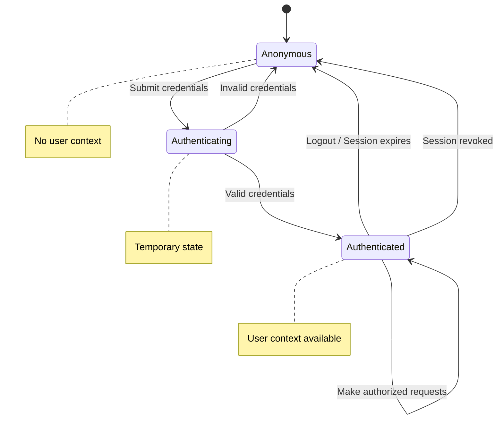

# Authentication and Authorization System

*This guide explains how user authentication and role-based access control (RBAC) work, from concepts to implementation to usage.*

## ⚡ TL;DR - Working Authentication (5 minutes)

**Want working auth right now?** Here's the copy-paste version:

### Backend: Add Protected Endpoint
```rust
// Add to your handler
use crate::auth::middleware::require_auth;

pub async fn my_protected_endpoint(
    Extension(user): Extension<User>, // User is already authenticated
    State(state): State<AppState>,
) -> Result<Json<ApiResponse<MyData>>, Error> {
    // Your protected logic here
    let data = get_user_data(&user).await?;
    Ok(Json(ApiResponse::success(data)))
}

// Add to router with auth middleware
Router::new()
    .route("/my-endpoint", get(my_protected_endpoint))
    .layer(middleware::from_fn_with_state(state.clone(), require_auth))
```

### Frontend: Use Authentication
```typescript
import { useAuth } from '@/lib/auth/context';

function LoginForm() {
  const { login } = useAuth();
  
  const handleLogin = async (credentials) => {
    try {
      await login(credentials); // Handles token storage automatically
      // User is now logged in, redirects handled by AuthProvider
    } catch (error) {
      console.error('Login failed:', error.message);
    }
  };

  return (
    <form onSubmit={(e) => {
      e.preventDefault();
      handleLogin({ username: 'testuser', password: 'password' });
    }}>
      <button type="submit">Login</button>
    </form>
  );
}

function ProtectedComponent() {
  const { user, authenticated } = useAuth();
  
  if (!authenticated) return <div>Please log in</div>;
  
  return <div>Welcome, {user.username}!</div>;
}
```

### Test It Works
```bash
# Register new user
curl -X POST http://localhost:3000/api/v1/auth/register \
  -H "Content-Type: application/json" \
  -d '{"username":"testuser","email":"test@example.com","password":"SecurePass123!"}'

# Login and get token
curl -X POST http://localhost:3000/api/v1/auth/login \
  -H "Content-Type: application/json" \
  -d '{"username":"testuser","password":"SecurePass123!"}'
```

**That's it!** You now have working authentication. Want to understand why it works this way? Keep reading ↓

---

## 🤔 Why This Authentication Approach? (First Principles)

### The Fundamental Problem: Identity Verification

**What authentication actually solves**:
- How do we verify someone is who they claim to be?
- How do we remember that verification across multiple requests?
- How do we revoke access when needed?
- How do we balance security with usability?

### Authentication Approach Comparison

| Approach | How It Works | Pros | Cons | When to Use |
|----------|--------------|------|------|-------------|
| **Basic Auth** | Username/password in every request | Simple, stateless | Credentials in every request | Internal APIs, development |
| **JWT Tokens** | Signed tokens with user data | Stateless, scalable | Hard to revoke, token size | Microservices, mobile apps |
| **OAuth 2.0** | Third-party identity providers | User doesn't create passwords | Complex flow, external dependency | Social login, enterprise SSO |
| **API Keys** | Long-lived secret tokens | Simple for machines | Hard to rotate, no user context | Machine-to-machine |
| **Session-Based** ⭐ | Server-stored session tokens | Easy to understand/revoke | Requires database lookup | Web applications, learning |

### Why Session-Based for This Starter?

**Our First Principles Decision**:

**Principle 1: Understandability**
- Clear flow: password → hash verification → session creation → token validation
- No cryptographic complexity to distract from core concepts
- Easy to debug with database queries

**Principle 2: Security by Default**
- Server controls all session state (can revoke instantly)
- Passwords never stored in plaintext (Argon2 hashing)
- Session expiration handled automatically
- No client-side secret storage complexity

**Principle 3: Real-World Patterns**
- Similar to how GitHub, GitLab, many web apps work
- Database-first approach matches our architecture
- Scales well for typical web applications

**Principle 4: Learning Value**
- Shows proper password hashing techniques
- Demonstrates session lifecycle management
- Teaches authorization patterns (roles, permissions)

**Principle 5: Operational Simplicity**
- Server-side state = server controls everything
- Easy to debug: "Is user logged in?" = database query
- Simple revocation: delete session = immediate logout
- Audit trail: all session events are in database

### 🧠 Mental Model: Authentication as State Machine



**Key Insight**: Authentication is about transitioning from "unknown" to "known" user state and maintaining that state across requests.

## Core Concepts

### 1. Authentication vs Authorization
- **Authentication**: "Who are you?" (login with password)
- **Authorization**: "What can you do?" (role-based permissions)

### 2. Role-Based Access Control (RBAC)

**The Authorization Problem**: Once we know who someone is (authentication), we need to decide what they can do (authorization). RBAC solves this by grouping permissions into roles, making security decisions both scalable and auditable.

**Why RBAC over alternatives?**
- **Attribute-Based (ABAC)**: More flexible but complex to reason about
- **Access Control Lists (ACL)**: Fine-grained but doesn't scale with users
- **Role-Based (RBAC)** ⭐: Perfect balance of flexibility, simplicity, and auditability

This starter implements a comprehensive three-tier role system:

#### Role Hierarchy: The Principle of Hierarchical Authority

**Mental Model**: Think of roles like organizational hierarchy - higher levels inherit all lower-level capabilities plus additional privileges.

```
Admin (Level 3) - "System Owner"
├── Inherits: All Moderator + User capabilities
├── Plus: Admin-only endpoints (/admin/health)
├── Plus: User role management (future: create/modify users)
└── Philosophy: Full system authority for operational needs

Moderator (Level 2) - "Content Manager"  
├── Inherits: All User capabilities
├── Plus: Access to ALL user tasks (cross-user visibility)
├── Plus: View all user profiles (for moderation)
└── Philosophy: Community management without system access

User (Level 1) - "Data Owner"
├── Core: Own tasks (create, read, update, delete)
├── Core: Own profile (read, update)
└── Philosophy: Principle of least privilege - own data only
```

**Key Insight**: Hierarchical roles reduce complexity by ensuring higher roles can always do what lower roles can do, plus more. This prevents privilege escalation bugs and makes authorization logic predictable.

#### Permission Model
Each role grants specific permissions on resources:

| Resource | User | Moderator | Admin |
|----------|------|-----------|-------|
| **Own Tasks** | Read/Write/Delete | Read/Write/Delete | Read/Write/Delete |
| **Other Tasks** | ❌ | Read/Write/Delete | Read/Write/Delete |
| **Own Profile** | Read/Write | Read/Write | Read/Write |
| **Other Profiles** | ❌ | Read | Read/Write |
| **Admin Endpoints** | ❌ | ❌ | Full Access |

#### RBAC Implementation Patterns

**Security Philosophy**: "Fail closed" - when in doubt, deny access. Users get 404 (not 403) to avoid information leakage about resource existence.

**Pattern 1: Ownership-Based Access Control (Recommended)**
```rust
use crate::rbac::services as rbac_services;

pub async fn update_resource(
    State(app_state): State<AppState>,
    Extension(auth_user): Extension<AuthUser>,
    Path(id): Path<Uuid>,
    Json(request): Json<UpdateResourceRequest>,
) -> Result<Json<ApiResponse<Resource>>> {
    // Begin transaction for atomic check-then-update
    let mut tx = app_state.database.pool.begin().await?;
    
    // Get existing resource to check ownership
    let existing = get_resource_service(tx.as_mut(), id).await?;
    
    // Ownership check: Users can access their own, Admin/Moderator can access all
    rbac_services::can_access_own_resource(&auth_user, existing.created_by)?;
    
    // Update resource
    let updated = update_resource_service(tx.as_mut(), id, request).await?;
    
    tx.commit().await?;
    Ok(Json(ApiResponse::success(updated)))
}
```

**Pattern 2: Role-Based Bulk Operations**
```rust
pub async fn bulk_create_resources(
    Extension(auth_user): Extension<AuthUser>,
    Json(request): Json<BulkCreateRequest>,
) -> Result<Json<ApiResponse<BulkOperationResponse<Resource>>>> {
    // Bulk operations require moderator or higher
    rbac_services::require_moderator_or_higher(&auth_user)?;
    
    let mut conn = app_state.database.pool.acquire().await?;
    let response = bulk_create_service(conn.as_mut(), request, auth_user.id).await?;
    Ok(Json(ApiResponse::success(response)))
}
```

#### RBAC in Action: Access Scenarios

```rust
// SCENARIO 1: Admin accessing any resource
GET /api/v1/resources/123 (created by user_456) ✅ 200 OK
// Logic: Admin role can access all resources regardless of ownership

// SCENARIO 2: Moderator accessing cross-user resource  
GET /api/v1/resources/123 (created by user_456) ✅ 200 OK
// Logic: Moderator can manage all user content

// SCENARIO 3: User accessing their own task
GET /api/v1/tasks/123 (created by current_user) ✅ 200 OK
// Logic: Owner always has access to own resources

// SCENARIO 4: User attempting cross-user access
GET /api/v1/tasks/456 (created by different_user) ❌ 404 Not Found
// Logic: Fail closed - pretend resource doesn't exist to prevent enumeration
```

**Implementation Insight**: The same API endpoint behaves differently based on role - this reduces API surface area while maintaining security boundaries.

### 3. Session Token Flow: The Authentication Journey

```mermaid
sequenceDiagram
    participant U as 👤 User
    participant A as 🔐 Auth API
    participant D as 🗄️ Database
    participant P as 🚀 Protected API
    
    Note over U,P: 🏁 Registration & Login
    U->>+A: POST /api/v1/auth/register<br/>{username, email, password}
    A->>A: 🔒 Hash password (Argon2)
    A->>+D: Store user with hashed password
    D-->>-A: ✅ User created
    A-->>-U: 📝 User profile (no password!)
    
    U->>+A: POST /api/v1/auth/login<br/>{username OR email, password}
    A->>+D: Find user by username/email
    D-->>-A: 👤 User record
    A->>A: 🔍 Verify password vs hash
    A->>A: 🎫 Generate 64-char session token
    A->>+D: Store session (token, expires_at)
    D-->>-A: ✅ Session created
    A-->>-U: 🎫 {session_token, user_profile}
    
    Note over U,P: 🔄 API Usage
    U->>+P: GET /api/v1/protected-endpoint<br/>Authorization: Bearer <token>
    P->>+A: Validate session token
    A->>+D: Find active session by token
    D-->>-A: 📋 Session + User data
    A-->>-P: ✅ Valid user context
    P->>P: 💼 Process business logic
    P-->>-U: 📊 Protected data
    
    Note over U,P: 🚪 Logout
    U->>+A: POST /api/v1/auth/logout<br/>Authorization: Bearer <token>
    A->>+D: Mark session as inactive
    D-->>-A: ✅ Session deactivated
    A-->>-U: 👋 Logged out successfully
```



### 4. Security Principles: Defense in Depth

**Security Philosophy**: Multiple independent layers of protection, so failure of one layer doesn't compromise the entire system.

**Layer 1: Password Protection**
- **Never store plaintext**: Passwords are hashed with Argon2 immediately
- **Salt uniqueness**: Each password gets a unique salt to prevent rainbow table attacks
- **Memory-hard hashing**: Argon2 uses significant memory, making GPU attacks expensive

**Layer 2: Token Security**
- **Cryptographic randomness**: 64-character tokens with ~380 bits of entropy
- **Database uniqueness**: Unique constraints prevent token collisions
- **Time-bounded validity**: Automatic expiration limits exposure window

**Layer 3: Request Validation**
- **Every request validated**: No trust in client-side state
- **Bearer token extraction**: Standardized Authorization header parsing
- **Database verification**: Real-time session lookup ensures revocation works

**Layer 4: Information Disclosure Prevention**
- **404 vs 403**: Hide resource existence from unauthorized users
- **Minimal error details**: Prevent information leakage through error messages
- **Role-based filtering**: Users only see data they're authorized to access

## Data Model

### Users Table
```sql
CREATE TABLE users (
  id UUID PRIMARY KEY DEFAULT gen_random_uuid(),
  username TEXT NOT NULL UNIQUE,
  email TEXT NOT NULL UNIQUE, 
  password_hash TEXT NOT NULL,  -- Argon2 hash, never plain text
  role TEXT NOT NULL DEFAULT 'user', -- RBAC role with database constraint
  is_active BOOLEAN NOT NULL DEFAULT true,
  email_verified BOOLEAN NOT NULL DEFAULT false,
  created_at TIMESTAMPTZ NOT NULL DEFAULT NOW(),
  updated_at TIMESTAMPTZ NOT NULL DEFAULT NOW(),
  last_login_at TIMESTAMPTZ,
  CONSTRAINT check_user_role CHECK (role IN ('user', 'moderator', 'admin'))
);
```

### Sessions Table  
```sql
CREATE TABLE sessions (
  id UUID PRIMARY KEY DEFAULT gen_random_uuid(),
  user_id UUID NOT NULL REFERENCES users(id) ON DELETE CASCADE,
  token TEXT NOT NULL UNIQUE,      -- 64-character random string
  expires_at TIMESTAMPTZ NOT NULL,    -- 24 hours from creation/refresh
  created_at TIMESTAMPTZ NOT NULL DEFAULT NOW(),
  updated_at TIMESTAMPTZ NOT NULL DEFAULT NOW(),
  last_activity_at TIMESTAMPTZ NOT NULL DEFAULT NOW(),
  last_refreshed_at TIMESTAMPTZ, -- When token was last refreshed
  user_agent TEXT,        -- Browser/client info
  is_active BOOLEAN NOT NULL DEFAULT true
);
```

**Why Separate Tables? (Database Design Principles)**

**Principle 1: Single Responsibility**
- Users table: Identity and profile data
- Sessions table: Authentication state management
- Each table has one clear purpose

**Principle 2: Operational Flexibility**
- **Multiple Sessions**: User can be logged in on multiple devices simultaneously
- **Selective Revocation**: Can terminate specific sessions (e.g., "logout from phone")
- **Bulk Operations**: Easy to revoke all sessions for a user (`logout-all`)

**Principle 3: Auditability**
- **Session History**: When/where users logged in
- **User Agent Tracking**: Detect unusual access patterns
- **Temporal Data**: Creation, refresh, and expiration timestamps

**Principle 4: Performance**
- **Targeted Queries**: Session validation doesn't need full user data
- **Efficient Cleanup**: Can bulk-delete expired sessions without touching users
- **Indexing Strategy**: Sessions indexed by token, users by username/email

## Implementation Deep Dive

### 1. Password Security

```rust
// Password hashing during user creation (inline approach)
pub async fn create_user(conn: &mut DbConn, req: CreateUserRequest) -> Result<UserProfile> {
    // Generate salt and hash password
    let salt = SaltString::generate(&mut OsRng);
    let argon2 = Argon2::default();
    let password_hash = argon2
        .hash_password(req.password.as_bytes(), &salt)?
        .to_string();
    
    // Store user with hashed password
    let user = sqlx::query_as!(/* ... insert user query ... */)
        .fetch_one(&mut **conn)
        .await?;
    
    Ok(user.to_profile())
}

// Password verification during login
pub fn verify_password(password: &str, password_hash: &str) -> Result<bool> {
    let parsed_hash = PasswordHash::new(password_hash)
        .map_err(|_| Error::Internal("Invalid password hash".to_string()))?;

    Ok(Argon2::default()
        .verify_password(password.as_bytes(), &parsed_hash)
        .is_ok())
}
```

**Why Argon2?**
- **Memory-hard**: Resistant to GPU/ASIC attacks
- **Configurable**: Can adjust time/memory costs
- **Standard**: Winner of password hashing competition
- **Future-proof**: Designed to remain secure

### 2. Session Token Generation

```rust
fn generate_session_token() -> String {
    use rand::Rng;
    const CHARSET: &[u8] = b"ABCDEFGHIJKLMNOPQRSTUVWXYZabcdefghijklmnopqrstuvwxyz0123456789";
    let mut rng = rand::rng();
    (0..64)
        .map(|_| {
            let idx = rng.random_range(0..CHARSET.len());
            CHARSET[idx] as char
        })
        .collect()
}
```

**Token Properties:**
- **Length**: 64 characters = ~380 bits of entropy
- **Character Set**: Alphanumeric (URL-safe, database-safe)
- **Uniqueness**: Database unique constraint prevents collisions
- **Unpredictable**: Cryptographically secure random generation

### 3. Middleware Authentication

```mermaid
graph LR
    subgraph "🌐 HTTP Request Flow"
        REQ[📥 Incoming Request<br/>Authorization: Bearer token]
        
        subgraph "🔐 Auth Middleware"
            CHECK{🔍 Has Token?}
            VALIDATE[🎫 Validate Session]
            USER[👤 Load User Context]
            ERROR[❌ 401 Unauthorized]
        end
        
        subgraph "🎯 Protected Handler"
            HANDLER[💼 Business Logic<br/>User context available]
            RESPONSE[📤 Response]
        end
        
        REQ --> CHECK
        CHECK -->|No| ERROR
        CHECK -->|Yes| VALIDATE
        VALIDATE -->|Invalid| ERROR
        VALIDATE -->|Valid| USER
        USER --> HANDLER
        HANDLER --> RESPONSE
    end
    
    subgraph "🗄️ Database"
        SESSION[(Sessions Table<br/>token, user_id, expires_at)]
        USERS[(Users Table<br/>id, username, role)]
    end
    
    VALIDATE --> SESSION
    USER --> USERS
    
    classDef errorBox fill:#ffebee,stroke:#c62828,stroke-width:2px
    classDef successBox fill:#e8f5e8,stroke:#1b5e20,stroke-width:2px
    classDef processBox fill:#e3f2fd,stroke:#0277bd,stroke-width:2px
    
    class ERROR errorBox
    class HANDLER,RESPONSE successBox
    class CHECK,VALIDATE,USER processBox
```



```rust
// Authentication middleware
pub async fn auth_middleware<B>(
    State(app_state): State<AppState>,
    mut request: Request<B>,
    next: Next<B>,
) -> Result<Response, Error> {
    // Extract Bearer token from Authorization header
    let token = extract_bearer_token(&request)?;
    
    // Validate session and load user
    let mut conn = app_state.database.pool.acquire().await?;
    let auth_user = auth_services::validate_session_with_user(&mut conn, &token).await?;
    
    // Add user to request for handlers to use
    request.extensions_mut().insert(auth_user);
    
    Ok(next.run(request).await)
}
```

**Middleware Benefits:**
- **Automatic**: All protected routes get authentication
- **Consistent**: Same validation logic everywhere
- **Extensible**: Easy to add role-based checks
- **Clean**: Business logic doesn't handle auth details

### 4. RBAC Implementation: From Theory to Code

**The Authorization Decision Point**: After authentication succeeds, we need to make authorization decisions. Here's how RBAC translates to Rust:

```rust
// UserRole enum with hierarchical comparison
#[derive(Debug, Clone, Copy, PartialEq, Eq, PartialOrd, Ord)]
pub enum UserRole {
    User = 1,      // Lowest privilege
    Moderator = 2, // Medium privilege  
    Admin = 3,     // Highest privilege
}

// The magic: PartialOrd enables hierarchical comparisons
// user_role >= required_role naturally expresses "has sufficient privilege"
```

**Permission Checking Patterns:**

```rust
// Pattern 1: Resource Ownership Check
pub fn can_access_task(auth_user: &AuthUser, task_owner_id: Uuid) -> Result<(), Error> {
    match auth_user.role {
        UserRole::Admin | UserRole::Moderator => Ok(()), // Can access any task
        UserRole::User => {
            if auth_user.id == task_owner_id {
                Ok(()) // Can access own task
            } else {
                Err(Error::NotFound("Task not found".to_string())) // Fail closed with 404
            }
        }
    }
}

// Pattern 2: Minimum Role Requirement
pub fn require_moderator_or_higher(auth_user: &AuthUser) -> Result<(), Error> {
    if auth_user.role >= UserRole::Moderator {
        Ok(())
    } else {
        Err(Error::Forbidden("Insufficient privileges".to_string()))
    }
}

// Pattern 3: Resource + Permission Matrix
pub fn check_permission(
    auth_user: &AuthUser, 
    resource: Resource, 
    permission: Permission
) -> Result<(), Error> {
    match (auth_user.role, resource, permission) {
        (UserRole::Admin, _, _) => Ok(()), // Admin can do anything
        (UserRole::Moderator, Resource::Tasks, _) => Ok(()), // Moderator can manage tasks
        (UserRole::Moderator, Resource::Users, Permission::Read) => Ok(()), // Moderator can read users
        (UserRole::User, Resource::Tasks, _) if /* owns resource */ => Ok(()), // User owns resource
        _ => Err(Error::Forbidden("Access denied".to_string()))
    }
}
```

**Key Insights:**
- **Rust's type system**: Enums + pattern matching make authorization logic exhaustive and bug-resistant
- **Hierarchical ordering**: `PartialOrd` on roles enables natural privilege comparisons
- **Fail closed**: Default case always denies access, preventing accidental privilege escalation


## API Flow Examples

### User Registration
```bash
curl -X POST http://localhost:3000/api/v1/auth/register \
  -H "Content-Type: application/json" \
  -d '{
    "username": "alice",
    "email": "alice@example.com",
    "password": "secure123"
  }'
```

**What Happens:**
1. Validate input (username length, email format, password strength)
2. Check if username/email already exists
3. Hash password with Argon2
4. Create user record in database
5. Return user profile (no password!)

### User Login
```bash
curl -X POST http://localhost:3000/api/v1/auth/login \
  -H "Content-Type: application/json" \
  -d '{
    "username": "alice",
    "password": "secure123"
  }'
```

**What Happens:**
1. Find user by username or email
2. Verify password against stored hash
3. Generate random session token
4. Create session record with 24-hour expiration
5. Return token and user info

**Response:**
```json
{
  "success": true,
  "data": {
    "session_token": "abc123...64chars",
    "expires_at": "2024-01-02T12:00:00Z",
    "user": {
      "id": "uuid",
      "username": "alice",
      "role": "user"
    }
  }
}
```

### Protected Request
```bash
curl -X GET http://localhost:3000/api/v1/auth/me \
  -H "Authorization: Bearer abc123...64chars"
```

**What Happens:**
1. Middleware extracts token from Authorization header
2. Look up session in database by token
3. Check session is not expired
4. Load associated user record
5. Add user to request context
6. Continue to handler with authenticated user

### Token Refresh (NEW! ✨)
```bash
curl -X POST http://localhost:3000/api/v1/auth/refresh \
  -H "Authorization: Bearer abc123...64chars"
```

**What Happens:**
1. Validate current session token
2. Check if refresh is allowed (5-minute minimum interval)
3. Extend token expiration by 24 hours (configurable)
4. Update `last_refreshed_at` timestamp in database
5. Return new expiration time

**Response:**
```json
{
  "success": true,
  "data": {
    "expires_at": "2024-01-03T12:00:00Z",
    "refreshed_at": "2024-01-02T12:00:00Z"
  }
}
```

**Rate Limiting:** Can only refresh once every 5 minutes (configurable). Immediate second refresh returns HTTP 409:
```json
{
  "error": {
    "code": "CONFLICT",
    "message": "Cannot refresh token yet. Please wait before requesting another refresh."
  }
}
```

### Logout
```bash
curl -X POST http://localhost:3000/api/v1/auth/logout \
  -H "Authorization: Bearer abc123...64chars"
```

**What Happens:**
1. Validate session token (normal auth flow)
2. Mark session as inactive in database
3. Return success message

**Logout All Devices:**
```bash
curl -X POST http://localhost:3000/api/v1/auth/logout-all \
  -H "Authorization: Bearer abc123...64chars"
```
Marks all user's sessions as inactive.

## Configuration Options

### Environment Variables

Token refresh behavior can be configured via environment variables:

```bash
# Authentication Configuration
STARTER__AUTH__SESSION_DURATION_HOURS=24          # Initial session duration
STARTER__AUTH__CLEANUP_INTERVAL_SECS=3600         # Session cleanup interval
STARTER__AUTH__REFRESH_EXTEND_HOURS=24            # Hours to extend on refresh
STARTER__AUTH__REFRESH_MIN_INTERVAL_MINUTES=5     # Minimum time between refreshes
```

**Configuration Notes:**
- **`REFRESH_EXTEND_HOURS`**: How many hours to extend token expiration when refreshed (default: 24 hours)
- **`REFRESH_MIN_INTERVAL_MINUTES`**: Minimum wait time between refresh attempts (default: 5 minutes)
- Both settings help balance security (shorter intervals) with usability (longer intervals)

### Frontend Integration

The frontend automatically handles token refresh with smart scheduling:

```typescript
// Token refresh is handled automatically by AuthProvider
const { user, login, refreshToken } = useAuth();

// Manual refresh (usually not needed)
const success = await refreshToken();
if (!success) {
  // Token refresh failed, user needs to login again
  console.log('Please login again');
}
```

**Smart Refresh Strategy:**
- Automatically refreshes when 75% of token lifetime has passed
- Minimum 5 minutes before expiration as safety buffer
- Respects server-side rate limiting
- Logs refresh operations for debugging

## Security Considerations

### What This Protects Against
- **Password Attacks**: Argon2 makes brute force expensive
- **Token Guessing**: 64-char random tokens are unguessable
- **Session Hijacking**: HTTPS in deployment prevents interception
- **Replay Attacks**: Tokens expire automatically
- **Database Leaks**: Passwords are hashed, not plaintext

### What This Doesn't Protect Against (And How to Mitigate)

**Client-Side Vulnerabilities:**
- **XSS Attacks**: Malicious JavaScript can steal tokens from localStorage
  - *Mitigation*: Use httpOnly cookies (but complicates SPA architecture)
  - *Detection*: Monitor for unusual API patterns
- **CSRF**: Forged requests from malicious sites  
  - *Mitigation*: SameSite cookies, CSRF tokens for state changes
  - *Why less critical*: Bearer tokens in headers (not cookies) reduce CSRF risk

**Social Engineering:**
- **Phishing**: Users tricked into entering credentials on fake sites
  - *Mitigation*: User education, 2FA, suspicious login detection
- **Credential Stuffing**: Reused passwords from other breaches
  - *Mitigation*: Password strength requirements, breach monitoring

**Insider/Infrastructure Threats:**
- **Database Access**: DBAs can theoretically access hashed passwords
  - *Mitigation*: Audit database access, rotate keys, principle of least privilege
- **Memory Dumps**: Running processes contain plaintext passwords briefly
  - *Mitigation*: Clear sensitive data promptly, encrypt memory (advanced)

**Implementation Bugs:**
- **Authorization Bypass**: Logic errors in RBAC implementation
  - *Mitigation*: Comprehensive tests, code review, fail-closed defaults
- **Timing Attacks**: Password comparison timing reveals information
  - *Mitigation*: Constant-time comparison (Argon2 handles this)

### Best Practices Implemented
- **Principle of Least Privilege**: Users only see their own data
- **Defense in Depth**: Multiple layers of validation
- **Secure by Default**: Safe defaults for token expiration
- **Clear Audit Trail**: All authentication events logged

## Code Organization

### Module Structure
```rust
src/auth/
├── api.rs          -- HTTP endpoints (register, login, logout)
├── models.rs       -- Data types (User, Session, requests/responses)  
├── services.rs     -- Business logic (password hashing, session management)
├── middleware.rs   -- Authentication middleware
└── tests.rs        -- Unit and integration tests
```

### Service Layer Pattern
```rust
// Services take database connection and return business objects
pub async fn login(
    conn: &mut DbConn,
    request: LoginRequest,
) -> Result<LoginResponse, Error> {
    // Business logic here
}

// API handlers are thin - they just coordinate
pub async fn login_handler(
    State(app_state): State<AppState>,
    Json(request): Json<LoginRequest>,
) -> Result<Json<ApiResponse<LoginResponse>>, Error> {
    let mut conn = app_state.database.pool.acquire().await?;
    let response = auth_services::login(&mut conn, request).await?;
    Ok(Json(ApiResponse::success(response)))
}
```

**Why This Pattern?**
- **Testable**: Can test business logic without HTTP
- **Reusable**: Services can be called from anywhere
- **Focused**: Each layer has single responsibility
- **Clear Dependencies**: Database connection explicitly passed

## Testing Authentication

### Authentication Tests
```bash
# Run authentication tests (12 comprehensive tests)
cargo nextest run auth::

# Run user management tests (17 comprehensive tests)
cargo nextest run users::

# Or run all tests including authentication and user management
cargo nextest run
```

The authentication test suite covers:
- **User registration** with validation
- **Login/logout** with correct/incorrect credentials  
- **Protected route access** with/without tokens
- **Token refresh functionality** (6 dedicated tests):
  - Successful refresh with new expiration time
  - Rate limiting (5-minute minimum interval)
  - Invalid token handling
  - Session lifetime extension verification
  - Database state updates
  - Error response format validation
- **Token validation** and security
- **Session management** and multi-device logout
- **Error handling** and edge cases

The user management test suite covers:
- **Profile management** (update own profile, password changes)
- **Account lifecycle** (creation, deletion, soft delete)
- **RBAC enforcement** (role-based access control)
- **Admin operations** (user creation, role management, password resets)
- **Cross-user access control** (users can only see own data)
- **User statistics** (comprehensive analytics for admins)
- **Error handling** (invalid passwords, unauthorized access)
- **Data validation** (email formats, username constraints)
- **Security features** (confirmation requirements, audit trails)

### Manual Testing
```bash
# 1. Start the server
./scripts/server.sh 3000

# 2. Register a user
curl -X POST http://localhost:3000/api/v1/auth/register \
  -H "Content-Type: application/json" \
  -d '{"username":"alice","email":"alice@example.com","password":"secure123"}'

# 3. Login and save token
TOKEN=$(curl -s -X POST http://localhost:3000/api/v1/auth/login \
  -H "Content-Type: application/json" \
  -d '{"username":"alice","password":"secure123"}' \
  | jq -r '.data.session_token')

# 4. Use token for authenticated requests
curl -H "Authorization: Bearer $TOKEN" http://localhost:3000/api/v1/auth/me

# 5. Refresh token to extend expiration
curl -X POST -H "Authorization: Bearer $TOKEN" http://localhost:3000/api/v1/auth/refresh

# 6. Try immediate second refresh (should get 409 CONFLICT)
curl -X POST -H "Authorization: Bearer $TOKEN" http://localhost:3000/api/v1/auth/refresh

# 7. Test user management features
# Update own profile
curl -X PUT -H "Authorization: Bearer $TOKEN" \
  -H "Content-Type: application/json" \
  -d '{"email":"alice.updated@example.com"}' \
  http://localhost:3000/api/v1/users/me/profile

# Change password
curl -X PUT -H "Authorization: Bearer $TOKEN" \
  -H "Content-Type: application/json" \
  -d '{"current_password":"secure123","new_password":"NewPassword456!"}' \
  http://localhost:3000/api/v1/users/me/password

# Test comprehensive curl testing (40+ endpoint tests)
./scripts/test-with-curl.sh
```

## Security Features ✅

This authentication system implements comprehensive security measures to protect against common attack vectors:

### Session Fixation Prevention
- **Auto-cleanup**: Sessions older than 30 days are automatically invalidated on login
- **Selective invalidation**: Only affects very old sessions, preserving recent active sessions
- **Transaction safety**: Session cleanup is performed within login transaction for consistency

### Timing Attack Protection
- **Constant-time comparison**: Password verification uses constant-time operations to prevent timing analysis
- **Dummy hash processing**: Non-existent users trigger dummy password hash verification to maintain consistent response times
- **Comprehensive coverage**: Protects both login attempts and password validation during registration

### Enhanced Password Security
- **Case-insensitive common password detection**: Prevents use of common passwords regardless of case variations (e.g., "Password123" is blocked)
- **Unicode and special character handling**: Proper validation of international characters and security bypass attempts
- **Comprehensive validation**: 75+ validation rules covering edge cases and malformed inputs

### Database Security
- **Proper error propagation**: Replaced unsafe `unwrap_or(0)` patterns with proper error handling
- **Transaction race condition fixes**: Fixed soft-delete operations to prevent concurrent modification issues
- **Consistent RBAC error handling**: Standardized authorization error responses across all endpoints

### Email Validation Security
- **RFC-compliant validation**: Comprehensive email format validation covering edge cases
- **Security bypass prevention**: Handles malformed inputs and potential injection attempts
- **International domain support**: Proper validation of international domain names and characters

### Security Testing
The system includes comprehensive security testing with **182 integration tests**, including:
- **Timing attack protection tests**: Verify constant-time behavior
- **Session fixation prevention tests**: Validate session cleanup during login
- **Password validation security tests**: Test case variations and bypass attempts
- **RBAC security tests**: Complete role-based access control validation
- **Database consistency tests**: Transaction handling and error propagation validation

For complete details, see **[Security Documentation](../reference/security.md)**.

## Common Questions

**Q: Why not JWT tokens?**
A: JWTs are harder to revoke and require careful key management. Session tokens are simpler and more appropriate for learning.

**Q: Why 24-hour expiration?**
A: Balances security (shorter is better) with usability (longer is convenient). Easy to configure different values.

**Q: Can users have multiple sessions?**
A: Yes! Each device/browser can have its own session. Use `/auth/logout-all` to end all sessions.

**Q: How do I add role-based permissions?**
A: The RBAC system is fully implemented! Use the provided middleware and authorization functions:

```rust
// In your API handler
use crate::rbac::services as rbac_services;

// Check if user can access a specific task
rbac_services::can_access_task(&auth_user, task.created_by)?;

// Require moderator or higher
rbac_services::require_moderator_or_higher(&auth_user)?;

// Check specific permissions
rbac_services::check_permission(&auth_user, Resource::Tasks, Permission::Write)?;
```

Or use middleware for entire routes:
```rust
// Moderator routes
let moderator_routes = Router::new()
    .route("/users", get(users_api::list_users))
    .layer(middleware::from_fn(moderator_middleware));

// Admin routes  
let admin_routes = Router::new()
    .route("/admin/settings", get(admin_settings))
    .layer(middleware::from_fn(admin_middleware));
```

**Q: How does token refresh work?**
A: Token refresh extends the expiration time of existing tokens without requiring re-authentication. The frontend automatically schedules refreshes, and there's rate limiting to prevent abuse.

**Q: Can I configure refresh intervals?**
A: Yes! Use `STARTER__AUTH__REFRESH_EXTEND_HOURS` (default: 24) for extension duration and `STARTER__AUTH__REFRESH_MIN_INTERVAL_MINUTES` (default: 5) for rate limiting.

**Q: What happens if token refresh fails?**
A: The frontend will handle failed refreshes gracefully and prompt the user to login again. All refresh failures are logged for debugging.

## Next Steps

Now that you understand authentication, learn about the reliability patterns:

- **[Foundation Patterns →](./03-patterns.md)** - Circuit breakers, retry strategies, and error handling
- **[Background Tasks →](./04-background-tasks.md)** - How async tasks use authentication

---
*This authentication system provides a secure foundation that's easy to understand and extend for your learning needs.*