# Foundation Patterns

*This guide explains the core reliability patterns used throughout the system: circuit breakers, retry strategies, and dead letter queues.*

## 🤔 Why Reliability Patterns? (First Principles)

### The Fundamental Problem: Systems Fail

**Reality of distributed systems**:
- Networks have latency and packet loss
- Services go down for maintenance or overload
- Databases can become temporarily unavailable
- External APIs have rate limits and downtime

**Without reliability patterns**:
- One failing service cascades to bring down your entire system
- Users experience long timeouts and poor performance
- Resources are wasted on requests that will inevitably fail
- System recovery takes much longer than necessary

### Pattern Selection Philosophy

| Pattern | Problem Solved | When NOT to Use | Alternative |
|---------|----------------|-----------------|-------------|
| **Circuit Breaker** | Cascading failures, resource waste | Single-user systems, fast-failing services | Simple timeouts |
| **Retry with Backoff** | Transient failures, temporary overload | Permanent errors, user-facing requests | Circuit breaker only |
| **Dead Letter Queue** | Task failures, debugging issues | Real-time processing, simple workflows | Log and discard |
| **Timeout** | Hanging requests, resource leaks | Fast operations, offline processing | Infinite wait (dangerous) |

### 🧠 Mental Model: Failure Handling Hierarchy

```mermaid
graph TD
    subgraph "🎯 Failure Response Strategy"
        FAST[⚡ Fail Fast<br/>Don't waste time on impossible]
        RETRY[🔄 Retry Smart<br/>Handle transient issues]
        ISOLATE[🔒 Isolate Failures<br/>Don't let failures spread]
        RECOVER[🏥 Recover Gracefully<br/>Return to normal operation]
    end
    
    subgraph "🛠️ Pattern Implementation"
        TIMEOUT[⏱️ Timeouts<br/>Prevent hanging]
        BACKOFF[📈 Exponential Backoff<br/>Avoid thundering herd]
        CIRCUIT[🔌 Circuit Breaker<br/>Stop cascade failures]
        DLQ[📬 Dead Letter Queue<br/>Preserve failed work]
    end
    
    FAST --> TIMEOUT
    RETRY --> BACKOFF
    ISOLATE --> CIRCUIT
    RECOVER --> DLQ
    
    classDef strategy fill:#e8f5e8,stroke:#1b5e20,stroke-width:2px
    classDef pattern fill:#e3f2fd,stroke:#0277bd,stroke-width:2px
    
    class FAST,RETRY,ISOLATE,RECOVER strategy
    class TIMEOUT,BACKOFF,CIRCUIT,DLQ pattern
```



**Key Insight**: Each pattern addresses a different aspect of failure handling. They work together to create resilient systems.

## Pattern 1: Circuit Breaker

### The Problem
Imagine your task system tries to send emails, but the email service is down. Without protection:
```
Task 1: Try email → Timeout (30 seconds)
Task 2: Try email → Timeout (30 seconds) 
Task 3: Try email → Timeout (30 seconds)
...
```
This wastes resources and creates cascading delays.

### The Solution: Circuit Breaker

```mermaid
stateDiagram-v2
    [*] --> Closed
    
    state "🟢 CLOSED" as Closed {
        [*] --> Normal
        Normal : 🔄 All requests allowed
        Normal : 📊 Track failures
    }
    
    state "🔴 OPEN" as Open {
        [*] --> Blocked
        Blocked : ❌ Block all requests
        Blocked : ⚡ Fail fast (no delays)
        Blocked : ⏱️ Wait for timeout
    }
    
    state "🟡 HALF_OPEN" as HalfOpen {
        [*] --> Testing
        Testing : 🧪 Allow limited requests
        Testing : 🎯 Test if service recovered
    }
    
    Closed --> Open : ❌ failure_count >= threshold
    Open --> HalfOpen : ⏰ timeout_duration elapsed
    HalfOpen --> Closed : ✅ success_count >= threshold
    HalfOpen --> Open : ❌ any failure detected
    
    note right of Closed
        💡 Learning: Normal operation
        Track success/failure rates
    end note
    
    note right of Open
        💡 Learning: Fail fast
        Prevents cascade failures
        Gives service time to recover
    end note
    
    note right of HalfOpen
        💡 Learning: Gradual recovery
        Test with limited requests
        Quick fallback if still failing
    end note
```



### How It Works

A circuit breaker tracks three essential pieces of information:

```rust
// Conceptual structure
struct CircuitBreaker {
    state: CircuitState,         // Current state (Closed/Open/HalfOpen)
    failure_count: u32,          // How many failures we've seen
    failure_threshold: u32,      // Open after N failures
    success_threshold: u32,      // Close after N successes
    timeout: Duration,           // How long to stay open
}

enum CircuitState {
    Closed,    // Normal operation - allow all requests
    Open,      // Failing - block all requests immediately  
    HalfOpen,  // Testing - allow limited requests
}
```

### Core Logic

The circuit breaker follows a simple decision tree:

```rust
// Conceptual flow
if circuit_breaker.should_allow_request() {
    match execute_operation().await {
        Ok(result) => {
            circuit_breaker.record_success();
            Ok(result)
        }
        Err(error) => {
            circuit_breaker.record_failure();
            Err(error)
        }
    }
} else {
    // Circuit is open - fail immediately
    Err("Circuit breaker is open")
}
```

**State Transitions:**
- **Closed → Open**: After `failure_threshold` failures
- **Open → HalfOpen**: After `timeout` duration
- **HalfOpen → Closed**: After `success_threshold` successes
- **HalfOpen → Open**: On any failure

### When to Use Circuit Breakers
- **External Services**: API calls, database connections, email services
- **Resource Protection**: Prevent overwhelming failing systems
- **Fast Failure**: Return errors immediately instead of waiting for timeouts
- **System Stability**: Prevent cascading failures

### Configuration Example
```rust
// For email service
CircuitBreaker::new(
    failure_threshold: 5,    // Open after 5 failures
    success_threshold: 3,    // Close after 3 successes
    timeout: Duration::from_secs(60), // Stay open for 60 seconds
)

// For database operations  
CircuitBreaker::new(
    failure_threshold: 3,    // More sensitive
    success_threshold: 2,    // Recover faster
    timeout: Duration::from_secs(30),
)
```

### Testing Circuit Breakers

**Test State Transitions:**
```rust
#[test]
fn test_circuit_breaker_states() {
    let mut cb = CircuitBreaker::new(2, 1, Duration::from_secs(1));
    
    // Start closed
    assert_eq!(cb.state(), CircuitState::Closed);
    
    // Failures should eventually open
    cb.record_failure();
    cb.record_failure();
    assert_eq!(cb.state(), CircuitState::Open);
    
    // After timeout, should go half-open
    sleep(Duration::from_secs(2));
    assert!(cb.should_allow_operation());
    assert_eq!(cb.state(), CircuitState::HalfOpen);
    
    // Success in half-open should close
    cb.record_success();
    assert_eq!(cb.state(), CircuitState::Closed);
}
```

## Pattern 2: Retry Strategies

### The Problem
Networks are unreliable. Services have hiccups. Sometimes the first try fails, but the second succeeds. How do you retry intelligently?

### Strategy 1: Exponential Backoff
**Concept**: Wait longer between each retry attempt to avoid overwhelming failing services.

```mermaid
gantt
    title 📈 Exponential Backoff Timeline
    dateFormat X
    axisFormat %Ss
    
    section Attempts
    1st Try     :0, 1
    Wait 1s     :1, 2
    2nd Try     :2, 3
    Wait 2s     :3, 5
    3rd Try     :5, 6
    Wait 4s     :6, 10
    4th Try     :10, 11
    Wait 8s     :11, 19
    5th Try     :19, 20
```



**Why Exponential?**
- **🎯 Reduces Load**: Gives failing service time to recover
- **🔄 Self-Regulating**: Automatic backpressure
- **⚡ Fast Initial Recovery**: Quick retry if it's just a hiccup
- **🛡️ Prevents Thundering Herd**: Avoids all clients retrying simultaneously

**Implementation Concept:**
```rust
// Three main retry strategies
enum RetryStrategy {
    Exponential { base_delay, multiplier, max_delay, max_attempts },
    Linear { base_delay, increment, max_delay, max_attempts },
    Fixed { interval, max_attempts },
}

// Retry execution pattern
async fn execute_with_retry<F>(strategy: RetryStrategy, operation: F) -> Result<T> {
    let mut attempt = 0;
    
    loop {
        match operation().await {
            Ok(result) => return Ok(result),
            Err(error) => {
                if let Some(delay) = strategy.calculate_delay(attempt) {
                    sleep(delay).await;
                    attempt += 1;
                } else {
                    return Err(error); // Max attempts reached
                }
            }
        }
    }
}
```

**When to Use**: 
- Network requests (avoid overwhelming servers)
- Database operations (temporary connection issues)
- File operations (temporary locks)

### Strategy 2: Linear Backoff  
**Concept**: Fixed increase between retries.
```
Attempt 1: Immediate
Attempt 2: Wait 1 second → retry
Attempt 3: Wait 2 seconds → retry
Attempt 4: Wait 3 seconds → retry
```

**Implementation Concept:**
```rust
// Linear backoff calculation
fn calculate_linear_delay(attempt: u32, base: Duration, increment: Duration) -> Duration {
    base + (increment * attempt)
}

// Example: 1s, 3s, 5s, 7s, 9s...
Linear {
    base_delay: Duration::from_secs(1),
    increment: Duration::from_secs(2),
    max_attempts: 5,
}
```

**When to Use**:
- Rate-limited APIs (predictable backoff)
- Queue processing (steady pressure)
- Resource contention (gradual backing off)

### Strategy 3: Fixed Interval
**Concept**: Same delay between all retries.
```
Attempt 1: Immediate  
Attempt 2: Wait 30 seconds → retry
Attempt 3: Wait 30 seconds → retry
Attempt 4: Wait 30 seconds → retry
```

**Implementation Concept:**
```rust
// Fixed interval calculation
fn calculate_fixed_delay(attempt: u32, interval: Duration) -> Duration {
    interval // Always the same
}

// Example: 30s, 30s, 30s, 30s...
Fixed {
    interval: Duration::from_secs(30),
    max_attempts: 4,
}
```

**When to Use**:
- Scheduled operations (cron-like behavior)
- Monitoring checks (consistent intervals)
- Simple retry logic (easy to reason about)

### Strategy Selection Guide

**When to Use Each Strategy:**

| Use Case | Strategy | Why |
|----------|----------|-----|
| **External APIs** | Exponential | Gives failing services time to recover |
| **Database ops** | Exponential (fast) | Quick recovery from temporary issues |
| **Rate-limited APIs** | Linear | Predictable, steady backing off |
| **Health checks** | Fixed | Consistent monitoring intervals |
| **File operations** | Exponential | Handles temporary locks gracefully |

**Configuration Examples:**
```rust
// External API calls (be gentle, allow recovery)
Exponential { base: 500ms, multiplier: 2.0, max: 30s, attempts: 5 }

// Database operations (recover quickly)
Exponential { base: 100ms, multiplier: 1.5, max: 5s, attempts: 3 }

// Rate-limited services (predictable backoff)
Linear { base: 1s, increment: 5s, max: 60s, attempts: 10 }

// Periodic health checks (consistent timing)
Fixed { interval: 30s, attempts: 3 }
```

### Testing Retry Strategies

**Test Delay Calculations:**
```rust
#[test]
fn test_retry_delays() {
    let exponential = RetryStrategy::Exponential {
        base_delay: Duration::from_millis(100),
        multiplier: 2.0,
        max_attempts: 3,
    };
    
    // Should double each time: 100ms, 200ms, 400ms, then None
    assert_eq!(exponential.calculate_delay(0), Some(Duration::from_millis(100)));
    assert_eq!(exponential.calculate_delay(1), Some(Duration::from_millis(200)));
    assert_eq!(exponential.calculate_delay(2), Some(Duration::from_millis(400)));
    assert_eq!(exponential.calculate_delay(3), None);
}
```

**Test Actual Retry Execution:**
```rust
#[tokio::test]
async fn test_retry_execution() {
    let mut attempt_count = 0;
    
    let result = retry_with_strategy(
        RetryStrategy::Fixed { interval: 10ms, max_attempts: 3 }, 
        || async {
            attempt_count += 1;
            if attempt_count < 3 {
                Err("temporary failure")
            } else {
                Ok("success")
            }
        }
    ).await;
    
    assert_eq!(result, Ok("success"));
    assert_eq!(attempt_count, 3);
}
```

## Pattern 3: Dead Letter Queue

### The Problem
Some tasks will always fail, no matter how many times you retry:
- Invalid email addresses
- Malformed data that can't be processed
- Requests to services that no longer exist

These tasks shouldn't retry forever, but you also shouldn't lose them completely.

### The Solution: Dead Letter Queue

```mermaid
flowchart LR
    A[📥 Pending Tasks] --> B[⚙️ Process Task]
    B --> C{🎯 Success?}
    C -->|✅ Yes| D[✅ Completed]
    C -->|❌ No| E[❌ Failed]
    E --> F{🔄 Can Retry?}
    F -->|✅ Yes| G[⏳ Schedule Retry]
    G --> H[🔄 Retrying Tasks]
    H --> B
    F -->|❌ Max Attempts| I[💀 Dead Letter Queue]
    
    style A fill:#e1f5fe
    style D fill:#e8f5e8
    style I fill:#ffebee
    style G fill:#fff3e0
    style H fill:#f3e5f5
```



### Implementation Concept

The dead letter queue follows a simple decision process:

```rust
// Conceptual failure handling flow
async fn handle_task_failure(task: Task, error: Error) -> Result<()> {
    task.current_attempt += 1;
    
    if task.can_retry() {
        // Calculate when to retry based on strategy
        let retry_at = task.retry_strategy.calculate_next_retry(task.current_attempt);
        
        // Schedule for retry
        schedule_task_retry(task.id, retry_at, error).await?;
        log::info!("Task {} scheduled for retry {}", task.id, task.current_attempt);
    } else {
        // Max attempts reached - move to dead letter queue
        mark_task_as_dead_letter(task.id, error).await?;
        log::warn!("Task {} moved to dead letter queue", task.id);
    }
    
    Ok(())
}
```

**Key Decisions:**
1. **Can retry?** Check `current_attempt < max_attempts`
2. **When to retry?** Use retry strategy to calculate delay
3. **Can't retry?** Mark as failed (dead letter)

### Dead Letter Queue Management

Once tasks are in the dead letter queue, you need tools to manage them:

**Common Operations:**
```rust
// Conceptual management operations
trait DeadLetterQueue {
    // Find failed tasks
    async fn get_failed_tasks(limit: Option<u32>) -> Vec<Task>;
    
    // Manually retry a failed task (reset attempt counter)
    async fn retry_failed_task(task_id: Uuid) -> Result<()>;
    
    // Permanently delete a failed task
    async fn delete_failed_task(task_id: Uuid) -> Result<()>;
    
    // Get failure statistics
    async fn get_failure_stats() -> FailureStats;
}
```

**Management Workflows:**
1. **Monitor**: Regularly check dead letter queue size
2. **Investigate**: Analyze failure patterns and error messages
3. **Fix**: Address root causes (fix data, update handlers)
4. **Retry**: Manually retry tasks after fixes
5. **Cleanup**: Delete old or irrelevant failed tasks

### When to Use Dead Letter Queues
- **Poison Messages**: Tasks that crash the processor
- **Invalid Data**: Malformed payloads that can't be fixed automatically
- **External Failures**: Services that are permanently unavailable
- **Debugging**: Investigate why certain tasks consistently fail

### Testing Dead Letter Queues

**Test Failure Handling:**
```rust
#[tokio::test]
async fn test_dead_letter_queue_flow() {
    let mut task = Task {
        id: Uuid::new_v4(),
        current_attempt: 0,
        max_attempts: 3,
        retry_strategy: RetryStrategy::Fixed { interval: 1ms, max_attempts: 3 },
    };
    
    // Simulate failures
    for attempt in 1..=3 {
        task.current_attempt = attempt;
        let result = handle_task_failure(task.clone(), "simulated error").await;
        
        if attempt < 3 {
            // Should schedule retry
            assert!(matches!(result, Ok(TaskAction::Retry { .. })));
        } else {
            // Should move to dead letter queue
            assert!(matches!(result, Ok(TaskAction::DeadLetter)));
        }
    }
}
```

## Combining Patterns

### Pattern Integration

These patterns work together to create a robust system:

```rust
// Conceptual integration
struct ReliableTaskProcessor {
    circuit_breakers: HashMap<String, CircuitBreaker>,  // Per task type
    retry_strategies: HashMap<String, RetryStrategy>,   // Per task type
    dead_letter_queue: DeadLetterQueue,
}

impl ReliableTaskProcessor {
    async fn process_task(&self, task: Task) -> Result<()> {
        // 1. Check circuit breaker
        let circuit_breaker = self.circuit_breakers.get(&task.task_type);
        if !circuit_breaker.should_allow_operation() {
            return self.move_to_dead_letter(task, "Circuit breaker open");
        }

        // 2. Execute task
        let result = execute_task_handler(&task).await;

        // 3. Handle result
        match result {
            Ok(success) => {
                circuit_breaker.record_success();
                self.mark_completed(task);
            }
            Err(error) => {
                circuit_breaker.record_failure();
                self.handle_failure(task, error).await?;
            }
        }
    }

    async fn handle_failure(&self, task: Task, error: Error) -> Result<()> {
        task.attempt += 1;
        
        if task.can_retry() {
            // Use retry strategy to schedule next attempt
            let retry_strategy = self.retry_strategies.get(&task.task_type);
            let delay = retry_strategy.calculate_delay(task.attempt);
            self.schedule_retry(task, delay).await
        } else {
            // Max retries exceeded - move to dead letter queue
            self.dead_letter_queue.add(task, error).await
        }
    }
}
```

### System Integration

In a real system, these patterns work together:

**1. Task Configuration:**
```rust
// Each task carries its own retry strategy
struct Task {
    id: Uuid,
    task_type: String,
    payload: serde_json::Value,
    retry_strategy: RetryStrategy,   // How to handle failures
    current_attempt: u32,            // Tracks retry count
    max_attempts: u32,               // When to give up
}
```

**2. Processor Configuration:**
```rust
// System-wide reliability settings
struct ProcessorConfig {
    enable_circuit_breaker: bool,    // Use circuit breakers?
    task_timeout: Duration,          // Max execution time
    max_concurrent_tasks: usize,     // Concurrency limits
}
```

**3. Pattern Coordination:**
- **Circuit Breaker**: Protects each task type from cascading failures
- **Retry Strategy**: Embedded in tasks, controls retry timing
- **Dead Letter Queue**: Automatic destination for permanently failed tasks
- **Timeouts**: Prevent hung tasks from blocking the system

## Configuration Examples

### Conservative (High Reliability)
```rust
// Circuit breaker: Very sensitive to failures
CircuitBreaker {
    failure_threshold: 2,     // Open after just 2 failures
    success_threshold: 5,     // Need 5 successes to close
    timeout: 120_seconds,     // Stay open for 2 minutes
}

// Retry: Many attempts with long delays  
RetryStrategy::Exponential {
    base_delay: 2_seconds,    // Start with 2 second delay
    multiplier: 2.0,          // Double each time
    max_delay: 300_seconds,   // Cap at 5 minutes
    max_attempts: 8,          // Try 8 times total
}
```

### Aggressive (High Performance)
```rust
// Circuit breaker: Tolerates more failures
CircuitBreaker {
    failure_threshold: 10,    // Allow 10 failures before opening
    success_threshold: 2,     // Just 2 successes to close
    timeout: 30_seconds,      // Quick recovery attempts
}

// Retry: Fewer attempts with short delays
RetryStrategy::Exponential {
    base_delay: 200_millis,   // Start quickly
    multiplier: 1.5,          // Gentle increase
    max_delay: 10_seconds,    // Low cap
    max_attempts: 3,          // Give up quickly
}
```

### Balanced (Good Default)
```rust
// Circuit breaker: Reasonable thresholds
CircuitBreaker {
    failure_threshold: 5,     // Open after 5 failures
    success_threshold: 3,     // Close after 3 successes
    timeout: 60_seconds,      // 1 minute recovery window
}

// Retry: Standard exponential backoff
RetryStrategy::Exponential {
    base_delay: 1_second,     // Start with 1 second
    multiplier: 2.0,          // Standard doubling
    max_delay: 300_seconds,   // Cap at 5 minutes
    max_attempts: 5,          // 5 attempts total
}
```

## Key Takeaways

**Pattern Selection:**
- **Circuit Breaker**: Use when external services can fail catastrophically
- **Exponential Backoff**: Best for most retry scenarios (network, database)
- **Linear Backoff**: Good for rate-limited services
- **Fixed Interval**: Perfect for scheduled operations
- **Dead Letter Queue**: Essential for debugging and manual intervention

**Design Principles:**
1. **Fail Fast**: Circuit breakers prevent wasted resources
2. **Back Off Gracefully**: Exponential delays give services time to recover
3. **Preserve Evidence**: Dead letter queues help with debugging
4. **Configure Appropriately**: Match patterns to your specific use cases

## Next Steps

Now that you understand these reliability patterns, see how they're implemented:

- **[Background Tasks →](./04-background-tasks.md)** - Real implementation in the task system
- **[Custom Task Types →](./06-task-types.md)** - Applying patterns to your own tasks

---
*These patterns form the reliability foundation for building robust, fault-tolerant systems. The concepts here apply far beyond this starter - use them in any distributed system you build.*