# Chaos Testing Guide

*This guide introduces chaos engineering principles and explains how to use the comprehensive chaos testing framework to validate system resilience.*

## 🤔 Why Chaos Engineering? (First Principles)

### The Fundamental Problem: Unknown Failure Modes

**What we think we know about our systems**:
- Our code handles errors properly
- Dependencies are reliable
- Infrastructure is stable
- Users behave predictably

**What actually happens in production**:
- Networks partition at the worst possible moment
- Databases become temporarily unavailable
- Memory leaks cause gradual degradation
- Load patterns expose race conditions
- Third-party APIs fail in unexpected ways

**The gap**: We test for known problems, but production creates unknown problems.

### Failure Testing Approach Comparison

| Approach | How It Works | Pros | Cons | When to Use |
|----------|--------------|------|------|-------------|
| **Unit Testing** | Test individual components | Fast, focused | Misses system interactions | Component logic |
| **Load Testing** | High traffic simulation | Finds performance limits | Doesn't test failure modes | Performance validation |
| **Penetration Testing** | Security vulnerability testing | Finds security issues | Narrow scope | Security compliance |
| **Traditional QA** | Manual testing scenarios | Human insight | Limited coverage, slow | User experience validation |
| **Chaos Engineering** ⭐ | Intentional failure injection | Discovers unknown failure modes | Can cause real outages | Production resilience |

### Why Chaos Engineering for This Starter?

**Our First Principles Decision**:

**Principle 1: Proactive Failure Discovery**
- Find weaknesses before they cause outages
- Test assumptions about system resilience
- Validate that monitoring and alerting work
- Build confidence in recovery procedures

**Principle 2: Educational Value**
- Learn how systems actually fail (not how we think they fail)
- Practice debugging under stress
- Understand the importance of graceful degradation
- Experience the value of proper monitoring

**Principle 3: Production Preparation**
- Develop failure response muscle memory
- Validate that systems can handle real-world conditions
- Build confidence in deployment processes
- Create runbooks for common failure scenarios

### 🧠 Mental Model: Antifragile Systems

```mermaid
graph TD
    subgraph "📈 System Response to Stress"
        FRAGILE[💔 Fragile Systems<br/>Break under stress<br/>Examples: Monoliths, single points of failure]
        ROBUST[🛡️ Robust Systems<br/>Resist stress<br/>Examples: Load balancers, redundancy]
        ANTIFRAGILE[💪 Antifragile Systems<br/>Improve under stress<br/>Examples: Auto-scaling, circuit breakers]
    end
    
    subgraph "🧪 Chaos Engineering Goal"
        DISCOVER[🔍 Discover weaknesses]
        FIX[🔧 Fix discovered issues]
        VALIDATE[✅ Validate fixes work]
        IMPROVE[📈 Improve system resilience]
    end
    
    FRAGILE --> DISCOVER
    ROBUST --> DISCOVER
    DISCOVER --> FIX
    FIX --> VALIDATE
    VALIDATE --> IMPROVE
    IMPROVE --> ANTIFRAGILE
    
    classDef fragile fill:#ffebee,stroke:#c62828,stroke-width:2px
    classDef robust fill:#fff3e0,stroke:#e65100,stroke-width:2px
    classDef antifragile fill:#e8f5e8,stroke:#1b5e20,stroke-width:2px
    classDef process fill:#e3f2fd,stroke:#0277bd,stroke-width:2px
    
    class FRAGILE fragile
    class ROBUST robust
    class ANTIFRAGILE antifragile
    class DISCOVER,FIX,VALIDATE,IMPROVE process
```



**Key Insight**: Chaos engineering doesn't just test resilience - it builds antifragile systems that get stronger under stress.

## Why Chaos Testing?

### The Problem with Traditional Testing

Traditional testing validates that your system works correctly under normal conditions, but real-world systems face:
- **Service failures**: Processes crash, containers die, nodes go offline
- **Network issues**: Timeouts, packet loss, partitions  
- **Resource exhaustion**: Memory leaks, CPU spikes, disk full
- **Dependency failures**: Database outages, external API downtime

### The Chaos Engineering Solution

Chaos engineering proactively introduces controlled failures to:
- **Discover weaknesses** before they cause outages
- **Validate recovery mechanisms** work as designed
- **Build confidence** in system resilience
- **Improve monitoring** and alerting systems

```mermaid
graph TB
    subgraph "🧪 Chaos Engineering Philosophy"
        HYPOTHESIS[💭 Form Hypothesis<br/>System should handle X failure]
        EXPERIMENT[🔬 Design Experiment<br/>Inject controlled failure]
        OBSERVE[👁️ Observe Behavior<br/>Monitor system response]
        LEARN[📚 Learn & Improve<br/>Fix discovered weaknesses]
    end
    
    subgraph "🎯 Target Scenarios"
        DB_FAIL[🗄️ Database Failures<br/>Connection drops, timeouts]
        WORKER_FAIL[👷 Worker Crashes<br/>Process dies, restarts]
        SERVER_FAIL[🚀 Server Restart<br/>HTTP service down]
        LOAD_TEST[📊 Load Testing<br/>High task volume]
        NETWORK_FAIL[🌐 Network Issues<br/>Timeouts, partitions]
    end
    
    subgraph "📈 Difficulty Levels"
        L1[📗 Level 1: Basic<br/>2 workers, 10 tasks<br/>≥90% completion]
        L3[📙 Level 3: Load<br/>3 workers, 25 tasks<br/>≥80% completion]
        L6[📕 Level 6: Chaos<br/>2 workers, 40 tasks<br/>20-50% completion]
    end
    
    HYPOTHESIS --> EXPERIMENT
    EXPERIMENT --> DB_FAIL
    EXPERIMENT --> WORKER_FAIL
    EXPERIMENT --> SERVER_FAIL
    EXPERIMENT --> LOAD_TEST
    EXPERIMENT --> NETWORK_FAIL
    
    DB_FAIL --> OBSERVE
    WORKER_FAIL --> OBSERVE
    SERVER_FAIL --> OBSERVE
    LOAD_TEST --> OBSERVE
    NETWORK_FAIL --> OBSERVE
    
    OBSERVE --> LEARN
    LEARN -.->|🔄 Iterate| HYPOTHESIS
    
    L1 --> L3
    L3 --> L6
    
    classDef processBox fill:#e8f5e8,stroke:#1b5e20,stroke-width:2px
    classDef testBox fill:#e3f2fd,stroke:#0277bd,stroke-width:2px
    classDef levelBox fill:#fff3e0,stroke:#e65100,stroke-width:2px
    
    class HYPOTHESIS,EXPERIMENT,OBSERVE,LEARN processBox
    class DB_FAIL,WORKER_FAIL,SERVER_FAIL,LOAD_TEST,NETWORK_FAIL testBox
    class L1,L3,L6 levelBox
```



## Chaos Engineering Principles

### 1. Build a Hypothesis Around Steady State

Before introducing chaos, define what "normal" looks like:

```
Hypothesis: The system should maintain 99% API success rate 
even when the database is temporarily unavailable for 30 seconds.
```

### 2. Vary Real-World Events

Simulate failures that actually happen in production:
- Process crashes (kill -9)
- Resource exhaustion (high CPU/memory)
- Network issues (timeouts, partitions)
- Dependency failures (database down)

### 3. Run Experiments in Production

*Note: This starter focuses on development/staging environments, but the patterns scale to production with proper safeguards.*

### 4. Automate Experiments Continuously

Chaos testing should be part of your regular development workflow, not a one-time activity.

### 5. Minimize Blast Radius

Start small and gradually increase scope:
- Single service → Multiple services
- Short duration → Longer duration  
- Low traffic → High traffic

## Recent Framework Improvements ⭐ **PERFORMANCE OPTIMIZED**

### Critical Framework Fixes (August 2025)

#### 1. Polling Loop Performance Fix ⭐ **RESOLVED**

**Problem Identified**: The task completion polling loop had a critical bug where it never updated the loop control variable, causing tests to always run for the full deadline duration regardless of actual task completion.

```bash
# BEFORE (Bug): Loop never exits early
while [ $COMPLETED_TASKS -lt $CREATED ]; do
    ESTIMATED_COMPLETED=$(calculate_completion)
    # Missing: COMPLETED_TASKS=$ESTIMATED_COMPLETED ⚠️
    sleep 5
done
# Always runs full deadline (60-120s) even when tasks finish in 10-15s

# AFTER (Fixed): Loop exits when tasks complete
while [ $COMPLETED_TASKS -lt $CREATED ]; do
    ESTIMATED_COMPLETED=$(calculate_completion)
    COMPLETED_TASKS=$ESTIMATED_COMPLETED  # 🎯 FIX: Update loop control
    sleep 5
done
# Exits early when tasks complete (~15-30s typical)
```

**Performance Impact**:
- **Before**: Tests always took deadline + overhead (90-120s typical)
- **After**: Tests complete in actual work time + buffer (15-30s typical)
- **Performance**: 4-6x faster test execution
- **Machine Independence**: Timing now scales with actual performance, not arbitrary deadlines

#### 2. Dynamic Scaling Task Counting Fix ⭐ **RESOLVED**

**Problem Identified**: Dynamic scaling scenario used the same tag for all phases, causing incorrect task counting where Phase 2 monitoring would count tasks from Phase 1 + Phase 2.

```bash
# BEFORE (Bug): Same tag for all phases
--tag "dynamic_phase"    # Phase 1 creates 15 tasks
--tag "dynamic_phase"    # Phase 2 creates 8 tasks
# Result: Phase 2 monitoring shows "15/8 completed" (impossible!)

# AFTER (Fixed): Unique tags per phase + manual calculation
--tag "dynamic_phase_1"  # Phase 1: 15 tasks  
--tag "dynamic_phase_2"  # Phase 2: 8 tasks
# Manual calculation: completed_tasks = phase1_completed + phase2_completed
# Result: "Dynamic scaling results: 23/23 tasks completed (100.0%)" ✅
```

**Accuracy Impact**:
- **Before**: Impossible task counts like "15/8 completed", final results "0/0 completed"
- **After**: Accurate per-phase counting and correct final totals
- **Reliability**: Manual calculation from known phase variables eliminates monitoring script dependency
- **Evidence**: Tests now report correct "23/23 tasks completed (100.0%)" instead of "0/0"

## Framework Architecture

### Docker-Based Architecture

The chaos testing framework uses Docker containers for realistic testing environments:

- **Container Isolation**: Each service runs in isolated Docker containers
- **Resource Constraints**: CPU and memory limits simulate real constraints
- **Horizontal Scaling**: Easy scaling of worker containers for load testing
- **Realistic Failures**: Container crashes and restarts mirror real deployment issues

### Core Components

The chaos testing framework consists of three main parts:

```
┌─────────────────┐    ┌─────────────────┐    ┌─────────────────┐
│   test-chaos.sh │    │   Helper Scripts│    │   API Testing   │
│                 │    │                 │    │                 │
│ • Orchestrates  │───▶│ • auth-helper   │───▶│ • test-with-    │
│   scenarios     │    │ • task-flood    │    │   curl.sh       │
│ • Manages       │    │ • service-chaos │    │ • Validates     │
│   difficulty    │    │                 │    │   responses     │
│ • Tracks results│    │ Executes chaos  │    │                 │
└─────────────────┘    └─────────────────┘    └─────────────────┘
```

### 1. Orchestration Layer (`test-chaos.sh`)

The main orchestrator that:
- **Manages scenarios**: Coordinates different failure types
- **Controls difficulty**: Scales load and duration
- **Tracks results**: Measures success rates and recovery times
- **Generates reports**: Creates detailed analysis of test runs

### 2. Chaos Helpers (`scripts/helpers/`)

Modular utilities for specific chaos operations:

**`auth-helper.sh`**: Creates test users and tokens
```bash
# Creates authenticated user for load testing
./scripts/helpers/auth-helper.sh --prefix "chaos_test"
# Returns: {"token": "abc123...", "user_id": "uuid-here"}
```

**`delay-task-flood.sh`**: Generates high task loads with configurable delays
```bash
# Create 100 delay tasks with 2s processing time each
./scripts/helpers/delay-task-flood.sh --count 100 --delay 2 --deadline 300 --auth "$TOKEN"
```

**`admin-cli-helper.sh`**: **NEW** - Direct database access for monitoring
```bash
# Get task statistics bypassing API authentication
./scripts/helpers/admin-cli-helper.sh task-stats --tag "chaos_test"
./scripts/helpers/admin-cli-helper.sh list-tasks --verbose
```

**`service-chaos.sh`**: Simulates service failures
```bash
# Kill and restart server after 30s
./scripts/helpers/service-chaos.sh restart --service server --delay 30
```

### 3. Validation Layer (`test-with-curl.sh`)

Comprehensive API testing that:
- **Tests all endpoints**: Health, auth, tasks, DLQ
- **Validates responses**: Status codes, JSON structure
- **Measures success rates**: Calculates percentage of passing tests
- **Reports consistently**: Standard output format

## Difficulty Levels (Redesigned Framework)

The framework provides 6 scientifically-designed difficulty levels with logical progression from basic functionality to catastrophic load testing:

### Level 1: Basic Resilience ⭐ **TIMING OPTIMIZED**
**Purpose**: Baseline functionality validation with early exit polling
- **Configuration**: 2 workers, 10 tasks, 1s delays each, 45s deadline
- **Chaos Pattern**: Minimal disruption (20-30s intervals)
- **Expected**: ≥90% completion rate + deadline met
- **Total Time**: ~15-25 seconds (exits early when tasks complete)

```bash
./scripts/test-chaos.sh --difficulty 1
```

**Use cases**:
- Daily development testing
- Pre-commit validation
- CI/CD pipeline gates
- Basic functionality verification

### Level 2: Light Disruption ⭐ **TIMING OPTIMIZED**
**Purpose**: Introduction of controlled failures with early exit polling
- **Configuration**: 2 workers, 15 tasks, 2s delays each, 90s deadline
- **Chaos Pattern**: Moderate disruption (15-25s intervals)
- **Expected**: ≥85% completion rate + deadline met
- **Total Time**: ~30-45 seconds (exits early when tasks complete)

```bash
./scripts/test-chaos.sh --difficulty 2
```

**Use cases**:
- Integration testing
- Feature branch validation
- Staging environment testing

### Level 3: Load Testing
**Purpose**: Increased task volume validation
- **Configuration**: 3 workers, 25 tasks, 3s delays each, 60s deadline
- **Chaos Pattern**: Regular failures (10-15s intervals)
- **Expected**: ≥80% completion rate + deadline met
- **Total Time**: ~60-90 seconds

```bash
./scripts/test-chaos.sh --difficulty 3
```

**Use cases**:
- Performance validation
- Load testing scenarios
- Resource limit testing

### Level 4: Resource Pressure
**Purpose**: Challenging workload validation
- **Configuration**: 3 workers, 35 tasks, 4s delays each, 90s deadline
- **Chaos Pattern**: Aggressive cycling (5-10s intervals)
- **Expected**: ≥75% completion rate + deadline met
- **Total Time**: ~90-120 seconds

```bash
./scripts/test-chaos.sh --difficulty 4
```

**Use cases**:
- Pre-production validation
- High-load scenarios
- Resource pressure testing

### Level 5: Extreme Chaos
**Purpose**: High-pressure resilience testing
- **Configuration**: 4 workers, 30 tasks, 5s delays each, 80s deadline
- **Chaos Pattern**: Continuous failures (3-7s intervals)
- **Expected**: ≥60% completion rate (deadline may be missed)
- **Total Time**: ~80-120 seconds

```bash
./scripts/test-chaos.sh --difficulty 5
```

**Use cases**:
- Extreme resilience testing
- Chaos engineering validation
- Production readiness testing

### Level 6: Catastrophic Load ⚠️ **STRESS TEST LIMITS**
**Purpose**: Test partial completion under impossible workload
- **Configuration**: 2 workers, 40 tasks, 6s delays each, 60s deadline
- **Theoretical Need**: 240s of work in 60s deadline (4x overload)
- **Chaos Pattern**: Constant failures (2-5s intervals)
- **Expected**: **20-50% completion** (designed partial failure)
- **Total Time**: ~90-120 seconds

```bash
./scripts/test-chaos.sh --difficulty 6 --scenarios multi-worker-chaos
```

**Use cases**:
- Stress testing system limits
- Validating graceful degradation
- Testing partial completion scenarios
- Training on failure handling

> ⚠️ **Level 6 is intentionally designed with impossible workload to test partial completion patterns**

## Admin CLI Integration

### Direct Database Monitoring

The enhanced chaos testing framework includes admin CLI capabilities for reliable monitoring during API disruptions:

```bash
# Task statistics (bypasses API authentication and RBAC, shows all users' tasks)
cargo run -- admin task-stats
cargo run -- admin task-stats --tag "multiworker"

# Task inspection
cargo run -- admin list-tasks --limit 20 --verbose

# Maintenance operations
cargo run -- admin clear-completed --dry-run
```

**Key benefits**:
- **Fail-fast monitoring**: Detects issues early to save testing time
- **ANSI-aware parsing**: Handles colored output correctly
- **Authentication bypass**: Works when API is unreliable during chaos
- **Comprehensive statistics**: Real-time task completion tracking

### Foundation Checks

Every chaos test now includes foundation validation:

```bash
🔍 FOUNDATION CHECK: Validating admin CLI for all scenarios...
✅ All admin CLI tests passed - foundation is solid
```

This ensures the monitoring infrastructure is working before chaos begins.

## Chaos Scenarios

### Baseline Testing ⭐ **ENHANCED**
**Purpose**: Establish normal system behavior with comprehensive validation

```bash
./scripts/test-chaos.sh --scenarios baseline
```

**What happens**:
1. **Foundation check**: Admin CLI validation before test begins
2. **API validation**: Complete endpoint testing (44 tests)
3. **Task processing**: 12 delay tasks with 0.5s processing time
4. **Admin monitoring**: Real-time completion tracking via admin CLI
5. **Success validation**: 100% completion rate verification

**What it validates**:
- All API endpoints respond correctly (44/44 tests)
- Authentication flow works reliably
- Task creation and processing pipeline
- Database operations succeed
- Admin CLI monitoring works correctly
- Foundation is solid for advanced chaos scenarios

**Recent fixes**:
- Fixed degradation from 100% to 58% success rate
- Enhanced with proven delay-task-flood.sh script
- Added ANSI color code parsing for admin CLI output
- Implemented fail-fast patterns for time optimization

**Success criteria**: 100% API success rate + 100% task completion

### Database Failure Testing
**Purpose**: Test database resilience patterns

```bash
./scripts/test-chaos.sh --scenarios db-failure
```

**What happens**:
1. System baseline established
2. Database container stopped
3. API calls made during outage (should fail gracefully)
4. Database restarted
5. Recovery verified

**What it validates**:
- Connection pool handles database loss
- Health checks report database status accurately
- System recovers when database returns
- No data corruption during failure

### Server Restart Testing
**Purpose**: Test HTTP server resilience

```bash
./scripts/test-chaos.sh --scenarios server-restart
```

**What happens**:
1. Server process killed
2. Process restarted automatically
3. Recovery time measured
4. API functionality verified

**What it validates**:
- Process management works correctly
- Service startup is reliable
- Recovery time meets SLAs
- State reconstruction works

### Worker Restart Testing
**Purpose**: Test background task processing resilience

```bash
./scripts/test-chaos.sh --scenarios worker-restart
```

**What happens**:
1. Tasks created and queued
2. Worker process killed
3. Worker restarted
4. Task processing resumption verified

**What it validates**:
- Tasks survive worker restarts
- Processing resumes correctly
- No duplicate task execution
- Queue persistence works

### Task Flood Testing ⭐ **ENHANCED**
**Purpose**: Test high load performance with delay tasks

```bash
./scripts/test-chaos.sh --scenarios task-flood
```

**What happens**:
1. Authentication established with fail-fast health check
2. Delay task creation (20 tasks with 0.5s processing time each)
3. Admin CLI monitoring for real-time progress tracking
4. Task processing throughput measured with 45s deadline
5. Completion rate validation with fail-fast early exit

**What it validates**:
- System handles high task volumes efficiently
- Database performance under sustained load
- Memory usage remains stable during processing
- Queue management with delay task processing
- Admin CLI monitoring works under load
- Fail-fast patterns save time on early failures

**Enhanced features**:
- Uses delay tasks instead of simple tasks for realistic load
- Admin CLI bypass for reliable monitoring during API stress (ignores RBAC)
- Fail-fast exits when no progress detected after 30s
- ANSI color code parsing for accurate statistics
- Bold warnings for critical failures

### Circuit Breaker Testing
**Purpose**: Test fault isolation patterns

```bash
./scripts/test-chaos.sh --scenarios circuit-breaker
```

**What happens**:
1. Failing tasks created to trigger circuit breaker
2. Circuit breaker activation verified
3. Fast failure during outage
4. Recovery detection tested

**What it validates**:
- Circuit breaker triggers on failures
- Fast failure prevents cascade failures
- Circuit breaker reopens when service recovers
- Fault isolation between task types

### Mixed Chaos Testing ⭐ **ENHANCED**
**Purpose**: Test multiple concurrent failures with admin CLI monitoring

```bash
./scripts/test-chaos.sh --scenarios mixed-chaos
```

**What happens**:
1. High delay task load started (20 tasks, 0.5s each)
2. Worker container killed during active processing
3. Service recovery monitored via admin CLI
4. System stability verified under compound stress
5. Task completion tracked with 60s deadline

**What it validates**:
- Multiple failure handling with container isolation
- Resource contention during worker restarts
- Recovery coordination between services
- Admin CLI reliability during API disruptions
- Task retry mechanisms work correctly
- System stability under compound stress

**Enhanced features**:
- Docker container isolation for realistic failures
- Admin CLI monitoring bypasses API authentication and RBAC issues
- Enhanced fail-fast patterns detect stuck scenarios
- Fixed worker service name mismatch (worker → workers)
- Proper ANSI parsing for accurate progress tracking

### Recovery Time Testing
**Purpose**: Measure and validate recovery times

```bash
./scripts/test-chaos.sh --scenarios recovery
```

**What happens**:
1. Multiple restart cycles executed
2. Recovery time measured for each cycle
3. Average recovery time calculated
4. SLA compliance verified

**What it validates**:
- Consistent recovery times
- Recovery time SLAs met
- No degradation over multiple restarts
- Time to first successful request

### Multi-Worker Chaos Testing ⭐ **NEW**
**Purpose**: Test multi-worker resilience with delay tasks and deadlines

```bash
./scripts/test-chaos.sh --scenarios multi-worker-chaos
```

**What happens**:
1. Multiple workers (2-5) started simultaneously
2. Delay tasks created with configurable processing times (3-8 seconds)
3. Random worker failures introduced every 10-25 seconds
4. Workers killed and restarted during active task processing
5. Task completion monitored against strict deadlines (45-90 seconds)
6. Retry behavior validated when workers drop tasks

**What it validates**:
- **Worker coordination**: Multiple workers processing tasks concurrently
- **Failure resilience**: System continues operating when workers fail
- **Task retry logic**: Failed tasks are retried by surviving workers
- **Queue persistence**: Tasks survive worker crashes
- **Deadline enforcement**: System meets timing requirements under stress
- **Load distribution**: Work is distributed across available workers
- **Recovery patterns**: Workers restart reliably after failures

**Difficulty scaling** ⭐ **OPTIMIZED TIMING**:
- **Level 1**: 2 workers, 1s delays, 45s deadline, gentle failure intervals (exits ~15s)
- **Level 2**: 2 workers, 2s delays, 90s deadline, moderate disruption (exits ~30s)
- **Level 3**: 3 workers, 2s delays, 120s deadline, regular failures (exits ~50s)
- **Level 4**: 3 workers, 2s delays, 150s deadline, aggressive cycling (exits ~70s)
- **Level 5**: 4 workers, 3s delays, 180s deadline, continuous failures (exits ~90s)
- **Level 6**: 2 workers, 4s delays, 120s deadline, catastrophic patterns ⚠️ (partial completion)

**Success criteria**:
- **Levels 1-5**: ≥80% task completion rate + evidence of retries + system responsive
- **Level 6**: <50% completion rate + deadline missed (designed failure validation) ⚠️

### Dynamic Worker Scaling Testing ⭐ **ENHANCED**
**Purpose**: Test dynamic worker scaling with 4-phase resilience validation and accurate task counting

```bash
./scripts/test-chaos.sh --scenarios dynamic-scaling
```

**What happens**:
1. **Phase 1 (0-20s)**: Start with 5 workers for optimal capacity processing
2. **Phase 2 (20-40s)**: Scale down to 2 workers to create capacity pressure  
3. **Phase 3 (40-49s)**: Gradually scale up (+1 worker every 3s: 2→3→4→5)
4. **Phase 4 (49s-deadline)**: Monitor completion with full capacity restored

**What it validates**:
- **Worker scaling operations**: System handles dynamic scaling gracefully
- **Queue management**: Tasks queue properly during capacity reduction
- **Resource optimization**: Efficient work distribution across available workers
- **Scaling responsiveness**: Fast adaptation to capacity changes
- **Task completion guarantees**: 100% completion despite scaling operations
- **System stability**: No crashes or data loss during scaling events
- **Accurate monitoring**: Proper task counting across multiple phases

**Enhanced features** ⭐ **FIXED**:
- **Phase-specific tagging**: Uses unique tags (`dynamic_phase_1`, `dynamic_phase_2`) for accurate per-phase monitoring
- **Manual result calculation**: Eliminates monitoring script dependency with direct phase result aggregation
- **Precise task counting**: Reports correct totals like "23/23 tasks completed (100.0%)" instead of "0/0"
- **Reliable success detection**: Proper calculation of completion rates and deadline adherence

**Difficulty scaling** ⭐ **TIMING OPTIMIZED**:
- **Level 1**: 23 total tasks (15+8), 0.5s delays, 90s deadline (exits ~91s, 100% completion)
- **Level 2**: 30 total tasks (20+10), 0.5s delays, 150s deadline (exits when complete)
- **Level 3**: 45 total tasks (30+15), 1.0s delays, 180s deadline (exits when complete)
- **Level 4**: 60 total tasks (40+20), 1.0s delays, 240s deadline (exits when complete)
- **Level 5**: 75 total tasks (50+25), 1.5s delays, 300s deadline (exits when complete)
- **Level 6**: 90 total tasks (60+30), 2.0s delays, 360s deadline (exits when complete)

**Success criteria**:
- **Primary**: 100% task completion within deadline (✅ PASS)
- **Secondary**: 100% completion but deadline exceeded (✅ PASS* - partial pass)
- **Failure**: <100% completion or system errors (❌ FAIL)

**Recent fixes**:
- Fixed impossible task counts like "15/8 completed" by using unique phase tags
- Replaced unreliable monitoring script with manual calculation from phase variables
- Now accurately reports completion rates: Phase 1 (15/15) + Phase 2 (8/8) = Total (23/23)

**Key insights**: This scenario demonstrates real-world scaling patterns where systems must maintain service quality during infrastructure changes, with reliable monitoring throughout.

## Running Chaos Tests

### Quick Start

The chaos testing framework uses Docker containers for realistic testing environments:

```bash
# Basic chaos testing (recommended for daily use)
# Automatically builds and runs containers with latest code
./scripts/test-chaos.sh

# Advanced testing with higher difficulty
./scripts/test-chaos.sh --difficulty 3

# Test specific scenarios only
./scripts/test-chaos.sh --scenarios "db-failure,task-flood"

# Verbose output with detailed logs
./scripts/test-chaos.sh --difficulty 5 --verbose

# Container scaling and multi-worker testing
./scripts/test-chaos.sh --scenarios "multi-worker-chaos"

# Dynamic worker scaling testing
./scripts/test-chaos.sh --scenarios "dynamic-scaling"

# All scenarios with enhanced admin CLI monitoring
./scripts/test-chaos.sh --scenarios all --difficulty 1
```

**Docker Container Benefits:**
- **Container Isolation**: Each service runs in isolated Docker containers for realistic testing
- **Resource Constraints**: CPU and memory limits simulate real deployment constraints
- **Horizontal Scaling**: Easy scaling of worker containers with Docker Compose
- **Realistic Failures**: Container crashes and restarts mirror actual deployment issues
- **Fresh Code**: Automatically rebuilds images ensuring tests use latest changes

### Progressive Testing Strategy

**Phase 1: Development Validation**
```bash
# Daily developer testing (2 minutes)
./scripts/test-chaos.sh --difficulty 1 --scenarios "baseline,db-failure"
```

**Phase 2: Integration Testing**
```bash
# Pre-commit testing (5 minutes)
./scripts/test-chaos.sh --difficulty 2 --scenarios "baseline,server-restart,worker-restart"
```

**Phase 3: Load Testing**
```bash
# Performance validation (8 minutes)
./scripts/test-chaos.sh --difficulty 3 --scenarios "task-flood,circuit-breaker"
```

**Phase 4: Resilience Testing**
```bash
# Pre-production validation (15 minutes)
./scripts/test-chaos.sh --difficulty 4 --scenarios "mixed-chaos,recovery,multi-worker-chaos,dynamic-scaling"
```

**Phase 5: Production Readiness**
```bash
# Full chaos testing (20 minutes)
./scripts/test-chaos.sh --difficulty 5 --verbose
```

### Environment Setup

Before running chaos tests, ensure your environment is ready:

```bash
# 1. Start the full development environment
./scripts/dev-server.sh 3000

# 2. Verify all services are healthy
./scripts/test-with-curl.sh

# 3. Run chaos tests
./scripts/test-chaos.sh --difficulty 1
```

## Interpreting Results

### Success Metrics

The framework tracks several key metrics:

**API Success Rate**: Percentage of API calls that succeed
- Level 1-2: Should be 95-100%
- Level 3-4: Should be 85-95%
- Level 5: Should be 80%+

**Recovery Time**: Time from container failure to first successful API call
- Target: < 20 seconds for Docker-based scenarios
- Warning: > 30 seconds indicates container issues

**Task Processing**: Tasks completed vs. tasks created
- Should maintain processing throughput
- Failed tasks should be moved to DLQ

**Circuit Breaker**: Proper activation and recovery
- Should trigger on repeated failures
- Should recover when service is restored

### Warning Signs

🚨 **Critical Issues**:
- Recovery time > 30 seconds
- Success rate < 70%
- Memory leaks during testing
- Tasks stuck in processing state
- Circuit breaker not recovering
- Admin CLI monitoring failures
- Foundation checks failing

⚠️ **Areas for Improvement**:
- Success rate 70-85%
- Container recovery time 20-30 seconds
- High task failure rates
- Slow container health checks
- ANSI parsing errors in monitoring
- Metadata field inconsistencies

### Example Results Analysis

**Level 1 (Basic Resilience)**:
```
📊 Chaos Testing Results
=========================
Total scenarios: 1
Passed: 1
Failed: 0
Success rate: 100%
Total duration: 46s

Scenario Results:
✅ multi-worker-chaos: PASS (100.0%, 0 retries)
```

**Analysis**: Perfect baseline performance with 100% task completion within deadline, enhanced admin CLI monitoring, and solid foundation for advanced chaos scenarios.

**Level 6 (Catastrophic Load)**:
```
📊 Chaos Testing Results
=========================
Total scenarios: 1
Passed: 1
Failed: 0
Success rate: 100%
Total duration: 92s

Scenario Results:
✅ multi-worker-chaos: PASS (27.5%, 0 retries)
```

**Analysis**: Successful catastrophic load test with 27.5% completion (within expected 20-50% range), demonstrating proper partial completion handling under impossible workload.

**Dynamic Scaling (Level 1)**:
```
📊 Chaos Testing Results
=========================
Total scenarios: 1
Passed: 1
Failed: 0
Success rate: 100%
Total duration: 138s

Scenario Results:
✅ dynamic-scaling: PASS* (100.0%, 91s, 0 retries)
```

**Analysis**: Perfect dynamic scaling test with 100% task completion (23/23 tasks) across all phases, with proper phase-specific monitoring and accurate result calculation. Partial pass due to 1-second deadline miss (91s vs 90s), demonstrating reliable scaling patterns under worker capacity changes.

## Customization and Extension

### Environment Variables

```bash
# Custom configuration
export PORT=8080
export BASE_URL="https://staging.example.com"
export OUTPUT_DIR="chaos-results"
export VERBOSE=true

./scripts/test-chaos.sh
```

### Adding Custom Scenarios

Add new scenarios by modifying `test-chaos.sh`:

```bash
# Add to the case statement in run_scenario()
my-custom-test)
    log "INFO" "Running my custom test"
    
    # Your custom chaos logic here
    # Use helper scripts for common operations
    ./scripts/helpers/service-chaos.sh restart --service server
    ./scripts/helpers/task-flood.sh --count 50 --auth "$TOKEN"
    
    if run_api_test "Custom Test"; then
        log "SUCCESS" "Custom scenario passed"
        PASSED_SCENARIOS=$((PASSED_SCENARIOS + 1))
        TEST_RESULTS+=("✅ my-custom-test: PASS")
    else
        log "ERROR" "Custom scenario failed"
        TEST_RESULTS+=("❌ my-custom-test: FAIL")
    fi
    ;;
```

### Testing Specific Task Types

Customize task flood testing for specific scenarios:

```bash
# Test webhook resilience
./scripts/helpers/task-flood.sh --type webhook --count 100 --auth "$TOKEN"

# Test circuit breaker with specific task type
./scripts/helpers/task-flood.sh --type nonexistent_type --count 20 --auth "$TOKEN"
```

## CI/CD Integration

### GitHub Actions Example

```yaml
name: Chaos Testing
on:
  push:
    branches: [main]
  pull_request:
    branches: [main]

jobs:
  chaos-test:
    runs-on: ubuntu-latest
    steps:
    - uses: actions/checkout@v4
    - name: Setup environment
      run: ./scripts/dev-server.sh 3000
    - name: Run basic chaos tests
      run: ./scripts/test-chaos.sh --difficulty 2
    - name: Upload results
      uses: actions/upload-artifact@v4
      with:
        name: chaos-test-results
        path: tmp/
```

### Pre-deployment Validation

```bash
#!/bin/bash
# deploy-validation.sh

echo "🧪 Running pre-deployment chaos testing..."

# Start services
./scripts/dev-server.sh 3000

# Run progressive testing
for level in 1 2 3; do
    echo "Testing difficulty level $level..."
    if ! ./scripts/test-chaos.sh --difficulty $level; then
        echo "❌ Chaos testing failed at level $level"
        exit 1
    fi
done

echo "✅ All chaos tests passed - ready for deployment"
```

## Best Practices

### 1. Start Small and Scale Gradually
- Begin with difficulty level 1
- Increase complexity as confidence grows
- Monitor system behavior at each level

### 2. Automate Everything
- Integrate chaos tests into CI/CD
- Run regular chaos tests in staging
- Set up alerts for chaos test failures

### 3. Monitor During Tests
- Watch system metrics (CPU, memory, DB connections)
- Monitor logs for errors and warnings
- Track recovery times and success rates

### 4. Document and Learn
- Record failure modes discovered
- Document recovery procedures
- Share learnings with the team

### 5. Test Realistic Scenarios
- Base chaos experiments on real production failures
- Include dependencies in testing
- Test during different load conditions

### 6. Maintain Safe Boundaries
- Use isolated environments for chaos testing
- Implement circuit breakers and timeouts
- Have rollback procedures ready

## Troubleshooting

### Common Issues

**Test timeouts:**
- Increase timeout values in helper scripts
- Check system resources (CPU, memory)
- Verify network connectivity

**High failure rates:**
- Check service logs: `tail -f /tmp/starter-*.log`
- Verify database connectivity
- Review circuit breaker thresholds

**Worker not processing tasks:**
- Check worker process: `ps aux | grep starter`
- Review worker logs for errors
- Verify database task queue

**Database connection issues:**
- Check PostgreSQL container: `docker-compose ps`
- Verify connection string configuration
- Check connection pool settings

### Debug Mode

```bash
# Enable verbose logging
./scripts/test-chaos.sh --verbose --difficulty 1

# Check individual components
curl -X GET http://localhost:3000/api/v1/health
curl -X GET http://localhost:3000/api/v1/tasks/stats

# Admin CLI direct access (bypasses API authentication and RBAC checks)
cargo run -- admin task-stats --verbose
cargo run -- admin list-tasks --limit 5 --verbose

# Manual service testing
./scripts/test-server.sh 3000
./scripts/status.sh
```

## Next Steps

Now that you understand chaos engineering principles and the testing framework:

1. **Start Simple**: Run `./scripts/test-chaos.sh --difficulty 1` to get familiar
2. **Explore Scenarios**: Try different scenarios to understand failure modes
3. **Analyze Results**: Review generated reports to identify improvement areas
4. **Integrate with Development**: Add chaos testing to your development workflow
5. **Scale Up**: Gradually increase difficulty as your system improves
6. **Learn from Failures**: Use failures as learning opportunities to improve resilience

The chaos testing framework provides a foundation for building confidence in your system's resilience. As you add features, add corresponding chaos tests to ensure they fail gracefully.

## Further Reading

- **Circuit Breaker Pattern**: [Reliability Patterns Guide](../reference/reliability.md)
- **Background Tasks**: [Background Tasks Guide](04-background-tasks.md)
- **API Testing**: [Testing Guide](08-testing.md)
- **Health Monitoring**: [API Reference - Health Endpoints](../reference/api-reference.md)
- **System Architecture**: [Architecture Guide](01-architecture.md)

---

*Chaos engineering helps build antifragile systems that get stronger under stress. Use this framework to discover weaknesses early and build confidence in your system's ability to handle the unexpected.*