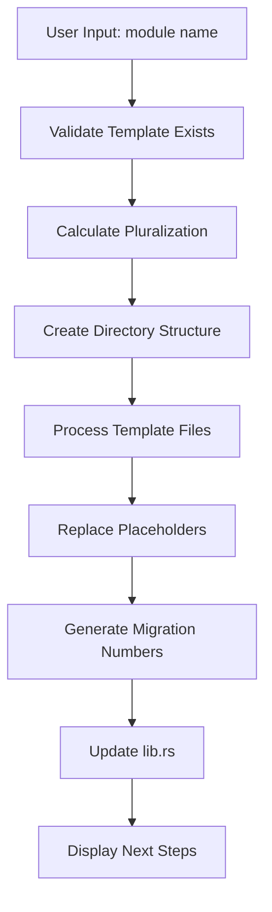
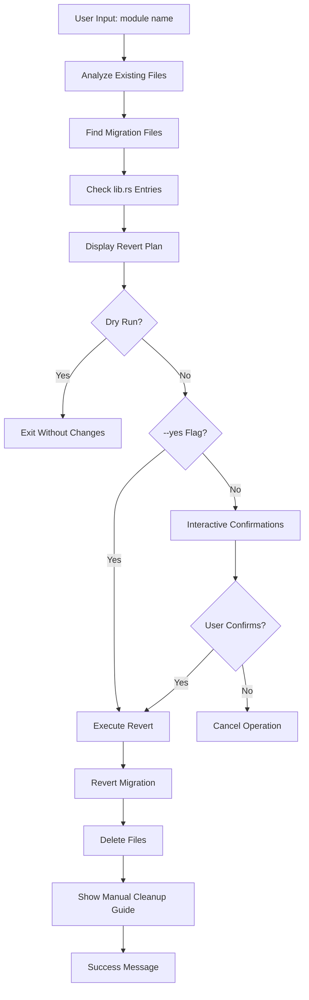

# Module Generator: First Principles Guide

This guide explains the fundamental concepts, design decisions, and architecture behind the module generator system. Understanding these principles will help you effectively use, customize, and extend the generator.

## Core Philosophy

### 1. **Convention Over Configuration**

The generator follows strict naming conventions to reduce cognitive load:

```
Input: "book"
├── Module: books (plural)
├── Struct: Book (singular, capitalized)
├── Table: books (plural, lowercase)
├── Routes: /api/v1/books
└── Files: src/books/, tests/books/
```

**Why:** Predictable structure means less decisions, faster development, and easier maintenance.

### 2. **Safety First**

Every dangerous operation requires explicit confirmation, and integration is always manual:

```bash
# Safe by default - prompts for confirmation
cargo run -- revert module books

# Explicit danger - requires --yes flag
cargo run -- revert module books --yes

# All integration is manual to prevent accidental PR inclusions
# Manual steps: lib.rs → server.rs → openapi.rs
```

**Why:** Prevents accidental data loss, avoids unintended commits, and encourages thoughtful development practices.

### 3. **Compile-Time Guarantees**

All database operations use `sqlx!` macros for compile-time validation:

```rust
// ❌ Runtime error (traditional approach)
let sql = format!("SELECT * FROM {}", table_name);
let result = sqlx::query(&sql).fetch_all(&pool).await?;

// ✅ Compile-time validation (our approach)
let books = sqlx::query_as!(
    Book,
    "SELECT id, name, description FROM books WHERE id = $1",
    book_id
).fetch_one(&pool).await?;
```

**Why:** Catches errors at compile time, prevents runtime database failures, and ensures schema consistency.

### 4. **Template-Driven Architecture**

Code generation uses file-based templates with placeholder replacement:

```rust
// Template file: templates/basic/models.rs
pub struct __MODULE_STRUCT__ {
    pub id: Uuid,
    pub name: String,
    // ...
}

// Generated: src/books/models.rs  
pub struct Book {
    pub id: Uuid,
    pub name: String,
    // ...
}
```

**Why:** Templates are easier to understand, modify, and maintain than programmatic code generation.

## Architecture Deep Dive

### Template System

**Template Structure:**
```
templates/
├── basic/                  # Simple CRUD template
│   ├── api.rs             # REST endpoints
│   ├── models.rs          # Data structures
│   ├── services.rs        # Business logic
│   ├── mod.rs             # Module exports
│   ├── tests.rs           # Integration tests
│   ├── up.sql             # Database migration
│   └── down.sql           # Migration rollback
└── production/            # Advanced features template
    ├── api.rs             # Enhanced endpoints + bulk ops
    ├── models.rs          # Complex data structures
    ├── services.rs        # Advanced business logic
    ├── mod.rs             # Module exports
    ├── tests.rs           # Comprehensive tests
    ├── up.sql             # Complex database schema
    └── down.sql           # Migration rollback
```

**Placeholder Replacement:**

| Placeholder | Example Input | Replacement | Usage |
|-------------|---------------|-------------|-------|
| `__MODULE_NAME__` | "book" | "book" | Variable names, function names |
| `__MODULE_NAME_PLURAL__` | "book" | "books" | URLs, directory names |
| `__MODULE_STRUCT__` | "book" | "Book" | Struct names, type names |
| `__MODULE_TABLE__` | "book" | "books" | Database table names |

### Generation Process



**Step-by-Step:**

1. **Input Validation**
   ```rust
   let template_dir = format!("../templates/{}", template);
   if !Path::new(&template_dir).exists() {
       return Err("Template not found".into());
   }
   ```

2. **Name Processing**
   ```rust
   let singular = name;  // "book"
   let plural = if name.ends_with('s') { 
       name.to_string() 
   } else { 
       format!("{}s", name) 
   };  // "books"
   let struct_name = capitalize_first(singular);  // "Book"
   ```

3. **File Generation**
   ```rust
   for (template_file, output_file) in template_files {
       let content = fs::read_to_string(&template_path)?;
       let processed = process_template(&content, &replacements);
       fs::write(&output_path, processed)?;
   }
   ```

4. **Migration Numbering**
   ```rust
   fn get_next_migration_number(migrations_dir: &str) -> Result<u32> {
       // Find highest existing migration number
       // Return next sequential number
   }
   ```

### Revert Process



**Safety Mechanisms:**

1. **Analysis Phase** - Scans filesystem to understand current state
2. **Preview Phase** - Shows exactly what will be changed
3. **Confirmation Phase** - Interactive prompts for dangerous operations
4. **Execution Phase** - Performs changes in logical order
5. **Manual Cleanup Guide** - Shows required manual integration removal

## Template Design Principles

### 1. **Progressive Complexity**

Templates are designed with clear complexity progression:

**Basic Template:**
- ✅ Essential CRUD operations
- ✅ Simple pagination
- ✅ Basic search
- ✅ Standard validation

**Production Template:**
- ✅ Everything from Basic
- ✅ Advanced filtering
- ✅ Bulk operations
- ✅ Status management
- ✅ Performance optimizations

### 2. **Real-World Patterns**

Templates implement actual production patterns:

```rust
// Pagination with has_next detection
let mut items = query.fetch_all(&database.pool).await?;
let has_next = items.len() > limit as usize;
if has_next {
    items.pop(); // Remove extra item
}
```

```rust
// Bulk operations with error handling
for (index, item) in request.items.into_iter().enumerate() {
    match process_item(item).await {
        Ok(result) => results.push(result),
        Err(e) => {
            errors.push(BulkOperationError { index, error: e.to_string() });
            if !skip_errors { break; }
        }
    }
}
```

### 3. **Test-Driven Design**

Every template includes comprehensive tests:

```rust
#[tokio::test]
async fn test_book_crud_workflow() {
    let app = spawn_app().await;
    let factory = TestDataFactory::new(app.clone());
    
    // Test CREATE
    let created = factory.create_book("Test Book").await;
    
    // Test READ
    let retrieved = factory.get_book(created.id).await;
    assert_eq!(created.name, retrieved.name);
    
    // Test UPDATE
    let updated = factory.update_book(created.id, "Updated Book").await;
    assert_eq!(updated.name, "Updated Book");
    
    // Test DELETE
    factory.delete_book(created.id).await;
    let result = factory.get_book(created.id).await;
    assert!(result.is_err());
}
```

## Database Design Philosophy

### Migration Strategy

**Forward Migration (up.sql):**
```sql
-- Create table with proper types
CREATE TABLE books (
    id UUID PRIMARY KEY DEFAULT gen_random_uuid(),
    name TEXT NOT NULL,
    description TEXT,
    created_at TIMESTAMPTZ NOT NULL DEFAULT NOW(),
    updated_at TIMESTAMPTZ NOT NULL DEFAULT NOW()
);

-- Create performance indexes
CREATE INDEX idx_books_name ON books(name);
CREATE INDEX idx_books_created_at ON books(created_at);

-- Create update trigger
CREATE OR REPLACE FUNCTION update_books_updated_at()
RETURNS TRIGGER AS $$
BEGIN
    NEW.updated_at = NOW();
    RETURN NEW;
END;
$$ LANGUAGE plpgsql;

CREATE TRIGGER trigger_books_updated_at
    BEFORE UPDATE ON books
    FOR EACH ROW
    EXECUTE FUNCTION update_books_updated_at();
```

**Backward Migration (down.sql):**
```sql
-- Clean teardown in reverse order
DROP TRIGGER IF EXISTS trigger_books_updated_at ON books;
DROP FUNCTION IF EXISTS update_books_updated_at();
DROP INDEX IF EXISTS idx_books_created_at;
DROP INDEX IF EXISTS idx_books_name;
DROP TABLE IF EXISTS books;
```

**Design Principles:**
- ✅ **Reversible** - Every up migration has a corresponding down migration
- ✅ **Idempotent** - Can be run multiple times safely
- ✅ **Performance-aware** - Includes appropriate indexes
- ✅ **Convention-based** - Follows consistent naming patterns

### Production Template Features

**Status Enums:**
```sql
CREATE TYPE product_status AS ENUM ('active', 'inactive', 'pending', 'archived');
```

**JSON Metadata:**
```sql
metadata JSONB NOT NULL DEFAULT '{}',
CREATE INDEX idx_products_metadata ON products USING GIN (metadata);
```

**Advanced Indexing:**
```sql
-- Composite indexes for common queries
CREATE INDEX idx_products_status_priority ON products(status, priority);

-- Partial indexes for hot data
CREATE INDEX idx_products_active_items ON products(created_at DESC) 
WHERE status = 'active';

-- Full-text search
CREATE INDEX idx_products_search ON products USING GIN (
    to_tsvector('english', coalesce(name, '') || ' ' || coalesce(description, ''))
);
```

## API Design Philosophy

### RESTful Conventions

**Resource-Oriented URLs:**
```
GET    /api/v1/books          # List books
POST   /api/v1/books          # Create book
GET    /api/v1/books/{id}     # Get book
PUT    /api/v1/books/{id}     # Update book
DELETE /api/v1/books/{id}     # Delete book
```

**Production Bulk Operations:**
```
POST   /api/v1/products/bulk  # Bulk create
PUT    /api/v1/products/bulk  # Bulk update  
DELETE /api/v1/products/bulk  # Bulk delete
```

### Response Patterns

**Consistent Structure:**
```json
{
  "success": true,
  "data": { ... },
  "meta": { ... }
}
```

**Error Format:**
```json
{
  "success": false,
  "error": {
    "code": "VALIDATION_ERROR",
    "message": "Name cannot be empty",
    "field": "name"
  }
}
```

**Pagination Metadata:**
```json
{
  "success": true,
  "data": { "items": [...], "pagination": {...} },
  "meta": { "total_count": 42 }
}
```

### Authentication Integration

All generated endpoints require authentication:

```rust
pub async fn list_books(
    State(database): State<Database>,
    Extension(auth_user): Extension<AuthUser>,  // ← Required
    Query(params): Query<ListBooksQueryParams>,
) -> Result<Json<ApiResponse<Vec<Book>>>> {
    // Endpoint logic
}
```

**RBAC Integration Points:**
```rust
// Basic permission check
rbac_services::require_user_or_higher(&auth_user)?;

// Resource-specific permission
rbac_services::can_access_resource(&auth_user, resource_id)?;

// Role-based access
rbac_services::require_moderator_or_higher(&auth_user)?;
```

## Testing Philosophy

### Multi-Layered Testing Approach

Generated modules support multiple testing strategies:

**1. Template Testing (Primary)**
Use `./scripts/test-template-with-curl.sh` for real HTTP API validation:
- ✅ **Real HTTP Requests** - Tests actual server endpoints with curl
- ✅ **Authentication Flow** - Automatic user registration and token management
- ✅ **CRUD Validation** - Complete create, read, update, delete cycle
- ✅ **Error Handling** - 404s, validation errors, unauthorized access
- ✅ **RBAC Integration** - Role-based access control testing
- ✅ **Search Functionality** - Parameter validation and response formatting

**2. Integration Testing**
Generated tests focus on integration testing:
- ✅ **End-to-End Validation** - Tests entire request/response cycle
- ✅ **Database Integration** - Validates actual database operations
- ✅ **Authentication Flow** - Tests security integration
- ✅ **Real-World Scenarios** - Mimics actual API usage

**3. System Testing**
Use `./scripts/test-generate.sh` for complete generator validation:
- ✅ **Template Generation** - Both basic and production templates
- ✅ **Compilation Validation** - SQLx query checking and Rust compilation
- ✅ **Migration Testing** - Database schema changes and rollbacks
- ✅ **Cleanup Verification** - Ensures system returns to clean state

**Test Structure:**
```rust
#[tokio::test]
async fn test_book_search_functionality() {
    // Arrange - Set up test environment
    let app = spawn_app().await;
    let factory = TestDataFactory::new(app.clone());
    let (user, token) = factory.create_authenticated_user("testuser").await;
    
    // Create test data
    for i in 1..=3 {
        factory.create_book(&format!("Test Book {}", i)).await;
    }
    
    // Act - Perform the operation
    let response = app.get_auth("/api/v1/books?search=Test", &token.token).await;
    
    // Assert - Verify results
    assert_status(&response, StatusCode::OK);
    let results: ApiResponse<Vec<Book>> = response.json().await.unwrap();
    assert!(results.data.len() >= 3);
}
```

### Test Categories

**1. CRUD Workflow Tests**
- Complete create → read → update → delete cycle
- Validates all basic operations work together

**2. Search and Filter Tests**
- Text search functionality
- Parameter validation
- Empty result handling

**3. Access Control Tests**
- Unauthenticated access rejection
- Invalid token handling
- Permission boundaries

**4. Validation Tests**
- Input validation
- Error message accuracy
- Edge case handling

**5. Bulk Operation Tests** (Production only)
- Bulk create, update, delete
- Error handling with skip_errors
- Transaction rollback scenarios

## Customization Patterns

### Extending Generated Code

**Safe Customization Points:**

1. **Business Logic Extensions:**
   ```rust
   // In services.rs - add custom business methods
   impl Book {
       pub fn calculate_reading_time(&self) -> Duration {
           // Custom logic
       }
   }
   ```

2. **Additional Endpoints:**
   ```rust
   // In api.rs - add custom routes
   pub fn books_routes() -> Router<Database> {
       Router::new()
           .route("/", get(list_books))
           // ... generated routes
           .route("/featured", get(list_featured_books))  // ← Custom
   }
   ```

3. **Custom Validation:**
   ```rust
   // In models.rs - extend validation
   impl CreateBookRequest {
       pub fn validate_isbn(&self) -> Result<()> {
           // Custom validation logic
       }
   }
   ```

**Dangerous Customization Areas:**
- ❌ Core CRUD functions (may break compatibility)
- ❌ Database schema changes (breaks sqlx! queries)  
- ❌ Authentication middleware (security implications)

### Template Modifications

**Creating Custom Templates:**

1. **Copy Existing Template:**
   ```bash
   cp -r templates/basic templates/custom
   ```

2. **Modify Template Files:**
   ```rust
   // Add custom fields to models.rs
   pub struct __MODULE_STRUCT__ {
       pub id: Uuid,
       pub name: String,
       pub custom_field: String,  // ← Added
       // ...
   }
   ```

3. **Update Migration:**
   ```sql
   -- Add to up.sql
   CREATE TABLE __MODULE_TABLE__ (
       id UUID PRIMARY KEY DEFAULT gen_random_uuid(),
       name TEXT NOT NULL,
       custom_field TEXT NOT NULL,  -- ← Added
       -- ...
   );
   ```

4. **Use Custom Template:**
   ```bash
   cargo run -- generate module books --template custom
   ```

## Performance Considerations

### Database Optimization

**Index Strategy:**
- Primary operations: Simple B-tree indexes
- Search operations: GIN indexes for full-text
- JSON fields: GIN indexes for JSONB
- Composite indexes: For multi-column filters

**Query Patterns:**
```rust
// ✅ Efficient - Uses indexes with proper connection pattern
sqlx::query_as!(
    Book,
    "SELECT * FROM books WHERE name ILIKE $1 ORDER BY created_at DESC LIMIT $2",
    search_pattern, limit
)
.fetch_all(&mut **conn)
.await?

// ❌ Inefficient - Dynamic ORDER BY
let query = format!("SELECT * FROM books ORDER BY {} {}", field, order);
sqlx::query(&query)  // Can't use indexes effectively

// ❌ Wrong connection pattern (template bug)
sqlx::query_as!(Book, "SELECT * FROM books")
    .fetch_all(&database.pool)  // Should use &mut **conn
    .await?
```

### Memory Management

**Pagination Limits:**
```rust
let limit = request.limit.unwrap_or(20).min(100).max(1);  // Cap at 100
```

**Bulk Operation Limits:**
```rust
if request.items.len() > 1000 {
    return Err("Bulk operations limited to 1000 items".into());
}
```

### Compile-Time Optimizations

**SQLx Query Caching:**
```bash
# Use script for reliable cache generation
./scripts/prepare-sqlx.sh
```

**Template Pre-compilation:**
- Templates are processed at generation time, not runtime
- No template parsing overhead in production

## Security Model

### Authentication Requirements

**All Endpoints Protected:**
```rust
Extension(auth_user): Extension<AuthUser>  // Required on every endpoint
```

**Token Validation:**
- JWT-based authentication
- Session-based token management
- Automatic token refresh

### Input Validation

**Request Validation:**
```rust
// Automatic serde validation
#[derive(Deserialize)]
pub struct CreateBookRequest {
    #[serde(validator = "validate_book_name")]
    pub name: String,
}

// Service-level validation
if request.name.trim().is_empty() {
    return Err(Error::validation("name", "Name cannot be empty"));
}
```

**SQL Injection Prevention:**
```rust
// ✅ Safe - Parameterized queries
sqlx::query_as!(Book, "SELECT * FROM books WHERE id = $1", book_id)

// ❌ Unsafe - String interpolation (not used in templates)
format!("SELECT * FROM books WHERE id = '{}'", book_id)
```

### RBAC Integration

**Permission Checks:**
```rust
// Resource access control
rbac_services::can_access_book(&auth_user, book_id)?;

// Role-based access
rbac_services::require_moderator_or_higher(&auth_user)?;
```

## Troubleshooting Guide

### Common Generation Issues

**Template Not Found:**
```
Error: Template 'custom' not found in templates directory
```
**Solution:** Check `templates/` directory, ensure template exists

**Migration Conflicts:**
```
error: migration 8 was previously applied but has been modified
```
**Solution:** Use revert command first: `cargo run -- revert module <name> --yes`, then regenerate

**Database Connection Errors in Templates:**
```
error: cannot find value `database` in this scope
```
**Solution:** Templates should use `conn: &mut DbConn` with `&mut **conn` pattern, not `&Database`

### Compilation Issues

**Table Doesn't Exist:**
```
error: relation "books" does not exist
```
**Solution:** Run `sqlx migrate run`, then use `./scripts/prepare-sqlx.sh` and `./scripts/check.sh`

**SQLx Cache Outdated:**
```
error: query does not match cached data
```
**Solution:** Use `./scripts/prepare-sqlx.sh` to reliably update the query cache

**Route Syntax Errors:**
```
error: Path segments must not start with `:`
```
**Solution:** Templates use `{id}` format for Axum v0.7+, not `:id` format

### Runtime Issues

**Authentication Failures:**
```
401 Unauthorized
```
**Solution:** Ensure valid JWT token in Authorization header

**Template Testing Connection Issues:**
```
./scripts/test-template-with-curl.sh: Server is not running on port 3000
```
**Solution:** Start server first: `./scripts/server.sh`, then run template tests

**Module Integration Missing:**
```
Templates generate successfully but module is not accessible
```
**Solution:** Complete the 3-step manual integration process:
```rust
// Step 1: Add to src/lib.rs
pub mod books;

// Step 2: Add to src/server.rs
use crate::books::api::books_routes;
// In protected_routes: .nest("/books", books_routes())

// Step 3: Add to src/openapi.rs
use crate::books::models::*;
```

**Validation Errors:**
```
400 Bad Request: "Name cannot be empty"
```
**Solution:** Check request payload matches expected format

### Testing Issues

**Template Test Script Failures:**
```
Template tests fail with authentication errors
```
**Solution:** Template test script (`test-template-with-curl.sh`) handles authentication automatically - check server and database are running

**Generator System Tests Failures:**
```
./scripts/test-generate.sh fails during migration step
```
**Solution:** Ensure database is running (`docker compose up -d`) and migrations directory is clean

## Future Extensibility

### Adding New Templates

**Template Requirements:**
- Must include all required files (api.rs, models.rs, services.rs, mod.rs, tests.rs, up.sql, down.sql)
- Must use standard placeholder format
- Must include proper error handling
- Must include comprehensive tests

### Extending Placeholder System

**Adding New Placeholders:**
```rust
// In cli/api.rs
replacements.insert("__CUSTOM_FIELD__", &custom_value);
```

**Complex Transformations:**
```rust
// Custom naming logic
let snake_case = name.to_snake_case();
let kebab_case = name.to_kebab_case();
replacements.insert("__MODULE_SNAKE__", &snake_case);
```

### Plugin Architecture

**Future Considerations:**
- Template marketplace
- Custom field generators  
- Integration with external schemas
- Code generation from OpenAPI specs

## Testing Infrastructure

### Template Testing Script Architecture

The `test-template-with-curl.sh` script provides comprehensive API testing:

```bash
# Test workflow
./scripts/test-template-with-curl.sh products --help
```

**Features:**
1. **Port Flexibility** - Default port 3000, configurable via CLI argument
2. **Authentication Automation** - Handles user registration, login, token management
3. **CRUD Validation** - Tests all endpoints with real data and proper cleanup
4. **Error Scenario Testing** - 404s, unauthorized access, validation errors
5. **Search Parameter Testing** - Query string validation and response formatting
6. **Colorized Output** - Clear visual feedback with success/failure indicators

**Integration Points:**
- Works with both basic and production templates
- Requires server to be running (checks connectivity automatically)
- Handles RBAC validation for different user roles
- Validates response formats and error handling

### Generator System Testing

**Complete System Validation:**
```bash
./scripts/test-generate.sh          # Full validation (~2-3 minutes)
./scripts/test-generate-simple.sh   # Quick validation (~30-60 seconds)
```

**Test Coverage:**
- Template generation and placeholder replacement
- Database migration forward and backward compatibility
- SQLx query cache generation and validation
- Code compilation with all features enabled
- Integration test execution
- System cleanup and state restoration

## Conclusion

The module generator embodies several key principles:

1. **Safety Through Convention** - Predictable patterns reduce errors
2. **Manual Integration** - All integration steps are manual to prevent accidental commits
3. **Compile-Time Validation** - Catch problems early in development cycle
4. **Template Flexibility** - Easy to customize while maintaining structure
5. **Production Ready** - Includes performance, security, and testing patterns
6. **Developer Experience** - Clear commands, helpful output, safety mechanisms
7. **Multi-Layered Testing** - Template testing, integration tests, and system validation
8. **Real-World Validation** - HTTP API testing with authentication and RBAC

Understanding these principles will help you:
- Choose the right template for your needs
- Follow the 3-step manual integration process (lib.rs → server.rs → openapi.rs)
- Safely customize generated code
- Troubleshoot issues when they arise
- Extend the system for your specific requirements
- Validate templates work correctly in real scenarios

The generator is designed to grow with your project - start with basic templates for rapid prototyping, then migrate to production templates as requirements mature. Manual integration ensures you understand the codebase architecture while preventing generated modules from accidentally ending up in commits. The comprehensive testing infrastructure ensures reliability at every step.