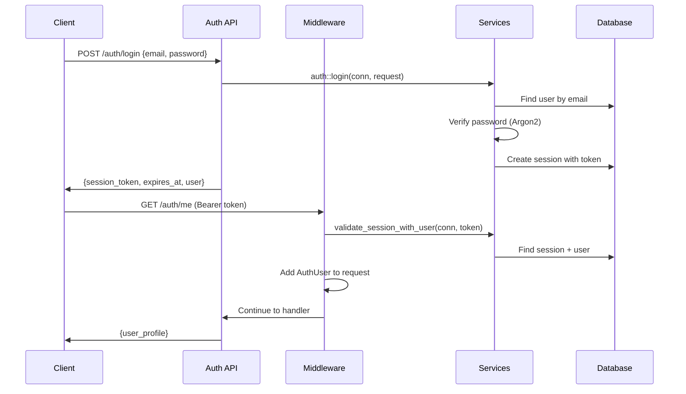

# Architecture Overview

This document provides a high-level overview of the Rust Full-Stack Starter project architecture, design decisions, and patterns.

## System Overview

The Rust Full-Stack Starter provides a well-structured foundation for learning and building full-stack web applications. It demonstrates clean architecture principles with clear separation of concerns.

```
┌─────────────────┐    ┌─────────────────┐    ┌─────────────────┐
│   Web Client    │    │   CLI Client    │    │  External APIs  │
│   (Future)      │    │                 │    │   (Future)      │
└─────────┬───────┘    └─────────┬───────┘    └─────────┬───────┘
          │                      │                      │
          └──────────────────────┼──────────────────────┘
                                 │
                    ┌─────────────▼───────────────┐
                    │     Rust Application       │
                    │  ┌─────────┐ ┌─────────┐   │
                    │  │ Server  │ │ Worker  │   │
                    │  │  Mode   │ │  Mode   │   │
                    │  └─────────┘ └─────────┘   │
                    └─────────────┬───────────────┘
                                  │
                    ┌─────────────▼───────────────┐
                    │     PostgreSQL Database     │
                    │   ┌─────────────────────┐   │
                    │   │  users, sessions,   │   │
                    │   │  api_keys, tasks    │   │
                    │   └─────────────────────┘   │
                    └─────────────────────────────┘
```

## Core Components

### 1. Application Binary (`starter`)

A single binary that operates in multiple modes:

- **Server Mode**: HTTP API server with authentication and business logic
- **Worker Mode**: Background job processor for async tasks
- **CLI Interface**: Command-line interface for operational tasks

**Key Features:**
- Single binary deployment
- Mode selection via CLI arguments
- Shared configuration and database layer
- Graceful shutdown handling

### 2. Configuration System

Hierarchical configuration with environment variable support:

```
Default Values → Environment Variables → CLI Arguments → Runtime Config
```

**Features:**
- Type-safe configuration structs
- Environment variable parsing with nested support (`STARTER__DATABASE__HOST`)
- Comprehensive validation at startup
- Separate concerns (app config vs. tooling config)

### 3. Database Layer

Robust PostgreSQL integration with:

- **Connection Pooling**: Configurable min/max connections with timeouts
- **Migrations**: Version-controlled schema changes with sqlx
- **Health Checks**: Database connectivity monitoring
- **Type Safety**: Compile-time SQL validation where possible

### 4. Error Handling

Comprehensive error handling system:

- **Custom Error Types**: Domain-specific error variants
- **HTTP Error Mapping**: Automatic conversion to appropriate HTTP status codes
- **Structured Logging**: Contextual error information
- **Validation Errors**: Field-level validation with helpful messages

## Design Patterns

### 1. Clean Architecture

The application follows clean architecture principles:

```
┌─────────────────────────────────────────────────────────┐
│                    Presentation Layer                   │
│  ┌─────────────┐  ┌─────────────┐  ┌─────────────┐     │
│  │ HTTP Routes │  │ CLI Handler │  │ RPC Endpoints│     │
│  └─────────────┘  └─────────────┘  └─────────────┘     │
└─────────────────────┬───────────────────────────────────┘
                      │
┌─────────────────────▼───────────────────────────────────┐
│                  Business Logic Layer                   │
│  ┌─────────────┐  ┌─────────────┐  ┌─────────────┐     │
│  │  Services   │  │ Validation  │  │ Authentication│    │
│  └─────────────┘  └─────────────┘  └─────────────┘     │
└─────────────────────┬───────────────────────────────────┘
                      │
┌─────────────────────▼───────────────────────────────────┐
│                   Data Access Layer                     │
│  ┌─────────────┐  ┌─────────────┐  ┌─────────────┐     │
│  │ Repository  │  │   Models    │  │  Database   │     │
│  └─────────────┘  └─────────────┘  └─────────────┘     │
└─────────────────────────────────────────────────────────┘
```

### 2. Domain-Driven Design (DDD)

Core business entities and their relationships:

- **User**: Authentication and authorization
- **Session**: User sessions and access control  
- **ApiKey**: Machine-to-machine authentication
- **Task**: Background job processing

### 3. Modular Architecture

The codebase follows a modular pattern where related functionality is grouped into self-contained modules:

```rust
// Each module contains its own api, models, and services
src/auth/           -- Authentication domain
├── api.rs          -- HTTP endpoints
├── models.rs       -- Domain models  
├── services.rs     -- Business logic
└── middleware.rs   -- Auth guards

src/users/          -- User management domain
├── api.rs          -- HTTP endpoints
├── models.rs       -- Domain models
└── services.rs     -- Business logic
```

**Key Principles:**
- **Domain Separation**: Each module owns its domain logic
- **Service Layer**: Functions take `&mut DbConn` as first parameter
- **API Layer**: Handlers acquire connections and pass to services
- **Model Layer**: Domain-specific types and validation

**Service Layer Pattern:**
```rust
// Services take database connections as first parameter
pub async fn create_user(
    conn: &mut DbConn,
    req: CreateUserRequest,
) -> Result<UserProfile> {
    // Business logic here
}

// API handlers acquire connections
pub async fn register(
    State(app_state): State<AppState>,
    Json(payload): Json<CreateUserRequest>,
) -> Result<Json<ApiResponse<UserProfile>>, Error> {
    let mut conn = app_state.database.pool.acquire().await?;
    let user_profile = user_services::create_user(&mut conn, payload).await?;
    Ok(Json(ApiResponse::success(user_profile)))
}
```

### 4. Dependency Injection

Configuration and database connections are injected through application state:

```rust
#[derive(Clone)]
pub struct AppState {
    pub database: Database,
    pub config: AppConfig,
}
```

## Database Schema

### Core Tables

```sql
users           -- User accounts and authentication
├── id (UUID, PK)
├── username (unique)
├── email (unique)
├── password_hash
├── role (admin/user)
├── is_active
├── email_verified
└── timestamps

sessions        -- User session management
├── id (UUID, PK)
├── user_id (FK → users.id)
├── token (unique)
├── expires_at
├── user_agent
└── timestamps

api_keys        -- Machine authentication
├── id (UUID, PK)
├── name
├── key_hash (unique)
├── key_prefix
├── created_by (FK → users.id)
├── permissions (JSONB)
└── timestamps

tasks           -- Background job queue
├── id (UUID, PK)
├── task_type
├── payload (JSONB)
├── status
├── priority
├── retry_count
└── timestamps
```

### Key Design Decisions

1. **UUIDs**: All primary keys use UUIDs for distributed system compatibility
2. **JSONB**: Flexible data storage for permissions and task payloads
3. **Timestamps**: Automatic created_at/updated_at with triggers
4. **Indexes**: Performance-optimized indexes on frequently queried columns
5. **Constraints**: Data integrity enforced at database level

## Authentication Architecture

### Session-Based Authentication

The starter implements a session-based authentication system using secure tokens:

```rust
// Session model
pub struct Session {
    pub id: Uuid,
    pub user_id: Uuid,
    pub token: String,        // 64-character alphanumeric
    pub expires_at: DateTime<Utc>,  // 24-hour expiry
    pub user_agent: Option<String>,
    pub is_active: bool,
}
```

### Authentication Flow



### Security Features

- **Password Hashing**: Argon2 with secure defaults
- **Session Tokens**: 64-character cryptographically secure tokens
- **Token Validation**: Middleware validates tokens on protected routes
- **Session Expiry**: Automatic 24-hour expiration with cleanup
- **Role-Based Access**: Admin/user role separation
- **SQL Injection Prevention**: Parameterized queries only

For detailed API endpoint documentation, see [api-endpoints.md](./api-endpoints.md).

## Performance Considerations

### Database Performance

- **Connection Pooling**: Prevents connection exhaustion
- **Query Optimization**: Indexed columns for common queries
- **Migration Strategy**: Non-blocking schema changes
- **Health Monitoring**: Database connectivity checks

### Application Performance

- **Async Runtime**: Tokio for high-concurrency workloads
- **Memory Management**: Zero-copy operations where possible
- **Error Handling**: Fast-path for common error cases
- **Configuration**: Validated once at startup

## Scalability Design

### Horizontal Scaling

- **Stateless Design**: No server-side state (except database)
- **Session Storage**: Database-backed sessions for multi-instance deployment
- **Background Jobs**: Distributed task processing
- **Database Pooling**: Configurable connection limits

### Operational Scaling

- **Single Binary**: Easy deployment and management
- **Health Endpoints**: Load balancer integration
- **Graceful Shutdown**: Clean connection handling
- **Configuration**: Environment-based configuration

## Development Patterns

### Code Organization

```
src/
├── main.rs         -- CLI entry point and mode selection
├── lib.rs          -- Library exports and module structure
├── config.rs       -- Configuration management
├── database.rs     -- Database connection and migrations
├── error.rs        -- Error types and HTTP conversion
├── types.rs        -- Common type definitions
├── models.rs       -- Legacy models (being phased out)
├── server.rs       -- HTTP server and routing
├── api/            -- Shared API handlers (health checks)
├── auth/           -- Authentication module
│   ├── mod.rs      -- Module exports
│   ├── api.rs      -- Auth endpoints (login, register, logout)
│   ├── models.rs   -- Auth models (Session, LoginRequest)
│   ├── services.rs -- Auth business logic
│   ├── middleware.rs -- Auth middleware and guards
│   ├── cleanup.rs  -- Session cleanup jobs
│   └── tests.rs    -- Auth tests
└── users/          -- User management module
    ├── mod.rs      -- Module exports
    ├── api.rs      -- User endpoints (profile, management)
    ├── models.rs   -- User models (User, UserProfile)
    └── services.rs -- User business logic
```

### Testing Strategy

- **Unit Tests**: Individual function and module testing
- **Integration Tests**: Database and API endpoint testing
- **Property Tests**: Data validation and business logic
- **End-to-End Tests**: Full application workflow testing

### Error Handling Strategy

1. **Domain Errors**: Business logic validation errors
2. **Infrastructure Errors**: Database and external service errors
3. **HTTP Errors**: Request validation and authentication errors
4. **System Errors**: Configuration and runtime errors

## Future Architecture

### Current Implementation

✅ **HTTP API Layer**: Basic Axum server with health endpoints  
✅ **Database Layer**: PostgreSQL with SQLx and migrations  
✅ **Authentication**: Session-based auth with middleware
✅ **User Management**: Registration, login, and profile management
✅ **Error Handling**: Custom error types with HTTP conversion  
✅ **Configuration**: Environment-based configuration system  
✅ **Development Scripts**: Automated server management

### Potential Extensions

1. **Background Workers**: Task processing and scheduling
2. **Frontend Integration**: React or similar SPA framework
3. **API Keys**: Machine-to-machine authentication
4. **Advanced Features**: File upload, email, notifications

### Technology Choices

- **Web Framework**: Axum (fast, type-safe, async)
- **Database**: PostgreSQL (ACID compliance, JSON support)
- **Authentication**: Session-based (simple, secure)
- **Background Jobs**: Database-backed queue (straightforward, reliable)
- **Development**: Docker containers (consistent environment)

## Operational Considerations

### Monitoring

- **Health Endpoints**: Application and database health
- **Metrics Collection**: Performance and usage metrics
- **Logging**: Structured logging with correlation IDs
- **Error Tracking**: Comprehensive error reporting

### Deployment

- **Container Strategy**: Single container, multiple processes
- **Environment Management**: Environment-specific configuration
- **Database Migrations**: Automated schema management
- **Secret Management**: External secret injection

### Maintenance

- **Dependency Updates**: Regular security and feature updates
- **Database Maintenance**: Index optimization and cleanup
- **Log Rotation**: Automated 50MB rotation in development scripts
- **Process Management**: PID tracking and graceful shutdown
- **Health Monitoring**: Automated endpoint testing
- **Backup Strategy**: Data protection and recovery