# 📝 Handwritten Notebook: Rust Full-Stack Mastery

*A comprehensive 100-page study guide for mastering the Rust fullstack starter system through detailed diagrams, code analysis, and deep understanding.*

---

## 🎯 **Phase 1: Foundation (Pages 1-25)**

### **Section 1: System Overview (Pages 1-15)**
*Goal: Build core mental models of the system architecture*

#### **Page 1-2: Overall System Architecture**

The Rust fullstack starter demonstrates a **single binary, multiple modes** architecture that prioritizes learning and simplicity:

```mermaid
graph TB
    subgraph "🌍 External World"
        USER[👤 User Browser]
        API_CLIENT[🔌 API Client]
        CLI_USER[⚡ CLI Admin]
    end
    
    subgraph "🦀 Single Rust Binary"
        subgraph "🌐 Server Mode :3000"
            HTTP[🚀 HTTP Server<br/>Axum Framework]
            AUTH[🔐 Auth Middleware<br/>Session Validation]
            ROUTES[📍 REST Routes<br/>JSON API]
            STATIC[📁 Static Files<br/>React SPA]
        end
        
        subgraph "⚙️ Worker Mode"
            WORKER[👷 Task Processor<br/>Background Jobs]
            HANDLERS[🔧 Task Handlers<br/>Email, Webhook, etc.]
            CIRCUIT[🔄 Circuit Breaker<br/>Fault Tolerance]
        end
        
        subgraph "🏗️ Shared Foundation"
            CONFIG[⚙️ Config<br/>Environment Based]
            ERROR[🚨 Error Types<br/>HTTP Mapping]
            DB_POOL[🏊 Connection Pool<br/>SQLx + PostgreSQL]
        end
    end
    
    subgraph "💾 Data Layer"
        POSTGRES[(🗄️ PostgreSQL<br/>5 Core Tables)]
    end
    
    USER --> HTTP
    API_CLIENT --> HTTP
    CLI_USER --> HTTP
    
    HTTP --> AUTH
    AUTH --> ROUTES
    HTTP --> STATIC
    
    WORKER --> HANDLERS
    HANDLERS --> CIRCUIT
    
    ROUTES --> CONFIG
    WORKER --> CONFIG
    CONFIG --> ERROR
    ERROR --> DB_POOL
    
    DB_POOL --> POSTGRES
    
    classDef external fill:#fff3e0,stroke:#e65100,stroke-width:2px
    classDef server fill:#e3f2fd,stroke:#01579b,stroke-width:2px
    classDef worker fill:#e8f5e8,stroke:#1b5e20,stroke-width:2px
    classDef shared fill:#fce4ec,stroke:#c2185b,stroke-width:2px
    classDef data fill:#f3e5f5,stroke:#4a148c,stroke-width:2px
    
    class USER,API_CLIENT,CLI_USER external
    class HTTP,AUTH,ROUTES,STATIC server
    class WORKER,HANDLERS,CIRCUIT worker
    class CONFIG,ERROR,DB_POOL shared
    class POSTGRES data
```



**🧠 Key Insights**:
- **One Binary**: Single deployment artifact `starter/src/main.rs:4`
- **Multiple Modes**: `cargo run -- server` vs `cargo run -- worker` 
- **Shared Code**: Authentication, database, config used by both modes
- **Clean Separation**: HTTP handling separate from background processing

#### **Page 3-4: Technology Stack Rationale**

**Why These Specific Technologies?**

| Component | Choice | Alternative | Why Our Choice? |
|-----------|--------|-------------|-----------------|
| **Backend** | Rust + Axum | Node.js + Express | Type safety, performance, learning value |
| **Database** | PostgreSQL | MySQL, SQLite | JSONB support, full-text search, reliability |
| **Auth** | Sessions + Database | JWT + Redis | Simpler for learning, immediate revocation |
| **Frontend** | React + TypeScript | Vue, Angular | Generated types, ecosystem maturity |
| **Queue** | Database Tables | Redis, RabbitMQ | Fewer moving parts, transaction safety |

**Technology Decision Tree**:

```mermaid
graph TD
    START[🎯 Requirements]
    
    LEARN[📚 Learning Priority?]
    PERF[⚡ Performance Priority?]
    SCALE[📈 Scale Priority?]
    
    SIMPLE[🔧 Simple Stack]
    COMPLEX[🏗️ Complex Stack]
    DISTRIBUTED[🌐 Distributed Stack]
    
    START --> LEARN
    START --> PERF
    START --> SCALE
    
    LEARN --> SIMPLE
    PERF --> COMPLEX
    SCALE --> DISTRIBUTED
    
    SIMPLE --> |Our Choice| RUST_AXUM[🦀 Rust + Axum<br/>PostgreSQL<br/>Sessions]
    COMPLEX --> NODE_REDIS[🟢 Node.js + Redis<br/>JWT + Microservices]
    DISTRIBUTED --> CLOUD[☁️ Serverless Functions<br/>Event Streaming]
    
    classDef chosen fill:#e8f5e8,stroke:#1b5e20,stroke-width:3px
    classDef alternative fill:#fff3e0,stroke:#e65100,stroke-width:2px
    
    class RUST_AXUM chosen
    class NODE_REDIS,CLOUD alternative
```


**📁 File References**:
- Main entry point: `starter/src/main.rs:1-6`
- Module structure: `starter/src/lib.rs:1-21`
- Configuration: `starter/src/config.rs`

#### **Page 5-6: Request Flow from Browser to Database**

**Complete Request Lifecycle**:

```mermaid
sequenceDiagram
    participant B as 🌐 Browser
    participant S as 🦀 Server
    participant A as 🔐 Auth Middleware
    participant H as 📍 Handler
    participant SL as 🔧 Service Layer
    participant D as 🗄️ Database
    
    Note over B,D: Authentication & Request Processing
    
    B->>S: 1. HTTP Request + Auth Header
    Note right of B: Authorization: Bearer <session_token>
    
    S->>A: 2. Extract & Validate Token
    A->>D: 3. Query sessions table
    D-->>A: 4. User data + session validity
    A->>A: 5. Inject User into request
    
    A->>H: 6. Route to Handler
    Note right of A: User available in Extensions
    
    H->>SL: 7. Call Service Layer
    Note right of H: Pass database connection
    
    SL->>D: 8. Business Logic + SQL
    D-->>SL: 9. Query Results
    
    SL-->>H: 10. Processed Data
    H-->>A: 11. JSON Response
    A-->>S: 12. HTTP Response
    S-->>B: 13. Final Response
    
    Note over B,D: Error paths exist at every step
```


**🧠 Mental Model**: Every request follows the same pattern:
1. **Authentication** first (who are you?)
2. **Authorization** second (what can you do?)
3. **Business Logic** third (do the work)
4. **Database** fourth (persist changes)
5. **Response** fifth (return results)

**📁 File References**:
- Auth middleware: `starter/src/auth/middleware.rs`
- Request extractors: `starter/src/auth/api.rs`
- Service layer pattern: `starter/src/users/services.rs`

#### **Page 7-8: Module Structure and Responsibilities**

**Clean Module Architecture**:


**Module Responsibility Matrix**:

| Module | HTTP API | Business Logic | Data Models | Middleware | Tests |
|--------|----------|---------------|-------------|------------|-------|
| **auth** | ✅ Login/Register | ✅ Password hashing | ✅ User/Session | ✅ Auth guard | ✅ Integration |
| **users** | ✅ CRUD ops | ✅ User management | ✅ Profile data | ❌ | ✅ Service tests |
| **tasks** | ✅ Task CRUD | ✅ Job processing | ✅ Task queue | ❌ | ✅ Handler tests |
| **monitoring** | ✅ Events/Metrics | ✅ Observability | ✅ Event data | ❌ | ✅ Metric tests |

**📁 Key Files**:
- Module definitions: `starter/src/lib.rs:1-21`
- Domain structure: Each module follows same pattern
- Dependency flow: Foundation → Domains → Applications

#### **Page 9-10: Database Schema Relationships**

**Complete Entity Relationship Diagram**:


**🧠 Design Principles**:
1. **UUIDs everywhere** - No ID conflicts, distributed-system ready
2. **Timestamps with timezone** - Consistent across deployments
3. **JSONB for flexibility** - Type-safe flexible data
4. **Constraint validation** - Database enforces business rules
5. **Foreign keys** - Referential integrity guaranteed

**📁 Schema Files**:
- Users: `starter/migrations/001_users.up.sql:1-34`
- Sessions: `starter/migrations/002_sessions.up.sql:1-24`
- Tasks: `starter/migrations/004_tasks.up.sql:1-38`
- Task Types: `starter/migrations/005_task_types.up.sql:1-30`

#### **Page 11-12: Unified Static Serving Strategy**

**Why Serve Frontend from Rust?**

Instead of separate deployments, we use **unified static serving**:

```mermaid
graph TB
    subgraph "🌐 Client Side"
        BROWSER[Browser Request]
        SPA[React SPA]
    end
    
    subgraph "🦀 Single Rust Server"
        subgraph "📁 Static Routes"
            ROOT[/ → index.html]
            ASSETS[/assets/* → CSS/JS]
            FALLBACK[/* → index.html]
        end
        
        subgraph "🔌 API Routes"
            API[/api/v1/* → JSON]
            HEALTH[/health → Status]
            DOCS[/api-docs → OpenAPI]
        end
        
        subgraph "📦 Embedded Assets"
            BUILD[web/dist/ → Binary]
            INDEX[index.html]
            CHUNKS[JS/CSS Chunks]
        end
    end
    
    BROWSER --> ROOT
    ROOT --> INDEX
    INDEX --> SPA
    
    SPA --> ASSETS
    ASSETS --> CHUNKS
    
    SPA --> API
    API --> |JSON Response| SPA
    
    BUILD --> ROOT
    BUILD --> ASSETS
    BUILD --> FALLBACK
    
    classDef client fill:#e3f2fd,stroke:#01579b,stroke-width:2px
    classDef static fill:#e8f5e8,stroke:#1b5e20,stroke-width:2px
    classDef api fill:#fff3e0,stroke:#e65100,stroke-width:2px
    classDef embedded fill:#fce4ec,stroke:#c2185b,stroke-width:2px
    
    class BROWSER,SPA client
    class ROOT,ASSETS,FALLBACK static
    class API,HEALTH,DOCS api
    class BUILD,INDEX,CHUNKS embedded
```

**Request Routing Logic**:

```mermaid
graph TD
    REQUEST[HTTP Request]
    
    CHECK_API{Path starts with /api/?}
    CHECK_ASSETS{Static asset?}
    CHECK_SPA{SPA route?}
    
    API_HANDLER[🔌 API Handler]
    STATIC_FILE[📁 Static File]
    SPA_FALLBACK[📄 index.html]
    
    REQUEST --> CHECK_API
    CHECK_API -->|Yes| API_HANDLER
    CHECK_API -->|No| CHECK_ASSETS
    
    CHECK_ASSETS -->|Yes| STATIC_FILE
    CHECK_ASSETS -->|No| CHECK_SPA
    
    CHECK_SPA -->|Yes| SPA_FALLBACK
    CHECK_SPA -->|No| SPA_FALLBACK
    
    classDef decision fill:#fff3e0,stroke:#e65100,stroke-width:2px
    classDef handler fill:#e8f5e8,stroke:#1b5e20,stroke-width:2px
    
    class CHECK_API,CHECK_ASSETS,CHECK_SPA decision
    class API_HANDLER,STATIC_FILE,SPA_FALLBACK handler
```


**Benefits of Unified Serving**:
- ✅ **Single deployment** - One binary, one container
- ✅ **No CORS issues** - Same origin for API and frontend
- ✅ **Simplified routing** - SPA handles client-side routing
- ✅ **Built-in CDN** - Rust serves static files efficiently
- ✅ **Atomic deployments** - Frontend and backend always in sync

**📁 Implementation**:
- Server setup: `starter/src/server.rs`
- Static file serving: Built into Axum routing
- Build integration: React builds into `web/dist/`

#### **Page 13-14: Component Interaction Patterns**

**Cross-Module Communication**:


**Dependency Flow Rules**:
1. **Inward Dependencies Only** - No circular references
2. **Layer Separation** - Each layer has distinct responsibilities
3. **Service Reuse** - Services used by API, CLI, and background workers
4. **Database Abstraction** - Services handle all SQL complexity

#### **Page 15: Deep Dive Questions and Insights**

**🔍 Critical Understanding Questions**:

1. **How does Axum serve both static files AND API routes?**
   - Router priority: API routes checked first
   - Fallback mechanism: SPA routes default to index.html
   - Static file middleware: Serves assets directly from memory

2. **Why use sessions instead of JWTs?**
   - Immediate revocation capability
   - Server-side state control
   - Simpler for learning (no cryptographic complexity)
   - Database-backed reliability

3. **What happens when the React app makes an API call?**
   - Same-origin request (no CORS)
   - Session token in Authorization header
   - Middleware validates token against database
   - User context available throughout request

4. **How does the single binary handle multiple modes?**
   - CLI argument parsing determines mode
   - Shared configuration and database pool
   - Different runtime loops (HTTP server vs task polling)

**🧠 Key System Insights**:
- **Simplicity over sophistication** - Easy to understand and debug
- **Type safety end-to-end** - Rust types prevent runtime errors
- **Database as source of truth** - All state persisted reliably
- **Clear separation of concerns** - Each module has one responsibility

---

### **Section 2: Authentication Deep Dive (Pages 16-25)**
*Goal: Master the complete authentication system*

#### **Page 16-17: Authentication Flow Sequence Diagram**

**Complete Authentication Flow from Login to Protected Resource Access**:

```mermaid
sequenceDiagram
    participant U as 👤 User
    participant R as 🌐 React App
    participant S as 🦀 Server
    participant M as 🔐 Auth Middleware
    participant D as 🗄️ Database
    
    Note over U,D: Initial Login Process
    
    U->>R: 1. Enter credentials (username/email + password)
    R->>R: 2. Validate form data
    R->>S: 3. POST /auth/login (JSON body)
    S->>D: 4. Query user by username/email
    D-->>S: 5. Return user record with password_hash
    S->>S: 6. Verify password with Argon2
    
    alt Password Valid
        S->>D: 7. Create new session record
        D-->>S: 8. Return session with token
        S-->>R: 9. LoginResponse{session_token, expires_at, user}
        R->>R: 10. Store token in memory (useAuthStore)
        R-->>U: 11. Redirect to dashboard
    else Password Invalid
        S-->>R: 12. 401 Unauthorized error
        R-->>U: 13. Show error message
    end
    
    Note over U,D: Subsequent Protected Requests
    
    U->>R: 14. Click protected action
    R->>S: 15. API request with Authorization: Bearer <token>
    S->>M: 16. Auth middleware intercepts
    M->>D: 17. Query sessions table by token
    D-->>M: 18. Return session + user data
    
    alt Session Valid & Not Expired
        M->>M: 19. Create AuthUser, inject into request
        M->>S: 20. Continue to handler
        S->>S: 21. Process business logic
        S-->>R: 22. Success response
        R-->>U: 23. Update UI
    else Session Invalid/Expired
        M-->>R: 24. 401 Unauthorized
        R->>R: 25. Clear stored token
        R-->>U: 26. Redirect to login
    end
```



**🧠 Key Implementation Details**:
- **Password Hashing**: Argon2 with salt `starter/src/auth/services.rs:verify_password`
- **Session Creation**: 64-char random token `starter/src/auth/services.rs:11-21`
- **Token Extraction**: Bearer token from header `starter/src/auth/middleware.rs:21-30`
- **User Injection**: AuthUser struct in request extensions `starter/src/auth/middleware.rs:12-18`

#### **Page 18-19: RBAC Hierarchy and Permissions**

**Three-Tier Role-Based Access Control**:

```mermaid
graph TD
    subgraph "🏛️ Role Hierarchy"
        ADMIN[👑 Admin<br/>Complete System Control]
        MODERATOR[👮 Moderator<br/>User & Content Management]
        USER[👤 User<br/>Personal Data Only]
    end
    
    subgraph "🔐 Permission Matrix"
        subgraph "👤 User Permissions"
            USER_OWN[✅ Own profile CRUD]
            USER_TASKS[✅ Own tasks CRUD]
            USER_VIEW[✅ Public content view]
            USER_AUTH[✅ Login/logout]
        end
        
        subgraph "👮 Moderator Permissions"
            MOD_USER_MGMT[✅ User profile management]
            MOD_CONTENT[✅ Content moderation]
            MOD_MONITORING[✅ System monitoring]
            MOD_REPORTS[✅ User reports]
        end
        
        subgraph "👑 Admin Permissions"
            ADMIN_ALL[✅ All system operations]
            ADMIN_USERS[✅ User role assignment]
            ADMIN_SYSTEM[✅ System configuration]
            ADMIN_CLI[✅ CLI admin tools]
        end
    end
    
    ADMIN --> MODERATOR
    MODERATOR --> USER
    
    ADMIN -.-> ADMIN_ALL
    ADMIN -.-> ADMIN_USERS
    ADMIN -.-> ADMIN_SYSTEM
    ADMIN -.-> ADMIN_CLI
    
    MODERATOR -.-> MOD_USER_MGMT
    MODERATOR -.-> MOD_CONTENT
    MODERATOR -.-> MOD_MONITORING
    MODERATOR -.-> MOD_REPORTS
    
    USER -.-> USER_OWN
    USER -.-> USER_TASKS
    USER -.-> USER_VIEW
    USER -.-> USER_AUTH
    
    classDef admin fill:#ffcdd2,stroke:#d32f2f,stroke-width:2px
    classDef moderator fill:#fff3e0,stroke:#e65100,stroke-width:2px
    classDef user fill:#e8f5e8,stroke:#1b5e20,stroke-width:2px
    classDef permissions fill:#e3f2fd,stroke:#01579b,stroke-width:1px
    
    class ADMIN admin
    class MODERATOR moderator
    class USER user
    class USER_OWN,USER_TASKS,USER_VIEW,USER_AUTH,MOD_USER_MGMT,MOD_CONTENT,MOD_MONITORING,MOD_REPORTS,ADMIN_ALL,ADMIN_USERS,ADMIN_SYSTEM,ADMIN_CLI permissions
```



**Ownership-Based RBAC Implementation**:

```mermaid
graph TB
    subgraph "🔐 Two-Pattern Access Control"
        REQUEST[HTTP Request + AuthUser]
        OPERATION_TYPE{Operation Type?}
        
        subgraph "🏠 Pattern 1: Individual Operations"
            GET_RESOURCE[Get resource from DB]
            OWNERSHIP_CHECK{User owns resource?}
            ADMIN_CHECK{Admin/Moderator?}
            INDIVIDUAL_ACCESS[✅ Access granted]
            NOT_FOUND[❌ 404 Not Found]
        end
        
        subgraph "📦 Pattern 2: Bulk Operations"
            ROLE_CHECK{Moderator+ role?}
            BULK_ACCESS[✅ Access granted]
            FORBIDDEN[❌ 403 Forbidden]
        end
    end
    
    REQUEST --> OPERATION_TYPE
    OPERATION_TYPE -->|Individual CRUD| GET_RESOURCE
    OPERATION_TYPE -->|Bulk operation| ROLE_CHECK
    
    GET_RESOURCE --> OWNERSHIP_CHECK
    OWNERSHIP_CHECK -->|Yes| INDIVIDUAL_ACCESS
    OWNERSHIP_CHECK -->|No| ADMIN_CHECK
    ADMIN_CHECK -->|Yes| INDIVIDUAL_ACCESS
    ADMIN_CHECK -->|No| NOT_FOUND
    
    ROLE_CHECK -->|Yes| BULK_ACCESS
    ROLE_CHECK -->|No| FORBIDDEN
    
    classDef success fill:#e8f5e8,stroke:#1b5e20,stroke-width:2px
    classDef failure fill:#ffcdd2,stroke:#d32f2f,stroke-width:2px
    classDef security fill:#fff3e0,stroke:#e65100,stroke-width:2px
    classDef pattern fill:#e3f2fd,stroke:#01579b,stroke-width:2px
    
    class INDIVIDUAL_ACCESS,BULK_ACCESS success
    class NOT_FOUND,FORBIDDEN failure
    class OWNERSHIP_CHECK,ADMIN_CHECK,ROLE_CHECK security
    class GET_RESOURCE,OPERATION_TYPE pattern
```



**Core RBAC Functions**:

```rust
// Pattern 1: Ownership-based access (individual operations)
pub fn can_access_own_resource(user: &AuthUser, resource_owner: Uuid) -> Result<(), Error> {
    match user.role {
        UserRole::Admin | UserRole::Moderator => Ok(()),
        UserRole::User => {
            if resource_owner == user.id {
                Ok(())
            } else {
                // Return 404 to prevent information leakage
                Err(Error::NotFound("Resource not found".to_string()))
            }
        }
    }
}

// Pattern 2: Role-based access (bulk operations)
pub fn require_moderator_or_higher(user: &AuthUser) -> Result<(), Error> {
    match user.role {
        UserRole::Admin | UserRole::Moderator => Ok(()),
        UserRole::User => Err(Error::Forbidden("Insufficient permissions".to_string())),
    }
}
```

**📁 Ownership-Based RBAC Code References**:
- Core RBAC service: `starter/src/rbac/services.rs:176-191` (can_access_own_resource)
- Role requirements: `starter/src/rbac/services.rs:197-203` (require_moderator_or_higher)  
- Database schema: Every resource has `created_by UUID REFERENCES users(id)`
- Security principle: Return 404 (not 403) for ownership violations to prevent info leakage
- Transaction safety: All ownership checks use atomic get-check-update pattern with `tx.begin()...tx.commit()`

#### **Page 20-21: Database Schema for Auth System**

**Detailed Authentication Tables with Relationships**:


**Key Schema Design Decisions**:

1. **UUID Primary Keys**: Distributed-system ready, no conflicts
2. **Unique Constraints**: Both username AND email must be unique
3. **Password Security**: Only hashed passwords stored, never plaintext
4. **Role Constraint**: Database enforces valid role values
5. **Session Expiry**: Built-in expiration with refresh capability
6. **Audit Trail**: Created/updated timestamps on all tables
7. **Cascade Deletes**: Sessions deleted when user deleted

**📁 Migration Files**:
- Users table: `starter/migrations/001_users.up.sql:2-34`
- Sessions table: `starter/migrations/002_sessions.up.sql:2-24`
- API keys table: `starter/migrations/003_api_keys.up.sql`

#### **Page 22-23: Middleware Architecture and Request Processing**

**Authentication Middleware Flow**:


**AuthUser Context Injection**:


**📁 Middleware Implementation**:
- Main middleware: `starter/src/auth/middleware.rs:33-50`
- Token extraction: `starter/src/auth/middleware.rs:21-30`
- AuthUser struct: `starter/src/auth/middleware.rs:12-18`

#### **Page 24-25: Session Management and Security Considerations**

**Session Lifecycle Management**:


**Security Implementation Details**:

```mermaid
graph TB
    subgraph "🔐 Password Security"
        PASSWORD[User Password]
        ARGON2[Argon2 Hashing]
        SALT[Random Salt]
        HASH[Password Hash Storage]
        VERIFY[Verification Process]
    end
    
    subgraph "🎫 Session Token Security"
        RANDOM[Cryptographically Secure RNG]
        TOKEN[64-Character Token]
        DATABASE[Database Storage Only]
        BEARER[Bearer Authorization Header]
    end
    
    subgraph "⏰ Expiration Strategy"
        EXPIRY[24-Hour Default]
        REFRESH[Refresh Extension]
        CLEANUP[Background Cleanup]
        REVOCATION[Immediate Revocation]
    end
    
    subgraph "🛡️ Attack Mitigation"
        RATE_LIMIT[Rate Limiting]
        AUDIT_LOG[Audit Logging]
        TOKEN_ROTATION[Token Rotation]
        SECURE_HEADERS[Security Headers]
    end
    
    PASSWORD --> ARGON2
    ARGON2 --> SALT
    SALT --> HASH
    HASH --> VERIFY
    
    RANDOM --> TOKEN
    TOKEN --> DATABASE
    DATABASE --> BEARER
    
    EXPIRY --> REFRESH
    REFRESH --> CLEANUP
    CLEANUP --> REVOCATION
    
    RATE_LIMIT --> AUDIT_LOG
    AUDIT_LOG --> TOKEN_ROTATION
    TOKEN_ROTATION --> SECURE_HEADERS
    
    classDef security fill:#ffcdd2,stroke:#d32f2f,stroke-width:2px
    classDef token fill:#e8f5e8,stroke:#1b5e20,stroke-width:2px
    classDef time fill:#fff3e0,stroke:#e65100,stroke-width:2px
    classDef defense fill:#e3f2fd,stroke:#01579b,stroke-width:2px
    
    class PASSWORD,ARGON2,SALT,HASH,VERIFY security
    class RANDOM,TOKEN,DATABASE,BEARER token
    class EXPIRY,REFRESH,CLEANUP,REVOCATION time
    class RATE_LIMIT,AUDIT_LOG,TOKEN_ROTATION,SECURE_HEADERS defense
```



**🛡️ Security Best Practices Implemented**:

1. **Password Security**:
   - Argon2 hashing algorithm (winner of password hashing competition)
   - Unique salt per password
   - Never store plaintext passwords
   - Configurable work factors

2. **Session Token Security**:
   - Cryptographically secure random generation
   - 64-character length (384 bits of entropy)
   - Database-only storage (not in cookies)
   - Bearer token authentication

3. **Session Lifecycle**:
   - Configurable expiration (24h default)
   - Refresh mechanism with minimal interval
   - Immediate revocation capability
   - Background expiration cleanup

4. **Request Security**:
   - Authorization header extraction only
   - Database validation on every request
   - User context injection for handlers
   - Graceful error handling

**📁 Security Implementation**:
- Password hashing: `starter/src/auth/services.rs`
- Token generation: `starter/src/auth/services.rs:11-21`
- Session validation: `starter/src/auth/middleware.rs`
- Cleanup service: `starter/src/auth/cleanup.rs`

**🧠 Key Security Insights**:
- **Defense in depth**: Multiple security layers
- **Fail securely**: Default to deny access
- **Audit everything**: Track all authentication events
- **Minimize attack surface**: Simple, well-understood patterns

---

## 🚀 **Phase 2: Core Systems (Pages 26-45)**

### **Section 3: Background Tasks Deep Dive (Pages 26-35)**
*Goal: Understand the async processing engine*

#### **Page 26-27: Task System Architecture Overview**

**Why Background Tasks Matter**:
Background tasks solve the fundamental conflict between user experience (fast responses) and system requirements (reliable processing).

```mermaid
graph TB
    subgraph "🌐 HTTP API Layer"
        CLIENT[👤 Client Request]
        API[🚀 REST API Server<br/>/api/v1/tasks]
        RESPONSE[⚡ Immediate Response<br/>Task queued successfully]
    end
    
    subgraph "💾 Database Queue System"
        TASKS_TABLE[(📋 tasks table<br/>JSONB payload + status)]
        TASK_TYPES[(🏷️ task_types table<br/>Handler registry)]
        INDEXES[📊 Performance Indexes<br/>status + priority + created_at]
    end
    
    subgraph "⚙️ Background Worker Process"
        WORKER[👷 Task Processor<br/>Polls every 5 seconds]
        REGISTRY[🔧 Handler Registry<br/>task_type → Handler]
        CIRCUIT[🔄 Circuit Breaker<br/>Fault tolerance]
        
        subgraph "📨 Built-in Handlers"
            EMAIL[📧 Email Handler<br/>SMTP delivery]
            WEBHOOK[🔗 Webhook Handler<br/>HTTP callbacks]
            DATA_PROC[📊 Data Processing<br/>File operations]
        end
    end
    
    subgraph "🔄 Reliability Layer"
        RETRY[🔁 Exponential Backoff<br/>3 retries by default]
        DEAD_LETTER[💀 Dead Letter Queue<br/>Failed tasks preserved]
        MONITORING[📈 Task Metrics<br/>Success/failure rates]
    end
    
    CLIENT --> API
    API --> TASKS_TABLE
    API --> RESPONSE
    
    WORKER --> TASKS_TABLE
    WORKER --> TASK_TYPES
    WORKER --> REGISTRY
    
    REGISTRY --> EMAIL
    REGISTRY --> WEBHOOK
    REGISTRY --> DATA_PROC
    
    EMAIL --> RETRY
    WEBHOOK --> RETRY
    DATA_PROC --> RETRY
    
    RETRY --> DEAD_LETTER
    RETRY --> MONITORING
    
    classDef api fill:#e3f2fd,stroke:#01579b,stroke-width:2px
    classDef data fill:#f3e5f5,stroke:#4a148c,stroke-width:2px
    classDef worker fill:#e8f5e8,stroke:#1b5e20,stroke-width:2px
    classDef handlers fill:#fff3e0,stroke:#e65100,stroke-width:2px
    classDef reliability fill:#ffcdd2,stroke:#d32f2f,stroke-width:2px
    
    class CLIENT,API,RESPONSE api
    class TASKS_TABLE,TASK_TYPES,INDEXES data
    class WORKER,REGISTRY,CIRCUIT worker
    class EMAIL,WEBHOOK,DATA_PROC handlers
    class RETRY,DEAD_LETTER,MONITORING reliability
```



**🧠 Core Design Principles**:
1. **Database as Queue**: PostgreSQL provides ACID guarantees
2. **Task Type Registration**: Workers register handlers before processing
3. **Concurrent Processing**: Semaphore limits concurrent tasks
4. **Circuit Breaker Pattern**: Prevents cascade failures
5. **Visibility**: All task states queryable via SQL

**📁 Key Implementation Files**:
- Task processor: `starter/src/tasks/processor.rs:23-50`
- Handler trait: `starter/src/tasks/handlers.rs:7-11`
- Task types: `starter/src/tasks/types.rs:14-21`

#### **Page 28-29: Task Lifecycle State Machine**

**Complete State Transition Diagram**:


**Task Status Enum Implementation**:
```mermaid
graph LR
    subgraph "🗄️ Database Constraints"
        STATUS_CHECK[CHECK constraint<br/>status IN (...)]
        PRIORITY_CHECK[CHECK constraint<br/>priority IN (...)]
    end
    
    subgraph "🦀 Rust Enum Types"
        TASK_STATUS[TaskStatus enum<br/>Pending/Running/Completed/Failed/Cancelled/Retrying]
        TASK_PRIORITY[TaskPriority enum<br/>Low/Normal/High/Critical]
    end
    
    subgraph "🔄 State Transitions"
        ATOMIC[Atomic SQL Updates<br/>UPDATE WHERE id = ? AND status = ?]
        CONFLICT[Optimistic Concurrency<br/>Handle update conflicts]
    end
    
    STATUS_CHECK --> TASK_STATUS
    PRIORITY_CHECK --> TASK_PRIORITY
    TASK_STATUS --> ATOMIC
    TASK_PRIORITY --> ATOMIC
    
    ATOMIC --> CONFLICT
    
    classDef database fill:#f3e5f5,stroke:#4a148c,stroke-width:2px
    classDef rust fill:#e8f5e8,stroke:#1b5e20,stroke-width:2px
    classDef concurrency fill:#fff3e0,stroke:#e65100,stroke-width:2px
    
    class STATUS_CHECK,PRIORITY_CHECK database
    class TASK_STATUS,TASK_PRIORITY rust
    class ATOMIC,CONFLICT concurrency
```

**📁 State Machine Code**:
- Status enum: `starter/src/tasks/types.rs:14-34`
- State transitions: `starter/src/tasks/processor.rs`
- Database constraints: `starter/migrations/004_tasks.up.sql:6-9`

#### **Page 30-31: Task Registration and Validation Flow**

**Task Type Registration System**:

```mermaid
sequenceDiagram
    participant W as 👷 Worker Process
    participant R as 🔧 Handler Registry
    participant D as 🗄️ Database
    participant A as 🚀 API Server
    participant C as 👤 Client
    
    Note over W,C: Worker Startup & Registration
    
    W->>R: 1. Register "email" handler
    W->>R: 2. Register "webhook" handler
    W->>R: 3. Register "data_processing" handler
    
    R->>D: 4. INSERT INTO task_types<br/>(task_type, description, is_active)
    D-->>R: 5. Registration confirmed
    
    Note over W,C: Task Creation Flow
    
    C->>A: 6. POST /api/v1/tasks<br/>{"task_type": "email", "payload": {...}}
    A->>D: 7. Check task_types table<br/>WHERE task_type = 'email'
    
    alt Task Type Registered
        D-->>A: 8. ✅ Type exists and active
        A->>D: 9. INSERT INTO tasks<br/>(task_type, payload, status)
        D-->>A: 10. Task created successfully
        A-->>C: 11. 201 Created + task_id
    else Task Type Not Registered
        D-->>A: 12. ❌ Type not found
        A-->>C: 13. 400 Bad Request<br/>"Task type not supported"
    end
    
    Note over W,C: Task Processing
    
    W->>D: 14. SELECT * FROM tasks<br/>WHERE status = 'pending'
    D-->>W: 15. Pending tasks list
    W->>R: 16. Get handler for task_type
    R-->>W: 17. Handler instance
    W->>W: 18. Execute handler.handle()
```



**Handler Registration Pattern**:

```mermaid
graph TB
    subgraph "🏗️ Worker Initialization"
        START[Worker Process Start]
        CREATE_REGISTRY[Create Handler Registry]
        REGISTER_HANDLERS[Register Built-in Handlers]
        UPDATE_DB[Update task_types Table]
    end
    
    subgraph "🔧 Handler Registry"
        EMAIL_HANDLER[EmailTaskHandler::new()]
        WEBHOOK_HANDLER[WebhookTaskHandler::new()]
        DATA_HANDLER[DataProcessingTaskHandler::new()]
        CUSTOM_HANDLER[CustomTaskHandler::new()]
    end
    
    subgraph "🗄️ Database Validation"
        TASK_TYPES_TABLE[(task_types table)]
        FOREIGN_KEY[tasks.task_type FK]
        CONSTRAINT_CHECK[Prevent orphaned tasks]
    end
    
    START --> CREATE_REGISTRY
    CREATE_REGISTRY --> REGISTER_HANDLERS
    REGISTER_HANDLERS --> UPDATE_DB
    
    REGISTER_HANDLERS --> EMAIL_HANDLER
    REGISTER_HANDLERS --> WEBHOOK_HANDLER
    REGISTER_HANDLERS --> DATA_HANDLER
    REGISTER_HANDLERS --> CUSTOM_HANDLER
    
    UPDATE_DB --> TASK_TYPES_TABLE
    TASK_TYPES_TABLE --> FOREIGN_KEY
    FOREIGN_KEY --> CONSTRAINT_CHECK
    
    classDef worker fill:#e8f5e8,stroke:#1b5e20,stroke-width:2px
    classDef handlers fill:#e3f2fd,stroke:#01579b,stroke-width:2px
    classDef database fill:#f3e5f5,stroke:#4a148c,stroke-width:2px
    
    class START,CREATE_REGISTRY,REGISTER_HANDLERS,UPDATE_DB worker
    class EMAIL_HANDLER,WEBHOOK_HANDLER,DATA_HANDLER,CUSTOM_HANDLER handlers
    class TASK_TYPES_TABLE,FOREIGN_KEY,CONSTRAINT_CHECK database
```

**🧠 Why Task Type Registration?**
1. **Prevents Orphaned Tasks**: Can't create tasks without handlers
2. **Runtime Safety**: Fail fast on unknown task types
3. **Documentation**: task_types table serves as handler documentation
4. **Dynamic Registration**: New handlers can be added without code changes

**📁 Registration Implementation**:
- Handler registry: `starter/src/tasks/processor.rs:25`
- Task types table: `starter/migrations/005_task_types.up.sql:4-10`
- Registration logic: `starter/src/tasks/processor.rs`

#### **Page 32-33: Error Handling and Retry Strategies**

**Exponential Backoff Implementation**:

```mermaid
graph TB
    subgraph "🔄 Retry Decision Tree"
        TASK_FAILS[Task Handler Fails]
        ERROR_TYPE{Error Type?}
        RETRYABLE[Retryable Error]
        PERMANENT[Permanent Error]
        
        CHECK_ATTEMPTS{Attempts < Max?}
        CALCULATE_DELAY[Calculate Backoff Delay]
        SCHEDULE_RETRY[Schedule Next Attempt]
        MARK_FAILED[Mark as Failed]
    end
    
    subgraph "⏰ Backoff Calculation"
        BASE_DELAY[Base Delay: 1 second]
        MULTIPLIER[Multiplier: 2^attempt]
        JITTER[Random Jitter: ±25%]
        MAX_DELAY[Max Delay: 5 minutes]
    end
    
    subgraph "💀 Dead Letter Queue"
        FAILED_TASKS[(Failed Tasks)]
        ERROR_ANALYSIS[Error Analysis]
        MANUAL_RETRY[Manual Retry Option]
        ALERTING[Alert Admin]
    end
    
    TASK_FAILS --> ERROR_TYPE
    ERROR_TYPE --> RETRYABLE
    ERROR_TYPE --> PERMANENT
    
    RETRYABLE --> CHECK_ATTEMPTS
    CHECK_ATTEMPTS -->|Yes| CALCULATE_DELAY
    CHECK_ATTEMPTS -->|No| MARK_FAILED
    
    CALCULATE_DELAY --> BASE_DELAY
    BASE_DELAY --> MULTIPLIER
    MULTIPLIER --> JITTER
    JITTER --> MAX_DELAY
    MAX_DELAY --> SCHEDULE_RETRY
    
    PERMANENT --> MARK_FAILED
    MARK_FAILED --> FAILED_TASKS
    FAILED_TASKS --> ERROR_ANALYSIS
    ERROR_ANALYSIS --> MANUAL_RETRY
    ERROR_ANALYSIS --> ALERTING
    
    classDef retry fill:#fff3e0,stroke:#e65100,stroke-width:2px
    classDef backoff fill:#e3f2fd,stroke:#01579b,stroke-width:2px
    classDef deadletter fill:#ffcdd2,stroke:#d32f2f,stroke-width:2px
    
    class TASK_FAILS,ERROR_TYPE,RETRYABLE,CHECK_ATTEMPTS,CALCULATE_DELAY,SCHEDULE_RETRY retry
    class BASE_DELAY,MULTIPLIER,JITTER,MAX_DELAY backoff
    class MARK_FAILED,FAILED_TASKS,ERROR_ANALYSIS,MANUAL_RETRY,ALERTING deadletter
```

**Circuit Breaker Pattern**:

```mermaid
stateDiagram-v2
    [*] --> Closed : Normal operation
    
    Closed --> Open : Failure threshold exceeded<br/>(5 failures in 60 seconds)
    
    Open --> HalfOpen : Timeout period elapsed<br/>(30 seconds default)
    
    HalfOpen --> Closed : Test request succeeds
    HalfOpen --> Open : Test request fails
    
    state Closed {
        [*] --> MonitorFailures : Track success/failure rate
        MonitorFailures --> AllowRequests : Pass through all requests
        AllowRequests --> MonitorFailures : Update metrics
    }
    
    state Open {
        [*] --> RejectRequests : Fail fast - don't execute handler
        RejectRequests --> StartTimer : Wait for recovery period
        StartTimer --> RejectRequests : Continue rejecting
    }
    
    state HalfOpen {
        [*] --> SingleRequest : Allow one test request
        SingleRequest --> EvaluateResult : Check success/failure
        EvaluateResult --> [*] : Transition based on result
    }
    
    note right of Closed : Requests pass through<br/>Track failure rate
    note right of Open : Fail fast<br/>Protect downstream services
    note right of HalfOpen : Test recovery<br/>One request only
```

**Error Classification System**:

```mermaid
graph TB
    subgraph "🚨 Error Types"
        TASK_ERROR[TaskError enum]
        
        VALIDATION[Validation Error<br/>Bad payload format]
        EXECUTION[Execution Error<br/>External service failure]
        TIMEOUT[Timeout Error<br/>Handler too slow]
        PERMANENT[Permanent Error<br/>Configuration issue]
    end
    
    subgraph "🔄 Retry Strategy"
        VALIDATION --> NO_RETRY[❌ No Retry<br/>Fix payload first]
        EXECUTION --> RETRY_WITH_BACKOFF[🔄 Retry with Backoff<br/>Temporary failure]
        TIMEOUT --> RETRY_REDUCED[🔄 Retry with Timeout<br/>Reduce timeout]
        PERMANENT --> NO_RETRY_ALERT[❌ No Retry + Alert<br/>Needs admin action]
    end
    
    subgraph "📊 Monitoring"
        METRICS[Error Rate Metrics]
        ALERTING[Alert Thresholds]
        ANALYSIS[Error Pattern Analysis]
    end
    
    TASK_ERROR --> VALIDATION
    TASK_ERROR --> EXECUTION
    TASK_ERROR --> TIMEOUT
    TASK_ERROR --> PERMANENT
    
    NO_RETRY --> METRICS
    RETRY_WITH_BACKOFF --> METRICS
    RETRY_REDUCED --> METRICS
    NO_RETRY_ALERT --> METRICS
    
    METRICS --> ALERTING
    ALERTING --> ANALYSIS
    
    classDef errors fill:#ffcdd2,stroke:#d32f2f,stroke-width:2px
    classDef retry fill:#fff3e0,stroke:#e65100,stroke-width:2px
    classDef monitoring fill:#e3f2fd,stroke:#01579b,stroke-width:2px
    
    class TASK_ERROR,VALIDATION,EXECUTION,TIMEOUT,PERMANENT errors
    class NO_RETRY,RETRY_WITH_BACKOFF,RETRY_REDUCED,NO_RETRY_ALERT retry
    class METRICS,ALERTING,ANALYSIS monitoring
```

**📁 Error Handling Code**:
- TaskError enum: `starter/src/tasks/types.rs`
- Retry strategy: `starter/src/tasks/retry.rs`
- Circuit breaker: `starter/src/tasks/retry.rs`

#### **Page 34-35: Circuit Breaker Patterns and Dead Letter Queue**

**Circuit Breaker Implementation Details**:

```mermaid
graph TB
    subgraph "📊 Circuit Breaker State"
        STATE[CircuitBreaker State]
        FAILURE_COUNT[Failure Count: i32]
        SUCCESS_COUNT[Success Count: i32]
        LAST_FAILURE[Last Failure: DateTime]
        STATE_ENUM[State: Closed/Open/HalfOpen]
    end
    
    subgraph "⚙️ Configuration"
        FAILURE_THRESHOLD[Failure Threshold: 5]
        RECOVERY_TIMEOUT[Recovery Timeout: 30s]
        SUCCESS_THRESHOLD[Success Threshold: 3]
        WINDOW_SIZE[Time Window: 60s]
    end
    
    subgraph "🔄 State Transitions"
        CHECK_FAILURES{Failures > Threshold?}
        CHECK_TIMEOUT{Timeout Elapsed?}
        CHECK_SUCCESS{Success in HalfOpen?}
        
        CLOSE_CIRCUIT[Close Circuit]
        OPEN_CIRCUIT[Open Circuit]
        HALF_OPEN[Half Open Circuit]
    end
    
    subgraph "📈 Metrics Collection"
        REQUEST_COUNT[Total Requests]
        SUCCESS_RATE[Success Rate %]
        FAILURE_RATE[Failure Rate %]
        RESPONSE_TIME[Average Response Time]
    end
    
    STATE --> FAILURE_COUNT
    STATE --> SUCCESS_COUNT
    STATE --> LAST_FAILURE
    STATE --> STATE_ENUM
    
    FAILURE_THRESHOLD --> CHECK_FAILURES
    RECOVERY_TIMEOUT --> CHECK_TIMEOUT
    SUCCESS_THRESHOLD --> CHECK_SUCCESS
    
    CHECK_FAILURES -->|Yes| OPEN_CIRCUIT
    CHECK_TIMEOUT -->|Yes| HALF_OPEN
    CHECK_SUCCESS -->|Yes| CLOSE_CIRCUIT
    
    OPEN_CIRCUIT --> REQUEST_COUNT
    CLOSE_CIRCUIT --> SUCCESS_RATE
    HALF_OPEN --> FAILURE_RATE
    
    classDef state fill:#e3f2fd,stroke:#01579b,stroke-width:2px
    classDef config fill:#e8f5e8,stroke:#1b5e20,stroke-width:2px
    classDef transitions fill:#fff3e0,stroke:#e65100,stroke-width:2px
    classDef metrics fill:#f3e5f5,stroke:#4a148c,stroke-width:2px
    
    class STATE,FAILURE_COUNT,SUCCESS_COUNT,LAST_FAILURE,STATE_ENUM state
    class FAILURE_THRESHOLD,RECOVERY_TIMEOUT,SUCCESS_THRESHOLD,WINDOW_SIZE config
    class CHECK_FAILURES,CHECK_TIMEOUT,CHECK_SUCCESS,CLOSE_CIRCUIT,OPEN_CIRCUIT,HALF_OPEN transitions
    class REQUEST_COUNT,SUCCESS_RATE,FAILURE_RATE,RESPONSE_TIME metrics
```

**Dead Letter Queue Analysis**:

```mermaid
graph TB
    subgraph "💀 Failed Tasks Analysis"
        FAILED_QUERY[SELECT * FROM tasks<br/>WHERE status = 'failed']
        ERROR_PATTERNS[GROUP BY last_error<br/>Common failure patterns]
        TIME_ANALYSIS[Failure time distribution]
        HANDLER_ANALYSIS[Failures by task_type]
    end
    
    subgraph "🔍 Investigation Tools"
        TASK_DETAILS[Individual task inspection]
        PAYLOAD_ANALYSIS[Payload pattern analysis]
        RETRY_HISTORY[Retry attempt history]
        CORRELATION[Cross-task correlation]
    end
    
    subgraph "🛠️ Recovery Actions"
        MANUAL_RETRY[Manual retry individual tasks]
        BATCH_RETRY[Batch retry by pattern]
        PAYLOAD_FIX[Fix payload and retry]
        HANDLER_UPDATE[Update handler logic]
    end
    
    subgraph "📊 Preventive Measures"
        VALIDATION_IMPROVE[Improve input validation]
        MONITORING_ENHANCE[Enhanced error monitoring]
        TESTING_EXPAND[Expand handler testing]
        ALERTING_TUNE[Tune alerting thresholds]
    end
    
    FAILED_QUERY --> ERROR_PATTERNS
    FAILED_QUERY --> TIME_ANALYSIS
    FAILED_QUERY --> HANDLER_ANALYSIS
    
    ERROR_PATTERNS --> TASK_DETAILS
    TIME_ANALYSIS --> PAYLOAD_ANALYSIS
    HANDLER_ANALYSIS --> RETRY_HISTORY
    
    TASK_DETAILS --> MANUAL_RETRY
    PAYLOAD_ANALYSIS --> BATCH_RETRY
    RETRY_HISTORY --> PAYLOAD_FIX
    CORRELATION --> HANDLER_UPDATE
    
    MANUAL_RETRY --> VALIDATION_IMPROVE
    BATCH_RETRY --> MONITORING_ENHANCE
    PAYLOAD_FIX --> TESTING_EXPAND
    HANDLER_UPDATE --> ALERTING_TUNE
    
    classDef analysis fill:#ffcdd2,stroke:#d32f2f,stroke-width:2px
    classDef investigation fill:#fff3e0,stroke:#e65100,stroke-width:2px
    classDef recovery fill:#e8f5e8,stroke:#1b5e20,stroke-width:2px
    classDef prevention fill:#e3f2fd,stroke:#01579b,stroke-width:2px
    
    class FAILED_QUERY,ERROR_PATTERNS,TIME_ANALYSIS,HANDLER_ANALYSIS analysis
    class TASK_DETAILS,PAYLOAD_ANALYSIS,RETRY_HISTORY,CORRELATION investigation
    class MANUAL_RETRY,BATCH_RETRY,PAYLOAD_FIX,HANDLER_UPDATE recovery
    class VALIDATION_IMPROVE,MONITORING_ENHANCE,TESTING_EXPAND,ALERTING_TUNE prevention
```

**🧠 Key Background Tasks Insights**:
1. **Database as Queue**: Simple, reliable, visible state
2. **State Machine Design**: Clear transitions, no ambiguous states
3. **Handler Registration**: Prevents orphaned tasks, enables type safety
4. **Exponential Backoff**: Reduces load during failures
5. **Circuit Breaker**: Prevents cascade failures
6. **Dead Letter Queue**: Failed tasks preserved for analysis
7. **Monitoring Integration**: All states tracked for observability

**📁 Complete Implementation References**:
- Task processor: `starter/src/tasks/processor.rs`
- Handler trait: `starter/src/tasks/handlers.rs:7-42`
- Retry logic: `starter/src/tasks/retry.rs`
- Database schema: `starter/migrations/004_tasks.up.sql`

---

### **Section 4: Frontend Integration Mastery (Pages 36-45)**
*Goal: Master full-stack type-safe integration*

#### **Page 36-37: Type-Safe Integration Flow**

**OpenAPI-Driven Development Process**:

```mermaid
graph TB
    subgraph "🦀 Rust Backend Development"
        RUST_STRUCTS[Rust Structs<br/>with Serialize/Deserialize]
        UTOIPA_ANNOTATIONS[utoipa Annotations<br/>#[derive(ToSchema)]]
        HANDLER_DOCS[Handler Documentation<br/>#[utoipa::path]]
        OPENAPI_GENERATION[OpenAPI Schema Generation<br/>cargo run -- export-openapi]
    end
    
    subgraph "📄 Contract Definition"
        OPENAPI_JSON[openapi.json<br/>API Contract]
        VALIDATION[Schema Validation<br/>Ensures consistency]
        VERSION_CONTROL[Version Control<br/>Track API changes]
    end
    
    subgraph "⚛️ Frontend Development"
        CODEGEN[TypeScript Generation<br/>pnpm generate-api]
        TS_TYPES[Generated Types<br/>src/types/api.ts]
        API_CLIENT[Typed API Client<br/>src/lib/api/client.ts]
        REACT_COMPONENTS[React Components<br/>Type-safe usage]
    end
    
    subgraph "🔄 Development Workflow"
        DEV_SERVER[Development Mode<br/>Hot reload both sides]
        TYPE_CHECKING[Compile-time Checks<br/>TypeScript validation]
        INTEGRATION_TESTS[E2E Tests<br/>Full stack validation]
    end
    
    RUST_STRUCTS --> UTOIPA_ANNOTATIONS
    UTOIPA_ANNOTATIONS --> HANDLER_DOCS
    HANDLER_DOCS --> OPENAPI_GENERATION
    
    OPENAPI_GENERATION --> OPENAPI_JSON
    OPENAPI_JSON --> VALIDATION
    VALIDATION --> VERSION_CONTROL
    
    OPENAPI_JSON --> CODEGEN
    CODEGEN --> TS_TYPES
    TS_TYPES --> API_CLIENT
    API_CLIENT --> REACT_COMPONENTS
    
    REACT_COMPONENTS --> DEV_SERVER
    RUST_STRUCTS --> DEV_SERVER
    DEV_SERVER --> TYPE_CHECKING
    TYPE_CHECKING --> INTEGRATION_TESTS
    
    classDef backend fill:#e8f5e8,stroke:#1b5e20,stroke-width:2px
    classDef contract fill:#fff3e0,stroke:#e65100,stroke-width:2px
    classDef frontend fill:#e3f2fd,stroke:#01579b,stroke-width:2px
    classDef workflow fill:#f3e5f5,stroke:#4a148c,stroke-width:2px
    
    class RUST_STRUCTS,UTOIPA_ANNOTATIONS,HANDLER_DOCS,OPENAPI_GENERATION backend
    class OPENAPI_JSON,VALIDATION,VERSION_CONTROL contract
    class CODEGEN,TS_TYPES,API_CLIENT,REACT_COMPONENTS frontend
    class DEV_SERVER,TYPE_CHECKING,INTEGRATION_TESTS workflow
```

**End-to-End Type Safety Chain**:

```mermaid
sequenceDiagram
    participant D as 🗄️ Database
    participant R as 🦀 Rust API
    participant S as 📄 OpenAPI Schema
    participant T as 📝 TypeScript
    participant C as ⚛️ React Component
    
    Note over D,C: Type Safety Flow
    
    D->>R: 1. sqlx::FromRow derives types<br/>from database schema
    R->>R: 2. serde::Serialize ensures<br/>JSON serialization compatibility
    R->>S: 3. utoipa::ToSchema generates<br/>OpenAPI documentation
    S->>T: 4. openapi-typescript generates<br/>TypeScript definitions
    T->>C: 5. TypeScript compiler enforces<br/>type checking at build time
    
    Note over D,C: Runtime Validation
    
    C->>T: 6. API call with typed parameters
    T->>R: 7. HTTP request with validated JSON
    R->>R: 8. serde::Deserialize validates<br/>incoming request structure
    R->>D: 9. SQLx ensures query type safety
    D-->>R: 10. Database returns typed results
    R-->>T: 11. JSON response matches schema
    T-->>C: 12. TypeScript receives expected types
```

**🧠 Key Type Safety Benefits**:
1. **Compile-time errors**: API changes break frontend builds
2. **IDE autocomplete**: Full IntelliSense support
3. **Refactoring safety**: Rename operations work across stack
4. **Contract enforcement**: Schema validates both sides
5. **Documentation sync**: Code comments become API docs

**📁 Type Safety Implementation**:
- OpenAPI generation: `starter/src/openapi.rs`
- Generated types: `web/src/types/api.ts:1-50`
- API client: `web/src/lib/api/client.ts:1-50`

#### **Page 38-39: React Query Caching Strategy**

**TanStack Query Architecture**:

```mermaid
graph TB
    subgraph "⚛️ React Component Layer"
        USER_COMPONENT[User Profile Component]
        TASK_COMPONENT[Task List Component]
        AUTH_COMPONENT[Auth Status Component]
        ADMIN_COMPONENT[Admin Dashboard]
    end
    
    subgraph "🪝 Custom Hooks Layer"
        USE_CURRENT_USER[useCurrentUser<br/>Session management]
        USE_TASKS[useTasks<br/>Task list with filters]
        USE_CREATE_TASK[useCreateTask<br/>Mutation with optimistic updates]
        USE_HEALTH[useHealth<br/>System status polling]
    end
    
    subgraph "📦 TanStack Query Core"
        QUERY_CLIENT[QueryClient<br/>Global cache instance]
        QUERY_CACHE[Query Cache<br/>In-memory data store]
        MUTATION_CACHE[Mutation Cache<br/>Pending operations]
        INVALIDATION[Cache Invalidation<br/>Smart refetching]
    end
    
    subgraph "🔄 Background Operations"
        AUTO_REFETCH[Automatic Refetch<br/>Window focus, network recovery]
        BACKGROUND_SYNC[Background Sync<br/>Stale data updates]
        GARBAGE_COLLECT[Garbage Collection<br/>Unused query cleanup]
        PERSISTENCE[Cache Persistence<br/>Local storage backup]
    end
    
    USER_COMPONENT --> USE_CURRENT_USER
    TASK_COMPONENT --> USE_TASKS
    TASK_COMPONENT --> USE_CREATE_TASK
    ADMIN_COMPONENT --> USE_HEALTH
    
    USE_CURRENT_USER --> QUERY_CLIENT
    USE_TASKS --> QUERY_CLIENT
    USE_CREATE_TASK --> MUTATION_CACHE
    USE_HEALTH --> QUERY_CLIENT
    
    QUERY_CLIENT --> QUERY_CACHE
    QUERY_CLIENT --> INVALIDATION
    MUTATION_CACHE --> INVALIDATION
    
    QUERY_CACHE --> AUTO_REFETCH
    QUERY_CACHE --> BACKGROUND_SYNC
    INVALIDATION --> GARBAGE_COLLECT
    AUTO_REFETCH --> PERSISTENCE
    
    classDef components fill:#e3f2fd,stroke:#01579b,stroke-width:2px
    classDef hooks fill:#fff3e0,stroke:#e65100,stroke-width:2px
    classDef query fill:#e8f5e8,stroke:#1b5e20,stroke-width:2px
    classDef background fill:#f3e5f5,stroke:#4a148c,stroke-width:2px
    
    class USER_COMPONENT,TASK_COMPONENT,AUTH_COMPONENT,ADMIN_COMPONENT components
    class USE_CURRENT_USER,USE_TASKS,USE_CREATE_TASK,USE_HEALTH hooks
    class QUERY_CLIENT,QUERY_CACHE,MUTATION_CACHE,INVALIDATION query
    class AUTO_REFETCH,BACKGROUND_SYNC,GARBAGE_COLLECT,PERSISTENCE background
```

**Query Key Strategy and Cache Management**:

```mermaid
graph LR
    subgraph "🔑 Query Key Patterns"
        USER_KEYS[['users', 'current']<br/>['users', userId]<br/>['users', 'list', filters]]
        TASK_KEYS[['tasks', 'list', filters]<br/>['tasks', taskId]<br/>['tasks', 'stats']]
        SYSTEM_KEYS[['health']<br/>['health', 'detailed']<br/>['system', 'metrics']]
    end
    
    subgraph "🔄 Cache Invalidation Rules"
        USER_MUTATIONS[User profile update<br/>→ Invalidate ['users']]
        TASK_MUTATIONS[Task creation<br/>→ Invalidate ['tasks', 'list']<br/>→ Update task stats]
        AUTH_MUTATIONS[Login/logout<br/>→ Invalidate ['users', 'current']<br/>→ Clear all user data]
    end
    
    subgraph "⏰ Cache Timing Strategy"
        FRESH_TIME[Stale Time: 5 minutes<br/>Data considered fresh]
        CACHE_TIME[Cache Time: 30 minutes<br/>Keep in memory when unused]
        REFETCH_INTERVAL[Refetch Interval: 30 seconds<br/>For critical data only]
    end
    
    USER_KEYS --> USER_MUTATIONS
    TASK_KEYS --> TASK_MUTATIONS
    SYSTEM_KEYS --> AUTH_MUTATIONS
    
    USER_MUTATIONS --> FRESH_TIME
    TASK_MUTATIONS --> CACHE_TIME
    AUTH_MUTATIONS --> REFETCH_INTERVAL
    
    classDef keys fill:#e3f2fd,stroke:#01579b,stroke-width:2px
    classDef mutations fill:#fff3e0,stroke:#e65100,stroke-width:2px
    classDef timing fill:#e8f5e8,stroke:#1b5e20,stroke-width:2px
    
    class USER_KEYS,TASK_KEYS,SYSTEM_KEYS keys
    class USER_MUTATIONS,TASK_MUTATIONS,AUTH_MUTATIONS mutations
    class FRESH_TIME,CACHE_TIME,REFETCH_INTERVAL timing
```

**Optimistic Updates Implementation**:

```mermaid
sequenceDiagram
    participant U as 👤 User
    participant C as ⚛️ Component
    participant M as 🔄 Mutation Hook
    participant QC as 📦 Query Cache
    participant A as 🌐 API
    
    Note over U,A: Optimistic Update Flow
    
    U->>C: 1. Submit form (create task)
    C->>M: 2. Trigger mutation
    M->>QC: 3. Get current cache data
    QC-->>M: 4. Current task list
    M->>QC: 5. Optimistically update cache<br/>(add new task immediately)
    M-->>C: 6. UI updates instantly
    C-->>U: 7. Immediate feedback
    
    Note over U,A: Background API Call
    
    M->>A: 8. Send API request
    
    alt API Success
        A-->>M: 9. Success response
        M->>QC: 10. Replace optimistic data<br/>with server response
        QC-->>C: 11. UI stays consistent
    else API Failure
        A-->>M: 12. Error response
        M->>QC: 13. Rollback optimistic update
        QC-->>C: 14. Restore previous state
        C-->>U: 15. Show error message
    end
```

**📁 React Query Implementation**:
- Query client setup: `web/src/integrations/tanstack-query/root-provider.tsx`
- Custom hooks: `web/src/hooks/useApiQueries.ts`
- Cache configuration: TanStack Query defaults with custom timing

#### **Page 40-41: Build Process Architecture**

**Development vs Production Build Flow**:

```mermaid
graph TB
    subgraph "🛠️ Development Mode"
        DEV_VITE[Vite Dev Server<br/>:5173 Hot Module Reload]
        DEV_RUST[Rust API Server<br/>:3000 File watching]
        DEV_PROXY[Vite Proxy Config<br/>API calls → :3000]
        DEV_TYPES[Auto Type Generation<br/>Watch openapi.json]
    end
    
    subgraph "📦 Production Build"
        BUILD_FRONTEND[React Build<br/>pnpm run build]
        BUILD_OPTIMIZE[Asset Optimization<br/>Minification, chunking]
        BUILD_OUTPUT[Static Files<br/>web/dist/]
        BUILD_EMBED[Embed in Rust Binary<br/>include_dir! macro]
    end
    
    subgraph "🚀 Production Serving"
        RUST_SERVER[Single Rust Binary<br/>:3000]
        STATIC_ROUTES[Static File Routes<br/>/ → index.html<br/>/assets/* → chunks]
        API_ROUTES[API Routes<br/>/api/v1/* → handlers]
        SPA_FALLBACK[SPA Fallback<br/>/* → index.html]
    end
    
    subgraph "🔄 CI/CD Pipeline"
        CODE_PUSH[Git Push]
        BUILD_FRONTEND_CI[Build React App]
        BUILD_RUST_CI[Build Rust Binary]
        DOCKER_BUILD[Docker Container]
        DEPLOY[Production Deploy]
    end
    
    DEV_VITE --> DEV_PROXY
    DEV_PROXY --> DEV_RUST
    DEV_RUST --> DEV_TYPES
    
    BUILD_FRONTEND --> BUILD_OPTIMIZE
    BUILD_OPTIMIZE --> BUILD_OUTPUT
    BUILD_OUTPUT --> BUILD_EMBED
    
    BUILD_EMBED --> RUST_SERVER
    RUST_SERVER --> STATIC_ROUTES
    RUST_SERVER --> API_ROUTES
    RUST_SERVER --> SPA_FALLBACK
    
    CODE_PUSH --> BUILD_FRONTEND_CI
    BUILD_FRONTEND_CI --> BUILD_RUST_CI
    BUILD_RUST_CI --> DOCKER_BUILD
    DOCKER_BUILD --> DEPLOY
    
    classDef dev fill:#e3f2fd,stroke:#01579b,stroke-width:2px
    classDef build fill:#fff3e0,stroke:#e65100,stroke-width:2px
    classDef production fill:#e8f5e8,stroke:#1b5e20,stroke-width:2px
    classDef cicd fill:#f3e5f5,stroke:#4a148c,stroke-width:2px
    
    class DEV_VITE,DEV_RUST,DEV_PROXY,DEV_TYPES dev
    class BUILD_FRONTEND,BUILD_OPTIMIZE,BUILD_OUTPUT,BUILD_EMBED build
    class RUST_SERVER,STATIC_ROUTES,API_ROUTES,SPA_FALLBACK production
    class CODE_PUSH,BUILD_FRONTEND_CI,BUILD_RUST_CI,DOCKER_BUILD,DEPLOY cicd
```

**Asset Pipeline and Optimization**:

```mermaid
graph LR
    subgraph "📁 Source Assets"
        TS_FILES[TypeScript Files<br/>.ts, .tsx]
        CSS_FILES[CSS Files<br/>Tailwind CSS]
        IMAGES[Images<br/>.png, .svg, .ico]
        STATIC[Static Files<br/>robots.txt, manifest.json]
    end
    
    subgraph "🔄 Build Transformations"
        TS_COMPILE[TypeScript Compilation<br/>ES2020 target]
        CSS_PURGE[CSS Purging<br/>Remove unused classes]
        IMAGE_OPT[Image Optimization<br/>Compression, formats]
        CHUNK_SPLIT[Code Splitting<br/>Vendor, routes, components]
    end
    
    subgraph "📦 Output Artifacts"
        JS_CHUNKS[JavaScript Chunks<br/>main.js, vendor.js]
        CSS_BUNDLE[CSS Bundle<br/>styles.css]
        OPTIMIZED_IMAGES[Optimized Images<br/>With cache headers]
        INDEX_HTML[index.html<br/>With asset links]
    end
    
    subgraph "🚀 Rust Integration"
        INCLUDE_DIR[include_dir! macro<br/>Compile-time embedding]
        AXUM_ROUTES[Axum Static Routes<br/>ServeDir service]
        CACHE_HEADERS[Cache Headers<br/>Long-term caching]
    end
    
    TS_FILES --> TS_COMPILE
    CSS_FILES --> CSS_PURGE
    IMAGES --> IMAGE_OPT
    STATIC --> CHUNK_SPLIT
    
    TS_COMPILE --> JS_CHUNKS
    CSS_PURGE --> CSS_BUNDLE
    IMAGE_OPT --> OPTIMIZED_IMAGES
    CHUNK_SPLIT --> INDEX_HTML
    
    JS_CHUNKS --> INCLUDE_DIR
    CSS_BUNDLE --> AXUM_ROUTES
    OPTIMIZED_IMAGES --> CACHE_HEADERS
    INDEX_HTML --> INCLUDE_DIR
    
    classDef source fill:#e3f2fd,stroke:#01579b,stroke-width:2px
    classDef transform fill:#fff3e0,stroke:#e65100,stroke-width:2px
    classDef output fill:#e8f5e8,stroke:#1b5e20,stroke-width:2px
    classDef integration fill:#f3e5f5,stroke:#4a148c,stroke-width:2px
    
    class TS_FILES,CSS_FILES,IMAGES,STATIC source
    class TS_COMPILE,CSS_PURGE,IMAGE_OPT,CHUNK_SPLIT transform
    class JS_CHUNKS,CSS_BUNDLE,OPTIMIZED_IMAGES,INDEX_HTML output
    class INCLUDE_DIR,AXUM_ROUTES,CACHE_HEADERS integration
```

**📁 Build Configuration**:
- Vite config: `web/vite.config.ts`
- TypeScript config: `web/tsconfig.json`
- Build scripts: `web/package.json`

#### **Page 42-43: Component to API to Database Flow**

**Complete Data Flow Architecture**:

```mermaid
graph TB
    subgraph "🎨 UI Layer"
        FORM[Form Component<br/>React Hook Form + Zod]
        BUTTON[Submit Button<br/>Loading states]
        ERROR_DISPLAY[Error Display<br/>User-friendly messages]
        SUCCESS_FEEDBACK[Success Feedback<br/>Toast notifications]
    end
    
    subgraph "🪝 Hook Layer"
        MUTATION_HOOK[useMutation Hook<br/>TanStack Query]
        QUERY_HOOK[useQuery Hook<br/>Data fetching]
        AUTH_HOOK[useAuth Hook<br/>Session management]
        FORM_HOOK[useForm Hook<br/>Form state]
    end
    
    subgraph "📡 API Layer"
        API_CLIENT[API Client<br/>Typed fetch wrapper]
        REQUEST_INTERCEPTOR[Request Interceptor<br/>Add auth headers]
        RESPONSE_INTERCEPTOR[Response Interceptor<br/>Handle errors]
        RETRY_LOGIC[Retry Logic<br/>Network failures]
    end
    
    subgraph "🌐 Network Layer"
        HTTP_REQUEST[HTTP Request<br/>JSON + Bearer token]
        CORS_HANDLING[CORS Handling<br/>Same-origin requests]
        ERROR_RESPONSES[Error Responses<br/>4xx/5xx handling]
    end
    
    subgraph "🦀 Rust Handler Layer"
        AUTH_MIDDLEWARE[Auth Middleware<br/>Token validation]
        ROUTE_HANDLER[Route Handler<br/>Business logic]
        VALIDATION[Request Validation<br/>serde + custom validators]
        ERROR_HANDLER[Error Handler<br/>Structured responses]
    end
    
    subgraph "🔧 Service Layer"
        SERVICE_LOGIC[Service Logic<br/>Business operations]
        TRANSACTION[Database Transaction<br/>ACID guarantees]
        SQL_QUERIES[SQL Queries<br/>Type-safe SQLx]
    end
    
    subgraph "🗄️ Database Layer"
        POSTGRES[PostgreSQL<br/>ACID transactions]
        CONSTRAINTS[Constraints<br/>Data integrity]
        INDEXES[Indexes<br/>Query performance]
        TRIGGERS[Triggers<br/>Automatic updates]
    end
    
    FORM --> MUTATION_HOOK
    BUTTON --> FORM_HOOK
    ERROR_DISPLAY --> QUERY_HOOK
    SUCCESS_FEEDBACK --> AUTH_HOOK
    
    MUTATION_HOOK --> API_CLIENT
    QUERY_HOOK --> REQUEST_INTERCEPTOR
    AUTH_HOOK --> RESPONSE_INTERCEPTOR
    FORM_HOOK --> RETRY_LOGIC
    
    API_CLIENT --> HTTP_REQUEST
    REQUEST_INTERCEPTOR --> CORS_HANDLING
    RESPONSE_INTERCEPTOR --> ERROR_RESPONSES
    
    HTTP_REQUEST --> AUTH_MIDDLEWARE
    CORS_HANDLING --> ROUTE_HANDLER
    ERROR_RESPONSES --> VALIDATION
    
    AUTH_MIDDLEWARE --> SERVICE_LOGIC
    ROUTE_HANDLER --> TRANSACTION
    VALIDATION --> SQL_QUERIES
    ERROR_HANDLER --> SERVICE_LOGIC
    
    SERVICE_LOGIC --> POSTGRES
    TRANSACTION --> CONSTRAINTS
    SQL_QUERIES --> INDEXES
    
    classDef ui fill:#e3f2fd,stroke:#01579b,stroke-width:2px
    classDef hooks fill:#fff3e0,stroke:#e65100,stroke-width:2px
    classDef api fill:#e8f5e8,stroke:#1b5e20,stroke-width:2px
    classDef network fill:#f3e5f5,stroke:#4a148c,stroke-width:2px
    classDef rust fill:#ffcdd2,stroke:#d32f2f,stroke-width:2px
    classDef service fill:#e1f5fe,stroke:#0277bd,stroke-width:2px
    classDef database fill:#f1f8e9,stroke:#33691e,stroke-width:2px
    
    class FORM,BUTTON,ERROR_DISPLAY,SUCCESS_FEEDBACK ui
    class MUTATION_HOOK,QUERY_HOOK,AUTH_HOOK,FORM_HOOK hooks
    class API_CLIENT,REQUEST_INTERCEPTOR,RESPONSE_INTERCEPTOR,RETRY_LOGIC api
    class HTTP_REQUEST,CORS_HANDLING,ERROR_RESPONSES network
    class AUTH_MIDDLEWARE,ROUTE_HANDLER,VALIDATION,ERROR_HANDLER rust
    class SERVICE_LOGIC,TRANSACTION,SQL_QUERIES service
    class POSTGRES,CONSTRAINTS,INDEXES,TRIGGERS database
```

**Error Handling Across All Layers**:

```mermaid
sequenceDiagram
    participant UI as 🎨 UI Component
    participant Hook as 🪝 Mutation Hook
    participant API as 📡 API Client
    participant Rust as 🦀 Rust Handler
    participant DB as 🗄️ Database
    
    Note over UI,DB: Happy Path
    UI->>Hook: Submit form data
    Hook->>API: Call API with types
    API->>Rust: HTTP request + auth
    Rust->>DB: Execute SQL query
    DB-->>Rust: Success result
    Rust-->>API: 200 + JSON response
    API-->>Hook: Parsed response
    Hook-->>UI: Success state
    
    Note over UI,DB: Validation Error Path
    UI->>Hook: Submit invalid data
    Hook->>API: Call API
    API->>Rust: HTTP request
    Rust->>Rust: Validation fails
    Rust-->>API: 400 + error details
    API-->>Hook: ValidationError
    Hook-->>UI: Field-level errors
    
    Note over UI,DB: Database Error Path
    UI->>Hook: Submit valid data
    Hook->>API: Call API
    API->>Rust: HTTP request
    Rust->>DB: Execute SQL
    DB-->>Rust: Constraint violation
    Rust-->>API: 409 + conflict error
    API-->>Hook: ConflictError
    Hook-->>UI: User-friendly message
    
    Note over UI,DB: Network Error Path
    UI->>Hook: Submit data
    Hook->>API: Call API
    API->>API: Network timeout
    API-->>Hook: NetworkError
    Hook->>Hook: Retry with backoff
    Hook-->>UI: Loading state + retry
```

**📁 Complete Flow Implementation**:
- Form components: `web/src/components/auth/LoginForm.tsx`
- API client: `web/src/lib/api/client.ts:36-50`
- Rust handlers: `starter/src/auth/api.rs`
- Database operations: `starter/src/auth/services.rs`

#### **Page 44-45: Error Handling and Performance Patterns**

**Comprehensive Error Handling Strategy**:

```mermaid
graph TB
    subgraph "🚨 Error Classification"
        VALIDATION_ERROR[Validation Errors<br/>400 Bad Request<br/>Field-level feedback]
        AUTH_ERROR[Authentication Errors<br/>401 Unauthorized<br/>Redirect to login]
        PERMISSION_ERROR[Permission Errors<br/>403 Forbidden<br/>Role-based messages]
        NOT_FOUND_ERROR[Not Found Errors<br/>404<br/>Resource doesn't exist]
        CONFLICT_ERROR[Conflict Errors<br/>409<br/>Business rule violations]
        SERVER_ERROR[Server Errors<br/>500<br/>Internal system issues]
        NETWORK_ERROR[Network Errors<br/>Timeout, connection issues]
    end
    
    subgraph "🎨 UI Error Presentation"
        INLINE_ERRORS[Inline Field Errors<br/>Form validation feedback]
        TOAST_NOTIFICATIONS[Toast Notifications<br/>Success/error messages]
        ERROR_BOUNDARIES[Error Boundaries<br/>Component crash recovery]
        RETRY_BUTTONS[Retry Buttons<br/>User-initiated recovery]
        LOADING_STATES[Loading States<br/>Prevent double-submission]
    end
    
    subgraph "🔄 Recovery Strategies"
        AUTO_RETRY[Automatic Retry<br/>Network/timeout errors]
        OPTIMISTIC_ROLLBACK[Optimistic Rollback<br/>Mutation failures]
        CACHE_FALLBACK[Cache Fallback<br/>Stale data when offline]
        ERROR_REPORTING[Error Reporting<br/>Analytics/monitoring]
        GRACEFUL_DEGRADATION[Graceful Degradation<br/>Reduced functionality]
    end
    
    VALIDATION_ERROR --> INLINE_ERRORS
    AUTH_ERROR --> TOAST_NOTIFICATIONS
    PERMISSION_ERROR --> ERROR_BOUNDARIES
    NOT_FOUND_ERROR --> RETRY_BUTTONS
    CONFLICT_ERROR --> LOADING_STATES
    SERVER_ERROR --> AUTO_RETRY
    NETWORK_ERROR --> OPTIMISTIC_ROLLBACK
    
    INLINE_ERRORS --> CACHE_FALLBACK
    TOAST_NOTIFICATIONS --> ERROR_REPORTING
    ERROR_BOUNDARIES --> GRACEFUL_DEGRADATION
    
    classDef errors fill:#ffcdd2,stroke:#d32f2f,stroke-width:2px
    classDef ui fill:#e3f2fd,stroke:#01579b,stroke-width:2px
    classDef recovery fill:#e8f5e8,stroke:#1b5e20,stroke-width:2px
    
    class VALIDATION_ERROR,AUTH_ERROR,PERMISSION_ERROR,NOT_FOUND_ERROR,CONFLICT_ERROR,SERVER_ERROR,NETWORK_ERROR errors
    class INLINE_ERRORS,TOAST_NOTIFICATIONS,ERROR_BOUNDARIES,RETRY_BUTTONS,LOADING_STATES ui
    class AUTO_RETRY,OPTIMISTIC_ROLLBACK,CACHE_FALLBACK,ERROR_REPORTING,GRACEFUL_DEGRADATION recovery
```

**Performance Optimization Patterns**:

```mermaid
graph TB
    subgraph "📦 Bundle Optimization"
        CODE_SPLITTING[Code Splitting<br/>Route-based chunks]
        LAZY_LOADING[Lazy Loading<br/>Dynamic imports]
        TREE_SHAKING[Tree Shaking<br/>Dead code elimination]
        BUNDLE_ANALYSIS[Bundle Analysis<br/>Size monitoring]
    end
    
    subgraph "🔄 Caching Strategy"
        QUERY_CACHE[Query Cache<br/>TanStack Query]
        BROWSER_CACHE[Browser Cache<br/>Static assets]
        SERVICE_WORKER[Service Worker<br/>Offline support]
        CDN_CACHE[CDN Cache<br/>Geographic distribution]
    end
    
    subgraph "⚡ Runtime Performance"
        VIRTUAL_SCROLLING[Virtual Scrolling<br/>Large lists]
        MEMOIZATION[React.memo<br/>Expensive components]
        DEBOUNCING[Input Debouncing<br/>Search/filter delays]
        PREFETCHING[Data Prefetching<br/>Predictive loading]
    end
    
    subgraph "📊 Performance Monitoring"
        WEB_VITALS[Web Vitals<br/>Core performance metrics]
        ERROR_TRACKING[Error Tracking<br/>Runtime error monitoring]
        PERFORMANCE_BUDGET[Performance Budget<br/>Size/timing limits]
        A11Y_TESTING[Accessibility Testing<br/>Automated checks]
    end
    
    CODE_SPLITTING --> QUERY_CACHE
    LAZY_LOADING --> BROWSER_CACHE
    TREE_SHAKING --> SERVICE_WORKER
    BUNDLE_ANALYSIS --> CDN_CACHE
    
    QUERY_CACHE --> VIRTUAL_SCROLLING
    BROWSER_CACHE --> MEMOIZATION
    SERVICE_WORKER --> DEBOUNCING
    CDN_CACHE --> PREFETCHING
    
    VIRTUAL_SCROLLING --> WEB_VITALS
    MEMOIZATION --> ERROR_TRACKING
    DEBOUNCING --> PERFORMANCE_BUDGET
    PREFETCHING --> A11Y_TESTING
    
    classDef bundle fill:#e3f2fd,stroke:#01579b,stroke-width:2px
    classDef caching fill:#fff3e0,stroke:#e65100,stroke-width:2px
    classDef runtime fill:#e8f5e8,stroke:#1b5e20,stroke-width:2px
    classDef monitoring fill:#f3e5f5,stroke:#4a148c,stroke-width:2px
    
    class CODE_SPLITTING,LAZY_LOADING,TREE_SHAKING,BUNDLE_ANALYSIS bundle
    class QUERY_CACHE,BROWSER_CACHE,SERVICE_WORKER,CDN_CACHE caching
    class VIRTUAL_SCROLLING,MEMOIZATION,DEBOUNCING,PREFETCHING runtime
    class WEB_VITALS,ERROR_TRACKING,PERFORMANCE_BUDGET,A11Y_TESTING monitoring
```

**🧠 Key Frontend Integration Insights**:
1. **Type Safety**: End-to-end type checking from database to UI
2. **Contract-First**: OpenAPI schema drives both sides
3. **Smart Caching**: TanStack Query optimizes network requests
4. **Error Resilience**: Multiple layers of error handling
5. **Performance Focus**: Bundle splitting and runtime optimization
6. **Development Experience**: Hot reload and instant feedback
7. **Production Ready**: Single binary deployment

**📁 Complete Integration References**:
- Frontend structure: `web/src/` directory organization
- API types: `web/src/types/api.ts:1-50`
- React hooks: `web/src/hooks/useApiQueries.ts`
- Build configuration: `web/vite.config.ts`

---

## 🛠️ **Phase 3: Implementation Practice (Pages 46-75)**

### **Section 5: Notes Feature Implementation (Pages 46-55)**
*Goal: Build muscle memory through hands-on CRUD system*

#### **Page 46-47: Database Design for Notes Feature**

**Notes Feature Requirements Analysis**:
We'll implement a complete CRUD system for user notes to demonstrate full-stack patterns, including permissions, validation, and frontend integration.

```mermaid
erDiagram
    USERS {
        uuid id PK "gen_random_uuid()"
        varchar username UK "Unique constraint"
        varchar email UK "Unique constraint"
        text password_hash "Argon2 with salt"
        text role "CHECK: user|moderator|admin"
        boolean is_active "Default true"
        timestamptz created_at "Auto NOW()"
        timestamptz updated_at "Trigger updated"
    }
    
    NOTES {
        uuid id PK "gen_random_uuid()"
        uuid user_id FK "References users.id CASCADE"
        varchar title "NOT NULL, max 200 chars"
        text content "Full note content"
        boolean is_public "Default false"
        jsonb tags "Flexible tagging system"
        timestamptz created_at "Auto NOW()"
        timestamptz updated_at "Trigger updated"
        timestamptz last_viewed_at "Track usage"
    }
    
    NOTE_SHARES {
        uuid id PK "gen_random_uuid()"
        uuid note_id FK "References notes.id CASCADE"
        uuid shared_by_user_id FK "Who shared it"
        uuid shared_with_user_id FK "Who receives it"
        text permission "CHECK: read|write"
        boolean is_active "Default true"
        timestamptz created_at "Share timestamp"
        timestamptz expires_at "Optional expiry"
    }
    
    NOTE_VERSIONS {
        uuid id PK "gen_random_uuid()"
        uuid note_id FK "References notes.id CASCADE"
        text content_snapshot "Historical content"
        uuid created_by FK "Version author"
        timestamptz created_at "Version timestamp"
        text change_description "What changed"
    }
    
    USERS ||--o{ NOTES : "owns"
    NOTES ||--o{ NOTE_SHARES : "can be shared"
    USERS ||--o{ NOTE_SHARES : "shares notes"
    USERS ||--o{ NOTE_SHARES : "receives shares"
    NOTES ||--o{ NOTE_VERSIONS : "has versions"
    USERS ||--o{ NOTE_VERSIONS : "creates versions"
```

**Database Migration Design**:

```sql
-- Migration: 007_notes.up.sql
BEGIN;

-- Notes table
CREATE TABLE notes (
    id UUID PRIMARY KEY DEFAULT gen_random_uuid(),
    user_id UUID NOT NULL REFERENCES users(id) ON DELETE CASCADE,
    title VARCHAR(200) NOT NULL,
    content TEXT NOT NULL DEFAULT '',
    is_public BOOLEAN NOT NULL DEFAULT false,
    tags JSONB NOT NULL DEFAULT '[]',
    created_at TIMESTAMPTZ NOT NULL DEFAULT NOW(),
    updated_at TIMESTAMPTZ NOT NULL DEFAULT NOW(),
    last_viewed_at TIMESTAMPTZ
);

-- Performance indexes
CREATE INDEX idx_notes_user_id ON notes(user_id);
CREATE INDEX idx_notes_created_at ON notes(created_at DESC);
CREATE INDEX idx_notes_is_public ON notes(is_public) WHERE is_public = true;
CREATE INDEX idx_notes_tags ON notes USING GIN(tags);
CREATE INDEX idx_notes_title_search ON notes USING GIN(to_tsvector('english', title));
CREATE INDEX idx_notes_content_search ON notes USING GIN(to_tsvector('english', content));

-- Note sharing table
CREATE TABLE note_shares (
    id UUID PRIMARY KEY DEFAULT gen_random_uuid(),
    note_id UUID NOT NULL REFERENCES notes(id) ON DELETE CASCADE,
    shared_by_user_id UUID NOT NULL REFERENCES users(id) ON DELETE CASCADE,
    shared_with_user_id UUID NOT NULL REFERENCES users(id) ON DELETE CASCADE,
    permission TEXT NOT NULL DEFAULT 'read'
        CONSTRAINT valid_share_permission CHECK (permission IN ('read', 'write')),
    is_active BOOLEAN NOT NULL DEFAULT true,
    created_at TIMESTAMPTZ NOT NULL DEFAULT NOW(),
    expires_at TIMESTAMPTZ,
    
    -- Prevent duplicate shares
    UNIQUE(note_id, shared_with_user_id)
);

-- Note versions for change tracking
CREATE TABLE note_versions (
    id UUID PRIMARY KEY DEFAULT gen_random_uuid(),
    note_id UUID NOT NULL REFERENCES notes(id) ON DELETE CASCADE,
    content_snapshot TEXT NOT NULL,
    created_by UUID NOT NULL REFERENCES users(id),
    created_at TIMESTAMPTZ NOT NULL DEFAULT NOW(),
    change_description TEXT
);

-- Update triggers
CREATE TRIGGER update_notes_updated_at 
    BEFORE UPDATE ON notes 
    FOR EACH ROW 
    EXECUTE FUNCTION update_updated_at_column();

COMMIT;
```

**🧠 Database Design Principles Applied**:
1. **RBAC Integration**: user_id foreign keys for ownership
2. **Performance**: Strategic indexes for common queries
3. **Full-text Search**: GIN indexes for title/content search
4. **Flexible Data**: JSONB for tags with index support
5. **Audit Trail**: Version tracking with change descriptions
6. **Share Permissions**: Read/write access levels
7. **Data Integrity**: Foreign key constraints with CASCADE

#### **Page 48-49: API Endpoint Design and Structure**

**RESTful API Design for Notes**:

```mermaid
graph TB
    subgraph "🌐 HTTP Methods & Endpoints"
        GET_NOTES[GET /api/v1/notes<br/>List user's notes with filters]
        POST_NOTES[POST /api/v1/notes<br/>Create new note]
        GET_NOTE[GET /api/v1/notes/{id}<br/>Get specific note]
        PUT_NOTE[PUT /api/v1/notes/{id}<br/>Update entire note]
        PATCH_NOTE[PATCH /api/v1/notes/{id}<br/>Partial note update]
        DELETE_NOTE[DELETE /api/v1/notes/{id}<br/>Delete note]
        
        SHARE_NOTE[POST /api/v1/notes/{id}/share<br/>Share note with user]
        UNSHARE_NOTE[DELETE /api/v1/notes/{id}/share/{user_id}<br/>Remove share]
        GET_SHARED[GET /api/v1/notes/shared<br/>Notes shared with me]
        
        SEARCH_NOTES[GET /api/v1/notes/search?q={query}<br/>Full-text search]
        GET_VERSIONS[GET /api/v1/notes/{id}/versions<br/>Note change history]
    end
    
    subgraph "🔐 Permission Matrix"
        OWNER_PERMS[Note Owner<br/>✅ All operations<br/>✅ Share management<br/>✅ Delete]
        
        WRITE_SHARED[Write Shared<br/>✅ Read/Update content<br/>❌ Delete/Share<br/>❌ Change ownership]
        
        READ_SHARED[Read Shared<br/>✅ Read only<br/>❌ All modifications<br/>❌ Share access]
        
        PUBLIC_ACCESS[Public Notes<br/>✅ Read if is_public=true<br/>❌ All modifications]
    end
    
    subgraph "📊 Query Parameters & Filters"
        LIST_FILTERS[?page=1&limit=20<br/>?tag=work,personal<br/>?is_public=true<br/>?order_by=created_at<br/>?order=desc]
        
        SEARCH_PARAMS[?q=full text query<br/>?in=title,content<br/>?limit=50<br/>?include_shared=true]
    end
    
    GET_NOTES --> OWNER_PERMS
    POST_NOTES --> OWNER_PERMS
    GET_NOTE --> READ_SHARED
    PUT_NOTE --> WRITE_SHARED
    DELETE_NOTE --> OWNER_PERMS
    
    SHARE_NOTE --> OWNER_PERMS
    GET_SHARED --> READ_SHARED
    
    GET_NOTES --> LIST_FILTERS
    SEARCH_NOTES --> SEARCH_PARAMS
    
    classDef endpoints fill:#e3f2fd,stroke:#01579b,stroke-width:2px
    classDef permissions fill:#fff3e0,stroke:#e65100,stroke-width:2px
    classDef params fill:#e8f5e8,stroke:#1b5e20,stroke-width:2px
    
    class GET_NOTES,POST_NOTES,GET_NOTE,PUT_NOTE,PATCH_NOTE,DELETE_NOTE,SHARE_NOTE,UNSHARE_NOTE,GET_SHARED,SEARCH_NOTES,GET_VERSIONS endpoints
    class OWNER_PERMS,WRITE_SHARED,READ_SHARED,PUBLIC_ACCESS permissions
    class LIST_FILTERS,SEARCH_PARAMS params
```

**Request/Response Schema Design**:

```mermaid
graph LR
    subgraph "📥 Request Types"
        CREATE_NOTE[CreateNoteRequest<br/>{<br/>  title: string,<br/>  content: string,<br/>  is_public?: boolean,<br/>  tags?: string[]<br/>}]
        
        UPDATE_NOTE[UpdateNoteRequest<br/>{<br/>  title?: string,<br/>  content?: string,<br/>  is_public?: boolean,<br/>  tags?: string[]<br/>}]
        
        SHARE_NOTE_REQ[ShareNoteRequest<br/>{<br/>  user_id: UUID,<br/>  permission: 'read'|'write',<br/>  expires_at?: DateTime<br/>}]
        
        SEARCH_REQ[SearchNotesRequest<br/>{<br/>  query: string,<br/>  include_content: boolean,<br/>  include_shared: boolean<br/>}]
    end
    
    subgraph "📤 Response Types"
        NOTE_RESPONSE[NoteResponse<br/>{<br/>  id: UUID,<br/>  title: string,<br/>  content: string,<br/>  is_public: boolean,<br/>  tags: string[],<br/>  created_at: DateTime,<br/>  updated_at: DateTime,<br/>  is_owner: boolean,<br/>  permission?: 'read'|'write'<br/>}]
        
        NOTE_LIST[NoteListResponse<br/>{<br/>  notes: NoteResponse[],<br/>  total: number,<br/>  page: number,<br/>  limit: number<br/>}]
        
        SHARE_RESPONSE[ShareResponse<br/>{<br/>  id: UUID,<br/>  shared_with: UserProfile,<br/>  permission: string,<br/>  created_at: DateTime<br/>}]
    end
    
    subgraph "🔍 Search Results"
        SEARCH_RESULT[SearchResult<br/>{<br/>  note: NoteResponse,<br/>  highlights: {<br/>    title?: string[],<br/>    content?: string[]<br/>  },<br/>  score: number<br/>}]
    end
    
    CREATE_NOTE --> NOTE_RESPONSE
    UPDATE_NOTE --> NOTE_RESPONSE
    SHARE_NOTE_REQ --> SHARE_RESPONSE
    SEARCH_REQ --> SEARCH_RESULT
    
    NOTE_RESPONSE --> NOTE_LIST
    
    classDef requests fill:#e3f2fd,stroke:#01579b,stroke-width:2px
    classDef responses fill:#e8f5e8,stroke:#1b5e20,stroke-width:2px
    classDef search fill:#f3e5f5,stroke:#4a148c,stroke-width:2px
    
    class CREATE_NOTE,UPDATE_NOTE,SHARE_NOTE_REQ,SEARCH_REQ requests
    class NOTE_RESPONSE,NOTE_LIST,SHARE_RESPONSE responses
    class SEARCH_RESULT search
```

**📁 API Implementation Structure**:
- Handler definitions: `starter/src/notes/api.rs`
- Request/response types: `starter/src/notes/models.rs`
- OpenAPI documentation: `#[utoipa::path]` annotations
- Permission checking: RBAC integration in handlers

#### **Page 50-51: Component Architecture Diagram**

**React Frontend Component Hierarchy**:

```mermaid
graph TB
    subgraph "🏠 Main Application"
        APP[App Component<br/>Router + Auth Provider]
        NOTES_LAYOUT[Notes Layout<br/>Sidebar + Main content]
    end
    
    subgraph "📝 Notes Management"
        NOTES_LIST[NotesList Component<br/>Grid/List view toggle]
        NOTE_ITEM[NoteItem Component<br/>Preview card with actions]
        NOTE_EDITOR[NoteEditor Component<br/>Rich text editor]
        NOTE_VIEWER[NoteViewer Component<br/>Read-only display]
    end
    
    subgraph "🔍 Search & Filters"
        SEARCH_BAR[SearchBar Component<br/>Debounced input]
        FILTER_PANEL[FilterPanel Component<br/>Tags, date, public filters]
        SEARCH_RESULTS[SearchResults Component<br/>Highlighted matches]
    end
    
    subgraph "👥 Sharing Features"
        SHARE_MODAL[ShareModal Component<br/>User selection + permissions]
        SHARED_NOTES[SharedNotes Component<br/>Notes shared with me]
        SHARE_INDICATOR[ShareIndicator Component<br/>Visual sharing status]
    end
    
    subgraph "📊 State Management"
        NOTES_HOOKS[useNotes Hook<br/>List with filters]
        NOTE_HOOKS[useNote Hook<br/>Single note CRUD]
        SEARCH_HOOKS[useSearchNotes Hook<br/>Full-text search]
        SHARE_HOOKS[useShareNote Hook<br/>Share management]
    end
    
    subgraph "🎨 UI Components"
        BUTTON[Button Component<br/>Loading states]
        INPUT[Input Component<br/>Validation feedback]
        MODAL[Modal Component<br/>Share, delete confirmations]
        TOAST[Toast Component<br/>Success/error messages]
    end
    
    APP --> NOTES_LAYOUT
    NOTES_LAYOUT --> NOTES_LIST
    NOTES_LAYOUT --> SEARCH_BAR
    NOTES_LAYOUT --> FILTER_PANEL
    
    NOTES_LIST --> NOTE_ITEM
    NOTE_ITEM --> NOTE_EDITOR
    NOTE_ITEM --> NOTE_VIEWER
    NOTE_ITEM --> SHARE_INDICATOR
    
    SEARCH_BAR --> SEARCH_RESULTS
    NOTE_ITEM --> SHARE_MODAL
    NOTES_LAYOUT --> SHARED_NOTES
    
    NOTES_LIST --> NOTES_HOOKS
    NOTE_EDITOR --> NOTE_HOOKS
    SEARCH_BAR --> SEARCH_HOOKS
    SHARE_MODAL --> SHARE_HOOKS
    
    NOTE_EDITOR --> BUTTON
    SEARCH_BAR --> INPUT
    SHARE_MODAL --> MODAL
    NOTES_HOOKS --> TOAST
    
    classDef app fill:#e3f2fd,stroke:#01579b,stroke-width:2px
    classDef notes fill:#e8f5e8,stroke:#1b5e20,stroke-width:2px
    classDef search fill:#fff3e0,stroke:#e65100,stroke-width:2px
    classDef sharing fill:#f3e5f5,stroke:#4a148c,stroke-width:2px
    classDef hooks fill:#ffcdd2,stroke:#d32f2f,stroke-width:2px
    classDef ui fill:#e1f5fe,stroke:#0277bd,stroke-width:2px
    
    class APP,NOTES_LAYOUT app
    class NOTES_LIST,NOTE_ITEM,NOTE_EDITOR,NOTE_VIEWER notes
    class SEARCH_BAR,FILTER_PANEL,SEARCH_RESULTS search
    class SHARE_MODAL,SHARED_NOTES,SHARE_INDICATOR sharing
    class NOTES_HOOKS,NOTE_HOOKS,SEARCH_HOOKS,SHARE_HOOKS hooks
    class BUTTON,INPUT,MODAL,TOAST ui
```

**Data Flow Through Components**:

```mermaid
sequenceDiagram
    participant U as 👤 User
    participant NL as 📝 NotesList
    participant NH as 🪝 useNotes Hook
    participant QC as 📦 Query Cache
    participant API as 🌐 API Client
    participant NE as ✏️ NoteEditor
    participant MH as 🔄 Mutation Hook
    
    Note over U,MH: Initial Load
    U->>NL: Visit notes page
    NL->>NH: useNotes() hook
    NH->>QC: Check cache first
    
    alt Cache Miss
        QC->>API: Fetch notes list
        API-->>QC: Notes data
        QC-->>NH: Fresh data
    else Cache Hit
        QC-->>NH: Cached data
    end
    
    NH-->>NL: Notes + loading state
    NL-->>U: Render notes grid
    
    Note over U,MH: Create New Note
    U->>NL: Click "New Note"
    NL->>NE: Open editor modal
    U->>NE: Type content
    NE->>MH: useCreateNote.mutate()
    
    MH->>QC: Optimistic update
    QC-->>NL: Immediate UI update
    MH->>API: POST /api/v1/notes
    
    alt Success
        API-->>MH: Created note
        MH->>QC: Replace optimistic data
        QC-->>NL: Confirmed data
    else Error
        API-->>MH: Error response
        MH->>QC: Rollback optimistic update
        MH-->>NE: Show error message
    end
```

**📁 Component Implementation Files**:
- Main components: `web/src/components/notes/`
- Custom hooks: `web/src/hooks/useNotesQueries.ts`
- Route components: `web/src/routes/notes/`

#### **Page 52-53: Service Layer Implementation Patterns**

**Rust Service Layer Architecture**:

```mermaid
graph TB
    subgraph "🔧 Service Layer Pattern"
        MODELS[notes/models.rs<br/>Data structures + validation]
        SERVICES[notes/services.rs<br/>Business logic functions]
        API[notes/api.rs<br/>HTTP handlers]
        DB_OPS[Database Operations<br/>Type-safe SQLx queries]
    end
    
    subgraph "📊 Business Logic Functions"
        CREATE_NOTE[create_note()<br/>Validation + ownership]
        GET_USER_NOTES[get_user_notes()<br/>Filter + pagination]
        UPDATE_NOTE[update_note()<br/>Permission check + versioning]
        DELETE_NOTE[delete_note()<br/>Ownership verification]
        SHARE_NOTE[share_note()<br/>User lookup + permission grant]
        SEARCH_NOTES[search_notes()<br/>Full-text search with ranking]
    end
    
    subgraph "🔍 Permission Checking"
        CAN_READ[can_read_note()<br/>Owner || shared || public]
        CAN_WRITE[can_write_note()<br/>Owner || write permission]
        CAN_DELETE[can_delete_note()<br/>Owner only]
        CAN_SHARE[can_share_note()<br/>Owner only]
    end
    
    subgraph "📈 Query Optimization"
        PAGINATION[Efficient pagination<br/>LIMIT + OFFSET with count]
        SEARCH_RANKING[Search ranking<br/>ts_rank for relevance]
        EAGER_LOADING[Eager loading<br/>JOIN user data in queries]
        INDEX_USAGE[Index usage<br/>GIN indexes for search]
    end
    
    API --> SERVICES
    SERVICES --> CREATE_NOTE
    SERVICES --> GET_USER_NOTES
    SERVICES --> UPDATE_NOTE
    SERVICES --> DELETE_NOTE
    SERVICES --> SHARE_NOTE
    SERVICES --> SEARCH_NOTES
    
    CREATE_NOTE --> CAN_WRITE
    UPDATE_NOTE --> CAN_WRITE
    DELETE_NOTE --> CAN_DELETE
    SHARE_NOTE --> CAN_SHARE
    
    GET_USER_NOTES --> PAGINATION
    SEARCH_NOTES --> SEARCH_RANKING
    SERVICES --> EAGER_LOADING
    SEARCH_NOTES --> INDEX_USAGE
    
    SERVICES --> DB_OPS
    MODELS --> SERVICES
    
    classDef service fill:#e8f5e8,stroke:#1b5e20,stroke-width:2px
    classDef business fill:#e3f2fd,stroke:#01579b,stroke-width:2px
    classDef permissions fill:#fff3e0,stroke:#e65100,stroke-width:2px
    classDef optimization fill:#f3e5f5,stroke:#4a148c,stroke-width:2px
    
    class MODELS,SERVICES,API,DB_OPS service
    class CREATE_NOTE,GET_USER_NOTES,UPDATE_NOTE,DELETE_NOTE,SHARE_NOTE,SEARCH_NOTES business
    class CAN_READ,CAN_WRITE,CAN_DELETE,CAN_SHARE permissions
    class PAGINATION,SEARCH_RANKING,EAGER_LOADING,INDEX_USAGE optimization
```

**Service Function Implementation Pattern**:

```rust
// Example: notes/services.rs
use crate::{
    error::Error,
    notes::models::{Note, CreateNoteRequest, UpdateNoteRequest},
    rbac::services as rbac_services,
    types::{DbConn, Result},
};

pub async fn create_note(
    conn: &mut DbConn,
    user_id: Uuid,
    request: CreateNoteRequest,
) -> Result<Note> {
    // 1. Validate input
    request.validate()?;
    
    // 2. Business logic
    let note = sqlx::query_as!(
        Note,
        r#"
        INSERT INTO notes (user_id, title, content, is_public, tags)
        VALUES ($1, $2, $3, $4, $5)
        RETURNING *
        "#,
        user_id,
        request.title,
        request.content,
        request.is_public.unwrap_or(false),
        serde_json::to_value(&request.tags.unwrap_or_default())?
    )
    .fetch_one(&mut **conn)
    .await
    .map_err(Error::from_sqlx)?;
    
    // 3. Create initial version
    create_note_version(conn, note.id, &note.content, user_id, "Initial version").await?;
    
    Ok(note)
}

pub async fn get_user_notes(
    conn: &mut DbConn,
    user_id: Uuid,
    filters: NotesFilter,
) -> Result<(Vec<Note>, i64)> {
    // Build dynamic query based on filters
    let mut query_builder = QueryBuilder::new(
        "SELECT n.*, u.username as owner_username FROM notes n 
         JOIN users u ON n.user_id = u.id WHERE "
    );
    
    // Permission-based filtering
    query_builder.push("(n.user_id = ");
    query_builder.push_bind(user_id);
    query_builder.push(" OR n.is_public = true OR EXISTS (
        SELECT 1 FROM note_shares ns 
        WHERE ns.note_id = n.id AND ns.shared_with_user_id = ");
    query_builder.push_bind(user_id);
    query_builder.push(" AND ns.is_active = true))");
    
    // Apply filters
    if let Some(tag) = filters.tag {
        query_builder.push(" AND n.tags ? ");
        query_builder.push_bind(tag);
    }
    
    // Order and pagination
    query_builder.push(" ORDER BY n.created_at DESC LIMIT ");
    query_builder.push_bind(filters.limit.unwrap_or(20));
    query_builder.push(" OFFSET ");
    query_builder.push_bind(filters.offset.unwrap_or(0));
    
    let notes = query_builder
        .build_query_as::<Note>()
        .fetch_all(&mut **conn)
        .await
        .map_err(Error::from_sqlx)?;
    
    // Get total count for pagination
    let total = get_user_notes_count(conn, user_id, &filters).await?;
    
    Ok((notes, total))
}

pub async fn can_write_note(
    conn: &mut DbConn,
    note_id: Uuid,
    user_id: Uuid,
) -> Result<bool> {
    let result = sqlx::query!(
        r#"
        SELECT 
            CASE 
                WHEN n.user_id = $2 THEN true
                WHEN EXISTS (
                    SELECT 1 FROM note_shares ns 
                    WHERE ns.note_id = $1 
                    AND ns.shared_with_user_id = $2 
                    AND ns.permission = 'write'
                    AND ns.is_active = true
                ) THEN true
                ELSE false
            END as can_write
        FROM notes n 
        WHERE n.id = $1
        "#,
        note_id,
        user_id
    )
    .fetch_optional(&mut **conn)
    .await
    .map_err(Error::from_sqlx)?;
    
    Ok(result.map(|r| r.can_write.unwrap_or(false)).unwrap_or(false))
}
```

**🧠 Service Layer Design Principles**:
1. **Single Responsibility**: Each function has one clear purpose
2. **Permission Integration**: RBAC checks in every operation
3. **Transaction Support**: Functions work within transactions
4. **Error Handling**: Structured error types with context
5. **Performance**: Efficient queries with proper indexes
6. **Validation**: Input validation at service boundary
7. **Auditing**: Version tracking for change history

#### **Page 54-55: Integration and Error Handling**

**Complete Error Handling Strategy**:

```mermaid
graph TB
    subgraph "🚨 Error Types & Responses"
        VALIDATION_ERR[ValidationError<br/>400 Bad Request<br/>Field-specific messages]
        PERMISSION_ERR[PermissionError<br/>403 Forbidden<br/>Cannot access resource]  
        NOT_FOUND_ERR[NotFoundError<br/>404 Not Found<br/>Note doesn't exist]
        CONFLICT_ERR[ConflictError<br/>409 Conflict<br/>Concurrent modification]
        RATE_LIMIT_ERR[RateLimitError<br/>429 Too Many Requests<br/>Slow down requests]
    end
    
    subgraph "🔧 Backend Error Handling" 
        INPUT_VALIDATION[Input Validation<br/>serde + custom validators]
        PERMISSION_CHECK[Permission Checking<br/>RBAC service integration]
        DB_ERROR_MAPPING[Database Error Mapping<br/>Constraint violations → user errors]
        STRUCTURED_RESPONSE[Structured Error Response<br/>ApiError with details]
    end
    
    subgraph "⚛️ Frontend Error Handling"
        FIELD_ERRORS[Field-level Errors<br/>Form validation feedback]
        TOAST_ERRORS[Toast Notifications<br/>Operation success/failure]
        RETRY_MECHANISM[Retry Mechanism<br/>Network error recovery]
        FALLBACK_UI[Fallback UI<br/>Graceful degradation]
    end
    
    subgraph "📊 Error Monitoring"
        ERROR_LOGGING[Error Logging<br/>Structured logs with context]
        METRICS_TRACKING[Metrics Tracking<br/>Error rates by endpoint]
        ALERT_THRESHOLDS[Alert Thresholds<br/>High error rate notifications]
        USER_FEEDBACK[User Feedback<br/>Error report collection]
    end
    
    VALIDATION_ERR --> INPUT_VALIDATION
    PERMISSION_ERR --> PERMISSION_CHECK
    NOT_FOUND_ERR --> DB_ERROR_MAPPING
    CONFLICT_ERR --> STRUCTURED_RESPONSE
    
    INPUT_VALIDATION --> FIELD_ERRORS
    PERMISSION_CHECK --> TOAST_ERRORS
    DB_ERROR_MAPPING --> RETRY_MECHANISM
    STRUCTURED_RESPONSE --> FALLBACK_UI
    
    FIELD_ERRORS --> ERROR_LOGGING
    TOAST_ERRORS --> METRICS_TRACKING
    RETRY_MECHANISM --> ALERT_THRESHOLDS
    FALLBACK_UI --> USER_FEEDBACK
    
    classDef errors fill:#ffcdd2,stroke:#d32f2f,stroke-width:2px
    classDef backend fill:#e8f5e8,stroke:#1b5e20,stroke-width:2px
    classDef frontend fill:#e3f2fd,stroke:#01579b,stroke-width:2px
    classDef monitoring fill:#f3e5f5,stroke:#4a148c,stroke-width:2px
    
    class VALIDATION_ERR,PERMISSION_ERR,NOT_FOUND_ERR,CONFLICT_ERR,RATE_LIMIT_ERR errors
    class INPUT_VALIDATION,PERMISSION_CHECK,DB_ERROR_MAPPING,STRUCTURED_RESPONSE backend
    class FIELD_ERRORS,TOAST_ERRORS,RETRY_MECHANISM,FALLBACK_UI frontend
    class ERROR_LOGGING,METRICS_TRACKING,ALERT_THRESHOLDS,USER_FEEDBACK monitoring
```

**Full-Stack Integration Testing Strategy**:

```mermaid
sequenceDiagram
    participant T as 🧪 Integration Test
    participant F as ⚛️ Frontend
    participant API as 🌐 API Server
    participant DB as 🗄️ Test Database
    
    Note over T,DB: Test Setup
    T->>DB: Create isolated test database
    T->>API: Start test server
    T->>F: Initialize React Testing Library
    
    Note over T,DB: Happy Path Test
    T->>F: Render NotesList component
    F->>API: GET /api/v1/notes (with mock auth)
    API->>DB: Query user notes
    DB-->>API: Return test data
    API-->>F: Notes list response
    F-->>T: Component renders notes
    T->>T: Assert notes are displayed
    
    Note over T,DB: Error Path Test
    T->>F: Render CreateNote form
    T->>F: Submit invalid data
    F->>API: POST /api/v1/notes (invalid)
    API->>API: Validation fails
    API-->>F: 400 + field errors
    F-->>T: Show validation errors
    T->>T: Assert error messages shown
    
    Note over T,DB: Permission Test
    T->>DB: Create note owned by user A
    T->>F: Login as user B
    F->>API: GET /api/v1/notes/{note_id}
    API->>DB: Check permissions
    DB-->>API: Permission denied
    API-->>F: 403 Forbidden
    F-->>T: Access denied message
    T->>T: Assert proper error handling
    
    Note over T,DB: Cleanup
    T->>API: Shutdown test server
    T->>DB: Drop test database
```

**🧠 Key Implementation Insights**:
1. **Domain-Driven Design**: Notes module follows established patterns
2. **Permission-First**: Every operation checks user permissions
3. **Type Safety**: End-to-end type checking from DB to UI
4. **Error Boundaries**: Multiple layers of error handling
5. **Performance**: Optimized queries with proper indexing
6. **Testing**: Comprehensive coverage of happy and error paths
7. **Monitoring**: Built-in observability for production use

**📁 Complete Implementation References**:
- Database migration: `starter/migrations/007_notes.up.sql`
- Service layer: `starter/src/notes/services.rs`
- API handlers: `starter/src/notes/api.rs`
- Frontend components: `web/src/components/notes/`
- Integration tests: `starter/tests/notes_integration_tests.rs`

---

### **Section 6: Testing Mastery (Pages 56-65)**
*Goal: Comprehensive testing strategies*

#### **Page 56-57: Testing Architecture Overview**

**Integration-First Testing Philosophy**:

```mermaid
graph TB
    subgraph "🧪 Testing Pyramid (Web-App Optimized)"
        E2E_TESTS[🌐 End-to-End Tests<br/>5% - Critical user journeys<br/>Playwright browser automation]
        
        INTEGRATION_TESTS[🔌 Integration Tests<br/>90% - Main testing focus<br/>136 tests covering full HTTP stack]
        
        UNIT_TESTS[⚙️ Unit Tests<br/>5% - Pure functions only<br/>Validation, algorithms, utilities]
    end
    
    subgraph "🏗️ Test Infrastructure"
        TEST_APP[TestApp Framework<br/>Spawns real server per test]
        TEST_DB[Isolated Test Databases<br/>Fresh DB per test]
        TEST_CLIENT[HTTP Test Client<br/>reqwest with auth handling]
        TEST_FACTORIES[Test Data Factories<br/>Consistent test data generation]
    end
    
    subgraph "📊 Test Categories"
        AUTH_TESTS[Authentication Tests<br/>Login, logout, permissions]
        CRUD_TESTS[CRUD Operation Tests<br/>Create, read, update, delete]
        ERROR_TESTS[Error Handling Tests<br/>Validation, permissions, edge cases]
        BUSINESS_TESTS[Business Logic Tests<br/>Complex workflows, state changes]
    end
    
    subgraph "🔄 Test Execution"
        PARALLEL_EXEC[Parallel Execution<br/>cargo nextest run]
        DB_ISOLATION[Database Isolation<br/>No test interference]
        FAST_FEEDBACK[Fast Feedback<br/>~17 seconds for 136 tests]
        CI_INTEGRATION[CI Integration<br/>GitHub Actions automation]
    end
    
    INTEGRATION_TESTS --> TEST_APP
    INTEGRATION_TESTS --> TEST_DB
    INTEGRATION_TESTS --> TEST_CLIENT
    INTEGRATION_TESTS --> TEST_FACTORIES
    
    TEST_APP --> AUTH_TESTS
    TEST_DB --> CRUD_TESTS
    TEST_CLIENT --> ERROR_TESTS
    TEST_FACTORIES --> BUSINESS_TESTS
    
    AUTH_TESTS --> PARALLEL_EXEC
    CRUD_TESTS --> DB_ISOLATION
    ERROR_TESTS --> FAST_FEEDBACK
    BUSINESS_TESTS --> CI_INTEGRATION
    
    classDef pyramid fill:#e8f5e8,stroke:#1b5e20,stroke-width:2px
    classDef infrastructure fill:#e3f2fd,stroke:#01579b,stroke-width:2px
    classDef categories fill:#fff3e0,stroke:#e65100,stroke-width:2px
    classDef execution fill:#f3e5f5,stroke:#4a148c,stroke-width:2px
    
    class E2E_TESTS,INTEGRATION_TESTS,UNIT_TESTS pyramid
    class TEST_APP,TEST_DB,TEST_CLIENT,TEST_FACTORIES infrastructure
    class AUTH_TESTS,CRUD_TESTS,ERROR_TESTS,BUSINESS_TESTS categories
    class PARALLEL_EXEC,DB_ISOLATION,FAST_FEEDBACK,CI_INTEGRATION execution
```

**Why Integration Tests Dominate**:
1. **Real Behavior**: Tests actual HTTP + database + business logic flow
2. **Catch Integration Bugs**: Issues between layers that unit tests miss
3. **Confidence**: High confidence that features work end-to-end
4. **Documentation**: Tests serve as executable documentation
5. **Refactoring Safety**: Can confidently refactor implementation

#### **Page 58-59: TestApp Architecture and Database Isolation**

**TestApp Implementation Pattern**:

```mermaid
sequenceDiagram
    participant T as 🧪 Test Function
    participant TA as 🏗️ TestApp
    participant DB as 🗄️ PostgreSQL
    participant S as 🦀 Server
    participant C as 📡 HTTP Client
    
    Note over T,C: Test Setup Phase
    
    T->>TA: spawn_app()
    TA->>DB: Create unique test database<br/>test_db_abc123
    TA->>DB: Run all migrations<br/>Schema setup
    TA->>S: Start server on random port<br/>:0 → :54321
    TA->>C: Create HTTP client with base URL
    TA-->>T: TestApp{address, client, db_pool}
    
    Note over T,C: Test Execution Phase
    
    T->>TA: register_user(user_data)
    TA->>C: POST /api/v1/auth/register
    C->>S: HTTP request with JSON
    S->>DB: INSERT INTO users...
    DB-->>S: User created
    S-->>C: 201 Created + user data
    C-->>TA: Response
    TA-->>T: User object
    
    T->>TA: login_user(credentials)
    TA->>C: POST /api/v1/auth/login
    C->>S: Login request
    S->>DB: Validate credentials + create session
    DB-->>S: Session token
    S-->>C: 200 OK + token
    C-->>TA: Login response
    TA-->>T: AuthToken{token}
    
    Note over T,C: Test Cleanup Phase
    
    T->>T: Test completes (success/failure)
    TA->>S: Shutdown server gracefully
    TA->>DB: DROP DATABASE test_db_abc123
    TA->>TA: Cleanup resources
```

**Database Isolation Strategy**:

```mermaid
graph TB
    subgraph "🔄 Parallel Test Execution"
        TEST1[Test 1: test_create_user<br/>Database: test_db_aaa111]
        TEST2[Test 2: test_login_flow<br/>Database: test_db_bbb222]
        TEST3[Test 3: test_permissions<br/>Database: test_db_ccc333]
        TEST4[Test 4: test_tasks_crud<br/>Database: test_db_ddd444]
    end
    
    subgraph "🗄️ PostgreSQL Instance"
        MAIN_DB[(main database<br/>Development data)]
        TEST_DB1[(test_db_aaa111<br/>Isolated schema)]
        TEST_DB2[(test_db_bbb222<br/>Isolated schema)]
        TEST_DB3[(test_db_ccc333<br/>Isolated schema)]
        TEST_DB4[(test_db_ddd444<br/>Isolated schema)]
    end
    
    subgraph "🧹 Automatic Cleanup"
        CLEANUP1[Drop test_db_aaa111<br/>After test completion]
        CLEANUP2[Drop test_db_bbb222<br/>After test completion]
        CLEANUP3[Drop test_db_ccc333<br/>After test completion]
        CLEANUP4[Drop test_db_ddd444<br/>After test completion]
    end
    
    TEST1 --> TEST_DB1
    TEST2 --> TEST_DB2
    TEST3 --> TEST_DB3
    TEST4 --> TEST_DB4
    
    TEST_DB1 --> CLEANUP1
    TEST_DB2 --> CLEANUP2
    TEST_DB3 --> CLEANUP3
    TEST_DB4 --> CLEANUP4
    
    classDef tests fill:#e3f2fd,stroke:#01579b,stroke-width:2px
    classDef databases fill:#e8f5e8,stroke:#1b5e20,stroke-width:2px
    classDef cleanup fill:#fff3e0,stroke:#e65100,stroke-width:2px
    
    class TEST1,TEST2,TEST3,TEST4 tests
    class MAIN_DB,TEST_DB1,TEST_DB2,TEST_DB3,TEST_DB4 databases
    class CLEANUP1,CLEANUP2,CLEANUP3,CLEANUP4 cleanup
```

**TestApp Helper Methods**:

```rust
// TestApp provides convenient methods for common operations
impl TestApp {
    // Authentication helpers
    pub async fn register_user(&self, user_data: CreateUserRequest) -> User {
        let response = self.client
            .post(&format!("{}/api/v1/auth/register", self.address))
            .json(&user_data)
            .send()
            .await
            .expect("Failed to execute request");
        
        assert_eq!(response.status(), StatusCode::CREATED);
        response.json::<ApiResponse<User>>().await.unwrap().data
    }
    
    pub async fn login_user(&self, credentials: LoginRequest) -> AuthToken {
        let response = self.client
            .post(&format!("{}/api/v1/auth/login", self.address))
            .json(&credentials)
            .send()
            .await
            .expect("Failed to execute request");
        
        assert_eq!(response.status(), StatusCode::OK);
        let login_response = response.json::<ApiResponse<LoginResponse>>().await.unwrap();
        AuthToken { token: login_response.data.session_token }
    }
    
    // Authenticated request helpers
    pub async fn get_with_auth(&self, path: &str, token: &AuthToken) -> Response {
        self.client
            .get(&format!("{}{}", self.address, path))
            .bearer_auth(&token.token)
            .send()
            .await
            .expect("Failed to execute request")
    }
    
    pub async fn post_json_with_auth<T: Serialize>(
        &self, 
        path: &str, 
        body: &T, 
        token: &AuthToken
    ) -> Response {
        self.client
            .post(&format!("{}{}", self.address, path))
            .bearer_auth(&token.token)
            .json(body)
            .send()
            .await
            .expect("Failed to execute request")
    }
}
```

**📁 TestApp Implementation**:
- Main framework: `starter/tests/helpers/test_app.rs:36-50`
- Database helpers: `starter/tests/helpers/db.rs`
- Test utilities: `starter/tests/helpers/utils.rs`

#### **Page 60-61: Test Patterns and Factory Methods**

**Test Data Factory Pattern**:

```mermaid
graph TB
    subgraph "🏭 Test Data Factories"
        USER_FACTORY[User Factory<br/>generate_test_user()]
        TASK_FACTORY[Task Factory<br/>generate_test_task()]
        SESSION_FACTORY[Session Factory<br/>create_test_session()]
        ADMIN_FACTORY[Admin Factory<br/>create_admin_user()]
    end
    
    subgraph "📊 Data Generation Strategies"
        RANDOM_DATA[Random Data<br/>Unique usernames, emails]
        REALISTIC_DATA[Realistic Data<br/>Valid formats, constraints]
        EDGE_CASES[Edge Case Data<br/>Boundary values, special chars]
        RELATIONSHIP_DATA[Relationship Data<br/>Connected entities]
    end
    
    subgraph "🔧 Factory Features"
        BUILDER_PATTERN[Builder Pattern<br/>Fluent API for customization]
        DEFAULT_VALUES[Sensible Defaults<br/>Minimal required fields]
        OVERRIDE_SUPPORT[Override Support<br/>Custom values when needed]
        CONSISTENCY[Cross-Test Consistency<br/>Predictable test data]
    end
    
    subgraph "🎯 Usage Patterns"
        SETUP_PHASE[Test Setup<br/>Create baseline data]
        ASSERTION_PHASE[Assertions<br/>Verify expected values]
        CLEANUP_PHASE[Cleanup<br/>Automatic via DB drop]
    end
    
    USER_FACTORY --> RANDOM_DATA
    TASK_FACTORY --> REALISTIC_DATA
    SESSION_FACTORY --> EDGE_CASES
    ADMIN_FACTORY --> RELATIONSHIP_DATA
    
    RANDOM_DATA --> BUILDER_PATTERN
    REALISTIC_DATA --> DEFAULT_VALUES
    EDGE_CASES --> OVERRIDE_SUPPORT
    RELATIONSHIP_DATA --> CONSISTENCY
    
    BUILDER_PATTERN --> SETUP_PHASE
    DEFAULT_VALUES --> ASSERTION_PHASE
    OVERRIDE_SUPPORT --> CLEANUP_PHASE
    
    classDef factories fill:#e3f2fd,stroke:#01579b,stroke-width:2px
    classDef strategies fill:#e8f5e8,stroke:#1b5e20,stroke-width:2px
    classDef features fill:#fff3e0,stroke:#e65100,stroke-width:2px
    classDef usage fill:#f3e5f5,stroke:#4a148c,stroke-width:2px
    
    class USER_FACTORY,TASK_FACTORY,SESSION_FACTORY,ADMIN_FACTORY factories
    class RANDOM_DATA,REALISTIC_DATA,EDGE_CASES,RELATIONSHIP_DATA strategies
    class BUILDER_PATTERN,DEFAULT_VALUES,OVERRIDE_SUPPORT,CONSISTENCY features
    class SETUP_PHASE,ASSERTION_PHASE,CLEANUP_PHASE usage
```

**Factory Implementation Examples**:

```rust
// Test data factories for consistent, realistic test data
pub fn generate_test_user() -> CreateUserRequest {
    let random_suffix = generate_random_string(8);
    CreateUserRequest {
        username: format!("testuser_{}", random_suffix),
        email: format!("test_{}@example.com", random_suffix),
        password: "SecureTestPassword123!".to_string(),
    }
}

pub fn generate_test_user_with_role(role: &str) -> CreateUserRequest {
    let mut user = generate_test_user();
    // Role will be set after creation via admin API
    user
}

pub fn generate_test_task() -> CreateTaskRequest {
    CreateTaskRequest {
        task_type: "test_task".to_string(),
        payload: serde_json::json!({
            "test_data": "sample value",
            "number": 42,
            "array": ["item1", "item2"]
        }),
        priority: Some(TaskPriority::Normal),
        scheduled_at: None,
        metadata: serde_json::json!({
            "test_context": "integration_test"
        }),
    }
}

// Builder pattern for complex test scenarios
pub struct TestUserBuilder {
    username: Option<String>,
    email: Option<String>,
    password: Option<String>,
    role: Option<String>,
}

impl TestUserBuilder {
    pub fn new() -> Self {
        Self {
            username: None,
            email: None,
            password: None,
            role: None,
        }
    }
    
    pub fn with_username(mut self, username: &str) -> Self {
        self.username = Some(username.to_string());
        self
    }
    
    pub fn with_email(mut self, email: &str) -> Self {
        self.email = Some(email.to_string());
        self
    }
    
    pub fn as_admin(mut self) -> Self {
        self.role = Some("admin".to_string());
        self
    }
    
    pub fn build(self) -> CreateUserRequest {
        let random_suffix = generate_random_string(8);
        CreateUserRequest {
            username: self.username.unwrap_or_else(|| format!("user_{}", random_suffix)),
            email: self.email.unwrap_or_else(|| format!("test_{}@example.com", random_suffix)),
            password: self.password.unwrap_or_else(|| "SecurePass123!".to_string()),
        }
    }
}

// Usage in tests:
// let admin_user = TestUserBuilder::new().as_admin().build();
// let custom_user = TestUserBuilder::new()
//     .with_username("specific_user")
//     .with_email("specific@test.com")
//     .build();
```

#### **Page 62-63: Integration vs Unit Testing Strategies**

**Testing Strategy Decision Matrix**:

```mermaid
graph TB
    subgraph "🤔 What to Test?"
        HTTP_ENDPOINTS[HTTP Endpoints<br/>Request/Response cycles]
        DATABASE_OPS[Database Operations<br/>CRUD with real data]
        AUTH_FLOWS[Authentication Flows<br/>Login, permissions, sessions]
        BUSINESS_LOGIC[Business Logic<br/>Complex workflows]
        ERROR_HANDLING[Error Handling<br/>Validation, edge cases]
        PURE_FUNCTIONS[Pure Functions<br/>Calculations, validations]
    end
    
    subgraph "🔌 Integration Test Territory"
        HTTP_ENDPOINTS --> INTEGRATION1[✅ Test with real HTTP<br/>Full middleware stack]
        DATABASE_OPS --> INTEGRATION2[✅ Test with real database<br/>Actual SQL execution]
        AUTH_FLOWS --> INTEGRATION3[✅ Test with real sessions<br/>Database-backed auth]
        BUSINESS_LOGIC --> INTEGRATION4[✅ Test with dependencies<br/>Real service interactions]
        ERROR_HANDLING --> INTEGRATION5[✅ Test actual error responses<br/>HTTP status codes]
    end
    
    subgraph "⚙️ Unit Test Territory"
        PURE_FUNCTIONS --> UNIT1[✅ Test in isolation<br/>Fast, predictable]
        VALIDATION_LOGIC --> UNIT2[✅ Test input validation<br/>Edge cases, boundaries]
        ALGORITHMS --> UNIT3[✅ Test calculations<br/>Mathematical operations]
        UTILITIES --> UNIT4[✅ Test helper functions<br/>String manipulation, etc.]
    end
    
    subgraph "❌ Avoid These Patterns"
        MOCKED_DB[❌ Heavily mocked database<br/>Doesn't test real behavior]
        MOCKED_HTTP[❌ Mocked HTTP clients<br/>Misses serialization issues]
        BRITTLE_TESTS[❌ Implementation-dependent tests<br/>Break on refactoring]
        SLOW_E2E[❌ Excessive E2E tests<br/>Slow, flaky, expensive]
    end
    
    classDef question fill:#fff3e0,stroke:#e65100,stroke-width:2px
    classDef integration fill:#e8f5e8,stroke:#1b5e20,stroke-width:2px
    classDef unit fill:#e3f2fd,stroke:#01579b,stroke-width:2px
    classDef avoid fill:#ffcdd2,stroke:#d32f2f,stroke-width:2px
    
    class HTTP_ENDPOINTS,DATABASE_OPS,AUTH_FLOWS,BUSINESS_LOGIC,ERROR_HANDLING,PURE_FUNCTIONS question
    class INTEGRATION1,INTEGRATION2,INTEGRATION3,INTEGRATION4,INTEGRATION5 integration
    class UNIT1,UNIT2,UNIT3,UNIT4 unit
    class MOCKED_DB,MOCKED_HTTP,BRITTLE_TESTS,SLOW_E2E avoid
```

**Real Test Examples**:

```rust
// Integration Test Example - Tests full HTTP stack
#[tokio::test]
async fn test_create_task_with_authentication() {
    // Arrange - Set up test environment
    let app = spawn_app().await;
    let user_data = generate_test_user();
    let user = app.register_user(user_data).await;
    let token = app.login_user(LoginRequest {
        email: Some(user.email.clone()),
        username: None,
        password: "SecureTestPassword123!".to_string(),
        user_agent: None,
    }).await;
    
    let task_data = generate_test_task();
    
    // Act - Perform the operation being tested
    let response = app.post_json_with_auth(
        "/api/v1/tasks",
        &task_data,
        &token
    ).await;
    
    // Assert - Verify the expected outcome
    assert_eq!(response.status(), StatusCode::CREATED);
    let created_task: ApiResponse<TaskResponse> = response.json().await.unwrap();
    assert_eq!(created_task.data.task_type, task_data.task_type);
    assert_eq!(created_task.data.created_by, user.id);
    assert_eq!(created_task.data.status, TaskStatus::Pending);
    
    // Verify task was actually saved to database
    let saved_tasks = app.get_with_auth(
        "/api/v1/tasks",
        &token
    ).await;
    assert_eq!(saved_tasks.status(), StatusCode::OK);
}

// Unit Test Example - Tests pure function in isolation
#[test]
fn test_password_validation() {
    use starter::users::models::validate_password;
    
    // Test valid passwords
    assert!(validate_password("SecurePass123!").is_ok());
    assert!(validate_password("Another_Valid_Pass1").is_ok());
    
    // Test invalid passwords
    assert!(validate_password("short").is_err());
    assert!(validate_password("nouppercase123!").is_err());
    assert!(validate_password("NOLOWERCASE123!").is_err());
    assert!(validate_password("NoNumbers!").is_err());
    assert!(validate_password("NoSpecialChars123").is_err());
    
    // Test edge cases
    assert!(validate_password("").is_err());
    assert!(validate_password("a".repeat(300).as_str()).is_err());
}

// Error Handling Integration Test
#[tokio::test]
async fn test_create_task_without_authentication() {
    let app = spawn_app().await;
    let task_data = generate_test_task();
    
    let response = app.client
        .post(&format!("{}/api/v1/tasks", app.address))
        .json(&task_data)
        .send()
        .await
        .unwrap();
    
    assert_eq!(response.status(), StatusCode::UNAUTHORIZED);
    let error_response: ApiResponse<()> = response.json().await.unwrap();
    assert!(!error_response.success);
    assert!(error_response.error.is_some());
}
```

#### **Page 64-65: Testing Authentication and Authorization**

**Authentication Test Coverage**:

```mermaid
graph TB
    subgraph "🔐 Authentication Test Scenarios"
        REGISTRATION[User Registration<br/>Valid/invalid data, duplicates]
        LOGIN_SUCCESS[Successful Login<br/>Username/email + password]
        LOGIN_FAILURE[Login Failures<br/>Wrong credentials, inactive users]
        SESSION_MGMT[Session Management<br/>Token expiry, refresh, logout]
        PASSWORD_SECURITY[Password Security<br/>Hashing, strength validation]
    end
    
    subgraph "🛡️ Authorization Test Scenarios"
        ROLE_HIERARCHY[Role Hierarchy<br/>User < Moderator < Admin]
        RESOURCE_OWNERSHIP[Resource Ownership<br/>Users access own data only]
        PERMISSION_CHECKS[Permission Checks<br/>Read/write/delete operations]
        ROLE_ESCALATION[Role Escalation<br/>Admin promoting users]
        CROSS_USER_ACCESS[Cross-User Access<br/>Attempt to access others' data]
    end
    
    subgraph "🧪 Test Implementation Patterns"
        SETUP_USERS[Setup Multiple Users<br/>Different roles, states]
        TEST_REQUESTS[Test Protected Requests<br/>With/without valid tokens]
        VERIFY_RESPONSES[Verify Response Codes<br/>200, 401, 403, 404]
        CHECK_DATA[Check Response Data<br/>Only authorized data returned]
    end
    
    subgraph "⚠️ Edge Cases & Security"
        EXPIRED_TOKENS[Expired Session Tokens<br/>Time-based invalidation]
        MALFORMED_TOKENS[Malformed Tokens<br/>Invalid format, signatures]
        BRUTE_FORCE[Brute Force Protection<br/>Rate limiting tests]
        SESSION_FIXATION[Session Fixation<br/>Token uniqueness]
    end
    
    REGISTRATION --> SETUP_USERS
    LOGIN_SUCCESS --> TEST_REQUESTS
    LOGIN_FAILURE --> VERIFY_RESPONSES
    SESSION_MGMT --> CHECK_DATA
    
    ROLE_HIERARCHY --> SETUP_USERS
    RESOURCE_OWNERSHIP --> TEST_REQUESTS
    PERMISSION_CHECKS --> VERIFY_RESPONSES
    ROLE_ESCALATION --> CHECK_DATA
    
    EXPIRED_TOKENS --> TEST_REQUESTS
    MALFORMED_TOKENS --> VERIFY_RESPONSES
    BRUTE_FORCE --> CHECK_DATA
    SESSION_FIXATION --> SETUP_USERS
    
    classDef auth fill:#e3f2fd,stroke:#01579b,stroke-width:2px
    classDef authz fill:#e8f5e8,stroke:#1b5e20,stroke-width:2px
    classDef patterns fill:#fff3e0,stroke:#e65100,stroke-width:2px
    classDef security fill:#ffcdd2,stroke:#d32f2f,stroke-width:2px
    
    class REGISTRATION,LOGIN_SUCCESS,LOGIN_FAILURE,SESSION_MGMT,PASSWORD_SECURITY auth
    class ROLE_HIERARCHY,RESOURCE_OWNERSHIP,PERMISSION_CHECKS,ROLE_ESCALATION,CROSS_USER_ACCESS authz
    class SETUP_USERS,TEST_REQUESTS,VERIFY_RESPONSES,CHECK_DATA patterns
    class EXPIRED_TOKENS,MALFORMED_TOKENS,BRUTE_FORCE,SESSION_FIXATION security
```

**Comprehensive Auth Test Examples**:

```rust
#[tokio::test]
async fn test_rbac_user_cannot_access_admin_endpoints() {
    let app = spawn_app().await;
    
    // Create regular user
    let user_data = generate_test_user();
    let user = app.register_user(user_data).await;
    let user_token = app.login_user(LoginRequest {
        email: Some(user.email.clone()),
        username: None,
        password: "SecureTestPassword123!".to_string(),
        user_agent: None,
    }).await;
    
    // Attempt to access admin endpoint
    let response = app.get_with_auth(
        "/api/v1/admin/users/stats",
        &user_token
    ).await;
    
    // Should be forbidden
    assert_eq!(response.status(), StatusCode::FORBIDDEN);
    let error_response: ApiResponse<()> = response.json().await.unwrap();
    assert!(!error_response.success);
    assert!(error_response.error.unwrap().contains("Insufficient permissions"));
}

#[tokio::test]
async fn test_user_can_only_access_own_tasks() {
    let app = spawn_app().await;
    
    // Create two users
    let user1_data = generate_test_user();
    let user1 = app.register_user(user1_data).await;
    let user1_token = app.login_user(LoginRequest {
        email: Some(user1.email.clone()),
        username: None,
        password: "SecureTestPassword123!".to_string(),
        user_agent: None,
    }).await;
    
    let user2_data = generate_test_user();
    let user2 = app.register_user(user2_data).await;
    let user2_token = app.login_user(LoginRequest {
        email: Some(user2.email.clone()),
        username: None,
        password: "SecureTestPassword123!".to_string(),
        user_agent: None,
    }).await;
    
    // User1 creates a task
    let task_data = generate_test_task();
    let response = app.post_json_with_auth(
        "/api/v1/tasks",
        &task_data,
        &user1_token
    ).await;
    assert_eq!(response.status(), StatusCode::CREATED);
    let created_task: ApiResponse<TaskResponse> = response.json().await.unwrap();
    
    // User2 tries to access User1's task
    let response = app.get_with_auth(
        &format!("/api/v1/tasks/{}", created_task.data.id),
        &user2_token
    ).await;
    
    // Should not be found (filtered out by permissions)
    assert_eq!(response.status(), StatusCode::NOT_FOUND);
    
    // User1 can access their own task
    let response = app.get_with_auth(
        &format!("/api/v1/tasks/{}", created_task.data.id),
        &user1_token
    ).await;
    assert_eq!(response.status(), StatusCode::OK);
}

#[tokio::test]
async fn test_session_expiry_handling() {
    let app = spawn_app().await;
    let user_data = generate_test_user();
    let user = app.register_user(user_data).await;
    
    // Create a session that's already expired (requires admin setup)
    // This test would need to manipulate the database directly
    // or wait for actual expiry (not practical in fast tests)
    
    // Instead, test with malformed token
    let fake_token = AuthToken { 
        token: "invalid_token_format".to_string() 
    };
    
    let response = app.get_with_auth("/api/v1/tasks", &fake_token).await;
    assert_eq!(response.status(), StatusCode::UNAUTHORIZED);
}
```

**🧠 Key Testing Insights**:
1. **Integration Focus**: Tests real HTTP + database interactions
2. **Database Isolation**: Each test gets fresh, isolated database
3. **Realistic Data**: Test factories create consistent, valid test data
4. **Error Coverage**: Comprehensive testing of failure scenarios
5. **Auth Security**: Thorough testing of authentication and authorization
6. **Fast Execution**: 136 tests run in ~17 seconds with parallel execution
7. **CI Ready**: Tests run reliably in automated environments

**📁 Complete Testing References**:
- Test framework: `starter/tests/helpers/test_app.rs:8-50`
- Auth tests: `starter/tests/auth/mod.rs`
- Integration patterns: `starter/tests/` directory structure
- Test execution: `cargo nextest run` for parallel execution

---

---

## Section 7: API Design Patterns (Pages 66-75)

**Page 66: RESTful API Architecture & Design Principles**

*Understanding how the starter implements clean, consistent REST patterns*

**RESTful Resource Design**:
```mermaid
graph TD
    subgraph "🌐 REST Resource Hierarchy"
        ROOT["/api/v1"]
        
        HEALTH["/health/*<br/>💚 System Health"]
        AUTH["/auth/*<br/>🔐 Authentication"]
        USERS["/users/*<br/>👤 User Management"]
        TASKS["/tasks/*<br/>⚙️ Background Jobs"]
        MONITOR["/monitoring/*<br/>📊 Observability"]
        
        ROOT --> HEALTH
        ROOT --> AUTH
        ROOT --> USERS
        ROOT --> TASKS
        ROOT --> MONITOR
    end
    
    subgraph "📋 HTTP Method Patterns"
        GET[GET<br/>🔍 Read Resources]
        POST[POST<br/>➕ Create Resources]
        PUT[PUT<br/>✏️ Update/Replace]
        DELETE[DELETE<br/>🗑️ Remove Resources]
    end
    
    subgraph "🎯 Resource Examples"
        TASK_LIST["GET /tasks<br/>📋 List all tasks"]
        TASK_GET["GET /tasks/{id}<br/>📄 Get specific task"]
        TASK_CREATE["POST /tasks<br/>➕ Create new task"]
        TASK_DELETE["DELETE /tasks/{id}<br/>🗑️ Remove task"]
    end
    
    GET --> TASK_LIST
    GET --> TASK_GET
    POST --> TASK_CREATE
    DELETE --> TASK_DELETE
    
    classDef restBox fill:#e8f5e8,stroke:#1b5e20,stroke-width:2px
    classDef methodBox fill:#e3f2fd,stroke:#0277bd,stroke-width:2px
    classDef exampleBox fill:#fff3e0,stroke:#e65100,stroke-width:2px
    
    class ROOT,HEALTH,AUTH,USERS,TASKS,MONITOR restBox
    class GET,POST,PUT,DELETE methodBox
    class TASK_LIST,TASK_GET,TASK_CREATE,TASK_DELETE exampleBox
```

**Key RESTful Principles in Codebase**:
- **Resource-based URLs**: `/users/{id}` not `/getUserById`
- **HTTP methods semantics**: GET (safe), POST (create), PUT (update), DELETE (remove)
- **Stateless**: Each request contains all needed information
- **Consistent response format**: All endpoints return `ApiResponse<T>` wrapper

**File: `starter/src/server.rs:109-251`** - Router configuration shows clean resource organization

---

**Page 67: OpenAPI-First Development**

*How the starter uses OpenAPI for documentation-driven development*

**OpenAPI Integration Architecture**:
```mermaid
graph TD
    subgraph "📚 OpenAPI-First Development Flow"
        DEFINE[1. Define API in Code<br/>🔧 utoipa annotations]
        GENERATE[2. Generate OpenAPI Schema<br/>⚙️ Automatic from Rust types]
        DOCUMENT[3. Serve Documentation<br/>📄 /api-docs endpoint]
        CLIENT[4. Generate Client Types<br/>🎯 TypeScript definitions]
        TEST[5. Test Against Schema<br/>✅ Contract validation]
        
        DEFINE --> GENERATE
        GENERATE --> DOCUMENT
        GENERATE --> CLIENT
        DOCUMENT --> TEST
        CLIENT --> TEST
    end
    
    subgraph "🛠️ Code-First Benefits"
        TYPE_SAFETY[Type Safety<br/>🔒 Rust → TypeScript]
        SYNC[Schema Sync<br/>🔄 Always up to date]
        VALIDATION[Auto Validation<br/>✅ Request/Response]
        DOCS[Live Documentation<br/>📖 Always current]
    end
    
    subgraph "📁 File Structure"
        OPENAPI_RS["openapi.rs<br/>📋 Schema definition"]
        API_TYPES["web/src/types/api.ts<br/>🎯 Generated types"]
        CLIENT_TS["web/src/lib/api/client.ts<br/>🌐 Typed client"]
    end
    
    GENERATE --> TYPE_SAFETY
    GENERATE --> SYNC
    GENERATE --> VALIDATION
    GENERATE --> DOCS
    
    OPENAPI_RS --> API_TYPES
    API_TYPES --> CLIENT_TS
    
    classDef processBox fill:#e8f5e8,stroke:#1b5e20,stroke-width:2px
    classDef benefitBox fill:#e3f2fd,stroke:#0277bd,stroke-width:2px
    classDef fileBox fill:#fff3e0,stroke:#e65100,stroke-width:2px
    
    class DEFINE,GENERATE,DOCUMENT,CLIENT,TEST processBox
    class TYPE_SAFETY,SYNC,VALIDATION,DOCS benefitBox
    class OPENAPI_RS,API_TYPES,CLIENT_TS fileBox
```

**OpenAPI Schema Definition** (`starter/src/openapi.rs:28-176`):
```rust
#[derive(OpenApi)]
#[openapi(
    info(
        title = "Rust Full-Stack Starter API",
        version = "0.1.0",
    ),
    paths(
        // All endpoint functions listed here
        crate::auth::api::register,
        crate::tasks::api::create_task,
        // ... more endpoints
    ),
    components(schemas(
        // All request/response types
        LoginRequest, TaskResponse,
        // ... more schemas
    ))
)]
pub struct ApiDoc;
```

**Benefits of OpenAPI-First**:
- **Type Safety**: Rust types generate TypeScript definitions automatically
- **Documentation**: Always in sync with actual implementation
- **Client Generation**: Frontend gets typed API client for free
- **Contract Testing**: Can validate requests/responses against schema

---

**Page 68: Request/Response Patterns**

*Consistent data structures and error handling across all endpoints*

**Standard Response Envelope**:
```mermaid
graph TD
    subgraph "📦 ApiResponse<T> Wrapper Pattern"
        SUCCESS[Success Response<br/>✅ status: 200-299]
        ERROR[Error Response<br/>❌ status: 400-599]
        
        SUCCESS_DATA["{<br/>  success: true,<br/>  data: T,<br/>  message?: string<br/>}"]
        ERROR_DATA["{<br/>  success: false,<br/>  error: {<br/>    code: string,<br/>    message: string<br/>  }<br/>}"]
        
        SUCCESS --> SUCCESS_DATA
        ERROR --> ERROR_DATA
    end
    
    subgraph "🎯 Specific Examples"
        LOGIN_SUCCESS["Login Success<br/>🔐 data: { session_token, user }"]
        TASK_CREATE["Task Created<br/>⚙️ data: { id, status, created_at }"]
        VALIDATION_ERROR["Validation Error<br/>❌ error: { code: 'VALIDATION_FAILED' }"]
        AUTH_ERROR["Auth Error<br/>🚫 error: { code: 'UNAUTHORIZED' }"]
    end
    
    SUCCESS_DATA --> LOGIN_SUCCESS
    SUCCESS_DATA --> TASK_CREATE
    ERROR_DATA --> VALIDATION_ERROR
    ERROR_DATA --> AUTH_ERROR
    
    subgraph "🔧 Implementation Details"
        TYPES_FILE["types.rs<br/>📋 ApiResponse<T> definition"]
        ERROR_FILE["error.rs<br/>❌ Error enum → HTTP status"]
        HANDLER_PATTERN["All handlers return Result<ApiResponse<T>>"]
    end
    
    classDef responseBox fill:#e8f5e8,stroke:#1b5e20,stroke-width:2px
    classDef exampleBox fill:#e3f2fd,stroke:#0277bd,stroke-width:2px
    classDef implBox fill:#fff3e0,stroke:#e65100,stroke-width:2px
    
    class SUCCESS,ERROR,SUCCESS_DATA,ERROR_DATA responseBox
    class LOGIN_SUCCESS,TASK_CREATE,VALIDATION_ERROR,AUTH_ERROR exampleBox
    class TYPES_FILE,ERROR_FILE,HANDLER_PATTERN implBox
```

**Response Pattern Implementation**:
All API endpoints return consistent `Result<Json<ApiResponse<T>>, Error>` structure:

```rust
// Success case
pub async fn get_task(Path(id): Path<String>) -> Result<Json<ApiResponse<TaskResponse>>> {
    let task = find_task(&id).await?;
    Ok(Json(ApiResponse::success(task)))
}

// Error automatically converts via From trait
pub async fn delete_task(Path(id): Path<String>) -> Result<Json<ApiResponse<String>>> {
    if !task_exists(&id).await? {
        return Err(Error::NotFound("Task not found".to_string()));
    }
    // Error::NotFound becomes HTTP 404 with proper JSON structure
}
```

**Benefits of Consistent Envelope**:
- **Predictable Structure**: Frontend always knows response format
- **Error Handling**: Uniform error format across all endpoints
- **Type Safety**: TypeScript knows exact shape of each response
- **Debugging**: Consistent error codes and messages

---

**Page 69: Authentication & Authorization Patterns**

*Layered security with middleware and role-based access control*

**Security Layer Architecture**:
```mermaid
graph TD
    subgraph "🔐 Security Middleware Stack"
        REQUEST[Incoming Request<br/>📨 HTTP Request]
        
        CORS[CORS Layer<br/>🌐 Cross-origin policy]
        SECURITY[Security Headers<br/>🛡️ X-Frame-Options, etc.]
        AUTH[Auth Middleware<br/>🔑 Token validation]
        RBAC[RBAC Middleware<br/>👤 Role checking]
        HANDLER[Route Handler<br/>⚙️ Business logic]
        
        REQUEST --> CORS
        CORS --> SECURITY
        SECURITY --> AUTH
        AUTH --> RBAC
        RBAC --> HANDLER
    end
    
    subgraph "🎯 Route Protection Levels"
        PUBLIC[Public Routes<br/>🌍 No auth required<br/>health, login, register]
        PROTECTED[Protected Routes<br/>🔒 Auth required<br/>tasks, profile, logout]
        MODERATOR[Moderator Routes<br/>👮 Moderator+ role<br/>user management, monitoring]
        ADMIN[Admin Routes<br/>👑 Admin role only<br/>create users, system stats]
    end
    
    subgraph "🛠️ Implementation Files"
        AUTH_MW["auth/middleware.rs<br/>🔑 Token extraction & validation"]
        RBAC_MW["rbac/middleware.rs<br/>👤 Role requirement checks"]
        SERVER_RS["server.rs<br/>🏗️ Route grouping by protection level"]
    end
    
    PUBLIC -.->|No middleware| HANDLER
    PROTECTED --> AUTH
    MODERATOR --> AUTH
    ADMIN --> AUTH
    
    AUTH_MW --> AUTH
    RBAC_MW --> RBAC
    SERVER_RS --> PUBLIC
    SERVER_RS --> PROTECTED
    SERVER_RS --> MODERATOR
    SERVER_RS --> ADMIN
    
    classDef securityBox fill:#e8f5e8,stroke:#1b5e20,stroke-width:2px
    classDef routeBox fill:#e3f2fd,stroke:#0277bd,stroke-width:2px
    classDef fileBox fill:#fff3e0,stroke:#e65100,stroke-width:2px
    
    class REQUEST,CORS,SECURITY,AUTH,RBAC,HANDLER securityBox
    class PUBLIC,PROTECTED,MODERATOR,ADMIN routeBox
    class AUTH_MW,RBAC_MW,SERVER_RS fileBox
```

**Route Grouping by Security Level** (`starter/src/server.rs:111-213`):
```rust
// Public routes - no auth required
let public_routes = Router::new()
    .route("/health", get(health::health))
    .route("/auth/login", post(auth_api::login));

// Protected routes - auth required
let protected_routes = Router::new()
    .route("/tasks", post(tasks_api::create_task))
    .layer(middleware::from_fn_with_state(state.clone(), auth_middleware));

// Moderator routes - moderator role or higher
let moderator_routes = Router::new()
    .route("/users", get(users_api::list_users))
    .layer(middleware::from_fn(require_moderator_role))
    .layer(middleware::from_fn_with_state(state.clone(), auth_middleware));

// Admin routes - admin role only
let admin_routes = Router::new()
    .route("/users", post(users_api::create_user))
    .layer(middleware::from_fn(admin_middleware))
    .layer(middleware::from_fn_with_state(state.clone(), auth_middleware));
```

**Auth Middleware Pattern**:
- **Token Extraction**: From `Authorization: Bearer <token>` header
- **Session Validation**: Check session exists and not expired
- **User Context**: Inject `AuthUser` into request extensions
- **Error Handling**: Return 401 for invalid/missing tokens

---

**Page 70: Input Validation & Serialization**

*Type-safe request parsing with automatic validation*

**Request Validation Pipeline**:
```mermaid
graph TD
    subgraph "📥 Request Processing Pipeline"
        RAW[Raw HTTP Request<br/>📨 JSON body, headers, params]
        
        DESERIALIZE[Serde Deserialization<br/>🔄 JSON → Rust struct]
        VALIDATE[Field Validation<br/>✅ Required fields, types, ranges]
        EXTRACT[Path/Query Extraction<br/>🎯 URL params, query strings]
        BUSINESS[Business Logic<br/>⚙️ Handler function]
        
        RAW --> DESERIALIZE
        DESERIALIZE --> VALIDATE
        VALIDATE --> EXTRACT
        EXTRACT --> BUSINESS
    end
    
    subgraph "🛡️ Validation Types"
        REQUIRED[Required Fields<br/>🔴 Non-null, non-empty]
        FORMAT[Format Validation<br/>📧 Email, UUID, etc.]
        RANGE[Range Validation<br/>📊 Min/max length, values]
        CUSTOM[Custom Validation<br/>🎯 Business rules]
    end
    
    subgraph "❌ Error Handling"
        PARSE_ERROR[Parse Error<br/>💥 Invalid JSON → 400]
        VALIDATION_ERROR[Validation Error<br/>❌ Bad fields → 422]
        TYPE_ERROR[Type Error<br/>🔧 Wrong type → 400]
    end
    
    DESERIALIZE --> PARSE_ERROR
    VALIDATE --> VALIDATION_ERROR
    VALIDATE --> TYPE_ERROR
    
    VALIDATE --> REQUIRED
    VALIDATE --> FORMAT
    VALIDATE --> RANGE
    VALIDATE --> CUSTOM
    
    classDef pipelineBox fill:#e8f5e8,stroke:#1b5e20,stroke-width:2px
    classDef validationBox fill:#e3f2fd,stroke:#0277bd,stroke-width:2px
    classDef errorBox fill:#ffebee,stroke:#c62828,stroke-width:2px
    
    class RAW,DESERIALIZE,VALIDATE,EXTRACT,BUSINESS pipelineBox
    class REQUIRED,FORMAT,RANGE,CUSTOM validationBox
    class PARSE_ERROR,VALIDATION_ERROR,TYPE_ERROR errorBox
```

**Validation Examples from Codebase**:

**User Registration** (`starter/src/auth/models.rs`):
```rust
#[derive(Debug, Deserialize, ToSchema)]
pub struct RegisterRequest {
    #[serde(deserialize_with = "deserialize_username")]
    pub username: String,
    
    #[serde(deserialize_with = "deserialize_email")]
    pub email: String,
    
    #[serde(deserialize_with = "deserialize_password")]
    pub password: String,
}

// Custom validation functions ensure:
// - Username: 3-50 chars, alphanumeric + underscore
// - Email: Valid email format
// - Password: 8+ chars, mixed case, numbers
```

**Task Creation Request**:
```rust
#[derive(Debug, Deserialize, ToSchema)]
pub struct CreateTaskApiRequest {
    pub task_type: String,           // Required
    pub payload: serde_json::Value,  // JSON object
    pub priority: Option<TaskPriority>, // Optional enum
}
```

**Axum Extractors** provide automatic validation:
- `Json<CreateTaskRequest>` - Deserializes and validates JSON body
- `Path<String>` - Extracts URL path parameters with type safety
- `Query<TaskQueryParams>` - Parses query string into struct

---

**Page 71: Error Handling Patterns**

*Comprehensive error management with user-friendly responses*

**Error Handling Architecture**:
```mermaid
graph TD
    subgraph "❌ Error Flow & Conversion"
        DOMAIN[Domain Errors<br/>💼 Business logic errors]
        APP_ERROR[Application Error<br/>🎯 Central error enum]
        HTTP_RESPONSE[HTTP Response<br/>📨 Status code + JSON]
        CLIENT[Client Response<br/>🖥️ User-friendly message]
        
        DOMAIN --> APP_ERROR
        APP_ERROR --> HTTP_RESPONSE
        HTTP_RESPONSE --> CLIENT
    end
    
    subgraph "🎯 Error Categories"
        VALIDATION[Validation Errors<br/>📝 400 Bad Request]
        AUTH_ERROR[Auth Errors<br/>🔐 401 Unauthorized]
        PERMISSION[Permission Errors<br/>🚫 403 Forbidden]
        NOT_FOUND[Not Found<br/>🔍 404 Not Found]
        CONFLICT[Conflict Errors<br/>⚔️ 409 Conflict]
        INTERNAL[Internal Errors<br/>💥 500 Server Error]
    end
    
    subgraph "🛠️ Implementation Details"
        ERROR_ENUM["error.rs<br/>❌ Central Error enum"]
        FROM_TRAITS["impl From<T> for Error<br/>🔄 Auto conversions"]
        RESPONSE_IMPL["impl IntoResponse<br/>📨 HTTP responses"]
        LOG_CONTEXT["Error logging & context<br/>📝 Structured logging"]
    end
    
    APP_ERROR --> VALIDATION
    APP_ERROR --> AUTH_ERROR
    APP_ERROR --> PERMISSION
    APP_ERROR --> NOT_FOUND
    APP_ERROR --> CONFLICT
    APP_ERROR --> INTERNAL
    
    ERROR_ENUM --> FROM_TRAITS
    FROM_TRAITS --> RESPONSE_IMPL
    RESPONSE_IMPL --> LOG_CONTEXT
    
    classDef flowBox fill:#e8f5e8,stroke:#1b5e20,stroke-width:2px
    classDef categoryBox fill:#e3f2fd,stroke:#0277bd,stroke-width:2px
    classDef implBox fill:#fff3e0,stroke:#e65100,stroke-width:2px
    
    class DOMAIN,APP_ERROR,HTTP_RESPONSE,CLIENT flowBox
    class VALIDATION,AUTH_ERROR,PERMISSION,NOT_FOUND,CONFLICT,INTERNAL categoryBox  
    class ERROR_ENUM,FROM_TRAITS,RESPONSE_IMPL,LOG_CONTEXT implBox
```

**Central Error Enum Pattern** (`starter/src/error.rs`):
```rust
#[derive(Debug, thiserror::Error)]
pub enum Error {
    #[error("Validation failed: {0}")]
    ValidationFailed(String),
    
    #[error("Unauthorized: {0}")]
    Unauthorized(String),
    
    #[error("Resource not found: {0}")]
    NotFound(String),
    
    #[error("Conflict: {0}")]
    Conflict(String),
    
    #[error("Internal server error: {0}")]
    Internal(String),
}

impl IntoResponse for Error {
    fn into_response(self) -> Response {
        let (status, error_code, message) = match self {
            Error::ValidationFailed(msg) => (StatusCode::BAD_REQUEST, "VALIDATION_FAILED", msg),
            Error::Unauthorized(msg) => (StatusCode::UNAUTHORIZED, "UNAUTHORIZED", msg),
            Error::NotFound(msg) => (StatusCode::NOT_FOUND, "NOT_FOUND", msg),
            Error::Conflict(msg) => (StatusCode::CONFLICT, "CONFLICT", msg),
            Error::Internal(msg) => {
                tracing::error!("Internal error: {}", msg);
                (StatusCode::INTERNAL_SERVER_ERROR, "INTERNAL_ERROR", "Internal server error".to_string())
            }
        };
        
        Json(ErrorResponse {
            success: false,
            error: ErrorDetail {
                code: error_code.to_string(),
                message,
            },
        }).into_response()
    }
}
```

**Error Conversion Pattern**:
```rust
// Database errors automatically convert
impl From<sqlx::Error> for Error {
    fn from(err: sqlx::Error) -> Self {
        match err {
            sqlx::Error::RowNotFound => Error::NotFound("Resource not found".to_string()),
            _ => Error::Internal(format!("Database error: {}", err)),
        }
    }
}

// Usage in handlers is clean
pub async fn get_task(Path(id): Path<String>) -> Result<Json<ApiResponse<TaskResponse>>> {
    let task = task_service::find_by_id(&id).await?; // sqlx::Error auto-converts
    Ok(Json(ApiResponse::success(task)))
}
```

---

**Page 72: API Versioning Strategy**

*Future-proof API design with backward compatibility*

**Versioning Approach**:
```mermaid
graph TD
    subgraph "📋 API Versioning Strategy"
        URL_VERSION[URL Path Versioning<br/>🔗 /api/v1, /api/v2]
        BACKWARD[Backward Compatibility<br/>⏮️ v1 supported during v2]
        DEPRECATION[Deprecation Policy<br/>⚠️ 6-month notice period]
        MIGRATION[Migration Guides<br/>📖 v1 → v2 upgrade path]
        
        URL_VERSION --> BACKWARD
        BACKWARD --> DEPRECATION
        DEPRECATION --> MIGRATION
    end
    
    subgraph "🛠️ Implementation Structure"
        V1_ROUTES["Route::new().nest('/api/v1', v1_router)"]
        V2_ROUTES["Route::new().nest('/api/v2', v2_router)"]
        SHARED_MODELS["Shared business logic & models"]
        VERSION_SPECIFIC["Version-specific request/response types"]
        
        V1_ROUTES --> SHARED_MODELS
        V2_ROUTES --> SHARED_MODELS
        V1_ROUTES --> VERSION_SPECIFIC
        V2_ROUTES --> VERSION_SPECIFIC
    end
    
    subgraph "📊 Versioning Benefits"
        CLIENT_CHOICE[Clients choose version<br/>🎯 Gradual migration]
        STABILITY[API Stability<br/>🏗️ No breaking changes]
        FEATURE_ROLLOUT[Feature Rollouts<br/>🚀 New features in v2]
        SUNSET[Graceful Sunsetting<br/>🌅 Planned v1 retirement]
    end
    
    URL_VERSION --> CLIENT_CHOICE
    BACKWARD --> STABILITY
    MIGRATION --> FEATURE_ROLLOUT
    DEPRECATION --> SUNSET
    
    classDef strategyBox fill:#e8f5e8,stroke:#1b5e20,stroke-width:2px
    classDef implBox fill:#e3f2fd,stroke:#0277bd,stroke-width:2px
    classDef benefitBox fill:#fff3e0,stroke:#e65100,stroke-width:2px
    
    class URL_VERSION,BACKWARD,DEPRECATION,MIGRATION strategyBox
    class V1_ROUTES,V2_ROUTES,SHARED_MODELS,VERSION_SPECIFIC implBox
    class CLIENT_CHOICE,STABILITY,FEATURE_ROLLOUT,SUNSET benefitBox
```

**Current v1 Implementation** (`starter/src/server.rs:266`):
```rust
let mut app = Router::new()
    .nest("/api/v1", api_router)  // Current version
    .route("/api-docs", get(api_docs))
    .route("/api-docs/openapi.json", get(openapi_json));
```

**Future v2 Migration Strategy**:
- **Additive Changes**: New fields can be added to v1 responses
- **Breaking Changes**: Require new v2 endpoints
- **Shared Logic**: Business logic stays version-agnostic
- **Client Migration**: Gradual transition with dual support

**Version Communication**:
- **OpenAPI**: Separate specs for each version
- **HTTP Headers**: `API-Version: v1` response header
- **Documentation**: Clear migration guides and timelines

---

**Page 73: Query & Filtering Patterns**

*Consistent pagination, sorting, and filtering across resources*

**Query Parameter Architecture**:
```mermaid
graph TD
    subgraph "🔍 Query Parameter Patterns"
        BASE_URL["/api/v1/tasks"]
        
        FILTERS[Filtering<br/>🎯 ?status=pending&task_type=email]
        PAGINATION[Pagination<br/>📄 ?limit=20&offset=40]
        SORTING[Sorting<br/>📊 ?sort=created_at&order=desc]
        SEARCH[Search<br/>🔎 ?q=error&search_in=message]
        
        BASE_URL --> FILTERS
        BASE_URL --> PAGINATION
        BASE_URL --> SORTING
        BASE_URL --> SEARCH
    end
    
    subgraph "⚙️ Implementation Pattern"
        QUERY_STRUCT[Query Parameter Struct<br/>📋 Deserializable from URL]
        VALIDATION[Parameter Validation<br/>✅ Type safety & bounds]
        SQL_BUILDING[SQL Query Building<br/>🔧 Dynamic WHERE clauses]
        RESPONSE[Paginated Response<br/>📦 data + metadata]
        
        QUERY_STRUCT --> VALIDATION
        VALIDATION --> SQL_BUILDING
        SQL_BUILDING --> RESPONSE
    end
    
    subgraph "📊 Common Query Examples"
        TASK_FILTER["GET /tasks?status=pending&limit=10"]
        USER_SEARCH["GET /users?q=admin&sort=created_at"]
        EVENT_TIME["GET /monitoring/events?start_time=2024-01-01&end_time=2024-01-31"]
    end
    
    FILTERS --> TASK_FILTER
    SEARCH --> USER_SEARCH
    FILTERS --> EVENT_TIME
    
    classDef queryBox fill:#e8f5e8,stroke:#1b5e20,stroke-width:2px
    classDef implBox fill:#e3f2fd,stroke:#0277bd,stroke-width:2px
    classDef exampleBox fill:#fff3e0,stroke:#e65100,stroke-width:2px
    
    class BASE_URL,FILTERS,PAGINATION,SORTING,SEARCH queryBox
    class QUERY_STRUCT,VALIDATION,SQL_BUILDING,RESPONSE implBox
    class TASK_FILTER,USER_SEARCH,EVENT_TIME exampleBox
```

**Query Parameter Examples from Codebase**:

**Task Filtering** (`starter/src/tasks/api.rs`):
```rust
#[derive(Debug, Deserialize, ToSchema)]
pub struct TaskQueryParams {
    pub task_type: Option<String>,
    pub status: Option<TaskStatus>,
    pub limit: Option<i64>,
    pub offset: Option<i64>,
}

pub async fn list_tasks(
    Query(params): Query<TaskQueryParams>,
    Extension(auth_user): Extension<AuthUser>,
) -> Result<Json<ApiResponse<Vec<TaskResponse>>>> {
    let tasks = task_service::list_tasks(params, &auth_user).await?;
    Ok(Json(ApiResponse::success(tasks)))
}
```

**Monitoring Event Filtering** (`web/src/lib/api/client.ts:419-446`):
```typescript
async getEvents(params?: {
    event_type?: "log" | "metric" | "trace" | "alert";
    source?: string;
    level?: "error" | "warn" | "info" | "debug";
    tags?: string; // Format: "key:value,key2:value2"
    start_time?: string;
    end_time?: string;
    limit?: number;
    offset?: number;
}): Promise<components["schemas"]["ApiResponse_Vec_Event"]>
```

**SQL Query Building Pattern**:
```rust
let mut query = "SELECT * FROM tasks WHERE created_by = $1".to_string();
let mut param_index = 2;

if let Some(task_type) = &params.task_type {
    query.push_str(&format!(" AND task_type = ${}", param_index));
    param_index += 1;
}

if let Some(status) = &params.status {
    query.push_str(&format!(" AND status = ${}", param_index));
}

query.push_str(" ORDER BY created_at DESC LIMIT $last OFFSET $offset");
```

---

**Page 74: Rate Limiting & Throttling**

*Protecting API endpoints from abuse and ensuring fair usage*

**Rate Limiting Strategy**:
```mermaid
graph TD
    subgraph "🚦 Rate Limiting Architecture"
        REQUEST[Incoming Request<br/>📨 Client request]
        
        IDENTIFY[Client Identification<br/>🔍 IP, User ID, API Key]
        CHECK[Rate Limit Check<br/>⏱️ Current usage vs limits]
        ALLOW[Allow Request<br/>✅ Within limits]
        REJECT[Reject Request<br/>❌ 429 Too Many Requests]
        
        REQUEST --> IDENTIFY
        IDENTIFY --> CHECK
        CHECK --> ALLOW
        CHECK --> REJECT
    end
    
    subgraph "📊 Rate Limiting Strategies"
        TOKEN_BUCKET[Token Bucket<br/>🪣 Burst allowance]
        SLIDING_WINDOW[Sliding Window<br/>⏰ Time-based limits]
        FIXED_WINDOW[Fixed Window<br/>📅 Reset at intervals]
        LEAKY_BUCKET[Leaky Bucket<br/>💧 Smooth rate control]
    end
    
    subgraph "🎯 Implementation Options"
        MIDDLEWARE[Axum Middleware<br/>🔧 Per-route limits]
        REDIS[Redis Store<br/>📊 Distributed counters]
        IN_MEMORY[In-Memory Store<br/>⚡ Local counters]
        HEADERS[Rate Limit Headers<br/>📋 X-RateLimit-*]
    end
    
    CHECK --> TOKEN_BUCKET
    CHECK --> SLIDING_WINDOW
    
    MIDDLEWARE --> REDIS
    MIDDLEWARE --> IN_MEMORY
    ALLOW --> HEADERS
    REJECT --> HEADERS
    
    classDef archBox fill:#e8f5e8,stroke:#1b5e20,stroke-width:2px
    classDef strategyBox fill:#e3f2fd,stroke:#0277bd,stroke-width:2px
    classDef implBox fill:#fff3e0,stroke:#e65100,stroke-width:2px
    
    class REQUEST,IDENTIFY,CHECK,ALLOW,REJECT archBox
    class TOKEN_BUCKET,SLIDING_WINDOW,FIXED_WINDOW,LEAKY_BUCKET strategyBox
    class MIDDLEWARE,REDIS,IN_MEMORY,HEADERS implBox
```

**Future Rate Limiting Implementation**:
```rust
// Rate limiting middleware (future implementation)
pub async fn rate_limit_middleware<B>(
    request: Request<B>,
    next: Next<B>,
) -> Result<Response, Error> {
    let client_id = extract_client_identifier(&request)?;
    let endpoint = request.uri().path();
    
    let rate_limiter = RateLimiter::new(
        // 100 requests per minute for authenticated users
        RateLimit::per_minute(100),
        RedisStore::new(&redis_pool),
    );
    
    match rate_limiter.check(client_id, endpoint).await {
        Ok(RateLimitResult::Allowed { remaining, reset_time }) => {
            let mut response = next.run(request).await;
            
            // Add rate limit headers
            response.headers_mut().insert(
                "X-RateLimit-Remaining",
                HeaderValue::from_str(&remaining.to_string())?,
            );
            response.headers_mut().insert(
                "X-RateLimit-Reset", 
                HeaderValue::from_str(&reset_time.to_string())?,
            );
            
            Ok(response)
        }
        Ok(RateLimitResult::RateLimited { retry_after }) => {
            Err(Error::RateLimited(format!("Retry after {} seconds", retry_after)))
        }
        Err(e) => Err(Error::Internal(format!("Rate limiter error: {}", e))),
    }
}
```

**Rate Limiting Best Practices**:
- **Graduated Limits**: Different limits for different endpoint types
- **User-Based**: Higher limits for authenticated users vs anonymous
- **Critical Endpoints**: Lower limits for expensive operations (search, reports)
- **Response Headers**: Always include rate limit information

---

**Page 75: API Documentation & Client Generation**

*Comprehensive documentation with type-safe client generation*

**Documentation Ecosystem**:
```mermaid
graph TD
    subgraph "📚 Documentation Generation Flow"
        RUST_CODE[Rust Handler Code<br/>🦀 Function with utoipa attributes]
        OPENAPI[OpenAPI Schema<br/>📋 JSON specification]
        SWAGGER[Swagger UI<br/>🖥️ Interactive docs]
        TS_TYPES[TypeScript Types<br/>🎯 Generated client types]
        API_CLIENT[Typed API Client<br/>🌐 Type-safe requests]
        
        RUST_CODE --> OPENAPI
        OPENAPI --> SWAGGER
        OPENAPI --> TS_TYPES
        TS_TYPES --> API_CLIENT
    end
    
    subgraph "🛠️ Documentation Features"
        INTERACTIVE[Interactive Testing<br/>🧪 Try API in browser]
        EXAMPLES[Request Examples<br/>📝 curl, JavaScript, etc.]
        SCHEMAS[Schema Definitions<br/>📊 Request/response structures]
        AUTH_INFO[Authentication Info<br/>🔐 Bearer token usage]
    end
    
    subgraph "🎯 Type Safety Benefits"
        INTELLISENSE[IntelliSense<br/>💡 Auto-completion in IDE]
        TYPE_CHECKING[Compile-time Checks<br/>✅ Catch errors early]
        REFACTORING[Safe Refactoring<br/>🔧 Update propagates everywhere]
        API_CHANGES[API Change Detection<br/>⚠️ Breaking changes visible]
    end
    
    SWAGGER --> INTERACTIVE
    SWAGGER --> EXAMPLES
    OPENAPI --> SCHEMAS
    SWAGGER --> AUTH_INFO
    
    TS_TYPES --> INTELLISENSE
    API_CLIENT --> TYPE_CHECKING
    API_CLIENT --> REFACTORING
    TS_TYPES --> API_CHANGES
    
    classDef docBox fill:#e8f5e8,stroke:#1b5e20,stroke-width:2px
    classDef featureBox fill:#e3f2fd,stroke:#0277bd,stroke-width:2px
    classDef benefitBox fill:#fff3e0,stroke:#e65100,stroke-width:2px
    
    class RUST_CODE,OPENAPI,SWAGGER,TS_TYPES,API_CLIENT docBox
    class INTERACTIVE,EXAMPLES,SCHEMAS,AUTH_INFO featureBox
    class INTELLISENSE,TYPE_CHECKING,REFACTORING,API_CHANGES benefitBox
```

**Documentation Endpoint** (`starter/src/server.rs:45-106`):
The starter provides a comprehensive API documentation page at `/api-docs` with:
- **Direct OpenAPI JSON**: `/api-docs/openapi.json`
- **External Swagger UI**: Links to petstore.swagger.io with project schema
- **Quick Start Examples**: curl commands for common operations
- **Endpoint Overview**: Summary of all available API routes

**TypeScript Client Generation** (`web/src/lib/api/client.ts:1-672`):
```typescript
// Generated types from OpenAPI schema
import type { components } from "@/types/api";

// Type-safe API methods
async login(data: LoginRequest): Promise<LoginResponse> {
    const response = await this.request<LoginResponse>("/auth/login", {
        method: "POST",
        body: JSON.stringify(data),
    });
    
    // Auto-store token on successful login
    if (response.data?.session_token) {
        setAuthToken(response.data.session_token);
    }
    
    return response;
}
```

**API Client Benefits**:
- **Type Safety**: All request/response types automatically validated
- **Auto-completion**: IDE knows all available methods and parameters
- **Error Handling**: Consistent error types across all endpoints
- **Token Management**: Automatic authentication header injection

---

## Section 8: Production Monitoring & Reliability (Pages 76-85)

**Page 76: Observability Foundation**

*Building comprehensive monitoring into the system from day one*

**Observability Pillars Architecture**:
```mermaid
graph TD
    subgraph "📊 Three Pillars of Observability"
        LOGS[Logs<br/>📝 Application events & errors<br/>Text-based audit trail]
        METRICS[Metrics<br/>📈 Time-series measurements<br/>Quantitative system health]
        TRACES[Traces<br/>🔗 Request flow through system<br/>Distributed transaction tracking]
        
        LOGS --> CORRELATION[Event Correlation<br/>🔍 Link related data]
        METRICS --> CORRELATION
        TRACES --> CORRELATION
    end
    
    subgraph "🛠️ Implementation in Starter"
        EVENT_MODEL[Event Model<br/>📋 Unified log/metric/trace/alert storage]
        MONITORING_API[Monitoring API<br/>🌐 14 endpoints for observability]
        PROMETHEUS[Prometheus Export<br/>📊 Standard metrics format]
        INCIDENT_MGMT[Incident Management<br/>🚨 Alert → Incident workflow]
    end
    
    subgraph "📈 Data Flow"
        COLLECTION[Data Collection<br/>📥 Apps send events/metrics]
        STORAGE[Storage Layer<br/>💾 PostgreSQL JSONB columns]
        ANALYSIS[Analysis & Alerting<br/>🔔 Threshold monitoring]
        VISUALIZATION[Visualization<br/>📊 Dashboards & reports]
        
        COLLECTION --> STORAGE
        STORAGE --> ANALYSIS
        ANALYSIS --> VISUALIZATION
    end
    
    EVENT_MODEL --> COLLECTION
    MONITORING_API --> STORAGE
    PROMETHEUS --> VISUALIZATION
    INCIDENT_MGMT --> ANALYSIS
    
    classDef pillarBox fill:#e8f5e8,stroke:#1b5e20,stroke-width:2px
    classDef implBox fill:#e3f2fd,stroke:#0277bd,stroke-width:2px
    classDef flowBox fill:#fff3e0,stroke:#e65100,stroke-width:2px
    
    class LOGS,METRICS,TRACES,CORRELATION pillarBox
    class EVENT_MODEL,MONITORING_API,PROMETHEUS,INCIDENT_MGMT implBox
    class COLLECTION,STORAGE,ANALYSIS,VISUALIZATION flowBox
```

**Event Model Design** (`starter/src/monitoring/models.rs:242-256`):
```rust
#[derive(Debug, Clone, FromRow, Serialize, Deserialize, utoipa::ToSchema)]
pub struct Event {
    pub id: Uuid,
    pub event_type: EventType,  // log, metric, trace, alert
    pub source: String,         // service/component name
    pub message: Option<String>, // human-readable description
    pub level: Option<String>,   // error, warn, info, debug
    pub tags: serde_json::Value, // JSONB key-value pairs
    pub payload: serde_json::Value, // structured data
    pub recorded_at: DateTime<Utc>, // when event occurred
    pub created_at: DateTime<Utc>,  // when event was stored
}
```

**Unified Observability Benefits**:
- **Single API**: One interface for logs, metrics, traces, alerts
- **Flexible Schema**: JSONB allows arbitrary structured data
- **Correlation**: Common ID and timestamp fields enable linking
- **Query Power**: PostgreSQL's JSONB operators for complex searches

---

**Page 77: Structured Logging & Event Management**

*Rich, searchable logging with context and correlation*

**Structured Logging Architecture**:
```mermaid
graph TD
    subgraph "📝 Event Creation Flow"
        APP_CODE[Application Code<br/>🦀 Business logic]
        LOG_CALL[Logging Call<br/>📞 create_event() API]
        VALIDATION[Event Validation<br/>✅ Schema & type checking]
        ENRICHMENT[Event Enrichment<br/>🔗 Add context & metadata]
        STORAGE[Database Storage<br/>💾 PostgreSQL events table]
        
        APP_CODE --> LOG_CALL
        LOG_CALL --> VALIDATION
        VALIDATION --> ENRICHMENT
        ENRICHMENT --> STORAGE
    end
    
    subgraph "🏷️ Event Structure"
        EVENT_TYPE[Event Type<br/>📊 log, metric, trace, alert]
        SOURCE[Source<br/>🎯 service, component, function]
        MESSAGE[Message<br/>💬 Human-readable description]
        LEVEL[Level<br/>⚡ error, warn, info, debug]
        TAGS[Tags<br/>🏷️ Key-value metadata pairs]
        PAYLOAD[Payload<br/>📦 Structured event data]
        TIMESTAMPS[Timestamps<br/>⏰ recorded_at, created_at]
    end
    
    subgraph "🔍 Query Capabilities"
        TIME_RANGE[Time Range Queries<br/>📅 start_time → end_time]
        TAG_FILTERING[Tag Filtering<br/>🎯 user_id=123, region=us-east]
        TEXT_SEARCH[Text Search<br/>🔎 message LIKE '%error%']
        LEVEL_FILTER[Level Filtering<br/>⚠️ level='error']
        JSON_QUERIES[JSON Queries<br/>🔧 payload->'field' = 'value']
    end
    
    VALIDATION --> EVENT_TYPE
    ENRICHMENT --> SOURCE
    ENRICHMENT --> TAGS
    
    STORAGE --> TIME_RANGE
    STORAGE --> TAG_FILTERING
    STORAGE --> TEXT_SEARCH
    STORAGE --> LEVEL_FILTER  
    STORAGE --> JSON_QUERIES
    
    classDef flowBox fill:#e8f5e8,stroke:#1b5e20,stroke-width:2px
    classDef structureBox fill:#e3f2fd,stroke:#0277bd,stroke-width:2px
    classDef queryBox fill:#fff3e0,stroke:#e65100,stroke-width:2px
    
    class APP_CODE,LOG_CALL,VALIDATION,ENRICHMENT,STORAGE flowBox
    class EVENT_TYPE,SOURCE,MESSAGE,LEVEL,TAGS,PAYLOAD,TIMESTAMPS structureBox
    class TIME_RANGE,TAG_FILTERING,TEXT_SEARCH,LEVEL_FILTER,JSON_QUERIES queryBox
```

**Event Creation Example** (`starter/src/monitoring/services.rs:14-61`):
```rust
pub async fn create_event(conn: &mut DbConn, request: CreateEventRequest) -> Result<Event> {
    let id = Uuid::new_v4();
    let recorded_at = request.recorded_at.unwrap_or_else(Utc::now);
    let tags = json!(request.tags);     // Convert HashMap to JSONB
    let payload = json!(request.payload); // Convert HashMap to JSONB

    // Validate event_type string and convert to enum
    let event_type = EventType::from_str(&request.event_type)
        .map_err(|_| Error::validation("event_type", "Invalid event type"))?;

    let event = sqlx::query!(
        r#"
        INSERT INTO events (id, event_type, source, message, level, tags, payload, recorded_at)
        VALUES ($1, $2, $3, $4, $5, $6, $7, $8)
        RETURNING id, event_type, source, message, level, tags, payload, recorded_at, created_at
        "#,
        id, event_type.to_string(), request.source,
        request.message, request.level, tags, payload, recorded_at
    )
    .fetch_one(&mut **conn)
    .await?;
    
    // Convert database row back to Event struct
    Ok(Event { /* field mapping */ })
}
```

**Advanced Query Filtering** (`starter/src/monitoring/services.rs:63-122`):
```rust
pub async fn find_events_with_filter(conn: &mut DbConn, filter: EventFilter) -> Result<Vec<Event>> {
    let mut query_builder = sqlx::QueryBuilder::new(
        "SELECT * FROM events WHERE 1=1"
    );

    // Dynamic query building based on filter parameters
    if let Some(event_type) = &filter.event_type {
        query_builder.push(" AND event_type = ");
        query_builder.push_bind(event_type.to_string());
    }

    // JSONB tag filtering using containment operator
    if let Some(tags) = &filter.tags {
        for (key, value) in tags {
            query_builder.push(" AND tags @> ");
            let tag_json = serde_json::json!({ key: value });
            query_builder.push_bind(tag_json);
        }
    }

    // Time range filtering for performance
    if let Some(start_time) = &filter.start_time {
        query_builder.push(" AND recorded_at >= ");
        query_builder.push_bind(start_time);
    }

    query_builder.push(" ORDER BY recorded_at DESC");
}
```

**JSONB Query Power**:
- **Containment**: `tags @> '{"user_id": "123"}'` finds events with specific tag
- **Existence**: `tags ? 'request_id'` finds events with request_id tag
- **Path queries**: `payload->'response'->>'status'` extracts nested values
- **Indexing**: GIN indexes on JSONB columns for fast complex queries

---

**Page 78: Metrics Collection & Time-Series Data**

*Quantitative monitoring with Prometheus-compatible metrics*

**Metrics System Architecture**:
```mermaid
graph TD
    subgraph "📊 Metric Types & Usage"
        COUNTER[Counter<br/>📈 Monotonically increasing<br/>requests_total, errors_total]
        GAUGE[Gauge<br/>📊 Point-in-time values<br/>memory_usage, active_connections]
        HISTOGRAM[Histogram<br/>📉 Distribution of values<br/>request_duration_seconds]
        SUMMARY[Summary<br/>📋 Quantile statistics<br/>response_time_percentiles]
    end
    
    subgraph "⚡ Collection & Storage"
        APP_METRICS[Application Metrics<br/>🦀 Business metrics from code]
        SYSTEM_METRICS[System Metrics<br/>🖥️ CPU, memory, disk, network]
        CUSTOM_METRICS[Custom Metrics<br/>🎯 Domain-specific measurements]
        
        INGESTION[Metrics Ingestion<br/>📥 POST /monitoring/metrics]
        VALIDATION[Type Validation<br/>✅ Counter/Gauge/Histogram/Summary]
        STORAGE_DB[Database Storage<br/>💾 PostgreSQL metrics table]
        
        APP_METRICS --> INGESTION
        SYSTEM_METRICS --> INGESTION
        CUSTOM_METRICS --> INGESTION
        INGESTION --> VALIDATION
        VALIDATION --> STORAGE_DB
    end
    
    subgraph "📈 Export & Visualization"
        PROMETHEUS_EXPORT[Prometheus Export<br/>📊 /monitoring/metrics/prometheus]
        GRAFANA[Grafana Dashboards<br/>📉 Visual monitoring]
        ALERTING[Alert Rules<br/>🚨 Threshold monitoring]
        
        STORAGE_DB --> PROMETHEUS_EXPORT
        PROMETHEUS_EXPORT --> GRAFANA
        PROMETHEUS_EXPORT --> ALERTING
    end
    
    subgraph "🔍 Query Patterns"
        TIME_SERIES[Time Series Queries<br/>📅 Metrics over time ranges]
        AGGREGATION[Aggregation<br/>📊 SUM, AVG, MAX, MIN]
        LABEL_FILTERING[Label Filtering<br/>🏷️ service=api, region=us-east]
        RATE_CALCULATION[Rate Calculation<br/>⚡ Per-second change rates]
    end
    
    COUNTER --> APP_METRICS
    GAUGE --> SYSTEM_METRICS
    HISTOGRAM --> CUSTOM_METRICS
    
    PROMETHEUS_EXPORT --> TIME_SERIES
    PROMETHEUS_EXPORT --> AGGREGATION
    PROMETHEUS_EXPORT --> LABEL_FILTERING
    PROMETHEUS_EXPORT --> RATE_CALCULATION
    
    classDef typeBox fill:#e8f5e8,stroke:#1b5e20,stroke-width:2px
    classDef collectionBox fill:#e3f2fd,stroke:#0277bd,stroke-width:2px
    classDef exportBox fill:#fff3e0,stroke:#e65100,stroke-width:2px
    classDef queryBox fill:#f3e5f5,stroke:#7b1fa2,stroke-width:2px
    
    class COUNTER,GAUGE,HISTOGRAM,SUMMARY typeBox
    class APP_METRICS,SYSTEM_METRICS,CUSTOM_METRICS,INGESTION,VALIDATION,STORAGE_DB collectionBox
    class PROMETHEUS_EXPORT,GRAFANA,ALERTING exportBox
    class TIME_SERIES,AGGREGATION,LABEL_FILTERING,RATE_CALCULATION queryBox
```

**Metric Model Design** (`starter/src/monitoring/models.rs:273-283`):
```rust
#[derive(Debug, Clone, FromRow, Serialize, Deserialize, utoipa::ToSchema)]
pub struct Metric {
    pub id: Uuid,
    pub name: String,              // metric name (e.g., "http_requests_total")
    pub metric_type: MetricType,   // counter, gauge, histogram, summary
    pub value: f64,               // numeric measurement
    pub labels: serde_json::Value, // JSONB key-value labels
    pub recorded_at: DateTime<Utc>, // when measurement was taken
    pub created_at: DateTime<Utc>,  // when metric was stored
}
```

**Prometheus Export Implementation** (`starter/src/monitoring/services.rs:612-684`):
```rust
pub async fn get_prometheus_metrics(conn: &mut DbConn) -> Result<String> {
    // Get metrics from the last 24 hours to keep output manageable
    let last_24h = Utc::now() - chrono::Duration::hours(24);

    let metrics = sqlx::query!(
        r#"
        SELECT name, metric_type, value, labels, recorded_at
        FROM metrics 
        WHERE recorded_at >= $1
        ORDER BY name, recorded_at DESC
        "#,
        last_24h
    )
    .fetch_all(&mut **conn)
    .await?;

    let mut output = String::new();
    let mut current_metric = String::new();

    for metric in metrics {
        // Parse labels from JSONB
        let labels: HashMap<String, serde_json::Value> =
            serde_json::from_value(metric.labels).unwrap_or_default();

        // Format labels for Prometheus
        let labels_str = if labels.is_empty() {
            String::new()
        } else {
            // Handle different JSON value types safely
            let label_pairs: Vec<String> = labels
                .iter()
                .filter_map(|(k, v)| {
                    let v_str = match v {
                        serde_json::Value::String(s) => s.clone(),
                        serde_json::Value::Number(n) => n.to_string(),
                        serde_json::Value::Bool(b) => b.to_string(),
                        _ => return None, // Skip complex types
                    };
                    // Properly escape for Prometheus format
                    let escaped_v = v_str.replace('\\', r"\\").replace('"', r#"\""#);
                    Some(format!("{k}=\"{escaped_v}\""))
                })
                .collect();
            format!("{{{}}}", label_pairs.join(","))
        };

        // Add metric type header for new metrics
        if current_metric != metric.name {
            if !current_metric.is_empty() {
                output.push('\n');
            }
            current_metric = metric.name.clone();
            
            // Prometheus HELP and TYPE comments
            output.push_str(&format!(
                "# HELP {} User-submitted metric\n# TYPE {} {}\n",
                metric.name, metric.name, metric.metric_type
            ));
        }

        // Metric value line with timestamp
        output.push_str(&format!(
            "{}{} {} {}\n",
            metric.name,
            labels_str,
            metric.value,
            metric.recorded_at.timestamp_millis()
        ));
    }

    Ok(output)
}
```

**Metric Usage Examples**:
```rust
// Counter: Track total requests
create_metric(CreateMetricRequest {
    name: "http_requests_total".to_string(),
    metric_type: MetricType::Counter,
    value: 1.0,
    labels: HashMap::from([
        ("method".to_string(), "GET".to_string()),
        ("status".to_string(), "200".to_string()),
    ]),
    recorded_at: None, // Uses current time
}).await?;

// Gauge: Track current memory usage
create_metric(CreateMetricRequest {
    name: "memory_usage_bytes".to_string(),
    metric_type: MetricType::Gauge,
    value: 1024.0 * 1024.0 * 256.0, // 256MB
    labels: HashMap::from([("instance".to_string(), "web-01".to_string())]),
    recorded_at: None,
}).await?;
```

---

**Page 79: Alerting & Incident Management**

*Proactive monitoring with automated alerting and incident tracking*

**Alert & Incident Workflow**:
```mermaid
graph TD
    subgraph "🔔 Alert Management"
        ALERT_RULES[Alert Rules<br/>📋 Threshold-based monitoring<br/>query + threshold_value]
        ALERT_ENGINE[Alert Engine<br/>⚙️ Continuous evaluation]
        ALERT_STATUS[Alert Status<br/>🚦 active, resolved, silenced]
        NOTIFICATION[Notifications<br/>📧 Email, Slack, PagerDuty]
        
        ALERT_RULES --> ALERT_ENGINE
        ALERT_ENGINE --> ALERT_STATUS
        ALERT_STATUS --> NOTIFICATION
    end
    
    subgraph "🚨 Incident Lifecycle"
        INCIDENT_CREATE[Incident Creation<br/>➕ Manual or alert-triggered]
        INCIDENT_STATUS[Status Tracking<br/>📊 open → investigating → resolved → closed]
        ASSIGNMENT[Assignment<br/>👤 Assign to team members]
        TIMELINE[Timeline Tracking<br/>📅 Event correlation & analysis]
        RESOLUTION[Resolution<br/>✅ Root cause + resolution notes]
        
        INCIDENT_CREATE --> INCIDENT_STATUS
        INCIDENT_STATUS --> ASSIGNMENT
        ASSIGNMENT --> TIMELINE
        TIMELINE --> RESOLUTION
    end
    
    subgraph "📈 Severity Levels"
        CRITICAL[Critical<br/>🔴 Service down, data loss<br/>Page immediately]
        HIGH[High<br/>🟠 Major feature broken<br/>Alert within 15 minutes]
        MEDIUM[Medium<br/>🟡 Minor issue, degraded performance<br/>Alert within 1 hour]
        LOW[Low<br/>🟢 Cosmetic issue, non-critical<br/>Next business day]
    end
    
    subgraph "🔍 Event Correlation"
        LOG_ANALYSIS[Log Analysis<br/>📝 Error patterns & frequency]
        METRIC_TRENDS[Metric Trends<br/>📊 Performance degradation]
        TIMELINE_REBUILD[Timeline Reconstruction<br/>⏰ Event sequence analysis]
        ROOT_CAUSE[Root Cause Analysis<br/>🎯 Find underlying issue]
        
        LOG_ANALYSIS --> TIMELINE_REBUILD
        METRIC_TRENDS --> TIMELINE_REBUILD
        TIMELINE_REBUILD --> ROOT_CAUSE
    end
    
    ALERT_ENGINE --> INCIDENT_CREATE
    NOTIFICATION --> ASSIGNMENT
    
    INCIDENT_CREATE --> CRITICAL
    INCIDENT_CREATE --> HIGH
    INCIDENT_CREATE --> MEDIUM
    INCIDENT_CREATE --> LOW
    
    TIMELINE --> LOG_ANALYSIS
    TIMELINE --> METRIC_TRENDS
    
    classDef alertBox fill:#e8f5e8,stroke:#1b5e20,stroke-width:2px
    classDef incidentBox fill:#e3f2fd,stroke:#0277bd,stroke-width:2px
    classDef severityBox fill:#fff3e0,stroke:#e65100,stroke-width:2px
    classDef correlationBox fill:#f3e5f5,stroke:#7b1fa2,stroke-width:2px
    
    class ALERT_RULES,ALERT_ENGINE,ALERT_STATUS,NOTIFICATION alertBox
    class INCIDENT_CREATE,INCIDENT_STATUS,ASSIGNMENT,TIMELINE,RESOLUTION incidentBox
    class CRITICAL,HIGH,MEDIUM,LOW severityBox
    class LOG_ANALYSIS,METRIC_TRENDS,TIMELINE_REBUILD,ROOT_CAUSE correlationBox
```

**Alert Model Design** (`starter/src/monitoring/models.rs:296-310`):
```rust
#[derive(Debug, Clone, FromRow, Serialize, Deserialize, utoipa::ToSchema)]
pub struct Alert {
    pub id: Uuid,
    pub name: String,                    // Alert rule name
    pub description: Option<String>,     // Human-readable description
    pub query: String,                   // Query to evaluate (SQL-like)
    pub threshold_value: Option<f64>,    // Threshold for triggering
    pub status: AlertStatus,             // active, resolved, silenced
    pub triggered_at: Option<DateTime<Utc>>, // When alert fired
    pub resolved_at: Option<DateTime<Utc>>,  // When alert resolved
    pub created_by: Option<Uuid>,        // User who created alert
    pub created_at: DateTime<Utc>,
    pub updated_at: DateTime<Utc>,
}
```

**Incident Model Design** (`starter/src/monitoring/models.rs:321-336`):
```rust
#[derive(Debug, Clone, FromRow, Serialize, Deserialize, utoipa::ToSchema)]
pub struct Incident {
    pub id: Uuid,
    pub title: String,                   // Incident summary
    pub description: Option<String>,     // Detailed description
    pub severity: IncidentSeverity,      // low, medium, high, critical
    pub status: IncidentStatus,          // open, investigating, resolved, closed
    pub started_at: DateTime<Utc>,       // When incident began
    pub resolved_at: Option<DateTime<Utc>>, // When incident resolved
    pub root_cause: Option<String>,      // Analysis results
    pub created_by: Option<Uuid>,        // Who reported incident
    pub assigned_to: Option<Uuid>,       // Who is working on it
    pub created_at: DateTime<Utc>,
    pub updated_at: DateTime<Utc>,
}
```

**Incident Timeline Analysis** (`starter/src/monitoring/services.rs:472-551`):
```rust
pub async fn get_incident_timeline(
    conn: &mut DbConn,
    incident_id: Uuid,
    limit: Option<i64>,
    offset: Option<i64>,
    lookback_hours: Option<i64>,
) -> Result<IncidentTimeline> {
    // Get incident details
    let incident = find_incident_by_id(conn, incident_id).await?
        .ok_or_else(|| Error::NotFound(format!("Incident {incident_id}")))?;

    let lookback_hours = lookback_hours.unwrap_or(1); // Default 1 hour lookback
    
    // Calculate time window around incident
    let start_time = incident.started_at - chrono::Duration::hours(lookback_hours);
    let end_time = incident.resolved_at.unwrap_or_else(Utc::now);

    // Query all events in incident timeframe
    let events = sqlx::query!(
        r#"
        SELECT id, recorded_at, event_type, source, 
               COALESCE(message, '') as message, level, tags
        FROM events
        WHERE recorded_at BETWEEN $1 AND $2
        ORDER BY recorded_at ASC
        LIMIT $3 OFFSET $4
        "#,
        start_time, end_time, limit.unwrap_or(100), offset.unwrap_or(0)
    )
    .fetch_all(&mut **conn)
    .await?;

    // Build timeline entries with event correlation
    let mut entries: Vec<TimelineEntry> = Vec::new();
    for row in events {
        let tags: HashMap<String, serde_json::Value> =
            serde_json::from_value(row.tags).unwrap_or_default();

        entries.push(TimelineEntry {
            id: row.id,
            recorded_at: row.recorded_at,
            event_type: row.event_type.parse()?,
            source: row.source,
            message: row.message.unwrap_or_default(),
            level: row.level,
            tags,
        });
    }

    Ok(IncidentTimeline {
        incident_id,
        start_time: incident.started_at,
        end_time: incident.resolved_at,
        entries,
        total_count: events.len() as i64,
    })
}
```

**Alert Rule Examples**:
```sql
-- High error rate alert
"SELECT COUNT(*) FROM events WHERE event_type = 'log' AND level = 'error' AND recorded_at > NOW() - INTERVAL '5 minutes'"
-- Threshold: > 10

-- Low memory alert  
"SELECT AVG(value) FROM metrics WHERE name = 'memory_usage_percent' AND recorded_at > NOW() - INTERVAL '2 minutes'"
-- Threshold: > 90.0

-- Task queue backup
"SELECT COUNT(*) FROM tasks WHERE status = 'pending' AND created_at < NOW() - INTERVAL '30 minutes'" 
-- Threshold: > 100
```

---

**Page 80: Performance Monitoring & Optimization**

*Identifying bottlenecks and optimizing system performance*

**Performance Monitoring Strategy**:
```mermaid
graph TD
    subgraph "⚡ Performance Metrics Categories"
        RESPONSE_TIME[Response Time<br/>⏱️ Request duration<br/>p50, p95, p99 percentiles]
        THROUGHPUT[Throughput<br/>📊 Requests per second<br/>Peak and sustained rates]
        ERROR_RATE[Error Rate<br/>❌ 4xx/5xx responses<br/>Error percentage over time]
        RESOURCE_USAGE[Resource Usage<br/>🖥️ CPU, Memory, Disk, Network<br/>Utilization percentages]
    end
    
    subgraph "📊 Key Performance Indicators"
        APDEX[Apdex Score<br/>😊 User satisfaction metric<br/>T=500ms threshold]
        AVAILABILITY[Availability<br/>✅ Uptime percentage<br/>99.9% target (8.77h/year)]
        MTTR[MTTR<br/>🔧 Mean Time To Recovery<br/>Incident resolution time]
        MTBF[MTBF<br/>⏰ Mean Time Between Failures<br/>System reliability measure]
    end
    
    subgraph "🔍 Performance Analysis Tools"
        REQUEST_TRACING[Request Tracing<br/>🔗 End-to-end request flow<br/>Database queries, external calls]
        SLOW_QUERY_LOG[Slow Query Analysis<br/>🐌 Database performance<br/>Query execution time]
        MEMORY_PROFILING[Memory Profiling<br/>🧠 Heap allocation patterns<br/>Memory leak detection]
        CPU_PROFILING[CPU Profiling<br/>⚡ Function-level performance<br/>Hot path identification]
    end
    
    subgraph "🎯 Optimization Strategies"
        QUERY_OPTIMIZATION[Query Optimization<br/>🔧 Index tuning, query rewriting<br/>Connection pooling]
        CACHING[Caching Strategy<br/>💾 Redis, in-memory caches<br/>CDN for static assets]
        ASYNC_PROCESSING[Async Processing<br/>⚙️ Background jobs<br/>Non-blocking operations]
        LOAD_BALANCING[Load Balancing<br/>⚖️ Request distribution<br/>Horizontal scaling]
    end
    
    RESPONSE_TIME --> APDEX
    ERROR_RATE --> AVAILABILITY
    AVAILABILITY --> MTTR
    MTTR --> MTBF
    
    APDEX --> REQUEST_TRACING
    SLOW_QUERY_LOG --> QUERY_OPTIMIZATION
    MEMORY_PROFILING --> CACHING
    CPU_PROFILING --> ASYNC_PROCESSING
    
    REQUEST_TRACING --> QUERY_OPTIMIZATION
    QUERY_OPTIMIZATION --> CACHING
    CACHING --> ASYNC_PROCESSING
    ASYNC_PROCESSING --> LOAD_BALANCING
    
    classDef metricsBox fill:#e8f5e8,stroke:#1b5e20,stroke-width:2px
    classDef kpiBox fill:#e3f2fd,stroke:#0277bd,stroke-width:2px
    classDef analysisBox fill:#fff3e0,stroke:#e65100,stroke-width:2px
    classDef optimizationBox fill:#f3e5f5,stroke:#7b1fa2,stroke-width:2px
    
    class RESPONSE_TIME,THROUGHPUT,ERROR_RATE,RESOURCE_USAGE metricsBox
    class APDEX,AVAILABILITY,MTTR,MTBF kpiBox
    class REQUEST_TRACING,SLOW_QUERY_LOG,MEMORY_PROFILING,CPU_PROFILING analysisBox
    class QUERY_OPTIMIZATION,CACHING,ASYNC_PROCESSING,LOAD_BALANCING optimizationBox
```

**Performance Metrics Implementation**:
```rust
// Request duration tracking
pub async fn track_request_duration(
    method: &str,
    path: &str, 
    duration_ms: f64,
    status_code: u16,
) -> Result<()> {
    create_metric(CreateMetricRequest {
        name: "http_request_duration_milliseconds".to_string(),
        metric_type: MetricType::Histogram,
        value: duration_ms,
        labels: HashMap::from([
            ("method".to_string(), method.to_string()),
            ("path".to_string(), path.to_string()),
            ("status".to_string(), status_code.to_string()),
        ]),
        recorded_at: None,
    }).await?;
    
    Ok(())
}

// Error rate tracking
pub async fn track_error_rate(endpoint: &str, error_type: &str) -> Result<()> {
    create_metric(CreateMetricRequest {
        name: "http_errors_total".to_string(),
        metric_type: MetricType::Counter,
        value: 1.0,
        labels: HashMap::from([
            ("endpoint".to_string(), endpoint.to_string()),
            ("error_type".to_string(), error_type.to_string()),
        ]),
        recorded_at: None,
    }).await?;
    
    Ok(())
}

// Database connection pool monitoring
pub async fn track_db_pool_stats(active: i32, idle: i32, max: i32) -> Result<()> {
    // Track active connections
    create_metric(CreateMetricRequest {
        name: "db_connections_active".to_string(),
        metric_type: MetricType::Gauge,
        value: active as f64,
        labels: HashMap::new(),
        recorded_at: None,
    }).await?;
    
    // Track idle connections
    create_metric(CreateMetricRequest {
        name: "db_connections_idle".to_string(),
        metric_type: MetricType::Gauge,
        value: idle as f64,
        labels: HashMap::new(),
        recorded_at: None,
    }).await?;
    
    // Track pool utilization percentage
    let utilization = (active as f64 / max as f64) * 100.0;
    create_metric(CreateMetricRequest {
        name: "db_pool_utilization_percent".to_string(),
        metric_type: MetricType::Gauge,
        value: utilization,
        labels: HashMap::new(),
        recorded_at: None,
    }).await?;
    
    Ok(())
}
```

**Performance Optimization Checklist**:
1. **Database Performance**:
   - Add indexes on frequently queried columns
   - Use connection pooling (configured in starter)
   - Optimize N+1 query patterns
   - Monitor slow query log

2. **Memory Management**:
   - Profile heap allocations in production
   - Use `Arc<T>` for shared data
   - Implement pagination for large result sets
   - Cache frequently accessed data

3. **CPU Optimization**:
   - Profile hot code paths
   - Use async/await for I/O-bound operations
   - Optimize serialization/deserialization
   - Consider parallel processing for CPU-intensive tasks

4. **Network Performance**:
   - Enable HTTP/2 and compression
   - Use CDN for static assets
   - Implement request batching
   - Monitor external API response times

---

**Page 81: Health Checks & Service Discovery**

*Ensuring system health and enabling dynamic service orchestration*

**Health Check Architecture**:
```mermaid
graph TD
    subgraph "💚 Health Check Levels"
        LIVENESS[Liveness Probe<br/>💓 Is service running?<br/>Basic process health]
        READINESS[Readiness Probe<br/>✅ Can service handle requests?<br/>Dependencies ready]
        STARTUP[Startup Probe<br/>🚀 Is service fully initialized?<br/>Slow initialization]
        DETAILED[Detailed Health<br/>🔍 Component-level status<br/>Database, external APIs]
    end
    
    subgraph "🔍 Health Check Components"
        DATABASE[Database Health<br/>💾 Connection pool status<br/>Query execution test]
        EXTERNAL_APIS[External APIs<br/>🌐 Dependency availability<br/>Response time checks]
        MEMORY[Memory Health<br/>🧠 Heap usage, GC pressure<br/>Memory leak detection]
        DISK_SPACE[Disk Space<br/>💿 Available storage<br/>Disk usage thresholds]
        WORKER_HEALTH[Worker Health<br/>⚙️ Background job processing<br/>Queue depth, error rates]
    end
    
    subgraph "🎯 Health Endpoints"
        BASIC_HEALTH["/api/v1/health<br/>⚡ Fast basic health<br/>HTTP 200/503 response"]
        DETAILED_HEALTH["/api/v1/health/detailed<br/>🔍 Full component status<br/>JSON health report"]
        LIVE_PROBE["/api/v1/health/live<br/>💓 Kubernetes liveness<br/>Process health only"]
        READY_PROBE["/api/v1/health/ready<br/>✅ Kubernetes readiness<br/>Service ready state"]
        STARTUP_PROBE["/api/v1/health/startup<br/>🚀 Kubernetes startup<br/>Initialization complete"]
    end
    
    subgraph "🏗️ Orchestration Integration"
        KUBERNETES[Kubernetes<br/>☸️ Pod lifecycle management<br/>Automatic restarts]
        DOCKER[Docker Compose<br/>🐳 Container health checks<br/>Service dependencies]
        LOAD_BALANCER[Load Balancer<br/>⚖️ Traffic routing<br/>Unhealthy instance removal]
        SERVICE_MESH[Service Mesh<br/>🕸️ Circuit breaker<br/>Retry policies]
    end
    
    LIVENESS --> BASIC_HEALTH
    READINESS --> READY_PROBE
    STARTUP --> STARTUP_PROBE
    DETAILED --> DETAILED_HEALTH
    
    DATABASE --> DETAILED_HEALTH
    EXTERNAL_APIS --> READY_PROBE
    MEMORY --> DETAILED_HEALTH
    DISK_SPACE --> DETAILED_HEALTH
    WORKER_HEALTH --> READY_PROBE
    
    BASIC_HEALTH --> KUBERNETES
    READY_PROBE --> LOAD_BALANCER
    DETAILED_HEALTH --> SERVICE_MESH
    
    classDef healthBox fill:#e8f5e8,stroke:#1b5e20,stroke-width:2px
    classDef componentBox fill:#e3f2fd,stroke:#0277bd,stroke-width:2px
    classDef endpointBox fill:#fff3e0,stroke:#e65100,stroke-width:2px
    classDef orchestrationBox fill:#f3e5f5,stroke:#7b1fa2,stroke-width:2px
    
    class LIVENESS,READINESS,STARTUP,DETAILED healthBox
    class DATABASE,EXTERNAL_APIS,MEMORY,DISK_SPACE,WORKER_HEALTH componentBox
    class BASIC_HEALTH,DETAILED_HEALTH,LIVE_PROBE,READY_PROBE,STARTUP_PROBE endpointBox
    class KUBERNETES,DOCKER,LOAD_BALANCER,SERVICE_MESH orchestrationBox
```

**Health Check Implementation** (`starter/src/api/health.rs`):
```rust
// Basic health check - fast and lightweight
#[utoipa::path(
    get,
    path = "/health",
    responses((status = 200, description = "Service is healthy"))
)]
pub async fn health() -> impl IntoResponse {
    Json(ApiResponse::success(HealthResponse {
        status: "healthy".to_string(),
        timestamp: Utc::now(),
        version: env!("CARGO_PKG_VERSION").to_string(),
    }))
}

// Detailed health check - comprehensive component status
#[utoipa::path(
    get,
    path = "/health/detailed",
    responses((status = 200, description = "Detailed health information"))
)]
pub async fn detailed_health(
    Extension(app_state): Extension<AppState>,
) -> Result<Json<ApiResponse<DetailedHealthResponse>>> {
    let mut status = "healthy".to_string();
    let mut checks = std::collections::HashMap::new();
    
    // Database health check
    let db_health = check_database_health(&app_state.database).await;
    if !db_health.healthy {
        status = "unhealthy".to_string();
    }
    checks.insert("database".to_string(), db_health);
    
    // Memory health check
    let memory_health = check_memory_health().await;
    if !memory_health.healthy {
        status = "degraded".to_string(); // Memory issues are often non-critical
    }
    checks.insert("memory".to_string(), memory_health);
    
    // External dependencies health
    let external_health = check_external_dependencies().await;
    if !external_health.healthy {
        status = "degraded".to_string();
    }
    checks.insert("external_apis".to_string(), external_health);
    
    Ok(Json(ApiResponse::success(DetailedHealthResponse {
        status,
        timestamp: Utc::now(),
        version: env!("CARGO_PKG_VERSION").to_string(),
        uptime: app_state.start_time.elapsed(),
        checks,
    })))
}

// Kubernetes liveness probe - process health only
#[utoipa::path(
    get,
    path = "/health/live",
    responses((status = 200, description = "Liveness probe"))
)]
pub async fn health_live() -> impl IntoResponse {
    // Always return healthy if process is running
    Json(ApiResponse::success(serde_json::json!({
        "status": "alive",
        "timestamp": Utc::now()
    })))
}

// Kubernetes readiness probe - service ready to handle traffic
#[utoipa::path(
    get,
    path = "/health/ready", 
    responses((status = 200, description = "Readiness probe"))
)]
pub async fn health_ready(
    Extension(app_state): Extension<AppState>,
) -> Result<Json<ApiResponse<serde_json::Value>>> {
    // Check critical dependencies for readiness
    let db_healthy = check_database_connection(&app_state.database).await?;
    
    if db_healthy {
        Ok(Json(ApiResponse::success(serde_json::json!({
            "status": "ready",
            "timestamp": Utc::now()
        }))))
    } else {
        Err(Error::ServiceUnavailable("Database not ready".to_string()))
    }
}

// Database health check implementation
async fn check_database_health(database: &Database) -> HealthCheck {
    let start = std::time::Instant::now();
    
    match sqlx::query!("SELECT 1 as health_check")
        .fetch_one(&database.pool)
        .await
    {
        Ok(_) => {
            HealthCheck {
                healthy: true,
                message: "Database connection successful".to_string(),
                response_time_ms: start.elapsed().as_millis() as u64,
                details: Some(serde_json::json!({
                    "pool_size": database.pool.size(),
                    "idle_connections": database.pool.num_idle(),
                })),
            }
        }
        Err(e) => {
            HealthCheck {
                healthy: false,
                message: format!("Database connection failed: {}", e),
                response_time_ms: start.elapsed().as_millis() as u64,
                details: None,
            }
        }
    }
}
```

**Docker Compose Health Check Configuration**:
```yaml
version: '3.8'
services:
  api:
    build: .
    healthcheck:
      test: ["CMD", "curl", "-f", "http://localhost:3000/api/v1/health"]
      interval: 30s
      timeout: 10s
      retries: 3
      start_period: 60s
    depends_on:
      postgres:
        condition: service_healthy
    
  postgres:
    image: postgres:15
    healthcheck:
      test: ["CMD-SHELL", "pg_isready -U starter_user -d starter_dev"]
      interval: 10s
      timeout: 5s
      retries: 5
```

**Kubernetes Health Check Configuration**:
```yaml
apiVersion: apps/v1
kind: Deployment
metadata:
  name: rust-starter-api
spec:
  template:
    spec:
      containers:
      - name: api
        image: rust-starter:latest
        ports:
        - containerPort: 3000
        
        # Liveness probe - restart if unhealthy
        livenessProbe:
          httpGet:
            path: /api/v1/health/live
            port: 3000
          initialDelaySeconds: 30
          periodSeconds: 10
          timeoutSeconds: 5
          failureThreshold: 3
        
        # Readiness probe - remove from service if not ready
        readinessProbe:
          httpGet:
            path: /api/v1/health/ready
            port: 3000
          initialDelaySeconds: 5
          periodSeconds: 5
          timeoutSeconds: 3
          failureThreshold: 3
        
        # Startup probe - allow slow initialization
        startupProbe:
          httpGet:
            path: /api/v1/health/startup
            port: 3000
          initialDelaySeconds: 10
          periodSeconds: 10
          timeoutSeconds: 5
          failureThreshold: 30 # Allow up to 5 minutes for startup
```

---

**Page 82: Error Tracking & Debugging**

*Comprehensive error handling with context and traceability*

**Error Tracking Architecture**:
```mermaid
graph TD
    subgraph "❌ Error Categories & Handling"
        USER_ERRORS[User Errors<br/>🙋 400-499 status codes<br/>Validation, authentication, authorization]
        SYSTEM_ERRORS[System Errors<br/>💥 500-599 status codes<br/>Database, network, internal bugs]
        BUSINESS_ERRORS[Business Logic Errors<br/>💼 Domain rule violations<br/>Insufficient funds, conflicts]
        EXTERNAL_ERRORS[External Service Errors<br/>🌐 Third-party API failures<br/>Timeouts, rate limits]
    end
    
    subgraph "🔍 Error Context Collection"
        REQUEST_ID[Request ID<br/>🔗 Unique trace identifier<br/>End-to-end request tracking]
        STACK_TRACE[Stack Trace<br/>📚 Error location & call chain<br/>Function, file, line number]
        USER_CONTEXT[User Context<br/>👤 User ID, session, permissions<br/>Request headers, IP address]
        SYSTEM_STATE[System State<br/>🖥️ Memory, CPU, connections<br/>Database pool status]
        TIMING_INFO[Timing Information<br/>⏱️ Request duration, timestamps<br/>Performance correlation]
    end
    
    subgraph "📊 Error Aggregation & Analysis"
        ERROR_GROUPING[Error Grouping<br/>📦 Similar errors clustered<br/>Stack trace fingerprinting]
        FREQUENCY_ANALYSIS[Frequency Analysis<br/>📈 Error rate trends<br/>Spike detection]
        IMPACT_ASSESSMENT[Impact Assessment<br/>🎯 User/revenue impact<br/>Affected user count]
        CORRELATION[Error Correlation<br/>🔗 Related events & metrics<br/>Deployment correlation]
    end
    
    subgraph "🚀 Error Response & Recovery"
        GRACEFUL_DEGRADATION[Graceful Degradation<br/>⬇️ Fallback functionality<br/>Reduced feature set]
        CIRCUIT_BREAKER[Circuit Breaker<br/>🔌 Fail fast pattern<br/>Prevent cascade failures]
        RETRY_LOGIC[Retry Logic<br/>🔄 Exponential backoff<br/>Transient error recovery]
        USER_FEEDBACK[User Feedback<br/>💬 Friendly error messages<br/>Next action guidance]
    end
    
    USER_ERRORS --> REQUEST_ID
    SYSTEM_ERRORS --> STACK_TRACE
    BUSINESS_ERRORS --> USER_CONTEXT
    EXTERNAL_ERRORS --> SYSTEM_STATE
    
    REQUEST_ID --> ERROR_GROUPING
    STACK_TRACE --> FREQUENCY_ANALYSIS
    USER_CONTEXT --> IMPACT_ASSESSMENT
    TIMING_INFO --> CORRELATION
    
    ERROR_GROUPING --> GRACEFUL_DEGRADATION
    FREQUENCY_ANALYSIS --> CIRCUIT_BREAKER
    IMPACT_ASSESSMENT --> RETRY_LOGIC
    CORRELATION --> USER_FEEDBACK
    
    classDef errorBox fill:#ffebee,stroke:#c62828,stroke-width:2px
    classDef contextBox fill:#e3f2fd,stroke:#0277bd,stroke-width:2px
    classDef analysisBox fill:#fff3e0,stroke:#e65100,stroke-width:2px
    classDef recoveryBox fill:#e8f5e8,stroke:#1b5e20,stroke-width:2px
    
    class USER_ERRORS,SYSTEM_ERRORS,BUSINESS_ERRORS,EXTERNAL_ERRORS errorBox
    class REQUEST_ID,STACK_TRACE,USER_CONTEXT,SYSTEM_STATE,TIMING_INFO contextBox
    class ERROR_GROUPING,FREQUENCY_ANALYSIS,IMPACT_ASSESSMENT,CORRELATION analysisBox
    class GRACEFUL_DEGRADATION,CIRCUIT_BREAKER,RETRY_LOGIC,USER_FEEDBACK recoveryBox
```

**Error Context Enrichment**:
```rust
// Error context middleware for request tracing
pub async fn error_context_middleware<B>(
    request: Request<B>,
    next: Next<B>,
) -> Result<Response, Error> {
    let request_id = Uuid::new_v4();
    let start_time = std::time::Instant::now();
    let method = request.method().clone();
    let path = request.uri().path().to_string();
    
    // Add request ID to headers for client tracking
    let mut request = request;
    request.headers_mut().insert(
        "X-Request-ID",
        HeaderValue::from_str(&request_id.to_string())?,
    );
    
    // Execute request with error handling
    match next.run(request).await {
        Ok(mut response) => {
            let duration = start_time.elapsed();
            
            // Add response headers
            response.headers_mut().insert(
                "X-Request-ID",
                HeaderValue::from_str(&request_id.to_string())?,
            );
            response.headers_mut().insert(
                "X-Response-Time",
                HeaderValue::from_str(&format!("{}ms", duration.as_millis()))?,
            );
            
            // Log successful request
            tracing::info!(
                request_id = %request_id,
                method = %method,
                path = %path,
                status = %response.status(),
                duration_ms = %duration.as_millis(),
                "Request processed successfully"
            );
            
            Ok(response)
        }
        Err(error) => {
            let duration = start_time.elapsed();
            
            // Create enriched error event
            let error_event = CreateEventRequest {
                event_type: "log".to_string(),
                source: "api".to_string(),
                message: Some(error.to_string()),
                level: Some("error".to_string()),
                tags: HashMap::from([
                    ("request_id".to_string(), json!(request_id)),
                    ("method".to_string(), json!(method.to_string())),
                    ("path".to_string(), json!(path)),
                    ("error_type".to_string(), json!(error.error_type())),
                ]),
                payload: HashMap::from([
                    ("duration_ms".to_string(), json!(duration.as_millis())),
                    ("stack_trace".to_string(), json!(error.backtrace())),
                    ("user_agent".to_string(), json!(request.headers().get("user-agent"))),
                ]),
                recorded_at: Some(Utc::now()),
            };
            
            // Log error event (fire-and-forget to avoid blocking)
            tokio::spawn(async move {
                if let Err(log_error) = create_event(&mut db_conn, error_event).await {
                    tracing::error!("Failed to log error event: {}", log_error);
                }
            });
            
            // Return structured error response
            let mut response = error.into_response();
            response.headers_mut().insert(
                "X-Request-ID",
                HeaderValue::from_str(&request_id.to_string())?,
            );
            
            Ok(response)
        }
    }
}

// Error tracking service
pub struct ErrorTracker {
    db_pool: PgPool,
}

impl ErrorTracker {
    pub async fn track_error(
        &self,
        error: &Error,
        context: ErrorContext,
    ) -> Result<()> {
        // Generate error fingerprint for grouping
        let fingerprint = self.generate_error_fingerprint(error);
        
        // Check if this error pattern has been seen recently
        let recent_occurrences = self.count_recent_errors(&fingerprint, Duration::hours(1)).await?;
        
        // Create detailed error event
        let error_event = CreateEventRequest {
            event_type: "log".to_string(),
            source: context.service.clone(),
            message: Some(format!("{}: {}", error.error_type(), error)),
            level: Some("error".to_string()),
            tags: HashMap::from([
                ("error_fingerprint".to_string(), json!(fingerprint)),
                ("request_id".to_string(), json!(context.request_id)),
                ("user_id".to_string(), json!(context.user_id)),
                ("occurrence_count".to_string(), json!(recent_occurrences + 1)),
            ]),
            payload: HashMap::from([
                ("stack_trace".to_string(), json!(error.backtrace())),
                ("request_path".to_string(), json!(context.request_path)),
                ("request_method".to_string(), json!(context.request_method)),
                ("user_agent".to_string(), json!(context.user_agent)),
                ("ip_address".to_string(), json!(context.ip_address)),
                ("system_metrics".to_string(), json!(context.system_metrics)),
            ]),
            recorded_at: Some(Utc::now()),
        };
        
        // Store error event
        create_event(&mut self.db_pool.acquire().await?, error_event).await?;
        
        // Check if error rate threshold is exceeded
        if recent_occurrences > 10 {
            self.trigger_error_rate_alert(&fingerprint, recent_occurrences).await?;
        }
        
        Ok(())
    }
    
    fn generate_error_fingerprint(&self, error: &Error) -> String {
        // Create consistent fingerprint for error grouping
        use std::collections::hash_map::DefaultHasher;
        use std::hash::{Hash, Hasher};
        
        let mut hasher = DefaultHasher::new();
        error.error_type().hash(&mut hasher);
        
        // Include stack trace location (file:line) but not dynamic data
        if let Some(backtrace) = error.backtrace() {
            let location = self.extract_error_location(backtrace);
            location.hash(&mut hasher);
        }
        
        format!("{:x}", hasher.finish())
    }
    
    async fn trigger_error_rate_alert(
        &self,
        fingerprint: &str,
        occurrence_count: i64,
    ) -> Result<()> {
        // Create alert for high error rate
        let alert_request = CreateAlertRequest {
            name: format!("High error rate: {}", fingerprint),
            description: Some(format!(
                "Error occurred {} times in the last hour",
                occurrence_count
            )),
            query: format!(
                "SELECT COUNT(*) FROM events WHERE tags @> '{{\"error_fingerprint\": \"{}\"}}'",
                fingerprint
            ),
            threshold_value: Some(10.0),
        };
        
        create_alert(&mut self.db_pool.acquire().await?, alert_request, None).await?;
        Ok(())
    }
}

#[derive(Debug, Clone)]
pub struct ErrorContext {
    pub request_id: Uuid,
    pub user_id: Option<Uuid>,
    pub service: String,
    pub request_path: String,
    pub request_method: String,
    pub user_agent: Option<String>,
    pub ip_address: Option<String>,
    pub system_metrics: SystemMetrics,
}

#[derive(Debug, Clone, Serialize)]
pub struct SystemMetrics {
    pub memory_usage_mb: f64,
    pub cpu_usage_percent: f64,
    pub active_connections: i32,
    pub request_queue_depth: i32,
}
```

**Error Recovery Patterns**:
```rust
// Circuit breaker implementation
pub struct CircuitBreaker {
    failure_count: AtomicU32,
    last_failure_time: Mutex<Option<Instant>>,
    timeout: Duration,
    failure_threshold: u32,
}

impl CircuitBreaker {
    pub async fn call<F, R, E>(&self, operation: F) -> Result<R, CircuitBreakerError<E>>
    where
        F: Future<Output = Result<R, E>>,
    {
        // Check if circuit is open
        if self.is_open() {
            return Err(CircuitBreakerError::CircuitOpen);
        }
        
        match operation.await {
            Ok(result) => {
                self.on_success();
                Ok(result)
            }
            Err(error) => {
                self.on_failure();
                Err(CircuitBreakerError::OperationFailed(error))
            }
        }
    }
    
    fn is_open(&self) -> bool {
        let failure_count = self.failure_count.load(Ordering::Relaxed);
        if failure_count >= self.failure_threshold {
            if let Some(last_failure) = *self.last_failure_time.lock().unwrap() {
                return last_failure.elapsed() < self.timeout;
            }
        }
        false
    }
    
    fn on_success(&self) {
        self.failure_count.store(0, Ordering::Relaxed);
    }
    
    fn on_failure(&self) {
        self.failure_count.fetch_add(1, Ordering::Relaxed);
        *self.last_failure_time.lock().unwrap() = Some(Instant::now());
    }
}
```

---

**Page 83: Logging Best Practices & Log Management**

*Structured, searchable, and actionable logging strategies*

**Logging Architecture**:
```mermaid
graph TD
    subgraph "📝 Log Levels & Usage"
        ERROR[ERROR<br/>🔴 System failures, exceptions<br/>Immediate attention required]
        WARN[WARN<br/>🟠 Recoverable issues<br/>Potential problems, deprecated features]
        INFO[INFO<br/>🔵 Important events<br/>User actions, state changes]
        DEBUG[DEBUG<br/>🟢 Detailed execution info<br/>Development & troubleshooting]
        TRACE[TRACE<br/>⚪ Very detailed execution<br/>Function entry/exit, variable values]
    end
    
    subgraph "🏗️ Structured Logging Format"
        TIMESTAMP[Timestamp<br/>📅 ISO 8601 UTC format<br/>2024-08-05T10:30:45.123Z]
        LEVEL[Level<br/>⚡ ERROR, WARN, INFO, DEBUG, TRACE<br/>Filterable severity]
        MESSAGE[Message<br/>💬 Human-readable description<br/>Template with placeholders]
        FIELDS[Structured Fields<br/>🏷️ Key-value pairs<br/>user_id, request_id, duration_ms]
        CONTEXT[Context<br/>🎯 Module, function, line<br/>Code location information]
    end
    
    subgraph "🔄 Log Processing Pipeline"
        GENERATION[Log Generation<br/>🦀 Application tracing calls<br/>Structured logging macros]
        COLLECTION[Log Collection<br/>📥 Local file or stdout<br/>Centralized aggregation]
        PARSING[Log Parsing<br/>🔧 JSON extraction & validation<br/>Field normalization]
        INDEXING[Log Indexing<br/>📊 Search index creation<br/>Full-text & field indexes]
        STORAGE[Log Storage<br/>💾 Time-series database<br/>Retention policies]
        ANALYSIS[Log Analysis<br/>🔍 Search, filter, aggregate<br/>Pattern detection]
    end
    
    subgraph "🎯 Log Management Features"
        SEARCH[Log Search<br/>🔎 Full-text & field search<br/>Complex query capabilities]
        FILTERING[Log Filtering<br/>🎯 Time range, level, service<br/>Dynamic filter combinations]
        AGGREGATION[Log Aggregation<br/>📊 Count, group, trend analysis<br/>Statistical summaries]
        ALERTING[Log-based Alerting<br/>🚨 Error pattern detection<br/>Threshold monitoring]
        CORRELATION[Event Correlation<br/>🔗 Link related log entries<br/>Request tracing]
    end
    
    ERROR --> TIMESTAMP
    INFO --> MESSAGE
    DEBUG --> FIELDS
    
    GENERATION --> COLLECTION
    COLLECTION --> PARSING
    PARSING --> INDEXING
    INDEXING --> STORAGE
    STORAGE --> ANALYSIS
    
    ANALYSIS --> SEARCH
    ANALYSIS --> FILTERING
    ANALYSIS --> AGGREGATION
    ANALYSIS --> ALERTING
    ANALYSIS --> CORRELATION
    
    classDef levelBox fill:#e8f5e8,stroke:#1b5e20,stroke-width:2px
    classDef formatBox fill:#e3f2fd,stroke:#0277bd,stroke-width:2px
    classDef pipelineBox fill:#fff3e0,stroke:#e65100,stroke-width:2px
    classDef managementBox fill:#f3e5f5,stroke:#7b1fa2,stroke-width:2px
    
    class ERROR,WARN,INFO,DEBUG,TRACE levelBox
    class TIMESTAMP,LEVEL,MESSAGE,FIELDS,CONTEXT formatBox
    class GENERATION,COLLECTION,PARSING,INDEXING,STORAGE,ANALYSIS pipelineBox
    class SEARCH,FILTERING,AGGREGATION,ALERTING,CORRELATION managementBox
```

**Structured Logging Implementation**:
```rust
// Tracing configuration for structured logging
pub fn init_tracing(level: tracing::Level, service_name: &str) -> Result<()> {
    let subscriber = tracing_subscriber::fmt()
        .with_max_level(level)
        .with_target(true)         // Include module path
        .with_thread_ids(true)     // Include thread information
        .with_file(true)          // Include file name
        .with_line_number(true)   // Include line number
        .json()                   // Use JSON format for structured output
        .with_current_span(false) // Don't include span context (can be noisy)
        .with_span_list(true)     // Include span hierarchy
        .finish();
        
    tracing::subscriber::set_global_default(subscriber)
        .map_err(|e| Error::Internal(format!("Failed to initialize tracing: {}", e)))?;
        
    // Log startup information
    tracing::info!(
        service = service_name,
        version = env!("CARGO_PKG_VERSION"),
        "Service starting up"
    );
    
    Ok(())
}

// Structured logging examples with context
pub async fn handle_user_login(login_request: LoginRequest) -> Result<LoginResponse> {
    let request_id = Uuid::new_v4();
    let start_time = Instant::now();
    
    // Log login attempt with structured fields
    tracing::info!(
        request_id = %request_id,
        username = %login_request.username,
        ip_address = %get_client_ip(),
        user_agent = %get_user_agent(),
        "User login attempt started"
    );
    
    match authenticate_user(&login_request).await {
        Ok(user) => {
            let duration = start_time.elapsed();
            
            // Log successful login
            tracing::info!(
                request_id = %request_id,
                user_id = %user.id,
                username = %user.username,
                duration_ms = %duration.as_millis(),
                "User login successful"
            );
            
            // Create audit event
            create_event(CreateEventRequest {
                event_type: "log".to_string(),
                source: "auth".to_string(),
                message: Some("User login successful".to_string()),
                level: Some("info".to_string()),
                tags: HashMap::from([
                    ("request_id".to_string(), json!(request_id)),
                    ("user_id".to_string(), json!(user.id)),
                    ("action".to_string(), json!("login")),
                    ("result".to_string(), json!("success")),
                ]),
                payload: HashMap::from([
                    ("username".to_string(), json!(user.username)),
                    ("ip_address".to_string(), json!(get_client_ip())),
                    ("duration_ms".to_string(), json!(duration.as_millis())),
                ]),
                recorded_at: None,
            }).await?;
            
            Ok(LoginResponse { /* ... */ })
        }
        Err(auth_error) => {
            let duration = start_time.elapsed();
            
            // Log failed login with security context
            tracing::warn!(
                request_id = %request_id,
                username = %login_request.username,
                error = %auth_error,
                duration_ms = %duration.as_millis(),
                ip_address = %get_client_ip(),
                "User login failed"
            );
            
            // Create security event for failed login
            create_event(CreateEventRequest {
                event_type: "log".to_string(),
                source: "auth".to_string(),
                message: Some("User login failed".to_string()),
                level: Some("warn".to_string()),
                tags: HashMap::from([
                    ("request_id".to_string(), json!(request_id)),
                    ("action".to_string(), json!("login")),
                    ("result".to_string(), json!("failure")),
                    ("error_type".to_string(), json!(auth_error.error_type())),
                ]),
                payload: HashMap::from([
                    ("username".to_string(), json!(login_request.username)),
                    ("ip_address".to_string(), json!(get_client_ip())),
                    ("error_message".to_string(), json!(auth_error.to_string())),
                    ("duration_ms".to_string(), json!(duration.as_millis())),
                ]),
                recorded_at: None,
            }).await?;
            
            Err(auth_error)
        }
    }
}

// Business logic logging with context
pub async fn process_task(task: &Task) -> Result<TaskResult> {
    let span = tracing::info_span!(
        "process_task",
        task_id = %task.id,
        task_type = %task.task_type,
        priority = %task.priority
    );
    
    async move {
        tracing::info!("Task processing started");
        
        match execute_task_handler(task).await {
            Ok(result) => {
                tracing::info!(
                    result = %result.status,
                    duration_ms = %result.duration.as_millis(),
                    "Task processed successfully"
                );
                
                // Log task completion event
                create_event(CreateEventRequest {
                    event_type: "log".to_string(),
                    source: "task_processor".to_string(),
                    message: Some("Task completed successfully".to_string()),
                    level: Some("info".to_string()),
                    tags: HashMap::from([
                        ("task_id".to_string(), json!(task.id)),
                        ("task_type".to_string(), json!(task.task_type)),
                        ("status".to_string(), json!("completed")),
                    ]),
                    payload: HashMap::from([
                        ("duration_ms".to_string(), json!(result.duration.as_millis())),
                        ("result_data".to_string(), json!(result.data)),
                    ]),
                    recorded_at: None,
                }).await?;
                
                Ok(result)
            }
            Err(task_error) => {
                tracing::error!(
                    error = %task_error,
                    "Task processing failed"
                );
                
                // Log task failure event
                create_event(CreateEventRequest {
                    event_type: "log".to_string(),
                    source: "task_processor".to_string(),
                    message: Some("Task processing failed".to_string()),
                    level: Some("error".to_string()),
                    tags: HashMap::from([
                        ("task_id".to_string(), json!(task.id)),
                        ("task_type".to_string(), json!(task.task_type)),
                        ("status".to_string(), json!("failed")),
                        ("error_type".to_string(), json!(task_error.error_type())),
                    ]),
                    payload: HashMap::from([
                        ("error_message".to_string(), json!(task_error.to_string())),
                        ("task_payload".to_string(), json!(task.payload)),
                    ]),
                    recorded_at: None,
                }).await?;
                
                Err(task_error)
            }
        }
    }.instrument(span).await
}
```

**Log Query Examples**:
```sql
-- Find all error logs in the last hour
SELECT * FROM events 
WHERE event_type = 'log' 
  AND level = 'error' 
  AND recorded_at > NOW() - INTERVAL '1 hour'
ORDER BY recorded_at DESC;

-- Find login failures by IP address
SELECT 
  payload->>'ip_address' as ip_address,
  COUNT(*) as failure_count,
  MAX(recorded_at) as last_failure
FROM events 
WHERE event_type = 'log'
  AND tags @> '{"action": "login", "result": "failure"}'
  AND recorded_at > NOW() - INTERVAL '24 hours'
GROUP BY payload->>'ip_address'
HAVING COUNT(*) > 5
ORDER BY failure_count DESC;

-- Track request performance by endpoint
SELECT 
  tags->>'request_path' as endpoint,
  COUNT(*) as request_count,
  AVG((payload->>'duration_ms')::numeric) as avg_duration_ms,
  MAX((payload->>'duration_ms')::numeric) as max_duration_ms
FROM events 
WHERE event_type = 'log'
  AND message LIKE '%Request processed%'
  AND recorded_at > NOW() - INTERVAL '1 hour'
GROUP BY tags->>'request_path'
ORDER BY avg_duration_ms DESC;

-- Find correlated errors by request_id
SELECT 
  e1.tags->>'request_id' as request_id,
  array_agg(e1.message ORDER BY e1.recorded_at) as error_sequence,
  COUNT(*) as error_count
FROM events e1
WHERE e1.event_type = 'log'
  AND e1.level = 'error'
  AND e1.tags ? 'request_id'
  AND e1.recorded_at > NOW() - INTERVAL '1 hour'
GROUP BY e1.tags->>'request_id'
HAVING COUNT(*) > 1
ORDER BY error_count DESC;
```

**Log Retention & Management Strategy**:
```sql
-- Automated log cleanup procedures
CREATE OR REPLACE FUNCTION cleanup_old_logs()
RETURNS void AS $$
BEGIN
    -- Delete logs older than 90 days
    DELETE FROM events 
    WHERE recorded_at < NOW() - INTERVAL '90 days';
    
    -- Archive logs older than 30 days to compressed storage
    WITH archived_events AS (
        DELETE FROM events 
        WHERE recorded_at < NOW() - INTERVAL '30 days'
        RETURNING *
    )
    INSERT INTO events_archive 
    SELECT * FROM archived_events;
    
    -- Update statistics
    ANALYZE events;
    ANALYZE events_archive;
END;
$$ LANGUAGE plpgsql;

-- Schedule log cleanup (run daily)
SELECT cron.schedule('cleanup-logs', '0 2 * * *', 'SELECT cleanup_old_logs();');
```

---

**Page 84: Monitoring Dashboard & Visualization**

*Creating actionable dashboards for system observability*

**Dashboard Architecture**:
```mermaid
graph TD
    subgraph "📊 Dashboard Hierarchy"
        EXECUTIVE[Executive Dashboard<br/>📈 High-level KPIs<br/>SLA compliance, revenue impact]
        OPERATIONAL[Operational Dashboard<br/>⚙️ System health & performance<br/>Response time, error rate, throughput]
        DEVELOPER[Developer Dashboard<br/>🔧 Technical metrics<br/>Database queries, API endpoints, errors]
        SECURITY[Security Dashboard<br/>🛡️ Security events<br/>Failed logins, suspicious activity]
    end
    
    subgraph "📈 Key Metrics Categories"
        AVAILABILITY[Availability Metrics<br/>✅ Uptime percentage<br/>Service health status]
        PERFORMANCE[Performance Metrics<br/>⚡ Response time percentiles<br/>Throughput, latency]
        BUSINESS[Business Metrics<br/>💼 User registrations<br/>Task completion rates]
        INFRASTRUCTURE[Infrastructure Metrics<br/>🖥️ CPU, memory, disk<br/>Database connections]
    end
    
    subgraph "🎯 Visualization Types"
        TIME_SERIES[Time Series<br/>📉 Metrics over time<br/>Trend analysis]
        GAUGES[Gauges<br/>🎛️ Current values<br/>Resource utilization]
        COUNTERS[Counters<br/>🔢 Cumulative totals<br/>Request counts, errors]
        TABLES[Tables<br/>📋 Detailed data<br/>Recent events, errors]
        HEAT_MAPS[Heat Maps<br/>🌡️ Pattern visualization<br/>Performance distribution]
    end
    
    subgraph "🔔 Alerting Integration"
        THRESHOLD_ALERTS[Threshold Alerts<br/>⚠️ Metric-based alerts<br/>CPU > 80%, errors > 10/min]
        ANOMALY_DETECTION[Anomaly Detection<br/>🔍 Pattern deviations<br/>ML-based alerting]
        COMPOSITE_ALERTS[Composite Alerts<br/>🎯 Multi-condition rules<br/>Complex scenarios]
        ESCALATION[Alert Escalation<br/>📞 Notification hierarchy<br/>Team → Manager → On-call]
    end
    
    EXECUTIVE --> AVAILABILITY
    OPERATIONAL --> PERFORMANCE
    DEVELOPER --> INFRASTRUCTURE
    SECURITY --> BUSINESS
    
    AVAILABILITY --> TIME_SERIES
    PERFORMANCE --> GAUGES
    BUSINESS --> COUNTERS
    INFRASTRUCTURE --> TABLES
    
    TIME_SERIES --> THRESHOLD_ALERTS
    GAUGES --> ANOMALY_DETECTION
    COUNTERS --> COMPOSITE_ALERTS
    TABLES --> ESCALATION
    
    classDef dashboardBox fill:#e8f5e8,stroke:#1b5e20,stroke-width:2px
    classDef metricsBox fill:#e3f2fd,stroke:#0277bd,stroke-width:2px
    classDef vizBox fill:#fff3e0,stroke:#e65100,stroke-width:2px
    classDef alertBox fill:#f3e5f5,stroke:#7b1fa2,stroke-width:2px
    
    class EXECUTIVE,OPERATIONAL,DEVELOPER,SECURITY dashboardBox
    class AVAILABILITY,PERFORMANCE,BUSINESS,INFRASTRUCTURE metricsBox
    class TIME_SERIES,GAUGES,COUNTERS,TABLES,HEAT_MAPS vizBox
    class THRESHOLD_ALERTS,ANOMALY_DETECTION,COMPOSITE_ALERTS,ESCALATION alertBox
```

**Dashboard Implementation Strategy**:

**1. Executive Dashboard (High-Level KPIs)**:
```json
{
  "dashboard": "Executive Overview",
  "refresh_interval": "5m",
  "panels": [
    {
      "title": "Service Availability",
      "type": "stat",
      "query": "SELECT (COUNT(*) FILTER (WHERE level != 'error') * 100.0 / COUNT(*)) as availability FROM events WHERE recorded_at > NOW() - INTERVAL '24 hours'",
      "thresholds": {
        "green": 99.9,
        "yellow": 99.0,
        "red": 98.0
      }
    },
    {
      "title": "Active Users (24h)",
      "type": "stat", 
      "query": "SELECT COUNT(DISTINCT tags->>'user_id') FROM events WHERE event_type = 'log' AND tags ? 'user_id' AND recorded_at > NOW() - INTERVAL '24 hours'"
    },
    {
      "title": "Error Rate Trend",
      "type": "timeseries",
      "query": "SELECT date_trunc('hour', recorded_at) as time, COUNT(*) as errors FROM events WHERE level = 'error' AND recorded_at > NOW() - INTERVAL '7 days' GROUP BY time ORDER BY time"
    },
    {
      "title": "Revenue Impact",
      "type": "stat",
      "query": "SELECT COALESCE(SUM((payload->>'amount')::numeric), 0) as revenue FROM events WHERE tags @> '{\"action\": \"payment\", \"status\": \"completed\"}' AND recorded_at > NOW() - INTERVAL '24 hours'"
    }
  ]
}
```

**2. Operational Dashboard (System Health)**:
```json
{
  "dashboard": "System Operations",
  "refresh_interval": "30s",
  "panels": [
    {
      "title": "Response Time Percentiles",
      "type": "timeseries",
      "queries": [
        "SELECT recorded_at, percentile_cont(0.50) WITHIN GROUP (ORDER BY (payload->>'duration_ms')::numeric) as p50 FROM events WHERE tags ? 'duration_ms' AND recorded_at > NOW() - INTERVAL '1 hour' GROUP BY date_trunc('minute', recorded_at)",
        "SELECT recorded_at, percentile_cont(0.95) WITHIN GROUP (ORDER BY (payload->>'duration_ms')::numeric) as p95 FROM events WHERE tags ? 'duration_ms' AND recorded_at > NOW() - INTERVAL '1 hour' GROUP BY date_trunc('minute', recorded_at)",
        "SELECT recorded_at, percentile_cont(0.99) WITHIN GROUP (ORDER BY (payload->>'duration_ms')::numeric) as p99 FROM events WHERE tags ? 'duration_ms' AND recorded_at > NOW() - INTERVAL '1 hour' GROUP BY date_trunc('minute', recorded_at)"
      ]
    },
    {
      "title": "Request Throughput",
      "type": "timeseries",
      "query": "SELECT date_trunc('minute', recorded_at) as time, COUNT(*) as requests FROM events WHERE message LIKE '%Request processed%' AND recorded_at > NOW() - INTERVAL '1 hour' GROUP BY time ORDER BY time"
    },
    {
      "title": "Database Connections",
      "type": "gauge",
      "query": "SELECT AVG((payload->>'active_connections')::numeric) as active, AVG((payload->>'max_connections')::numeric) as max FROM events WHERE tags ? 'db_pool_stats' AND recorded_at > NOW() - INTERVAL '5 minutes'",
      "max": 100,
      "thresholds": {
        "green": 70,
        "yellow": 85,
        "red": 95
      }
    },
    {
      "title": "Recent Errors",
      "type": "table",
      "query": "SELECT recorded_at, source, message, tags->>'request_id' as request_id FROM events WHERE level = 'error' AND recorded_at > NOW() - INTERVAL '1 hour' ORDER BY recorded_at DESC LIMIT 20"
    }
  ]
}
```

**3. Developer Dashboard (Technical Details)**:
```json
{
  "dashboard": "Developer Insights",
  "refresh_interval": "1m",
  "panels": [
    {
      "title": "Endpoint Performance",
      "type": "table",
      "query": "SELECT tags->>'request_path' as endpoint, COUNT(*) as requests, AVG((payload->>'duration_ms')::numeric) as avg_ms, MAX((payload->>'duration_ms')::numeric) as max_ms FROM events WHERE message LIKE '%Request processed%' AND recorded_at > NOW() - INTERVAL '1 hour' GROUP BY endpoint ORDER BY avg_ms DESC"
    },
    {
      "title": "Database Query Performance", 
      "type": "timeseries",
      "query": "SELECT date_trunc('minute', recorded_at) as time, AVG((payload->>'query_duration_ms')::numeric) as avg_query_time FROM events WHERE source = 'database' AND recorded_at > NOW() - INTERVAL '2 hours' GROUP BY time ORDER BY time"
    },
    {
      "title": "Task Processing Stats",
      "type": "stat_grid",
      "queries": {
        "pending": "SELECT COUNT(*) FROM tasks WHERE status = 'pending'",
        "processing": "SELECT COUNT(*) FROM tasks WHERE status = 'processing'",
        "completed_1h": "SELECT COUNT(*) FROM tasks WHERE status = 'completed' AND updated_at > NOW() - INTERVAL '1 hour'",
        "failed_1h": "SELECT COUNT(*) FROM tasks WHERE status = 'failed' AND updated_at > NOW() - INTERVAL '1 hour'"
      }
    },
    {
      "title": "Memory Usage Trend",
      "type": "timeseries",
      "query": "SELECT recorded_at, (payload->>'memory_usage_mb')::numeric as memory_mb FROM events WHERE tags ? 'memory_usage_mb' AND recorded_at > NOW() - INTERVAL '4 hours' ORDER BY recorded_at"
    }
  ]
}
```

**4. Security Dashboard (Threat Monitoring)**:
```json
{
  "dashboard": "Security Monitoring",
  "refresh_interval": "1m",
  "panels": [
    {
      "title": "Failed Login Attempts",
      "type": "timeseries",
      "query": "SELECT date_trunc('hour', recorded_at) as time, COUNT(*) as failed_logins FROM events WHERE tags @> '{\"action\": \"login\", \"result\": \"failure\"}' AND recorded_at > NOW() - INTERVAL '24 hours' GROUP BY time ORDER BY time"
    },
    {
      "title": "Suspicious IP Addresses",
      "type": "table",
      "query": "SELECT payload->>'ip_address' as ip, COUNT(*) as failed_attempts, MAX(recorded_at) as last_attempt FROM events WHERE tags @> '{\"result\": \"failure\"}' AND recorded_at > NOW() - INTERVAL '1 hour' GROUP BY ip HAVING COUNT(*) > 5 ORDER BY failed_attempts DESC"
    },
    {
      "title": "Authentication Events",
      "type": "pie",
      "query": "SELECT tags->>'result' as result, COUNT(*) as count FROM events WHERE tags ? 'action' AND tags->>'action' = 'login' AND recorded_at > NOW() - INTERVAL '24 hours' GROUP BY result"
    },
    {
      "title": "Recent Security Events",
      "type": "table",
      "query": "SELECT recorded_at, level, message, payload->>'ip_address' as ip FROM events WHERE level IN ('warn', 'error') AND (message LIKE '%security%' OR message LIKE '%auth%' OR message LIKE '%unauthorized%') AND recorded_at > NOW() - INTERVAL '2 hours' ORDER BY recorded_at DESC"
    }
  ]
}
```

**Dashboard Automation & Deployment**:
```rust
// Dashboard configuration management
pub struct DashboardManager {
    db_pool: PgPool,
}

impl DashboardManager {
    pub async fn create_dashboard(&self, config: DashboardConfig) -> Result<Dashboard> {
        let dashboard_id = Uuid::new_v4();
        
        // Store dashboard configuration
        sqlx::query!(
            r#"
            INSERT INTO dashboards (id, name, config, created_at, updated_at)
            VALUES ($1, $2, $3, NOW(), NOW())
            "#,
            dashboard_id,
            config.name,
            serde_json::to_value(&config)?
        )
        .execute(&self.db_pool)
        .await?;
        
        // Set up automated refresh
        self.schedule_dashboard_refresh(&dashboard_id, config.refresh_interval).await?;
        
        Ok(Dashboard {
            id: dashboard_id,
            name: config.name,
            config,
            created_at: Utc::now(),
            updated_at: Utc::now(),
        })
    }
    
    pub async fn execute_dashboard_queries(&self, dashboard_id: Uuid) -> Result<DashboardData> {
        let dashboard = self.get_dashboard(dashboard_id).await?;
        let mut panel_data = HashMap::new();
        
        for panel in dashboard.config.panels {
            let data = match panel.panel_type {
                PanelType::Timeseries => {
                    self.execute_timeseries_query(&panel.query).await?
                }
                PanelType::Stat => {
                    self.execute_stat_query(&panel.query).await?
                }
                PanelType::Table => {
                    self.execute_table_query(&panel.query).await?
                }
                PanelType::Gauge => {
                    self.execute_gauge_query(&panel.query).await?
                }
            };
            
            panel_data.insert(panel.id, data);
        }
        
        Ok(DashboardData {
            dashboard_id,
            panels: panel_data,
            last_updated: Utc::now(),
        })
    }
}
```

**Real-time Dashboard Updates**:
```rust
// WebSocket-based real-time dashboard updates
pub async fn dashboard_websocket_handler(
    ws: WebSocketUpgrade,
    Path(dashboard_id): Path<Uuid>,
    Extension(dashboard_manager): Extension<Arc<DashboardManager>>,
) -> impl IntoResponse {
    ws.on_upgrade(move |socket| handle_dashboard_websocket(socket, dashboard_id, dashboard_manager))
}

async fn handle_dashboard_websocket(
    mut socket: WebSocket,
    dashboard_id: Uuid,
    dashboard_manager: Arc<DashboardManager>,
) {
    let mut interval = tokio::time::interval(Duration::from_secs(30));
    
    loop {
        tokio::select! {
            _ = interval.tick() => {
                // Execute dashboard queries and send updates
                match dashboard_manager.execute_dashboard_queries(dashboard_id).await {
                    Ok(data) => {
                        let message = serde_json::to_string(&data).unwrap();
                        if socket.send(Message::Text(message)).await.is_err() {
                            break;
                        }
                    }
                    Err(e) => {
                        tracing::error!("Dashboard query failed: {}", e);
                        let error_msg = json!({
                            "error": "Dashboard update failed",
                            "details": e.to_string()
                        });
                        if socket.send(Message::Text(error_msg.to_string())).await.is_err() {
                            break;
                        }
                    }
                }
            }
            msg = socket.recv() => {
                match msg {
                    Some(Ok(Message::Close(_))) | None => break,
                    Some(Err(_)) => break,
                    _ => {} // Ignore other message types
                }
            }
        }
    }
}
```

---

**Page 85: Production Monitoring Statistics & Analytics**

*Comprehensive monitoring statistics and system-wide analytics*

**Monitoring Statistics Architecture**:
```mermaid
graph TD
    subgraph "📊 Statistics Collection"
        REAL_TIME[Real-time Statistics<br/>⚡ Current system state<br/>Active connections, memory usage]
        HISTORICAL[Historical Analytics<br/>📈 Trend analysis<br/>Weekly/monthly aggregations]
        PREDICTIVE[Predictive Analytics<br/>🔮 Forecasting<br/>Capacity planning, anomaly prediction]
    end
    
    subgraph "🎯 Key Metrics Tracked"
        SYSTEM_STATS[System Statistics<br/>🖥️ CPU, memory, disk, network<br/>Resource utilization trends]
        APPLICATION_STATS[Application Statistics<br/>🦀 Request rates, response times<br/>Error rates, throughput]
        BUSINESS_STATS[Business Statistics<br/>💼 User activity, feature usage<br/>Conversion rates, engagement]
        SECURITY_STATS[Security Statistics<br/>🛡️ Login attempts, threat patterns<br/>Access patterns, anomalies]
    end
    
    subgraph "📈 Analytics Capabilities"
        AGGREGATION[Data Aggregation<br/>📊 Time-based rollups<br/>Hourly, daily, weekly summaries]
        CORRELATION[Correlation Analysis<br/>🔗 Metric relationships<br/>Performance impact analysis]
        ANOMALY[Anomaly Detection<br/>🚨 Pattern deviations<br/>Statistical outlier identification]
        FORECASTING[Capacity Forecasting<br/>📈 Growth projections<br/>Resource planning]
    end
    
    subgraph "🎨 Visualization & Reporting"
        DASHBOARDS[Interactive Dashboards<br/>📊 Real-time visualization<br/>Drill-down capabilities]
        REPORTS[Automated Reports<br/>📄 Scheduled summaries<br/>Email/Slack notifications]
        ALERTS[Smart Alerting<br/>🔔 Context-aware alerts<br/>Reduced false positives]
        EXPORTS[Data Exports<br/>📤 CSV, JSON, API access<br/>External tool integration]
    end
    
    REAL_TIME --> SYSTEM_STATS
    HISTORICAL --> APPLICATION_STATS
    PREDICTIVE --> BUSINESS_STATS
    
    SYSTEM_STATS --> AGGREGATION
    APPLICATION_STATS --> CORRELATION
    BUSINESS_STATS --> ANOMALY
    SECURITY_STATS --> FORECASTING
    
    AGGREGATION --> DASHBOARDS
    CORRELATION --> REPORTS
    ANOMALY --> ALERTS
    FORECASTING --> EXPORTS
    
    classDef collectionBox fill:#e8f5e8,stroke:#1b5e20,stroke-width:2px
    classDef metricsBox fill:#e3f2fd,stroke:#0277bd,stroke-width:2px
    classDef analyticsBox fill:#fff3e0,stroke:#e65100,stroke-width:2px
    classDef vizBox fill:#f3e5f5,stroke:#7b1fa2,stroke-width:2px
    
    class REAL_TIME,HISTORICAL,PREDICTIVE collectionBox
    class SYSTEM_STATS,APPLICATION_STATS,BUSINESS_STATS,SECURITY_STATS metricsBox
    class AGGREGATION,CORRELATION,ANOMALY,FORECASTING analyticsBox
    class DASHBOARDS,REPORTS,ALERTS,EXPORTS vizBox
```

**Monitoring Statistics Implementation** (`starter/src/monitoring/services.rs:555-610`):
```rust
pub async fn get_monitoring_stats(conn: &mut DbConn) -> Result<MonitoringStats> {
    let one_hour_ago = Utc::now() - chrono::Duration::hours(1);

    // Execute multiple queries in parallel for better performance
    let (
        total_events,
        total_metrics,
        active_alerts,
        open_incidents,
        events_last_hour,
        metrics_last_hour,
    ) = tokio::try_join!(
        // Total events across all time
        sqlx::query_scalar!("SELECT COUNT(*) FROM events")
            .fetch_one(&mut **conn),
            
        // Total metrics across all time
        sqlx::query_scalar!("SELECT COUNT(*) FROM metrics")
            .fetch_one(&mut **conn),
            
        // Currently active alerts
        sqlx::query_scalar!("SELECT COUNT(*) FROM alerts WHERE status = 'active'")
            .fetch_one(&mut **conn),
            
        // Open incidents (open or investigating)
        sqlx::query_scalar!(
            "SELECT COUNT(*) FROM incidents WHERE status IN ('open', 'investigating')"
        )
        .fetch_one(&mut **conn),
        
        // Events in the last hour
        sqlx::query_scalar!(
            "SELECT COUNT(*) FROM events WHERE created_at >= $1",
            one_hour_ago
        )
        .fetch_one(&mut **conn),
        
        // Metrics in the last hour
        sqlx::query_scalar!(
            "SELECT COUNT(*) FROM metrics WHERE created_at >= $1",
            one_hour_ago
        )
        .fetch_one(&mut **conn),
    )?;

    Ok(MonitoringStats {
        total_events: total_events.unwrap_or(0),
        total_metrics: total_metrics.unwrap_or(0),
        active_alerts: active_alerts.unwrap_or(0),
        open_incidents: open_incidents.unwrap_or(0),
        events_last_hour: events_last_hour.unwrap_or(0),
        metrics_last_hour: metrics_last_hour.unwrap_or(0),
    })
}
```

**Advanced Analytics Queries**:
```sql
-- System performance analytics
WITH hourly_stats AS (
    SELECT 
        date_trunc('hour', recorded_at) as hour,
        AVG((payload->>'response_time_ms')::numeric) as avg_response_time,
        COUNT(*) as request_count,
        COUNT(*) FILTER (WHERE level = 'error') as error_count
    FROM events 
    WHERE event_type = 'log'
        AND recorded_at > NOW() - INTERVAL '24 hours'
        AND payload ? 'response_time_ms'
    GROUP BY hour
)
SELECT 
    hour,
    avg_response_time,
    request_count,
    error_count,
    (error_count * 100.0 / NULLIF(request_count, 0)) as error_rate_percent,
    LAG(avg_response_time) OVER (ORDER BY hour) as prev_response_time,
    ((avg_response_time - LAG(avg_response_time) OVER (ORDER BY hour)) * 100.0 / 
     NULLIF(LAG(avg_response_time) OVER (ORDER BY hour), 0)) as response_time_change_percent
FROM hourly_stats
ORDER BY hour;

-- User activity analytics
SELECT 
    date_trunc('day', recorded_at) as day,
    COUNT(DISTINCT tags->>'user_id') as daily_active_users,
    COUNT(*) FILTER (WHERE tags->>'action' = 'login') as logins,
    COUNT(*) FILTER (WHERE tags->>'action' = 'task_created') as tasks_created,
    AVG((payload->>'session_duration_minutes')::numeric) FILTER (WHERE tags->>'action' = 'logout') as avg_session_minutes
FROM events 
WHERE event_type = 'log'
    AND tags ? 'user_id'
    AND recorded_at > NOW() - INTERVAL '30 days'
GROUP BY day
ORDER BY day;

-- Resource utilization forecast
WITH resource_trends AS (
    SELECT 
        date_trunc('day', recorded_at) as day,
        AVG((payload->>'memory_usage_percent')::numeric) as avg_memory_percent,
        AVG((payload->>'cpu_usage_percent')::numeric) as avg_cpu_percent,
        AVG((payload->>'disk_usage_percent')::numeric) as avg_disk_percent
    FROM events 
    WHERE event_type = 'metric'
        AND recorded_at > NOW() - INTERVAL '30 days'
        AND (payload ? 'memory_usage_percent' 
             OR payload ? 'cpu_usage_percent' 
             OR payload ? 'disk_usage_percent')
    GROUP BY day
)
SELECT 
    day,
    avg_memory_percent,
    avg_cpu_percent,
    avg_disk_percent,
    -- Simple linear trend calculation for forecasting
    regr_slope(avg_memory_percent, extract(epoch from day)) * 86400 * 30 as memory_30_day_trend,
    regr_slope(avg_cpu_percent, extract(epoch from day)) * 86400 * 30 as cpu_30_day_trend,
    regr_slope(avg_disk_percent, extract(epoch from day)) * 86400 * 30 as disk_30_day_trend
FROM resource_trends
ORDER BY day;

-- Error pattern analysis
SELECT 
    tags->>'error_type' as error_type,
    source,
    COUNT(*) as occurrence_count,
    COUNT(DISTINCT tags->>'request_id') as affected_requests,
    MIN(recorded_at) as first_seen,
    MAX(recorded_at) as last_seen,
    -- Calculate error frequency (errors per hour)
    COUNT(*) / GREATEST(
        EXTRACT(EPOCH FROM (MAX(recorded_at) - MIN(recorded_at))) / 3600, 
        1
    ) as errors_per_hour
FROM events 
WHERE level = 'error'
    AND recorded_at > NOW() - INTERVAL '7 days'
    AND tags ? 'error_type'
GROUP BY error_type, source
HAVING COUNT(*) > 5  -- Only show errors that occur multiple times
ORDER BY occurrence_count DESC;

-- Service dependency health matrix
WITH service_health AS (
    SELECT 
        source as service,
        COUNT(*) as total_events,
        COUNT(*) FILTER (WHERE level = 'error') as error_events,
        AVG((payload->>'response_time_ms')::numeric) as avg_response_time,
        percentile_cont(0.95) WITHIN GROUP (ORDER BY (payload->>'response_time_ms')::numeric) as p95_response_time
    FROM events 
    WHERE recorded_at > NOW() - INTERVAL '1 hour'
        AND payload ? 'response_time_ms'
    GROUP BY source
)
SELECT 
    service,
    total_events,
    error_events,
    (error_events * 100.0 / NULLIF(total_events, 0)) as error_rate_percent,
    avg_response_time,
    p95_response_time,
    CASE 
        WHEN error_events * 100.0 / NULLIF(total_events, 0) < 1.0 
             AND p95_response_time < 1000 THEN 'healthy'
        WHEN error_events * 100.0 / NULLIF(total_events, 0) < 5.0 
             AND p95_response_time < 2000 THEN 'degraded'
        ELSE 'unhealthy'
    END as health_status
FROM service_health
ORDER BY error_rate_percent DESC, p95_response_time DESC;
```

**Analytics API Endpoints**:
```rust
// Advanced analytics endpoints
#[utoipa::path(
    get,
    path = "/monitoring/analytics/performance",
    responses((status = 200, description = "Performance analytics"))
)]
pub async fn get_performance_analytics(
    Query(params): Query<AnalyticsParams>,
    Extension(app_state): Extension<AppState>,
) -> Result<Json<ApiResponse<PerformanceAnalytics>>> {
    let mut conn = app_state.database.pool.acquire().await?;
    
    let start_time = params.start_time.unwrap_or_else(|| Utc::now() - Duration::hours(24));
    let end_time = params.end_time.unwrap_or_else(Utc::now);
    
    // Get performance metrics with statistical analysis
    let analytics = sqlx::query!(
        r#"
        WITH performance_data AS (
            SELECT 
                (payload->>'response_time_ms')::numeric as response_time,
                CASE WHEN level = 'error' THEN 1 ELSE 0 END as is_error
            FROM events 
            WHERE event_type = 'log'
                AND payload ? 'response_time_ms'
                AND recorded_at BETWEEN $1 AND $2
        )
        SELECT 
            COUNT(*) as total_requests,
            AVG(response_time) as avg_response_time,
            percentile_cont(0.50) WITHIN GROUP (ORDER BY response_time) as p50_response_time,
            percentile_cont(0.95) WITHIN GROUP (ORDER BY response_time) as p95_response_time,
            percentile_cont(0.99) WITHIN GROUP (ORDER BY response_time) as p99_response_time,
            SUM(is_error) as total_errors,
            (SUM(is_error) * 100.0 / NULLIF(COUNT(*), 0)) as error_rate_percent
        FROM performance_data
        "#,
        start_time,
        end_time
    )
    .fetch_one(&mut *conn)
    .await?;
    
    let performance_analytics = PerformanceAnalytics {
        time_range: TimeRange {
            start_time,
            end_time,
        },
        total_requests: analytics.total_requests.unwrap_or(0),
        avg_response_time_ms: analytics.avg_response_time.unwrap_or(0.0),
        p50_response_time_ms: analytics.p50_response_time.unwrap_or(0.0),
        p95_response_time_ms: analytics.p95_response_time.unwrap_or(0.0),
        p99_response_time_ms: analytics.p99_response_time.unwrap_or(0.0),
        total_errors: analytics.total_errors.unwrap_or(0),
        error_rate_percent: analytics.error_rate_percent.unwrap_or(0.0),
    };
    
    Ok(Json(ApiResponse::success(performance_analytics)))
}

#[utoipa::path(
    get,
    path = "/monitoring/analytics/capacity",
    responses((status = 200, description = "Capacity planning analytics"))
)]
pub async fn get_capacity_analytics(
    Query(params): Query<AnalyticsParams>,
    Extension(app_state): Extension<AppState>,
) -> Result<Json<ApiResponse<CapacityAnalytics>>> {
    let mut conn = app_state.database.pool.acquire().await?;
    
    // Analyze resource utilization trends for capacity planning
    let capacity_data = sqlx::query!(
        r#"
        WITH daily_metrics AS (
            SELECT 
                date_trunc('day', recorded_at) as day,
                AVG((payload->>'memory_usage_percent')::numeric) as avg_memory,
                AVG((payload->>'cpu_usage_percent')::numeric) as avg_cpu,
                MAX((payload->>'memory_usage_percent')::numeric) as peak_memory,
                MAX((payload->>'cpu_usage_percent')::numeric) as peak_cpu
            FROM events 
            WHERE event_type = 'metric'
                AND recorded_at > NOW() - INTERVAL '30 days'
                AND (payload ? 'memory_usage_percent' OR payload ? 'cpu_usage_percent')
            GROUP BY day
        )
        SELECT 
            COUNT(*) as days_analyzed,
            AVG(avg_memory) as avg_memory_utilization,
            AVG(avg_cpu) as avg_cpu_utilization,
            MAX(peak_memory) as peak_memory_utilization,
            MAX(peak_cpu) as peak_cpu_utilization,
            -- Linear trend analysis for forecasting
            regr_slope(avg_memory, extract(epoch from day)) * 86400 * 30 as memory_30_day_trend,
            regr_slope(avg_cpu, extract(epoch from day)) * 86400 * 30 as cpu_30_day_trend
        FROM daily_metrics
        "#
    )
    .fetch_one(&mut *conn)
    .await?;
    
    let capacity_analytics = CapacityAnalytics {
        analysis_period_days: capacity_data.days_analyzed.unwrap_or(0),
        avg_memory_utilization_percent: capacity_data.avg_memory_utilization.unwrap_or(0.0),
        avg_cpu_utilization_percent: capacity_data.avg_cpu_utilization.unwrap_or(0.0),
        peak_memory_utilization_percent: capacity_data.peak_memory_utilization.unwrap_or(0.0),
        peak_cpu_utilization_percent: capacity_data.peak_cpu_utilization.unwrap_or(0.0),
        memory_growth_trend_30_days: capacity_data.memory_30_day_trend.unwrap_or(0.0),
        cpu_growth_trend_30_days: capacity_data.cpu_30_day_trend.unwrap_or(0.0),
        estimated_capacity_exhaustion_days: calculate_capacity_exhaustion(
            capacity_data.avg_memory_utilization.unwrap_or(0.0),
            capacity_data.memory_30_day_trend.unwrap_or(0.0),
            85.0, // Alert threshold
        ),
    };
    
    Ok(Json(ApiResponse::success(capacity_analytics)))
}

fn calculate_capacity_exhaustion(
    current_utilization: f64,
    monthly_trend: f64,
    threshold: f64,
) -> Option<i32> {
    if monthly_trend <= 0.0 {
        return None; // No growth or decreasing utilization
    }
    
    let daily_trend = monthly_trend / 30.0;
    let remaining_capacity = threshold - current_utilization;
    
    if remaining_capacity <= 0.0 {
        return Some(0); // Already at threshold
    }
    
    Some((remaining_capacity / daily_trend) as i32)
}
```

---

### **Section 9: Module Generator System Mastery (Pages 86-90)**
*Template-driven development: Generate complete CRUD modules in seconds*

#### **Page 86-87: Module Generator Architecture Deep Dive**

The module generator system demonstrates advanced code generation patterns with safety-first design philosophy and template-driven architecture.

```mermaid
graph TD
    A[CLI Command] --> B[Template Validation]
    B --> C[Name Processing Engine]
    C --> D[File Generation System] 
    D --> E[Migration Creation]
    E --> F[Manual Integration Guide]
    
    subgraph "Input Processing"
        G[cargo run -- generate module books --template basic]
        H[Module Name: books]
        I[Template: basic|production] 
        J[Options: --dry-run, --force]
    end
    
    subgraph "Template System"
        K[Basic Template<br/>7 files generated<br/>Essential CRUD patterns]
        L[Production Template<br/>12 files generated<br/>Advanced features]
    end
    
    subgraph "Placeholder Engine" 
        M[__MODULE_NAME__ → books]
        N[__MODULE_NAME_PLURAL__ → books]
        O[__MODULE_STRUCT__ → Book] 
        P[__MODULE_TABLE__ → books]
    end
    
    A --> G
    G --> H
    H --> I
    I --> J
    
    B --> K
    B --> L
    
    C --> M
    C --> N
    C --> O
    C --> P
    
    classDef input fill:#e1f5fe
    classDef template fill:#f3e5f5  
    classDef placeholder fill:#e8f5e8
    classDef process fill:#fff3e0
    
    class G,H,I,J input
    class K,L template
    class M,N,O,P placeholder
    class A,B,C,D,E,F process
```

#### **Page 88: Template Structure Analysis**

**Basic Template Architecture** (`templates/basic/`):
```
templates/basic/
├── mod.rs.template           # Module exports and structure
├── models.rs.template        # Data structures and validation  
├── api.rs.template          # HTTP endpoints with OpenAPI
├── services.rs.template     # Business logic and database operations
├── tests.rs.template        # Integration tests with auth
├── migration_up.sql.template   # CREATE TABLE with indexes
└── migration_down.sql.template # DROP TABLE rollback
```

**Production Template Enhancements** (`templates/production/`):
- **Bulk Operations**: Create/update/delete multiple records
- **Status Management**: Enum fields with database constraints
- **Advanced Filtering**: Complex query parameters with JSON metadata
- **Performance**: Optimized indexes, GIN indexes for JSONB fields
- **Metadata Support**: JSONB fields for flexible data storage

#### **Page 89: Placeholder Replacement System**

The 4-placeholder system enables domain flexibility:

| Placeholder | Input: "book" | Output | Usage Context |
|-------------|---------------|--------|---------------|
| `__MODULE_NAME__` | book | book | Variable names, function parameters |
| `__MODULE_NAME_PLURAL__` | book | books | URLs, database table names |
| `__MODULE_STRUCT__` | book | Book | Rust struct names, TypeScript interfaces |
| `__MODULE_TABLE__` | book | books | SQL table references, migrations |

**Example Transformation**:
```rust
// Template file: api.rs.template
pub async fn create___MODULE_STRUCT__(
    Extension(auth_user): Extension<AuthUser>,
    Json(request): Json<Create__MODULE_STRUCT__Request>,
) -> Result<Json<ApiResponse<__MODULE_STRUCT__>>> {
    rbac_services::can_access_own_resource(&auth_user, request.created_by)?;
    // ...
}

// Generated file: src/books/api.rs  
pub async fn create_book(
    Extension(auth_user): Extension<AuthUser>,
    Json(request): Json<CreateBookRequest>,
) -> Result<Json<ApiResponse<Book>>> {
    rbac_services::can_access_own_resource(&auth_user, request.created_by)?;
    // ...
}
```

#### **Page 90: Manual Integration Workflow (Safety-First Design)**

The generator requires manual integration to prevent accidental commits and encourage architectural understanding:

**Step 1: Add Module Export** (`src/lib.rs`)
```rust
// Manual addition required
pub mod auth;
pub mod users; 
pub mod tasks;
pub mod books;  // ← Add this line manually
```

**Step 2: Register Routes** (`src/server.rs`)
```rust
use crate::books::api::books_routes; // ← Add import

pub fn create_router(app_state: AppState) -> Router {
    Router::new()
        .nest("/api/v1/users", users_routes(app_state.clone()))
        .nest("/api/v1/tasks", tasks_routes(app_state.clone()))  
        .nest("/api/v1/books", books_routes(app_state.clone())) // ← Add route
        // ...
}
```

**Step 3: Update OpenAPI Schema** (`src/openapi.rs`)
```rust
use crate::books::models::*; // ← Add model imports

#[derive(OpenApi)]
#[openapi(
    paths(
        crate::books::api::create_book,    // ← Add endpoints
        crate::books::api::get_books,
        crate::books::api::update_book,
        crate::books::api::delete_book,
    ),
    components(
        schemas(Book, CreateBookRequest, UpdateBookRequest) // ← Add schemas
    )
)]
pub struct ApiDoc;
```

### **Section 10: Advanced Module Generator Features (Pages 91-95)**

#### **Page 91: Generated Code Validation**

**Database Integration Verification**:
```bash
# Apply generated migrations
cd starter && sqlx migrate run

# Verify table structure  
psql $DATABASE_URL -c "\d books"
# Should show: id (UUID PK), name (TEXT), created_by (UUID FK), indexes

# Test API endpoints
../scripts/test-template-with-curl.sh books
# Tests all CRUD operations with authentication
```

**Compile-Time Validation**: 
All generated code includes SQLx macros for compile-time database query validation:
```rust
// Generated service functions use query! macro
sqlx::query_as!(Book, 
    "SELECT id, name, description, created_by, created_at, updated_at 
     FROM books WHERE created_by = $1",
    user_id
).fetch_all(conn).await?
```

#### **Page 92-93: Production Template Advanced Features**

**Status Management Pattern**:
```rust
// Generated enum with database constraints
#[derive(Debug, Serialize, Deserialize, sqlx::Type)]
#[sqlx(type_name = "book_status", rename_all = "lowercase")]
pub enum BookStatus {
    Draft,
    Published, 
    Archived,
}

// Database constraint
-- ALTER TABLE books ADD COLUMN status book_status DEFAULT 'draft';
-- CREATE INDEX idx_books_status ON books(status);
```

**Bulk Operations**:
```rust
// Generated bulk endpoints
#[utoipa::path(post, path = "/api/v1/books/bulk")]
pub async fn bulk_create_books(
    Extension(auth_user): Extension<AuthUser>,
    Json(request): Json<BulkCreateBooksRequest>,
) -> Result<Json<ApiResponse<BulkOperationResponse<Book>>>> {
    rbac_services::require_moderator_or_higher(&auth_user)?;
    // Process multiple records atomically
}
```

**JSONB Metadata Support**:
```sql
-- Production template includes metadata
ALTER TABLE books ADD COLUMN metadata JSONB DEFAULT '{}';
CREATE INDEX idx_books_metadata ON books USING GIN (metadata);
```

#### **Page 94-95: Module Generator Testing & Revert System**

**Testing Generated Modules**:
```bash
# Comprehensive API testing
./scripts/test-template-with-curl.sh books 3000
# Tests: CREATE, READ (list/single), UPDATE, DELETE, bulk operations

# Integration with existing test suite
cargo nextest run books::
# Generated modules include complete test coverage
```

**Safe Revert System**:
```bash  
# Preview what would be removed
cargo run -- revert module books --dry-run
# Shows: files to delete, migrations to revert, manual cleanup needed

# Interactive revert with confirmations
cargo run -- revert module books
# Prompts for each destructive operation

# Force revert (dangerous - use carefully)
cargo run -- revert module books --yes
# Skips all confirmations
```

**Generator System Philosophy**:
- **Template-Based**: Easier to understand and modify than programmatic generation
- **Safety-First**: Manual integration prevents accidental generation in commits  
- **Pattern Consistency**: Generated modules follow exact same patterns as hand-written
- **Compile-Time Validated**: SQLx macros ensure database query correctness
- **Production-Ready**: Includes error handling, logging, testing, and performance patterns

---

## Section 11: Ownership-Based RBAC Mastery (Pages 96-100)

### Page 96: Database Schema Patterns for Ownership

**Core Schema Design for Ownership-Based Access**:

```sql
-- Every resource table follows this ownership pattern
CREATE TABLE example_resources (
    id UUID PRIMARY KEY DEFAULT gen_random_uuid(),
    name TEXT NOT NULL,
    description TEXT,
    created_by UUID NOT NULL REFERENCES users(id) ON DELETE CASCADE,
    created_at TIMESTAMPTZ NOT NULL DEFAULT NOW(),
    updated_at TIMESTAMPTZ NOT NULL DEFAULT NOW()
);

-- CRITICAL: Index for ownership queries (performance requirement)
CREATE INDEX idx_example_resources_created_by ON example_resources(created_by);
```

**Ownership Field Design Principles**:
1. **created_by**: References user who owns the resource
2. **NOT NULL**: Every resource must have an owner
3. **CASCADE**: When user deleted, their resources are cleaned up
4. **INDEX**: Essential for efficient ownership-based filtering

### Page 97: Two-Pattern Implementation Architecture

```mermaid
graph TD
    subgraph "🏠 Pattern 1: Individual Operations"
        A[HTTP Request] --> B[Get Existing Resource]
        B --> C[Check: user.id == resource.created_by?]
        C -->|Yes| D[✅ User owns resource]
        C -->|No| E[Check: Admin/Moderator?]
        E -->|Yes| F[✅ Admin access granted]
        E -->|No| G[❌ 404 Not Found]
    end
    
    subgraph "📦 Pattern 2: Bulk Operations"  
        H[HTTP Request] --> I[Check: Moderator+ role?]
        I -->|Yes| J[✅ Bulk operation allowed]
        I -->|No| K[❌ 403 Forbidden]
    end
    
    subgraph "🔒 Security Principles"
        L[Information Leakage Prevention]
        M[Transaction Safety]
        N[Performance via Indexing]
    end
    
    D --> L
    F --> L
    G --> L
    J --> M
    K --> M
    B --> N
```

### Page 98: Handler Implementation Patterns

**Pattern 1 Implementation (Individual CRUD)**:
```rust
// GET /api/v1/resources/{id} - Individual resource access
pub async fn get_resource(
    State(app_state): State<AppState>,
    Extension(auth_user): Extension<AuthUser>,
    Path(id): Path<Uuid>,
) -> Result<Json<ApiResponse<Resource>>> {
    let mut conn = app_state.database.pool.acquire().await?;
    let resource = get_resource_service(conn.as_mut(), id).await?;
    
    // Ownership check: users can access their own, admins can access all
    rbac_services::can_access_own_resource(&auth_user, resource.created_by)?;
    
    Ok(Json(ApiResponse::success(resource)))
}

// PUT /api/v1/resources/{id} - Update with transaction safety
pub async fn update_resource(
    State(app_state): State<AppState>,
    Extension(auth_user): Extension<AuthUser>,
    Path(id): Path<Uuid>,
    Json(request): Json<UpdateResourceRequest>,
) -> Result<Json<ApiResponse<Resource>>> {
    // CRITICAL: Use transaction for atomic get-check-update
    let mut tx = app_state.database.pool.begin().await?;
    
    let existing = get_resource_service(tx.as_mut(), id).await?;
    rbac_services::can_access_own_resource(&auth_user, existing.created_by)?;
    
    let updated = update_resource_service(tx.as_mut(), id, request).await?;
    tx.commit().await?;
    
    Ok(Json(ApiResponse::success(updated)))
}
```

**Pattern 2 Implementation (Bulk Operations)**:
```rust
// POST /api/v1/admin/resources/bulk - Role-based access
pub async fn bulk_create_resources(
    State(app_state): State<AppState>,
    Extension(auth_user): Extension<AuthUser>,
    Json(request): Json<BulkCreateResourceRequest>,
) -> Result<Json<ApiResponse<BulkOperationResponse<Resource>>>> {
    // Require elevated permissions for bulk operations
    rbac_services::require_moderator_or_higher(&auth_user)?;
    
    let mut conn = app_state.database.pool.acquire().await?;
    let response = bulk_create_resources_service(
        conn.as_mut(), 
        request, 
        auth_user.id  // All created resources owned by requester
    ).await?;
    
    Ok(Json(ApiResponse::success(response)))
}
```

### Page 99: Service Layer with Ownership Integration

**Service Function Patterns**:
```rust
// Create service - always requires created_by parameter
pub async fn create_resource_service(
    conn: &mut DbConn,
    request: CreateResourceRequest,
    created_by: Uuid,  // Ownership parameter
) -> Result<Resource> {
    let resource = Resource::new(
        request.name,
        request.description,
        created_by  // Set ownership
    );
    
    let created = sqlx::query_as!(
        Resource,
        "INSERT INTO resources (id, name, description, created_by, created_at, updated_at)
         VALUES ($1, $2, $3, $4, $5, $6)
         RETURNING id, name, description, created_by, created_at, updated_at",
        resource.id,
        resource.name,
        resource.description,
        resource.created_by,
        resource.created_at,
        resource.updated_at
    )
    .fetch_one(&mut *conn)
    .await
    .map_err(Error::from_sqlx)?;
    
    Ok(created)
}

// List service - filter by ownership for users
pub async fn list_resources_service(
    conn: &mut DbConn,
    user: &AuthUser,
    request: ListResourcesRequest,
) -> Result<Vec<Resource>> {
    let query = match user.role {
        // Users see only their own resources
        UserRole::User => {
            sqlx::query_as!(
                Resource,
                "SELECT id, name, description, created_by, created_at, updated_at
                 FROM resources WHERE created_by = $1
                 ORDER BY created_at DESC LIMIT $2 OFFSET $3",
                user.id,
                request.limit.unwrap_or(50),
                request.offset.unwrap_or(0)
            )
        },
        // Admins/Moderators see all resources
        UserRole::Admin | UserRole::Moderator => {
            sqlx::query_as!(
                Resource,
                "SELECT id, name, description, created_by, created_at, updated_at
                 FROM resources
                 ORDER BY created_at DESC LIMIT $1 OFFSET $2",
                request.limit.unwrap_or(50),
                request.offset.unwrap_or(0)
            )
        }
    };
    
    let resources = query
        .fetch_all(&mut *conn)
        .await
        .map_err(Error::from_sqlx)?;
    
    Ok(resources)
}
```

### Page 100: Security and Performance Considerations

**Critical Security Requirements**:

1. **Information Leakage Prevention**:
```rust
// ✅ Correct: Return 404 to prevent information disclosure
if resource_owner != user.id && !user.is_admin_or_moderator() {
    return Err(Error::NotFound("Resource not found".to_string()));
}

// ❌ Wrong: Reveals resource existence
if resource_owner != user.id {
    return Err(Error::Forbidden("Access denied".to_string()));
}
```

2. **Transaction Safety Pattern**:
```rust
// ✅ Atomic get-check-update prevents race conditions
let mut tx = pool.begin().await?;
let existing = get_resource_service(tx.as_mut(), id).await?;
can_access_own_resource(&auth_user, existing.created_by)?;
let updated = update_resource_service(tx.as_mut(), id, request).await?;
tx.commit().await?;

// ❌ Race condition possible between check and update
let mut conn = pool.acquire().await?;
let existing = get_resource_service(conn.as_mut(), id).await?;
can_access_own_resource(&auth_user, existing.created_by)?;
// Resource could be modified here by another request
let updated = update_resource_service(conn.as_mut(), id, request).await?;
```

3. **Index Performance Requirements**:
```sql
-- MANDATORY: Every created_by field must have index
CREATE INDEX idx_table_name_created_by ON table_name(created_by);

-- For common queries: Composite indexes
CREATE INDEX idx_table_name_owner_status ON table_name(created_by, status);
CREATE INDEX idx_table_name_owner_created_at ON table_name(created_by, created_at);
```

**Migration Strategy for Adding Ownership**:
1. Add `created_by UUID` column (nullable initially)
2. Set default value (admin user ID) for existing records  
3. Make column NOT NULL
4. Add foreign key constraint with CASCADE
5. Create performance index
6. Update all service functions to include created_by in queries
7. Update handlers with ownership checks

This ownership-based RBAC pattern provides intuitive, secure, and performant access control while maintaining code simplicity and user experience quality.

---

## Phase 4: Production - Deployment & Operations (Pages 101-110)

### Page 101: Container Strategy & Multi-Stage Builds

**Docker Architecture Overview**

```mermaid
graph TD
    A[Source Code] --> B[Multi-Stage Build]
    B --> C[Frontend Builder - Node 20 Alpine]
    B --> D[Rust Builder - muslrust]
    C --> E[pnpm install & build]
    D --> F[cargo-chef optimization]
    F --> G[cargo build --release]
    E --> H[Final Alpine Image]
    G --> H
    H --> I[Production Container]
    
    J[Security Layers] --> K[Non-root user]
    J --> L[CA certificates]
    J --> M[Health checks]
    K --> I
    L --> I
    M --> I
    
    N[Performance Optimizations] --> O[Layer caching]
    N --> P[cargo-chef]
    N --> Q[Multi-arch support]
    O --> I
    P --> I
    Q --> I
```

**Key Implementation: Dockerfile.prod:1-116**

The production Dockerfile uses sophisticated multi-stage build pattern:

1. **Frontend Stage (Lines 4-19)**: Node.js Alpine builds React with pnpm
2. **Rust Planner (Lines 27-36)**: cargo-chef prepares dependency recipe  
3. **Rust Cacher (Lines 38-55)**: Builds dependencies separately for caching
4. **Rust Builder (Lines 57-77)**: Compiles application with SQLX_OFFLINE=true
5. **Final Image (Lines 79-116)**: Minimal Alpine with security hardening

**Security Features**:
- Non-root user execution (appuser:appgroup)
- Minimal attack surface (Alpine Linux)
- Health check integration
- Multi-architecture support (AMD64/ARM64)

**Performance Optimizations**:
- Docker layer caching for dependencies
- cargo-chef for Rust dependency optimization
- musl static linking for portable binaries
- Separate frontend/backend build stages

### Page 102: Production Orchestration & Service Management

**Docker Compose Production Architecture**

```mermaid
graph LR
    A[Load Balancer] --> B[Nginx Proxy]
    B --> C[App Service x2]
    B --> D[Worker Service x3]
    
    C --> E[PostgreSQL 17]
    D --> E
    C --> F[Redis/Valkey]
    D --> F
    
    G[Monitoring Stack] --> H[Prometheus Scraping]
    G --> I[Health Checks]
    G --> J[Log Aggregation]
    
    K[Data Persistence] --> L[postgres_data volume]
    K --> M[redis_data volume]
    K --> N[nginx_logs volume]
    K --> O[Backup Storage]
    
    P[Network Isolation] --> Q[app-network bridge]
    Q --> C
    Q --> D
    Q --> E
    Q --> F
    
    style C fill:#e1f5fe
    style D fill:#f3e5f5
    style E fill:#e8f5e8
    style F fill:#fff3e0
```

**Service Configuration Analysis: docker-compose.prod.yaml:1-217**

**Application Service (Lines 6-49)**:
- Resource limits: 512MB memory, 0.5 CPU
- Health checks every 30s with 3 retries
- Restart policy: unless-stopped
- Environment configuration through .env.prod

**Worker Service (Lines 51-91)**:
- Dedicated background task processing
- Configurable concurrency: WORKER_CONCURRENCY=4
- Lower resource allocation: 256MB memory
- Process-based health monitoring

**Database Service (Lines 93-140)**:
- PostgreSQL 17 Alpine with optimized configuration
- Advanced settings: shared_buffers=256MB, max_connections=100
- Query performance tracking: pg_stat_statements
- Automatic backup integration

**Infrastructure Services**:
- **Redis/Valkey (Lines 142-169)**: Session storage, caching
- **Nginx (Lines 171-201)**: Reverse proxy, SSL termination
- **Network isolation**: Custom bridge network for security

### Page 103: Infrastructure as Code & Environment Management

**Environment Configuration Strategy**

```mermaid
graph TD
    A[Environment Templates] --> B[.env.prod.example]
    A --> C[.env.staging.example]
    A --> D[.env.local.example]
    
    B --> E[Production Secrets]
    C --> F[Staging Secrets]
    D --> G[Development Secrets]
    
    H[Secret Management] --> I[PostgreSQL Credentials]
    H --> J[Session Secrets]
    H --> K[API Keys]
    H --> L[TLS Certificates]
    
    M[Validation Pipeline] --> N[Required Variables Check]
    M --> O[Password Strength Check]
    M --> P[Format Validation]
    
    Q[Configuration Sources] --> R[Environment Variables]
    Q --> S[Docker Secrets]
    Q --> T[Config Files]
    Q --> U[Runtime Parameters]
    
    style E fill:#ffebee
    style F fill:#fff3e0
    style G fill:#e8f5e8
```

**Deployment Script Analysis: scripts/deploy-prod.sh:1-185**

**Pre-deployment Validation (Lines 31-81)**:
- Environment file existence check
- Required variable validation (POSTGRES_PASSWORD, SESSION_SECRET)
- Default password prevention
- Root user warning system

**Database Backup Strategy (Lines 86-99)**:
- Automatic backup before updates
- scripts/backup-db.sh integration
- Configurable retention policy (BACKUP_KEEP_DAYS=7)
- Compressed storage format

**Health Check Integration (Lines 108-158)**:
- 60-second timeout for service startup
- JSON-based health status parsing
- Automatic rollback on failure
- Connectivity testing for critical endpoints

**Production Readiness Checklist**:
```
□ Strong passwords configured
□ SSL certificates installed  
□ Backup schedule configured
□ Monitoring alerts setup
□ Log aggregation configured
□ Resource limits tested
□ Disaster recovery plan
```

### Page 104: CI/CD Pipeline & Automated Quality Gates

**Continuous Integration Workflow**

```mermaid
graph TD
    A[Code Push] --> B[GitHub Actions Trigger]
    B --> C[Test Matrix]
    C --> D[Rust Tests]
    C --> E[Security Audit]
    C --> F[Docker Build]
    
    D --> G[Unit Tests]
    D --> H[Integration Tests]
    D --> I[Clippy Linting]
    D --> J[Format Check]
    
    E --> K[cargo-audit]
    E --> L[cargo-deny]
    E --> M[Dependency Check]
    
    F --> N[Multi-arch Build]
    F --> O[Layer Caching]
    
    P[Quality Gates] --> Q[All Tests Pass]
    P --> R[No Security Issues]
    P --> S[Build Success]
    
    Q --> T[Release Pipeline]
    R --> T
    S --> T
    
    T --> U[Tag Validation]
    T --> V[GitHub Release]
    T --> W[Docker Registry]
    
    style D fill:#e1f5fe
    style E fill:#ffebee
    style F fill:#e8f5e8
```

**CI Configuration Analysis: .github/workflows/ci.yml:1-180**

**Test Environment Setup (Lines 18-66)**:
- PostgreSQL 16 service container
- Redis 7 service container  
- Comprehensive environment variable configuration
- SQLx offline mode for compilation

**Quality Assurance Pipeline**:
1. **Formatting Check (Line 83)**: cargo fmt validation
2. **Linting (Line 94)**: cargo clippy with strict warnings
3. **Testing (Lines 96-100)**: Unit and integration test execution
4. **Security Audit (Lines 107-132)**: cargo-audit and cargo-deny

**Build Verification (Lines 134-158)**:
- Docker image compilation without publishing
- Multi-platform build cache optimization
- Layer caching for faster subsequent builds

### Page 105: Release Management & Version Control

**Release Automation Strategy**

```mermaid
graph LR
    A[Git Tag v1.2.3] --> B[Release Workflow]
    B --> C[Tag Validation]
    C --> D[Semver Check]
    C --> E[Prerelease Detection]
    
    F[Quality Pipeline] --> G[Full Test Suite]
    F --> H[Security Checks]
    F --> I[Build Verification]
    
    J[Release Creation] --> K[Changelog Generation]
    J --> L[GitHub Release]
    J --> M[Asset Upload]
    
    N[Optional Steps] --> O[Docker Publishing]
    N --> P[Production Deploy]
    N --> Q[Notification]
    
    style C fill:#e1f5fe
    style F fill:#fff3e0
    style J fill:#e8f5e8
    style N fill:#f3e5f5
```

**Release Pipeline Analysis: .github/workflows/release.yml:1-342**

**Tag Validation (Lines 34-58)**:
- Semantic versioning enforcement: `v1.2.3` or `v1.2.3-alpha.1`
- Prerelease detection for staging deployments
- Version extraction for downstream processes

**Security-First Release Process**:
- Full test suite execution before release
- cargo-audit security vulnerability check
- cargo-deny license and dependency validation
- Strict clippy linting with `--deny warnings`

**Flexible Deployment Configuration (Lines 165-305)**:
- Commented Docker publishing (requires credentials setup)
- Placeholder production deployment job
- Customizable notification system
- Environment-specific release strategies

**Release Artifact Management**:
- Automated changelog generation from git history
- GitHub release creation with proper metadata
- Support for both stable and prerelease versions
- Integration points for Docker registry publishing

### Page 106: Database Operations & Backup Management

**Production Database Architecture**

```mermaid
graph TD
    A[PostgreSQL 17 Alpine] --> B[Performance Optimization]
    B --> C[shared_buffers=256MB]
    B --> D[max_connections=100]
    B --> E[work_mem=4MB]
    B --> F[effective_cache_size=1GB]
    
    G[Monitoring & Logging] --> H[pg_stat_statements]
    G --> I[log_min_duration_statement=1000]
    G --> J[log_connections=on]
    G --> K[log_lock_waits=on]
    
    L[Backup Strategy] --> M[Automated Daily Backups]
    L --> N[7-day Retention Policy]
    L --> O[Compressed Storage]
    L --> P[Pre-deployment Snapshots]
    
    Q[Security Hardening] --> R[SCRAM-SHA-256 Authentication]
    Q --> S[Network Isolation]
    Q --> T[Volume Permissions]
    
    U[Data Persistence] --> V[postgres_data Volume]
    U --> W[Backup Mount Point]
    
    style B fill:#e1f5fe
    style G fill:#fff3e0
    style L fill:#e8f5e8
    style Q fill:#ffebee
```

**Backup Implementation: scripts/backup-db.sh:1-39**

**Automated Backup Process**:
1. **Environment Setup (Lines 8-13)**: Database credentials and timestamp
2. **pg_dump Execution (Line 23)**: Full schema and data backup with --clean
3. **Compression (Lines 25-27)**: gzip compression for storage efficiency
4. **Retention Management (Line 33)**: Automatic cleanup after 7 days
5. **Verification (Lines 36-37)**: Backup listing for monitoring

**Database Configuration Optimizations**:
```sql
-- Performance tuning parameters
shared_preload_libraries = 'pg_stat_statements'
shared_buffers = 256MB           -- 25% of available RAM
effective_cache_size = 1GB       -- OS cache estimate
work_mem = 4MB                   -- Per-operation memory
maintenance_work_mem = 64MB      -- Maintenance operations
random_page_cost = 1.1           -- SSD optimization
```

**Monitoring Integration**:
- pg_stat_statements for query performance tracking
- Connection logging for security auditing
- Lock wait logging for deadlock detection
- Slow query logging (>1000ms threshold)

### Page 107: Service Discovery & Health Monitoring

**Health Check Architecture**

```mermaid
graph TD
    A[Load Balancer] --> B[Health Check Endpoints]
    B --> C[/api/v1/health]
    B --> D[/api/v1/health/ready]
    B --> E[/api/v1/health/live]
    B --> F[/api/v1/health/startup]
    
    G[Service Health] --> H[Application Health]
    G --> I[Database Connectivity]
    G --> J[Worker Process Status]
    G --> K[External Dependencies]
    
    L[Docker Health Checks] --> M[Container Level]
    L --> N[Service Level]
    L --> O[Orchestration Level]
    
    P[Monitoring Integration] --> Q[Prometheus Metrics]
    P --> R[Alert Manager]
    P --> S[Grafana Dashboards]
    P --> T[Log Aggregation]
    
    U[Status Reporting] --> V[Process Status]
    U --> W[Port Availability]
    U --> X[PID File Management]
    U --> Y[Resource Utilization]
    
    style B fill:#e1f5fe
    style G fill:#fff3e0
    style L fill:#e8f5e8
    style P fill:#f3e5f5
```

**Health Check Implementation: starter/src/api/health.rs**

The system implements comprehensive health monitoring:

1. **Basic Health Check**: Database connectivity verification
2. **Readiness Probe**: Service dependency validation
3. **Liveness Probe**: Application responsiveness check
4. **Startup Probe**: Initial boot sequence monitoring

**Service Status Monitoring: scripts/status.sh:1-84**

**Process Management (Lines 7-33)**:
- Active server process detection
- Worker process enumeration
- PID file validation and cleanup
- Process tree analysis

**Connectivity Testing (Lines 74-84)**:
- Port availability scanning (3000, 8080)
- Health endpoint validation
- Response time measurement
- Service dependency verification

**Docker Health Integration**:
```yaml
healthcheck:
  test: ["CMD", "/app/starter", "health-check"]
  interval: 30s
  timeout: 10s
  start_period: 30s
  retries: 3
```

### Page 108: Scaling Strategies & Resource Management

**Horizontal Scaling Architecture**

```mermaid
graph TD
    A[Load Balancer] --> B[App Instance Pool]
    B --> C[App Container 1]
    B --> D[App Container 2]
    B --> E[App Container N]
    
    F[Worker Pool] --> G[Worker Instance 1]
    F --> H[Worker Instance 2]
    F --> I[Worker Instance M]
    
    J[Shared Services] --> K[PostgreSQL Primary]
    J --> L[Redis Cluster]
    J --> M[Shared Storage]
    
    N[Resource Allocation] --> O[CPU Limits]
    N --> P[Memory Limits]
    N --> Q[Storage Quotas]
    N --> R[Network Bandwidth]
    
    S[Auto-scaling Triggers] --> T[CPU Utilization > 70%]
    S --> U[Memory Usage > 80%]
    S --> V[Queue Length > 100]
    S --> W[Response Time > 500ms]
    
    style B fill:#e1f5fe
    style F fill:#fff3e0
    style J fill:#e8f5e8
    style N fill:#f3e5f5
```

**Resource Configuration Analysis: docker-compose.prod.yaml:40-89**

**Application Service Scaling**:
```yaml
deploy:
  resources:
    limits:
      memory: 512M      # Maximum memory allocation
      cpus: '0.5'       # 50% of one CPU core
    reservations:
      memory: 256M      # Guaranteed memory
      cpus: '0.25'      # Guaranteed CPU time
```

**Worker Service Optimization**:
- Configurable concurrency: `WORKER_CONCURRENCY=${WORKER_CONCURRENCY:-4}`
- Lower resource footprint: 256MB limit vs 512MB for app
- Independent scaling from web services
- Poll interval tuning: `WORKER_POLL_INTERVAL=${WORKER_POLL_INTERVAL:-5000}`

**Scaling Commands**:
```bash
# Scale web services
docker compose -f docker-compose.prod.yaml up -d --scale app=3

# Scale worker pool
docker compose -f docker-compose.prod.yaml up -d --scale worker=5

# Resource monitoring
docker stats --format "table {{.Container}}\t{{.CPUPerc}}\t{{.MemUsage}}"
```

**Performance Monitoring Integration**:
- Prometheus metrics export at `/monitoring/metrics/prometheus`
- Application-level metrics collection
- Database performance tracking
- Worker queue monitoring

### Page 109: Operational Monitoring & Alerting

**Observability Stack Integration**

```mermaid
graph LR
    A[Application Metrics] --> B[Prometheus Export]
    B --> C[Metric Collection]
    C --> D[Time Series DB]
    
    E[Log Aggregation] --> F[Structured Logging]
    F --> G[Log Shipping]
    G --> H[Central Storage]
    
    I[Health Monitoring] --> J[Service Discovery]
    J --> K[Health Checks]
    K --> L[Status Dashboard]
    
    M[Alert Manager] --> N[Threshold Rules]
    N --> O[Notification Channels]
    O --> P[Incident Response]
    
    Q[Grafana Dashboards] --> R[System Metrics]
    Q --> S[Application KPIs]
    Q --> T[Business Metrics]
    
    style B fill:#e1f5fe
    style F fill:#fff3e0
    style K fill:#e8f5e8
    style N fill:#ffebee
```

**Prometheus Metrics Implementation: starter/src/monitoring/services.rs:612-684**

**Metrics Export Format**:
- Standard Prometheus text format
- HELP and TYPE comment generation
- Label handling with proper escaping
- Timestamp inclusion for time-series data

**Key Monitoring Areas**:

1. **Application Performance**:
   - Request latency histograms
   - Throughput counters
   - Error rate tracking
   - Resource utilization gauges

2. **Business Metrics**:
   - User registration rates
   - Task completion rates
   - API endpoint usage
   - Feature adoption tracking

3. **Infrastructure Health**:
   - Database connection pools
   - Memory usage patterns
   - CPU utilization trends
   - Network I/O statistics

**Alert Configuration Examples**:
```yaml
# High error rate alert
- alert: HighErrorRate
  expr: rate(http_requests_total{status=~"5.."}[5m]) > 0.1
  for: 2m
  labels:
    severity: warning
  annotations:
    summary: "High error rate detected"

# Database connection alert  
- alert: DatabaseConnectionHigh
  expr: postgres_connections_active / postgres_connections_max > 0.8
  for: 1m
  labels:
    severity: critical
```

### Page 110: Security Hardening & Compliance

**Production Security Framework**

```mermaid
graph TD
    A[Security Layers] --> B[Network Security]
    A --> C[Application Security]
    A --> D[Data Security]
    A --> E[Operational Security]
    
    B --> F[Firewall Rules]
    B --> G[Network Isolation]
    B --> H[TLS Encryption]
    B --> I[VPN Access]
    
    C --> J[Authentication]
    C --> K[Authorization]
    C --> L[Input Validation]
    C --> M[Security Headers]
    
    D --> N[Encryption at Rest]
    D --> O[Backup Encryption]
    D --> P[Secret Management]
    D --> Q[Access Controls]
    
    E --> R[Audit Logging]
    E --> S[Vulnerability Scanning]
    E --> T[Incident Response]
    E --> U[Compliance Monitoring]
    
    style B fill:#ffebee
    style C fill:#e8f5e8
    style D fill:#fff3e0
    style E fill:#f3e5f5
```

**Security Implementation Analysis**:

**Network Security (docker-compose.prod.yaml:211-216)**:
- Custom bridge network with subnet isolation
- No external port exposure for internal services
- Nginx reverse proxy for TLS termination
- Configurable firewall rules

**Application Security (starter/src/server.rs:223-249)**:
- Security headers: X-Content-Type-Options, X-Frame-Options
- CORS configuration for cross-origin requests
- Request ID tracking for audit trails
- HTTP tracing middleware

**Container Security (Dockerfile.prod:86-106)**:
- Non-root user execution (appuser:appgroup)
- Minimal base image (Alpine Linux)
- Read-only filesystem where possible
- Health check integration

**Database Security (docker-compose.prod.yaml:99)**:
- SCRAM-SHA-256 authentication
- Connection encryption in transit
- Volume permission restrictions
- Backup access controls

**Compliance Considerations**:
- **GDPR**: User data handling and deletion procedures
- **SOC 2**: Access controls and audit logging
- **PCI DSS**: Payment data security (if applicable)
- **HIPAA**: Healthcare data protection (if applicable)

**Security Monitoring**:
- Failed authentication attempt tracking
- Suspicious activity pattern detection
- Resource access audit trails
- Vulnerability assessment automation

---

---

## Final Section - Lessons Learned & Future (Pages 111-115)

### Page 111: First Principles Learning Philosophy

**Educational Foundation Philosophy**

```mermaid
graph TD
    A[First Principles Thinking] --> B[Problem Understanding]
    A --> C[Alternative Analysis]
    A --> D[Solution Selection]
    A --> E[Implementation Details]
    
    B --> F[Why do we need this?]
    C --> G[What else could we do?]
    D --> H[Why this specific approach?]
    E --> I[How do we build it?]
    
    J[Mental Model Building] --> K[Layer-Based Understanding]
    J --> L[Data Flow Comprehension]
    J --> M[State Management Models]
    
    N[Anti-Patterns to Avoid] --> O[Magic Box Thinking]
    N --> P[Copy-Paste Learning]
    N --> Q[Framework-First Approach]
    
    R[Debugging Strategy] --> S[Identify Layer]
    R --> T[Trace Data Flow]
    R --> U[Check Assumptions]
    R --> V[Scientific Method]
    
    style A fill:#e1f5fe
    style J fill:#fff3e0
    style N fill:#ffebee
    style R fill:#e8f5e8
```

**Core Learning Philosophy: docs/architecture/learning-philosophy.md:1-348**

**Why First Principles Matter for Full-Stack Development**:

1. **Technology Changes, Principles Don't**: HTTP fundamentals, state management concepts, and security principles remain stable while frameworks evolve rapidly.

2. **Debug from Root Causes**: Instead of symptom-based debugging, understand what authentication is trying to accomplish, which layer is failing, and why.

3. **Build Transferable Mental Models**: Create simplified representations that help predict behavior, identify problem sources, and choose appropriate solutions.

**The "Why Before How" Methodology**:
- **The Problem**: Always start with real problems to build context
- **Alternative Approaches**: Understanding alternatives prevents cargo-cult programming  
- **Our Choice and Tradeoffs**: Explicit discussion of optimizations and accepted tradeoffs
- **Implementation**: Details come only after understanding the reasoning
- **When to Choose Something Else**: Recognize solution limits and evolution points

**Mental Model Building Strategies**:

**Layer-Based Understanding**:
```
🌐 Frontend Layer: User Interactions → HTTP Requests
🔄 Network Layer: Request Routing → Middleware Processing  
⚙️ Backend Layer: Route Handlers → Business Logic → Database Operations
🗄️ Data Layer: Database Storage and Persistence
```

**Data Flow Mental Model**: Every user interaction triggers a predictable cycle from user action through state changes, HTTP requests, validation, database operations, and back to UI updates.

### Page 112: Architectural Lessons Learned

**System Architecture Evolution Insights**

```mermaid
graph LR
    A[Starter Architecture] --> B[Production Architecture]
    
    subgraph "🎯 Starter Decisions"
        C[Single Binary Deployment]
        D[Session-Based Auth]
        E[PostgreSQL + SQLx]
        F[Background Task Queue]
        G[React + TypeScript]
    end
    
    subgraph "📈 Scaling Considerations" 
        H[Microservices Split Points]
        I[Stateless Authentication]
        J[Database Sharding]
        K[Message Queue Systems]
        L[Frontend Architecture]
    end
    
    C --> H
    D --> I
    E --> J
    F --> K
    G --> L
    
    style A fill:#e1f5fe
    style B fill:#e8f5e8
```

**Key Architectural Lessons Learned**:

**1. Single Binary Advantages**: 
- **Development Velocity**: Faster iteration with unified codebase
- **Operational Simplicity**: Single deployment unit reduces complexity
- **Type Safety**: End-to-end type checking from database to frontend
- **Debugging**: Simplified troubleshooting with unified logs

**2. When to Evolve Beyond Starter**:
- **Team Size**: >10 developers benefit from service boundaries
- **Scale**: >100k requests/day may need horizontal splits  
- **Domain Complexity**: Multiple business domains suggest service separation
- **Technology Diversity**: Different languages/frameworks per team

**3. Database Design Insights**:
- **UUID Primary Keys**: Enable distributed systems and avoid ID conflicts
- **JSONB Usage**: Flexible schema evolution without migrations
- **Full-Text Search**: PostgreSQL native search reduces external dependencies
- **Connection Pooling**: SQLx connection management scales to thousands of connections

**4. Background Task System Evolution**:
- **Database Queue**: Simple, ACID compliant, good for <1000 tasks/minute
- **Redis Queue**: Better performance for >10k tasks/minute
- **Message Brokers**: RabbitMQ/Kafka for >100k tasks/minute with guarantees
- **Cloud Queues**: AWS SQS/GCP Tasks for serverless architectures

**5. Authentication Architecture Tradeoffs**:

**Session-Based (Current)**:
- ✅ Immediate revocation capability
- ✅ Server-side security controls
- ❌ Requires sticky sessions for horizontal scaling
- ❌ Additional database lookups per request

**JWT Evolution Path**:
- ✅ Stateless horizontal scaling
- ✅ Reduced database load
- ❌ Difficult revocation
- ❌ Token size considerations

### Page 113: Technical Implementation Patterns

**Production-Ready Implementation Patterns**

```mermaid
graph TD
    A[Implementation Patterns] --> B[Error Handling]
    A --> C[Configuration Management]
    A --> D[Database Patterns]
    A --> E[API Design]
    A --> F[Testing Strategies]
    
    B --> G[Custom Error Types]
    B --> H[Error Context Propagation]
    B --> I[User-Friendly Messages]
    
    C --> J[Environment-Based Config]
    C --> K[Type-Safe Settings]
    C --> L[Runtime Validation]
    
    D --> M[Query Builder Patterns]
    D --> N[Transaction Management]
    D --> O[Migration Strategies]
    
    E --> P[OpenAPI Integration]
    E --> Q[Type-Safe Endpoints]
    E --> R[Consistent Response Format]
    
    F --> S[Integration Test Isolation]
    F --> T[Mocking Strategies]
    F --> U[Property-Based Testing]
    
    style B fill:#ffebee
    style C fill:#e1f5fe
    style D fill:#fff3e0
    style E fill:#e8f5e8
    style F fill:#f3e5f5
```

**Error Handling Evolution**:

**Starter Approach**: Custom error types with From traits and user-friendly conversion
```rust
// starter/src/error.rs - Comprehensive error handling
pub enum Error {
    Database(sqlx::Error),
    Validation(String, String),
    Authentication(String),
    Authorization(String),
    NotFound(String),
    Conflict(String),
    Internal(String),
}
```

**Production Evolution**: 
- Error tracking integration (Sentry, Rollbar)
- Structured error logging with correlation IDs
- Circuit breaker patterns for external services
- Graceful degradation strategies

**Configuration Management Lessons**:

**Current Pattern**: Type-safe configuration with environment validation
```rust
// starter/src/config.rs - Structured configuration
#[derive(Debug, Deserialize)]
pub struct AppConfig {
    pub server: ServerConfig,
    pub database: DatabaseConfig,
    pub auth: AuthConfig,
    pub worker: WorkerConfig,
}
```

**Production Enhancements**:
- Secret management integration (HashiCorp Vault, AWS Secrets Manager)
- Dynamic configuration updates without restarts
- Configuration schema validation
- Environment-specific overrides

**Database Pattern Evolution**:

**Current**: SQLx query builder with compile-time verification
```rust
// Example: Type-safe queries with error handling
let user = sqlx::query_as!(
    User,
    "SELECT id, username, email FROM users WHERE id = $1",
    user_id
)
.fetch_optional(&mut *conn)
.await?;
```

**Scaling Patterns**:
- Read replica routing for query distribution
- Connection pool tuning for high concurrency
- Query performance monitoring and optimization
- Database sharding strategies for horizontal scaling

### Page 114: Frontend Integration & Full-Stack Patterns

**Frontend Architecture Evolution**

```mermaid
graph LR
    A[Type-Safe Integration] --> B[Generated API Client]
    B --> C[React Query Integration]
    C --> D[Optimistic Updates]
    D --> E[Error Boundaries]
    
    F[Development Workflow] --> G[Hot Reload Setup]
    G --> H[Proxy Configuration]
    H --> I[Build Pipeline]
    I --> J[Production Serving]
    
    K[State Management] --> L[Server State Caching]
    L --> M[Optimistic Mutations]
    M --> N[Background Sync]
    N --> O[Offline Support]
    
    P[Testing Integration] --> Q[E2E Test Isolation]
    Q --> R[API Contract Testing]
    R --> S[Visual Regression]
    S --> T[Performance Testing]
    
    style A fill:#e1f5fe
    style F fill:#fff3e0
    style K fill:#e8f5e8
    style P fill:#f3e5f5
```

**Full-Stack Type Safety Achievements**:

**OpenAPI-Driven Development**: Automatic TypeScript generation from Rust API definitions
```typescript
// web/src/lib/api/client.ts - Generated type-safe client
export const authApi = {
  login: (data: LoginRequest): Promise<LoginResponse> => 
    apiClient.post('/auth/login', data),
  register: (data: RegisterRequest): Promise<void> =>
    apiClient.post('/auth/register', data),
} as const;
```

**TanStack Query Integration**: Server state management with caching, background updates, and optimistic mutations
```typescript
// Example: Type-safe mutations with optimistic updates
const loginMutation = useMutation({
  mutationFn: authApi.login,
  onSuccess: (data) => {
    queryClient.setQueryData(['user'], data.user);
    navigate('/dashboard');
  },
  onError: handleAuthError,
});
```

**Frontend Development Workflow**:
- **Hot Reload**: Vite dev server with instant updates
- **Proxy Setup**: Seamless API integration during development  
- **Build Pipeline**: Optimized production builds with tree-shaking
- **Static Serving**: Integrated with Rust server for single deployment

**State Management Evolution**:

**Current Approach**: TanStack Query for server state, React state for UI
**Scaling Considerations**:
- **Global State**: Zustand or Redux for complex application state
- **Real-time Updates**: WebSocket integration with optimistic updates
- **Offline Support**: Background sync with conflict resolution
- **Performance**: React.memo and useMemo optimization patterns

### Page 115: Future Directions & Graduation Path

**Evolution Roadmap & Graduation Criteria**

```mermaid
graph TD
    A[Starter Mastery] --> B[Production Readiness]
    B --> C[Scale Optimization]
    C --> D[Advanced Architectures]
    
    E[Graduation Checklist] --> F[Architectural Understanding]
    E --> G[Debugging Proficiency]  
    E --> H[Technology Evaluation]
    E --> I[Teaching Capability]
    
    J[Technology Evolution] --> K[Alternative Frameworks]
    J --> L[Cloud-Native Patterns]
    J --> M[Microservices Migration]
    J --> N[Event-Driven Architecture]
    
    O[Advanced Features] --> P[Real-time Systems]
    O --> Q[Multi-tenancy]
    O --> R[Internationalization]
    O --> S[Advanced Security]
    
    style A fill:#e1f5fe
    style E fill:#e8f5e8
    style J fill:#fff3e0
    style O fill:#f3e5f5
```

**Graduation Criteria - You're Ready When You Can**:

✅ **Explain Why Each Choice Was Made**:
- Articulate tradeoffs between session vs JWT authentication
- Justify single binary vs microservices architecture decisions
- Explain database design choices and normalization strategies

✅ **Identify When to Choose Different Approaches**:
- Recognize scaling bottlenecks before they become critical
- Evaluate new frameworks against fundamental requirements
- Choose appropriate caching strategies for different use cases

✅ **Debug Problems from First Principles**:
- Trace issues through the entire full-stack data flow
- Use layer-specific debugging tools effectively
- Apply scientific method to isolate root causes

✅ **Evaluate New Technologies Against Requirements**:
- Assess frontend frameworks based on team and project needs
- Compare database solutions for specific use cases
- Evaluate cloud services vs self-hosted alternatives

✅ **Teach These Concepts to Others**:
- Explain authentication flows to junior developers
- Mentor team members on debugging strategies
- Design architecture decision documents

**Future Technology Evolution Paths**:

**Alternative Frameworks**:
- **Backend**: Actix-web, Rocket, Warp for different performance profiles
- **Frontend**: Svelte, Solid.js, Vue for different complexity needs
- **Database**: ClickHouse for analytics, ScyllaDB for high-throughput

**Cloud-Native Patterns**:
- **Containerization**: Kubernetes deployment with Helm charts
- **Service Mesh**: Istio for advanced traffic management
- **Observability**: OpenTelemetry for distributed tracing
- **Serverless**: AWS Lambda/GCP Functions for event-driven workflows

**Advanced Architecture Patterns**:

**Event-Driven Architecture**:
- **Event Sourcing**: Complete audit trail with event replay capability
- **CQRS**: Separate read/write models for complex domains
- **Saga Patterns**: Distributed transaction management

**Real-time Systems**:
- **WebSocket Integration**: Live updates with conflict resolution
- **Server-Sent Events**: Lightweight real-time notifications
- **WebRTC**: Peer-to-peer communication features

**Multi-tenancy Strategies**:
- **Database-per-tenant**: Strong isolation, complex management
- **Schema-per-tenant**: Balance of isolation and efficiency  
- **Row-level Security**: Shared schema with policy-based isolation

**Customization & Project Graduation**:

**Automated Customization**: scripts/rename-project.sh:1-200+
- Complete project renaming with validation and rollback
- Environment variable prefix updates
- Database schema migrations
- Documentation updates

**Next Steps After Mastery**:
1. **Apply to Real Projects**: Use principles in production applications
2. **Contribute to Open Source**: Share improvements and extensions
3. **Mentor Others**: Teach first principles thinking
4. **Build Advanced Features**: Implement complex business requirements
5. **Architectural Leadership**: Guide technical decisions for teams

**Final Reflection**: This starter transforms you from someone who copies code to someone who understands systems. The investment in first principles thinking pays dividends throughout your entire development career. The patterns, debugging strategies, and architectural insights learned here apply regardless of specific technologies, making you a more effective full-stack developer.

**Remember**: The goal is to outgrow this starter. When you find yourself confidently making architectural decisions, debugging complex issues from first principles, and teaching these concepts to others, you've successfully graduated from learner to practitioner.

---

**🎉 CONGRATULATIONS! 🎉**

**You've completed the comprehensive 100-page handwritten study guide for the Rust Full-Stack Starter system!**

This journey covered:
- **Phase 1 (Pages 1-25)**: Foundation with system overview and authentication deep dive
- **Phase 2 (Pages 26-45)**: Core systems including background tasks and frontend integration  
- **Phase 3 (Pages 46-85)**: Implementation practice with notes feature, testing mastery, API patterns, and monitoring
- **Phase 3.5 (Pages 86-100)**: Module Generator and Ownership-Based RBAC mastery
- **Phase 4 (Pages 101-110)**: Production deployment, operations, and infrastructure
- **Final Section (Pages 111-115)**: Lessons learned, architectural insights, and future directions

**Total Coverage**: 115 pages of detailed technical analysis, architectural diagrams, code references, and practical insights derived from real codebase examination.

**What You've Achieved**:
✅ **Deep System Understanding**: Complete comprehension of full-stack Rust architecture  
✅ **Production Readiness**: Knowledge of deployment, monitoring, and operational patterns  
✅ **Debugging Mastery**: First principles approach to problem-solving  
✅ **Technology Evaluation**: Framework for assessing new tools and approaches  
✅ **Teaching Capability**: Understanding deep enough to mentor others  

**Your Next Chapter**: Take these principles and apply them to real-world projects, contribute to open source, and help others learn the art of thoughtful system design.

*Well done, full-stack developer! 🚀*