# 📝 Handwritten Study Path: Rust Full-Stack Mastery

Since you're thinking about handwritten notes - that's brilliant! Handwriting forces deeper processing and creates better mental models. Here's your structured path with detailed explanations and diagrams:

## 🎯 **Phase 1: Foundation (Week 1-2)**
*Goal: Build core mental models*

### Day 1-3: System Overview

#### 📖 **Reading Priority:**
1. `docs/architecture/learning-philosophy.md` - Understand the "why before how" approach
2. `docs/guides/01-architecture.md` - System design and component overview

#### 🧠 **Key Insights to Capture:**

**Why Single Binary vs Microservices?**
- Single deployment artifact = simpler operations
- Shared database = ACID transactions across domains
- Unified static serving = React app served by Rust
- Easier local development = one `cargo run` command

**The Unified Static Serving Strategy:**


**✍️ Hand-draw this system architecture:**


**📝 Notes to capture by hand:**
- **Request Flow:** Browser → Axum → Middleware → Handler → Service → Database → Response
- **6 Core Modules:** auth, users, tasks, monitoring, rbac, health
- **Database Schema:** users, sessions, api_keys, tasks, task_types (draw relationships!)
- **Why This Works:** Type safety + shared state + simple deployment

#### 🔍 **Deep Dive Questions:**
1. How does Axum serve both static files AND API routes?
2. Why use sessions instead of JWTs?
3. What happens when the React app makes an API call?

---

### Day 4-7: Authentication Deep Dive

#### 📖 **Reading Priority:**
1. `docs/guides/02-authentication-and-authorization.md` - Complete auth system
2. Explore `starter/src/auth/` module - See the implementation
3. Look at database migrations - Understand the data model

#### 🔐 **Authentication Flow Diagram:**


**✍️ Hand-draw the RBAC hierarchy:**

```mermaid
graph TD
    Admin[👑 Admin<br/>Full System Access]
    Moderator[👮 Moderator<br/>Manage Users + Content]
    User[👤 User<br/>Own Data Only]
    
    Admin --> Moderator
    Moderator --> User
    
    subgraph "Permissions"
        AdminPerms[• All endpoints<br/>• User management<br/>• System stats<br/>• Admin CLI]
        ModeratorPerms[• User tasks<br/>• Content moderation<br/>• System monitoring]
        UserPerms[• Own profile<br/>• Own tasks<br/>• Basic API access]
    end
    
    Admin -.-> AdminPerms
    Moderator -.-> ModeratorPerms  
    User -.-> UserPerms
    
    style Admin fill:#ffcdd2
    style Moderator fill:#fff3e0
    style User fill:#e8f5e8
```


#### 📝 **Database Schema to Draw:**


#### 🧠 **Key Insights:**
- **Why Sessions?** 
  - Server-side revocation (logout works instantly)
  - No JWT expiration complexity
  - Simpler for SPAs (stored in memory)
  - Database-backed = reliable

- **Middleware Magic:**
  - Extracts token from `Authorization: Bearer <token>`
  - Validates against database
  - Injects `User` into request extensions
  - Handlers receive authenticated user automatically

- **RBAC Implementation:**
  - Enum-based roles in database
  - Hierarchical permissions (Admin > Moderator > User)
  - Helper functions like `require_moderator_or_higher()`

**✍️ Notes to capture:**
- How does `require_auth` middleware work?
- What happens on login vs logout?
- How are permissions checked in handlers?
- Why is password hashing done with Argon2?

---

## 🚀 **Phase 2: Core Systems (Week 3-4)**
*Goal: Understand the async processing engine*

### Week 3: Background Tasks Deep Dive

#### 📖 **Reading Priority:**
1. `docs/guides/04-background-tasks.md` - Complete system overview
2. `docs/guides/05-task-handlers-reference.md` - Built-in examples
3. Explore `starter/src/tasks/` - Implementation details

#### ⚙️ **Task System Architecture:**


#### 🔄 **Task Lifecycle State Machine:**


#### 💡 **Why Task Registration is Required:**

```mermaid
sequenceDiagram
    participant W as Worker
    participant R as Registry
    participant D as Database
    participant A as API
    
    Note over W: Worker Startup
    W->>R: Register "email" handler
    W->>R: Register "notification" handler
    R->>D: Store available task types
    
    Note over A: Task Creation
    A->>D: Check if "email" type exists
    D-->>A: ✅ Type registered
    A->>D: Create task with type "email"
    
    Note over W: Task Processing
    W->>D: Fetch pending tasks
    D-->>W: Task with type "email"
    W->>R: Get handler for "email"
    R-->>W: EmailTaskHandler
    W->>W: Execute handler
```


#### 📝 **Key Concepts to Hand-Draw:**

1. **Task Data Flow:**
   ```
   Client Request → Task Creation → Queue → Worker Poll → Handler Execution → Result Storage
   ```

2. **Error Handling Strategy:**
   ```
   Failure → Exponential Backoff → Retry → Circuit Breaker → Dead Letter Queue
   ```

3. **Concurrency Model:**
   ```
   Multiple Workers → Shared Database Queue → Atomic Task Claims → Parallel Processing
   ```

#### 🧠 **Deep Insights:**
- **Why Registration First?** Prevents orphaned tasks when workers restart
- **Database as Queue?** Leverages ACID properties, simpler than Redis/RabbitMQ
- **Circuit Breaker Pattern:** Stops cascade failures, gives systems time to recover
- **Dead Letter Queue:** Failed tasks don't disappear, can be investigated

**✍️ Notes to capture:**
- How does a worker claim a task atomically?
- What happens when a worker crashes mid-task?
- How does retry logic with exponential backoff work?
- Why use PostgreSQL instead of a message queue?

---

### Week 4: Frontend Integration Mastery

#### 📖 **Reading Priority:**
1. `docs/guides/10-web-frontend-integration.md` - Full-stack patterns
2. Explore `web/src/` directory structure
3. Look at `web/src/lib/api/` - Generated types

#### 🌐 **Type-Safe Integration Flow:**


#### ⚡ **React Query Caching Strategy:**


#### 🏗️ **Build Process Architecture:**


#### 📝 **Key Frontend Patterns to Draw:**

1. **Component → API → Database Flow:**
   ```
   Button Click → Mutation Hook → API Client → Rust Handler → Database → Response → Cache Update → UI Refresh
   ```

2. **Type Safety Chain:**
   ```
   Rust Struct → OpenAPI Schema → TypeScript Type → React Component Props → Compile-time Safety
   ```

3. **Error Handling Strategy:**
   ```
   API Error → TanStack Query Error State → Error Boundary → User-Friendly Message
   ```

#### 🧠 **Key Insights:**
- **End-to-End Type Safety:** Changes in Rust automatically break TypeScript if incompatible
- **Centralized API Layer:** All API calls go through generated client functions
- **Smart Caching:** TanStack Query handles loading states, retries, background updates
- **Unified Deployment:** Single binary serves both frontend and API (simpler ops)

**✍️ Notes to capture:**
- How does OpenAPI generation work?
- What happens when you add a new API endpoint?
- How does React Query prevent cache collisions?
- Why serve static files from Rust instead of CDN?

---

## 🔧 **Phase 3: Implementation Practice (Week 5-6)**
*Goal: Build muscle memory through hands-on work*

### Week 5: Build a "Notes" Feature

#### 🎯 **Project Goal:** 
Create a complete CRUD system for user notes with:
- Database migration
- Rust API endpoints  
- React frontend components
- Background task for notifications
- Full test coverage

#### 📋 **Planning Phase - Hand Draw These:**

**1. Database Design:**


**2. API Endpoint Design:**
```
GET    /api/v1/notes              # List user's notes
POST   /api/v1/notes              # Create new note
GET    /api/v1/notes/{id}         # Get specific note
PUT    /api/v1/notes/{id}         # Update note
DELETE /api/v1/notes/{id}         # Delete note
POST   /api/v1/notes/{id}/share   # Share note with user
```

**3. Component Architecture:**


#### 🛠️ **Implementation Steps:**

**Step 1: Database Migration**
```sql
-- Create in starter/migrations/007_notes.up.sql
CREATE TABLE notes (
    id UUID PRIMARY KEY DEFAULT gen_random_uuid(),
    user_id UUID NOT NULL REFERENCES users(id) ON DELETE CASCADE,
    title TEXT NOT NULL,
    content TEXT NOT NULL,
    is_public BOOLEAN DEFAULT FALSE,
    created_at TIMESTAMP WITH TIME ZONE DEFAULT NOW(),
    updated_at TIMESTAMP WITH TIME ZONE DEFAULT NOW()
);

CREATE INDEX idx_notes_user_id ON notes(user_id);
CREATE INDEX idx_notes_created_at ON notes(created_at DESC);
```

**Step 2: Rust Service Layer**
```rust
// starter/src/notes/models.rs
#[derive(sqlx::FromRow, Serialize, Deserialize, ToSchema)]
pub struct Note {
    pub id: Uuid,
    pub user_id: Uuid,
    pub title: String,
    pub content: String,
    pub is_public: bool,
    pub created_at: DateTime<Utc>,
    pub updated_at: DateTime<Utc>,
}

// starter/src/notes/services.rs
pub async fn create_note(
    conn: &mut PgConnection,
    user_id: Uuid,
    request: CreateNoteRequest,
) -> Result<Note, Error> {
    // Implementation here
}
```

**Step 3: API Handlers**
```rust
// starter/src/notes/handlers.rs
#[utoipa::path(
    post,
    path = "/api/v1/notes",
    request_body = CreateNoteRequest,
    responses(
        (status = 201, description = "Note created", body = NoteResponse)
    ),
    security(("bearer_auth" = []))
)]
pub async fn create_note_handler(
    Extension(user): Extension<User>,
    State(state): State<AppState>,
    Json(request): Json<CreateNoteRequest>,
) -> Result<Json<ApiResponse<Note>>, Error> {
    // Implementation here
}
```

**Step 4: Frontend Components**
```typescript
// web/src/components/notes/NotesList.tsx
export function NotesList() {
  const { data: notes, isLoading } = useNotes();
  const deleteNote = useDeleteNote();
  
  if (isLoading) return <div>Loading...</div>;
  
  return (
    <div className="space-y-4">
      {notes?.map(note => (
        <NoteCard 
          key={note.id} 
          note={note} 
          onDelete={() => deleteNote.mutate(note.id)}
        />
      ))}
    </div>
  );
}
```

#### 📝 **Learning Objectives:**
- How to design a normalized database schema
- How to implement RBAC for resource ownership
- How to structure a Rust service layer
- How to create OpenAPI-documented endpoints
- How to build reactive UI components
- How to handle optimistic updates in React

**✍️ Notes to capture:**
- What patterns emerge when building CRUD operations?
- How does error handling work across all layers?
- What are the performance considerations?
- How do you test each layer in isolation?

---

### Week 6: Testing Mastery

#### 📖 **Reading Priority:**
1. `docs/guides/08-testing.md` - Complete testing philosophy
2. Explore `starter/tests/` - See integration test patterns
3. Study test helpers and factories

#### 🧪 **Testing Architecture:**


#### 🏗️ **TestApp Architecture:**


#### 📝 **Test Patterns to Hand-Draw:**

**1. Database Isolation Strategy:**
```
Test 1: test_db_1234 → Independent schema → Parallel execution
Test 2: test_db_5678 → Independent schema → No interference  
Test 3: test_db_9012 → Independent schema → Clean state
```

**2. Test Data Factory Pattern:**
```rust
// Example pattern to understand
pub fn create_test_user() -> CreateUserRequest {
    CreateUserRequest {
        username: format!("user_{}", random_string()),
        email: format!("{}@test.com", random_string()),
        password: "SecurePass123!".to_string(),
    }
}

pub async fn create_authenticated_user(app: &TestApp) -> (User, String) {
    let user_data = create_test_user();
    let user = app.create_user(user_data).await;
    let token = app.login_user(&user).await;
    (user, token)
}
```

**3. Test Structure Pattern:**
```
Arrange: Set up test data (users, notes, etc.)
Act: Perform the action being tested
Assert: Verify the expected outcome
Cleanup: Automatic via TestApp drop
```

#### 🧠 **Key Testing Insights:**

**Why Integration Tests Over Unit Tests?**
- Tests the full HTTP stack (middleware, handlers, services)
- Catches integration issues between layers
- More confidence in real-world behavior
- Database interactions are tested with real SQL

**Database Isolation Benefits:**
- Tests run in parallel without interference
- Each test starts with clean state
- Real database behavior (constraints, triggers, etc.)
- No mocking complexity

**TestApp Pattern Advantages:**
- Real HTTP requests and responses
- Actual middleware execution
- Database transactions and rollbacks
- Authentication and authorization testing

#### 📝 **Testing Your Notes Feature:**

**Test Structure to Create:**
```rust
#[tokio::test]
async fn test_create_note_success() {
    // Arrange
    let app = spawn_app().await;
    let (user, token) = create_authenticated_user(&app).await;
    let note_data = CreateNoteRequest {
        title: "Test Note".to_string(),
        content: "This is a test note".to_string(),
        is_public: false,
    };
    
    // Act
    let response = app
        .post_json_with_auth("/api/v1/notes", &note_data, &token)
        .await;
    
    // Assert
    assert_eq!(response.status(), 201);
    let note: Note = response.json_body().data;
    assert_eq!(note.title, "Test Note");
    assert_eq!(note.user_id, user.id);
}

#[tokio::test]
async fn test_create_note_unauthorized() {
    // Test without authentication
    let app = spawn_app().await;
    let note_data = CreateNoteRequest { /* ... */ };
    
    let response = app.post_json("/api/v1/notes", &note_data).await;
    
    assert_eq!(response.status(), 401);
}

#[tokio::test]
async fn test_user_can_only_see_own_notes() {
    // Test RBAC isolation
    let app = spawn_app().await;
    let (user1, token1) = create_authenticated_user(&app).await;
    let (user2, token2) = create_authenticated_user(&app).await;
    
    // User1 creates a note
    let note = app.create_note_with_auth(&token1, "User1 Note").await;
    
    // User2 tries to access it
    let response = app
        .get_with_auth(&format!("/api/v1/notes/{}", note.id), &token2)
        .await;
    
    assert_eq!(response.status(), 404); // Not found for user2
}
```

**✍️ Notes to capture:**
- How does TestApp create isolated databases?
- What's the difference between integration and unit tests here?
- How do you test authentication and authorization?
- What patterns make tests more maintainable?

---

## 🔥 **Phase 4: Production Readiness (Week 7-8)**
*Goal: Understand deployment and reliability*

### Week 7: Reliability & Monitoring Deep Dive

#### 📖 **Reading Priority:**
1. `docs/quality/reliability.md` - Reliability patterns and circuit breakers
2. `docs/guides/15-monitoring-and-observability.md` - Complete monitoring system
3. `docs/guides/09-chaos-testing.md` - Failure testing strategies

#### 🔄 **Circuit Breaker State Machine:**


#### 📊 **Monitoring Data Flow:**


#### 🧪 **Chaos Testing Scenarios:**


#### 📈 **Prometheus Integration Architecture:**
```mermaid
graph TB
    subgraph "Application"
        RustApp[Rust Application<br/>Built-in metrics]
        CustomMetrics[Custom Metrics<br/>Business logic counters]
        HealthEndpoint[Health Endpoints<br/>/api/v1/health/*]
    end
    
    subgraph "Metrics Export"
        PrometheusEndpoint[/api/v1/monitoring/metrics/prometheus<br/>Metrics exposition]
        MetricsFormat[Prometheus Format<br/>Counter, Gauge, Histogram]
    end
    
    subgraph "Monitoring Stack"
        PrometheusScraper[Prometheus Server<br/>Scrapes metrics]
        Grafana[Grafana Dashboard<br/>Visualization]
        AlertManager[Alert Manager<br/>Notifications]
    end
    
    RustApp --> PrometheusEndpoint
    CustomMetrics --> PrometheusEndpoint
    HealthEndpoint --> PrometheusEndpoint
    PrometheusEndpoint --> MetricsFormat
    MetricsFormat --> PrometheusScraper
    PrometheusScraper --> Grafana
    PrometheusScraper --> AlertManager
    
    style RustApp fill:#e8f5e8
    style PrometheusScraper fill:#e6522c
    style Grafana fill:#f46800
```

#### 🛠️ **Hands-On Chaos Testing:**

**Run these scenarios and observe:**
```bash
# Level 1: Basic failure simulation
./scripts/test-chaos.sh --level 1

# Level 3: Database connection issues  
./scripts/test-chaos.sh --level 3

# Level 5: High load + failures
./scripts/test-chaos.sh --level 5
```

**✍️ Hand-draw what you observe:**
- How does the system respond to database failures?
- What happens when the circuit breaker opens?
- How do retry mechanisms work under load?
- What metrics spike during failures?

#### 🧠 **Key Reliability Insights:**

**Circuit Breaker Pattern:**
- Prevents cascade failures
- Fast-fail when service is down
- Automatic recovery testing
- Configurable thresholds

**Monitoring Strategy:**
- Events for business logic tracking
- Metrics for performance monitoring  
- Logs for debugging and investigation
- Health checks for operational status

**Failure Recovery:**
- Exponential backoff prevents thundering herd
- Dead letter queues preserve failed work
- Circuit breakers provide isolation
- Health checks enable auto-recovery

**✍️ Notes to capture:**
- How do you balance between retries and fast failure?
- What metrics are most important for reliability?
- How does chaos testing improve system resilience?
- What's the difference between events, metrics, and logs?

---

### Week 8: Production Deployment Mastery

#### 📖 **Reading Priority:**
1. `docs/deployment/production-deployment.md` - Complete deployment guide
2. `docs/deployment/cicd.md` - CI/CD pipeline setup
3. Study `docker-compose.prod.yaml` - Production configuration

#### 🐳 **Docker Multi-Stage Build Process:**
```mermaid
graph TB
    subgraph "Stage 1: Frontend Build"
        NodeImage[node:18-alpine]
        WebSrc[Copy web/ source]
        InstallDeps[pnpm install]
        BuildReact[pnpm run build]
        StaticFiles[/app/web/dist/]
    end
    
    subgraph "Stage 2: Rust Build"
        RustImage[rust:1.75-alpine]
        RustSrc[Copy starter/ source]
        CargoBuild[cargo build --release]
        Binary[/app/target/release/starter]
    end
    
    subgraph "Stage 3: Runtime"
        AlpineImage[alpine:latest]
        CopyBinary[Copy binary from stage 2]
        CopyStatic[Copy static files from stage 1]
        FinalImage[Final production image]
    end
    
    NodeImage --> WebSrc
    WebSrc --> InstallDeps
    InstallDeps --> BuildReact
    BuildReact --> StaticFiles
    
    RustImage --> RustSrc
    RustSrc --> CargoBuild
    CargoBuild --> Binary
    
    AlpineImage --> CopyBinary
    StaticFiles --> CopyStatic
    CopyBinary --> FinalImage
    CopyStatic --> FinalImage
    
    style NodeImage fill:#61dafb
    style RustImage fill:#e8f5e8
    style FinalImage fill:#ff6b6b
```

#### 🚀 **CI/CD Pipeline Architecture:**
```mermaid
graph LR
    subgraph "Triggers"
        PushMain[Push to main]
        PullRequest[Pull Request]
        Tag[Release Tag]
    end
    
    subgraph "CI Pipeline"
        Checkout[Checkout Code]
        TestBackend[Backend Tests<br/>136 integration tests]
        TestFrontend[Frontend Tests<br/>Type check + lint]
        TestAPI[API Tests<br/>83 endpoint tests]
    end
    
    subgraph "CD Pipeline"
        BuildImage[Build Docker Image]
        PushRegistry[Push to Registry]
        Deploy[Deploy to Environment]
        HealthCheck[Health Check Validation]
    end
    
    PushMain --> Checkout
    PullRequest --> Checkout
    Tag --> Checkout
    
    Checkout --> TestBackend
    Checkout --> TestFrontend
    Checkout --> TestAPI
    
    TestBackend --> BuildImage
    TestFrontend --> BuildImage
    TestAPI --> BuildImage
    
    BuildImage --> PushRegistry
    PushRegistry --> Deploy
    Deploy --> HealthCheck
    
    style TestBackend fill:#e8f5e8
    style BuildImage fill:#2496ed
    style Deploy fill:#ff6b6b
```

#### 🏗️ **Production Infrastructure:**
```mermaid
graph TB
    subgraph "Load Balancer"
        LB[Nginx/ALB<br/>SSL Termination]
    end
    
    subgraph "Application Tier"
        App1[App Instance 1<br/>:3000]
        App2[App Instance 2<br/>:3001]  
        App3[App Instance 3<br/>:3002]
        Worker1[Worker 1<br/>Background tasks]
        Worker2[Worker 2<br/>Background tasks]
    end
    
    subgraph "Database Tier"
        PostgresMain[(PostgreSQL Primary<br/>Read/Write)]
        PostgresRead[(PostgreSQL Replica<br/>Read-only)]
    end
    
    subgraph "Monitoring"
        Prometheus[Prometheus<br/>Metrics collection]
        Grafana[Grafana<br/>Dashboards]
        AlertManager[Alert Manager<br/>Notifications]
    end
    
    LB --> App1
    LB --> App2
    LB --> App3
    
    App1 --> PostgresMain
    App2 --> PostgresMain
    App3 --> PostgresMain
    
    App1 --> PostgresRead
    App2 --> PostgresRead
    App3 --> PostgresRead
    
    Worker1 --> PostgresMain
    Worker2 --> PostgresMain
    
    Prometheus --> App1
    Prometheus --> App2
    Prometheus --> App3
    Prometheus --> Grafana
    Prometheus --> AlertManager
    
    style LB fill:#e3f2fd
    style PostgresMain fill:#336791
    style Prometheus fill:#e6522c
```

#### 🔍 **Health Check Strategy:**
```mermaid
sequenceDiagram
    participant LB as Load Balancer
    participant App as Application
    participant DB as Database
    participant Worker as Worker
    
    Note over LB: Every 30 seconds
    LB->>App: GET /api/v1/health
    App->>DB: SELECT 1
    DB-->>App: ✅ Connected
    App->>App: Check worker status
    App-->>LB: 200 OK {status: "healthy"}
    
    Note over LB: If unhealthy
    LB->>App: GET /api/v1/health
    App->>DB: SELECT 1
    DB-->>App: ❌ Connection failed
    App-->>LB: 503 Service Unavailable
    LB->>LB: Remove from pool
```

#### 🛠️ **Deployment Checklist:**

**Pre-deployment:**
- [ ] All tests pass (backend + frontend + API)
- [ ] Security audit completed
- [ ] Database migrations ready
- [ ] Environment variables configured
- [ ] SSL certificates valid
- [ ] Monitoring dashboards prepared

**Deployment:**
- [ ] Blue-green deployment strategy
- [ ] Database migrations applied
- [ ] Health checks passing
- [ ] Smoke tests successful
- [ ] Rollback plan ready

**Post-deployment:**
- [ ] Monitor error rates
- [ ] Check performance metrics  
- [ ] Validate business functionality
- [ ] Update documentation
- [ ] Notify stakeholders

#### 🧠 **Production Insights:**

**Why Single Binary Deployment?**
- Simplified orchestration (one container)
- Reduced attack surface
- Easier debugging and monitoring
- Consistent environment across stages

**Docker Multi-Stage Benefits:**
- Smaller production images
- No development dependencies in production
- Cached build layers for faster deployments
- Reproducible builds

**Health Check Design:**
- Checks all critical dependencies
- Fast response (< 100ms)
- Detailed status information
- Suitable for load balancer integration

**✍️ Notes to capture:**
- How does the deployment pipeline ensure quality?
- What happens during a failed deployment?
- How do you handle database migrations in production?
- What metrics indicate a healthy production system?

---

## 📚 **Enhanced Study Templates**

### Architecture Decision Template
```
Decision: [What you're deciding]
Context: [Why this decision is needed]
Options: [Alternative approaches considered]
Choice: [Selected approach]
Rationale: [Why this choice is best]
Tradeoffs: [What you give up]
Monitoring: [How to measure success]
```

### System Flow Tracing Template
```
1. Entry Point: [Where request starts]
2. Authentication: [How user is verified]
3. Authorization: [How permissions are checked]
4. Business Logic: [What processing occurs]
5. Data Layer: [How data is accessed]
6. Response: [What's returned]
7. Error Paths: [What can go wrong]
```

### Performance Analysis Template
```
Scenario: [What you're measuring]
Baseline: [Current performance]
Bottlenecks: [Where slowdowns occur]
Optimizations: [Potential improvements]
Metrics: [What to measure]
Testing: [How to validate improvements]
```

## 🎯 **Enhanced Success Milestones**

### Week 2 Checkpoint: Foundation Mastery
- [ ] Can draw the complete system architecture from memory
- [ ] Explain the request flow from browser to database and back
- [ ] Understand why each technology choice was made
- [ ] Identify the 6 core modules and their responsibilities

### Week 4 Checkpoint: System Understanding
- [ ] Can trace any API request through all layers
- [ ] Understand how authentication and authorization work
- [ ] Explain the background task system architecture
- [ ] Know how frontend and backend stay in sync

### Week 6 Checkpoint: Implementation Skills
- [ ] Successfully implemented a complete CRUD feature
- [ ] Written comprehensive tests for your feature
- [ ] Understand error handling patterns across all layers
- [ ] Can debug issues using logs and monitoring data

### Week 8 Checkpoint: Production Readiness
- [ ] Deployed the application to a cloud provider
- [ ] Set up monitoring and alerting
- [ ] Run chaos tests and understand system responses
- [ ] Created a deployment pipeline with quality gates

## 💡 **Advanced Study Techniques**

### 1. **System Archaeology**
When studying existing code:
- Start with tests to understand expected behavior
- Trace data structures through the system
- Map dependencies between modules
- Identify patterns and anti-patterns

### 2. **Failure Mode Analysis**
For each component, ask:
- What happens if this fails?
- How does the system detect the failure?
- What recovery mechanisms exist?
- How does this affect the user experience?

### 3. **Performance Mental Models**
- Where are the potential bottlenecks?
- How does the system scale with load?
- What resources are most constrained?
- How do caching strategies work?

### 4. **Security Thinking**
- What are the trust boundaries?
- How is sensitive data protected?
- What are the attack vectors?
- How are vulnerabilities mitigated?

## 🗂️ **Detailed Notebook Organization**

### Section 1: Architecture Overview (Days 1-7)
```
Page 1-5: System Architecture
- Overall system diagram
- Component relationships
- Technology stack rationale
- Deployment architecture

Page 6-10: Data Architecture  
- Database schema with relationships
- Data flow diagrams
- Migration strategies
- Performance considerations

Page 11-15: Security Architecture
- Authentication flow diagrams
- RBAC hierarchy
- Session management
- Security boundaries
```

### Section 2: Module Deep Dives (Weeks 3-4)
```
Page 16-25: Authentication System
- Session lifecycle diagrams
- Middleware architecture
- Permission checking flows
- Security considerations

Page 26-35: Background Tasks
- Task lifecycle state machines
- Worker architecture
- Error handling strategies
- Performance optimization

Page 36-45: Frontend Integration
- Type generation process
- React Query patterns
- Build and deployment flow
- Performance strategies
```

### Section 3: Implementation Patterns (Weeks 5-6)
```
Page 46-55: Service Layer Patterns
- CRUD operation structures
- Error handling approaches
- Validation strategies
- Performance patterns

Page 56-65: Testing Strategies
- Integration test patterns
- Test data management
- Mocking strategies
- Performance testing

Page 66-75: API Design Patterns
- RESTful design principles
- OpenAPI documentation
- Versioning strategies
- Client generation
```

### Section 4: Production Operations (Weeks 7-8)
```
Page 76-85: Monitoring & Reliability
- Observability strategy
- Circuit breaker patterns
- Failure mode analysis
- Chaos engineering results

Page 86-95: Deployment & Operations
- CI/CD pipeline design
- Infrastructure architecture
- Scaling strategies
- Incident response procedures

Page 96-100: Lessons Learned
- Key insights discovered
- Common pitfalls avoided
- Future improvements
- Next learning objectives
```

This enhanced study guide provides you with the detailed explanations, visual diagrams, and deep insights needed to master this Rust full-stack system through handwritten note-taking. The mermaid diagrams show you exactly what to draw by hand, while the explanations give you the context to understand why each piece matters.

Start with the learning philosophy and system architecture - those foundational mental models will make everything else click into place! 📝✨