# Module Generator - Rapid CRUD Development

*Generate complete CRUD modules with one command: API endpoints, database migrations, tests, and OpenAPI documentation following existing codebase patterns.*

## ⚡ TL;DR - Create a Module in 30 Seconds

**Want a working CRUD module right now?** Here's the copy-paste version:

```bash
# Generate notes module (note/notes)
./scripts/create-new-module.sh notes

# Follow the IMPORTANT_NEXT_STEPS output exactly:
# 1. Add to lib.rs: pub mod notes;
# 2. Add to server.rs: notes::api as notes_api,
# 3. Add CRUD routes to server.rs
# 4. Add admin stats route to server.rs  
# 5. Add to tests/lib.rs: mod notes;
# 6. Add schemas to openapi.rs
# 7. Run migrations: sqlx migrate run
# 8. Test: cargo nextest run notes
```

**Result**: Full-featured notes module with 6 CRUD endpoints, RBAC permissions, validation, tests, and admin analytics.

**That's it!** You now have a production-ready CRUD module. Want to understand the architecture and customization options? Keep reading ↓

---

## 🤔 Why Module Generation? (First Principles)

### The Problem: CRUD Boilerplate Hell

**Every web application needs CRUD resources**, but writing them manually leads to:

- **Time waste** - 2-4 hours per module writing repetitive code
- **Inconsistency** - Different developers use different patterns  
- **Error-prone** - Easy to miss validation, RBAC, or testing
- **Knowledge bottleneck** - Only senior developers know all the patterns
- **Technical debt** - Shortcuts taken under pressure

### Alternative Approaches and Tradeoffs

| Approach | Pros | Cons | When to Use |
|----------|------|------|-------------|
| **Manual Implementation** | Full control, custom logic | Time-consuming, inconsistent | Unique business logic |
| **ORM Code Generation** | Database-first, type safety | Rigid schemas, vendor lock-in | Simple CRUD, stable schemas |
| **Framework Scaffolding** | Quick setup, conventions | Framework-specific, hard to customize | Greenfield projects |
| **Template Generation** ⭐ | Fast, consistent, customizable | Requires good templates | Growing codebases |

**Our Choice**: Template-based generation provides the perfect balance of speed, consistency, and flexibility while maintaining full control over the generated code.

### 🧠 Mental Model: Code Generation vs Code Writing

```mermaid
graph LR
    subgraph "💭 Traditional Development"
        PLAN1[📋 Plan Structure]
        CODE1[✍️ Write Code]
        TEST1[🧪 Write Tests]
        DOC1[📚 Write Docs]
        RBAC1[🔒 Add RBAC]
    end
    
    subgraph "⚡ Template Generation"
        PLAN2[📋 Define Resource]
        GEN[🤖 Generate All]
        CUSTOM[🎨 Customize Logic]
    end
    
    subgraph "🎯 Generated Artifacts"
        API[🌐 REST API]
        DB[🗄️ Migrations]
        TESTS[🧪 Integration Tests]
        DOCS[📖 OpenAPI Docs]
        RBAC2[🔒 Permission Checks]
    end
    
    PLAN1 --> CODE1 --> TEST1 --> DOC1 --> RBAC1
    PLAN2 --> GEN --> CUSTOM
    GEN --> API
    GEN --> DB
    GEN --> TESTS
    GEN --> DOCS
    GEN --> RBAC2
    
    classDef traditional fill:#ffebee
    classDef generated fill:#e8f5e8
    classDef artifacts fill:#e3f2fd
    
    class PLAN1,CODE1,TEST1,DOC1,RBAC1 traditional
    class PLAN2,GEN,CUSTOM generated
    class API,DB,TESTS,DOCS,RBAC2 artifacts
```



**Key Insight**: Generation doesn't replace programming—it eliminates the tedious parts so you can focus on business logic.

## 🚀 Quick Start Guide

### Template Options

**Choose the right template for your needs:**

| Template | Best For | API Endpoints | Features |
|----------|----------|---------------|----------|
| **`basic`** | Simple CRUD applications | 6 endpoints | Standard CRUD, basic pagination, RBAC |
| **`production`** | Full-featured applications | 12 endpoints | All basic features + search, filtering, bulk operations, count endpoints |

### Basic Usage

```bash
# Simple CRUD module (basic template - default)
./scripts/create-new-module.sh notes

# Full-featured module (production template)
./scripts/create-new-module.sh --template production articles

# Preview first (recommended)
./scripts/create-new-module.sh --template production --dry-run articles

# Handle irregular plurals
./scripts/create-new-module.sh --singular person --plural people person

# Non-interactive mode (CI/CD)
./scripts/create-new-module.sh --template production --yes notes

# Clean up failed attempts
./scripts/create-new-module.sh --delete notes
```

### Complete Workflow Example

Here's a complete example creating a `documents` module with the production template:

```bash
# 1. Generate the module (production template for full features)
./scripts/create-new-module.sh --template production --dry-run documents
# Review the output, then:
./scripts/create-new-module.sh --template production documents

# 2. Follow IMPORTANT_NEXT_STEPS (example output):
# Add to starter/src/lib.rs:
echo "pub mod documents;" >> starter/src/lib.rs

# Add to starter/src/server.rs (in imports):
# documents::api as documents_api,

# Add to starter/src/server.rs (in protected_routes):
# .route("/documents", get(documents_api::list_documents))
# .route("/documents", post(documents_api::create_document))
# [etc...]

# 3. Add OpenAPI integration to starter/src/openapi.rs
# (Add imports, paths, and schemas as shown in IMPORTANT_NEXT_STEPS)

# 4. Run migrations
sqlx migrate run

# 5. Run comprehensive quality checks  
./scripts/check.sh

# 6. Test the module specifically
cargo nextest run documents

# 7. Test with API calls
./scripts/test-with-curl.sh
```

## 📁 Generated Module Structure

The generator creates a complete module following the established patterns:

```
starter/src/documents/           # Module directory (plural)
├── api.rs                      # REST endpoints with RBAC
├── models.rs                   # Structs, validation, DTOs
├── services.rs                 # Database operations
└── mod.rs                      # Module declaration

starter/migrations/
├── 007_documents.up.sql        # CREATE table + indexes
└── 007_documents.down.sql      # DROP cleanup

starter/tests/documents/
└── mod.rs                      # Integration tests
```

### Template Placeholders System

The generator uses a sophisticated placeholder replacement system:

| Placeholder | Example Value | Used For |
|-------------|---------------|----------|
| `__MODULE_NAME__` | `document` | Function names, singular references |
| `__MODULE_NAME_PLURAL__` | `documents` | URLs, table names, collections |
| `__MODULE_STRUCT__` | `Document` | Rust struct names (PascalCase) |
| `__MODULE_TABLE__` | `documents` | Database table name |

**Example transformation**:
```rust
// Template:
pub struct __MODULE_STRUCT__ {
    pub title: String,
    // ...
}

// Generated (documents):
pub struct Document {
    pub title: String,
    // ...
}
```

## 🎯 What Gets Generated

### 1. API Layer (`api.rs`)

**Basic Template:**
- **CRUD endpoints**: Create, Read, Update, Delete
- **Basic pagination**: limit/offset parameters
- **RBAC integration**: Users access own resources, admins see all
- **OpenAPI documentation**: Complete Swagger/OpenAPI annotations

**Production Template (All of the above plus):**
- **Advanced search**: Full-text search across title and content
- **Filtering**: By user, status, date ranges
- **Sorting**: Multiple sort fields and directions
- **Bulk operations**: Create, update, delete multiple items
- **Count endpoints**: Get total counts with filtering
- **Enhanced pagination**: Comprehensive query parameters

### 2. Data Models (`models.rs`)
- **Core struct**: Main resource with all fields
- **Response DTOs**: Safe data transfer objects
- **Request DTOs**: Create/Update request structures
- **Validation functions**: Input validation with clear error messages
- **Statistics models**: Admin analytics data structures

### 3. Business Logic (`services.rs`)
- **Database operations**: All CRUD operations with proper error handling
- **Permission checks**: RBAC-aware database queries
- **Statistics functions**: Analytics for admin dashboard
- **Input validation**: Server-side validation integration

### 4. Database Schema (`*.sql`)
- **Table creation**: Proper column types and constraints
- **Indexes**: Performance-optimized database indexes
- **Foreign keys**: Relationships to users table
- **Triggers**: Automatic timestamp updates
- **Cleanup**: Complete rollback in down migration

### 5. Integration Tests (`tests/mod.rs`)
- **CRUD operations**: Test all API endpoints
- **RBAC scenarios**: Test permission enforcement
- **Access control**: Verify users can't access others' resources
- **Admin functions**: Test admin-only endpoints
- **Error cases**: Test validation and error handling

## 🔧 Advanced Usage

## 🏭 Production Template Features

### API Endpoints Summary

| Method | Endpoint | Basic | Production | Description |
|--------|----------|-------|------------|-------------|
| `POST` | `/{resources}` | ✅ | ✅ | Create single resource |
| `GET` | `/{resources}/{id}` | ✅ | ✅ | Get resource by ID |
| `GET` | `/{resources}` | ✅ | ✅ | List resources with filters |
| `PUT` | `/{resources}/{id}` | ✅ | ✅ | Update single resource |
| `DELETE` | `/{resources}/{id}` | ✅ | ✅ | Delete single resource |
| `GET` | `/{resources}/search` | ❌ | ✅ | Full-text search |
| `GET` | `/{resources}/filter` | ❌ | ✅ | Advanced filtering |
| `GET` | `/{resources}/count` | ❌ | ✅ | Get filtered count |
| `POST` | `/{resources}/bulk` | ❌ | ✅ | Bulk create (max 100) |
| `PUT` | `/{resources}/bulk` | ❌ | ✅ | Bulk update (max 100) |
| `DELETE` | `/{resources}/bulk` | ❌ | ✅ | Bulk delete (max 100) |
| `GET` | `/admin/{resources}/stats` | ✅ | ✅ | Admin analytics |

### Production Template Query Parameters

```typescript
// Enhanced list endpoint parameters
{
  // Pagination
  limit?: number,           // Max items (default: 50, max: 100)
  offset?: number,          // Skip items for pagination
  
  // Search
  search?: string,          // Full-text search in title/content
  title?: string,           // Exact title match
  
  // Filtering
  user_id?: string,         // Filter by user (admin/moderator only)
  is_active?: boolean,      // Filter by active status
  created_after?: string,   // ISO date filter
  created_before?: string,  // ISO date filter
  
  // Sorting
  sort_by?: string,         // "created_at" | "updated_at" | "title"
  sort_order?: string,      // "asc" | "desc"
}
```

### Example API Calls

```bash
# Basic search
GET /{resources}?search=keyword&limit=20

# Advanced filtering
GET /{resources}?created_after=2024-01-01&sort_by=title&sort_order=asc

# Get counts for pagination UI
GET /{resources}/count?search=keyword&is_active=true

# Dedicated search endpoint
GET /{resources}/search?q=keyword&limit=20&sort_by=relevance

# Advanced filtering endpoint
GET /{resources}/filter?user_id=uuid&is_active=true&created_after=2024-01-01

# Bulk operations
POST /{resources}/bulk
{
  "items": [
    {"title": "Item 1", "content": "Content 1"},
    {"title": "Item 2", "content": "Content 2"}
  ]
}

# Admin: Filter by specific user
GET /{resources}?user_id=uuid&is_active=true
```

### Custom Templates

Create your own templates in `starter/templates/`:

```bash
# Use custom template
./scripts/create-new-module.sh --template advanced tasks
```

Template structure:
```
starter/templates/advanced/
├── api.rs          # Your custom API patterns
├── models.rs       # Your custom data models
├── services.rs     # Your custom business logic
├── up.sql         # Your custom database schema
├── down.sql       # Your custom rollback
└── tests.rs       # Your custom test patterns
```

### Irregular Plurals

Handle complex plural forms:

```bash
# English irregular plurals
./scripts/create-new-module.sh --singular person --plural people person
./scripts/create-new-module.sh --singular child --plural children child
./scripts/create-new-module.sh --singular goose --plural geese goose

# Non-English or domain-specific terms
./scripts/create-new-module.sh --singular vertex --plural vertices vertex
./scripts/create-new-module.sh --singular datum --plural data datum
```

### CI/CD Integration

```bash
#!/bin/bash
# Generate module in CI/CD pipeline
./scripts/create-new-module.sh --yes --dry-run "$MODULE_NAME" > generation-plan.txt
./scripts/create-new-module.sh --yes "$MODULE_NAME"

# Auto-integrate (requires custom scripting)
./scripts/integrate-generated-module.sh "$MODULE_NAME"
```

## 🧪 Testing Generated Modules

### Automated Testing Suite

**Quick Test**: Use our comprehensive automated test suite:

```bash
# Test basic template (default)
./scripts/test-create-new-module.sh

# Test production template
./scripts/test-create-new-module.sh --template production

# Keep generated module for inspection
./scripts/test-create-new-module.sh --template production --keep-module

# Test specific scenarios and template combinations
./scripts/test-create-new-module.sh --scenario edge-cases --template basic
./scripts/test-create-new-module.sh --scenario plurals --template production
./scripts/test-create-new-module.sh --scenario cleanup --template basic

# Help and options
./scripts/test-create-new-module.sh --help
```

**What the automated test validates:**
- ✅ Module generation from template (dry-run + actual)
- ✅ File structure validation (all required files created)
- ✅ Manual integration guidance (clear IMPORTANT_NEXT_STEPS output)
- ✅ Database migration execution (proper sequencing)
- ✅ Template feature validation (production template search/bulk/count endpoints)
- ✅ SQLx preparation (database query validation)
- ✅ Edge case handling (irregular plurals, error conditions)
- ✅ Cleanup functionality (complete removal without residue)

### Manual Validation Checklist

After generating a module manually, verify:

- [ ] **Compilation**: `cargo check` passes
- [ ] **Quality checks**: `./scripts/check.sh` passes completely
- [ ] **Tests**: `cargo nextest run MODULE_NAME` passes  
- [ ] **Migrations**: `sqlx migrate run` succeeds
- [ ] **OpenAPI export**: `cargo run -- export-openapi` updates docs/openapi.json
- [ ] **API documentation**: `/api-docs` shows your endpoints
- [ ] **API endpoints**: `./scripts/test-with-curl.sh` includes your module
- [ ] **RBAC**: Users can only access their own resources
- [ ] **Admin functions**: Stats endpoint works for admins

### Integration Testing Scenarios

**Scenario 1: Basic CRUD Operations**

```bash
# 1. Create test data
curl -X POST http://localhost:3000/api/v1/auth/register \
  -H "Content-Type: application/json" \
  -d '{"username":"testuser","email":"test@example.com","password":"password123"}'

# 2. Get auth token
TOKEN=$(curl -s -X POST http://localhost:3000/api/v1/auth/login \
  -H "Content-Type: application/json" \
  -d '{"username":"testuser","password":"password123"}' \
  | jq -r '.data.session_token')

# 3. Test CRUD operations
curl -X POST http://localhost:3000/api/v1/documents \
  -H "Authorization: Bearer $TOKEN" \
  -H "Content-Type: application/json" \
  -d '{"title":"My Document","content":"Test content"}'

# 4. Verify RBAC
curl -H "Authorization: Bearer $TOKEN" \
  http://localhost:3000/api/v1/documents
```

**Scenario 2: Edge Cases and Error Handling**

Test various edge cases to ensure robustness:

```bash
# Test irregular plurals
./scripts/create-new-module.sh --singular person --plural people person
./scripts/create-new-module.sh --singular child --plural children child

# Test cleanup functionality
./scripts/create-new-module.sh --delete person
./scripts/create-new-module.sh --only-delete child

# Test dry-run mode
./scripts/create-new-module.sh --dry-run categories

# Test non-interactive mode
./scripts/create-new-module.sh --yes documents
```

**Scenario 3: RBAC Validation**

```bash
# Create users with different roles and test access patterns
# See scripts/helpers/auth-helper.sh for role-based testing utilities

# Test user can only access own resources
# Test moderator can access some admin functions
# Test admin can access all resources and functions
```

### Testing Methodology

**Our Testing Philosophy:**

1. **Automated First** - Use `./scripts/test-create-new-module.sh` for comprehensive validation
2. **Integration Focus** - Test complete workflows, not just unit functions
3. **Real Database** - Test with actual PostgreSQL database and migrations
4. **RBAC Validation** - Verify permission systems work correctly
5. **Performance Measurement** - Track generation and cleanup times
6. **Error Recovery** - Test cleanup and rollback scenarios

**Test Coverage Areas:**

| Component | Validation Method | Success Criteria |
|-----------|------------------|------------------|
| **Template Processing** | Placeholder replacement accuracy | 100% correct substitution across both templates |
| **File Generation** | File existence and content validation | All required files created with proper structure |
| **Migration System** | Sequential numbering and SQL syntax | Migrations apply successfully with auto-numbering |
| **Manual Integration** | Clear IMPORTANT_NEXT_STEPS output | Step-by-step guidance provided |
| **RBAC Implementation** | Role-based access patterns | Users/Moderators/Admins patterns included |
| **Database Schema** | Migration execution and rollback | Tables, indexes, triggers created properly |
| **Template Features** | Feature-specific endpoint validation | Basic (6) vs Production (12) endpoints |
| **Production Features** | Search, bulk ops, count validation | Advanced features work correctly |
| **Edge Cases** | Irregular plurals, error handling | Complex scenarios handled properly |
| **Cleanup System** | File removal verification | Complete cleanup with no residue |

### Troubleshooting Test Failures

**Common Test Issues:**

1. **Database Connection**: Ensure PostgreSQL is running (`docker-compose up -d postgres`)
2. **Migration Conflicts**: Clean database state (`./scripts/reset-all.sh --reset-database`)
3. **Port Conflicts**: Check no services running on ports 3000, 5432
4. **File Permissions**: Ensure scripts are executable (`chmod +x scripts/*.sh`)

**Debug Commands:**

```bash
# Check database status
docker-compose ps postgres

# Verify migrations
cd starter && sqlx migrate info

# Check compilation errors
cd starter && cargo check

# View generated code
./scripts/create-new-module.sh --dry-run test_module | head -50
```

## 🤖 AI Assistant Integration

The generator is optimized for AI coding assistants:

### AI Workflow

1. **Use dry-run first**: `./scripts/create-new-module.sh --dry-run notes`
2. **Follow IMPORTANT_NEXT_STEPS**: The output provides exact steps
3. **Validate each step**: Check compilation after each integration step
4. **Test thoroughly**: Run the generated tests

### AI-Friendly Features

- **Explicit step-by-step instructions** in output
- **Exact code snippets** to copy-paste
- **File location guidance** with precise paths
- **Error handling** with clear next steps
- **Validation commands** for each step

## 🔍 Troubleshooting

### Common Issues

**Module already exists**:
```bash
# Clean up and try again
./scripts/create-new-module.sh --delete notes
./scripts/create-new-module.sh notes
```

**Compilation errors after generation**:
```bash
# Check for missing manual steps
./scripts/create-new-module.sh --dry-run notes
# Follow IMPORTANT_NEXT_STEPS again
```

**Database migration errors**:
```bash
# Check migration status
sqlx migrate info
# Rollback if needed
sqlx migrate revert
```

**Integration test failures**:
```bash
# Run specific module tests
cargo nextest run notes --no-fail-fast
# Check for RBAC or validation issues
```

### Debug Mode

```bash
# Enable verbose output
RUST_LOG=debug ./scripts/create-new-module.sh notes

# Check generated file contents
./scripts/create-new-module.sh --dry-run notes | grep -A 10 "Content preview"
```

## 📚 Related Documentation

- [Architecture Overview](guides/01-architecture.md) - System design principles
- [Authentication & Authorization](guides/02-authentication-and-authorization.md) - RBAC patterns  
- [Testing Guide](guides/08-testing.md) - Testing strategies
- [User Management](guides/12-user-management.md) - Example of generated patterns
- [API Reference](api-reference.md) - Complete endpoint documentation

## 🔄 Next Steps

After mastering module generation:

1. **Customize templates** for your specific patterns
2. **Automate integration** with custom scripts
3. **Extend RBAC** for complex permission models
4. **Add custom fields** to generated models
5. **Implement business logic** in generated services
6. **Create domain-specific validators** in models

The module generator provides the foundation—now build your application's unique value on top of it!

## 📋 Complete Template Reference

### Basic Template - 6 Endpoints

**Target Use Case**: Simple CRUD applications, prototypes, internal tools

**Generated API Endpoints:**

#### 1. Create Resource
```http
POST /api/v1/{resources}
Authorization: Bearer {token}
Content-Type: application/json

{
  "title": "string",
  "content": "string" (optional)
}
```
- **RBAC**: Any authenticated user can create
- **Validation**: Title required, content optional
- **Response**: Created resource with ID and timestamps

#### 2. Get Resource by ID
```http
GET /api/v1/{resources}/{id}
Authorization: Bearer {token}
```
- **RBAC**: Users can access own resources, admins can access all
- **Response**: Full resource details or 404 if not found/unauthorized

#### 3. List Resources
```http
GET /api/v1/{resources}?limit=50&offset=0&search=keyword&sort_by=created_at&sort_order=desc
Authorization: Bearer {token}
```
- **RBAC**: Users see own resources, admins see all
- **Query Parameters**:
  - `limit`: Max items (default: 50, max: 100)
  - `offset`: Pagination offset
  - `search`: Simple text search in title/content
  - `sort_by`: "created_at" | "updated_at" | "title"
  - `sort_order`: "asc" | "desc"
- **Response**: Array of resources with pagination metadata

#### 4. Update Resource
```http
PUT /api/v1/{resources}/{id}
Authorization: Bearer {token}
Content-Type: application/json

{
  "title": "string",
  "content": "string" (optional)
}
```
- **RBAC**: Users can update own resources, admins can update all
- **Validation**: Same as create endpoint
- **Response**: Updated resource

#### 5. Delete Resource
```http
DELETE /api/v1/{resources}/{id}
Authorization: Bearer {token}
```
- **RBAC**: Users can delete own resources, admins can delete all
- **Behavior**: Soft delete (sets is_active = false)
- **Response**: Success confirmation

#### 6. Admin Statistics
```http
GET /api/v1/admin/{resources}/stats
Authorization: Bearer {admin-token}
```
- **RBAC**: Admin role required
- **Response**: Analytics data (total count, recent activity, user distribution)

---

### Production Template - 12 Endpoints

**Target Use Case**: Full-featured applications, user-facing features, complex data management

**All Basic Template endpoints PLUS:**

#### 7. Full-Text Search
```http
GET /api/v1/{resources}/search?q=keyword&limit=20&sort_by=relevance
Authorization: Bearer {token}
```
- **RBAC**: Users search own resources, admins search all
- **Query Parameters**:
  - `q`: Search query (required)
  - `limit`: Max results (default: 20, max: 100)
  - `offset`: Pagination offset
  - `sort_by`: "relevance" | "created_at" | "updated_at" | "title"
  - `sort_order`: "asc" | "desc"
- **Features**: PostgreSQL ILIKE search across title and content
- **Response**: Ranked search results

#### 8. Advanced Filtering
```http
GET /api/v1/{resources}/filter?user_id=uuid&is_active=true&created_after=2024-01-01
Authorization: Bearer {token}
```
- **RBAC**: Admin/Moderator only (can filter by user_id)
- **Query Parameters**:
  - `user_id`: Filter by specific user (admin/moderator only)
  - `is_active`: Filter by active status
  - `created_after`: ISO date filter
  - `created_before`: ISO date filter
  - `updated_after`: ISO date filter
  - `updated_before`: ISO date filter
  - All list endpoint parameters (limit, offset, sort)
- **Response**: Filtered results with count metadata

#### 9. Count Resources
```http
GET /api/v1/{resources}/count?search=keyword&is_active=true
Authorization: Bearer {token}
```
- **RBAC**: Users count own resources, admins count all
- **Query Parameters**: Same filters as list endpoint
- **Response**: `{"count": number, "filtered_count": number}`
- **Use Case**: Pagination UI, dashboard widgets

#### 10. Bulk Create
```http
POST /api/v1/{resources}/bulk
Authorization: Bearer {token}
Content-Type: application/json

{
  "items": [
    {"title": "Item 1", "content": "Content 1"},
    {"title": "Item 2", "content": "Content 2"}
  ]
}
```
- **RBAC**: Any authenticated user
- **Limits**: Maximum 100 items per request
- **Validation**: Each item validated individually
- **Response**: Array of created resources with success/error per item
- **Behavior**: Atomic operation - all succeed or all fail

#### 11. Bulk Update
```http
PUT /api/v1/{resources}/bulk
Authorization: Bearer {token}
Content-Type: application/json

{
  "items": [
    {"id": "uuid1", "title": "Updated Item 1"},
    {"id": "uuid2", "title": "Updated Item 2"}
  ]
}
```
- **RBAC**: Users can update own resources, admins can update all
- **Limits**: Maximum 100 items per request
- **Validation**: Checks ownership for each item
- **Response**: Array of updated resources
- **Error Handling**: Partial updates supported with detailed error reporting

#### 12. Bulk Delete
```http
DELETE /api/v1/{resources}/bulk
Authorization: Bearer {token}
Content-Type: application/json

{
  "ids": ["uuid1", "uuid2", "uuid3"]
}
```
- **RBAC**: Users can delete own resources, admins can delete all
- **Limits**: Maximum 100 items per request
- **Behavior**: Soft delete (sets is_active = false)
- **Response**: Success count and any errors
- **Error Handling**: Continues processing even if some items fail

### Template Comparison Matrix

| Feature | Basic | Production | Details |
|---------|-------|------------|---------|
| **CRUD Operations** | ✅ | ✅ | Create, Read, Update, Delete |
| **Basic Pagination** | ✅ | ✅ | limit/offset parameters |
| **Simple Search** | ✅ | ✅ | Search in title/content via list endpoint |
| **RBAC Integration** | ✅ | ✅ | User/Moderator/Admin role support |
| **Admin Statistics** | ✅ | ✅ | Analytics dashboard data |
| **OpenAPI Documentation** | ✅ | ✅ | Complete Swagger/OpenAPI specs |
| **Integration Tests** | ✅ | ✅ | Comprehensive test coverage |
| **Database Migrations** | ✅ | ✅ | Proper schema and indexes |
| **Dedicated Search Endpoint** | ❌ | ✅ | Full-text search with ranking |
| **Advanced Filtering** | ❌ | ✅ | Date ranges, status, user filters |
| **Count Endpoints** | ❌ | ✅ | Efficient counting for pagination |
| **Bulk Operations** | ❌ | ✅ | Create/Update/Delete multiple items |
| **Enhanced Query Parameters** | ❌ | ✅ | Rich filtering and sorting options |
| **Performance Optimizations** | ❌ | ✅ | Optimized queries for large datasets |

### When to Choose Each Template

**Choose Basic Template When:**
- Building internal tools or admin interfaces
- Simple data models with straightforward CRUD needs
- Prototype or MVP development
- Small to medium datasets (< 10,000 records)
- Team is learning the codebase patterns
- Quick development iteration is priority

**Choose Production Template When:**
- Building user-facing features
- Need search and filtering capabilities
- Working with large datasets
- Require bulk operations for efficiency
- Building complex business applications
- Performance and user experience are critical
- Need comprehensive query capabilities

### Generated File Differences

**Basic Template Files:**
```
starter/src/{module}/
├── api.rs          # 6 endpoint functions
├── models.rs       # Core structs + DTOs
├── services.rs     # 6 service functions
├── mod.rs          # Module exports
└── tests.rs        # CRUD tests

migrations/
├── {n}_{module}.up.sql    # Basic schema
└── {n}_{module}.down.sql  # Cleanup
```

**Production Template Files:**
```
starter/src/{module}/
├── api.rs          # 12 endpoint functions + query structs
├── models.rs       # Extended structs + bulk DTOs
├── services.rs     # 12 service functions + search logic
├── mod.rs          # Module exports
└── tests.rs        # Comprehensive tests including bulk ops

migrations/
├── {n}_{module}.up.sql    # Enhanced schema with search indexes
└── {n}_{module}.down.sql  # Complete cleanup
```

### Code Size Comparison

| Component | Basic Template | Production Template | Difference |
|-----------|---------------|-------------------|------------|
| **api.rs** | ~400 lines | ~800 lines | 2x larger |
| **models.rs** | ~200 lines | ~350 lines | 1.75x larger |
| **services.rs** | ~300 lines | ~600 lines | 2x larger |
| **tests.rs** | ~400 lines | ~700 lines | 1.75x larger |
| **Total LOC** | ~1,300 lines | ~2,450 lines | 1.9x larger |

### Performance Characteristics

**Basic Template:**
- ✅ Fast compilation (< 5 seconds)
- ✅ Simple database queries
- ✅ Low memory usage
- ✅ Suitable for < 10,000 records per table

**Production Template:**
- ⚡ Moderate compilation (< 10 seconds)
- 🔍 Optimized search queries with indexes
- 📊 Efficient bulk operations
- 🚀 Handles > 100,000 records per table
- 💾 Higher memory usage due to bulk operations

This comprehensive template reference should help you choose the right template for your specific use case and understand exactly what endpoints and features you'll get with each option.