# CI/CD Guide

This guide covers the continuous integration and deployment (CI/CD) setup for the Rust Full-Stack Starter using GitHub Actions.

## Overview

```mermaid
graph TB
    subgraph "🔄 CI/CD Pipeline Overview"
        subgraph "🧪 Quality Gates"
            TEST[🧪 Test Suite<br/>Unit + Integration<br/>148 tests]
            SECURITY[🔒 Security Scan<br/>Dependencies + Secrets<br/>Container scan]
            LINT[📝 Code Quality<br/>Format + Clippy<br/>SQLx prepare]
        end
        
        subgraph "🏗️ Build & Package"
            BUILD[🐳 Multi-platform Build<br/>amd64 + arm64<br/>Distroless images]
            PUBLISH[📦 Publish Artifacts<br/>Container registry<br/>GitHub releases]
        end
        
        subgraph "🚀 Deployment"
            STAGING[🧪 Staging Deploy<br/>develop branch<br/>Auto deployment]
            PROD[🎯 Production Deploy<br/>v* tags<br/>Manual approval]
        end
        
        subgraph "📊 Automation"
            DEPENDABOT[🤖 Dependabot<br/>Weekly updates<br/>Auto-merge safe]
            NOTIFICATIONS[📢 Notifications<br/>Status updates<br/>Failure alerts]
        end
    end
    
    subgraph "⚡ Trigger Events"
        PR[📝 Pull Request<br/>main/develop]
        PUSH[📤 Push<br/>main/develop]
        TAG[🏷️ Version Tag<br/>v1.2.3]
    end
    
    PR --> TEST
    PR --> SECURITY
    PR --> LINT
    
    PUSH --> TEST
    PUSH --> SECURITY
    PUSH --> BUILD
    BUILD --> STAGING
    
    TAG --> TEST
    TAG --> SECURITY
    TAG --> BUILD
    BUILD --> PUBLISH
    PUBLISH --> PROD
    
    DEPENDABOT -.->|Weekly| PR
    TEST -.->|Results| NOTIFICATIONS
    PROD -.->|Status| NOTIFICATIONS
    
    classDef qualityBox fill:#e8f5e8,stroke:#1b5e20,stroke-width:2px
    classDef buildBox fill:#e3f2fd,stroke:#0277bd,stroke-width:2px
    classDef deployBox fill:#fff3e0,stroke:#e65100,stroke-width:2px
    classDef autoBox fill:#f3e5f5,stroke:#4a148c,stroke-width:2px
    
    class TEST,SECURITY,LINT qualityBox
    class BUILD,PUBLISH buildBox
    class STAGING,PROD deployBox
    class DEPENDABOT,NOTIFICATIONS autoBox
```



The CI/CD pipeline includes:

- **🧪 Automated Testing** - Unit, integration, and security tests
- **🔒 Security Scanning** - Dependency audits, secret detection, container scanning
- **🐳 Container Building** - Multi-platform Docker image builds
- **🚀 Automated Deployment** - Staging and production deployments
- **📦 Release Management** - Semantic versioning and automated releases
- **🔄 Dependency Updates** - Automated dependency management with Dependabot

## Workflows

### 1. CI/CD Pipeline (`.github/workflows/ci.yml`)

**Triggers:**
- Push to `main` or `develop` branches
- Pull requests to `main` or `develop`
- Tags starting with `v*`

**Jobs:**
- **Test Suite** - Runs all tests with PostgreSQL and Redis services
- **Security Audit** - Checks for known vulnerabilities and license compliance
- **Build Images** - Creates multi-platform Docker images
- **Deploy Staging** - Deploys to staging on `develop` branch
- **Deploy Production** - Deploys to production on version tags
- **Notify** - Sends status notifications

**Features:**
- ✅ Parallel test execution with database services
- ✅ Rust caching for faster builds
- ✅ Multi-platform container builds (amd64/arm64)
- ✅ Container registry publishing (GitHub Container Registry)
- ✅ Environment-specific deployments

### 2. Release Pipeline (`.github/workflows/release.yml`)

**Triggers:**
- Tags matching `v*` (e.g., `v1.0.0`, `v2.1.3-beta.1`)

**Jobs:**
- **Tag Validation** - Ensures semantic versioning compliance
- **Comprehensive Testing** - Full test suite with strict security checks
- **Release Build** - Optimized container images for deployment
- **GitHub Release** - Automated release notes and asset publishing
- **Production Deployment** - Automated production deployment (stable releases only)

**Features:**
- ✅ Semantic version validation
- ✅ Automated changelog generation
- ✅ Pre-release support
- ✅ Production deployment for stable releases only
- ✅ Release notifications

### 3. Security Pipeline (`.github/workflows/security.yml`)

**Triggers:**
- Daily scheduled scans (2 AM UTC)
- Push to `main` or `develop`
- Pull requests
- Manual workflow dispatch

**Jobs:**
- **Dependency Audit** - `cargo-audit` for known vulnerabilities
- **License Compliance** - `cargo-deny` for license and dependency checks
- **Secret Detection** - TruffleHog for leaked secrets
- **Container Security** - Trivy for container vulnerabilities
- **CodeQL Analysis** - GitHub's semantic code analysis

**Features:**
- ✅ Daily automated security scans
- ✅ SARIF report upload for GitHub Security tab
- ✅ Comprehensive security coverage
- ✅ Security summary reports

### 4. Dependency Management (`.github/dependabot.yml`)

**Configuration:**
- **Rust Dependencies** - Weekly updates for Cargo.toml
- **GitHub Actions** - Weekly updates for workflow dependencies
- **Docker Images** - Weekly updates for base images

**Features:**
- ✅ Grouped dependency updates by category
- ✅ Automatic reviewer and assignee assignment
- ✅ Proper commit message formatting
- ✅ Label-based organization

## Setup Instructions

### 1. Configure Repository Settings

Enable the following in your GitHub repository settings:

#### Security Settings
- [ ] **Dependency graph** - Enable in Settings > Security > Code security
- [ ] **Dependabot security updates** - Enable automated security fix PRs
- [ ] **Secret scanning** - Enable for private repos (free for public)
- [ ] **Code scanning** - Will be configured by workflows

#### Actions Settings
- [ ] **Actions permissions** - Allow actions and reusable workflows
- [ ] **Workflow permissions** - Set to "Read and write permissions"
- [ ] **Environment protection** - Configure staging/production environments

### 2. Create Environments

Create the following environments in Settings > Environments:

#### Staging Environment
```
Name: staging
Protection rules:
- No required reviewers (optional)
Environment secrets:
- Add staging-specific secrets if needed
```

#### Production Environment
```
Name: production
Protection rules:
- Required reviewers: [your-team]
- Wait timer: 5 minutes (optional)
Environment secrets:
- PRODUCTION_API_KEY (if needed)
- DATABASE_URL (if needed)
- Other production secrets
```

### 3. Configure Secrets

Add the following secrets in Settings > Secrets and variables > Actions:

#### Repository Secrets
```bash
# Container Registry (automatically available)
GITHUB_TOKEN: [automatically provided]

# Deployment secrets (if using external services)
KUBECONFIG: [base64 encoded kubeconfig for k8s deployments]
DOCKER_HUB_TOKEN: [if pushing to Docker Hub]
SLACK_WEBHOOK_URL: [for notifications]
```

#### Environment Secrets
Add environment-specific secrets for staging and production.

### 4. Update Dependabot Configuration

Edit `.github/dependabot.yml` and replace placeholder values:

```yaml
# Replace with your GitHub username/team
reviewers:
  - "@your-username"
assignees:
  - "@your-username"
```

### 5. Customize Deployment Scripts

The workflows include placeholder deployment commands. Update these sections:

#### CI Pipeline Deployment
```yaml
# In .github/workflows/ci.yml
- name: Deploy to staging
  run: |
    # Replace with your staging deployment script
    echo "kubectl apply -f k8s/"
    echo "helm upgrade staging-app ./helm/"
```

#### Release Pipeline Deployment
```yaml
# In .github/workflows/release.yml
- name: Deploy to production
  run: |
    # Replace with your production deployment script
    echo "kubectl apply -f k8s/"
    echo "helm upgrade production-app ./helm/"
```

### 6. Configure Notifications

Update notification sections in workflows:

```yaml
- name: Notify on success
  run: |
    # Add your notification service
    curl -X POST ${{ secrets.SLACK_WEBHOOK_URL }} \
      -d '{"text":"✅ Deployment successful!"}'
```

## Usage

### Running Tests Locally

Before pushing changes, run the same checks locally:

```bash
# Format check
cargo fmt --manifest-path starter/Cargo.toml --all -- --check

# Lint check
cargo clippy --manifest-path starter/Cargo.toml --all-targets --all-features -- -D warnings

# Run tests (requires PostgreSQL)
cargo test --manifest-path starter/Cargo.toml

# Security audit
cargo install cargo-audit
cargo audit

# License check
cargo install cargo-deny
cargo deny --manifest-path starter/Cargo.toml check
```

### Creating Releases

To create a new release:

1. **Update version** in `starter/Cargo.toml`
2. **Commit changes** with descriptive commit messages
3. **Create and push tag**:
   ```bash
   git tag v1.0.0
   git push origin v1.0.0
   ```
4. **Monitor release** in GitHub Actions tab

The release pipeline will:
- ✅ Validate the tag format
- ✅ Run comprehensive tests
- ✅ Build and publish container images
- ✅ Create GitHub release with changelog
- ✅ Deploy to production (for stable releases)

### Managing Pre-releases

For beta/alpha releases:

```bash
# Create pre-release tag
git tag v1.0.0-beta.1
git push origin v1.0.0-beta.1
```

Pre-releases will:
- ✅ Create GitHub release marked as "pre-release"
- ✅ Build and publish container images
- ❌ Skip production deployment

### Manual Workflow Triggers

Some workflows support manual triggers:

```bash
# Trigger security scan manually
# Go to: Actions > Security Scan > Run workflow

# View workflow status
gh workflow list
gh workflow run security.yml
```

## Security Features

### Container Security

- **Multi-stage builds** with distroless runtime images
- **Non-root user** execution
- **Vulnerability scanning** with Trivy
- **Base image updates** via Dependabot

### Dependency Security

- **Daily vulnerability scans** with cargo-audit
- **License compliance** checking
- **Automated security updates** via Dependabot
- **Secret detection** in commits

### Access Control

- **Environment protection** for production deployments
- **Required reviews** for production changes
- **Least privilege** CI/CD permissions
- **Secure secret management**

## Monitoring and Alerts

### GitHub Security Tab

View security findings in your repository's Security tab:

- **Dependabot alerts** - Known vulnerabilities
- **Code scanning alerts** - CodeQL findings
- **Secret scanning alerts** - Leaked secrets (if enabled)

### Workflow Monitoring

Monitor CI/CD pipeline health:

```bash
# View recent workflow runs
gh run list

# View specific workflow details
gh run view [run-id]

# Check workflow status
gh workflow view ci.yml
```

### Setting Up Alerts

Configure alerts for workflow failures:

1. **GitHub notifications** - Enable in your GitHub notification settings
2. **Email alerts** - Configure for workflow failures
3. **Slack/Teams** - Add webhook URLs to secrets and update notification steps

## Troubleshooting

### Common Issues

#### Test Failures

```bash
# Check test logs
gh run view [run-id] --log

# Run tests locally with same environment
export STARTER__DATABASE__HOST=localhost
export STARTER__DATABASE__PORT=5432
# ... other env vars
cargo test --manifest-path starter/Cargo.toml
```

#### Build Failures

```bash
# Check build context
docker build -f Dockerfile.prod .

# Verify Rust version compatibility
rustc --version
```

#### Deployment Failures

```bash
# Check deployment logs
kubectl logs deployment/starter-app

# Verify container registry access
docker pull ghcr.io/your-org/your-repo:latest
```

#### Security Scan Failures

```bash
# Run security checks locally
cargo audit
cargo deny --manifest-path starter/Cargo.toml check

# Update vulnerable dependencies
cargo update
```

### Debug Mode

Enable debug logging in workflows by setting `ACTIONS_STEP_DEBUG=true` in repository secrets.

### Manual Intervention

For stuck deployments or failed releases:

1. **Check workflow logs** in GitHub Actions tab
2. **Review environment status** in Settings > Environments
3. **Manual deployment** using local tools if needed
4. **Re-run workflows** after fixing issues

## Performance Optimization

### Build Caching

The workflows include optimized caching:

- **Rust dependencies** cached with `Swatinem/rust-cache`
- **Docker layers** cached with BuildKit
- **GitHub Actions cache** for repeated builds

### Parallel Execution

Jobs are configured to run in parallel where possible:

- Tests and security scans run concurrently
- Multi-platform builds use parallel workers
- Independent checks don't block each other

### Resource Management

CI/CD resource usage is optimized:

- **Minimal test databases** with appropriate limits
- **Efficient container builds** with multi-stage Dockerfiles
- **Cleanup steps** to prevent resource leaks

This CI/CD setup provides a robust, secure, and automated development workflow for your Rust application.