# Development Guide

This guide covers the development workflow, tools, and best practices for the Rust Full-Stack Starter project.

## Development Environment Setup

```mermaid
graph TB
    subgraph "🚀 Development Environment Options"
        QUICK[⚡ Quick Start<br/>./scripts/dev-server.sh 3000]
        MANUAL[🔧 Manual Setup<br/>Step by step control]
    end
    
    subgraph "⚡ Quick Start Flow"
        QUICK --> Q1[🐳 Start Docker Compose<br/>PostgreSQL + Redis]
        Q1 --> Q2[⏳ Wait for Health Check<br/>Services ready]
        Q2 --> Q3[📊 Run Migrations<br/>Schema setup]
        Q3 --> Q4[🚀 Start Server<br/>Port 3000]
        Q4 --> Q5[👷 Start Worker<br/>Background tasks]
        Q5 --> Q6[✅ Environment Ready<br/>All services running]
    end
    
    subgraph "🔧 Manual Setup Flow"
        MANUAL --> M1[🗄️ docker compose up postgres]
        M1 --> M2[⏳ Wait for database]
        M2 --> M3[📊 sqlx migrate run]
        M3 --> M4[🚀 cargo run -- server]
        M4 --> M5[👷 cargo run -- worker]
        M5 --> M6[✅ Manual Setup Complete]
    end
    
    subgraph "🔍 Verification"
        VERIFY[🧪 Verification Steps]
        V1[💓 curl localhost:3000/api/v1/health]
        V2[📚 open localhost:3000/api-docs]
        V3[🧪 ./scripts/test-with-curl.sh]
        
        VERIFY --> V1
        VERIFY --> V2
        VERIFY --> V3
    end
    
    Q6 --> VERIFY
    M6 --> VERIFY
    
    classDef quickBox fill:#e8f5e8,stroke:#1b5e20,stroke-width:2px
    classDef manualBox fill:#e3f2fd,stroke:#0277bd,stroke-width:2px
    classDef verifyBox fill:#fff3e0,stroke:#e65100,stroke-width:2px
    
    class QUICK,Q1,Q2,Q3,Q4,Q5,Q6 quickBox
    class MANUAL,M1,M2,M3,M4,M5,M6 manualBox
    class VERIFY,V1,V2,V3 verifyBox
```



### Quick Start
```bash
# Complete development environment (recommended) - includes web build
./scripts/dev-server.sh 3000

# Complete setup with background worker
./scripts/dev-server.sh -w

# Or step by step
docker compose up -d postgres && docker compose up --wait  # Start infrastructure
./scripts/server.sh 3000            # Start server with auto-build
./scripts/test-server.sh 3000       # Verify it's working
```

### Manual Setup
```bash
# Start database (simplified authentication for development)
docker compose up -d postgres

# Wait for database health check
docker compose up --wait

# Run migrations (from starter directory)
cd starter && sqlx migrate run

# Start development
cargo run -- server --port 3000
```

## Project Structure

```
rust-fullstack-starter/
├── Cargo.toml                 # Workspace configuration
├── docker-compose.yaml        # Database infrastructure
├── docker-compose.prod.yaml   # Production Docker setup (version warnings fixed)
├── .env.example               # Environment template
├── .env.prod.test             # Production test environment
├── scripts/
│   ├── dev-server.sh          # Complete development workflow (enhanced)
│   ├── server.sh              # Start server with auto-build and static serving
│   ├── test-server.sh         # Test health endpoints with polling
│   ├── stop-server.sh         # Graceful server shutdown
│   ├── build-web.sh           # React/TypeScript frontend build
│   └── worker.sh              # Background task worker management
├── docs/                      # Documentation
└── starter/                   # Main application
    ├── Cargo.toml             # Application dependencies
    ├── src/
    │   ├── main.rs             # Application entry point (simplified)
    │   ├── cli/                # CLI module (admin commands)
    │   ├── lib.rs              # Library exports
    │   ├── config.rs           # Configuration management
    │   ├── database.rs         # Database connection and migrations
    │   ├── error.rs            # Error handling
    │   ├── types.rs            # Common type definitions
    │   ├── models.rs           # Database models
    │   ├── server.rs           # HTTP server and routing
    │   ├── openapi.rs          # OpenAPI documentation and schema
    │   ├── auth/               # Authentication module
    │   ├── users/              # User management module
    │   └── tasks/              # Background task system
    ├── migrations/             # Database migrations
    │   ├── 001_users.sql       # User tables
    │   ├── 002_sessions.sql    # Session management
    │   ├── 003_api_keys.sql    # API authentication
    │   └── 004_tasks.sql       # Task system tables
    └── tests/                  # Integration test suite
        ├── helpers/            # Test utilities and factories
        ├── auth/               # Authentication tests
        ├── users/              # User management tests
        ├── tasks/              # Task system tests
        ├── health/             # Health check tests
        └── api/                # API integration tests
```

## Testing Framework

This starter includes a comprehensive integration testing framework that helps you learn testing patterns while developing your application.

### Testing Architecture
- **TestApp Pattern**: Spawns real server instances for realistic testing
- **Template Database**: 10x faster test setup using PostgreSQL templates
- **Test Data Factories**: Consistent test data with authentication support
- **Helper Utilities**: Common assertions and test utilities

### Running Tests
```bash
# Install cargo-nextest for faster testing (optional but recommended)
cargo install cargo-nextest

# Run all integration tests (~12 seconds for 119 tests)
cargo nextest run

# Run without stopping on failures (see all results)
cargo nextest run --no-fail-fast

# Run specific test categories
cargo nextest run auth::
cargo nextest run tasks::
cargo nextest run health::

# Run with debug output
TEST_LOG=1 cargo test -- --nocapture
```

### API Endpoint Validation
```bash
# Test all API endpoints with curl (29 tests)
./scripts/test-with-curl.sh

# Test different server configurations
./scripts/test-with-curl.sh localhost 8080
./scripts/test-with-curl.sh api.example.com 443  # HTTPS auto-detected

# Test production Docker setup (with SCRAM-SHA-256 auth)
docker-compose -f docker-compose.prod.yaml --env-file .env.prod.test up -d
curl http://localhost:8080/api/v1/health

# Combined workflow: integration + API tests
cargo nextest run && ./scripts/test-with-curl.sh
```

### Test Coverage
The testing framework covers:
- **Authentication**: Registration, login, session management
- **User Management**: Profile operations, authorization
- **Task System**: Task creation, processing, status tracking
- **Health Checks**: Basic and detailed health endpoints
- **API Standards**: CORS, security headers, error formats

### Database Isolation
Each test gets its own isolated PostgreSQL database:
- Template database created once with all migrations (~2-3 seconds)
- Test databases cloned from template (fast ~200-300ms each)
- 10x performance improvement vs running migrations per test
- Automatic cleanup after tests
- No data contamination between tests

### Test Utilities
```rust
// Test data factories
let factory = TestDataFactory::new(app.clone());
let user = factory.create_user("testuser").await;
let (user, token) = factory.create_authenticated_user("testuser").await;

// Common assertions
assert_status(&response, StatusCode::OK);
assert_json_field_exists(&json, "data");
assert_eq!(json["data"]["status"], "healthy");
```

See `starter/tests/README.md` for detailed testing documentation.

## Development Workflow

### 1. Feature Development
```bash
# Start with fresh database (optional)
docker compose down -v
docker compose up -d postgres
sqlx migrate run

# Make your changes
# Test compilation
cargo check

# Run tests (when available)
cargo test

# Test the application
cargo run -- server
```

### 2. Database Changes
```bash
# Create new migration (from project root)
sqlx migrate add your_migration_name

# Edit the generated SQL file in starter/migrations/

# Apply migration (from project root) 
sqlx migrate run

# Revert if needed
sqlx migrate revert
```

### 3. Testing Changes
```bash
# Check compilation
cargo check

# Run the comprehensive test suite (recommended - faster, ~10 seconds)
cargo nextest run

# Run all tests without stopping on first failure
cargo nextest run --no-fail-fast

# Test API endpoints with running server
./scripts/test-with-curl.sh

# Run tests with standard cargo (slower)
cargo test

# Run tests with output
TEST_LOG=1 cargo test -- --nocapture

# Run specific test modules
cargo nextest run auth::
cargo nextest run tasks::
cargo nextest run health::

# Full validation workflow
cargo nextest run && ./scripts/test-with-curl.sh

# Run with different configurations
STARTER__SERVER__PORT=3001 cargo run -- server

# Test worker mode
cargo run -- worker
```

### Admin CLI Commands

The application features a modular CLI system located in `starter/src/cli/` with direct database access for monitoring and maintenance (bypasses API authentication):

```bash
# Task monitoring and statistics
cargo run -- admin task-stats                    # Overall statistics
cargo run -- admin task-stats --tag "dev"       # Filter by task tag

# Task inspection
cargo run -- admin list-tasks --limit 20        # Recent tasks
cargo run -- admin list-tasks --verbose         # Detailed view with metadata

# Maintenance operations
cargo run -- admin clear-completed --dry-run    # Preview cleanup
cargo run -- admin clear-completed              # Clean tasks older than 7 days
cargo run -- admin clear-completed --older-than-days 1  # Custom age
```

**CLI Module Architecture**:
- `starter/src/cli/api.rs` - Command execution and application entry point
- `starter/src/cli/models.rs` - Command definitions using Clap framework
- `starter/src/cli/services.rs` - Business logic and database operations
- `starter/tests/cli/mod.rs` - Integration tests (8 tests)
- Unit tests in `starter/src/cli/tests.rs` (11 tests)

**Development use cases**:
- Monitor task processing during feature development
- Debug task issues when API endpoints are unavailable
- Clean up test data after development sessions
- Validate task metadata during chaos testing

## CLI Commands

### Server Mode
```bash
# Default port (8080)
cargo run -- server

# Custom port
cargo run -- server --port 3000

# With specific config
STARTER__SERVER__HOST=localhost cargo run -- server --port 8080
```

### Worker Mode
```bash
# Start background worker
cargo run -- worker

# With custom concurrency
STARTER__WORKER__CONCURRENCY=2 cargo run -- worker
```

## Database Operations

### Migrations
```bash
# Check migration status
sqlx migrate info

# Run pending migrations (from project root)
sqlx migrate run

# Revert last migration (from project root)
sqlx migrate revert

# Reset database (careful!)
docker compose down -v
docker compose up -d postgres
sqlx migrate run
```

### Database Access
```bash
# Connect via psql
psql $DATABASE_URL

# Or using individual components
psql -h localhost -p 5432 -U starter_user -d starter_db

# View tables
\dt

# View specific table
\d users
```

## Environment Configuration

### Development .env
```bash
# Copy template
cp .env.example .env

# Key development settings
STARTER__SERVER__HOST=0.0.0.0        # Allow external connections
STARTER__SERVER__PORT=8080            # Default port
STARTER__DATABASE__HOST=localhost     # Database host
STARTER__DATABASE__PORT=5432          # Database port
```

### Testing Different Configurations
```bash
# Test with different database
STARTER__DATABASE__DATABASE=test_db cargo run -- server

# Test with different worker settings
STARTER__WORKER__CONCURRENCY=1 cargo run -- worker

# Test with admin user creation
STARTER__INITIAL_ADMIN_PASSWORD=admin123 cargo run -- server
```

## Code Quality

### Formatting
```bash
# Format code
cargo fmt

# Check formatting
cargo fmt -- --check
```

### Linting
```bash
# Run clippy
cargo clippy

# Fix issues automatically
cargo clippy --fix
```

### Compilation Checks
```bash
# Fast compilation check
cargo check

# Full build
cargo build

# Release build
cargo build --release
```

## Docker Development

### Database Management
```bash
# View database logs
docker compose logs -f postgres

# Restart database
docker compose restart postgres

# Connect to database container
docker compose exec postgres psql -U starter_user -d starter_db

# View database stats
docker compose exec postgres pg_isready -U starter_user -d starter_db
```

### Cleanup
```bash
# Stop services
docker compose down

# Remove volumes (data loss!)
docker compose down -v

# Remove images
docker compose down --rmi all
```

## API Documentation

The starter includes comprehensive **OpenAPI documentation** for API development and testing.

### Interactive Documentation
```bash
# Start the server
./scripts/server.sh 3000

# Access documentation
open http://localhost:3000/api-docs
```

### Documentation Features
- **OpenAPI 3.0 Schema**: Complete API specification at `/api-docs/openapi.json`
- **Interactive Testing**: Built-in Swagger UI integration
- **Request/Response Examples**: All endpoints documented with examples
- **Authentication Testing**: Test protected endpoints with session tokens
- **Type Definitions**: Full schema definitions for all models

### Using the Documentation
1. **View API Overview**: Visit `http://localhost:3000/api-docs`
2. **Interactive Testing**: Click "🔧 Swagger UI (External)" for full API testing
3. **Download Schema**: Use `/api-docs/openapi.json` with your preferred API client
4. **Quick Reference**: Health endpoint includes documentation links

### Development Workflow with API Docs
```bash
# 1. Start development server
./scripts/server.sh 3000

# 2. View API documentation
curl http://localhost:3000/api-docs/openapi.json | jq '.paths | keys'

# 3. Test specific endpoints
curl http://localhost:3000/api/v1/health

# 4. Register test user and get documentation links
curl -X POST http://localhost:3000/api/v1/auth/register \
  -H "Content-Type: application/json" \
  -d '{"username": "testuser", "email": "test@example.com", "password": "password123"}'
```

### Generating API Clients
Use the OpenAPI schema to generate clients for different languages:
```bash
# Download the schema
curl http://localhost:3000/api-docs/openapi.json > api-schema.json

# Generate TypeScript client (example with openapi-generator)
npx @openapitools/openapi-generator-cli generate \
  -i api-schema.json \
  -g typescript-axios \
  -o ./clients/typescript

# Generate Python client
npx @openapitools/openapi-generator-cli generate \
  -i api-schema.json \
  -g python \
  -o ./clients/python
```

## Debugging

### Application Debugging
```bash
# Enable debug logging
RUST_LOG=debug cargo run -- server

# Enable trace logging
RUST_LOG=trace cargo run -- server

# Application-specific logging
RUST_LOG=starter=debug cargo run -- server
```

### Database Debugging
```bash
# Check database connection
psql $DATABASE_URL -c "SELECT 1"

# View active connections
docker compose exec postgres psql -U starter_user -d starter_db -c "SELECT * FROM pg_stat_activity"

# Check database size
docker compose exec postgres psql -U starter_user -d starter_db -c "SELECT pg_size_pretty(pg_database_size('starter_db'))"
```

## Performance

### Build Performance
```bash
# Use multiple cores
cargo build -j$(nproc)

# Faster linker (if available)
cargo build --config target.x86_64-unknown-linux-gnu.linker=\"lld\"
```

### Database Performance
```bash
# Check query performance
EXPLAIN ANALYZE SELECT * FROM users WHERE email = 'admin@example.com';

# View database stats
SELECT * FROM pg_stat_user_tables;
```

## Common Development Tasks

### Reset Everything
```bash
# Using scripts (recommended)
./scripts/stop-server.sh 3000
docker compose down -v
./scripts/dev-server.sh 3000

# Manual approach
docker compose down -v
docker compose up -d postgres
sqlx migrate run
cargo run -- server
```

### Quick Health Check
```bash
# Using scripts
./scripts/test-server.sh 3000

# Manual approach
docker compose ps
cargo check
psql $DATABASE_URL -c "SELECT 1"
```

### Development Scripts Workflow
```bash
# Start complete development environment with web build
./scripts/dev-server.sh 3000

# Or with background worker included
./scripts/dev-server.sh -w

# During development - restart server (auto-builds web if needed)
./scripts/server.sh 3000

# Test changes with health endpoint polling
./scripts/test-server.sh 3000

# View logs
tail -f /tmp/starter-server-3000.log

# Stop when done (graceful shutdown)
./scripts/stop-server.sh 3000
```

### Add New Dependencies
```bash
# Add to workspace (preferred)
# Edit Cargo.toml [workspace.dependencies]

# Add to starter package
# Edit starter/Cargo.toml [dependencies]
# Use .workspace = true

# Update dependencies
cargo update
```

## IDE Setup

### VS Code
Recommended extensions:
- rust-analyzer
- Better TOML
- Docker
- PostgreSQL

### Environment Variables
Create `.vscode/settings.json`:
```json
{
  "rust-analyzer.cargo.loadOutDirsFromCheck": true,
  "rust-analyzer.procMacro.enable": true
}
```