# Architecture Overview

*This guide explains the system design and architectural decisions that make this starter educational and easy to understand.*

## Why This Architecture?

This starter demonstrates **clean, learnable patterns** while remaining **simple enough to understand and modify**. Every design decision serves educational purposes first.

## Core Design: Single Binary, Multiple Modes

```mermaid
graph TD
    subgraph "🌍 External Interfaces"
        WEB[🌐 Web Client<br/><i>Future</i>]
        CLI[⚡ CLI Tools<br/>Health Check, Migration]
        API[🔌 External APIs<br/><i>Future</i>]
    end
    
    subgraph "🦀 Rust Application<br/><b>Single Binary</b>"
        subgraph "🌐 Server Mode"
            HTTP[🚀 HTTP Server<br/>Port: 3000]
            AUTH[🔐 Authentication<br/>Sessions]
            ROUTES[📍 API Routes<br/>REST Endpoints]
        end
        
        subgraph "⚙️ Worker Mode"
            WORKER[👷 Task Processor<br/>Background Jobs]
            HANDLERS[🔧 Task Handlers<br/>Email, Webhook, etc.]
            CIRCUIT[🔄 Circuit Breakers<br/>Fault Tolerance]
        end
        
        subgraph "🏗️ Shared Foundation"
            CONFIG[⚙️ Configuration<br/>Environment Based]
            ERROR[🚨 Error Handling<br/>Custom Types]
            TYPES[📝 Common Types<br/>AppState, Results]
        end
    end
    
    subgraph "💾 Data Layer"
        DB[(🗄️ PostgreSQL<br/>Connection Pool)]
    end
    
    WEB --> HTTP
    CLI --> HTTP
    API --> HTTP
    
    HTTP --> AUTH
    HTTP --> ROUTES
    
    WORKER --> HANDLERS
    HANDLERS --> CIRCUIT
    
    AUTH --> CONFIG
    ROUTES --> CONFIG
    WORKER --> CONFIG
    
    CONFIG --> ERROR
    ERROR --> TYPES
    
    AUTH --> DB
    ROUTES --> DB
    WORKER --> DB
    
    classDef modeBox fill:#e1f5fe,stroke:#01579b,stroke-width:2px
    classDef dataBox fill:#f3e5f5,stroke:#4a148c,stroke-width:2px
    classDef sharedBox fill:#e8f5e8,stroke:#1b5e20,stroke-width:2px
    
    class HTTP,AUTH,ROUTES modeBox
    class WORKER,HANDLERS,CIRCUIT modeBox
    class CONFIG,ERROR,TYPES sharedBox
    class DB dataBox
```



**Why One Binary?**
- **Learning Simplicity**: One codebase to understand and explore
- **Shared Code**: See how authentication, database, configuration work together
- **Development Ease**: Consistent patterns across the entire application
- **Modern Pattern**: Shows how real applications are often structured

**Mode Selection:**
```bash
cargo run -- server    # HTTP API server
cargo run -- worker    # Background job processor  
cargo run -- --help    # CLI interface
```

## Architectural Layers

### 1. Foundation Layer
**What:** Core infrastructure that everything builds on
**Files:** `config.rs`, `database.rs`, `error.rs`, `types.rs`

```rust
// Shared foundation
AppState {
    database: Database,     // Connection pool, migrations
    config: AppConfig,      // Environment-based configuration
}
```

**Key Patterns:**
- **Configuration**: Environment variables with validation
- **Database**: Connection pooling with health checks
- **Error Handling**: Custom types with HTTP conversion
- **Dependency Injection**: AppState passed to all handlers

### 2. Domain Layer
**What:** Business logic organized by domain concepts
**Files:** `auth/`, `users/`, `tasks/` modules

```rust
// Each domain is self-contained
src/auth/           -- Authentication domain
├── api.rs          -- HTTP endpoints
├── models.rs       -- Domain models  
├── services.rs     -- Business logic
└── middleware.rs   -- Auth guards

src/users/          -- User management
src/tasks/          -- Background job processing
```

**Key Patterns:**
- **Domain Separation**: Each concern in its own module
- **Service Layer**: Business logic separate from HTTP handlers
- **Consistent Structure**: Same organization across domains

#### Service Layer Pattern

The service layer is where business logic lives, separate from HTTP concerns. Services work with database connections and contain the core application logic.

**Database Connection Management:**
```rust
// Services receive database connections from HTTP handlers
pub async fn create_user(
    conn: &mut DbConn,        // Database connection
    request: CreateUserRequest,
) -> Result<User> {
    // Business logic here
    let password_hash = hash_password(&request.password)?;
    
    let user = sqlx::query_as!(
        User,
        "INSERT INTO users (username, email, password_hash) 
         VALUES ($1, $2, $3) RETURNING *",
        request.username,
        request.email,
        password_hash
    )
    .fetch_one(conn)
    .await?;
    
    Ok(user)
}
```

**Connection Patterns:**
```rust
// API handlers acquire connections and pass to services
pub async fn register_handler(
    State(app_state): State<AppState>,
    Json(payload): Json<RegisterRequest>,
) -> Result<Json<ApiResponse<User>>> {
    // Acquire connection from pool
    let mut conn = app_state.database.pool.acquire().await?;
    
    // Pass to service layer
    let user = auth_services::create_user(&mut conn, payload).await?;
    
    Ok(Json(ApiResponse::success(user)))
}

// For transactions, use begin/commit
pub async fn complex_operation(
    State(app_state): State<AppState>,
    Json(payload): Json<ComplexRequest>,
) -> Result<Json<ApiResponse<ComplexResponse>>> {
    // Begin transaction
    let mut tx = app_state.database.pool.begin().await?;
    
    // Multiple service calls in transaction
    let result1 = service1::operation(&mut *tx, &payload).await?;
    let result2 = service2::operation(&mut *tx, result1).await?;
    
    // Commit transaction
    tx.commit().await?;
    
    Ok(Json(ApiResponse::success(result2)))
}
```

**Why This Pattern?**
- **Testability**: Services can be tested with mock connections
- **Reusability**: Same service logic for API, CLI, background jobs
- **Transaction Control**: Handlers control transaction boundaries
- **Separation**: Business logic separate from HTTP/serialization concerns

### 3. API Layer (HTTP Handlers)
**What:** HTTP endpoints that handle web requests and coordinate with services
**Files:** `server.rs`, `main.rs`, HTTP routes in each domain's `api.rs`

```rust
// HTTP handlers are thin
pub async fn login(
    State(app_state): State<AppState>,
    Json(payload): Json<LoginRequest>,
) -> Result<Json<ApiResponse<LoginResponse>>, Error> {
    let mut conn = app_state.database.pool.acquire().await?;
    let response = auth_services::login(&mut conn, payload).await?;
    Ok(Json(ApiResponse::success(response)))
}
```

**Key Patterns:**
- **Thin Controllers**: Handlers just coordinate
- **Service Calls**: Business logic in service layer
- **Consistent Response**: Standard JSON response format

## Data Architecture

### Database Design
```sql
users           -- Core identity
├── id (UUID)
├── username, email (unique)
├── password_hash (Argon2)
├── role (TEXT, default 'user')
├── is_active, email_verified (booleans)
└── created_at, updated_at, last_login_at

sessions        -- Authentication state
├── id (UUID)
├── token (unique TEXT)
├── expires_at (24 hours default)
├── user_id (FK to users)
├── user_agent, is_active
└── created_at, updated_at, last_activity_at

api_keys        -- Machine-to-machine authentication
├── id (UUID)
├── name, description (metadata)
├── key_hash (unique TEXT), key_prefix
├── created_by (FK to users)
├── expires_at, is_active
├── permissions (JSONB)
├── last_used_at, usage_count
└── created_at, updated_at

tasks           -- Background job queue
├── id (UUID)
├── task_type (VARCHAR, references task_types)
├── payload (JSONB - flexible data)
├── status (ENUM: pending → running → completed/failed/cancelled/retrying)
├── priority (ENUM: low/normal/high/critical)
├── retry_strategy (JSONB), max_attempts, current_attempt
├── last_error (TEXT for debugging)
├── scheduled_at, started_at, completed_at
├── created_by (FK to users, nullable)
└── metadata (JSONB for extra context)

task_types      -- Registered handlers
├── task_type (VARCHAR primary key)
├── description (TEXT)
├── is_active (boolean)
└── created_at, updated_at
```


**Why This Schema?**
- **UUIDs**: Distributed-system ready, no ID conflicts
- **JSONB**: Flexible without losing type safety or indexing
- **Normalization**: Clear relationships, no data duplication
- **Indexes**: Performance on common query patterns
- **Task Types**: NEW! Prevents orphaned tasks without handlers

### State Management
```rust
// Application state is simple and shared
#[derive(Clone)]
pub struct AppState {
    pub database: Database,    // Connection pool
    pub config: AppConfig,     // Validated configuration
}

// No in-memory sessions, no global state
// Everything persisted in database for reliability
```

## Process Architecture

### Server Mode
**Purpose**: Handle HTTP requests, manage user sessions, queue background tasks

**Responsibilities:**
- Authentication and authorization
- CRUD operations for users and tasks
- Health checks and monitoring
- Background task creation (not execution)

### Worker Mode  
**Purpose**: Process background tasks asynchronously

**Responsibilities:**
- Poll database for pending tasks
- Execute task handlers with retry logic
- Update task status and handle failures
- Circuit breaking and error recovery

**Why Separate Modes?**
- **Scaling**: Scale web and worker capacity independently
- **Reliability**: Worker failures don't affect web requests
- **Resource Management**: Different memory/CPU needs
- **Development**: Test worker logic separately

## Security Architecture

### Authentication Flow
1. **Login**: Verify credentials, create session token
2. **Request**: Include `Authorization: Bearer <token>` header
3. **Validation**: Middleware checks token and loads user
4. **Authorization**: Role-based access control

### Security Principles
- **Password Security**: Argon2 hashing with salt
- **Session Management**: Secure random tokens, expiration
- **SQL Safety**: Parameterized queries only
- **Input Validation**: Request validation at API boundary
- **Principle of Least Privilege**: Users see only their data

## Development Architecture

### Module Organization
```rust
// Clean imports and dependencies
mod auth {
    pub mod api;         // HTTP endpoints
    pub mod models;      // Domain types
    pub mod services;    // Business logic
    pub mod middleware;  // Request guards
}

// Each module is self-contained
// Dependencies flow inward (no circular deps)
```

### Testing Strategy
- **Unit Tests**: Business logic in services
- **Integration Tests**: HTTP endpoints with test database
- **System Tests**: Full workflow scripts
- **Property Tests**: Data validation and edge cases

## Configuration Architecture

### Environment-Based Config
```rust
// Hierarchical configuration
STARTER__SERVER__HOST=0.0.0.0
STARTER__SERVER__PORT=8080
STARTER__DATABASE__HOST=localhost
STARTER__WORKER__CONCURRENCY=4

// Type-safe deserialization
#[derive(Deserialize)]
pub struct AppConfig {
    pub server: ServerConfig,
    pub database: DatabaseConfig,
    pub worker: WorkerConfig,
}
```

**Why Environment Variables?**
- **12-Factor App**: Standard cloud deployment pattern
- **Security**: Secrets not in code
- **Flexibility**: Same binary, different environments
- **Tooling**: Works with Docker, Kubernetes, etc.

## What Makes This Educational?

### 1. **Progressive Complexity**
- Start with simple HTTP endpoints
- Add authentication patterns
- Introduce background processing
- Each layer builds on previous

### 2. **Common Patterns**
- Authentication: Session-based with security basics
- Background Jobs: Database queue with retry logic
- Error Handling: Structured errors with HTTP mapping
- Configuration: Environment-based with validation

### 3. **Clear Separation**
- Each concept in its own module
- Consistent patterns across domains
- Dependencies explicit and controlled

### 4. **Good Practices**
- Connection pooling and health checks
- Thoughtful error handling and logging
- Security fundamentals
- Clean shutdown handling

## Next Steps

Now that you understand the overall architecture, dive into specific systems:

- **[Authentication System →](./02-authentication.md)** - How secure sessions work
- **[Foundation Patterns →](./03-patterns.md)** - Reliability patterns used throughout
- **[Background Tasks →](./04-background-tasks.md)** - Async task processing system

---
*This architecture provides a foundation for learning modern Rust web development. Each design decision prioritizes understanding and educational value.*