# Authentication and Authorization System

*This guide explains how user authentication and role-based access control (RBAC) work, from concepts to implementation to usage.*

## ⚡ TL;DR - Working Authentication (5 minutes)

**Want working auth right now?** Here's the copy-paste version:

### Backend: Add Protected Endpoint
```rust
// Add to your handler
use crate::auth::middleware::require_auth;

pub async fn my_protected_endpoint(
    Extension(user): Extension<User>, // User is already authenticated
    State(state): State<AppState>,
) -> Result<Json<ApiResponse<MyData>>, Error> {
    // Your protected logic here
    let data = get_user_data(&user).await?;
    Ok(Json(ApiResponse::success(data)))
}

// Add to router with auth middleware
Router::new()
    .route("/my-endpoint", get(my_protected_endpoint))
    .layer(middleware::from_fn_with_state(state.clone(), require_auth))
```

### Frontend: Use Authentication
```typescript
import { useAuth } from '@/lib/auth/context';

function LoginForm() {
  const { login } = useAuth();
  
  const handleLogin = async (credentials) => {
    try {
      await login(credentials); // Handles token storage automatically
      // User is now logged in, redirects handled by AuthProvider
    } catch (error) {
      console.error('Login failed:', error.message);
    }
  };

  return (
    <form onSubmit={(e) => {
      e.preventDefault();
      handleLogin({ username: 'testuser', password: 'password' });
    }}>
      <button type="submit">Login</button>
    </form>
  );
}

function ProtectedComponent() {
  const { user, authenticated } = useAuth();
  
  if (!authenticated) return <div>Please log in</div>;
  
  return <div>Welcome, {user.username}!</div>;
}
```

### Test It Works
```bash
# Register new user
curl -X POST http://localhost:3000/api/v1/auth/register \
  -H "Content-Type: application/json" \
  -d '{"username":"testuser","email":"test@example.com","password":"SecurePass123!"}'

# Login and get token
curl -X POST http://localhost:3000/api/v1/auth/login \
  -H "Content-Type: application/json" \
  -d '{"username":"testuser","password":"SecurePass123!"}'
```

**That's it!** You now have working authentication. Want to understand why it works this way? Keep reading ↓

---

## 🤔 Why This Authentication Approach? (First Principles)

### The Fundamental Problem: Identity Verification

**What authentication actually solves**:
- How do we verify someone is who they claim to be?
- How do we remember that verification across multiple requests?
- How do we revoke access when needed?
- How do we balance security with usability?

### Authentication Approach Comparison

| Approach | How It Works | Pros | Cons | When to Use |
|----------|--------------|------|------|-------------|
| **Basic Auth** | Username/password in every request | Simple, stateless | Credentials in every request | Internal APIs, development |
| **JWT Tokens** | Signed tokens with user data | Stateless, scalable | Hard to revoke, token size | Microservices, mobile apps |
| **OAuth 2.0** | Third-party identity providers | User doesn't create passwords | Complex flow, external dependency | Social login, enterprise SSO |
| **API Keys** | Long-lived secret tokens | Simple for machines | Hard to rotate, no user context | Machine-to-machine |
| **Session-Based** ⭐ | Server-stored session tokens | Easy to understand/revoke | Requires database lookup | Web applications, learning |

### Why Session-Based for This Starter?

**Our First Principles Decision**:

**Principle 1: Understandability**
- Clear flow: password → hash verification → session creation → token validation
- No cryptographic complexity to distract from core concepts
- Easy to debug with database queries

**Principle 2: Security by Default**
- Server controls all session state (can revoke instantly)
- Passwords never stored in plaintext (Argon2 hashing)
- Session expiration handled automatically
- No client-side secret storage complexity

**Principle 3: Real-World Patterns**
- Similar to how GitHub, GitLab, many web apps work
- Database-first approach matches our architecture
- Scales well for typical web applications

**Principle 4: Learning Value**
- Shows proper password hashing techniques
- Demonstrates session lifecycle management
- Teaches authorization patterns (roles, permissions)

### 🧠 Mental Model: Authentication as State Machine


**Key Insight**: Authentication is about transitioning from "unknown" to "known" user state and maintaining that state across requests.

## Core Concepts

### 1. Authentication vs Authorization
- **Authentication**: "Who are you?" (login with password)
- **Authorization**: "What can you do?" (role-based permissions)

### 2. Role-Based Access Control (RBAC)

This starter implements a comprehensive three-tier role system:

#### Role Hierarchy
```
Admin (Level 3)
├── Full system access
├── Can manage all users and tasks
└── Access to admin-only endpoints

Moderator (Level 2)  
├── Can manage all user tasks
├── Can view all user profiles
└── Cannot access admin endpoints

User (Level 1)
├── Can only access own tasks
├── Can only view own profile
└── No access to other users' data
```

#### Permission Model
Each role grants specific permissions on resources:

| Resource | User | Moderator | Admin |
|----------|------|-----------|-------|
| **Own Tasks** | Read/Write/Delete | Read/Write/Delete | Read/Write/Delete |
| **Other Tasks** | ❌ | Read/Write/Delete | Read/Write/Delete |
| **Own Profile** | Read/Write | Read/Write | Read/Write |
| **Other Profiles** | ❌ | Read | Read/Write |
| **Admin Endpoints** | ❌ | ❌ | Full Access |

#### Task Access Examples
```rust
// Admin can access ANY task
GET /api/v1/tasks/123 (any task ID) ✅

// Moderator can access ANY task  
GET /api/v1/tasks/123 (any task ID) ✅

// User can only access their own tasks
GET /api/v1/tasks/123 (their task) ✅
GET /api/v1/tasks/456 (other's task) ❌ 404 Not Found
```

### 2. Session Token Flow

```mermaid
sequenceDiagram
    participant U as 👤 User
    participant A as 🔐 Auth API
    participant D as 🗄️ Database
    participant P as 🚀 Protected API
    
    Note over U,P: 🏁 Registration & Login
    U->>+A: POST /api/v1/auth/register<br/>{username, email, password}
    A->>A: 🔒 Hash password (Argon2)
    A->>+D: Store user with hashed password
    D-->>-A: ✅ User created
    A-->>-U: 📝 User profile (no password!)
    
    U->>+A: POST /api/v1/auth/login<br/>{username OR email, password}
    A->>+D: Find user by username/email
    D-->>-A: 👤 User record
    A->>A: 🔍 Verify password vs hash
    A->>A: 🎫 Generate 64-char session token
    A->>+D: Store session (token, expires_at)
    D-->>-A: ✅ Session created
    A-->>-U: 🎫 {session_token, user_profile}
    
    Note over U,P: 🔄 API Usage
    U->>+P: GET /api/v1/protected-endpoint<br/>Authorization: Bearer <token>
    P->>+A: Validate session token
    A->>+D: Find active session by token
    D-->>-A: 📋 Session + User data
    A-->>-P: ✅ Valid user context
    P->>P: 💼 Process business logic
    P-->>-U: 📊 Protected data
    
    Note over U,P: 🚪 Logout
    U->>+A: POST /api/v1/auth/logout<br/>Authorization: Bearer <token>
    A->>+D: Mark session as inactive
    D-->>-A: ✅ Session deactivated
    A-->>-U: 👋 Logged out successfully
```



### 3. Security Principles
- **Password Hashing**: Never store plain passwords (using Argon2)
- **Secure Tokens**: Cryptographically random session tokens
- **Expiration**: Sessions expire automatically (24 hours)
- **Validation**: Every request validates the session

## Data Model

### Users Table
```sql
users (
  id UUID PRIMARY KEY,
  username VARCHAR UNIQUE,
  email VARCHAR UNIQUE, 
  password_hash VARCHAR,  -- Argon2 hash, never plain text
  role VARCHAR,           -- "admin" or "user"
  is_active BOOLEAN,
  email_verified BOOLEAN,
  created_at TIMESTAMPTZ,
  updated_at TIMESTAMPTZ
)
```

### Sessions Table  
```sql
sessions (
  id UUID PRIMARY KEY,
  user_id UUID REFERENCES users(id),
  token VARCHAR UNIQUE,      -- 64-character random string
  expires_at TIMESTAMPTZ,    -- 24 hours from creation/refresh
  last_refreshed_at TIMESTAMPTZ, -- When token was last refreshed
  user_agent VARCHAR,        -- Browser/client info
  is_active BOOLEAN,
  created_at TIMESTAMPTZ,
  updated_at TIMESTAMPTZ
)
```

**Why Separate Tables?**
- **Multiple Sessions**: User can be logged in on multiple devices
- **Session Management**: Can revoke specific sessions
- **Audit Trail**: Track when/where users log in
- **Clean Data**: User data separate from session data

## Implementation Deep Dive

### 1. Password Security

```rust
// Password hashing during user creation (inline approach)
pub async fn create_user(conn: &mut DbConn, req: CreateUserRequest) -> Result<UserProfile> {
    // Generate salt and hash password
    let salt = SaltString::generate(&mut OsRng);
    let argon2 = Argon2::default();
    let password_hash = argon2
        .hash_password(req.password.as_bytes(), &salt)?
        .to_string();
    
    // Store user with hashed password
    let user = sqlx::query_as!(/* ... insert user query ... */)
        .fetch_one(&mut **conn)
        .await?;
    
    Ok(user.to_profile())
}

// Password verification during login
pub fn verify_password(password: &str, password_hash: &str) -> Result<bool> {
    let parsed_hash = PasswordHash::new(password_hash)
        .map_err(|_| Error::Internal("Invalid password hash".to_string()))?;

    Ok(Argon2::default()
        .verify_password(password.as_bytes(), &parsed_hash)
        .is_ok())
}
```

**Why Argon2?**
- **Memory-hard**: Resistant to GPU/ASIC attacks
- **Configurable**: Can adjust time/memory costs
- **Standard**: Winner of password hashing competition
- **Future-proof**: Designed to remain secure

### 2. Session Token Generation

```rust
fn generate_session_token() -> String {
    use rand::Rng;
    const CHARSET: &[u8] = b"ABCDEFGHIJKLMNOPQRSTUVWXYZabcdefghijklmnopqrstuvwxyz0123456789";
    let mut rng = rand::rng();
    (0..64)
        .map(|_| {
            let idx = rng.random_range(0..CHARSET.len());
            CHARSET[idx] as char
        })
        .collect()
}
```

**Token Properties:**
- **Length**: 64 characters = ~380 bits of entropy
- **Character Set**: Alphanumeric (URL-safe, database-safe)
- **Uniqueness**: Database unique constraint prevents collisions
- **Unpredictable**: Cryptographically secure random generation

### 3. Middleware Authentication

```mermaid
graph LR
    subgraph "🌐 HTTP Request Flow"
        REQ[📥 Incoming Request<br/>Authorization: Bearer token]
        
        subgraph "🔐 Auth Middleware"
            CHECK{🔍 Has Token?}
            VALIDATE[🎫 Validate Session]
            USER[👤 Load User Context]
            ERROR[❌ 401 Unauthorized]
        end
        
        subgraph "🎯 Protected Handler"
            HANDLER[💼 Business Logic<br/>User context available]
            RESPONSE[📤 Response]
        end
        
        REQ --> CHECK
        CHECK -->|No| ERROR
        CHECK -->|Yes| VALIDATE
        VALIDATE -->|Invalid| ERROR
        VALIDATE -->|Valid| USER
        USER --> HANDLER
        HANDLER --> RESPONSE
    end
    
    subgraph "🗄️ Database"
        SESSION[(Sessions Table<br/>token, user_id, expires_at)]
        USERS[(Users Table<br/>id, username, role)]
    end
    
    VALIDATE --> SESSION
    USER --> USERS
    
    classDef errorBox fill:#ffebee,stroke:#c62828,stroke-width:2px
    classDef successBox fill:#e8f5e8,stroke:#1b5e20,stroke-width:2px
    classDef processBox fill:#e3f2fd,stroke:#0277bd,stroke-width:2px
    
    class ERROR errorBox
    class HANDLER,RESPONSE successBox
    class CHECK,VALIDATE,USER processBox
```



```rust
// Authentication middleware
pub async fn auth_middleware<B>(
    State(app_state): State<AppState>,
    mut request: Request<B>,
    next: Next<B>,
) -> Result<Response, Error> {
    // Extract Bearer token from Authorization header
    let token = extract_bearer_token(&request)?;
    
    // Validate session and load user
    let mut conn = app_state.database.pool.acquire().await?;
    let auth_user = auth_services::validate_session_with_user(&mut conn, &token).await?;
    
    // Add user to request for handlers to use
    request.extensions_mut().insert(auth_user);
    
    Ok(next.run(request).await)
}
```

**Middleware Benefits:**
- **Automatic**: All protected routes get authentication
- **Consistent**: Same validation logic everywhere
- **Extensible**: Easy to add role-based checks
- **Clean**: Business logic doesn't handle auth details

## API Flow Examples

### User Registration
```bash
curl -X POST http://localhost:3000/api/v1/auth/register \
  -H "Content-Type: application/json" \
  -d '{
    "username": "alice",
    "email": "alice@example.com",
    "password": "secure123"
  }'
```

**What Happens:**
1. Validate input (username length, email format, password strength)
2. Check if username/email already exists
3. Hash password with Argon2
4. Create user record in database
5. Return user profile (no password!)

### User Login
```bash
curl -X POST http://localhost:3000/api/v1/auth/login \
  -H "Content-Type: application/json" \
  -d '{
    "username": "alice",
    "password": "secure123"
  }'
```

**What Happens:**
1. Find user by username or email
2. Verify password against stored hash
3. Generate random session token
4. Create session record with 24-hour expiration
5. Return token and user info

**Response:**
```json
{
  "success": true,
  "data": {
    "session_token": "abc123...64chars",
    "expires_at": "2024-01-02T12:00:00Z",
    "user": {
      "id": "uuid",
      "username": "alice",
      "role": "user"
    }
  }
}
```

### Protected Request
```bash
curl -X GET http://localhost:3000/api/v1/auth/me \
  -H "Authorization: Bearer abc123...64chars"
```

**What Happens:**
1. Middleware extracts token from Authorization header
2. Look up session in database by token
3. Check session is not expired
4. Load associated user record
5. Add user to request context
6. Continue to handler with authenticated user

### Token Refresh (NEW! ✨)
```bash
curl -X POST http://localhost:3000/api/v1/auth/refresh \
  -H "Authorization: Bearer abc123...64chars"
```

**What Happens:**
1. Validate current session token
2. Check if refresh is allowed (5-minute minimum interval)
3. Extend token expiration by 24 hours (configurable)
4. Update `last_refreshed_at` timestamp in database
5. Return new expiration time

**Response:**
```json
{
  "success": true,
  "data": {
    "expires_at": "2024-01-03T12:00:00Z",
    "refreshed_at": "2024-01-02T12:00:00Z"
  }
}
```

**Rate Limiting:** Can only refresh once every 5 minutes (configurable). Immediate second refresh returns HTTP 409:
```json
{
  "error": {
    "code": "CONFLICT",
    "message": "Cannot refresh token yet. Please wait before requesting another refresh."
  }
}
```

### Logout
```bash
curl -X POST http://localhost:3000/api/v1/auth/logout \
  -H "Authorization: Bearer abc123...64chars"
```

**What Happens:**
1. Validate session token (normal auth flow)
2. Mark session as inactive in database
3. Return success message

**Logout All Devices:**
```bash
curl -X POST http://localhost:3000/api/v1/auth/logout-all \
  -H "Authorization: Bearer abc123...64chars"
```
Marks all user's sessions as inactive.

## Configuration Options

### Environment Variables

Token refresh behavior can be configured via environment variables:

```bash
# Authentication Configuration
STARTER__AUTH__SESSION_DURATION_HOURS=24          # Initial session duration
STARTER__AUTH__CLEANUP_INTERVAL_SECS=3600         # Session cleanup interval
STARTER__AUTH__REFRESH_EXTEND_HOURS=24            # Hours to extend on refresh
STARTER__AUTH__REFRESH_MIN_INTERVAL_MINUTES=5     # Minimum time between refreshes
```

**Configuration Notes:**
- **`REFRESH_EXTEND_HOURS`**: How many hours to extend token expiration when refreshed (default: 24 hours)
- **`REFRESH_MIN_INTERVAL_MINUTES`**: Minimum wait time between refresh attempts (default: 5 minutes)
- Both settings help balance security (shorter intervals) with usability (longer intervals)

### Frontend Integration

The frontend automatically handles token refresh with smart scheduling:

```typescript
// Token refresh is handled automatically by AuthProvider
const { user, login, refreshToken } = useAuth();

// Manual refresh (usually not needed)
const success = await refreshToken();
if (!success) {
  // Token refresh failed, user needs to login again
  console.log('Please login again');
}
```

**Smart Refresh Strategy:**
- Automatically refreshes when 75% of token lifetime has passed
- Minimum 5 minutes before expiration as safety buffer
- Respects server-side rate limiting
- Logs refresh operations for debugging

## Security Considerations

### What This Protects Against
- **Password Attacks**: Argon2 makes brute force expensive
- **Token Guessing**: 64-char random tokens are unguessable
- **Session Hijacking**: HTTPS in deployment prevents interception
- **Replay Attacks**: Tokens expire automatically
- **Database Leaks**: Passwords are hashed, not plaintext

### What This Doesn't Protect Against
- **XSS Attacks**: Client must store token securely
- **CSRF**: Need CSRF tokens for state-changing operations
- **Phishing**: Users can still be tricked into giving credentials
- **Insider Threats**: Database admins can see user data

### Best Practices Implemented
- **Principle of Least Privilege**: Users only see their own data
- **Defense in Depth**: Multiple layers of validation
- **Secure by Default**: Safe defaults for token expiration
- **Clear Audit Trail**: All authentication events logged

## Code Organization

### Module Structure
```rust
src/auth/
├── api.rs          -- HTTP endpoints (register, login, logout)
├── models.rs       -- Data types (User, Session, requests/responses)  
├── services.rs     -- Business logic (password hashing, session management)
├── middleware.rs   -- Authentication middleware
└── tests.rs        -- Unit and integration tests
```

### Service Layer Pattern
```rust
// Services take database connection and return business objects
pub async fn login(
    conn: &mut DbConn,
    request: LoginRequest,
) -> Result<LoginResponse, Error> {
    // Business logic here
}

// API handlers are thin - they just coordinate
pub async fn login_handler(
    State(app_state): State<AppState>,
    Json(request): Json<LoginRequest>,
) -> Result<Json<ApiResponse<LoginResponse>>, Error> {
    let mut conn = app_state.database.pool.acquire().await?;
    let response = auth_services::login(&mut conn, request).await?;
    Ok(Json(ApiResponse::success(response)))
}
```

**Why This Pattern?**
- **Testable**: Can test business logic without HTTP
- **Reusable**: Services can be called from anywhere
- **Focused**: Each layer has single responsibility
- **Clear Dependencies**: Database connection explicitly passed

## Testing Authentication

### Authentication Tests
```bash
# Run authentication tests (12 comprehensive tests)
cargo nextest run auth::

# Or run all tests including authentication
cargo nextest run
```

The authentication test suite covers:
- **User registration** with validation
- **Login/logout** with correct/incorrect credentials  
- **Protected route access** with/without tokens
- **Token refresh functionality** (6 dedicated tests):
  - Successful refresh with new expiration time
  - Rate limiting (5-minute minimum interval)
  - Invalid token handling
  - Session lifetime extension verification
  - Database state updates
  - Error response format validation
- **Token validation** and security
- **Session management** and multi-device logout
- **Error handling** and edge cases

### Manual Testing
```bash
# 1. Start the server
./scripts/server.sh 3000

# 2. Register a user
curl -X POST http://localhost:3000/api/v1/auth/register \
  -H "Content-Type: application/json" \
  -d '{"username":"alice","email":"alice@example.com","password":"secure123"}'

# 3. Login and save token
TOKEN=$(curl -s -X POST http://localhost:3000/api/v1/auth/login \
  -H "Content-Type: application/json" \
  -d '{"username":"alice","password":"secure123"}' \
  | jq -r '.data.session_token')

# 4. Use token for authenticated requests
curl -H "Authorization: Bearer $TOKEN" http://localhost:3000/api/v1/auth/me

# 5. Refresh token to extend expiration
curl -X POST -H "Authorization: Bearer $TOKEN" http://localhost:3000/api/v1/auth/refresh

# 6. Try immediate second refresh (should get 409 CONFLICT)
curl -X POST -H "Authorization: Bearer $TOKEN" http://localhost:3000/api/v1/auth/refresh
```

## Common Questions

**Q: Why not JWT tokens?**
A: JWTs are harder to revoke and require careful key management. Session tokens are simpler and more appropriate for learning.

**Q: Why 24-hour expiration?**
A: Balances security (shorter is better) with usability (longer is convenient). Easy to configure different values.

**Q: Can users have multiple sessions?**
A: Yes! Each device/browser can have its own session. Use `/auth/logout-all` to end all sessions.

**Q: How do I add role-based permissions?**
A: The RBAC system is fully implemented! Use the provided middleware and authorization functions:

```rust
// In your API handler
use crate::rbac::services as rbac_services;

// Check if user can access a specific task
rbac_services::can_access_task(&auth_user, task.created_by)?;

// Require moderator or higher
rbac_services::require_moderator_or_higher(&auth_user)?;

// Check specific permissions
rbac_services::check_permission(&auth_user, Resource::Tasks, Permission::Write)?;
```

Or use middleware for entire routes:
```rust
// Moderator routes
let moderator_routes = Router::new()
    .route("/users", get(users_api::list_users))
    .layer(middleware::from_fn(moderator_middleware));

// Admin routes  
let admin_routes = Router::new()
    .route("/admin/settings", get(admin_settings))
    .layer(middleware::from_fn(admin_middleware));
```

**Q: How does token refresh work?**
A: Token refresh extends the expiration time of existing tokens without requiring re-authentication. The frontend automatically schedules refreshes, and there's rate limiting to prevent abuse.

**Q: Can I configure refresh intervals?**
A: Yes! Use `STARTER__AUTH__REFRESH_EXTEND_HOURS` (default: 24) for extension duration and `STARTER__AUTH__REFRESH_MIN_INTERVAL_MINUTES` (default: 5) for rate limiting.

**Q: What happens if token refresh fails?**
A: The frontend will handle failed refreshes gracefully and prompt the user to login again. All refresh failures are logged for debugging.

## Next Steps

Now that you understand authentication, learn about the reliability patterns:

- **[Foundation Patterns →](./03-patterns.md)** - Circuit breakers, retry strategies, and error handling
- **[Background Tasks →](./04-background-tasks.md)** - How async tasks use authentication

---
*This authentication system provides a secure foundation that's easy to understand and extend for your learning needs.*