# Authentication System

*This guide explains how user authentication works, from concepts to implementation to usage.*

## Why Session-Based Authentication?

This starter uses **session-based authentication** because it's:
- **Simple to understand**: No complex JWT signing/verification
- **Secure by design**: Server controls all session state
- **Database-centric**: Fits our data-first architecture
- **Easy to revoke**: Delete session = user logged out
- **Stateless-friendly**: Sessions stored in database, not memory

## Core Concepts

### 1. Authentication vs Authorization
- **Authentication**: "Who are you?" (login with password)
- **Authorization**: "What can you do?" (role-based permissions)

### 2. Session Token Flow

```mermaid
sequenceDiagram
    participant U as 👤 User
    participant A as 🔐 Auth API
    participant D as 🗄️ Database
    participant P as 🚀 Protected API
    
    Note over U,P: 🏁 Registration & Login
    U->>+A: POST /auth/register<br/>{username, email, password}
    A->>A: 🔒 Hash password (Argon2)
    A->>+D: Store user with hashed password
    D-->>-A: ✅ User created
    A-->>-U: 📝 User profile (no password!)
    
    U->>+A: POST /auth/login<br/>{username_or_email, password}
    A->>+D: Find user by username/email
    D-->>-A: 👤 User record
    A->>A: 🔍 Verify password vs hash
    A->>A: 🎫 Generate 64-char session token
    A->>+D: Store session (token, expires_at)
    D-->>-A: ✅ Session created
    A-->>-U: 🎫 {session_token, user_profile}
    
    Note over U,P: 🔄 API Usage
    U->>+P: GET /protected-endpoint<br/>Authorization: Bearer <token>
    P->>+A: Validate session token
    A->>+D: Find active session by token
    D-->>-A: 📋 Session + User data
    A-->>-P: ✅ Valid user context
    P->>P: 💼 Process business logic
    P-->>-U: 📊 Protected data
    
    Note over U,P: 🚪 Logout
    U->>+A: POST /auth/logout<br/>Authorization: Bearer <token>
    A->>+D: Mark session as inactive
    D-->>-A: ✅ Session deactivated
    A-->>-U: 👋 Logged out successfully
```



### 3. Security Principles
- **Password Hashing**: Never store plain passwords (using Argon2)
- **Secure Tokens**: Cryptographically random session tokens
- **Expiration**: Sessions expire automatically (24 hours)
- **Validation**: Every request validates the session

## Data Model

### Users Table
```sql
users (
  id UUID PRIMARY KEY,
  username VARCHAR UNIQUE,
  email VARCHAR UNIQUE, 
  password_hash VARCHAR,  -- Argon2 hash, never plain text
  role VARCHAR,           -- "admin" or "user"
  is_active BOOLEAN,
  email_verified BOOLEAN,
  created_at TIMESTAMPTZ,
  updated_at TIMESTAMPTZ
)
```

### Sessions Table  
```sql
sessions (
  id UUID PRIMARY KEY,
  user_id UUID REFERENCES users(id),
  token VARCHAR UNIQUE,   -- 64-character random string
  expires_at TIMESTAMPTZ, -- 24 hours from creation
  user_agent VARCHAR,     -- Browser/client info
  is_active BOOLEAN,
  created_at TIMESTAMPTZ,
  updated_at TIMESTAMPTZ
)
```

**Why Separate Tables?**
- **Multiple Sessions**: User can be logged in on multiple devices
- **Session Management**: Can revoke specific sessions
- **Audit Trail**: Track when/where users log in
- **Clean Data**: User data separate from session data

## Implementation Deep Dive

### 1. Password Security

```rust
// Password hashing during user creation (inline approach)
pub async fn create_user(conn: &mut DbConn, req: CreateUserRequest) -> Result<UserProfile> {
    // Generate salt and hash password
    let salt = SaltString::generate(&mut OsRng);
    let argon2 = Argon2::default();
    let password_hash = argon2
        .hash_password(req.password.as_bytes(), &salt)?
        .to_string();
    
    // Store user with hashed password
    let user = sqlx::query_as!(/* ... insert user query ... */)
        .fetch_one(&mut **conn)
        .await?;
    
    Ok(user.to_profile())
}

// Password verification during login
pub fn verify_password(password: &str, password_hash: &str) -> Result<bool> {
    let parsed_hash = PasswordHash::new(password_hash)
        .map_err(|_| Error::Internal("Invalid password hash".to_string()))?;

    Ok(Argon2::default()
        .verify_password(password.as_bytes(), &parsed_hash)
        .is_ok())
}
```

**Why Argon2?**
- **Memory-hard**: Resistant to GPU/ASIC attacks
- **Configurable**: Can adjust time/memory costs
- **Standard**: Winner of password hashing competition
- **Future-proof**: Designed to remain secure

### 2. Session Token Generation

```rust
fn generate_session_token() -> String {
    use rand::Rng;
    const CHARSET: &[u8] = b"ABCDEFGHIJKLMNOPQRSTUVWXYZabcdefghijklmnopqrstuvwxyz0123456789";
    let mut rng = rand::rng();
    (0..64)
        .map(|_| {
            let idx = rng.random_range(0..CHARSET.len());
            CHARSET[idx] as char
        })
        .collect()
}
```

**Token Properties:**
- **Length**: 64 characters = ~380 bits of entropy
- **Character Set**: Alphanumeric (URL-safe, database-safe)
- **Uniqueness**: Database unique constraint prevents collisions
- **Unpredictable**: Cryptographically secure random generation

### 3. Middleware Authentication

```mermaid
graph LR
    subgraph "🌐 HTTP Request Flow"
        REQ[📥 Incoming Request<br/>Authorization: Bearer token]
        
        subgraph "🔐 Auth Middleware"
            CHECK{🔍 Has Token?}
            VALIDATE[🎫 Validate Session]
            USER[👤 Load User Context]
            ERROR[❌ 401 Unauthorized]
        end
        
        subgraph "🎯 Protected Handler"
            HANDLER[💼 Business Logic<br/>User context available]
            RESPONSE[📤 Response]
        end
        
        REQ --> CHECK
        CHECK -->|No| ERROR
        CHECK -->|Yes| VALIDATE
        VALIDATE -->|Invalid| ERROR
        VALIDATE -->|Valid| USER
        USER --> HANDLER
        HANDLER --> RESPONSE
    end
    
    subgraph "🗄️ Database"
        SESSION[(Sessions Table<br/>token, user_id, expires_at)]
        USERS[(Users Table<br/>id, username, role)]
    end
    
    VALIDATE --> SESSION
    USER --> USERS
    
    classDef errorBox fill:#ffebee,stroke:#c62828,stroke-width:2px
    classDef successBox fill:#e8f5e8,stroke:#1b5e20,stroke-width:2px
    classDef processBox fill:#e3f2fd,stroke:#0277bd,stroke-width:2px
    
    class ERROR errorBox
    class HANDLER,RESPONSE successBox
    class CHECK,VALIDATE,USER processBox
```



```rust
// Authentication middleware
pub async fn auth_middleware<B>(
    State(app_state): State<AppState>,
    mut request: Request<B>,
    next: Next<B>,
) -> Result<Response, Error> {
    // Extract Bearer token from Authorization header
    let token = extract_bearer_token(&request)?;
    
    // Validate session and load user
    let mut conn = app_state.database.pool.acquire().await?;
    let auth_user = auth_services::validate_session_with_user(&mut conn, &token).await?;
    
    // Add user to request for handlers to use
    request.extensions_mut().insert(auth_user);
    
    Ok(next.run(request).await)
}
```

**Middleware Benefits:**
- **Automatic**: All protected routes get authentication
- **Consistent**: Same validation logic everywhere
- **Extensible**: Easy to add role-based checks
- **Clean**: Business logic doesn't handle auth details

## API Flow Examples

### User Registration
```bash
curl -X POST http://localhost:3000/auth/register \
  -H "Content-Type: application/json" \
  -d '{
    "username": "alice",
    "email": "alice@example.com",
    "password": "secure123"
  }'
```

**What Happens:**
1. Validate input (username length, email format, password strength)
2. Check if username/email already exists
3. Hash password with Argon2
4. Create user record in database
5. Return user profile (no password!)

### User Login
```bash
curl -X POST http://localhost:3000/auth/login \
  -H "Content-Type: application/json" \
  -d '{
    "username_or_email": "alice",
    "password": "secure123"
  }'
```

**What Happens:**
1. Find user by username or email
2. Verify password against stored hash
3. Generate random session token
4. Create session record with 24-hour expiration
5. Return token and user info

**Response:**
```json
{
  "success": true,
  "data": {
    "session_token": "abc123...64chars",
    "expires_at": "2024-01-02T12:00:00Z",
    "user": {
      "id": "uuid",
      "username": "alice",
      "role": "user"
    }
  }
}
```

### Protected Request
```bash
curl -X GET http://localhost:3000/auth/me \
  -H "Authorization: Bearer abc123...64chars"
```

**What Happens:**
1. Middleware extracts token from Authorization header
2. Look up session in database by token
3. Check session is not expired
4. Load associated user record
5. Add user to request context
6. Continue to handler with authenticated user

### Logout
```bash
curl -X POST http://localhost:3000/auth/logout \
  -H "Authorization: Bearer abc123...64chars"
```

**What Happens:**
1. Validate session token (normal auth flow)
2. Mark session as inactive in database
3. Return success message

**Logout All Devices:**
```bash
curl -X POST http://localhost:3000/auth/logout-all \
  -H "Authorization: Bearer abc123...64chars"
```
Marks all user's sessions as inactive.

## Security Considerations

### What This Protects Against
- **Password Attacks**: Argon2 makes brute force expensive
- **Token Guessing**: 64-char random tokens are unguessable
- **Session Hijacking**: HTTPS in deployment prevents interception
- **Replay Attacks**: Tokens expire automatically
- **Database Leaks**: Passwords are hashed, not plaintext

### What This Doesn't Protect Against
- **XSS Attacks**: Client must store token securely
- **CSRF**: Need CSRF tokens for state-changing operations
- **Phishing**: Users can still be tricked into giving credentials
- **Insider Threats**: Database admins can see user data

### Best Practices Implemented
- **Principle of Least Privilege**: Users only see their own data
- **Defense in Depth**: Multiple layers of validation
- **Secure by Default**: Safe defaults for token expiration
- **Clear Audit Trail**: All authentication events logged

## Code Organization

### Module Structure
```rust
src/auth/
├── api.rs          -- HTTP endpoints (register, login, logout)
├── models.rs       -- Data types (User, Session, requests/responses)  
├── services.rs     -- Business logic (password hashing, session management)
├── middleware.rs   -- Authentication middleware
└── tests.rs        -- Unit and integration tests
```

### Service Layer Pattern
```rust
// Services take database connection and return business objects
pub async fn login(
    conn: &mut DbConn,
    request: LoginRequest,
) -> Result<LoginResponse, Error> {
    // Business logic here
}

// API handlers are thin - they just coordinate
pub async fn login_handler(
    State(app_state): State<AppState>,
    Json(request): Json<LoginRequest>,
) -> Result<Json<ApiResponse<LoginResponse>>, Error> {
    let mut conn = app_state.database.pool.acquire().await?;
    let response = auth_services::login(&mut conn, request).await?;
    Ok(Json(ApiResponse::success(response)))
}
```

**Why This Pattern?**
- **Testable**: Can test business logic without HTTP
- **Reusable**: Services can be called from anywhere
- **Focused**: Each layer has single responsibility
- **Clear Dependencies**: Database connection explicitly passed

## Testing Authentication

### Authentication Tests
```bash
# Run authentication tests (6 comprehensive tests)
cargo nextest run auth::

# Or run all tests including authentication
cargo nextest run
```

The authentication test suite covers:
- User registration with validation
- Login with correct/incorrect credentials  
- Protected route access with/without tokens
- Token validation and security
- Session management and logout
- Error handling and edge cases

### Manual Testing
```bash
# 1. Start the server
./scripts/server.sh 3000

# 2. Register a user
curl -X POST http://localhost:3000/auth/register \
  -H "Content-Type: application/json" \
  -d '{"username":"test","email":"test@example.com","password":"password123"}'

# 3. Login and save token
TOKEN=$(curl -s -X POST http://localhost:3000/auth/login \
  -H "Content-Type: application/json" \
  -d '{"username_or_email":"test","password":"password123"}' \
  | jq -r '.data.session_token')

# 4. Use token for authenticated requests
curl -H "Authorization: Bearer $TOKEN" http://localhost:3000/auth/me
```

## Common Questions

**Q: Why not JWT tokens?**
A: JWTs are harder to revoke and require careful key management. Session tokens are simpler and more appropriate for learning.

**Q: Why 24-hour expiration?**
A: Balances security (shorter is better) with usability (longer is convenient). Easy to configure different values.

**Q: Can users have multiple sessions?**
A: Yes! Each device/browser can have its own session. Use `/auth/logout-all` to end all sessions.

**Q: How do I add role-based permissions?**
A: The `user.role` field is already in place. Add authorization checks in your API handlers or create role-based middleware.

## Next Steps

Now that you understand authentication, learn about the reliability patterns:

- **[Foundation Patterns →](./03-patterns.md)** - Circuit breakers, retry strategies, and error handling
- **[Background Jobs →](./04-background-jobs.md)** - How async tasks use authentication

---
*This authentication system provides a secure foundation that's easy to understand and extend for your learning needs.*