# Background Tasks System

*This guide explains how the async task processing system works, building on the reliability patterns you learned previously.*

## 🤔 Why Background Tasks? (First Principles)

### The Fundamental Problem: Time and Responsibility

**What users care about**:
- Fast response times (< 300ms feels instant)
- Immediate feedback that their action was received
- Reliable completion of requested operations

**What operations actually need**:
- Time to complete properly (emails, file processing, external API calls)
- Retry capability for transient failures
- Error handling and recovery mechanisms

**The conflict**: Users want instant feedback, but real work takes time.

### Background Processing Approach Comparison

| Approach | How It Works | Pros | Cons | When to Use |
|----------|--------------|------|------|-------------|
| **Synchronous** | Process during HTTP request | Simple, immediate feedback | Slow responses, timeouts | Fast operations only |
| **Message Queue** | Redis, RabbitMQ, Kafka | High performance, specialized | Extra infrastructure, complexity | High throughput systems |
| **Cron Jobs** | Scheduled batch processing | Simple, predictable | Not event-driven, delays | Periodic tasks only |
| **Cloud Functions** | Serverless event processing | No infrastructure, auto-scaling | Vendor lock-in, cold starts | Event-driven, variable load |
| **Database Queue** ⭐ | Database table as queue | Simple, transactional, visible | Database load, polling overhead | Web applications, learning |

### Why Database Queue for This Starter?

**Our First Principles Decision**:

**Principle 1: Simplicity**
- No additional infrastructure (already have PostgreSQL)
- Easy to understand (just database tables)
- Visible state (can query tasks directly)

**Principle 2: Reliability** 
- ACID transactions ensure task creation/completion consistency
- Failed tasks automatically preserved for analysis
- Built-in persistence (survives application restarts)

**Principle 3: Educational Value**
- Shows queue patterns without message broker complexity
- Demonstrates database-driven architecture
- Easy to debug and monitor

**Principle 4: Production Readiness**
- Used by GitHub, GitLab, and many web applications
- Scales to millions of tasks with proper indexing
- Natural fit for web application architecture

### 🧠 Mental Model: Task Lifecycle State Machine


**Key Insight**: Background tasks are finite state machines. Understanding the state transitions helps with debugging and monitoring.

## System Overview

```mermaid
graph TB
    subgraph "🌐 HTTP API Layer"
        CLIENT[👤 Client Application]
        API[🚀 REST API Server<br/>POST /tasks]
    end
    
    subgraph "💾 Database Queue"
        QUEUE[(📋 Tasks Table<br/>PostgreSQL)]
        TYPES[(🏷️ Task Types Table<br/>Registration)]
    end
    
    subgraph "⚙️ Background Worker"
        WORKER[👷 Task Processor<br/>Polls for work]
        
        subgraph "🔧 Task Handlers"
            EMAIL[📧 Email Handler]
            WEBHOOK[🔗 Webhook Handler]
            DATA[📊 Data Processing]
            FILE[🗂️ File Cleanup]
            CUSTOM[⚡ Custom Handlers]
        end
        
        subgraph "🛡️ Reliability"
            RETRY[🔄 Retry Logic<br/>Exponential Backoff]
            CIRCUIT[⚡ Circuit Breaker<br/>Fault Tolerance]
            DLQ[💀 Dead Letter Queue<br/>Failed Tasks]
        end
    end
    
    CLIENT -->|1. Create Task| API
    API -->|2. Validate Type| TYPES
    API -->|3. Store Task| QUEUE
    API -->|4. Return ID| CLIENT
    
    WORKER -->|5. Poll for Tasks| QUEUE
    QUEUE -->|6. Return Ready Tasks| WORKER
    
    WORKER -->|7. Route by Type| EMAIL
    WORKER --> WEBHOOK
    WORKER --> DATA
    WORKER --> FILE
    WORKER --> CUSTOM
    
    EMAIL -.->|On Failure| RETRY
    WEBHOOK -.->|On Failure| RETRY
    RETRY -.->|Max Attempts| DLQ
    
    WORKER -.->|Service Issues| CIRCUIT
    CIRCUIT -.->|Failed Tasks| DLQ
    
    classDef apiBox fill:#e3f2fd,stroke:#0277bd,stroke-width:2px
    classDef dataBox fill:#f3e5f5,stroke:#4a148c,stroke-width:2px
    classDef workerBox fill:#e8f5e8,stroke:#1b5e20,stroke-width:2px
    classDef reliabilityBox fill:#fff3e0,stroke:#e65100,stroke-width:2px
    
    class CLIENT,API apiBox
    class QUEUE,TYPES dataBox
    class WORKER,EMAIL,WEBHOOK,DATA,FILE,CUSTOM workerBox
    class RETRY,CIRCUIT,DLQ reliabilityBox
```



**Key Insight**: The HTTP API and the worker are **separate processes**. The database acts as the communication layer between them.

### 💡 Why This Architecture Works

**Separation of Concerns**: Your web server stays responsive while heavy work happens in the background. Users get instant feedback ("Task queued!") instead of waiting for slow operations.

**Scalability**: Need more processing power? Just start more workers. Need to handle more API requests? Scale the web servers independently.

**Reliability**: If a worker crashes, tasks remain safely stored in the database. When workers restart, they pick up where they left off.

**Development Simplicity**: You can test the API and workers separately. Start just the API for frontend development, or just workers for testing task logic.

## Task Type Registration

⚠️ **Important**: As of recent updates, the system now requires **task type registration** before tasks can be created.

### How It Works
1. **Workers register their task types** on startup via `POST /tasks/types`
2. **API validates task types** before accepting tasks
3. **Only registered task types** can be used to create tasks

### 🎯 Why Registration Matters

**The Old Problem**: Imagine your API accepts a "send_sms" task, but no worker knows how to send SMS. The task sits in the queue forever, users never get their messages, and you have no idea why.

**The Solution**: Registration creates a contract. Workers say "I can handle email tasks" and the API only accepts email tasks when that worker is available.

**Real-World Benefits**:
- **Early Validation**: API rejects invalid task types immediately with clear error messages
- **Service Discovery**: See what tasks your system can actually process
- **Deployment Safety**: Deploy new task types only when workers are ready
- **Debugging**: Quickly identify if missing workers are causing task backlogs

**Pro Tip**: In production, monitor registered task types. If you suddenly lose a task type registration, it means that worker type crashed and tasks will start failing.

## Task Lifecycle

### States and Transitions

```mermaid
stateDiagram-v2
    [*] --> pending : 📝 Task Created
    
    pending --> scheduled : ⏰ Future execution time
    scheduled --> pending : ⏰ Time reached
    
    pending --> running : 👷 Worker picks up
    running --> completed : ✅ Success
    running --> failed : ❌ Error occurred
    
    failed --> retrying : 🔄 Retry attempt < max
    failed --> dead_letter : 💀 Max retries exceeded
    
    retrying --> running : 🔄 Retry scheduled
    retrying --> dead_letter : 💀 All retries failed
    
    pending --> cancelled : 🛑 User cancellation
    running --> cancelled : 🛑 User cancellation
    scheduled --> cancelled : 🛑 User cancellation
    
    completed --> [*] : 🗑️ Cleanup
    dead_letter --> [*] : 🗑️ Manual cleanup
    cancelled --> [*] : 🗑️ Cleanup
    
    note right of pending
        💡 Ready for processing
        Worker will pick up next
    end note
    
    note right of running
        💡 Currently executing
        Worker has claimed task
    end note
    
    note right of failed
        💡 Temporary failure
        Will retry with backoff
    end note
    
    note right of dead_letter
        💡 Permanent failure
        Needs manual investigation
    end note
```



### State Definitions
- **pending**: Ready to be processed
- **scheduled**: Waiting until a specific time
- **running**: Currently being processed by a worker
- **completed**: Successfully finished
- **failed**: Failed after all retry attempts (dead letter)
- **retrying**: Failed but will try again later
- **cancelled**: Manually cancelled by user

## Data Model Deep Dive

### Tasks Table
```sql
CREATE TABLE tasks (
    id UUID PRIMARY KEY DEFAULT gen_random_uuid(),
    task_type TEXT NOT NULL,      -- 'email', 'webhook', etc.
    payload JSONB NOT NULL DEFAULT '{}',  -- Task-specific data
    status task_status NOT NULL DEFAULT 'pending',
    priority task_priority NOT NULL DEFAULT 'normal',
    
    -- Retry configuration
    retry_strategy JSONB NOT NULL DEFAULT '{}', -- How to retry failures
    max_attempts INTEGER NOT NULL DEFAULT 3,
    current_attempt INTEGER NOT NULL DEFAULT 0,
    
    -- Error tracking
    last_error TEXT,                      -- Last failure message
    
    -- Timing
    created_at TIMESTAMPTZ NOT NULL DEFAULT NOW(),
    updated_at TIMESTAMPTZ NOT NULL DEFAULT NOW(),
    scheduled_at TIMESTAMPTZ,             -- When to execute (NULL = now)
    started_at TIMESTAMPTZ,               -- When processing began
    completed_at TIMESTAMPTZ,             -- When finished
    
    -- Ownership
    created_by UUID REFERENCES users(id) ON DELETE SET NULL,
    
    -- Additional context
    metadata JSONB NOT NULL DEFAULT '{}'
);
```

### Why JSONB for Payload?
```rust
// Different task types need different data
EmailTask {
    to: "user@example.com",
    subject: "Welcome!",
    body: "Thanks for signing up"
}

WebhookTask {
    url: "https://api.example.com/notify",
    method: "POST", 
    payload: { "event": "user_created", "user_id": "123" }
}

// JSONB stores both flexibly while maintaining query performance
```

### Priority System
```rust
pub enum TaskPriority {
    Critical,  // Process immediately
    High,      // Process before normal
    Normal,    // Default priority (most tasks)
    Low,       // Process when nothing else pending
}

// Database query respects priority:
// ORDER BY priority DESC, created_at ASC
```

## Worker Architecture

### 🏗️ Design Philosophy

The worker follows a **polling-based** approach rather than push notifications. Here's why this works well:

**Simplicity**: No complex message broker setup. The database is your queue - reliable, transactional, and familiar.

**Back-pressure**: Workers naturally slow down when overwhelmed. They won't fetch new tasks until they finish current ones.

**Fault Tolerance**: If workers crash, tasks remain safely in the database. No lost messages, no complex recovery.

**Observability**: You can query the database directly to see queue depth, task states, and processing history.

### ⚡ Performance Considerations

**Concurrency Control**: The worker uses a semaphore to limit concurrent tasks. This prevents resource exhaustion while maximizing throughput.

**Batch Processing**: Instead of fetching one task at a time, the worker grabs multiple tasks per poll. This reduces database round-trips.

**Connection Pooling**: Each task gets its own database connection from a pool, preventing blocking.

**Poll Interval Tuning**: Too frequent polling wastes CPU. Too infrequent polling adds latency. The default 5 seconds balances both.

### Main Processing Loop
```rust
pub async fn start_worker(&self) -> Result<()> {
    info!("Worker starting with {} concurrency", self.config.max_concurrent_tasks);
    
    let mut interval = interval(self.config.poll_interval);
    
    loop {
        interval.tick().await;
        
        if let Err(e) = self.process_batch().await {
            error!("Error processing task batch: {}", e);
            // Continue running - don't crash on individual failures
        }
    }
}

async fn process_batch(&self) -> Result<()> {
    // Fetch ready tasks from database
    let mut conn = self.database.pool.acquire().await?;
    let tasks = self.fetch_ready_tasks(&mut conn).await?;
    
    if tasks.is_empty() {
        return Ok(()); // Nothing to do
    }
    
    info!("Processing {} tasks", tasks.len());
    
    // Process tasks concurrently (but with limits)
    let semaphore = Arc::new(Semaphore::new(self.config.max_concurrent_tasks));
    let mut handles = vec![];
    
    for task in tasks {
        let permit = semaphore.clone().acquire_owned().await?;
        let processor = self.clone();
        
        let handle = tokio::spawn(async move {
            let _permit = permit; // Hold permit for duration
            processor.process_single_task(task).await
        });
        
        handles.push(handle);
    }
    
    // Wait for all tasks to complete
    for handle in handles {
        if let Err(e) = handle.await? {
            error!("Task processing error: {}", e);
        }
    }
    
    Ok(())
}
```

### 🧠 Key Processing Insights

**Error Isolation**: Notice how individual task failures don't crash the entire worker. This is crucial for reliability - one bad task shouldn't stop processing of other tasks.

**Graceful Concurrency**: The semaphore pattern ensures you never overwhelm your system, but you also don't waste resources by processing tasks one at a time.

**Monitoring Hooks**: Every step is logged, making it easy to monitor performance and debug issues in production.

### Task Processing Pipeline

Each task goes through a 4-step pipeline designed for reliability:

**1. Claim the Task**: Mark it as "running" so other workers don't pick it up
**2. Find the Handler**: Look up which code should process this task type  
**3. Execute Safely**: Run the handler with timeout and circuit breaker protection
**4. Handle Results**: Mark as completed or schedule retry on failure

```rust
// Simplified processing pipeline
async fn process_single_task(&self, task: Task) -> Result<()> {
    // 1. Claim ownership (prevents duplicate processing)
    self.mark_task_running(task.id).await?;
    
    // 2. Find the right handler for this task type
    let handler = self.get_handler(&task.task_type)?;
    
    // 3. Execute with safety nets (timeout + circuit breaker)
    let result = self.execute_safely(&task, handler).await;
    
    // 4. Update task status based on result
    match result {
        Success => self.mark_completed(task.id).await?,
        Failure(error) => self.handle_failure(task, error).await?,
    }
}
```

### 🛡️ Safety Mechanisms Explained

**Timeouts**: Prevent hung tasks from blocking workers forever. If a task takes too long, it's automatically failed and can be retried.

**Circuit Breakers**: If a particular task type keeps failing (e.g., email service is down), the circuit breaker stops trying and fails tasks immediately instead of wasting time.

**Ownership Claims**: Marking tasks as "running" prevents multiple workers from processing the same task simultaneously.

### Circuit Breaker Integration

Circuit breakers protect your system from cascading failures. When a task type starts failing repeatedly, the circuit breaker "opens" and fails new tasks immediately instead of trying (and waiting for timeouts).

**How Circuit Breakers Help**:
- **Email service down?** After 5 failures, circuit opens. New email tasks fail instantly instead of timing out after 30 seconds each.
- **Database connection issues?** Circuit breaker prevents hundreds of tasks from piling up waiting for timeouts.
- **External API rate limiting?** Circuit breaker gives the API time to recover instead of hammering it.

**Configuration per Task Type**:
```rust
// Different task types have different circuit breaker settings
EmailTasks: CircuitBreaker::new(
    failure_threshold: 5,     // Open after 5 failures
    timeout: 60_seconds       // Stay open for 1 minute
)

WebhookTasks: CircuitBreaker::new(
    failure_threshold: 3,     // More sensitive to failures
    timeout: 30_seconds       // Recover faster
)
```

### 🔄 Circuit Breaker States

**Closed (Normal)**: All tasks are processed normally. Failures are counted.

**Open (Protecting)**: All new tasks for this type fail immediately. Gives the external service time to recover.

**Half-Open (Testing)**: After the timeout, try a few tasks to see if the service recovered. If they succeed, go back to Closed. If they fail, go back to Open.

## Task Handlers

Task handlers are where the actual work happens. Each handler is responsible for one type of task (email, webhook, data processing, etc.).

### 🎯 Handler Design Principles

**Single Responsibility**: Each handler does one thing well. Don't mix email sending with file processing.

**Idempotent Operations**: Handlers should be safe to run multiple times. If a task gets retried, running it again shouldn't cause problems.

**Clear Error Handling**: Distinguish between temporary failures (network timeout - can retry) and permanent failures (invalid email address - don't retry).

**Fast Validation**: Check inputs early and fail fast if the task data is invalid. Don't wait until the end to discover bad data.

### Handler Trait
```rust
#[async_trait]
pub trait TaskHandler: Send + Sync {
    async fn handle(&self, context: TaskContext) -> Result<TaskResult, TaskError>;
}

pub struct TaskContext {
    pub task_id: Uuid,
    pub task_type: String,
    pub payload: serde_json::Value,
    pub attempt: i32,
    pub metadata: HashMap<String, serde_json::Value>,
    pub created_by: Option<Uuid>,
    pub created_at: DateTime<Utc>,
}

pub struct TaskResult {
    pub success: bool,
    pub output: Option<serde_json::Value>,
    pub error: Option<String>,
    pub metadata: HashMap<String, serde_json::Value>,
}
```

### Example Handler: Email Tasks
```rust
pub struct EmailTaskHandler;

#[async_trait]
impl TaskHandler for EmailTaskHandler {
    async fn handle(&self, context: TaskContext) -> Result<TaskResult, TaskError> {
        // Parse the email payload
        let email_data: EmailPayload = serde_json::from_value(context.payload)
            .map_err(|e| TaskError::InvalidPayload(format!("Email payload: {}", e)))?;
        
        // Validate required fields
        if email_data.to.is_empty() {
            return Err(TaskError::InvalidPayload("Missing 'to' field".to_string()));
        }
        
        if email_data.subject.is_empty() {
            return Err(TaskError::InvalidPayload("Missing 'subject' field".to_string()));
        }
        
        // Simulate email sending (replace with real email service)
        info!("Sending email to: {}", email_data.to);
        info!("Subject: {}", email_data.subject);
        
        // Simulate network delay
        tokio::time::sleep(Duration::from_millis(500)).await;
        
        // Simulate occasional failures for testing
        if email_data.body.contains("fail") {
            return Err(TaskError::ExternalService("Email service error".to_string()));
        }
        
        // Return success with metadata
        let mut metadata = HashMap::new();
        metadata.insert("recipient".to_string(), json!(email_data.to));
        metadata.insert("sent_at".to_string(), json!(Utc::now()));
        
        Ok(TaskResult {
            success: true,
            output: Some(json!({"status": "sent"})),
            error: None,
            metadata,
        })
    }
}

#[derive(Deserialize)]
struct EmailPayload {
    to: String,
    subject: String,
    body: String,
}
```

## Retry Logic Implementation

### Retry Strategy Configuration
```rust
// Stored in task.retry_strategy JSONB field
#[derive(Serialize, Deserialize)]
#[serde(tag = "type")]
pub enum RetryStrategy {
    Exponential {
        base_delay_ms: u64,
        multiplier: f64,
        max_delay_ms: u64,
        max_attempts: u32,
    },
    Linear {
        base_delay_ms: u64,
        increment_ms: u64,
        max_delay_ms: u64,
        max_attempts: u32,
    },
    Fixed {
        interval_ms: u64,
        max_attempts: u32,
    },
}

impl RetryStrategy {
    pub fn calculate_next_retry(&self, attempt: u32) -> Option<DateTime<Utc>> {
        let delay_ms = match self {
            RetryStrategy::Exponential { base_delay_ms, multiplier, max_delay_ms, max_attempts } => {
                if attempt >= *max_attempts {
                    return None;
                }
                let delay = (*base_delay_ms as f64) * multiplier.powi(attempt as i32);
                (delay as u64).min(*max_delay_ms)
            }
            RetryStrategy::Linear { base_delay_ms, increment_ms, max_delay_ms, max_attempts } => {
                if attempt >= *max_attempts {
                    return None;
                }
                let delay = base_delay_ms + (increment_ms * attempt as u64);
                delay.min(*max_delay_ms)
            }
            RetryStrategy::Fixed { interval_ms, max_attempts } => {
                if attempt >= *max_attempts {
                    return None;
                }
                *interval_ms
            }
        };
        
        Some(Utc::now() + Duration::milliseconds(delay_ms as i64))
    }
}
```

### Failure Handling
```rust
async fn handle_task_failure(&self, task: Task, error: TaskError) -> Result<()> {
    let new_attempt = task.current_attempt + 1;
    
    // Parse retry strategy or use default
    let retry_strategy = task.retry_strategy
        .as_ref()
        .and_then(|json| serde_json::from_value(json.clone()).ok())
        .unwrap_or_else(|| RetryStrategy::Exponential {
            base_delay_ms: 1000,
            multiplier: 2.0,
            max_delay_ms: 300000,
            max_attempts: 3,
        });
    
    if let Some(retry_at) = retry_strategy.calculate_next_retry(new_attempt) {
        // Schedule for retry
        self.schedule_task_retry(task.id, retry_at, new_attempt, &error).await?;
        info!("Task {} scheduled for retry {} at {}", task.id, new_attempt, retry_at);
    } else {
        // Max attempts reached - move to dead letter
        self.mark_task_failed(task.id, &error).await?;
        warn!("Task {} moved to dead letter queue after {} attempts", task.id, new_attempt);
    }
    
    Ok(())
}
```

## Dead Letter Queue Management

When tasks fail after exhausting all retry attempts, they're moved to the **dead letter queue**. These failed tasks require manual intervention.

### Dead Letter Queue API

#### 1. Get Dead Letter Queue
```bash
# Get all failed tasks
curl -H "Authorization: Bearer $TOKEN" \
  "http://localhost:3000/api/v1/tasks/dead-letter"

# Get failed tasks with pagination
curl -H "Authorization: Bearer $TOKEN" \
  "http://localhost:3000/api/v1/tasks/dead-letter?limit=10&offset=0"
```

#### 2. Filter Tasks by Status
```bash
# Get all failed tasks using status filter
curl -H "Authorization: Bearer $TOKEN" \
  "http://localhost:3000/api/v1/tasks?status=failed"

# Other status filters
curl -H "Authorization: Bearer $TOKEN" \
  "http://localhost:3000/api/v1/tasks?status=pending"
curl -H "Authorization: Bearer $TOKEN" \
  "http://localhost:3000/api/v1/tasks?status=completed"
```

#### 3. Retry Failed Tasks
```bash
# Retry a specific failed task
curl -X POST \
  -H "Authorization: Bearer $TOKEN" \
  "http://localhost:3000/api/v1/tasks/{task-id}/retry"
```

**Response:**
```json
{
  "success": true,
  "data": "Task retried successfully",
  "message": "Task {task-id} has been reset to pending status"
}
```

#### 4. Delete Failed Tasks
```bash
# Permanently delete a failed task
curl -X DELETE \
  -H "Authorization: Bearer $TOKEN" \
  "http://localhost:3000/api/v1/tasks/{task-id}"
```

**Response:**
```json
{
  "success": true,
  "data": "Task deleted successfully", 
  "message": "Task {task-id} has been permanently deleted"
}
```

### Dead Letter Queue Operations

#### Manual Retry Process
```bash
# 1. Get failed tasks
FAILED_TASKS=$(curl -s -H "Authorization: Bearer $TOKEN" \
  "http://localhost:3000/api/v1/tasks/dead-letter")

# 2. Identify tasks to retry
echo "$FAILED_TASKS" | jq '.data[] | select(.last_error | contains("network"))'

# 3. Retry specific tasks
curl -X POST \
  -H "Authorization: Bearer $TOKEN" \
  "http://localhost:3000/api/v1/tasks/specific-task-id/retry"
```

#### Cleanup Old Failed Tasks
```bash
# Get old failed tasks (from API response, filter by date)
OLD_TASKS=$(curl -s -H "Authorization: Bearer $TOKEN" \
  "http://localhost:3000/api/v1/tasks?status=failed" | \
  jq '.data[] | select(.created_at < "2024-01-01")')

# Delete old failed tasks
for task_id in $(echo "$OLD_TASKS" | jq -r '.id'); do
  curl -X DELETE \
    -H "Authorization: Bearer $TOKEN" \
    "http://localhost:3000/api/v1/tasks/$task_id"
done
```

### Dead Letter Queue Monitoring

#### Task Statistics
```bash
# Get task statistics including failed count
curl -H "Authorization: Bearer $TOKEN" \
  "http://localhost:3000/api/v1/tasks/stats"
```

**Response:**
```json
{
  "success": true,
  "data": {
    "total": 150,
    "pending": 5,
    "running": 2,
    "completed": 140,
    "failed": 3,      // Dead letter queue size
    "cancelled": 0,
    "retrying": 0
  }
}
```

#### Error Analysis
```bash
# Get failed tasks with error details
curl -H "Authorization: Bearer $TOKEN" \
  "http://localhost:3000/api/v1/tasks/dead-letter" | \
  jq '.data[] | {id, task_type, last_error, current_attempt}'
```

### Best Practices

#### 1. Regular Monitoring
```bash
#!/bin/bash
# Monitor dead letter queue size
DLQ_SIZE=$(curl -s -H "Authorization: Bearer $TOKEN" \
  "http://localhost:3000/api/v1/tasks/stats" | \
  jq '.data.failed')

if [ "$DLQ_SIZE" -gt 10 ]; then
  echo "Warning: Dead letter queue has $DLQ_SIZE failed tasks"
  # Send alert notification
fi
```

#### 2. Automated Cleanup
```bash
#!/bin/bash
# Weekly cleanup of old failed tasks
WEEK_AGO=$(date -d '7 days ago' '+%Y-%m-%dT%H:%M:%SZ')

# Get tasks older than a week
OLD_FAILED=$(curl -s -H "Authorization: Bearer $TOKEN" \
  "http://localhost:3000/api/v1/tasks?status=failed" | \
  jq --arg week_ago "$WEEK_AGO" \
  '.data[] | select(.created_at < $week_ago) | .id' -r)

# Delete old failed tasks
for task_id in $OLD_FAILED; do
  curl -X DELETE \
    -H "Authorization: Bearer $TOKEN" \
    "http://localhost:3000/api/v1/tasks/$task_id"
  echo "Deleted old failed task: $task_id"
done
```

#### 3. Error Pattern Analysis
```bash
# Analyze common failure patterns
curl -s -H "Authorization: Bearer $TOKEN" \
  "http://localhost:3000/api/v1/tasks/dead-letter" | \
  jq '.data[] | .last_error' | \
  sort | uniq -c | sort -nr
```

### Integration with Monitoring

#### Metrics Collection
```bash
# Export dead letter queue metrics for monitoring
echo "dlq_size $(curl -s -H "Authorization: Bearer $TOKEN" \
  "http://localhost:3000/api/v1/tasks/stats" | jq '.data.failed')"

# Export by task type
curl -s -H "Authorization: Bearer $TOKEN" \
  "http://localhost:3000/api/v1/tasks/dead-letter" | \
  jq '.data | group_by(.task_type) | .[] | 
     "dlq_by_type{type=\"\(.[0].task_type)\"} \(length)"' -r
```

## Built-in Task Types

### 1. Email Tasks
```json
{
  "task_type": "email",
  "payload": {
    "to": "user@example.com",
    "subject": "Welcome!",
    "body": "Thanks for signing up"
  }
}
```

### 2. Data Processing Tasks
```json
{
  "task_type": "data_processing",
  "payload": {
    "operation": "sum",
    "data": [1, 2, 3, 4, 5]
  }
}
```

### 3. Webhook Tasks
```json
{
  "task_type": "webhook", 
  "payload": {
    "url": "https://api.example.com/notify",
    "method": "POST",
    "payload": {"event": "user_created"}
  }
}
```

### 4. File Cleanup Tasks
```json
{
  "task_type": "file_cleanup",
  "payload": {
    "file_path": "/tmp/uploads",
    "max_age_hours": 24
  }
}
```

### 5. Report Generation Tasks
```json
{
  "task_type": "report_generation",
  "payload": {
    "report_type": "sales",
    "start_date": "2024-01-01",
    "end_date": "2024-01-31"
  }
}
```

## Task Type Management

### Registering Task Types
Before creating tasks, the system must know which task types are supported:

```bash
# Register a new task type (done automatically by workers)
curl -X POST http://localhost:3000/api/v1/tasks/types \
  -H "Content-Type: application/json" \
  -d '{
    "task_type": "email", 
    "description": "Email notification tasks"
  }'
```

### Listing Available Task Types
```bash
# Get all registered task types
curl http://localhost:3000/api/v1/tasks/types

# Response:
{
  "success": true,
  "data": [
    {
      "task_type": "email",
      "description": "Email notification tasks", 
      "is_active": true,
      "created_at": "2025-01-01T00:00:00Z",
      "updated_at": "2025-01-01T00:00:00Z"
    }
  ]
}
```

⚠️ **Important Notes**: 
- Workers automatically register their task types on startup
- **Start workers before creating tasks** - the API will reject tasks for unregistered types  
- Manual registration is typically not needed unless testing custom task types

## API Integration

### Creating Tasks via HTTP
```bash
# Create an email task (task type must be registered first!)
curl -X POST http://localhost:3000/api/v1/tasks \
  -H "Authorization: Bearer $TOKEN" \
  -H "Content-Type: application/json" \
  -d '{
    "task_type": "email",
    "payload": {
      "to": "user@example.com",
      "subject": "Hello",
      "body": "This is a test email"
    },
    "priority": "normal"
  }'
```

**Response:**
```json
{
  "success": true,
  "data": {
    "id": "uuid-here",
    "task_type": "email",
    "status": "pending",
    "priority": "normal",
    "created_at": "2024-01-01T12:00:00Z"
  }
}
```

### Monitoring Tasks
```bash
# Get task statistics
curl -H "Authorization: Bearer $TOKEN" \
  http://localhost:3000/api/v1/tasks/stats

# List your tasks
curl -H "Authorization: Bearer $TOKEN" \
  "http://localhost:3000/api/v1/tasks?limit=10"

# Get specific task details
curl -H "Authorization: Bearer $TOKEN" \
  "http://localhost:3000/api/v1/tasks/uuid-here"
```

## Development Workflow

### Starting the System
```bash
# 1. Start infrastructure
./scripts/dev-server.sh 3000

# 2. Start HTTP server (handles API requests)
./scripts/server.sh 3000

# 3. Start worker (processes background tasks)
./scripts/worker.sh

# Optional: Multiple concurrent workers
# ./scripts/worker.sh --id 1
# ./scripts/worker.sh --id 2

# 4. Monitor logs
tail -f /tmp/starter-server-3000.log
tail -f /tmp/starter-worker-0.log   # Default worker (ID 0)
# tail -f /tmp/starter-worker-1.log # Worker ID 1
# tail -f /tmp/starter-worker-2.log # Worker ID 2
```

### Testing End-to-End
```bash
# Run task system tests (11 comprehensive tests)
cargo nextest run tasks::

# Run all tests including background tasks
cargo nextest run
```

The task integration tests cover:
1. Task creation via API
2. Different task types and priorities
3. Background worker processing
4. Task status tracking and updates
5. Statistics and monitoring
6. Error handling and retry logic

### Manual Testing
```bash
# Create test user and get token
curl -X POST http://localhost:3000/api/v1/auth/register \
  -H "Content-Type: application/json" \
  -d '{"username":"test","email":"test@example.com","password":"password123"}'

TOKEN=$(curl -s -X POST http://localhost:3000/api/v1/auth/login \
  -H "Content-Type: application/json" \
  -d '{"username":"test","password":"password123"}' \
  | python3 -c "import json,sys; print(json.load(sys.stdin)['data']['session_token'])")

# Create tasks
curl -X POST http://localhost:3000/api/v1/tasks \
  -H "Authorization: Bearer $TOKEN" \
  -H "Content-Type: application/json" \
  -d '{"task_type":"email","payload":{"to":"test@example.com","subject":"Test","body":"Hello"}}'

# Monitor processing
curl -H "Authorization: Bearer $TOKEN" http://localhost:3000/api/v1/tasks/stats
```

## Configuration

### Worker Settings
```bash
# Environment variables
STARTER__WORKER__CONCURRENCY=4                    # Parallel tasks
STARTER__WORKER__POLL_INTERVAL_SECS=5             # Check frequency
STARTER__WORKER__MAX_RETRIES=3                    # Default max attempts
STARTER__WORKER__RETRY_BACKOFF_BASE_SECS=2        # Default base delay
```

### Task Defaults
```rust
// Default retry strategy for new tasks
impl Default for RetryStrategy {
    fn default() -> Self {
        RetryStrategy::Exponential {
            base_delay_ms: 1000,    // Start with 1 second
            multiplier: 2.0,        // Double each time
            max_delay_ms: 300000,   // Cap at 5 minutes
            max_attempts: 3,        // Try 3 times total
        }
    }
}
```

## Troubleshooting

### 🚨 Production Debugging Guide

**Tasks Stay Pending Forever**

*Symptoms*: Tasks get created but never complete. Status remains "pending" for hours.

*Root Causes*:
- Worker process crashed and isn't running
- Worker can't register task types (database connection issues)
- Task type not registered (worker doesn't know how to handle this task type)

*Quick Fixes*:
```bash
# Check if worker is running
ps aux | grep starter-worker

# Check worker logs for startup errors
tail -f /tmp/starter-worker-0.log   # Default worker (ID 0)
# tail -f /tmp/starter-worker-1.log # Worker ID 1

# Verify task types are registered
curl http://localhost:3000/api/v1/tasks/types
```

**High Failure Rate**

*Symptoms*: Most tasks end up in failed status or dead letter queue.

*Root Causes*:
- External service is down (email server, webhook endpoints)
- Invalid task payloads (bad email addresses, malformed JSON)
- Timeout too short for task complexity
- Circuit breaker stuck open

*Debugging Strategy*:
```bash
# Get error patterns
curl -H "Authorization: Bearer $TOKEN" \
  "http://localhost:3000/api/v1/tasks/dead-letter" | \
  jq '.data[].last_error' | sort | uniq -c

# Check circuit breaker status in logs
grep "Circuit breaker" /tmp/starter-worker-0.log
# grep "Circuit breaker" /tmp/starter-worker-*.log  # All workers

# Test external services manually
curl -X POST webhook-endpoint-that-keeps-failing.com
```

**Performance Bottlenecks**

*Symptoms*: Tasks process slowly, queue keeps growing.

*Performance Tuning*:
```bash
# Monitor queue depth over time
watch 'curl -s -H "Authorization: Bearer $TOKEN" \
  http://localhost:3000/api/v1/tasks/stats | jq .data'

# Increase worker concurrency (carefully!)
STARTER__WORKER__CONCURRENCY=8 ./scripts/worker.sh

# Multiple concurrent workers (alternative to high concurrency)
./scripts/worker.sh --id 1
./scripts/worker.sh --id 2
./scripts/worker.sh --id 3

# Reduce poll interval for faster pickup
STARTER__WORKER__POLL_INTERVAL_SECS=2 ./scripts/worker.sh
```

### 🎯 Production Monitoring Tips

**Set Up Alerts For**:
- Dead letter queue size > 10 tasks
- Average task completion time > 5 minutes  
- Worker process not running
- High retry rate (> 20% of tasks need retries)

**Key Metrics to Track**:
- Tasks created per minute
- Tasks completed per minute
- Average processing time by task type
- Circuit breaker state changes
- Worker CPU and memory usage

## Next Steps

Now that you understand the background task system, explore related concepts:

- **[Built-in Task Handlers →](./05-task-handlers-reference.md)** - See working examples before creating custom ones
- **[Custom Task Types →](./06-task-types.md)** - Create your own task handlers for specific use cases
- **[Task Registry →](./07-task-registry.md)** - Organize and manage task handlers
- **[Testing Guide →](./08-testing.md)** - Learn how to test your task handlers with the comprehensive testing framework
- **[Chaos Testing →](./09-chaos-testing.md)** - Test task system resilience under failure conditions
- **[Reliability Patterns →](../reliability.md)** - Understand the circuit breakers and retry strategies used by the task system

## Testing Your Tasks

The starter includes comprehensive integration tests for the task system. See how to test:

```bash
# Run task-related tests
cargo nextest run tasks::

# Test task creation
cargo nextest run test_create_task

# Test task authentication
cargo nextest run test_task_retry_mechanism
```

Example task test pattern:
```rust
#[tokio::test]
async fn test_my_custom_task() {
    let app = spawn_app().await;
    let factory = TestDataFactory::new(app.clone());
    
    // Create authenticated user (tasks require auth)
    let (_user, token) = factory.create_authenticated_user("testuser").await;
    
    // Create task
    let task_response = factory.create_task("my_task_type", json!({
        "data": "test_payload"
    })).await;
    
    // Verify task was created correctly
    assert_eq!(task_response["data"]["task_type"], "my_task_type");
    assert_eq!(task_response["data"]["status"], "pending");
}
```

---

*This background task system demonstrates how to build reliable, scalable async processing using database queues and the reliability patterns you learned earlier.*