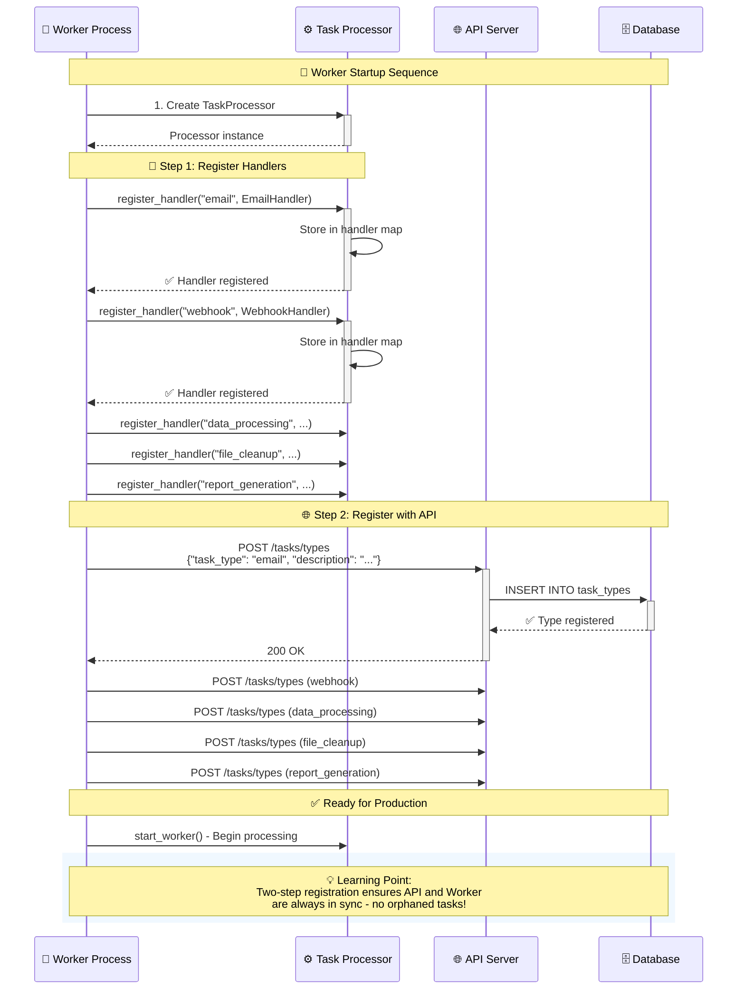

# Task Registry and Handler Management

*This guide shows you how to organize, register, and manage task handlers as your application grows.*

## Why a Task Registry?

As you add more task types, you need a systematic way to:
- **Organize handlers** by domain or functionality
- **Register handlers** with the processor at startup
- **Register task types** with the API server for validation
- **Discover available** task types
- **Configure handlers** with different settings
- **Test handlers** independently
- **Version handlers** for backward compatibility

## 🚨 **Breaking Change: Task Type Registration Required**

As of recent updates, the system now requires **explicit task type registration** before tasks can be created. This prevents API/worker mismatches that were previously only caught at runtime.

## Two-Step Registration Process



The new system requires **two registrations** for each task type:

### Step 1: Register Handler with Worker
```rust
// In your worker startup (main.rs worker command)
async fn setup_task_processor(database: Database) -> Result<TaskProcessor> {
    let mut processor = TaskProcessor::new(database, ProcessorConfig::default());
    
    // Register handlers with the worker processor
    processor.register_handler("email".to_string(), EmailTaskHandler).await;
    processor.register_handler("webhook".to_string(), WebhookTaskHandler).await;
    processor.register_handler("data_processing".to_string(), DataProcessingTaskHandler).await;
    processor.register_handler("file_cleanup".to_string(), FileCleanupTaskHandler).await;
    processor.register_handler("report_generation".to_string(), ReportGenerationTaskHandler).await;
    
    Ok(processor)
}
```

### Step 2: Register Task Types with API Server
```rust
// Also in worker startup - after registering handlers
async fn register_task_types_with_api() -> Result<()> {
    let client = reqwest::Client::new();
    let base_url = std::env::var("API_BASE_URL")
        .unwrap_or_else(|_| "http://localhost:3000".to_string());
    
    let task_types = [
        ("email", "Email notification tasks"),
        ("webhook", "Webhook notification tasks"),
        ("data_processing", "Data processing and analysis tasks"),
        ("file_cleanup", "File system cleanup tasks"),
        ("report_generation", "Report generation tasks"),
    ];
    
    for (task_type, description) in task_types.iter() {
        let response = client
            .post(&format!("{}/tasks/types", base_url))
            .json(&serde_json::json!({
                "task_type": task_type,
                "description": description
            }))
            .send()
            .await?;
            
        if response.status().is_success() {
            println!("✅ Registered task type: {}", task_type);
        } else {
            eprintln!("⚠️ Failed to register task type '{}': {}", 
                     task_type, response.status());
        }
    }
    Ok(())
}
```

⚠️ **The current implementation automatically handles both steps** in the worker startup. You typically don't need to implement this manually.

**Problems with this approach:**
- Hard to maintain as handlers grow
- No organization or grouping
- Difficult to test individual domains
- No way to conditionally enable/disable handlers

## Advanced Registry System

### Domain-Organized Registry

```rust
use std::collections::HashMap;
use async_trait::async_trait;

pub struct TaskRegistry {
    handlers: HashMap<String, Box<dyn TaskHandler>>,
    domains: HashMap<String, Vec<String>>, // domain -> task_types
}

impl TaskRegistry {
    pub fn new() -> Self {
        Self {
            handlers: HashMap::new(),
            domains: HashMap::new(),
        }
    }
    
    pub fn register_domain(&mut self, domain: &str, domain_registry: Box<dyn DomainRegistry>) {
        let task_types = domain_registry.register_handlers(self);
        self.domains.insert(domain.to_string(), task_types);
        info!("Registered domain '{}' with {} task types", domain, task_types.len());
    }
    
    pub fn register_handler(&mut self, task_type: String, handler: Box<dyn TaskHandler>) {
        info!("Registering handler for task type: {}", task_type);
        self.handlers.insert(task_type, handler);
    }
    
    pub fn get_handler(&self, task_type: &str) -> Option<&dyn TaskHandler> {
        self.handlers.get(task_type).map(|h| h.as_ref())
    }
    
    pub fn list_task_types(&self) -> Vec<String> {
        self.handlers.keys().cloned().collect()
    }
    
    pub fn list_domains(&self) -> Vec<String> {
        self.domains.keys().cloned().collect()
    }
    
    pub fn get_domain_task_types(&self, domain: &str) -> Option<&Vec<String>> {
        self.domains.get(domain)
    }
}

#[async_trait]
pub trait DomainRegistry: Send + Sync {
    fn register_handlers(&self, registry: &mut TaskRegistry) -> Vec<String>;
    fn domain_name(&self) -> &'static str;
}
```

### User Domain Registry

```rust
pub struct UserDomainRegistry;

#[async_trait]
impl DomainRegistry for UserDomainRegistry {
    fn register_handlers(&self, registry: &mut TaskRegistry) -> Vec<String> {
        let task_types = vec![
            "welcome_email".to_string(),
            "password_reset".to_string(),
            "account_cleanup".to_string(),
            "profile_export".to_string(),
        ];
        
        // Register all user-related handlers
        registry.register_handler("welcome_email".to_string(), Box::new(WelcomeEmailHandler));
        registry.register_handler("password_reset".to_string(), Box::new(PasswordResetHandler));
        registry.register_handler("account_cleanup".to_string(), Box::new(AccountCleanupHandler));
        registry.register_handler("profile_export".to_string(), Box::new(ProfileExportHandler));
        
        task_types
    }
    
    fn domain_name(&self) -> &'static str {
        "user_management"
    }
}

// User-related task handlers
pub struct WelcomeEmailHandler;
pub struct PasswordResetHandler;
pub struct AccountCleanupHandler;
pub struct ProfileExportHandler;

// Implementation of each handler...
```

### Billing Domain Registry

```rust
pub struct BillingDomainRegistry;

#[async_trait]
impl DomainRegistry for BillingDomainRegistry {
    fn register_handlers(&self, registry: &mut TaskRegistry) -> Vec<String> {
        let task_types = vec![
            "invoice_generation".to_string(),
            "payment_processing".to_string(),
            "subscription_renewal".to_string(),
            "failed_payment_retry".to_string(),
        ];
        
        registry.register_handler("invoice_generation".to_string(), Box::new(InvoiceGenerationHandler));
        registry.register_handler("payment_processing".to_string(), Box::new(PaymentProcessingHandler));
        registry.register_handler("subscription_renewal".to_string(), Box::new(SubscriptionRenewalHandler));
        registry.register_handler("failed_payment_retry".to_string(), Box::new(FailedPaymentRetryHandler));
        
        task_types
    }
    
    fn domain_name(&self) -> &'static str {
        "billing"
    }
}
```

### System Domain Registry

```rust
pub struct SystemDomainRegistry;

#[async_trait]
impl DomainRegistry for SystemDomainRegistry {
    fn register_handlers(&self, registry: &mut TaskRegistry) -> Vec<String> {
        let task_types = vec![
            "database_backup".to_string(),
            "log_cleanup".to_string(),
            "health_check".to_string(),
            "metric_aggregation".to_string(),
        ];
        
        registry.register_handler("database_backup".to_string(), Box::new(DatabaseBackupHandler));
        registry.register_handler("log_cleanup".to_string(), Box::new(LogCleanupHandler));
        registry.register_handler("health_check".to_string(), Box::new(HealthCheckHandler));
        registry.register_handler("metric_aggregation".to_string(), Box::new(MetricAggregationHandler));
        
        task_types
    }
    
    fn domain_name(&self) -> &'static str {
        "system_maintenance"
    }
}
```

## Registry Configuration and Setup

### Environment-Based Handler Enablement

```rust
pub struct RegistryConfig {
    pub enabled_domains: Vec<String>,
    pub disabled_task_types: Vec<String>,
    pub handler_configs: HashMap<String, serde_json::Value>,
}

impl RegistryConfig {
    pub fn from_env() -> Self {
        Self {
            enabled_domains: env::var("TASK_ENABLED_DOMAINS")
                .unwrap_or_else(|_| "user_management,billing,system_maintenance".to_string())
                .split(',')
                .map(|s| s.trim().to_string())
                .collect(),
            
            disabled_task_types: env::var("TASK_DISABLED_TYPES")
                .unwrap_or_default()
                .split(',')
                .filter(|s| !s.is_empty())
                .map(|s| s.trim().to_string())
                .collect(),
            
            handler_configs: HashMap::new(), // Load from config files if needed
        }
    }
}

pub fn setup_registry_with_config(config: RegistryConfig) -> TaskRegistry {
    let mut registry = TaskRegistry::new();
    
    // Register domains based on configuration
    for domain in &config.enabled_domains {
        match domain.as_str() {
            "user_management" => {
                registry.register_domain("user_management", Box::new(UserDomainRegistry));
            }
            "billing" => {
                registry.register_domain("billing", Box::new(BillingDomainRegistry));
            }
            "system_maintenance" => {
                registry.register_domain("system_maintenance", Box::new(SystemDomainRegistry));
            }
            _ => {
                warn!("Unknown domain in configuration: {}", domain);
            }
        }
    }
    
    // Remove disabled task types
    for disabled_type in &config.disabled_task_types {
        registry.handlers.remove(disabled_type);
        info!("Disabled task type: {}", disabled_type);
    }
    
    registry
}
```

### Startup Integration

```rust
// In main.rs or worker startup
async fn start_worker_with_registry(database: Database) -> Result<()> {
    // Load configuration
    let registry_config = RegistryConfig::from_env();
    
    // Setup registry with configuration
    let registry = setup_registry_with_config(registry_config);
    
    // Create processor
    let mut processor = TaskProcessor::new(database, ProcessorConfig::default());
    
    // Register all handlers from registry
    for (task_type, handler) in registry.handlers.into_iter() {
        processor.register_handler(task_type, handler).await;
    }
    
    info!("Worker started with {} registered task types", processor.handler_count());
    
    // Start processing
    processor.start_worker().await
}
```

## Handler Factories and Dependency Injection

### Factory Pattern for Complex Handlers

```rust
pub trait HandlerFactory: Send + Sync {
    fn create_handler(&self) -> Box<dyn TaskHandler>;
    fn task_type(&self) -> &'static str;
}

pub struct EmailHandlerFactory {
    smtp_config: SmtpConfig,
    template_service: Arc<TemplateService>,
}

impl HandlerFactory for EmailHandlerFactory {
    fn create_handler(&self) -> Box<dyn TaskHandler> {
        Box::new(EmailTaskHandler::new(
            self.smtp_config.clone(),
            self.template_service.clone(),
        ))
    }
    
    fn task_type(&self) -> &'static str {
        "email"
    }
}

// Enhanced registry that supports factories
pub struct FactoryRegistry {
    factories: HashMap<String, Box<dyn HandlerFactory>>,
}

impl FactoryRegistry {
    pub fn register_factory(&mut self, factory: Box<dyn HandlerFactory>) {
        let task_type = factory.task_type().to_string();
        self.factories.insert(task_type, factory);
    }
    
    pub fn create_handler(&self, task_type: &str) -> Option<Box<dyn TaskHandler>> {
        self.factories.get(task_type).map(|f| f.create_handler())
    }
}
```

### Dependency Injection with Registry

```rust
pub struct AppServices {
    pub database: Database,
    pub email_service: Arc<EmailService>,
    pub payment_service: Arc<PaymentService>,
    pub template_service: Arc<TemplateService>,
    pub file_service: Arc<FileService>,
}

pub struct ServiceAwareRegistry {
    services: Arc<AppServices>,
    handlers: HashMap<String, Box<dyn TaskHandler>>,
}

impl ServiceAwareRegistry {
    pub fn new(services: Arc<AppServices>) -> Self {
        let mut registry = Self {
            services: services.clone(),
            handlers: HashMap::new(),
        };
        
        registry.register_all_handlers();
        registry
    }
    
    fn register_all_handlers(&mut self) {
        // Create handlers with injected dependencies
        self.register_handler(
            "email", 
            Box::new(EmailTaskHandler::new(self.services.email_service.clone()))
        );
        
        self.register_handler(
            "payment_processing",
            Box::new(PaymentProcessingHandler::new(self.services.payment_service.clone()))
        );
        
        self.register_handler(
            "template_rendering",
            Box::new(TemplateRenderingHandler::new(self.services.template_service.clone()))
        );
        
        // ... more handlers
    }
    
    fn register_handler(&mut self, task_type: &str, handler: Box<dyn TaskHandler>) {
        self.handlers.insert(task_type.to_string(), handler);
    }
}
```

## Handler Versioning and Migration

### Versioned Handlers

```rust
pub enum HandlerVersion {
    V1,
    V2,
    V3,
}

pub struct VersionedHandler {
    v1_handler: Option<Box<dyn TaskHandler>>,
    v2_handler: Option<Box<dyn TaskHandler>>,
    v3_handler: Option<Box<dyn TaskHandler>>,
    default_version: HandlerVersion,
}

#[async_trait]
impl TaskHandler for VersionedHandler {
    async fn handle(&self, context: TaskContext) -> Result<TaskResult, TaskError> {
        // Determine version from task metadata or payload
        let version = self.determine_version(&context);
        
        match version {
            HandlerVersion::V1 => {
                if let Some(ref handler) = self.v1_handler {
                    handler.handle(context).await
                } else {
                    Err(TaskError::UnsupportedVersion("V1 handler not available".to_string()))
                }
            }
            HandlerVersion::V2 => {
                if let Some(ref handler) = self.v2_handler {
                    handler.handle(context).await
                } else {
                    // Fallback to V1 if V2 not available
                    self.v1_handler.as_ref()
                        .ok_or_else(|| TaskError::UnsupportedVersion("No handler available".to_string()))?
                        .handle(context).await
                }
            }
            HandlerVersion::V3 => {
                if let Some(ref handler) = self.v3_handler {
                    handler.handle(context).await
                } else {
                    // Try V2, then V1
                    if let Some(ref handler) = self.v2_handler {
                        handler.handle(context).await
                    } else if let Some(ref handler) = self.v1_handler {
                        handler.handle(context).await
                    } else {
                        Err(TaskError::UnsupportedVersion("No handler available".to_string()))
                    }
                }
            }
        }
    }
}

impl VersionedHandler {
    fn determine_version(&self, context: &TaskContext) -> HandlerVersion {
        // Check task metadata for version
        if let Some(version_value) = context.metadata.get("handler_version") {
            if let Some(version_str) = version_value.as_str() {
                match version_str {
                    "v1" => return HandlerVersion::V1,
                    "v2" => return HandlerVersion::V2,
                    "v3" => return HandlerVersion::V3,
                    _ => {}
                }
            }
        }
        
        // Check payload for version indicator
        if let Some(version_value) = context.payload.get("version") {
            if let Some(version_str) = version_value.as_str() {
                match version_str {
                    "v1" => return HandlerVersion::V1,
                    "v2" => return HandlerVersion::V2,
                    "v3" => return HandlerVersion::V3,
                    _ => {}
                }
            }
        }
        
        // Use default version
        self.default_version.clone()
    }
}
```

## Registry Introspection and Management

### Handler Discovery API

```rust
impl TaskRegistry {
    pub fn get_handler_info(&self, task_type: &str) -> Option<HandlerInfo> {
        self.handlers.get(task_type).map(|_| HandlerInfo {
            task_type: task_type.to_string(),
            domain: self.find_domain_for_task_type(task_type),
            registered_at: self.registration_times.get(task_type).cloned(),
            capabilities: self.get_handler_capabilities(task_type),
        })
    }
    
    pub fn list_all_handlers(&self) -> Vec<HandlerInfo> {
        self.handlers.keys()
            .filter_map(|task_type| self.get_handler_info(task_type))
            .collect()
    }
    
    pub fn validate_task_type(&self, task_type: &str) -> bool {
        self.handlers.contains_key(task_type)
    }
    
    fn find_domain_for_task_type(&self, task_type: &str) -> Option<String> {
        for (domain, types) in &self.domains {
            if types.contains(&task_type.to_string()) {
                return Some(domain.clone());
            }
        }
        None
    }
}

#[derive(Serialize)]
pub struct HandlerInfo {
    pub task_type: String,
    pub domain: Option<String>,
    pub registered_at: Option<DateTime<Utc>>,
    pub capabilities: Vec<String>,
}
```

### Registry Management Endpoints

```rust
// Add to your HTTP API
pub async fn list_task_types(
    State(app_state): State<AppState>,
) -> Result<Json<ApiResponse<Vec<HandlerInfo>>>, Error> {
    let registry = &app_state.task_registry;
    let handlers = registry.list_all_handlers();
    Ok(Json(ApiResponse::success(handlers)))
}

pub async fn validate_task_type(
    State(app_state): State<AppState>,
    Path(task_type): Path<String>,
) -> Result<Json<ApiResponse<bool>>, Error> {
    let registry = &app_state.task_registry;
    let is_valid = registry.validate_task_type(&task_type);
    Ok(Json(ApiResponse::success(is_valid)))
}

pub async fn get_task_type_info(
    State(app_state): State<AppState>,
    Path(task_type): Path<String>,
) -> Result<Json<ApiResponse<HandlerInfo>>, Error> {
    let registry = &app_state.task_registry;
    
    if let Some(info) = registry.get_handler_info(&task_type) {
        Ok(Json(ApiResponse::success(info)))
    } else {
        Err(Error::NotFound(format!("Task type '{}' not found", task_type)))
    }
}
```

## Testing Registry Components

### Testing Individual Domains

```rust
#[cfg(test)]
mod tests {
    use super::*;
    
    #[test]
    fn test_user_domain_registration() {
        let mut registry = TaskRegistry::new();
        let user_domain = UserDomainRegistry;
        
        let task_types = user_domain.register_handlers(&mut registry);
        
        assert_eq!(task_types.len(), 4);
        assert!(task_types.contains(&"welcome_email".to_string()));
        assert!(task_types.contains(&"password_reset".to_string()));
        assert!(task_types.contains(&"account_cleanup".to_string()));
        assert!(task_types.contains(&"profile_export".to_string()));
        
        // Verify handlers are actually registered
        assert!(registry.get_handler("welcome_email").is_some());
        assert!(registry.get_handler("password_reset").is_some());
    }
    
    #[test]
    fn test_registry_configuration() {
        let config = RegistryConfig {
            enabled_domains: vec!["user_management".to_string()],
            disabled_task_types: vec!["password_reset".to_string()],
            handler_configs: HashMap::new(),
        };
        
        let registry = setup_registry_with_config(config);
        
        // Should have user management handlers
        assert!(registry.get_handler("welcome_email").is_some());
        assert!(registry.get_handler("account_cleanup").is_some());
        
        // Should not have password reset (disabled)
        assert!(registry.get_handler("password_reset").is_none());
        
        // Should not have billing handlers (domain not enabled)
        assert!(registry.get_handler("invoice_generation").is_none());
    }
}
```

### Integration Testing with Registry

```rust
#[tokio::test]
async fn test_registry_with_processor() {
    let database = setup_test_database().await;
    let config = RegistryConfig::from_env();
    let registry = setup_registry_with_config(config);
    
    let mut processor = TaskProcessor::new(database.clone(), ProcessorConfig::default());
    
    // Register all handlers from registry
    for (task_type, handler) in registry.handlers.into_iter() {
        processor.register_handler(task_type, handler).await;
    }
    
    // Create and process a task
    let task_id = create_task(
        &database,
        "welcome_email",
        json!({"user_id": 123}),
        None,
    ).await.unwrap();
    
    processor.process_single_task_by_id(task_id).await.unwrap();
    
    // Verify task completion
    let task = get_task(&database, task_id).await.unwrap();
    assert_eq!(task.status, TaskStatus::Completed);
}
```

## Best Practices

### 1. Organize by Business Domain
```rust
// Good: Organized by business function
user_management/
├── welcome_email.rs
├── password_reset.rs
└── account_cleanup.rs

billing/
├── invoice_generation.rs
├── payment_processing.rs
└── subscription_renewal.rs

// Avoid: Organized by technical details
handlers/
├── email_handlers.rs    // Mixes user emails with billing emails
├── database_handlers.rs
└── api_handlers.rs
```

### 2. Use Configuration for Flexibility
```rust
// Environment variables for easy deployment changes
TASK_ENABLED_DOMAINS=user_management,billing
TASK_DISABLED_TYPES=password_reset,failed_payment_retry

// Feature flags for gradual rollouts
TASK_FEATURE_FLAGS=new_payment_flow:false,enhanced_emails:true
```

### 3. Document Handler Requirements
```rust
/// User account cleanup task
/// 
/// **Requirements:**
/// - User must be marked for deletion
/// - All billing cleared
/// - Backup completed
/// 
/// **Payload:**
/// - `user_id`: UUID of user to cleanup
/// - `reason`: Deletion reason for audit
/// 
/// **Dependencies:**
/// - Database access
/// - File system access
/// - Backup service
pub struct AccountCleanupHandler;
```

### 4. Implement Health Checks
```rust
impl TaskRegistry {
    pub async fn health_check(&self) -> RegistryHealthStatus {
        let mut status = RegistryHealthStatus::new();
        
        for (task_type, handler) in &self.handlers {
            if let Some(health_check) = handler.as_any().downcast_ref::<HealthCheckable>() {
                let handler_status = health_check.check_health().await;
                status.add_handler_status(task_type.clone(), handler_status);
            }
        }
        
        status
    }
}
```

## Next Steps

Now that you understand handler organization and management:

- **[Built-in Handlers Reference →](../reference/task-handlers.md)** - Detailed documentation of included handlers
- **[Troubleshooting →](../reference/troubleshooting.md)** - Debug common registry and handler issues

---
*A well-organized task registry makes your background task system maintainable and scalable as your application grows.*