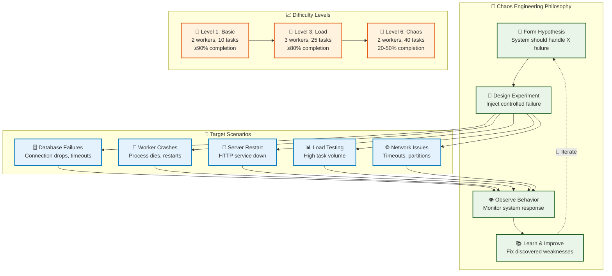

# Chaos Testing Guide

*This guide introduces chaos engineering principles and explains how to use the comprehensive chaos testing framework to validate system resilience.*

## Overview

Chaos engineering is the discipline of experimenting on a system to build confidence in its capability to withstand turbulent conditions in production. This starter includes a complete chaos testing framework that demonstrates how to systematically test failure scenarios while maintaining system reliability.

**Important**: This framework is designed for learning and development environments. For production chaos engineering, adapt these patterns with appropriate safeguards and monitoring.

## Why Chaos Testing?

### The Problem with Traditional Testing

Traditional testing validates that your system works correctly under normal conditions, but real-world systems face:
- **Service failures**: Processes crash, containers die, nodes go offline
- **Network issues**: Timeouts, packet loss, partitions  
- **Resource exhaustion**: Memory leaks, CPU spikes, disk full
- **Dependency failures**: Database outages, external API downtime

### The Chaos Engineering Solution

Chaos engineering proactively introduces controlled failures to:
- **Discover weaknesses** before they cause outages
- **Validate recovery mechanisms** work as designed
- **Build confidence** in system resilience
- **Improve monitoring** and alerting systems



## Chaos Engineering Principles

### 1. Build a Hypothesis Around Steady State

Before introducing chaos, define what "normal" looks like:

```
Hypothesis: The system should maintain 99% API success rate 
even when the database is temporarily unavailable for 30 seconds.
```

### 2. Vary Real-World Events

Simulate failures that actually happen in production:
- Process crashes (kill -9)
- Resource exhaustion (high CPU/memory)
- Network issues (timeouts, partitions)
- Dependency failures (database down)

### 3. Run Experiments in Production

*Note: This starter focuses on development/staging environments, but the patterns scale to production with proper safeguards.*

### 4. Automate Experiments Continuously

Chaos testing should be part of your regular development workflow, not a one-time activity.

### 5. Minimize Blast Radius

Start small and gradually increase scope:
- Single service → Multiple services
- Short duration → Longer duration  
- Low traffic → High traffic

## Framework Architecture

### Docker-Based Architecture

The chaos testing framework uses Docker containers for realistic testing environments:

- **Container Isolation**: Each service runs in isolated Docker containers
- **Resource Constraints**: CPU and memory limits simulate real constraints
- **Horizontal Scaling**: Easy scaling of worker containers for load testing
- **Realistic Failures**: Container crashes and restarts mirror real deployment issues

### Core Components

The chaos testing framework consists of three main parts:

```
┌─────────────────┐    ┌─────────────────┐    ┌─────────────────┐
│   test-chaos.sh │    │   Helper Scripts│    │   API Testing   │
│                 │    │                 │    │                 │
│ • Orchestrates  │───▶│ • auth-helper   │───▶│ • test-with-    │
│   scenarios     │    │ • task-flood    │    │   curl.sh       │
│ • Manages       │    │ • service-chaos │    │ • Validates     │
│   difficulty    │    │                 │    │   responses     │
│ • Tracks results│    │ Executes chaos  │    │                 │
└─────────────────┘    └─────────────────┘    └─────────────────┘
```

### 1. Orchestration Layer (`test-chaos.sh`)

The main orchestrator that:
- **Manages scenarios**: Coordinates different failure types
- **Controls difficulty**: Scales load and duration
- **Tracks results**: Measures success rates and recovery times
- **Generates reports**: Creates detailed analysis of test runs

### 2. Chaos Helpers (`scripts/helpers/`)

Modular utilities for specific chaos operations:

**`auth-helper.sh`**: Creates test users and tokens
```bash
# Creates authenticated user for load testing
./scripts/helpers/auth-helper.sh --prefix "chaos_test"
# Returns: {"token": "abc123...", "user_id": "uuid-here"}
```

**`task-flood.sh`**: Generates high task loads
```bash
# Create 100 tasks with 0.1s delay
./scripts/helpers/task-flood.sh --count 100 --delay 0.1 --auth "$TOKEN"
```

**`service-chaos.sh`**: Simulates service failures
```bash
# Kill and restart server after 30s
./scripts/helpers/service-chaos.sh restart --service server --delay 30
```

### 3. Validation Layer (`test-with-curl.sh`)

Comprehensive API testing that:
- **Tests all endpoints**: Health, auth, tasks, DLQ
- **Validates responses**: Status codes, JSON structure
- **Measures success rates**: Calculates percentage of passing tests
- **Reports consistently**: Standard output format

## Difficulty Levels (Redesigned Framework)

The framework provides 6 scientifically-designed difficulty levels with logical progression from basic functionality to catastrophic load testing:

### Level 1: Basic Resilience
**Purpose**: Baseline functionality validation
- **Configuration**: 2 workers, 10 tasks, 2s delays each, 30s deadline
- **Chaos Pattern**: Minimal disruption (20-30s intervals)
- **Expected**: ≥90% completion rate + deadline met
- **Total Time**: ~30-60 seconds

```bash
./scripts/test-chaos.sh --difficulty 1
```

**Use cases**:
- Daily development testing
- Pre-commit validation
- CI/CD pipeline gates
- Basic functionality verification

### Level 2: Light Disruption
**Purpose**: Introduction of controlled failures
- **Configuration**: 2 workers, 15 tasks, 3s delays each, 45s deadline
- **Chaos Pattern**: Moderate disruption (15-25s intervals)
- **Expected**: ≥85% completion rate + deadline met
- **Total Time**: ~45-75 seconds

```bash
./scripts/test-chaos.sh --difficulty 2
```

**Use cases**:
- Integration testing
- Feature branch validation
- Staging environment testing

### Level 3: Load Testing
**Purpose**: Increased task volume validation
- **Configuration**: 3 workers, 25 tasks, 3s delays each, 60s deadline
- **Chaos Pattern**: Regular failures (10-15s intervals)
- **Expected**: ≥80% completion rate + deadline met
- **Total Time**: ~60-90 seconds

```bash
./scripts/test-chaos.sh --difficulty 3
```

**Use cases**:
- Performance validation
- Load testing scenarios
- Resource limit testing

### Level 4: Resource Pressure
**Purpose**: Challenging workload validation
- **Configuration**: 3 workers, 35 tasks, 4s delays each, 90s deadline
- **Chaos Pattern**: Aggressive cycling (5-10s intervals)
- **Expected**: ≥75% completion rate + deadline met
- **Total Time**: ~90-120 seconds

```bash
./scripts/test-chaos.sh --difficulty 4
```

**Use cases**:
- Pre-production validation
- High-load scenarios
- Resource pressure testing

### Level 5: Extreme Chaos
**Purpose**: High-pressure resilience testing
- **Configuration**: 4 workers, 30 tasks, 5s delays each, 80s deadline
- **Chaos Pattern**: Continuous failures (3-7s intervals)
- **Expected**: ≥60% completion rate (deadline may be missed)
- **Total Time**: ~80-120 seconds

```bash
./scripts/test-chaos.sh --difficulty 5
```

**Use cases**:
- Extreme resilience testing
- Chaos engineering validation
- Production readiness testing

### Level 6: Catastrophic Load ⚠️ **STRESS TEST LIMITS**
**Purpose**: Test partial completion under impossible workload
- **Configuration**: 2 workers, 40 tasks, 6s delays each, 60s deadline
- **Theoretical Need**: 240s of work in 60s deadline (4x overload)
- **Chaos Pattern**: Constant failures (2-5s intervals)
- **Expected**: **20-50% completion** (designed partial failure)
- **Total Time**: ~90-120 seconds

```bash
./scripts/test-chaos.sh --difficulty 6 --scenarios multi-worker-chaos
```

**Use cases**:
- Stress testing system limits
- Validating graceful degradation
- Testing partial completion scenarios
- Training on failure handling

> ⚠️ **Level 6 is intentionally designed with impossible workload to test partial completion patterns**

## Chaos Scenarios

### Baseline Testing
**Purpose**: Establish normal system behavior

```bash
./scripts/test-chaos.sh --scenarios baseline
```

**What it validates**:
- All API endpoints respond correctly
- Authentication flow works
- Task creation and processing
- Database operations succeed

**Success criteria**: 100% API success rate

### Database Failure Testing
**Purpose**: Test database resilience patterns

```bash
./scripts/test-chaos.sh --scenarios db-failure
```

**What happens**:
1. System baseline established
2. Database container stopped
3. API calls made during outage (should fail gracefully)
4. Database restarted
5. Recovery verified

**What it validates**:
- Connection pool handles database loss
- Health checks report database status accurately
- System recovers when database returns
- No data corruption during failure

### Server Restart Testing
**Purpose**: Test HTTP server resilience

```bash
./scripts/test-chaos.sh --scenarios server-restart
```

**What happens**:
1. Server process killed
2. Process restarted automatically
3. Recovery time measured
4. API functionality verified

**What it validates**:
- Process management works correctly
- Service startup is reliable
- Recovery time meets SLAs
- State reconstruction works

### Worker Restart Testing
**Purpose**: Test background task processing resilience

```bash
./scripts/test-chaos.sh --scenarios worker-restart
```

**What happens**:
1. Tasks created and queued
2. Worker process killed
3. Worker restarted
4. Task processing resumption verified

**What it validates**:
- Tasks survive worker restarts
- Processing resumes correctly
- No duplicate task execution
- Queue persistence works

### Task Flood Testing
**Purpose**: Test high load performance

```bash
./scripts/test-chaos.sh --scenarios task-flood
```

**What happens**:
1. Authentication established
2. Rapid task creation (rate varies by difficulty)
3. System performance monitored
4. Task processing throughput measured

**What it validates**:
- System handles high task volumes
- Database performance under load
- Memory usage remains stable
- Queue management efficiency

### Circuit Breaker Testing
**Purpose**: Test fault isolation patterns

```bash
./scripts/test-chaos.sh --scenarios circuit-breaker
```

**What happens**:
1. Failing tasks created to trigger circuit breaker
2. Circuit breaker activation verified
3. Fast failure during outage
4. Recovery detection tested

**What it validates**:
- Circuit breaker triggers on failures
- Fast failure prevents cascade failures
- Circuit breaker reopens when service recovers
- Fault isolation between task types

### Mixed Chaos Testing
**Purpose**: Test multiple concurrent failures

```bash
./scripts/test-chaos.sh --scenarios mixed-chaos
```

**What happens**:
1. High task load started
2. Worker process killed during load
3. Service recovery under stress
4. System stability verified

**What it validates**:
- Multiple failure handling
- Resource contention management
- Recovery coordination
- System stability under compound stress

### Recovery Time Testing
**Purpose**: Measure and validate recovery times

```bash
./scripts/test-chaos.sh --scenarios recovery
```

**What happens**:
1. Multiple restart cycles executed
2. Recovery time measured for each cycle
3. Average recovery time calculated
4. SLA compliance verified

**What it validates**:
- Consistent recovery times
- Recovery time SLAs met
- No degradation over multiple restarts
- Time to first successful request

### Multi-Worker Chaos Testing ⭐ **NEW**
**Purpose**: Test multi-worker resilience with delay tasks and deadlines

```bash
./scripts/test-chaos.sh --scenarios multi-worker-chaos
```

**What happens**:
1. Multiple workers (2-5) started simultaneously
2. Delay tasks created with configurable processing times (3-8 seconds)
3. Random worker failures introduced every 10-25 seconds
4. Workers killed and restarted during active task processing
5. Task completion monitored against strict deadlines (45-90 seconds)
6. Retry behavior validated when workers drop tasks

**What it validates**:
- **Worker coordination**: Multiple workers processing tasks concurrently
- **Failure resilience**: System continues operating when workers fail
- **Task retry logic**: Failed tasks are retried by surviving workers
- **Queue persistence**: Tasks survive worker crashes
- **Deadline enforcement**: System meets timing requirements under stress
- **Load distribution**: Work is distributed across available workers
- **Recovery patterns**: Workers restart reliably after failures

**Difficulty scaling**:
- **Level 1**: 2 workers, 3s delays, 45s deadline, gentle failure intervals
- **Level 5**: 5 workers, 8s delays, 90s deadline, aggressive failure patterns
- **Level 6**: 5 workers, 15s delays, 60s deadline, catastrophic failure patterns ⚠️

**Success criteria**:
- **Levels 1-5**: ≥80% task completion rate + evidence of retries + system responsive
- **Level 6**: <50% completion rate + deadline missed (designed failure validation) ⚠️

### Dynamic Worker Scaling Testing ⭐ **NEW**
**Purpose**: Test dynamic worker scaling with 4-phase resilience validation

```bash
./scripts/test-chaos.sh --scenarios dynamic-scaling
```

**What happens**:
1. **Phase 1 (0-60s)**: Start with 5 workers for optimal capacity
2. **Phase 2 (60-120s)**: Scale down to 2 workers to create capacity pressure
3. **Phase 3 (120-150s)**: Gradually scale up (+1 worker every 10s)
4. **Phase 4 (150-240s)**: Monitor completion with full capacity restored

**What it validates**:
- **Worker scaling operations**: System handles dynamic scaling gracefully
- **Queue management**: Tasks queue properly during capacity reduction
- **Resource optimization**: Efficient work distribution across available workers
- **Scaling responsiveness**: Fast adaptation to capacity changes
- **Task completion guarantees**: 100% completion despite scaling operations
- **System stability**: No crashes or data loss during scaling events

**Difficulty scaling**:
- **Level 1**: 75 total tasks, 2s delays, 5min deadline (conservative)
- **Level 3**: 120 total tasks, 3s delays, 4min deadline (standard)
- **Level 6**: 225 total tasks, 4s delays, 3min deadline (extreme stress)

**Success criteria**:
- **Primary**: 100% task completion within deadline
- **Secondary**: 100% completion but deadline exceeded (partial pass)
- **Failure**: <100% completion or system errors

**Key insights**: This scenario demonstrates real-world scaling patterns where systems must maintain service quality during infrastructure changes.

## Running Chaos Tests

### Quick Start

The chaos testing framework uses Docker containers for realistic testing environments:

```bash
# Basic chaos testing (recommended for daily use)
# Automatically builds and runs containers with latest code
./scripts/test-chaos.sh

# Advanced testing with higher difficulty
./scripts/test-chaos.sh --difficulty 3

# Test specific scenarios only
./scripts/test-chaos.sh --scenarios "db-failure,task-flood"

# Verbose output with detailed logs
./scripts/test-chaos.sh --difficulty 5 --verbose

# Container scaling and multi-worker testing
./scripts/test-chaos.sh --scenarios "multi-worker-chaos"

# Dynamic worker scaling testing
./scripts/test-chaos.sh --scenarios "dynamic-scaling"
```

**Docker Container Benefits:**
- **Container Isolation**: Each service runs in isolated Docker containers for realistic testing
- **Resource Constraints**: CPU and memory limits simulate real deployment constraints
- **Horizontal Scaling**: Easy scaling of worker containers with Docker Compose
- **Realistic Failures**: Container crashes and restarts mirror actual deployment issues
- **Fresh Code**: Automatically rebuilds images ensuring tests use latest changes

### Progressive Testing Strategy

**Phase 1: Development Validation**
```bash
# Daily developer testing (2 minutes)
./scripts/test-chaos.sh --difficulty 1 --scenarios "baseline,db-failure"
```

**Phase 2: Integration Testing**
```bash
# Pre-commit testing (5 minutes)
./scripts/test-chaos.sh --difficulty 2 --scenarios "baseline,server-restart,worker-restart"
```

**Phase 3: Load Testing**
```bash
# Performance validation (8 minutes)
./scripts/test-chaos.sh --difficulty 3 --scenarios "task-flood,circuit-breaker"
```

**Phase 4: Resilience Testing**
```bash
# Pre-production validation (15 minutes)
./scripts/test-chaos.sh --difficulty 4 --scenarios "mixed-chaos,recovery,multi-worker-chaos,dynamic-scaling"
```

**Phase 5: Production Readiness**
```bash
# Full chaos testing (20 minutes)
./scripts/test-chaos.sh --difficulty 5 --verbose
```

### Environment Setup

Before running chaos tests, ensure your environment is ready:

```bash
# 1. Start the full development environment
./scripts/dev-server.sh 3000

# 2. Verify all services are healthy
./scripts/test-with-curl.sh

# 3. Run chaos tests
./scripts/test-chaos.sh --difficulty 1
```

## Interpreting Results

### Success Metrics

The framework tracks several key metrics:

**API Success Rate**: Percentage of API calls that succeed
- Level 1-2: Should be 95-100%
- Level 3-4: Should be 85-95%
- Level 5: Should be 80%+

**Recovery Time**: Time from container failure to first successful API call
- Target: < 20 seconds for Docker-based scenarios
- Warning: > 30 seconds indicates container issues

**Task Processing**: Tasks completed vs. tasks created
- Should maintain processing throughput
- Failed tasks should be moved to DLQ

**Circuit Breaker**: Proper activation and recovery
- Should trigger on repeated failures
- Should recover when service is restored

### Warning Signs

🚨 **Critical Issues**:
- Recovery time > 30 seconds
- Success rate < 70%
- Memory leaks during testing
- Tasks stuck in processing state
- Circuit breaker not recovering

⚠️ **Areas for Improvement**:
- Success rate 70-85%
- Container recovery time 20-30 seconds
- High task failure rates
- Slow container health checks

### Example Results Analysis

**Level 1 (Basic Resilience)**:
```
📊 Chaos Testing Results
=========================
Total scenarios: 1
Passed: 1
Failed: 0
Success rate: 100%
Total duration: 46s

Scenario Results:
✅ multi-worker-chaos: PASS (100.0%, 0 retries)
```

**Analysis**: Perfect baseline performance with 100% task completion within the 30-second deadline, indicating healthy system foundation.

**Level 6 (Catastrophic Load)**:
```
📊 Chaos Testing Results
=========================
Total scenarios: 1
Passed: 1
Failed: 0
Success rate: 100%
Total duration: 92s

Scenario Results:
✅ multi-worker-chaos: PASS (27.5%, 0 retries)
```

**Analysis**: Successful catastrophic load test with 27.5% completion (within expected 20-50% range), demonstrating proper partial completion handling under impossible workload.

## Customization and Extension

### Environment Variables

```bash
# Custom configuration
export PORT=8080
export BASE_URL="https://staging.example.com"
export OUTPUT_DIR="chaos-results"
export VERBOSE=true

./scripts/test-chaos.sh
```

### Adding Custom Scenarios

Add new scenarios by modifying `test-chaos.sh`:

```bash
# Add to the case statement in run_scenario()
my-custom-test)
    log "INFO" "Running my custom test"
    
    # Your custom chaos logic here
    # Use helper scripts for common operations
    ./scripts/helpers/service-chaos.sh restart --service server
    ./scripts/helpers/task-flood.sh --count 50 --auth "$TOKEN"
    
    if run_api_test "Custom Test"; then
        log "SUCCESS" "Custom scenario passed"
        PASSED_SCENARIOS=$((PASSED_SCENARIOS + 1))
        TEST_RESULTS+=("✅ my-custom-test: PASS")
    else
        log "ERROR" "Custom scenario failed"
        TEST_RESULTS+=("❌ my-custom-test: FAIL")
    fi
    ;;
```

### Testing Specific Task Types

Customize task flood testing for specific scenarios:

```bash
# Test webhook resilience
./scripts/helpers/task-flood.sh --type webhook --count 100 --auth "$TOKEN"

# Test circuit breaker with specific task type
./scripts/helpers/task-flood.sh --type nonexistent_type --count 20 --auth "$TOKEN"
```

## CI/CD Integration

### GitHub Actions Example

```yaml
name: Chaos Testing
on:
  push:
    branches: [main]
  pull_request:
    branches: [main]

jobs:
  chaos-test:
    runs-on: ubuntu-latest
    steps:
    - uses: actions/checkout@v4
    - name: Setup environment
      run: ./scripts/dev-server.sh 3000
    - name: Run basic chaos tests
      run: ./scripts/test-chaos.sh --difficulty 2
    - name: Upload results
      uses: actions/upload-artifact@v4
      with:
        name: chaos-test-results
        path: tmp/
```

### Pre-deployment Validation

```bash
#!/bin/bash
# deploy-validation.sh

echo "🧪 Running pre-deployment chaos testing..."

# Start services
./scripts/dev-server.sh 3000

# Run progressive testing
for level in 1 2 3; do
    echo "Testing difficulty level $level..."
    if ! ./scripts/test-chaos.sh --difficulty $level; then
        echo "❌ Chaos testing failed at level $level"
        exit 1
    fi
done

echo "✅ All chaos tests passed - ready for deployment"
```

## Best Practices

### 1. Start Small and Scale Gradually
- Begin with difficulty level 1
- Increase complexity as confidence grows
- Monitor system behavior at each level

### 2. Automate Everything
- Integrate chaos tests into CI/CD
- Run regular chaos tests in staging
- Set up alerts for chaos test failures

### 3. Monitor During Tests
- Watch system metrics (CPU, memory, DB connections)
- Monitor logs for errors and warnings
- Track recovery times and success rates

### 4. Document and Learn
- Record failure modes discovered
- Document recovery procedures
- Share learnings with the team

### 5. Test Realistic Scenarios
- Base chaos experiments on real production failures
- Include dependencies in testing
- Test during different load conditions

### 6. Maintain Safe Boundaries
- Use isolated environments for chaos testing
- Implement circuit breakers and timeouts
- Have rollback procedures ready

## Troubleshooting

### Common Issues

**Test timeouts:**
- Increase timeout values in helper scripts
- Check system resources (CPU, memory)
- Verify network connectivity

**High failure rates:**
- Check service logs: `tail -f /tmp/starter-*.log`
- Verify database connectivity
- Review circuit breaker thresholds

**Worker not processing tasks:**
- Check worker process: `ps aux | grep starter`
- Review worker logs for errors
- Verify database task queue

**Database connection issues:**
- Check PostgreSQL container: `docker-compose ps`
- Verify connection string configuration
- Check connection pool settings

### Debug Mode

```bash
# Enable verbose logging
./scripts/test-chaos.sh --verbose --difficulty 1

# Check individual components
curl -X GET http://localhost:3000/health
curl -X GET http://localhost:3000/tasks/stats

# Manual service testing
./scripts/test-server.sh 3000
./scripts/status.sh
```

## Next Steps

Now that you understand chaos engineering principles and the testing framework:

1. **Start Simple**: Run `./scripts/test-chaos.sh --difficulty 1` to get familiar
2. **Explore Scenarios**: Try different scenarios to understand failure modes
3. **Analyze Results**: Review generated reports to identify improvement areas
4. **Integrate with Development**: Add chaos testing to your development workflow
5. **Scale Up**: Gradually increase difficulty as your system improves
6. **Learn from Failures**: Use failures as learning opportunities to improve resilience

The chaos testing framework provides a foundation for building confidence in your system's resilience. As you add features, add corresponding chaos tests to ensure they fail gracefully.

## Further Reading

- **Circuit Breaker Pattern**: [Reliability Patterns Guide](../reliability.md)
- **Background Tasks**: [Background Tasks Guide](04-background-tasks.md)
- **API Testing**: [Testing Guide](07-testing.md)
- **Health Monitoring**: [API Reference - Health Endpoints](../api-reference.md)
- **System Architecture**: [Architecture Guide](01-architecture.md)

---

*Chaos engineering helps build antifragile systems that get stronger under stress. Use this framework to discover weaknesses early and build confidence in your system's ability to handle the unexpected.*