# Web Frontend Integration Guide

*This guide explains how the React TypeScript frontend connects with the Rust API backend, demonstrating real-world full-stack integration patterns based on the actual implementation.*

## 🤔 Why This Specific Integration Approach?

### The Problem: Full-Stack Type Safety and Developer Experience

Building full-stack applications often suffers from:
- **Type Disconnect**: Frontend and backend types drift apart
- **Manual API Integration**: Hand-written API clients prone to errors
- **Authentication Complexity**: Managing user sessions across layers
- **Error Handling**: Inconsistent error patterns between layers
- **Developer Experience**: Slow feedback cycles and debugging difficulties

### Our Solution: OpenAPI-Driven Development

This starter demonstrates a **contract-first approach** where:
- Backend defines API contract via OpenAPI/Swagger
- Frontend auto-generates TypeScript types from that contract
- Both sides stay in sync automatically
- End-to-end type safety from database to UI


### Alternative Approaches and Tradeoffs

| Approach | Pros | Cons | When to Use |
|----------|------|------|-------------|
| **Manual API Client** | Simple, direct control | Type drift, maintenance burden | Small projects, prototype |
| **GraphQL + Codegen** | Flexible queries, great tooling | Learning curve, complexity | Complex data relationships |
| **tRPC** | End-to-end type safety | TypeScript-only, tight coupling | Full TypeScript stack |
| **OpenAPI + Codegen** ⭐ | Language agnostic, industry standard | Extra build step | Production applications |

**Our Choice**: OpenAPI provides the best balance of type safety, tooling ecosystem, and language flexibility.

## 🧠 Mental Model: Full-Stack Data Flow

Understanding how data flows through the entire stack helps debug issues and design features:

```mermaid
sequenceDiagram
    participant U as 👤 User
    participant R as ⚛️ React App
    participant A as 🌐 API Client
    participant B as 🦀 Rust Backend
    participant D as 🗄️ Database
    
    Note over U,D: Complete Request/Response Cycle
    
    U->>R: 1. User Action (form submit)
    R->>R: 2. Form Validation (Zod schema)
    R->>A: 3. API Call (type-safe)
    A->>B: 4. HTTP Request (JSON + Bearer token)
    B->>B: 5. Auth Middleware (validate session)
    B->>B: 6. Route Handler (business logic)
    B->>D: 7. Database Query (SQLx)
    D-->>B: 8. Query Result
    B->>B: 9. Response Serialization (serde)
    B-->>A: 10. HTTP Response (ApiResponse<T>)
    A->>A: 11. Response Parsing (type checking)
    A-->>R: 12. Typed Data
    R->>R: 13. State Update (TanStack Query)
    R-->>U: 14. UI Update (React render)
```



**Key Insight**: Every step is type-safe and validated. Problems can be isolated to specific layers.

## Type Safety Implementation

### Backend: OpenAPI Schema Generation

The Rust backend uses `utoipa` to generate OpenAPI schemas directly from code:

```rust
// starter/src/openapi.rs
#[derive(OpenApi)]
#[openapi(
    info(title = "Rust Full-Stack Starter API", version = "0.1.0"),
    paths(
        // Authentication endpoints
        crate::auth::api::register,
        crate::auth::api::login,
        crate::auth::api::logout,
        crate::auth::api::get_me,
        // Task endpoints  
        crate::tasks::api::create_task,
        crate::tasks::api::get_tasks,
        crate::tasks::api::get_task_stats,
        // Health endpoints
        crate::health::api::health_check,
        crate::health::api::detailed_health_check,
    ),
    components(schemas(
        // Request/Response models
        crate::auth::models::RegisterRequest,
        crate::auth::models::LoginRequest,
        crate::tasks::models::CreateTaskRequest,
        crate::tasks::models::TaskResponse,
        // ... all API models
    ))
)]
pub struct ApiDoc;
```

**Endpoint Annotation Example**:
```rust
// starter/src/auth/api.rs
#[utoipa::path(
    post,
    path = "/auth/login",
    request_body = LoginRequest,
    responses(
        (status = 200, description = "Login successful", body = ApiResponse<LoginResponse>),
        (status = 401, description = "Invalid credentials", body = ErrorResponse)
    )
)]
pub async fn login(/* ... */) -> impl IntoResponse {
    // Implementation validates against the documented contract
}
```

### Frontend: Automatic Type Generation

The frontend generates TypeScript types from the OpenAPI schema:

```bash
# web/package.json script
"generate-api": "openapi-typescript ../docs/openapi.json -o src/types/api.ts"
```

**Generated Types** (`web/src/types/api.ts`):
```typescript
// Auto-generated from OpenAPI schema
export interface paths {
  "/api/v1/auth/login": {
    post: {
      requestBody: {
        content: {
          "application/json": components["schemas"]["LoginRequest"];
        };
      };
      responses: {
        200: {
          content: {
            "application/json": components["schemas"]["ApiResponse_LoginResponse"];
          };
        };
        401: {
          content: {
            "application/json": components["schemas"]["ErrorResponse"];
          };
        };
      };
    };
  };
  // ... all other endpoints
};

export interface components {
  schemas: {
    LoginRequest: {
      username?: string;
      email?: string;
      password: string;
    };
    LoginResponse: {
      user: components["schemas"]["User"];
      session_token: string;
    };
    // ... all other schemas
  };
}
```

### Type-Safe API Client

The frontend API client uses generated types for complete type safety:

```typescript
// web/src/lib/api/client.ts
import type { paths, components } from '@/types/api';

type LoginRequest = components['schemas']['LoginRequest'];
type LoginResponse = components['schemas']['LoginResponse'];

export const authApi = {
  async login(data: LoginRequest): Promise<LoginResponse> {
    const response = await apiClient.post('/api/v1/auth/login', data);
    
    if (!response.ok) {
      throw new ApiError(await response.json());
    }
    
    const result = await response.json();
    return result.data; // TypeScript knows this is LoginResponse
  },
  
  async register(data: components['schemas']['RegisterRequest']) {
    // Type-safe implementation
  },
  
  async getCurrentUser(): Promise<components['schemas']['User']> {
    const response = await apiClient.get('/api/v1/auth/me');
    const result = await response.json();
    return result.data; // Type-safe user data
  }
};
```

## Authentication Flow Implementation

### Backend: Session-Based Authentication

**Session Storage** (`starter/src/auth/models.rs`):
```rust
#[derive(Debug, Clone, Serialize, Deserialize, sqlx::FromRow, utoipa::ToSchema)]
pub struct UserSession {
    pub id: Uuid,
    pub user_id: Uuid,
    pub session_token: String,
    pub expires_at: DateTime<Utc>,
    pub created_at: DateTime<Utc>,
    pub last_accessed: Option<DateTime<Utc>>,
    pub user_agent: Option<String>,
    pub is_active: bool,
}
```

**Authentication Middleware** (`starter/src/auth/middleware.rs`):
```rust
pub async fn auth_middleware(
    State(state): State<AppState>,
    mut request: Request,
    next: Next,
) -> Result<impl IntoResponse, AuthError> {
    // Extract Authorization header
    let auth_header = request.headers()
        .get(AUTHORIZATION)
        .and_then(|h| h.to_str().ok());
        
    let token = auth_header
        .and_then(|auth| auth.strip_prefix("Bearer "))
        .ok_or(AuthError::MissingToken)?;
    
    // Validate session in database
    let session = validate_session(&state.database, token).await?;
    
    // Add user to request context
    request.extensions_mut().insert(session.user);
    
    Ok(next.run(request).await)
}
```

### Frontend: Authentication Context

**Auth Provider** (`web/src/lib/auth/context.tsx`):
```typescript
interface AuthContextType {
  user: User | null;
  loading: boolean;
  authenticated: boolean;
  login: (credentials: LoginRequest) => Promise<void>;
  logout: () => Promise<void>;
  logoutAll: () => Promise<void>;
  refresh: () => Promise<void>;
}

export function AuthProvider({ children }: { children: ReactNode }) {
  const [user, setUser] = useState<User | null>(null);
  const [loading, setLoading] = useState(true);
  
  // Auto-initialize from localStorage
  useEffect(() => {
    const initializeAuth = async () => {
      const token = localStorage.getItem('session_token');
      if (token) {
        try {
          const user = await authApi.getCurrentUser();
          setUser(user);
        } catch (error) {
          // Token invalid, clear it
          localStorage.removeItem('session_token');
        }
      }
      setLoading(false);
    };
    
    initializeAuth();
  }, []);
  
  // Auto-refresh every 15 minutes
  useEffect(() => {
    if (!user) return;
    
    const interval = setInterval(async () => {
      try {
        await refresh();
      } catch (error) {
        console.error('Token refresh failed:', error);
        await logout();
      }
    }, 15 * 60 * 1000); // 15 minutes
    
    return () => clearInterval(interval);
  }, [user]);
  
  const login = async (credentials: LoginRequest) => {
    const response = await authApi.login(credentials);
    
    // Store token and user
    localStorage.setItem('session_token', response.session_token);
    setUser(response.user);
  };
  
  const logout = async () => {
    try {
      await authApi.logout();
    } finally {
      // Always cleanup local state
      localStorage.removeItem('session_token');
      setUser(null);
    }
  };
  
  return (
    <AuthContext.Provider value={{
      user, loading, authenticated: !!user,
      login, logout, logoutAll, refresh
    }}>
      {children}
    </AuthContext.Provider>
  );
}
```

**Protected Routes** (`web/src/lib/auth/ProtectedRoute.tsx`):
```typescript
export function ProtectedRoute({ children }: { children: ReactNode }) {
  const { authenticated, loading } = useAuth();
  const navigate = useNavigate();
  const location = useLocation();
  
  if (loading) {
    return <div>Loading...</div>;
  }
  
  if (!authenticated) {
    // Redirect to login with return URL
    navigate({
      to: '/auth/login',
      search: { redirect: location.pathname }
    });
    return null;
  }
  
  return <>{children}</>;
}
```

## Error Handling Patterns

### Backend: Standardized Error Responses

**Error Types** (`starter/src/errors.rs`):
```rust
#[derive(Debug, Serialize, utoipa::ToSchema)]
pub struct ErrorResponse {
    pub error: ErrorDetail,
}

#[derive(Debug, Serialize, utoipa::ToSchema)]
pub struct ErrorDetail {
    pub code: String,
    pub message: String,
}

impl IntoResponse for AppError {
    fn into_response(self) -> Response {
        let (status_code, error_code, message) = match &self {
            AppError::ValidationError(msg) => (
                StatusCode::BAD_REQUEST,
                "VALIDATION_FAILED",
                msg.clone()
            ),
            AppError::Unauthorized => (
                StatusCode::UNAUTHORIZED,
                "UNAUTHORIZED",
                "Authentication required".to_string()
            ),
            AppError::UserNotFound => (
                StatusCode::NOT_FOUND,
                "USER_NOT_FOUND", 
                "User not found".to_string()
            ),
            // ... other error types
        };
        
        let error_response = ErrorResponse {
            error: ErrorDetail {
                code: error_code.to_string(),
                message,
            },
        };
        
        (status_code, Json(error_response)).into_response()
    }
}
```

### Frontend: Error Boundaries and Handling

**React Error Boundary** (`web/src/components/ErrorBoundary.tsx`):
```typescript
interface State {
  hasError: boolean;
  error?: Error;
}

export class ErrorBoundary extends Component<Props, State> {
  constructor(props: Props) {
    super(props);
    this.state = { hasError: false };
  }
  
  static getDerivedStateFromError(error: Error): State {
    return { hasError: true, error };
  }
  
  componentDidCatch(error: Error, errorInfo: ErrorInfo) {
    console.error('Error caught by boundary:', error, errorInfo);
  }
  
  render() {
    if (this.state.hasError) {
      return this.props.fallback ? (
        <this.props.fallback error={this.state.error} onRetry={this.handleRetry} />
      ) : (
        <DefaultErrorFallback error={this.state.error} onRetry={this.handleRetry} />
      );
    }
    
    return this.props.children;
  }
  
  private handleRetry = () => {
    this.setState({ hasError: false, error: undefined });
  };
}
```

**API Error Handling** (`web/src/lib/api/client.ts`):
```typescript
export class ApiError extends Error {
  constructor(
    public response: components['schemas']['ErrorResponse'],
    public status: number
  ) {
    super(response.error.message);
    this.name = 'ApiError';
  }
  
  get code() {
    return this.response.error.code;
  }
}

// Usage in API calls
export async function handleApiResponse<T>(response: Response): Promise<T> {
  if (!response.ok) {
    const errorData = await response.json();
    throw new ApiError(errorData, response.status);
  }
  
  const result = await response.json();
  return result.data;
}

// Usage in components with TanStack Query
function useLogin() {
  return useMutation({
    mutationFn: authApi.login,
    onError: (error: ApiError) => {
      // Type-safe error handling
      switch (error.code) {
        case 'INVALID_CREDENTIALS':
          toast.error('Invalid username or password');
          break;
        case 'USER_NOT_FOUND':
          toast.error('User not found');
          break;
        default:
          toast.error('Login failed. Please try again.');
      }
    }
  });
}
```

## Real-Time Updates with Background Tasks

### Backend: Task System API

**Task Creation** (`starter/src/tasks/api.rs`):
```rust
#[utoipa::path(
    post,
    path = "/tasks",
    request_body = CreateTaskRequest,
    responses(
        (status = 200, description = "Task created", body = ApiResponse<TaskResponse>)
    )
)]
pub async fn create_task(
    State(state): State<AppState>,
    Extension(user): Extension<User>,
    Json(request): Json<CreateTaskRequest>,
) -> Result<impl IntoResponse, AppError> {
    // Validate task type is registered
    let task_type_exists = sqlx::query_scalar!(
        "SELECT EXISTS(SELECT 1 FROM task_types WHERE task_type = $1)",
        request.task_type
    )
    .fetch_one(&state.database.pool)
    .await?;
    
    if !task_type_exists.unwrap_or(false) {
        return Err(AppError::ValidationError(
            format!("Task type '{}' is not registered", request.task_type)
        ));
    }
    
    let task = create_task_in_database(&state.database, &user, request).await?;
    
    Ok(Json(ApiResponse::success(task)))
}
```

### Frontend: Real-Time Task Monitoring

**Task Statistics Hook** (`web/src/hooks/useTaskStats.ts`):
```typescript
export function useTaskStats() {
  return useQuery({
    queryKey: ['taskStats'],
    queryFn: () => tasksApi.getTaskStats(),
    refetchInterval: 10000, // Poll every 10 seconds
    staleTime: 5000, // Consider stale after 5 seconds
    refetchOnWindowFocus: true,
    retry: (failureCount, error) => {
      // Don't retry on auth errors
      if (error instanceof ApiError && error.status === 401) {
        return false;
      }
      return failureCount < 3;
    }
  });
}
```

**Real-Time Dashboard** (`web/src/routes/admin/index.tsx`):
```typescript
export function Dashboard() {
  const { data: taskStats, isLoading, error } = useTaskStats();
  const { data: healthData } = useHealthCheck();
  
  if (isLoading) return <LoadingSpinner />;
  
  if (error) {
    return (
      <ErrorAlert 
        title="Failed to load dashboard data"
        description={error.message}
        action={<Button onClick={() => window.location.reload()}>Retry</Button>}
      />
    );
  }
  
  return (
    <div className="space-y-6">
      <div className="grid grid-cols-1 md:grid-cols-2 lg:grid-cols-4 gap-4">
        <StatCard
          title="Active Tasks"
          value={taskStats?.active_tasks || 0}
          icon={<Activity className="h-4 w-4" />}
        />
        <StatCard
          title="Completed Today"
          value={taskStats?.completed_today || 0}
          icon={<CheckCircle className="h-4 w-4" />}
        />
        {/* More stats... */}
      </div>
      
      <TasksChart data={taskStats?.chart_data} />
      <RecentTasksList />
    </div>
  );
}
```

## State Management Integration

### TanStack Query Configuration

**Global Query Configuration** (`web/src/lib/query/client.ts`):
```typescript
export const queryClient = new QueryClient({
  defaultOptions: {
    queries: {
      staleTime: 30 * 1000, // 30 seconds
      gcTime: 5 * 60 * 1000, // 5 minutes
      retry: (failureCount, error) => {
        // Don't retry certain errors
        if (error instanceof ApiError) {
          if ([401, 403, 404].includes(error.status)) {
            return false;
          }
        }
        return failureCount < 3;
      },
      refetchOnWindowFocus: true,
      refetchOnReconnect: true,
    },
    mutations: {
      retry: 1,
      onError: (error) => {
        // Global error handling
        if (error instanceof ApiError && error.status === 401) {
          // Token expired, redirect to login
          window.location.href = '/auth/login';
        }
      },
    },
  },
});
```

**Smart Query Hooks** (`web/src/hooks/useSmartHealthQueries.ts`):
```typescript
export function useSmartHealthQueries() {
  const [isVisible, setIsVisible] = useState(true);
  
  // Adjust polling based on page visibility
  useEffect(() => {
    const handleVisibilityChange = () => {
      setIsVisible(!document.hidden);
    };
    
    document.addEventListener('visibilitychange', handleVisibilityChange);
    return () => document.removeEventListener('visibilitychange', handleVisibilityChange);
  }, []);
  
  // Basic health check with smart intervals
  const basicHealth = useQuery({
    queryKey: ['health', 'basic'],
    queryFn: () => healthApi.getBasicHealth(),
    refetchInterval: isVisible ? 10000 : 60000, // Slower when not visible
    staleTime: 5000,
  });
  
  // Detailed health with longer intervals
  const detailedHealth = useQuery({
    queryKey: ['health', 'detailed'],
    queryFn: () => healthApi.getDetailedHealth(),
    refetchInterval: isVisible ? 30000 : 300000, // Much slower when not visible
    staleTime: 15000,
    enabled: basicHealth.data?.status === 'healthy', // Only run if basic is healthy
  });
  
  return { basicHealth, detailedHealth };
}
```

## Performance Optimization Patterns

### Frontend: Code Splitting and Lazy Loading

**Route-Based Code Splitting** (`web/src/routes/admin/analytics.tsx`):
```typescript
// Automatic code splitting with TanStack Router
export const Route = createFileRoute('/admin/analytics')({
  component: Analytics,
  loader: async () => {
    // Pre-load data before component renders
    const queryClient = getQueryClient();
    await queryClient.ensureQueryData({
      queryKey: ['analytics'],
      queryFn: () => analyticsApi.getAnalytics(),
    });
  },
});

// Lazy load heavy components
const ChartsSection = lazy(() => import('../components/ChartsSection'));

function Analytics() {
  return (
    <div>
      <Suspense fallback={<ChartsSkeleton />}>
        <ChartsSection />
      </Suspense>
    </div>
  );
}
```

### Backend: Response Optimization

**Efficient Database Queries** (`starter/src/tasks/services.rs`):
```rust
pub async fn get_task_stats(database: &Database) -> Result<TaskStats, DatabaseError> {
    // Single query with aggregations
    let stats = sqlx::query_as!(
        TaskStatsRow,
        r#"
        SELECT 
            COUNT(*) FILTER (WHERE status = 'pending') as pending,
            COUNT(*) FILTER (WHERE status = 'processing') as processing,
            COUNT(*) FILTER (WHERE status = 'completed') as completed,
            COUNT(*) FILTER (WHERE status = 'failed') as failed,
            COUNT(*) FILTER (WHERE created_at >= NOW() - INTERVAL '24 hours') as created_today,
            COUNT(*) FILTER (WHERE completed_at >= NOW() - INTERVAL '24 hours') as completed_today
        FROM tasks
        WHERE created_at >= NOW() - INTERVAL '30 days'
        "#
    )
    .fetch_one(&database.pool)
    .await?;
    
    Ok(TaskStats::from(stats))
}
```

## Development Workflow Integration

### Auto-Generated Types Workflow

1. **Backend Changes**:
   ```bash
   # Make changes to Rust API
   # Add new endpoint with utoipa annotations
   cargo run -- export-openapi  # Update docs/openapi.json
   ```

2. **Frontend Updates**:
   ```bash
   cd web
   pnpm run generate-api  # Regenerate TypeScript types
   # TypeScript compiler will show type errors for breaking changes
   ```

3. **Validation**:
   ```bash
   # Backend
   ./scripts/check.sh  # Comprehensive backend validation
   
   # Frontend  
   cd web && ./scripts/check-web.sh  # 10-step frontend validation
   ```

### Quality Assurance Integration

**Comprehensive Testing** (`web/scripts/check-web.sh`):
```bash
#!/bin/bash
# 10-step frontend quality validation

echo "📦 Step 1: Validating dependencies..."
pnpm install --frozen-lockfile

echo "🔄 Step 2: Generating API types..."
pnpm run generate-api

echo "🔍 Step 3: TypeScript type checking..."
pnpm run type-check

echo "🧹 Step 4: Linting with Biome..."
pnpm run lint

echo "💄 Step 5: Format checking..."
pnpm run format:check

echo "🏗️ Step 6: Production build test..."
pnpm run build

echo "🧪 Step 7: Running tests..."
pnpm run test

echo "📊 Step 8: Bundle analysis..."
pnpm run analyze && pnpm run unused

echo "✅ All quality checks passed!"
```

## Debugging the Full Stack

### Frontend Debugging Tools

**React DevTools Integration**:
```typescript
// Development-only tools
import { TanStackRouterDevtools } from '@tanstack/router-devtools';
import { ReactQueryDevtools } from '@tanstack/react-query-devtools';

function App() {
  return (
    <>
      {/* Your app */}
      {process.env.NODE_ENV === 'development' && (
        <>
          <TanStackRouterDevtools />
          <ReactQueryDevtools initialIsOpen={false} />
        </>
      )}
    </>
  );
}
```

**Network Debugging**:
```typescript
// API client with detailed logging
export const apiClient = {
  async request(url: string, options: RequestInit = {}) {
    const requestId = crypto.randomUUID();
    
    console.log(`🚀 [${requestId}] ${options.method || 'GET'} ${url}`, {
      headers: options.headers,
      body: options.body,
    });
    
    const start = performance.now();
    const response = await fetch(url, {
      ...options,
      headers: {
        'Content-Type': 'application/json',
        ...options.headers,
      },
    });
    
    const duration = performance.now() - start;
    const responseBody = await response.clone().text();
    
    console.log(`📥 [${requestId}] ${response.status} (${duration.toFixed(2)}ms)`, {
      status: response.status,
      headers: Object.fromEntries(response.headers.entries()),
      body: responseBody,
    });
    
    return response;
  }
};
```

### Backend Debugging Tools

**Admin CLI Integration** for debugging during development:
```bash
# Check task statistics without API
cargo run -- admin task-stats

# List recent tasks with details
cargo run -- admin list-tasks --limit 10 --verbose

# Clear old completed tasks
cargo run -- admin clear-completed --dry-run
```

**Health Check Debugging**:
```bash
# Test health endpoints
curl http://localhost:3000/api/v1/health/detailed | jq
curl http://localhost:3000/api/v1/health/ready | jq
```

## Common Integration Patterns

### 1. Optimistic Updates

```typescript
function useUpdateTask() {
  const queryClient = useQueryClient();
  
  return useMutation({
    mutationFn: (data: UpdateTaskRequest) => tasksApi.updateTask(data),
    onMutate: async (newTask) => {
      // Cancel outgoing refetches
      await queryClient.cancelQueries({ queryKey: ['tasks'] });
      
      // Snapshot previous value
      const previousTasks = queryClient.getQueryData(['tasks']);
      
      // Optimistically update
      queryClient.setQueryData(['tasks'], (old: TaskResponse[]) => 
        old.map(task => task.id === newTask.id ? { ...task, ...newTask } : task)
      );
      
      return { previousTasks };
    },
    onError: (err, newTask, context) => {
      // Rollback on error
      queryClient.setQueryData(['tasks'], context?.previousTasks);
      toast.error('Failed to update task');
    },
    onSettled: () => {
      // Always refetch after mutation
      queryClient.invalidateQueries({ queryKey: ['tasks'] });
    },
  });
}
```

### 2. Infinite Queries for Pagination

```typescript
function useTasksInfinite(filters: TaskFilters) {
  return useInfiniteQuery({
    queryKey: ['tasks', 'infinite', filters],
    queryFn: ({ pageParam = 0 }) => 
      tasksApi.getTasks({ ...filters, offset: pageParam, limit: 20 }),
    getNextPageParam: (lastPage, allPages) => {
      const hasMore = lastPage.data.length === 20;
      return hasMore ? allPages.length * 20 : undefined;
    },
    initialPageParam: 0,
    staleTime: 30000,
  });
}
```

### 3. Background Sync

```typescript
function useOfflineSync() {
  const queryClient = useQueryClient();
  
  useEffect(() => {
    const handleOnline = () => {
      // Refetch all queries when coming back online
      queryClient.refetchQueries();
    };
    
    const handleOffline = () => {
      // Pause queries when offline
      queryClient.getQueryCache().getAll().forEach(query => {
        query.state.fetchStatus = 'paused';
      });
    };
    
    window.addEventListener('online', handleOnline);
    window.addEventListener('offline', handleOffline);
    
    return () => {
      window.removeEventListener('online', handleOnline);
      window.removeEventListener('offline', handleOffline);
    };
  }, [queryClient]);
}
```

## Production Considerations

### Security

- **Token Storage**: localStorage for development, consider httpOnly cookies for production
- **CORS Configuration**: Restrict origins in production
- **HTTPS**: Always use HTTPS in production
- **CSP Headers**: Content Security Policy for XSS protection

### Performance

- **API Response Caching**: Backend response caching for expensive operations
- **Frontend Bundle Optimization**: Code splitting and tree shaking
- **Database Query Optimization**: Use indexes and query analysis
- **CDN**: Static asset delivery optimization

### Monitoring

- **Error Tracking**: Sentry or similar for error monitoring
- **Performance Monitoring**: Track API response times and frontend metrics
- **Health Checks**: Kubernetes/Docker health probes
- **Logging**: Structured logging across the stack

## Next Steps

Now that you understand the full-stack integration:

1. **Experiment**: Make changes to see how types propagate through the stack
2. **Extend**: Add new endpoints and see the workflow in action
3. **Debug**: Practice debugging issues at different layers
4. **Optimize**: Implement caching and performance improvements

**Related Guides**:
- [Architecture Overview](01-architecture.md) - System design principles
- [Authentication Guide](02-authentication.md) - Security implementation details
- [Background Tasks](04-background-tasks.md) - Async processing patterns
- [Testing Guide](08-testing.md) - Testing strategies for full-stack apps

---

*This integration approach provides type safety, excellent developer experience, and maintainable code while demonstrating production-ready patterns that scale with your application.*