# Learning Philosophy: Building Understanding from First Principles

*This document establishes the educational foundation for the Rust Full-Stack Starter documentation. It explains why we prioritize understanding over memorization, and how to build lasting mental models for full-stack development.*

## What Are First Principles?

First principles thinking is the practice of breaking down complex problems into their most fundamental truths and reasoning up from there, rather than reasoning by analogy or copying patterns.

**Example**: Instead of copying authentication code because "that's how it's done," first principles thinking asks:
- What problem does authentication solve? (Identity verification)
- What are the fundamental requirements? (Security, usability, scalability)
- What are the core tradeoffs? (Stateful vs stateless, server vs client storage)
- Why is our chosen approach optimal for these requirements?

## Why First Principles Matter for Full-Stack Development

### 1. Technology Changes, Principles Don't

```mermaid
graph LR
    subgraph "Surface Level (Changes Fast)"
        FRAMEWORKS[🖼️ Frameworks<br/>React, Vue, Angular]
        LIBRARIES[📚 Libraries<br/>axios, TanStack Query]
        TOOLS[🔧 Tools<br/>Webpack, Vite, Turbo]
    end
    
    subgraph "First Principles (Stable)"
        HTTP[🌐 HTTP Protocol<br/>Request/Response]
        STATE[📊 State Management<br/>Client vs Server]
        DATA[🗄️ Data Flow<br/>CRUD Operations]
        SECURITY[🔐 Security<br/>Authentication/Authorization]
    end
    
    FRAMEWORKS -.->|Built on| HTTP
    LIBRARIES -.->|Implement| STATE
    TOOLS -.->|Process| DATA
    
    classDef surface fill:#fff3e0,stroke:#e65100,stroke-width:2px
    classDef principles fill:#e8f5e8,stroke:#1b5e20,stroke-width:2px
    
    class FRAMEWORKS,LIBRARIES,TOOLS surface
    class HTTP,STATE,DATA,SECURITY principles
```



**Key Insight**: Understanding HTTP fundamentals helps you debug any web framework. Understanding state management principles applies whether you're using Redux, Zustand, or TanStack Query.

### 2. Debug from Root Causes, Not Symptoms

**Symptom-Based Debugging** (Copy-Paste Approach):
- "Authentication isn't working" → Google error message → Copy solution

**First Principles Debugging**:
- Authentication isn't working → What is authentication trying to do?
- Is the issue with credential validation, session storage, or token verification?
- Which layer is failing: frontend form, HTTP request, backend validation, or database lookup?

### 3. Build Transferable Mental Models

A **mental model** is a simplified representation of how something works. Good mental models help you:
- Predict system behavior
- Identify where problems likely occur  
- Choose appropriate solutions for new problems
- Explain concepts to others

## The "Why Before How" Methodology

Every concept in this documentation follows this structure:

### 1. The Problem (Why do we need this?)
Every technical solution exists to solve a real problem. We always start with the problem to build context and motivation.

### 2. Alternative Approaches (What else could we do?)
Understanding alternatives helps you:
- Appreciate why we chose our specific approach
- Know when to choose different solutions
- Avoid cargo-cult programming

### 3. Our Choice and Tradeoffs (Why this specific solution?)
No solution is perfect. We explicitly discuss:
- What our approach optimizes for
- What tradeoffs we accept
- What assumptions we make

### 4. Implementation (How do we build it?)
Only after understanding the "why" do we dive into implementation details.

### 5. When to Choose Something Else (What are the limits?)
Every approach has limits. We help you recognize when you've outgrown a solution.

## Mental Model Building Strategies

### 1. Layer-Based Understanding

```mermaid
graph TD
    subgraph "🌐 Frontend Layer"
        UI[User Interactions] --> REQUESTS[HTTP Requests]
    end
    
    subgraph "🔄 Network Layer"
        REQUESTS --> ROUTING[Request Routing]
        ROUTING --> MIDDLEWARE[Middleware Processing]
    end
    
    subgraph "⚙️ Backend Layer"
        MIDDLEWARE --> HANDLERS[Route Handlers]
        HANDLERS --> BUSINESS[Business Logic]
        BUSINESS --> DATABASE[Database Operations]
    end
    
    subgraph "🗄️ Data Layer"
        DATABASE --> STORAGE[Data Storage]
    end
    
    classDef frontend fill:#e3f2fd,stroke:#0277bd,stroke-width:2px
    classDef network fill:#fff3e0,stroke:#e65100,stroke-width:2px
    classDef backend fill:#e8f5e8,stroke:#1b5e20,stroke-width:2px
    classDef data fill:#fce4ec,stroke:#c2185b,stroke-width:2px
    
    class UI,REQUESTS frontend
    class ROUTING,MIDDLEWARE network
    class HANDLERS,BUSINESS backend
    class DATABASE,STORAGE data
```



**Mental Model**: Think of a full-stack application as layers, each with distinct responsibilities. Problems usually occur at layer boundaries.

### 2. Data Flow Understanding

```mermaid
sequenceDiagram
    participant U as 👤 User
    participant F as 🌐 Frontend
    participant B as ⚙️ Backend
    participant D as 🗄️ Database
    
    Note over U,D: Mental Model: Data flows in request/response cycles
    
    U->>F: 1. User Action (click, type, submit)
    F->>F: 2. State Change (update UI state)
    F->>B: 3. HTTP Request (with user data)
    B->>B: 4. Validation (check data format/security)
    B->>D: 5. Database Operation (store/retrieve)
    D-->>B: 6. Database Response (data/confirmation)
    B-->>F: 7. HTTP Response (success/error)
    F->>F: 8. State Update (based on response)
    F-->>U: 9. UI Update (show result to user)
```



**Mental Model**: Every user interaction triggers a predictable data flow cycle. Understanding this cycle helps you debug issues at any step.

### 3. State Management Mental Models

```mermaid
graph TB
    subgraph "🧠 Client State (Frontend)"
        UI_STATE[UI State<br/>Forms, modals, loading]
        CACHE[API Cache<br/>TanStack Query]
    end
    
    subgraph "🔄 Network State"
        REQUESTS[Active Requests<br/>Loading states]
        SYNC[Synchronization<br/>Optimistic updates]
    end
    
    subgraph "🗄️ Server State (Backend)"
        SESSION[Session Data<br/>User authentication]
        DATABASE[Persistent Data<br/>Users, tasks, etc.]
    end
    
    UI_STATE <--> CACHE
    CACHE <--> REQUESTS
    REQUESTS <--> SESSION
    SESSION <--> DATABASE
    
    classDef client fill:#e3f2fd,stroke:#0277bd,stroke-width:2px
    classDef network fill:#fff3e0,stroke:#e65100,stroke-width:2px
    classDef server fill:#e8f5e8,stroke:#1b5e20,stroke-width:2px
    
    class UI_STATE,CACHE client
    class REQUESTS,SYNC network
    class SESSION,DATABASE server
```



**Mental Model**: State exists at multiple layers. Problems often occur when these layers get out of sync.

## Debugging from Fundamentals

### The First Principles Debugging Process

1. **Identify the Layer**: Where is the problem occurring?
   - Frontend (UI not updating?)
   - Network (Request failing?)
   - Backend (Logic error?)
   - Database (Data not saving?)

2. **Trace the Data Flow**: Follow the data through the system
   - What should happen at each step?
   - Where does actual behavior differ from expected?

3. **Check Fundamental Assumptions**: Are our basic assumptions correct?
   - Is the server running?
   - Is the database connected?
   - Is the user authenticated?
   - Is the data in the expected format?

4. **Isolate the Problem**: Use the scientific method
   - Form a hypothesis about the root cause
   - Design a test to validate/disprove it
   - Test one variable at a time

### Debugging Tools by Layer

```mermaid
graph LR
    subgraph "🌐 Frontend Debugging"
        REACT_DEV[React DevTools<br/>Component state]
        BROWSER_NET[Network Tab<br/>HTTP requests]
        CONSOLE[Console Logs<br/>JavaScript errors]
    end
    
    subgraph "⚙️ Backend Debugging"
        LOGS[Application Logs<br/>Business logic]
        ADMIN_CLI[Admin CLI<br/>Direct DB access]
        HEALTH[Health Checks<br/>Service status]
    end
    
    subgraph "🗄️ Database Debugging"
        SQL_LOGS[SQL Query Logs<br/>Database operations]
        DB_CLI[Database CLI<br/>Direct queries]
        METRICS[Connection Metrics<br/>Performance data]
    end
    
    classDef frontend fill:#e3f2fd,stroke:#0277bd,stroke-width:2px
    classDef backend fill:#e8f5e8,stroke:#1b5e20,stroke-width:2px
    classDef database fill:#fce4ec,stroke:#c2185b,stroke-width:2px
    
    class REACT_DEV,BROWSER_NET,CONSOLE frontend
    class LOGS,ADMIN_CLI,HEALTH backend
    class SQL_LOGS,DB_CLI,METRICS database
```



## Common Mental Model Anti-Patterns

### ❌ Anti-Pattern: Magic Box Thinking
**Problem**: Treating components as mysterious black boxes
```
User Input → 🎩 Magic Frontend → ✨ Magic API → 🪄 Magic Database → Result
```

**✅ Better**: Understanding each transformation step
```
User Input → Form Validation → HTTP Request → Route Handler → Business Logic → Database Query → Response Processing → UI Update
```

### ❌ Anti-Pattern: Copy-Paste Learning
**Problem**: Copying solutions without understanding principles
- Find code that "works"
- Copy-paste into project
- Move on without understanding why it works

**✅ Better**: First Principles Learning
- Understand the problem being solved
- Learn the underlying principles
- Adapt the solution to your specific context
- Document your reasoning for future reference

### ❌ Anti-Pattern: Framework-First Thinking
**Problem**: Starting with technology instead of requirements
- "Let's use React with Redux"
- "We need microservices"
- "GraphQL is better than REST"

**✅ Better**: Requirements-First Thinking
- What problem are we solving?
- What are our constraints (team size, timeline, scale)?
- What approach best fits our specific situation?
- Which technologies support that approach?

## Learning Path Strategy

### 1. Build Foundational Mental Models First

Start with concepts that apply across technologies:
- HTTP request/response cycle
- Client/server architecture
- Database relationships and queries
- Authentication and authorization concepts
- State management principles

### 2. Then Learn Specific Implementations

Once you understand the principles, learning specific implementations becomes much easier:
- How does Rust/Axum implement HTTP handling?
- How does React implement state management?
- How does PostgreSQL implement transactions?

### 3. Practice Debugging from First Principles

- When something breaks, trace through the mental model
- Identify which layer or principle is violated
- Use appropriate debugging tools for that layer
- Document what you learned for next time

## How This Documentation Applies These Principles

### Structure of Each Guide

1. **🤔 Why This Approach?** - The problem and our reasoning
2. **🧠 Mental Model** - Simplified representation of how it works
3. **🔧 Implementation** - Specific code and configuration
4. **🐛 Debugging** - How to diagnose and fix problems
5. **🚀 Next Steps** - What to learn next and when to evolve

### Cross-References and Connections

Every guide connects to others through fundamental principles:
- Authentication guide explains sessions, which connects to database transactions
- Background tasks guide builds on HTTP patterns from API guide
- Testing guide applies debugging principles from all other guides

### Real-World Context

All examples come from the working codebase, so you can:
- See principles applied in real code
- Experiment with changes to understand behavior
- Debug real problems using the documented approaches

## Graduation: From Starter to Production

The ultimate goal is to outgrow this starter. You'll know you're ready when:

✅ You can explain **why** each architectural choice was made  
✅ You can identify **when** to choose different approaches  
✅ You can debug problems by **reasoning from principles**  
✅ You can evaluate new technologies against **fundamental requirements**  
✅ You can teach these concepts to others  

## Next Steps

1. **Start with Architecture** - Build the foundational mental model ([Architecture Guide](guides/01-architecture.md))
2. **Practice Debugging** - Use the debugging guide for real problems ([Debugging Guide](guides/10-debugging-and-troubleshooting.md))
3. **Connect Frontend and Backend** - Understand the full-stack flow ([Web Integration Guide](guides/09-web-frontend-integration.md))
4. **Apply to Real Projects** - Use these principles in your own applications

---

*This learning philosophy transforms you from someone who copies code to someone who understands systems. The investment in first principles thinking pays dividends throughout your entire development career.*