# Production Deployment Guide

This guide covers deploying the Rust Full-Stack Starter to production using Docker and Docker Compose.

## Overview

The production setup includes:

- **Multi-stage Docker build** - Optimized for security and size
- **Distroless runtime image** - Minimal attack surface
- **Health checks** - Kubernetes/Docker ready
- **Resource limits** - Memory and CPU constraints
- **Database backups** - Automated backup scripts
- **Security configuration** - Non-root user, security headers
- **Nginx reverse proxy** - SSL termination and rate limiting (optional)

## Quick Start

### 1. Prepare Environment

```bash
# Copy production environment template
cp .env.prod.example .env.prod

# Edit configuration (IMPORTANT: Change passwords and secrets!)
nano .env.prod
```

### 2. Deploy

```bash
# Run automated deployment
./scripts/deploy-prod.sh

# Or manually with Docker Compose
docker-compose -f docker-compose.prod.yaml --env-file .env.prod up -d
```



```mermaid
flowchart TD
    START[🚀 Start Deployment] --> CHECK_ENV{📋 Environment Valid?}
    CHECK_ENV -->|❌| FIX_ENV[🔧 Fix Configuration]
    FIX_ENV --> CHECK_ENV
    CHECK_ENV -->|✅| BACKUP[💾 Create DB Backup]
    
    BACKUP --> BUILD[🏗️ Build Docker Images]
    BUILD --> DEPLOY[🐳 Deploy Services]
    
    subgraph "🏗️ Build Process"
        BUILD_APP[📦 Build Rust Binary<br/>Optimized Release]
        BUILD_IMG[🖼️ Create Docker Image<br/>Distroless Runtime]
        BUILD_APP --> BUILD_IMG
    end
    
    BUILD --> BUILD_APP
    
    subgraph "🐳 Service Deployment"
        DB_START[🗄️ Start PostgreSQL<br/>With persistence]
        MIGRATE[📊 Run Migrations<br/>Schema updates]
        APP_START[🚀 Start Application<br/>Server + Worker]
        NGINX_START[🌐 Start Nginx<br/>Reverse proxy]
    end
    
    DEPLOY --> DB_START
    DB_START --> MIGRATE
    MIGRATE --> APP_START
    APP_START --> NGINX_START
    
    NGINX_START --> HEALTH_CHECK[💓 Health Check]
    HEALTH_CHECK --> VERIFY{✅ All Services OK?}
    VERIFY -->|❌| ROLLBACK[🔄 Rollback Deployment]
    VERIFY -->|✅| SUCCESS[🎉 Deployment Complete]
    
    ROLLBACK --> RESTORE[📦 Restore Previous Version]
    RESTORE --> HEALTH_CHECK
    
    classDef processBox fill:#e3f2fd,stroke:#0277bd,stroke-width:2px
    classDef buildBox fill:#e8f5e8,stroke:#1b5e20,stroke-width:2px
    classDef deployBox fill:#fff3e0,stroke:#e65100,stroke-width:2px
    classDef successBox fill:#e8f5e8,stroke:#1b5e20,stroke-width:3px
    classDef errorBox fill:#ffebee,stroke:#c62828,stroke-width:2px
    
    class START,CHECK_ENV,BACKUP,HEALTH_CHECK,VERIFY processBox
    class BUILD_APP,BUILD_IMG buildBox
    class DB_START,MIGRATE,APP_START,NGINX_START deployBox
    class SUCCESS successBox
    class FIX_ENV,ROLLBACK,RESTORE errorBox
```

The deployment script will:
- ✅ Validate configuration and security settings
- ✅ Create database backup (if updating existing deployment)
- ✅ Build optimized Docker images with utoipa-swagger-ui support
- ✅ Start all services with health checks
- ✅ Run database migrations automatically on startup
- ✅ Verify deployment health and API documentation endpoints

## Configuration

### Required Environment Variables

Edit `.env.prod` and change these **required** values:

```bash
# Database (CHANGE FROM DEFAULTS)
POSTGRES_PASSWORD=your_strong_database_password_here

# Session Security (CHANGE FROM DEFAULTS)  
SESSION_SECRET=your_64_character_session_secret_for_signing_tokens_123456789
```

### Optional Configuration

```bash
# Application
APP_PORT=8080                    # External port
RUST_LOG=info                    # Logging level
RUST_BACKTRACE=0                 # Production: 0, Debug: 1

# Database
POSTGRES_DB=starter_prod         # Database name
POSTGRES_USER=starter_user       # Database user
POSTGRES_PORT=5432               # Database port

# Worker
WORKER_CONCURRENCY=4             # Background task concurrency
WORKER_POLL_INTERVAL=5000        # Task polling interval (ms)

# Nginx (if using nginx profile)
NGINX_PORT=80                    # HTTP port
NGINX_SSL_PORT=443               # HTTPS port
```

## Architecture

### Services

The production deployment includes these services:

#### Application (`app`)
- **Image**: Multi-stage Rust build with distroless runtime
- **Port**: 8080 (configurable via `APP_PORT`)
- **Resources**: 512MB memory limit, 0.5 CPU limit
- **Health Check**: Built-in health-check command
- **User**: Non-root for security

#### Background Worker (`worker`)
- **Image**: Same as app, different command
- **Resources**: 256MB memory limit, 0.5 CPU limit
- **Health Check**: Process monitoring
- **Concurrency**: Configurable via `WORKER_CONCURRENCY`

#### PostgreSQL (`postgres`)
- **Image**: postgres:16-alpine
- **Port**: 5432 (configurable via `POSTGRES_PORT`)
- **Volumes**: Persistent data + backup directory
- **Optimizations**: Tuned for production workloads
- **Health Check**: pg_isready

#### Redis (`redis`) - Optional
- **Image**: redis:7-alpine
- **Configuration**: Optimized for caching/sessions
- **Persistence**: AOF enabled
- **Memory**: 256MB limit with LRU eviction

#### Nginx (`nginx`) - Optional
- **Image**: nginx:alpine
- **Features**: SSL termination, rate limiting, security headers
- **Ports**: 80 (HTTP), 443 (HTTPS)
- **Profile**: Use `--profile with-nginx` to enable

### Network

All services run on an isolated Docker network (`app-network`) with subnet `172.20.0.0/16`.

## Deployment Options

### Standard Deployment

```bash
# Deploy app + worker + postgres + redis
docker compose -f docker-compose.prod.yaml --env-file .env.prod up -d
```

### With Nginx Reverse Proxy

```bash
# Deploy with Nginx for SSL termination
docker compose -f docker-compose.prod.yaml --env-file .env.prod --profile with-nginx up -d
```

### Scale Workers

```bash
# Scale background workers for high load
docker compose -f docker-compose.prod.yaml --env-file .env.prod up -d --scale worker=3
```

## Kubernetes Deployment

### Quick Start

```bash
# Apply Kubernetes configurations
kubectl apply -f k8s/postgres.yaml
kubectl apply -f k8s/deployment.yaml

# Check deployment status
kubectl get pods -n starter-app
kubectl get services -n starter-app
```

### Kubernetes Health Probes

The application includes three health endpoints designed for Kubernetes:

- **Liveness Probe** (`/health/live`) - Checks if the application process is alive
- **Readiness Probe** (`/health/ready`) - Checks if the application can serve traffic
- **Startup Probe** (`/health/startup`) - Checks if the application has completed initialization

These are automatically configured in the Kubernetes deployment files:

```yaml
livenessProbe:
  httpGet:
    path: /health/live
    port: 8080
  initialDelaySeconds: 30
  periodSeconds: 10

readinessProbe:
  httpGet:
    path: /health/ready
    port: 8080
  initialDelaySeconds: 5
  periodSeconds: 5

startupProbe:
  httpGet:
    path: /health/startup
    port: 8080
  initialDelaySeconds: 10
  failureThreshold: 30  # Allow up to 5 minutes for startup
```

### Kubernetes Configuration Files

- **`k8s/deployment.yaml`** - Main application and worker deployments with proper health checks
- **`k8s/postgres.yaml`** - PostgreSQL database deployment with persistent storage
- **`k8s/namespace.yaml`** - Isolated namespace for the application

## SSL Configuration (Nginx Profile)

To use the Nginx profile with SSL:

### 1. Generate SSL Certificates

```bash
# Create SSL directory
mkdir -p nginx/ssl

# Option A: Self-signed (development)
openssl req -x509 -nodes -days 365 -newkey rsa:2048 \
  -keyout nginx/ssl/key.pem \
  -out nginx/ssl/cert.pem

# Option B: Let's Encrypt (production)
certbot certonly --standalone -d yourdomain.com
cp /etc/letsencrypt/live/yourdomain.com/fullchain.pem nginx/ssl/cert.pem
cp /etc/letsencrypt/live/yourdomain.com/privkey.pem nginx/ssl/key.pem
```

### 2. Deploy with Nginx

```bash
# Deploy with SSL-enabled Nginx
docker compose -f docker-compose.prod.yaml --env-file .env.prod --profile with-nginx up -d
```

### 3. Configure Domain

Point your domain to the server and access via:
- **HTTP**: `http://yourdomain.com` (redirects to HTTPS)
- **HTTPS**: `https://yourdomain.com`

## Monitoring and Health Checks

### Built-in Health Checks

All services include health checks:

```bash
# Check service health
docker compose -f docker-compose.prod.yaml --env-file .env.prod ps

# View health check logs
docker compose -f docker-compose.prod.yaml --env-file .env.prod logs app
```

### Application Health Endpoints

The application exposes health endpoints:

- **`GET /health`** - Basic health check
- **`GET /health/detailed`** - Detailed system status with dependencies
- **`GET /health/live`** - Kubernetes liveness probe (minimal checks)
- **`GET /health/ready`** - Kubernetes readiness probe (dependency checks)
- **`GET /health/startup`** - Kubernetes startup probe (initialization checks)

### Manual Health Check

```bash
# Test basic application health
curl http://localhost:8080/health

# Test detailed health (includes database connectivity)
curl http://localhost:8080/health/detailed

# Test Kubernetes health probes
curl http://localhost:8080/health/live      # Liveness probe
curl http://localhost:8080/health/ready     # Readiness probe  
curl http://localhost:8080/health/startup   # Startup probe

# Test through Nginx (if enabled)
curl http://localhost/health
```

## Database Management

### Backups

Automated backup script included:

```bash
# Manual backup
docker compose -f docker-compose.prod.yaml --env-file .env.prod exec postgres /usr/local/bin/backup-db.sh

# Backups are stored in ./backups/ directory
ls -la backups/
```

### Backup Schedule

Set up cron job for regular backups:

```bash
# Add to crontab (daily backups at 2 AM)
0 2 * * * cd /path/to/your/app && docker compose -f docker-compose.prod.yaml --env-file .env.prod exec postgres /usr/local/bin/backup-db.sh
```

### Database Maintenance

```bash
# Connect to database
docker compose -f docker-compose.prod.yaml --env-file .env.prod exec postgres psql -U starter_user -d starter_prod

# View database size
docker compose -f docker-compose.prod.yaml --env-file .env.prod exec postgres psql -U starter_user -d starter_prod -c "SELECT pg_size_pretty(pg_database_size('starter_prod'));"

# View active connections
docker compose -f docker-compose.prod.yaml --env-file .env.prod exec postgres psql -U starter_user -d starter_prod -c "SELECT count(*) FROM pg_stat_activity;"
```

## Performance Optimization

### Resource Limits

Default resource limits are conservative. Adjust based on your needs:

```yaml
# In docker-compose.prod.yaml
deploy:
  resources:
    limits:
      memory: 1G        # Increase for high load
      cpus: '1.0'       # Increase for CPU-intensive tasks
    reservations:
      memory: 512M      # Minimum guaranteed memory
      cpus: '0.5'       # Minimum guaranteed CPU
```

### Database Tuning

PostgreSQL is pre-configured with production settings:

- **Shared buffers**: 256MB
- **Effective cache size**: 1GB
- **Work memory**: 4MB
- **Maintenance work memory**: 64MB
- **Max connections**: 100

Adjust in `docker-compose.prod.yaml` command section for your workload.

### Worker Scaling

Scale background workers based on task volume:

```bash
# High load: More workers
docker compose -f docker-compose.prod.yaml --env-file .env.prod up -d --scale worker=5

# Low load: Fewer workers
docker compose -f docker-compose.prod.yaml --env-file .env.prod up -d --scale worker=1
```

## Security

### Security Features

- ✅ **Non-root containers** - All services run as non-root users
- ✅ **Distroless runtime** - Minimal attack surface
- ✅ **SCRAM-SHA-256 authentication** - Secure password hashing for PostgreSQL
- ✅ **Security headers** - Set via Nginx
- ✅ **Network isolation** - Services on private network
- ✅ **Resource limits** - Prevent resource exhaustion
- ✅ **Health checks** - Automatic restart on failure

### Database Authentication

**Development vs Production**:

| Environment | Authentication | Purpose |
|-------------|---------------|---------|
| Development | Default (md5) | Fast setup, no auth issues |
| Production | SCRAM-SHA-256 | Secure password hashing |

**Key Points**:
- Application code works identically with both auth methods
- SQLx automatically handles the authentication protocol
- Production security without development complexity

### Security Headers (Nginx)

When using Nginx profile, these security headers are automatically added:

- `Strict-Transport-Security` - Force HTTPS
- `X-Content-Type-Options` - Prevent MIME sniffing
- `X-Frame-Options` - Prevent clickjacking
- `X-XSS-Protection` - XSS protection
- `Referrer-Policy` - Control referrer information
- `Content-Security-Policy` - Prevent XSS and injection

### Rate Limiting (Nginx)

Built-in rate limiting:

- **Auth endpoints**: 5 requests/second
- **API endpoints**: 10 requests/second
- **Burst handling**: 10-20 requests burst

## Troubleshooting

### Common Issues

#### Docker Compose Version Warning (FIXED)

If you see warnings about obsolete `version` attribute, this has been resolved:

```bash
# This warning is now fixed:
# "the attribute `version` is obsolete, it will be ignored"
```

**Solution**: The `version: '3.8'` line has been removed from all Docker Compose files as it's no longer needed in modern Docker Compose.

#### Service Won't Start

```bash
# Check service logs
docker compose -f docker-compose.prod.yaml --env-file .env.prod logs app

# Check configuration
docker compose -f docker-compose.prod.yaml --env-file .env.prod config
```

#### Database Connection Errors

**Symptom**: App shows "password authentication failed" errors

**Root Cause**: Production uses SCRAM-SHA-256 authentication for security

**Solution**: Use fresh container startup (recommended):

```bash
# Clean restart resolves authentication issues
docker-compose -f docker-compose.prod.yaml --env-file .env.prod down -v
docker-compose -f docker-compose.prod.yaml --env-file .env.prod up -d
```

**Note**: Development uses simplified authentication, production uses SCRAM-SHA-256 for security. The application handles both transparently.

#### Database Connection Errors (Legacy)

```bash
# Check database health
docker compose -f docker-compose.prod.yaml --env-file .env.prod exec postgres pg_isready -U starter_user

# Check database logs
docker compose -f docker-compose.prod.yaml --env-file .env.prod logs postgres
```

#### Out of Memory

```bash
# Check resource usage
docker stats

# Increase memory limits in docker-compose.prod.yaml
# Restart services
docker compose -f docker-compose.prod.yaml --env-file .env.prod restart
```

### Log Management

```bash
# View all logs
docker compose -f docker-compose.prod.yaml --env-file .env.prod logs -f

# View specific service logs
docker compose -f docker-compose.prod.yaml --env-file .env.prod logs -f app
docker compose -f docker-compose.prod.yaml --env-file .env.prod logs -f postgres

# Limit log output
docker compose -f docker-compose.prod.yaml --env-file .env.prod logs --tail=100 app
```

### System Resources

```bash
# Check Docker resource usage
docker system df

# Clean up unused resources
docker system prune

# Check container resource usage
docker stats
```

## Updating

### Application Updates

```bash
# Pull latest code
git pull origin main

# Backup database
./scripts/deploy-prod.sh  # Will prompt for backup

# Or deploy manually with backup
docker compose -f docker-compose.prod.yaml --env-file .env.prod exec postgres /usr/local/bin/backup-db.sh
docker compose -f docker-compose.prod.yaml --env-file .env.prod build --no-cache
docker compose -f docker-compose.prod.yaml --env-file .env.prod up -d
```

### Zero-Downtime Updates

For zero-downtime updates, use a rolling deployment:

```bash
# Scale up with new version
docker compose -f docker-compose.prod.yaml --env-file .env.prod up -d --scale app=2

# Wait for new instance to be healthy
# Remove old instance
# Scale back to single instance
```

## Maintenance

### Regular Tasks

1. **Monitor disk space** - Database and logs grow over time
2. **Backup verification** - Test backup restoration periodically
3. **Security updates** - Update base images regularly
4. **Performance monitoring** - Track response times and resource usage
5. **Log rotation** - Implement log rotation for long-running deployments

### Scheduled Maintenance

```bash
# Monthly maintenance script example
#!/bin/bash

# Backup database
docker compose -f docker-compose.prod.yaml --env-file .env.prod exec postgres /usr/local/bin/backup-db.sh

# Clean old backups (keep last 30 days)
find backups/ -name "*.sql.gz" -mtime +30 -delete

# Update images (if needed)
docker compose -f docker-compose.prod.yaml --env-file .env.prod pull

# Clean unused Docker resources
docker system prune -f

# Restart services for fresh state
docker compose -f docker-compose.prod.yaml --env-file .env.prod restart
```

## Production Checklist

Before deploying to production:

### Security
- [ ] Changed default passwords in `.env.prod`
- [ ] Generated strong session secret
- [ ] Configured SSL certificates (if using Nginx)
- [ ] Reviewed security headers configuration
- [ ] Set up firewall rules

### Monitoring
- [ ] Configured health check monitoring
- [ ] Set up log aggregation
- [ ] Configured alerting for service failures
- [ ] Set up resource usage monitoring

### Backup & Recovery
- [ ] Tested database backup script
- [ ] Configured automated backup schedule
- [ ] Tested backup restoration procedure
- [ ] Documented recovery procedures

### Performance
- [ ] Load tested the application
- [ ] Configured appropriate resource limits
- [ ] Tuned database parameters for workload
- [ ] Set up CDN (if serving static content)

### Operational
- [ ] Documented deployment procedures
- [ ] Set up log rotation
- [ ] Configured monitoring and alerting
- [ ] Planned maintenance windows

This production setup provides a solid foundation for deploying Rust applications with proper security, monitoring, and operational practices.